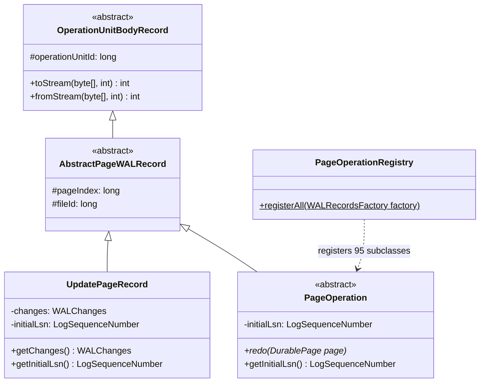
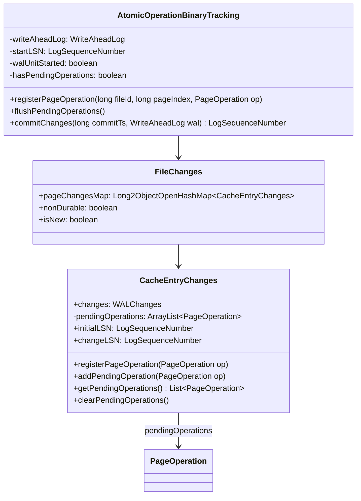
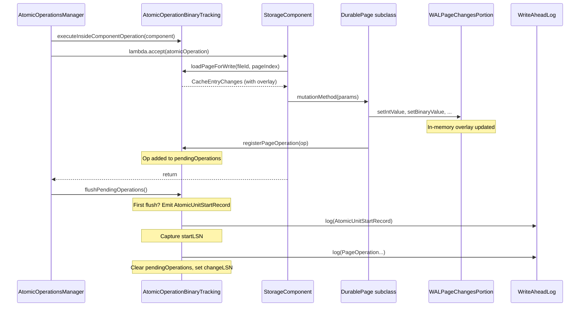
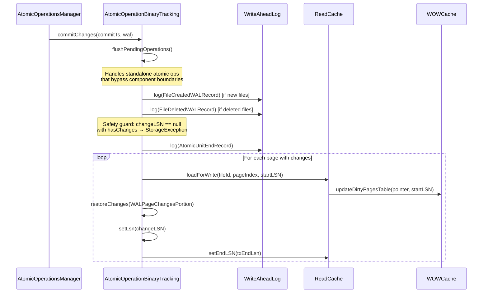
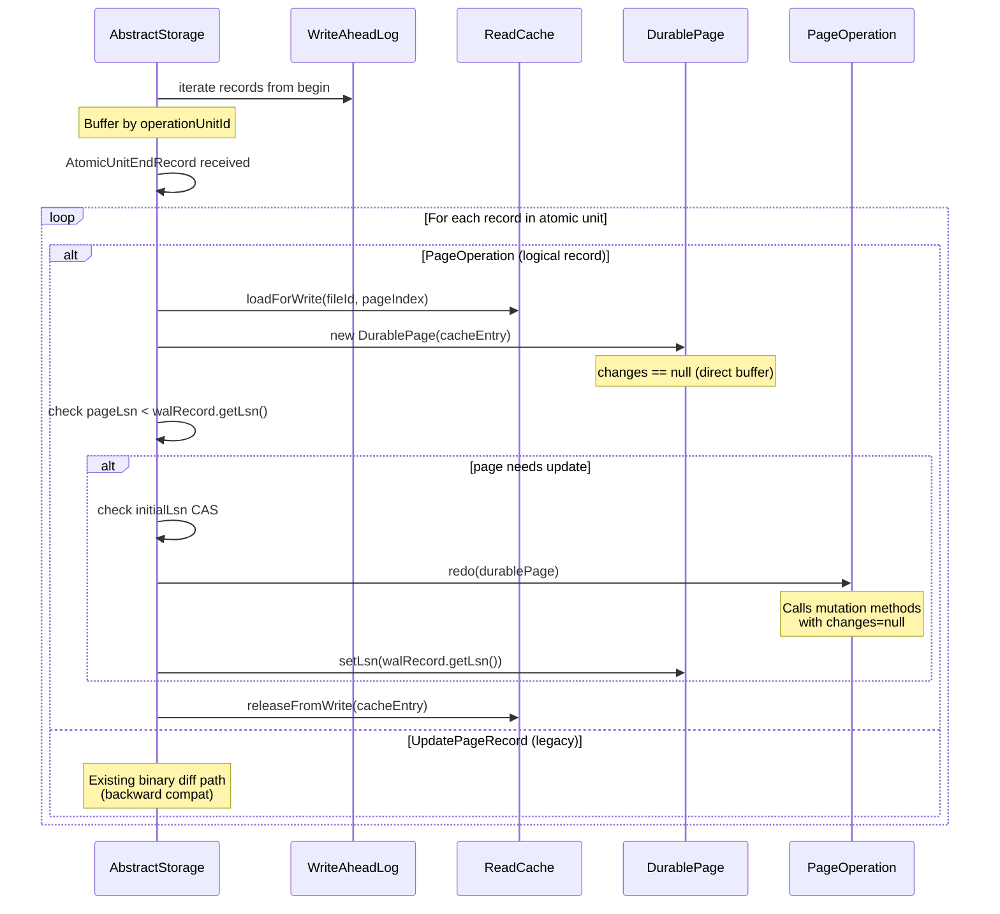

# Physiological WAL Logging — Final Design

## Overview

This feature replaced the binary-diff WAL mechanism (`UpdatePageRecord` +
`WALPageChangesPortion` serialization) with page-level logical WAL records.
Each record describes the operation performed on a page (e.g., "add leaf entry
at index I") rather than the byte-level changes. The in-memory overlay
(`WALPageChangesPortion`) is unchanged — it continues to provide
read-through/write-through during atomic operations.

**Key deviations from original plan:**
- `PaginatedVersionStateV0` and versionmap `MapEntryPoint` dropped from scope
  (dead code — zero external references).
- Multi-value bucket `addAll`/`shrink` split into leaf/non-leaf variants (4 ops
  instead of 2) due to structured entry format differences.
- `CollectionPageAppendRecordOp` gained `entryPosition` and `holeSize` fields
  (not in original plan) — required for deterministic crash recovery redo of
  the hole-reuse path.
- `WALRecordsFactory` uses dynamic `registerNewRecord()` API instead of
  switch-statement entries for new record types.
- `commitChanges()` retains the `WriteAheadLog` parameter (not removed as
  originally planned) — used for consistency assertion with the instance field.

**Final count:** 95 `PageOperation` subclasses (WAL record type IDs 201–295)
covering 11 page type families across 7 packages.

## Class Design

### PageOperation Type Hierarchy



`PageOperation` (core `wal/PageOperation.java:40`) extends
`AbstractPageWALRecord`, inheriting `fileId`, `pageIndex`, and
`operationUnitId` from the parent chain. It adds:
- `initialLsn` — the page's LSN when first loaded for write (12 bytes: 8
  segment + 4 position). Used as a CAS diagnostic check during recovery.
- Abstract `redo(DurablePage page)` — each concrete subclass implements the
  mutation using the same DurablePage methods as normal operation, but with
  `changes == null` (direct buffer writes).

`PageOperationRegistry` (core `wal/PageOperationRegistry.java:106`) provides a
synchronized `registerAll()` method that registers all 95 types with
`WALRecordsFactory.registerNewRecord()`. Called from both `AbstractStorage.open()`
and `create()` paths, before `recoverIfNeeded()`.

`UpdatePageRecord` is retained for backward-compatible deserialization of old
WAL files. Its creation path in `commitChanges()` has been removed and replaced
with a `StorageException` safety guard.

### Accumulation in AtomicOperation



`CacheEntryChanges` gained a lazy `pendingOperations` list (ArrayList) alongside
the existing `WALChanges changes` field. The `registerPageOperation()` convenience
method delegates to the atomic operation's `registerPageOperation()`.

`AtomicOperationBinaryTracking` receives the `WriteAheadLog` reference at
construction time (from `AtomicOperationsManager.startAtomicOperation()`).
`walUnitStarted` and `startLSN` are promoted from local `commitChanges()`
variables to instance fields, shared between `flushPendingOperations()` and
`commitChanges()`. The `hasPendingOperations` boolean provides a zero-cost
fast-path for the flush hook when no ops are pending.

### Page Type Families and Operation Counts

| Page Type Family | Package | Ops | IDs |
|---|---|---|---|
| PaginatedCollectionStateV2 | `storage.collection.v2` | 2 | 201–202 |
| CollectionPage | `storage.collection.v2` | 5 | 203–207 |
| CollectionPositionMapBucket | `storage.collection.v2` | 5 | 208–212 |
| FreeSpaceMapPage | `storage.collection.v2` | 2 | 213–214 |
| DirtyPageBitSetPage | `storage.collection.v2` | 3 | 215–217 |
| MapEntryPoint (v2) | `storage.collection.v2` | 1 | 218 |
| CellBTreeSingleValueEntryPointV3 | `index.engine.singlevalue.v3` | 4 | 219–222 |
| CellBTreeSingleValueV3NullBucket | `index.engine.singlevalue.v3` | 3 | 223–225 |
| CellBTreeSingleValueBucketV3 | `index.engine.singlevalue.v3` | 13 | 226–238 |
| CellBTreeMultiValueV2EntryPoint | `index.engine.multivalue.v2` | 4 | 239–242 |
| CellBTreeMultiValueV2NullBucket | `index.engine.multivalue.v2` | 5 | 243–247 |
| CellBTreeMultiValueV2Bucket | `index.engine.multivalue.v2` | 16 | 248–263 |
| SBTreeNullBucketV2 | `sbtree.local.v2` | 3 | 264–266 |
| SBTreeBucketV2 | `sbtree.local.v2` | 15 | 267–278 |
| HistogramStatsPage | `index.engine` | 3 | 279–281 |
| Ridbag EntryPoint | `storage.ridbag.ridbagbtree` | 3 | 282–284 |
| Ridbag Bucket | `storage.ridbag.ridbagbtree` | 11 | 285–295 |
| **Total** | | **95** | **201–295** |

## Workflow

### Normal Operation: Page Mutation + WAL Write



After the component operation lambda returns successfully,
`AtomicOperationsManager` calls `flushPendingOperations()`
(`AtomicOperationsManager.java:178` for execute, `:206` for calculate).
On exception, the flush is skipped — pending ops are discarded with the
rolled-back operation.

The `hasPendingOperations` fast-path (`AtomicOperationBinaryTracking.java:445`)
ensures zero overhead for read-only component operations and the calculate path
when no mutations occur.

### Commit: AtomicUnitEndRecord + Cache Application



Key changes from original design:
- `commitChanges()` calls `flushPendingOperations()` at the top
  (`AtomicOperationBinaryTracking.java:694`) for standalone atomic operations
  that bypass `executeInsideComponentOperation` boundaries (e.g., histogram
  snapshot flush). The `hasPendingOperations` fast-path makes this a no-op
  for the normal component operation path.
- No `UpdatePageRecord` creation. Instead, a `StorageException` safety guard
  (`AtomicOperationBinaryTracking.java:753–758`) fails loudly if any durable
  page has WAL changes but no `changeLSN` (indicating missing PageOperation
  registration).

### Crash Recovery: Logical Record Replay



Recovery dispatch (`AbstractStorage.java:5275`) handles both record types:
- `PageOperation`: Load page, construct `DurablePage` with `changes == null`,
  call `operation.redo(page)`. The redo method calls the same mutation method
  used during normal operation — single source of truth for page layout. Because
  `changes == null`, the mutation writes directly to the buffer and does NOT
  register a new `PageOperation` (D4 redo suppression via `instanceof
  CacheEntryChanges` guard).
- `UpdatePageRecord` (line 5206): Existing binary-diff path retained for
  backward compatibility with old WAL files.

## Redo Suppression (D4)

During recovery, `redo()` calls the same mutation method used during normal
operation. This method must NOT register a new `PageOperation` — there is no
active atomic operation. The discriminator is the `changes == null` condition:
mutation methods only register a `PageOperation` when the cache entry is a
`CacheEntryChanges` instance (normal operation with overlay). During recovery,
the page is constructed from a plain `CacheEntryImpl` (not `CacheEntryChanges`),
so the `instanceof CacheEntryChanges` guard evaluates to false.

Pattern used in all 11 page type families:
```java
void mutationMethod(params) {
    // ... apply mutation via setIntValue, setBinaryValue, etc. ...
    if (cacheEntry instanceof CacheEntryChanges cec) {
        cec.registerPageOperation(new SomeMutationOp(pageIndex, fileId, ...));
    }
}
```

## CollectionPage appendRecord — Deterministic Redo

`CollectionPage.appendRecord()` was the most complex redo case. The method has
a non-deterministic free-list scan (`findHole()`) that coalesces adjacent holes
during normal operation. Redo must reproduce the exact page layout, which
required capturing additional state:

- `entryPosition`: the exact position where the record was placed (computed by
  the normal path's free-list scan or free-pointer decrement)
- `holeSize`: the coalesced hole size (may exceed any individual hole marker on
  the page, because `findHole()` merges adjacent holes)
- `allocatedIndex`: the position map entry index for the record

The redo path uses `appendRecordAtPosition()` — a dedicated method
(`CollectionPage.java`) that writes directly to the captured position, handling
both hole-split (inserts remainder hole marker) and free-pointer paths
deterministically.

This was caught by the dimensional code review's crash-safety agent — the
original implementation used `requestedPosition` which did not account for hole
coalescing.

## WAL-Before-Data Invariant

The durability invariant is preserved through the same three-layer mechanism as
before, with logical records written earlier than binary diffs were:

1. **startLSN anchors segment retention.** Captured when `AtomicUnitStartRecord`
   is emitted (now at first component operation boundary, not in `commitChanges`).
   Pages receive `startLSN` via `updateDirtyPagesTable()` during cache
   application. Prevents WAL truncation of the segment containing all records.

2. **endLSN gates page flush.** `AtomicUnitEndRecord`'s LSN is set on each
   cache entry. WOWCache blocks flushing until `WAL.flushedLsn >= endLSN`.
   Since `AtomicUnitEndRecord` is the last record, flushing up to `endLSN`
   guarantees all earlier logical records are on disk.

3. **Cache application happens after all WAL records.** Pages enter the write
   cache only in `commitChanges()`, after `AtomicUnitEndRecord`. No dirty page
   can be flushed before all WAL records exist.

Early WAL writes (at component boundaries) are safe because pages are not in
the write cache yet — `WALPageChangesPortion` overlays exist only in
`AtomicOperationBinaryTracking`'s `CacheEntryChanges`. If a crash occurs between
early writes and `commitChanges`, recovery discards the incomplete atomic unit
(no `AtomicUnitEndRecord`).

## Standalone Atomic Operations

Some operations (e.g., histogram snapshot flush) use
`executeInsideAtomicOperation()` directly, bypassing
`executeInsideComponentOperation()` boundaries. For these, `flushPendingOperations()`
is never called at component boundaries. The call at the top of `commitChanges()`
(`AtomicOperationBinaryTracking.java:694`) handles this case. The
`hasPendingOperations` fast-path makes it a no-op for the normal path where ops
were already flushed at component boundaries.

## Serialization Strategy

Each `PageOperation` subclass implements `serializeToByteBuffer()` /
`deserializeFromByteBuffer()` (protected abstract extension points from
`OperationUnitRecord`). Serialization captures operation parameters as raw bytes
— serialized keys, values, entry indices, flags — not Java objects. This avoids
dependency on key/value serializers during recovery (schema may not be loaded).

`WALRecordsFactory` uses a dynamic `registerNewRecord()` API with a
`ConcurrentHashMap<Integer, Supplier>` (`idToTypeMap`) instead of switch-statement
entries. The ID validation assertion (`id >= PAGE_OPERATION_ID_BASE`) prevents
collisions with the existing switch-case IDs. Old PO record IDs (35–198) remain
tombstoned in the switch statement with `throw IllegalStateException`.

## Dead Code Removed

- `UpdatePageRecord` creation path in `commitChanges()` — replaced with
  `StorageException` safety guard
- `WALChanges.toStream(int, byte[])` and `fromStream(int, byte[])` — byte-array
  variants only used by the removed creation path. ByteBuffer variants retained
  for backward-compatible deserialization.
- `PaginatedVersionStateV0` and versionmap `MapEntryPoint` — not converted
  (dead code, zero external references)
- `SBTreeBucketV2.shrink()` `removedEntries` — dead code (populated but never
  read)
- D7 transition `clearPendingOperations()` fallback — dead after full conversion
