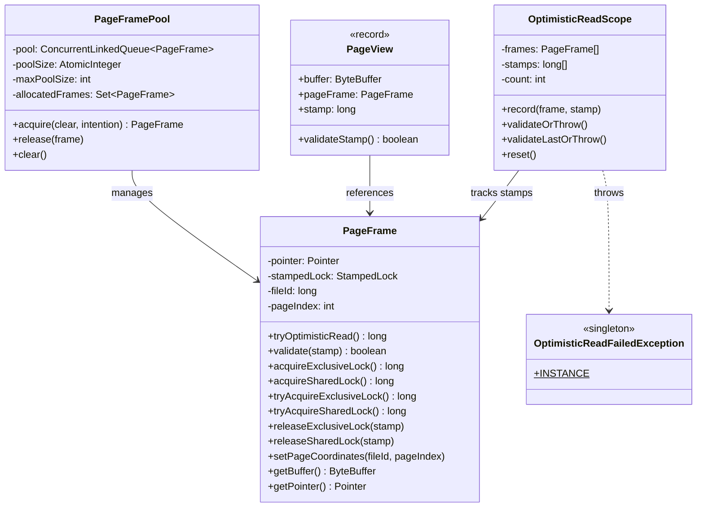
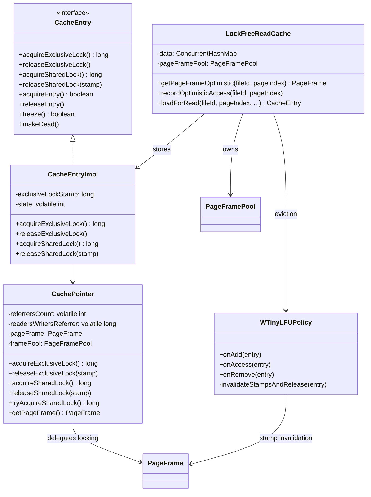
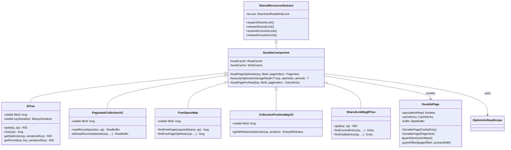
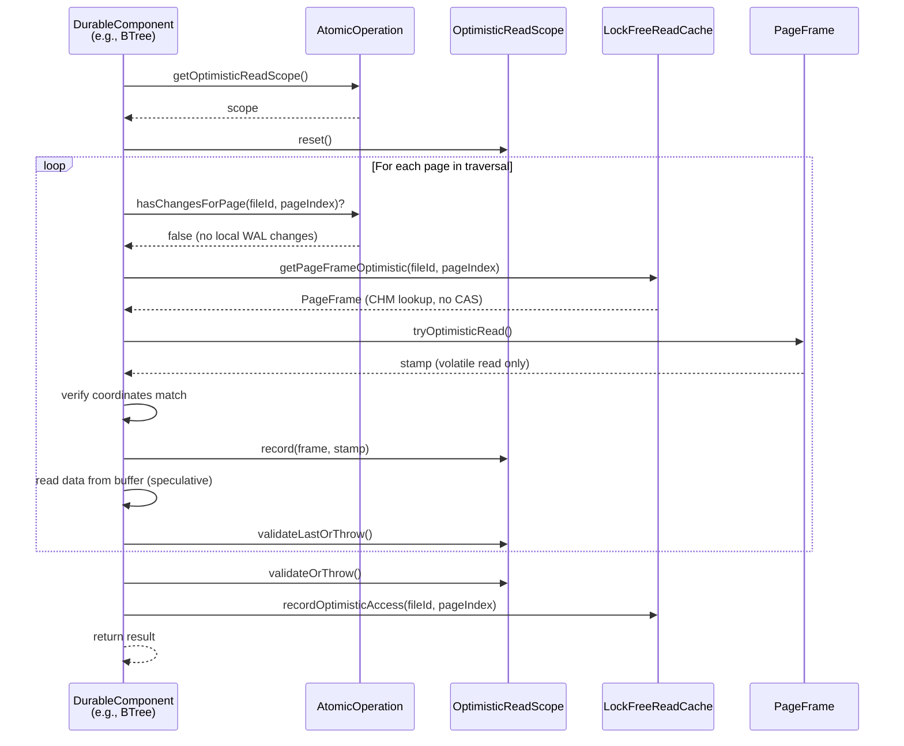
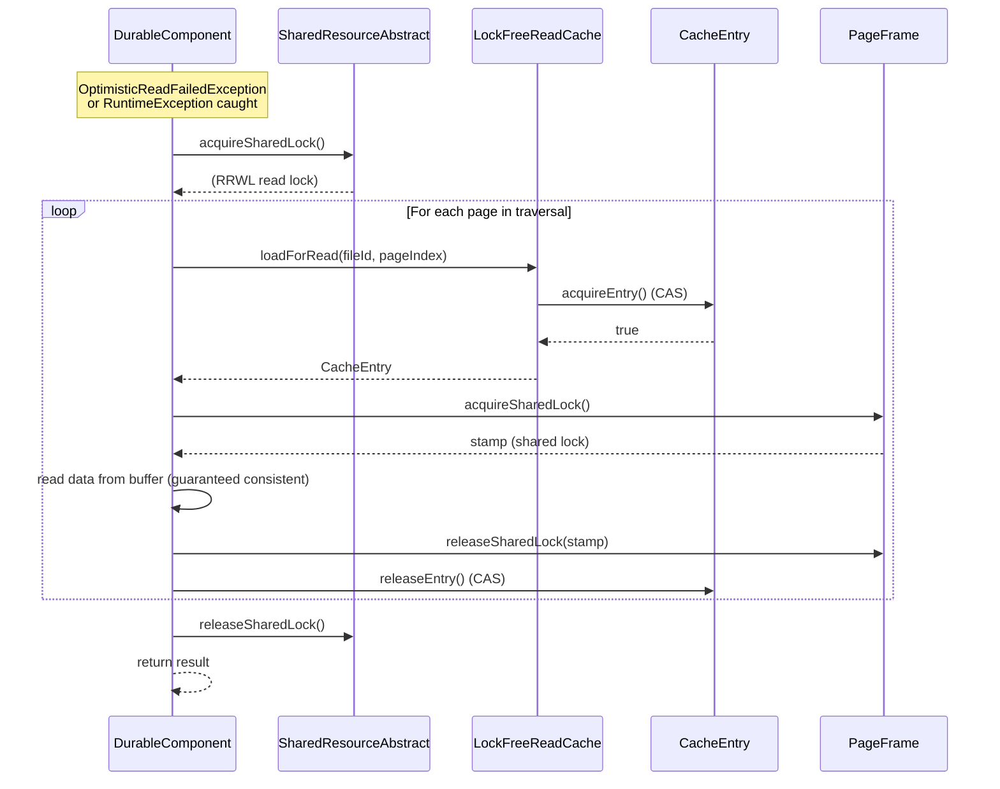
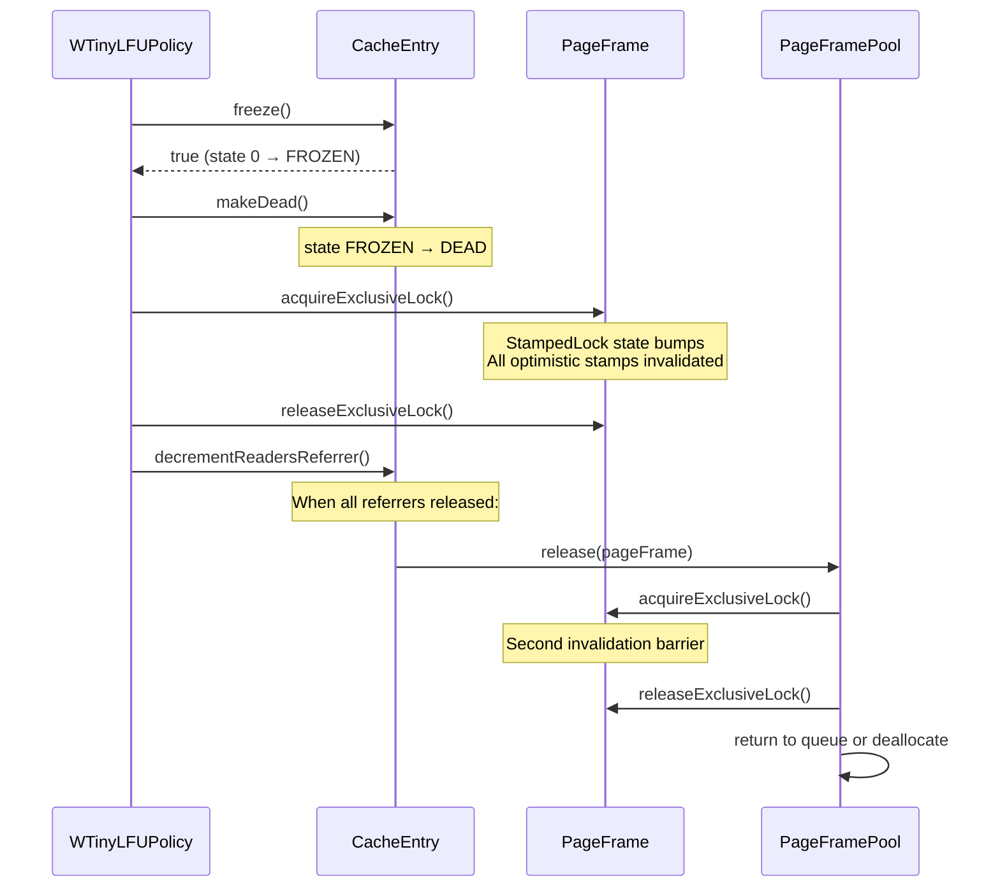

# Pinless Disk Cache Reads — Final Design

## Overview

This feature eliminates CAS-based reference counting on the read hot path by
introducing a StampedLock-based optimistic read protocol. Every DurableComponent
read operation (B-tree lookups, collection reads, free-space map queries, position
map lookups) can now attempt a **zero-CAS optimistic read** that uses only volatile
reads (`tryOptimisticRead()` + `validate()`) for page access validation. When
optimistic validation fails (page evicted, modified, or writer active), the
operation falls back to the existing shared-lock + CAS-pinned path — never worse
than the pre-feature baseline.

**Key deviations from the original plan:**
- Track 6 (Handle AtomicOperation with local WAL changes) was fully subsumed by
  Track 5 — the `hasChangesForPage()` guard was implemented as an integral part
  of the DurableComponent migration rather than a separate track.
- The component-level `StampedLock` in `SharedResourceAbstract` was replaced with
  `ReentrantReadWriteLock` (RRWL), not removed entirely. RRWL provides native
  reentrancy and write-to-read downgrade, simplifying the lock hierarchy.
- Cursor/iterator methods (stateful spliterator-based) remain on the pinned path
  with explicit `acquireSharedLock()` — they mutate iteration state on each call,
  making optimistic retry unsafe.
- `PageFramePool` auto-sizes from `2 * DISK_CACHE_SIZE / PAGE_SIZE` rather than
  deriving from `DIRECT_MEMORY_POOL_LIMIT`, which was unbounded and caused OOM.

## Class Design

### Core Infrastructure

**PageFrame** wraps a `Pointer` (direct memory) and a `StampedLock`. The
StampedLock provides three access modes: optimistic (volatile read only, no CAS),
shared (read lock), and exclusive (write/eviction lock). Page coordinates
(`fileId`, `pageIndex`) are non-volatile fields — visibility is guaranteed by
StampedLock memory fences. This is the central synchronization primitive replacing
the former `ReentrantReadWriteLock` + `version` field in `CachePointer`.

**PageFramePool** recycles `PageFrame` objects using a `ConcurrentLinkedQueue`
with an `AtomicInteger` size counter. Frames are never deallocated during normal
operation (protective memory allocation), so any Java reference to a PageFrame
always points to valid mapped memory. On `acquire()`, an exclusive lock
acquire/release cycle invalidates stale stamps. On `release()`, the same cycle
ensures no concurrent optimistic readers before pooling. Pool overflow triggers
deallocation only after the exclusive lock barrier. The `allocatedFrames` tracking
set enables `clear()` to deallocate leaked frames at shutdown. Pool size auto-sizes
from `2 * DISK_CACHE_SIZE / PAGE_SIZE` (configurable via
`PAGE_FRAME_POOL_LIMIT`).

**PageView** is an immutable record holding a speculative buffer snapshot, the
source `PageFrame`, and the optimistic stamp. It is the return type of
`DurableComponent.loadPageOptimistic()`. Buffer contents may be stale —
`validateStamp()` (or scope-level validation) must succeed before trusting the
data.

**OptimisticReadScope** accumulates `(PageFrame, stamp)` pairs during a multi-page
operation (e.g., B-tree traversal). It provides two validation modes:
`validateLastOrThrow()` for per-level early detection of stale pointers, and
`validateOrThrow()` for end-of-operation whole-operation consistency. The scope is
reusable via `reset()` and is owned by `AtomicOperationBinaryTracking` (one per
transaction).

**OptimisticReadFailedException** is a singleton `RuntimeException` with
suppressed stack trace. It signals a non-error condition (page evicted/modified)
and is caught by `executeOptimisticStorageRead()` to trigger fallback. Zero
allocation overhead on the hot path.

### Cache Integration

**CachePointer** delegates all locking to `PageFrame`'s `StampedLock`. Lock
methods return/accept `long` stamps instead of void. The former
`ReentrantReadWriteLock` and `version` field have been removed. Reference counting
(`referrersCount`, `readersWritersReferrer`) remains for cache entry lifecycle
management — it is orthogonal to the optimistic read protocol.

**CacheEntry / CacheEntryImpl** expose stamp-based lock methods. The exclusive
lock stamp is stored in a non-volatile field (`exclusiveLockStamp`) — safe because
exclusive locks are single-writer. Shared lock stamps are returned to callers and
not stored (multiple concurrent holders). The state machine (alive >= 0, FROZEN =
-1, DEAD = -2) governs entry lifecycle transitions.

**LockFreeReadCache** adds two methods for the optimistic path:
`getPageFrameOptimistic()` performs a ConcurrentHashMap lookup without `acquireEntry()`
CAS, returning the raw `PageFrame` reference. `recordOptimisticAccess()` bumps
the eviction policy's frequency sketch after stamp validation succeeds. The
existing `loadForRead()` path (with CAS pinning) remains for the fallback path.

**WTinyLFUPolicy** adds `invalidateStampsAndRelease()` to the eviction path. When
an entry is evicted, the method acquires and immediately releases the PageFrame's
exclusive lock — this bumps the StampedLock state, invalidating all outstanding
optimistic stamps. This is called from all three eviction sites: eden purge,
probation victim, and direct removal.

### DurableComponent Hierarchy

**SharedResourceAbstract** uses `ReentrantReadWriteLock` (not `StampedLock` as
originally planned). RRWL provides native reentrancy and write-to-read downgrade.
The `acquireSharedLock()` method short-circuits to a no-op when the calling thread
already holds the exclusive (write) lock — the exclusive lock is strictly
stronger.

**DurableComponent** provides the two key helper methods:
- `loadPageOptimistic()` — returns a `PageView` without any CAS or lock. First
  checks `hasChangesForPage()` to force fallback for pages with local WAL changes.
  Then does a CHM lookup, takes an optimistic stamp, validates page coordinates,
  and records the frame+stamp in the `OptimisticReadScope`.
- `executeOptimisticStorageRead()` — orchestrates the optimistic-then-fallback
  pattern. Catches `RuntimeException` and `AssertionError` (speculative reads
  from stale frames can produce AIOOBE, NPE, or assertion failures). On success,
  records optimistic accesses for the eviction frequency sketch.

**DurablePage** has a second constructor accepting `PageView` for speculative
reads. When `speculativeRead == true`, `cacheEntry` is null and buffer contents
are speculative. Guard methods (`guardSize`, `guardOffset`) check bounds before
every buffer read to prevent OOM from garbage size fields. All setter methods
call `assertNotSpeculative()` to prevent writes to the shared buffer.

**DurableComponent subclasses** follow the same pattern: volatile set-once fields,
optimistic read lambda + pinned fallback lambda passed to
`executeOptimisticStorageRead()`. The `executeReadOperation` / `readUnderLock`
wrappers have been removed entirely.

## Workflow

### Optimistic Read Path (Happy Path)

The optimistic read path performs **zero CAS operations**. The cache lookup is a
plain `ConcurrentHashMap.get()` (no `acquireEntry()`). The stamp acquisition and
validation are volatile reads. Per-level validation (`validateLastOrThrow()`)
catches stale pointers early during multi-level traversals, limiting wasted work.
End-of-operation validation (`validateOrThrow()`) ensures the entire page set
forms a consistent snapshot. Frequency recording happens only after successful
validation.

### Fallback Path (Optimistic Validation Failed)

The fallback path acquires the component-level shared lock (RRWL), then uses the
existing CAS-pinned protocol: `acquireEntry()` increments the entry state field,
`acquireSharedLock()` takes the PageFrame's shared lock, and both are released
after reading. This path is identical to pre-feature behavior — never worse than
the baseline.

### Eviction Stamp Invalidation

Eviction acquires the exclusive lock on `PageFrame` before removing the entry.
This bumps the `StampedLock` state, which invalidates all outstanding optimistic
stamps. Any concurrent optimistic reader that calls `validate(stamp)` after this
point will get `false` and fall back to the pinned path. The `PageFramePool`
provides a second invalidation barrier when the frame is returned to the pool.

## WAL Changes Guard

`AtomicOperationBinaryTracking.hasChangesForPage()` forces pages with local
(uncommitted) WAL changes to bypass the optimistic path. This is checked at the
top of `loadPageOptimistic()` — if `true`, the method returns `null` and the
caller falls to the pinned path.

Four cases trigger the guard:
1. **Deleted file** — always returns `true` (file no longer valid)
2. **Truncated file** — always returns `true` (all pre-existing pages invalidated)
3. **New file** — returns `true` if `pageIndex <= maxNewPageIndex`
4. **Modified page** — returns `true` if `pageChangesMap.containsKey(pageIndex)`

The method intentionally skips `checkIfActive()` for hot-path performance — it is
always called within an active atomic operation context.

## Speculative Read Safety (Guard Methods)

Optimistic reads from a PageFrame that has been recycled for a different page
(between the CHM lookup and stamp acquisition) can produce garbage data. Before
stamp validation detects this, the garbage may be used as sizes, offsets, or array
lengths in `DurablePage` and its subclasses.

**Defense-in-depth:**

1. **Page coordinate validation** — after taking a stamp, `loadPageOptimistic()`
   verifies `fileId` and `pageIndex` match the expected values. Frame reuse for a
   different page is caught here.

2. **`DurablePage.guardSize(sizeInBytes)`** — checks that any size-driven
   allocation is non-negative and does not exceed buffer capacity. Throws
   `OptimisticReadFailedException` if violated.

3. **`DurablePage.guardOffset(pageOffset, accessWidth)`** — checks that every
   buffer read is within bounds. Called by all scalar getter methods (`getIntValue`,
   `getLongValue`, `getBinaryValue`, etc.).

4. **Catch-all in `executeOptimisticStorageRead()`** — catches `RuntimeException`
   and `AssertionError` to handle any garbage-induced exceptions that slip past
   the guards. This is the final safety net before fallback.

These guards are **no-ops** when `speculativeRead == false` (normal pinned path),
adding zero overhead to the existing code paths.

## Cursor/Iterator Exemption

Cursor fetch methods (`fetchForwardCachePortionInner`,
`fetchBackwardCachePortionInner` in `BTree`) mutate spliterator state on each
call. The optimistic retry pattern would corrupt this state on retry (the
spliterator position would be wrong). These methods acquire the component-level
shared lock directly via `acquireSharedLock()` and use the pinned page path. This
is the only category of read operations that does not use the optimistic protocol.

## Component-Level Lock Removal

The `executeReadOperation` / `readUnderLock` wrappers that previously acquired the
component-level `StampedLock` in shared mode for every read have been removed from
all DurableComponent subclasses:
- **BTree**: 12 wrappers removed
- **PaginatedCollectionV2**: 14 wrappers removed
- **SharedLinkBagBTree**: 9 wrappers removed

Set-once fields (e.g., `fileId`, `keySerializer`, `keyTypes`) are now `volatile`
across all subclasses. These fields are written only during `create()` / `load()`
(under exclusive lock) and read thereafter — volatile provides sufficient
visibility without per-operation lock acquisition.

Non-migrated read methods (those not yet converted to the optimistic path) route
through `executeOptimisticStorageRead` with a pinned-only lambda (optimistic
lambda throws `OptimisticReadFailedException` immediately), which acquires the
shared lock in the fallback path.

## Small Disk Cache CI Job

A `small-cache-it` Maven profile and `test-small-cache-linux` CI job exercise the
optimistic read fallback path under extreme eviction pressure:
- **Disk cache**: 4 MB (~512 pages with 8 KB page size)
- **Tests**: `BTreeTestIT` (sbtree + edgebtree), `LocalPaginatedCollectionV2TestIT`,
  `FreeSpaceMapTestIT`
- **Dataset sizes**: parameterized via system properties (`keysCount=10000`,
  `maxPower=14`) to keep CI runs under 4 minutes
- **CI**: runs on self-hosted Linux x86, JDK 21, 120-minute timeout. Informational
  (not in `ci-status` gate) with Zulip failure notification

This validates that stamp invalidation is detected correctly, fallback to pinned
path produces correct results, and guard methods catch garbage sizes from reused
frames — all under conditions where eviction is the norm rather than the exception.
