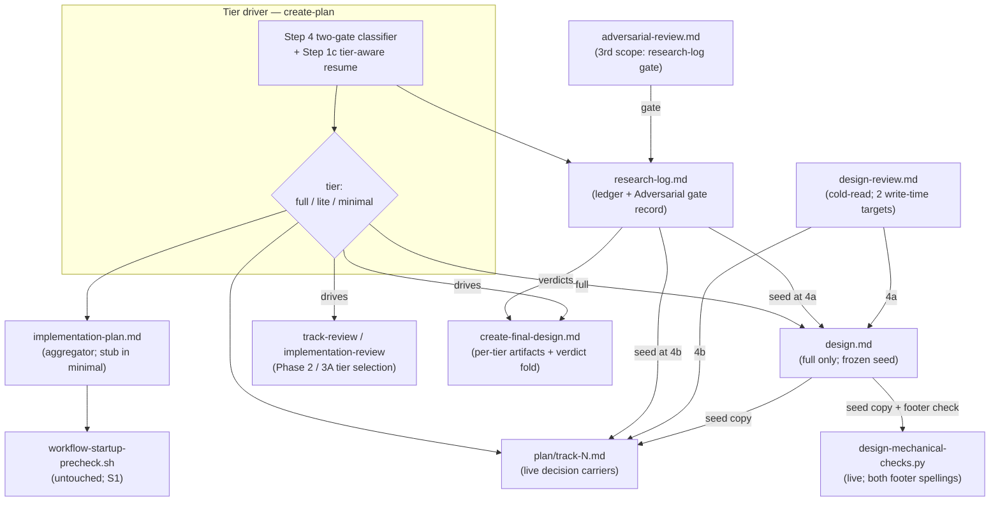

# Complexity-Adaptive Workflow Tiering — Architecture Decision Record

## Summary

The `/create-plan` … `/execute-tracks` workflow now sheds artifacts and review
passes by change complexity. A change is classified into one of three tiers —
`full`, `lite`, `minimal` — at the Phase 0 → Phase 1 boundary, and the tier
decides which artifacts are authored and which review passes run. A one-line fix
no longer pays the ceremony a durability rework needs.

Two additions keep the shedding safe. A durable **research log**
(`research-log.md`) is the single Phase-0/1 decision ledger every tier produces,
so load-bearing decisions are captured and challenged once, up front, regardless
of which later artifacts survive. A **two-gate classifier** (needs a design? spans
multiple tracks?) computes the tier from orthogonal yes/no questions so a
high-stakes-but-small change is expressible. The adversarial review moved off
`design.md` onto the research log; the cold-read comprehension review moved to
artifact write-time with an absorption-completeness criterion; the implementation
plan became a thin aggregator over self-contained track files; decision records
became track-canonical in every tier; and the existing review gates learned to
key off the tier instead of step count. The resume script
`workflow-startup-precheck.sh` and its tests were never edited; resume routing
gained one tier-aware branch in `create-plan` Step 1c.

The change was delivered as workflow-prose edits plus one Python-script edit
across two tracks, staged under §1.7 and promoted to the live tree at Phase 4. It
unifies the prior proposals tracked as YTDB-965 (research log),
YTDB-814/815/817 (inline track decisions, per-track BLUF, per-track files),
YTDB-1083 (introduce-once), and the revived YTDB-832 (write-time cold-read).

## Goals

- Classify every change into `full` / `lite` / `minimal` at the Phase 0 → 1
  boundary via two orthogonal gates, agent-proposed and user-confirmed. **Met.**
- Produce a durable Phase-0/1 research log in every tier and run the adversarial
  review on it as a gate, so load-bearing decisions are challenged once even in
  tiers that shed `design.md`. **Met.**
- Make track files the live decision carrier in every tier: full inline Decision
  Records per track, an aggregator plan (shape-complete stub in `minimal`), and a
  frozen `design.md` seed in `full` only. **Met.**
- Run the cold-read comprehension review at artifact write-time with an
  absorption-completeness criterion: `create-plan` Step 4a (design) and a new
  Step 4b spawn (plan-at-start track sections). **Met.**
- Key Phase 2 and Phase 3A review selection off the tier instead of the
  step-count axis; leave Phase 3B/3C gating unchanged. **Met**, with one widening:
  the Phase-3A Risk trigger now includes major architectural decisions, not only
  critical paths and performance constraints.
- Fold the log's adversarial verdicts into a per-tier durable carrier at Phase 4:
  `adr.md` in `full`/`lite`, a two-line PR-description summary in `minimal`. **Met
  in the staged workflow**; this branch's own Phase 4 ran under the inherited
  (pre-promotion) workflow, so this ADR carries the dogfood verdict trail in Key
  Discoveries rather than through the new fold step.

## Constraints

- **Workflow-modifying plan.** The change edits `.claude/workflow/**`,
  `.claude/skills/**`, and one script outside those prefixes, so §1.7 staging
  applied: every workflow-prefix edit accumulated under
  `_workflow/staged-workflow/.claude/` and the live tree stayed at `develop` state
  until the Phase 4 promotion (I6). The branch is itself `full`-tier under the
  design it implements. **Held.**
- **Resume machinery untouched (S1).** `workflow-startup-precheck.sh` and its
  existing tests stayed byte-identical to `develop`; every tier emits a plan the
  script reads unchanged. The only resume-routing change is the tier-aware branch
  in `create-plan` Step 1c. **Held**, proven by an additive stub-plan fixture.
- **Live-path script edit must stay backward-compatible.**
  `design-mechanical-checks.py` sits outside the §1.7 stageable prefixes, so its
  footer-shape change landed on the live path mid-branch and had to accept both
  the legacy `### References` and the new `### Decisions & invariants` footer, so
  live designs (including this branch's frozen `design.md`) keep passing.
  **Held.**
- **Stamps.** Every `_workflow/**` artifact this plan's execution created carries
  the §1.6 line-1 workflow-sha stamp, except artifacts §1.6(f) excludes (the
  research log joined that exclusion list, and the Phase 4 final artifacts are
  never stamped). **Held.**
- **House style and TOC discipline.** House style (`conventions.md` §1.5) applies
  to every prose surface; staged prose edits maintain the §1.8 per-section
  annotations and TOC regions. The reindexer runs against the staged mirror.
  **Held.**

## Architecture Notes

### Component Map

- **`create-plan/SKILL.md`** — the spine. Step 4 gained the two-gate classifier
  and tier confirmation, Phase 0 gained research-log creation, the adversarial
  gate and the Step 4b cold-read spawn are wired here, the plan/stub/track
  templates changed shape, and Step 1c gained the tier-aware resume branch.
- **`edit-design/SKILL.md`** — lost its adversarial sub-step for
  `phase1-creation` (now cold-read-only); the cold-read is gated behind the
  log-adversarial gate clearing (S3) and gained the absorption criterion.
- **`prompts/adversarial-review.md`** — gained the third scope
  (research-log-scoped review, Phase 0→1) with gate semantics, lens priming, and
  file-mode output.
- **`prompts/design-review.md`** — the cold-read prompt gained the plan-at-start
  track sections as a second target plus the absorption-completeness and
  full-tier fidelity criteria.
- **`research.md`** — Phase 0 rewires to the durable log; the canonical
  `## Adversarial gate record` section is defined here as the verdict carrier.
- **`conventions.md` / `conventions-execution.md`** — glossary terms, §1.2
  per-tier layout, §1.6(f) exclusion for the log, §2.5 review-file access for the
  gate, and the §2.1 `## Decision Log` plan-at-start lifecycle.
- **`design-mechanical-checks.py`** — the live-path footer-shape edit (both
  spellings) plus the decision-cited-without-rationale check, with its own test
  and fixtures.
- **Phase-2/3A review docs** (`implementation-review.md`, `track-review.md`,
  `structural-review.md`, the consistency/structural prompts) — pass selection
  keys off the tier; design-presence conditionals and the duplication-check
  repurpose land here.
- **Execution carrier files** (`inline-replanning.md`, `implementer-rules.md`,
  `plan-slim-rendering.md`) — replan propagation duty, frozen-design guard
  reword, slim-track rendering.
- **Phase 4 files** (`prompts/create-final-design.md`, `workflow.md`
  § Final Artifacts) — per-tier durable artifacts and the adversarial-verdict
  fold.

### Decision Records

#### D1: Aggregator plan in every tier; shape-complete stub in `minimal`

- **Decision**: `implementation-plan.md` is always present as a thin checklist;
  in `minimal` it is a ~10-line shape-complete stub carrying a `## Plan Review`
  section with its decision checkbox, a glyph-valid `## Checklist` with one track
  entry, a `## Final Artifacts` section with its decision checkbox, and the tier
  line. The resume state machine reads the plan unchanged in every tier.
- **Outcome**: As planned. The stub shape is pinned by a live fixture under
  `.claude/scripts/tests/` that runs the unchanged precheck across the State 0 /
  A / C / D / Done transitions. The stub template and that fixture are coupled: a
  future change to which sections the resume machinery reads must update both.
- **Full design**: `design-final.md` Part 4 §"The aggregator plan and the minimal
  stub".

#### D2: Two orthogonal gates instead of an ordinal scale

- **Decision**: factor the tier into Gate 1 (needs a `design.md`?) × Gate 2
  (multi-track?), with names `full` / `lite` / `minimal` chosen to avoid colliding
  with the per-step risk tag (`low`/`medium`/`high`) and the Phase-3A step-count
  axis (Simple/Moderate/Complex).
- **Outcome**: As planned. The first draft named the tiers
  complex/moderate/simple, which collided head-on with the step-count axis; the
  adversarial review of this branch's own research log forced the rename before
  any track derived. A design-needing change is multi-track by construction, so
  three tiers are reachable.
- **Full design**: `design-final.md` Part 1 §"The two gates and the tier map".

#### D3: Tier decided at the Phase 0 → 1 boundary, agent-proposed, user-confirmed

- **Decision**: the agent proposes the tier from the now-rich research log at
  `create-plan` Step 4; the user confirms or overrides. The decision sits before
  any Phase 1 artifact exists.
- **Outcome**: As planned. No circular dependency on a not-yet-derived track
  count; the artifact-shedding choice keeps a human gate.
- **Full design**: `design-final.md` Part 1 §"Timing, proposal, and confirmation".

#### D4: Gate 1 criteria sourced from `risk-tagging.md`, read change-level

- **Decision**: Gate 1's "needs a design" test reuses the HIGH-risk category list
  already in `risk-tagging.md` (concurrency, crash-safety/durability, public API,
  security, architecture/cross-component, performance hot path, workflow
  machinery), read at the change level. Gate 1 is yes when a category is central
  to the change's purpose, not merely touched.
- **Outcome**: As planned. The shared note in `risk-tagging.md` quotes the seven
  HIGH labels verbatim so Gate 1's vocabulary cannot drift from the per-step
  tagging source. The centrally-matched set primes the relocated review's lenses.
- **Full design**: `design-final.md` Part 1 §"Gate 1 criteria and change-level
  aggregation".

#### D5: Research log as the single durable Phase-0/1 decision ledger

- **Decision**: a durable `research-log.md` with five authored sections (initial
  request, decision log, surprises, open questions, baseline/re-validation)
  produced in every tier, consumed by later artifacts and never referenced by
  them. Appends continue through Step 4a authoring, where pre-presentation
  entries re-trigger the gate immediately.
- **Outcome**: As planned, plus a sixth `## Adversarial gate record` section
  added during execution to carry the relocated review's resolved verdicts (see
  D17 and Key Discoveries). The log is removed at Phase 4 cleanup, so its audit
  trail folds into a durable carrier (D16). Read scope is bounded by S2.
- **Full design**: `design-final.md` Part 2 §"The research log".

#### D6: Adversarial review relocated onto the research log

- **Decision**: move the adversarial pass off `design.md` onto the research log
  and run it once at the Phase 0 → 1 boundary as a gate (loop on blockers, gate on
  should-fix, no `skip`). Reuse `prompts/adversarial-review.md` via a third scoped
  section, domain-primed by the matched risk categories. `edit-design` drops its
  adversarial sub-step.
- **Outcome**: As planned, with the gate loop capped at `iteration_budget=3`. The
  log is the only artifact present in all tiers, so `lite`/`minimal` gain
  adversarial coverage they would otherwise lose. This was the only pre-code
  adversarial coverage for those tiers, by intent.
- **Full design**: `design-final.md` Part 3 §"Relocated adversarial review".

#### D7: Track-canonical live decisions; `design.md` as frozen seed in `full`

- **Decision**: every track carries the full inline Decision Record in every
  tier; a cross-track propagation duty keeps duplicated records one logical
  decision through replans. In `full`, `design.md` is a frozen seed (D-records and
  mechanism for derivation, navigation, and `**Full design**` references) —
  provenance, never authority.
- **Outcome**: As planned. The frozen-design guard's wording was re-worded from
  "plan's DRs" to "track's DRs". The slim-track rendering shipped as a doc-only
  orchestrator-prose rule; wiring the existing Phase-3A/3B spawn prompts to
  consume it (they pass the full track file today) is a recorded follow-up.
- **Full design**: `design-final.md` Part 4 §"Track-canonical live decisions".

#### D8: Write-time cold-read with absorption-completeness and fidelity

- **Decision**: run the comprehension review while the author holds context —
  Step 4a on `design.md`, a new Step 4b spawn on the plan-at-start track sections,
  reusing the existing cold-read sub-agent. Both check that every load-bearing log
  decision in a track's scope appears in the carrier; `full` adds seed↔track
  fidelity at authoring time.
- **Outcome**: As planned. The check is semantic with no mechanical backstop, an
  accepted residual risk narrowed to authoring time; post-authoring divergence is
  owned by the propagation duty (D7). The Step-4b cold-read budget is pinned
  inline.
- **Full design**: `design-final.md` Part 5 §"Write-time cold-read and
  absorption-completeness".

#### D9: Tier-driven review selection

- **Decision**: the tier replaces the step-count axis as the Phase-2/3A
  change-level selector. `minimal` drops the Phase-2 structural review and the
  Phase-3A risk/adversarial passes; `lite`/`full` keep a narrowed 3A adversarial
  (track-realization focus; the cross-track-episode challenge drops on track 1
  only). Phase 3B/3C run unchanged.
- **Outcome**: As planned, with one widening: the Phase-3A Risk trigger now adds
  major architectural decisions to its critical-paths-and-performance gate, rather
  than routing architectural decisions to the adversarial pass alone. The live
  Complex-row "or critical path / high-risk" clause was excised from the panel
  selector so no per-step risk signal leaks into panel selection (S4).
- **Full design**: `design-final.md` Part 6 §"Tier-driven review selection".

#### D10: Design-presence conditionals and the Phase 4 audit trail

- **Decision**: key Phase-2 branches on whether `design.md` exists. No-design
  tiers skip the consistency review's design half and the structural duplication
  check; design-destination bloat fixes re-route to track sections in every tier;
  the full-tier duplication check repurposes into the seed↔track fidelity
  verification. Phase 4 folds the log's resolved gate verdicts into the tier's
  durable carrier.
- **Outcome**: As planned. The Phase 4 prompt reads the tier line before touching
  `design.md`, so a `lite`/`minimal` final-designer never dereferences a missing
  design file. Findings already routed before a mid-flight upgrade are not
  retroactively moved.
- **Full design**: `design-final.md` Part 7.

#### D11: Introduce-once reconciliation; footer rename scoped to `design.md`

- **Decision**: adopt the inline-record mechanism (introduce-once,
  reference-thereafter) for tracks via `## Decision Log`; scope the
  `References` → `Decisions & invariants` footer rename and the footer-presence
  mechanical check to `design.md` only. Override the prior log-as-transient
  framing in favor of the durable log (D5).
- **Outcome**: As planned. The live `design-mechanical-checks.py` edit
  (commit 6d9dbafc7f) accepts both footer spellings through one shared regex and
  adds a decision-cited-without-rationale check with a parenthetical-depth gate
  (so a code nested in another's parenthetical does not surface as a bare
  citation). The frozen `design.md`'s inline-rationale footers keep passing.
- **Full design**: `design-final.md` Part 4 §"Inline-record reconciliation".

#### D12: Mid-flight tier upgrade rides the inline-replan ESCALATE path

- **Decision**: an upgrade adds the new tier's artifacts and runs its Phase-3A
  passes from the upgrade point onward; it cannot retroactively insert a review
  the workflow has moved past, and downgrades are likewise not automatic.
- **Outcome**: As planned, sharpened during execution: an upgrade writes the new
  tier into the plan's tier line as its first landed artifact, because the
  re-entered Phase-2/3A selectors read that line. This inline-replan rewrite is the
  one execution-time exception to the rule that only `create-plan` writes the tier
  line.
- **Full design**: `design-final.md` Part 1 §"Mid-flight tier upgrade".

#### D13: §1.7 staging for this workflow-modifying branch

- **Decision**: keep live `.claude/**` at `develop` state while staged edits
  accumulate under `_workflow/staged-workflow/.claude/` until the Phase 4
  promotion. The plan is authored under the current live workflow, not the rules
  it proposes.
- **Outcome**: As planned. Files outside the three stageable prefixes (the
  mechanical-check script) got explicit backward-compatibility handling.
- **Full design**: `design-final.md` Part 7 §"Staging for this workflow-modifying
  branch".

#### D14: Tier-keyed adversarial model triage

- **Decision**: `full` spawns Fable 5, `lite`/`minimal` spawn Opus 4.x for every
  adversarial-reviewer spawn (the Phase 0→1 gate and the narrowed 3A pass), with a
  planned xhigh-effort pin on both. Stakes dominate coverage; the Fable premium is
  charged only to `full`.
- **Outcome**: Partially as planned, exactly along the documented degradation
  order. The model half lands on the Agent tool's `model` field. The harness
  exposes no per-spawn effort field, and no adversarial-reviewer agent file exists
  under `.claude/agents/` (the reviewers are prompt-file plus `general-purpose`
  spawns), so the effort half has no surface to ride and degrades to the session
  default. Neither outcome reopens the decision.
- **Full design**: `design-final.md` Part 3 §"Reviewer model triage".

#### D15: Review-iteration batching for review-hold findings

- **Decision**: once a frozen-ready artifact is presented for user review,
  findings queue (`[clarification]` / `[decision]`) and process as one batch — one
  gate run with whole-batch re-challenge, one mutation, one cold-read with
  loop-back — dividing the D14 premium by batch size. The queue survives
  multi-session holds via the mid-phase handoff.
- **Outcome**: As planned, with the batch gate capped at `iteration_budget=3` and
  the single-finding escape hatch given its own cold-read loop-back. The user may
  waive the queue for a single blocking finding.
- **Full design**: `design-final.md` Part 3 §"Review-iteration batching".

#### D16: Per-tier durable artifacts and the lens set

- **Decision**: `full` keeps `design-final.md` + `adr.md`; `lite` keeps `adr.md`;
  `minimal` folds a two-line gate-verdict summary into the PR description and
  writes no `docs/adr/` entry. Gate 2 is the durable-ADR boundary. The lens set is
  the centrally-matched categories plus explicit user additions at confirmation.
- **Outcome**: As planned. A workflow-modifying `minimal` branch still runs its
  §1.7(f) promotion — the shed removes the fold, not the rest of Phase 4.
- **Full design**: `design-final.md` Part 7 §"The Phase 4 audit trail".

#### D17: Gate output as §2.5 review files with thin-manifest return

- **Decision**: every third-scope adversarial spawn persists a
  `conventions-execution.md` §2.5 manifest-plus-sections review file under
  `_workflow/reviews/` and returns a thin manifest; the orchestrator
  partial-fetches `## Findings`. This caps gate-loop context cost and makes a
  mid-gate `/clear` resumable. §2.5 access extended with `planner` / phase `1`.
- **Outcome**: As planned, resolved at implementation to use §2.5's
  verdict-producer manifest variant for iteration-≥2 runs. The verdict carrier the
  Phase-4 fold reads is the log's `## Adversarial gate record` section (see Key
  Discoveries), not the ephemeral per-iteration review files, which die at
  cleanup.
- **Full design**: `design-final.md` Part 3 §"Reuse and the third scope".

#### D18: The confirmed tier persists as a line in `implementation-plan.md`

- **Decision**: the confirmed tier and its matched categories sit as a one-line
  `tier:` entry directly under the plan title, the one change-level artifact every
  `/execute-tracks` session loads at startup. The stub template includes it.
- **Outcome**: As planned. `create-plan` writes it at confirmation; every
  execution-side consumer reads it read-only, with the mid-flight upgrade (D12) the
  one execution-time writer.
- **Full design**: `design-final.md` Part 1 §"Timing, proposal, and confirmation".

#### D19: `research-log.md` joins the §1.6(f) exclusion list, unstamped

- **Decision**: the research log is an append-only ledger that no §1.6(h) walk
  enumerates and no phase machinery rewrites or re-derives, so it is replay-immune
  by construction — the same exclusion rationale §1.6(f) already records for
  `design-mutations.md`. No script change, no conformance break.
- **Outcome**: As planned. Stamping it would have meant editing all three
  precheck walk sites, which S1 forbids. This branch's own log carries a harmless
  pre-rule stamp that the presence check never fires on.
- **Full design**: `design-final.md` Part 2 §"The research log".

### Invariants & Contracts

- **S1 — resume machinery untouched.** `workflow-startup-precheck.sh` and its
  existing tests stayed byte-identical to `develop`; every tier emits a plan the
  script reads unchanged. Proven by an additive stub-plan fixture and by the
  existing precheck test still passing.
- **S2 — one-way log → carrier seed.** The log is read for decision content in
  exactly two places (Step 4a/4b authoring; the Phase-2 consistency cross-check),
  plus the sanctioned verdict-only Phase-4 fold. After a track absorbs a decision,
  the track is authoritative.
- **S3 — freeze order preserved.** A `design.md` draft cannot reach cold-read
  while a log-adversarial gate entry is open; the gate's state lives in the log's
  `## Adversarial gate record`, and the contract holds across the batch loop-back.
- **S4 — complexity signals never stack.** The tier selects change-level passes
  (Phase 2/3A); the per-step risk tag gates Phase 3B and triage gates Phase 3C. No
  rule combines them into one signal.
- **I6 — live workflow at develop until promotion.**
  `git diff <fork-point> HEAD -- .claude/workflow .claude/skills .claude/agents`
  stayed empty for the branch lifetime; all edits lived in the staged mirror until
  the Phase 4 promotion.

### Integration Points

- `create-plan` Step 4: classifier inserted at the Phase 0 exit, before any
  Phase-1 artifact; Step 1c gained the tier-aware resume branch.
- `edit-design` §Workflow: the adversarial sub-step removed for `phase1-creation`;
  the S3 gate attaches to the cold-read step.
- `prompts/adversarial-review.md`: third scope follows the existing
  design-scope retargeting pattern; spawned with the D14 model param and a D17
  output path.
- `conventions-execution.md` §2.5: TOC row and used-subsection markers extended
  with `planner` / phase `1`; §2.1 `## Decision Log` lifecycle made
  plan-at-start.
- `implementation-review.md` State 0 and `track-review.md` Phase A: pass and panel
  selection read the tier line; design-presence guards key off `design.md`
  existence.
- `prompts/create-final-design.md` Phase 4: the design read is design-presence
  guarded; the verdict fold inserts around the existing §1.7(f) promotion and
  cleanup ordering.

### Non-Goals

- No edits to `workflow-startup-precheck.sh` or its existing tests (S1).
- No changes to Phase 3B/3C gating: the per-step risk tag and the Phase-C triage
  stay as they are (S4).
- No automatic tier downgrade, and no retroactive re-run of reviews skipped or
  completed before a mid-flight upgrade (D12).
- No new reviewer sub-agents: the existing adversarial reviewer and cold-read
  sub-agent are retargeted, not duplicated (D6/D8).
- No `.claude/agents/**` changes: the diff-reviewer agents are out of scope; the
  gate's workflow-machinery lens is a scrutiny stance of the one adversarial
  reviewer, not an agent dispatch.

## Key Discoveries

- **The design is the output of the mechanism it specifies.** This branch's
  research log was the first ledger the relocated adversarial review ran against,
  so the review reshaped the design that defines it. The first pass returned two
  blockers and several should-fix findings and forced the load-bearing structure
  the rest of the design rests on: the shape-complete stub plan and the tier-aware
  resume branch (the "content-free stub / state machine never touched" claim was
  false); the freeze-order ordering rule and the Phase-4 fold that keeps the
  adversarial trail alive past the log's deletion; the `full`/`lite`/`minimal`
  rename away from a name set that collided with the step-count axis; and the move
  of cold-read to write-time rather than folding it into Phase 2. The gate reached
  PASS after iterating those findings to resolution.

- **The freeze-order gate needed a verdict carrier the schema did not define.**
  During execution the cold-read step blocked on a research-log section that
  nothing produced and the log schema did not name, which contradicted the
  file-output decision. The fix defined a canonical `## Adversarial gate record`
  section once in `research.md` — heading shape, match-the-latest-dated-entry
  rule, and cadence — and repointed the five producer and consumer sites
  (`edit-design`, `create-plan`, the batch gate, `conventions-execution.md` §2.5,
  and `prompts/adversarial-review.md`) at it (commit 23b7c0edfb). That section is
  the durable verdict carrier the Phase-4 fold reads; the per-iteration review
  files die at cleanup.

- **The model-triage harness is half-present, and the design said so up front.**
  The Agent tool exposes a `model` field, so the per-tier model split (Fable 5 in
  `full`, Opus 4.x elsewhere) lands cleanly on both the Phase-0→1 gate spawn and
  the Phase-3A adversarial spawn. There is no per-spawn effort field and no
  adversarial-reviewer agent file, so the planned xhigh-effort pin has no surface
  and rides the session default. The decision recorded this exact degradation
  order in advance, so neither outcome reopened it; a future per-spawn effort
  surface or a reviewer agent file would let the effort half land without changing
  the decision.

- **A `risk: high` workflow-prose step can correctly fire zero step-level
  reviewers.** A high-risk step that edits only `.claude/workflow/*.md` matches
  neither the hook-safety nor the prompt-design step-level reviewer glob, so by the
  step-level routing rule it fully defers to the track-level review, which judges
  the multi-file change against the cumulative diff. This is the intended routing,
  not a gap — the step-level dimensional reviewers are scoped to scripts and skill
  prompts, and prose coherence is a whole-diff property.

- **The footer-shape check needed depth-aware citation parsing.** The new
  decision-cited-without-rationale check first produced false positives from
  line-wrapped continuation parentheticals and from a D-code nested inside another
  record's parenthetical. The fix joins each footer entry into one offset-mapped
  string before scanning and clamps a parenthetical-depth counter so only
  top-level codes are evaluated. The frozen `design.md` satisfies the check
  through inline-rationale footers rather than `**Dn.**` full-record markup, and
  the check recognizes both satisfaction paths, so the legacy doc passes without a
  rewrite.

- **A renamed review section needs a post-rebase reference re-check.** Renaming
  the Phase-3A panel section from "Complexity Assessment" to "Tier-driven review
  selection" broke one in-branch cross-reference, repaired in place. Any
  `develop`-side inbound reference to the old name must be reconciled after the
  §1.7(f) rebase that precedes the Phase 4 promotion.

- **The reindexer skips deeply-indented fences.** `workflow-reindex.py` honors
  only fences indented three spaces or less (the CommonMark limit), so a
  more-deeply-indented substitution block is scanned as live prose and its concrete
  `_workflow/<name>.md` path tokens are flagged as unresolved cross-file
  references. The workaround used during execution was role-named placeholders
  with a bare trailing `_workflow/` directory token; the durable fix (teach the
  reindexer to skip indented fences) lives in the live reindexer, outside this
  branch's scope.

## Token usage telemetry

Snapshot from this worktree's sessions over its lifetime (N=22 sessions across 106 transcripts).

### Tool mix — share of total session context

| Component             | Share |
|-----------------------|------:|
| `Read` tool results   | 65.8% |
| `Bash` tool results   | 10.6% |
| `Grep` tool results   | 0.0% |
| `Edit` tool results   | 0.6% |
| Other tool results    | 3.1% |
| Prompts and output    | 19.9% |

### Top files by share of `Read` token consumption

| File                                            | Share of Read |
|-------------------------------------------------|--------------:|
| <outside-worktree>                              | 20.9% |
| docs/adr/plan-slimization/_workflow/design.md   | 9.3% |
| .claude/workflow/implementer-rules.md           | 6.5% |
| docs/adr/plan-slimization/_workflow/plan/track-1.md | 5.9% |
| docs/adr/plan-slimization/_workflow/research-log.md | 5.4% |
| .claude/workflow/prompts/adversarial-review.md  | 3.7% |
| docs/adr/plan-slimization/_workflow/implementation-plan.md | 3.4% |
| docs/adr/plan-slimization/_workflow/plan/track-2.md | 3.0% |
| .claude/scripts/design-mechanical-checks.py     | 2.6% |
| .claude/workflow/conventions-execution.md       | 1.8% |

Generated by `.claude/scripts/measure-read-share.py` against
`~/.claude/projects/-home-andrii0lomakin-Projects-ytdb-plan-slimization/`.
