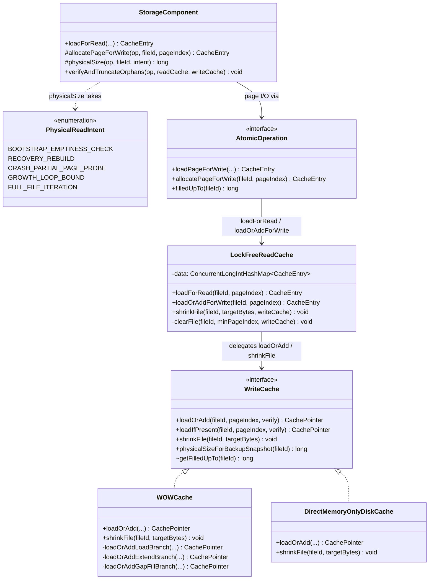
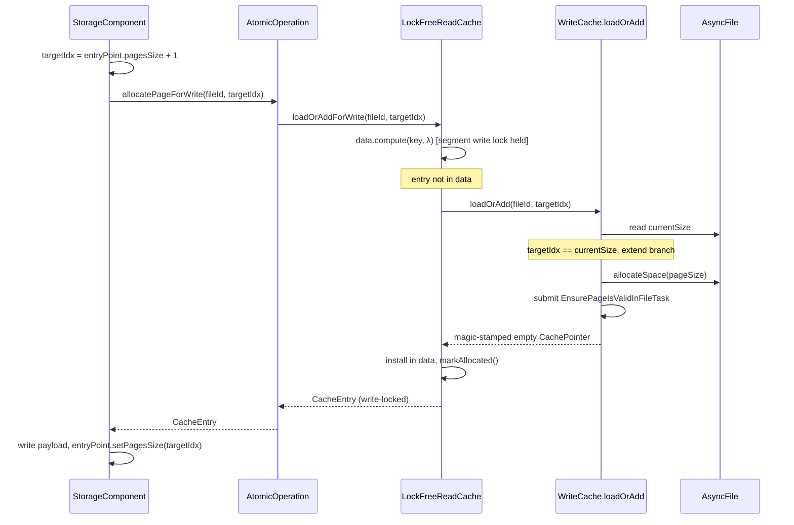
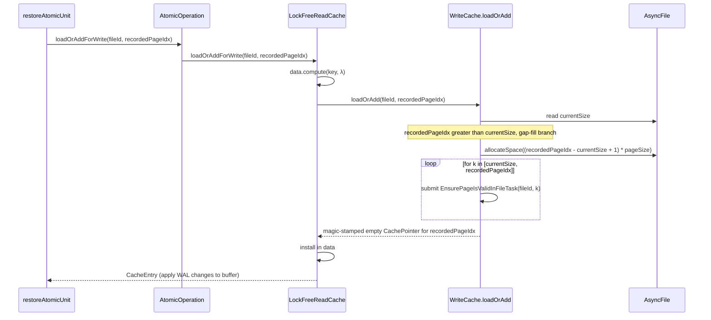
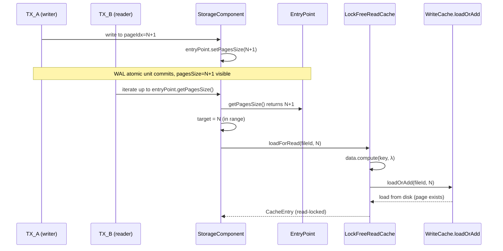

# Read-cache concurrency bug — Design

## Overview

Before this fix, YouTrackDB exposed page allocation through a separate
cache API (`WriteCache.allocateNewPage`) distinct from `WriteCache.load`,
with `WriteCache.getFilledUpTo` publicly readable. A cross-transaction
reader inside its own `data.compute` lambda could learn about a
freshly-allocated pageIndex `N` via `getFilledUpTo` before the
allocator's `putIfAbsent` installed the in-memory `CachePointer` and
before the disk-side magic stamp landed — then either read zeros and
failed the magic check (`StorageException`) or installed its own entry
first and crashed the allocator (`IllegalStateException`), poisoning
the storage.

This design replaces the asymmetric cache surface with one total
primitive: `WriteCache.loadOrAdd(fileId, pageIndex, verifyChecksums)`.
It loads from disk, extends by one page, gap-fills on recovery, and
always returns a usable `CachePointer`.

The read side relies on a pre-existing structural fact: most storage
components maintain a logical page count on an EntryPoint metadata
page, persisted via dedicated WAL operations. EP-less components and
chicken-and-egg / recovery-rebuild sites route through named
audit-gated helpers instead. Together these eliminate the only path
by which a reader could learn about an in-flight pageIndex.

The change cascades into storage components: `addPage` and its 19
external call sites become `AtomicOperation.allocatePageForWrite(fileId,
pagesSize + 1)`; reuse-or-extend probes disappear; the do/while
reconciliation loops in `commitChanges`, `restoreAtomicUnit`, and
`restoreFromIncrementalBackup` collapse; the `internalFilledUpTo`
prediction wrapper goes away. A recovery-time pass at
`AbstractStorage.truncateOrphansAfterRecovery` truncates partial-flush
orphans on EP-equipped components, so post-recovery `logical <=
physical` holds.

Audience: storage-engine maintainers familiar with `WOWCache`, `LockFreeReadCache`, the `AtomicOperation` SPI, and WAL atomic-unit semantics. Decision Records (`D1`-`D6`) and Invariants (`I1`-`I6`) referenced from each section's footer are defined in the companion `adr.md`. The rest covers Core Concepts, Class Design, Workflow, and four dedicated sections on the cache primitive, the allocation discovery surface, the concurrency model, and crash safety.

## Core Concepts

The design uses several pre-existing YouTrackDB types as load-bearing
vocabulary. Each entry defines the concept in one line; the Parts that
follow assume the reader has internalized them.

**`AtomicOperation` / `AtomicOperationBinaryTracking`.** The in-progress
transaction scope. Wraps the WAL atomic unit, tracks per-file
`FileChanges`, and exposes page I/O (`loadPageForWrite`,
`allocatePageForWrite`, `filledUpTo`) under a per-component lock acquired
via `AtomicOperationsManager.executeInsideAtomicOperation` /
`calculateInsideComponentOperation`.

**`WriteCache` (`WOWCache` on disk, `DirectMemoryOnlyDiskCache`
in-memory).** The write-back cache and on-disk page store. Owns
`AsyncFile` handles (disk only), the dirty-page flush worker, and the
async `EnsurePageIsValidInFileTask` queue that idempotently magic-stamps
freshly-extended pages.

**`LockFreeReadCache`.** The read cache layered on top of `WriteCache`.
Holds `CacheEntry` records in a segmented open-addressing map
(`ConcurrentLongIntHashMap<CacheEntry>`) with a `StampedLock` per
segment. `loadForRead` and `loadOrAddForWrite` both delegate to
`WriteCache.loadOrAdd` inside a `data.compute(fileId, pageIndex, λ)`
lambda; they differ only in the lock semantics installed on the
returned entry.

**`CachePointer` / `CacheEntry`.** The page buffer + reference-counted
handle. `CachePointer` is the disk-backed or in-memory buffer; the
`CacheEntry` wraps it with read/write locks the caller acquires before
mutating page content.

**`EnsurePageIsValidInFileTask`.** Asynchronous task on
`wowCacheFlushExecutor` that writes a magic-stamped empty page at the
target offset only if the disk file's actual length is still at or
below that offset. Idempotent. FIFO + monotonic per-fileId by
construction.

**`AsyncFile.allocateSpace(int)`.** Atomic `getAndAdd` on the in-memory
file-size counter; returns the byte offset of the freshly-allocated
extent. The serialization point for cross-key extensions on the same
file.

**WAL atomic unit / `AtomicUnitEndRecord`.** A WAL record group bracketed
by a start/end pair. Recovery replays a unit only if it observed the
end record; partial units are discarded.

**`checksumMode = StoreAndThrow | StoreAndVerify | Off`.** Disk-page
checksum policy. `StoreAndThrow` is the CI default and throws
`StorageException("Page Y is broken in file")` on a stale or zero
checksum at read. `StoreAndVerify` records but doesn't throw. `Off`
neither stores nor verifies. Crash-safety scenarios below cite the
mode where the failure shape changes.

## Class Design



The diagram shows the post-fix shape. Several details are non-obvious:

- `WriteCache.allocateNewPage` and the `AtomicOperation.addPage` /
  `StorageComponent.addPage` methods are **deleted** — they appear in
  pre-fix code but not on this diagram.
- `WriteCache.getFilledUpTo` is `@Deprecated(forRemoval=false)`. JLS
  §9.4 forbids a literal package-private downgrade on an interface
  abstract method, so the audit-gated contract is enforced by the
  deprecation marker plus Javadoc enumerating retained internal callers
  plus the helper-set names (`physicalSizeForBackupSnapshot` on
  `WriteCache`; `physicalSize` on `StorageComponent`).
- `LockFreeReadCache` no longer has an `allocateNewPage` method;
  `loadForRead` and `loadOrAddForWrite` differ only in the lock
  semantics they install on the returned `CacheEntry`.
- The `data` field on `LockFreeReadCache` is
  `ConcurrentLongIntHashMap<CacheEntry>` — a segmented open-addressing
  map keyed by the `(fileId, pageIndex)` long+int pair, with a
  `StampedLock` per segment. There is no `PageKey` class; the key is
  the long+int pair.
- `PhysicalReadIntent` is a public nested enum on `StorageComponent`.
  Five constants document the rationale for each gated physical-size
  read so future readers can audit the call set without re-deriving
  intent from context.
- `StorageComponent.verifyAndTruncateOrphans` is a `public final`
  template method on the abstract base. Three abstract hooks
  (`getOrphanTruncationFileId`, `epLogicalCounter`, `epLogFieldName`)
  plus the overridable `verifyAndTruncateOrphansSiblings` default-no-op
  hook drive per-component dispatch.

`EntryPoint` is the abstract shape most storage components already
carry: a metadata page on pageIndex 0 with a `pagesSize` (or `fileSize`)
field and dedicated WAL ops. The §"Allocation discovery surface"
section enumerates the concrete classes per component and names the
three EP-less components (`FreeSpaceMap`, `CollectionDirtyPageBitSet`,
`IndexHistogramManager`) that route through the gated helpers instead.

### Edge cases / Gotchas

- The `AtomicOperation.allocatePageForWrite` contract is **asymmetric
  across engines**. On the disk engine it is allocator-only — calling
  with a `pageIndex` below the allocation floor throws
  `IllegalStateException` with a site-distinguishing message. On the
  in-memory engine it eagerly installs through `WriteCache.loadOrAdd`,
  because a rolled-back in-memory `addFile` leaves orphan registrations
  and a subsequent TX legitimately sees a `filledUpTo` above the
  logical horizon. A `FileChanges.eagerlyInstalledInCache` flag gates
  the late `readCache.addFile` skip on commit. Class-header Javadoc on
  `AtomicOperationBinaryTracking.allocatePageForWrite` opens with this
  headline.

### References

- D-records: D1, D2, D3, D4
- Invariants: I1, I2

## Workflow

The design has four runtime paths worth diagramming: the write-side
allocation happy path, the recovery gap-fill path, the cross-TX read
path, and the recovery-time orphan-truncation path. The first three run
the same `LockFreeReadCache.data.compute` lambda delegating to
`WriteCache.loadOrAdd`; they diverge only on what `loadOrAdd` does
internally. The fourth is a recovery-only orchestration that shrinks
files holding orphan extents.

### Write-side allocation happy path



The component computes its target pageIndex from local state — the
logical page count plus one. The cache does not return a "next free
pageIndex" anymore; the component states the target, and `loadOrAdd`
either loads (if the page is already on disk) or extends (if it isn't).
`entryPoint.setPagesSize` is the WAL-tracked logical bump that
publishes the new pageIndex to future cross-TX readers.

### Recovery gap-fill path



Replay calls `loadOrAddForWrite` for each WAL record's pageIndex. If
the recorded pageIndex is beyond the current file size, the gap-fill
branch extends the file to the target and submits ensure-valid tasks
for the intervening pages. The replay never sees a partial extension
because `AsyncFile.allocateSpace` is a single atomic `getAndAdd`. The
pre-fix do/while loop in `restoreAtomicUnit` collapses to a single
call.

### Cross-TX read path



`TX_B` learns about `N` only after `TX_A`'s WAL atomic unit has closed
— at which point `pagesSize = N+1` is the committed cross-TX state and
`TX_A`'s page-content modification has been recorded in WAL. The WAL
records themselves may still be in the in-memory log buffer at this
moment; the durability guarantee is the **write-ahead** invariant: any
subsequent flush of pageIndex `N` to disk happens only after `TX_A`'s
WAL records are durable. So when `TX_B` runs, the page at `N` is
either still in the in-memory cache holding `TX_A`'s content or has
already been flushed to disk under WAL protection. `TX_B`'s
`loadForRead` takes the load branch, never the extend branches; the
race vector — a reader observing an in-flight pageIndex via
`getFilledUpTo` — is not reachable from this path.

### Recovery-time orphan-truncation path

```mermaid
sequenceDiagram
    participant AS as AbstractStorage
    participant SC as StorageComponent
    participant EP as EntryPoint
    participant RC as LockFreeReadCache
    participant WC as WriteCache
    participant AF as AsyncFile

    Note over AS: open() after openIndexes (disk: only when wereDataRestoredAfterOpen),<br/>or postProcessIncrementalRestore after flushAllData
    AS->>AS: truncateOrphansAfterRecovery() inside executeInsideAtomicOperation
    loop for each EP-equipped component instance
        AS->>SC: verifyAndTruncateOrphans(op, lfrc, wc)
        SC->>EP: read pagesSize / fileSize (logical)
        SC->>SC: targetBytes = max(pageSize, (epLogicalCounter + 1) * pageSize)
        Note over SC: corruption guard fires when EP.pagesSize == 0 && fileSize > pageSize<br/>(logical-less-than-physical signature) → WARN + skip
        SC->>RC: shrinkFile(fileId, targetBytes, wc)
        RC->>WC: shrinkFile(fileId, targetBytes)
        WC->>AF: getFileSize() [pre-flight inside shrinkFile]
        alt fileSize > targetBytes (orphan present)
            Note over WC: filesLock.writeLock held
            WC->>WC: removeCachedPagesAtLeast(fileId, minPageIndex)
            WC->>AF: shrink(targetBytes)
            WC-->>RC: returns
            RC->>RC: clearFile(fileId, minPageIndex, wc)
            Note over RC: range-scoped segment-map purge of read-cache entries<br/>at pageIndex >= targetBytes / pageSize
            RC-->>SC: returns
            SC->>SC: WARN log: component, fileId, pre/post pages, delta
        else fileSize <= targetBytes (clean)
            WC-->>RC: returns (pre-flight no-op)
            RC-->>SC: returns (no work)
        end
    end
    AS->>AS: orchestrator returns; storage proceeds to first non-recovery TX
```

The orchestrator runs **after** WAL replay has settled logical state
and the flush executor has been drained — either via `recoverIfNeeded`
→ `flushAllData` on the `open()` path or via the explicit
`flushAllData` call on the incremental-restore path. On the disk
`open()` path the dispatch is gated on `wereDataRestoredAfterOpen`
(set true only when this open replayed the WAL), not on a re-read
`isDirty()`: `recoverIfNeeded → flushAllData → clearStorageDirty` has
already cleared the dirty flag by the time the pass would run, so the
field is the surviving "did this open replay WAL" signal. A rolled-back
disk transaction never reaches `commitChanges`, so it leaves no
physical extend, and a graceful close flushes nothing past the logical
horizon; a cleanly-closed disk database is therefore orphan-free and
the pass is skipped (per YTDB-1039 — see the disk-gate design-choice
bullet under §"Recovery-time orphan-truncation: design choices").
`postProcessIncrementalRestore` invokes the pass unconditionally
(it always replayed pages). Inside
`executeInsideAtomicOperation`, the orchestrator iterates the
EP-equipped component instances (single-value BTree, multi-value
BTree, shared-link-bag BTree, position map + paginated collection),
reads each instance's logical page count from its EntryPoint, and
dispatches the layered shrink when physical exceeds the EP-page-floor
target. The two-phase ordering inside `LockFreeReadCache.shrinkFile` —
first `WriteCache.shrinkFile` (write side: writeCachePages range purge
plus `AsyncFile.shrink`), then `clearFile` with `minPageIndex` (read
side: LFRC segment-map purge) — mirrors the pre-existing
`LockFreeReadCache.truncateFile` two-phase pattern.

### Edge cases / Gotchas

- The `writeCachePages` purge during `shrinkFile` is range-scoped, not
  bulk-by-fileId. A bulk purge would silently discard dirty entries at
  `pageIndex < minPageIndex` left by `openCollections` / `openIndexes`
  atomic ops that ran before the recovery pass. The
  `WOWCache.removeCachedPagesAtLeast` and
  `ConcurrentLongIntHashMap.removeByFileId(long, int)` primitives are
  what preserve below-target dirty entries.
- `LockFreeReadCache.shrinkFile` computes `minPageIndex` from its own
  page-size field rather than the WriteCache's, because the in-tree
  `TrackingWriteCache` test mock returns 0 from `pageSize()` and would
  divide by zero. The two values are constructed from the same source
  and are semantically identical.

### References

- D-records: D1, D2, D5, D6
- Invariants: I2, I3, I5, I6

## Cache primitive: loadOrAdd

**TL;DR.** The primitive replaces three asymmetric cache APIs (`load`,
`allocateNewPage`, public `getFilledUpTo`) with one total method. It
loads from disk, extends by one page, or gap-fills on recovery, and
always returns a usable `CachePointer`. The race goes away because
there is no longer a separate "publish in-flight pageIndex" code path
outside `data.compute`'s segment write lock.

The signature is:

```java
CachePointer loadOrAdd(long fileId, long pageIndex, boolean verifyChecksums);
```

The caller is `LockFreeReadCache`, from inside its `data.compute(fileId,
pageIndex, λ)` lambda, after the lambda has confirmed the entry is not
already in `data`. The segment write lock for the target key is held
for the duration of the call.

Inside `loadOrAdd`, the implementation reads `AsyncFile.size` once
atomically, then dispatches to one of three branches based on the
relationship of `pageIndex` to the current size in pages. There is no
separate "orphan re-stamp" branch: a magic-stamped disk-resident orphan
(scenario A in §"Crash safety") is absorbed by the Load existing
branch with no special-casing.

### Branch table

| Branch | Pre-condition | Side effect on `AsyncFile.size` | Side effect on disk | Returned `CachePointer` |
|---|---|---|---|---|
| Load existing | `pageIndex < currentSize` | none | none (read) | content from `loadFileContent` |
| One-page extend | `pageIndex == currentSize` | advances by one page | task submitted | magic-stamped empty buffer |
| Gap-fill | `pageIndex > currentSize` (recovery only) | advances to `pageIndex + 1` pages | task submitted per gap page | magic-stamped empty buffer for target |

The "task submitted" entries refer to `EnsurePageIsValidInFileTask`,
which idempotently writes the magic-stamped empty page to disk only if
the disk file's actual length is still at or below the target offset.
The extend and gap-fill branches both check `allocatedIndex ==
pageIndex` (and `allocatedStartIndex == currentSize` for gap-fill); a
mismatch throws `IllegalStateException` rather than firing under `-da`
silently. These sentinels are what production callers see if the
per-component-lock invariant is ever violated.

### Why the runtime hot path takes only the extend-by-one branch

By the runtime invariant captured under §"Concurrency model" — every
production caller of the write path computes `pageIndex` as
`entryPoint.pagesSize + 1` — `pageIndex` is exactly one beyond
`AsyncFile.size` when no concurrent allocator has raced ahead, and it
equals an existing page when the transaction is performing a normal
write to a previously-allocated index. The gap-fill branch is intended
for WAL replay where a recorded pageIndex may be many pages beyond the
current file size on a freshly-reopened storage. Empirical observation
on heavy concurrent-insert workloads shows the steady-state gap-fill
counter is *not strictly zero*: benign cross-component snapshot-window
races between `LockFreeReadCache.loadOrAddForWrite`'s `filledUpTo` read
and `WOWCache.loadOrAdd`'s own size read fire the gap-fill branch
sporadically (one or two invocations per heavy workload). The
production Javadoc on the test-only invocation counters says "should
not scale with the workload" rather than "stays at zero".

The read path (`loadForRead`) shares the same `loadOrAdd` primitive but
its caller-imposed invariant guarantees `pageIndex < pagesSize <=
currentSize`, so the load branch is the only one reachable. If a buggy
caller violates this — passes a pageIndex beyond the logical surface —
the cache silently extends the file. This is harmless to crash safety
(an empty page leaks; the WAL has nothing recorded for it) and matches
the failure-mode shape of pre-fix read paths (which would return a
broken page).

### Edge cases / Gotchas

- **Concurrent allocators on different `(fileId, pageIndex)`** — the
  segment locks are independent across keys. Both branches' calls to
  `AsyncFile.allocateSpace(getAndAdd)` interleave atomically; the
  in-memory `size` is monotonic. The disk-side
  `EnsurePageIsValidInFileTask` for each page is independent.
- **`EnsurePageIsValidInFileTask` failure** — disk-full or I/O error
  surfaces asynchronously via `WOWCache`'s existing background-error
  reporting. `loadOrAdd` itself returns an in-memory `CachePointer`
  regardless, and the failed disk write is observed at the next
  checkpoint or recovery.
- **`pageIndex == 0` for a fresh file** — pageIndex 0 is normally the
  metadata / EntryPoint page. `loadOrAdd(fileId, 0)` extends from
  `currentSize=0` to `1`; the magic-stamped empty buffer is what every
  `EntryPoint.create()` then overwrites with its initial content.
- **`DirectMemoryOnlyDiskCache.loadOrAdd`** — the in-memory engine has
  no `AsyncFile` and no async stamp task. Its implementation reduces to
  a `ConcurrentHashMap` install of magic-stamped empty buffers under
  the same segment-lock-held lambda, with gap-fill collapsing to a loop
  over `putIfAbsent`. The original `computeIfAbsent` dispatch was
  unsafe: `ConcurrentSkipListMap` does not guarantee the mapping
  function runs at most once, so under contention two threads could
  each acquire a frame, one would win `putIfAbsent`, and the loser's
  frame would leak. The eager-construct + `putIfAbsent` +
  `decrementReferrer`-on-loss pattern closes that window.

### References

- D-records: D1, D5
- Invariants: I2, I3

## Allocation discovery surface

**TL;DR.** Cross-TX readers learn page existence from
`entryPoint.pagesSize` / `entryPoint.fileSize` where the component has
an EntryPoint, and through named audit-gated helpers otherwise. Both
branches close the discovery channel that exposed in-flight pageIndices.
The pre-fix probe / reconciliation surface (per-component
reuse-or-extend, no-pageIndex `addPage`, do/while reconciliation loops)
collapses; `WriteCache.getFilledUpTo` becomes `@Deprecated` +
audit-gated.

### Logical-size surface per component

Most storage components carry a logical page count on a metadata page,
persisted via dedicated WAL operations. Three components have no
EntryPoint — see the post-table note.

| Component | Field | Getter | WAL op |
|---|---|---|---|
| `CellBTreeSingleValueEntryPointV3` | `pagesSize` | `getPagesSize()` | `BTreeSVEntryPointV3SetPagesSizeOp` |
| `CellBTreeSingleValueEntryPointV1` | `pagesSize` | `getPagesSize()` | analogous |
| `CellBTreeMultiValueV2EntryPoint` | `pagesSize` | `getPagesSize()` | `BTreeMVEntryPointV2SetPagesSizeOp` |
| `ridbagbtree.EntryPoint` | `pagesSize` | `getPagesSize()` | `RidbagEntryPointSetPagesSizeOp` |
| `collection.v2.MapEntryPoint` | `fileSize` | `getFileSize()` | `MapEntryPointSetFileSizeOp` |
| `collection.v2.PaginatedCollectionStateV2` | `fileSize` | `getFileSize()` | `PaginatedCollectionStateV2SetFileSizeOp` |
| `versionmap.MapEntryPoint` | `fileSize` | `getFileSize()` | analogous |

Three components have **no EntryPoint metadata page and no logical-size
field at all**: `FreeSpaceMap`, `CollectionDirtyPageBitSet`, and
`IndexHistogramManager`. Their per-component locks plus `loadOrAdd`
totality uphold invariant I1 even without a logical surface;
`getFilledUpTo` reads from these components route through
`StorageComponent.physicalSize` under the per-component lock.

### Migration shape

The 16 pre-fix call sites of `StorageComponent.getFilledUpTo` split
into four groups:

- **Pure-sizing migrations to the logical surface (1 site).**
  `BTree.doAssertFreePages` migrated to `entryPoint.getPagesSize() + 1`
  on `CellBTreeSingleValueEntryPointV3`. The site is a test-only
  assertion path (`-ea` only); it adds a single
  `loadPageForRead(ENTRY_POINT_INDEX)` at method entry to obtain the
  EntryPoint.
- **Reuse-or-extend probes collapsed by `loadOrAdd` (9 sites).** The
  seven originally-typed `BTree.allocateNewPage`,
  `SharedLinkBagBTree.{splitNonRootBucket, splitRootBucket}`,
  `CollectionPositionMapV2.allocate`,
  `PaginatedCollectionV2.allocateNewPage`, plus two growth-loop probes
  previously misclassified as pure-sizing reads:
  `FreeSpaceMap.updatePageFreeSpace` and
  `CollectionDirtyPageBitSet.ensureCapacity`. Both growth loops have
  the shape `for (i = filledUpTo; i ≤ required; i++) addPage(...)` and
  collapse to `allocatePageForWrite(fileId, knownIndex)`.
- **Stay-on-physical via gated helpers (6 sites).** Three EP-equipped:
  bootstrap emptiness checks at `CollectionPositionMapV2.create` and
  `PaginatedCollectionV2.initCollectionState` (the EntryPoint lives on
  the page being checked — chicken-and-egg); FSM-rebuild recovery scan
  at `PaginatedCollectionV2.open` (logical bookkeeping was lost —
  physical-by-design). Three EP-less: defensive physical-presence
  probe at `IndexHistogramManager.readSnapshotFromPage` (with a page-1
  spill discriminator at `flushSnapshotToPage` / `writeSnapshotToPage`,
  see §"Crash safety"); and the two pure-sizing reads in
  `CollectionDirtyPageBitSet.{clear, nextSetBit}`.
- **Storage-quiesced full-file iteration (1 site on
  `WriteCache.getFilledUpTo`).** `DiskStorage.backupPagesWithChanges`
  routes through `WriteCache.physicalSizeForBackupSnapshot` — a named
  alias whose Javadoc documents the post-unfreeze (not strictly
  quiesced) read semantics.

### Why `addPage` is deletable

`StorageComponent.addPage(fileId)` had a no-pageIndex signature: the
cache picked via `allocateSpace.getAndAdd` and the caller learned the
result. This is what forced two pieces of complexity:

- The `internalFilledUpTo` prediction wrapper in
  `AtomicOperationBinaryTracking`, which pre-allocated a synthetic
  pageIndex for the in-progress TX and rewrote it on commit if the
  prediction was wrong.
- The do/while reconciliation loop in `commitChanges`, which called
  `readCache.allocateNewPage` repeatedly until the returned pageIndex
  matched the predicted one (and similarly in `restoreAtomicUnit` and
  `restoreFromIncrementalBackup` during recovery).

Once allocators state the target pageIndex up front — derived from the
component's `entryPoint.pagesSize + 1` — neither prediction nor
reconciliation has anything to do. The 19 external `addPage` call
sites all knew their target from local state. The 20th PSI reference
to `addPage` was the recursive call inside
`StorageComponent.allocatePageForWrite` (the pre-fix
`loadPageForWrite`-then-`addPage` fallback) — its body delegates to
the new cache primitive instead.

WAL is unaffected: page extension stays implicit (no `AddPage*`
record), and the `SetPagesSizeOp` / `SetFileSizeOp` records that
already track logical-size advances continue to do so.

### Edge cases / Gotchas

- **Components without an EntryPoint stay on physical sizing.**
  `FreeSpaceMap`, `CollectionDirtyPageBitSet`, and
  `IndexHistogramManager` have no metadata page and no logical-size
  field. Only `CollectionDirtyPageBitSet.{clear, nextSetBit}` survive
  as pure-sizing reads on physical extent; they route through
  `StorageComponent.physicalSize(op, fileId, PhysicalReadIntent.FULL_FILE_ITERATION)`
  under per-component lock. I1 holds via the lock + `loadOrAdd`
  totality, not by routing through logical state.
- **`PaginatedCollectionV2.open` FSM-rebuild branch.** Runs when the
  FSM file is absent on open (post-crash FSM loss) and rebuilds
  free-space info by iterating every physically existing data page.
  Trusts physical-by-design — logical bookkeeping has just been
  determined unreliable. Routes through `physicalSize(op, fileId,
  PhysicalReadIntent.RECOVERY_REBUILD)`; entire branch is
  storage-quiesced under the component's exclusive lock.
- **Chicken-and-egg emptiness probes.** Both
  `CollectionPositionMapV2.create` and
  `PaginatedCollectionV2.initCollectionState` check "does page 0 exist
  physically?" before instantiating their EntryPoint over page 0. A
  logical read would be chicken-and-egg. Both route through
  `physicalSize(op, fileId,
  PhysicalReadIntent.BOOTSTRAP_EMPTINESS_CHECK)`.
- **`IndexHistogramManager.readSnapshotFromPage` and the page-1 spill
  discriminator.** Defensive physical-presence probe guarding against a
  partial crash between page-0 and page-1 writes in the same atomic
  op. Page-1 specifically is the HLL spill page; the discriminator at
  `IHM.writeSnapshotToPage` / `flushSnapshotToPage` reads
  `op.filledUpTo(fileId) > 1 ? loadPageForWrite : allocatePageForWrite`
  to coexist with the allocator-only contract. The discriminator
  cannot use `loadIfPresent` because that bypasses
  `AtomicOperation.pageChangesMap` and would silently miss in-TX
  writes to page 1.
- **`AtomicOperationBinaryTracking.filledUpTo` has a hidden
  side-effect**: it registers a `FileChanges` placeholder on first call
  for a fileId in a TX. The `StorageComponent.physicalSize` helper
  routes through `atomicOperation.filledUpTo(fileId)` so the
  placeholder side-effect is preserved.
- **Maven build silence on `@Deprecated`.** Build sets
  `<showDeprecation>false</showDeprecation>` and ErrorProne does not
  enable `-Xlint:deprecation`, so deprecation warnings on
  `getFilledUpTo` are silent by default. The contract-stating Javadoc
  carries the audit weight; the `@Deprecated` annotation is the
  opt-in lint hook.

### References

- D-records: D2, D3, D4
- Invariants: I1, I5

## Concurrency model

**TL;DR.** Page extension occurs only inside
`LockFreeReadCache.data.compute`'s segment write lock; per-component
locks serialize concurrent allocators that share a `fileId`. The
combination forecloses both within-key races (two TXs targeting the
same pageIndex) and cross-key races (two TXs extending the same file).

### Lock layering

Three layers of synchronization apply during a `loadOrAdd` call, nested
top to bottom:

1. **Per-component lock** (above the cache). Each storage component
   holds an exclusive lock from `AtomicOperationsManager` (via
   `executeInsideAtomicOperation` /
   `calculateInsideComponentOperation`) before reading
   `entryPoint.pagesSize` and computing `pagesSize + 1`. This is what
   guarantees two TXs operating on the same component-file never
   compute the same target. `PaginatedCollectionV2.allocatePosition`
   and `PaginatedCollectionV2.createRecord` additionally wrap an inner
   `acquireExclusiveLock` on the same `ReentrantReadWriteLock`;
   reentrancy makes the inner call a no-op while the outer lock is
   held, but the inner lock still serializes the two threads if the
   outer is ever dropped.
2. **Segment write lock on `LockFreeReadCache.data`** (held by
   `data.compute` for the duration of the lambda). Serializes
   concurrent attempts to install or update the same `(fileId,
   pageIndex)` cache entry.
3. **Within `WOWCache.loadOrAdd`**: `filesLock.readLock` (allowing
   concurrent file operations) plus `files.acquire(fileId)` (a
   per-file exclusion). The ordering matches the pre-fix
   `WOWCache.allocateNewPage`; `loadOrAdd` does not invert it.

`AsyncFile.size` itself is updated atomically via `getAndAdd` — there
is no separate lock around it. Multiple `loadOrAdd` calls on different
keys can advance the size in interleaved order; the resulting in-memory
size is monotonic.

### Why two TXs cannot race for the same `(fileId, pageIndex)`

Two TXs target the same pageIndex only if they read the same
`entryPoint.pagesSize` and both compute `pagesSize + 1`. The
per-component lock prevents that: only one TX at a time holds the lock
to compute its target. The TX that loses the race waits, then reads
the post-bump `pagesSize` and computes a different target.

Recovery is single-threaded, so concurrent allocators do not exist
during replay.

### Why concurrent readers cannot fabricate an in-flight pageIndex

A cross-TX reader's `loadForRead(fileId, K)` requires
`K < entryPoint.pagesSize`. `pagesSize` is bumped only after the WAL
atomic unit closes — at which point the corresponding page is
materialized in the cache and the disk-side stamp task has been
submitted. The reader cannot observe a `pagesSize` that names an
in-flight page; the race vector is unreachable.

### Edge cases / Gotchas

- **Cross-fileId concurrency** — no shared lock; each file's
  `AsyncFile.size` is independent and atomic. Cross-file allocations
  proceed in parallel without contention.
- **Flush worker concurrency** — the dirty-page flush worker runs in
  its own thread, takes the segment read lock plus the page's content
  lock to read the buffer, and writes to disk. Its interaction with
  `loadOrAdd` is the same as pre-fix `load`: the flush worker reads a
  consistent snapshot of the page content; the `loadOrAdd` extension
  branches do not block on it.
- **`EnsurePageIsValidInFileTask` concurrency** — multiple tasks for
  the same fileId can be in flight simultaneously, each targeting a
  different pageIndex. Each task's `writeValidPageInFile` is
  idempotent and the underlying I/O is serialized by the OS file
  lock; no additional synchronization is needed at the task level.
- **`DirectMemoryOnlyDiskCache`** — has no `AsyncFile` and no per-file
  `files.acquire` lock; the segment lock alone is sufficient because
  all state is in-memory and consistent under `ConcurrentHashMap`'s
  contract.
- **Same-key `loadOrAddForWrite` under contention** — workers that
  hold the returned `CacheEntry`'s exclusive lock until an outer
  cleanup deadlock under same-key MT load. Production callers always
  release the exclusive lock at end-of-atomic-op via
  `releasePageFromWrite`; the same-key MT regression coverage uses
  `loadForRead` (no exclusive acquire) to exercise the segment lock
  without that deadlock shape.

### References

- D-records: D1, D2
- Invariants: I2, I4

## Crash safety

**TL;DR.** Three crash scenarios from the pre-fix allocator+task split
remain handled: in-flight-TX orphan pages are absorbed by `loadOrAdd`'s
load branch (FIFO magic-stamping makes them indistinguishable from
clean pages); WAL replay's extend-and-gap-fill goes through `loadOrAdd`
directly; the recovery-time orphan-truncation pass establishes
`logical <= physical` for every EP-equipped component before the first
non-recovery TX. No new vulnerability is introduced.

`EnsurePageIsValidInFileTask` runs on a single-threaded
`wowCacheFlushExecutor`, and submissions for a given `fileId` are
monotonic in pageIndex by construction (each `loadOrAdd` extension
targets `pagesSize + 1`, serialized by the per-component lock).
FIFO + monotonic submission forecloses sparse-zero interior pages: if
the disk file was extended through pageIndex `K`, every pageIndex in
`[old_size, K]` was stamped in order before the extension to `K+1`
could begin. (A separate ticket tracks the orthogonal torn-write /
OS-writeback durability gap that pre-dates this fix; it is outside
this design's scope.)

### Scenario walk-through

The three crash scenarios apply to a TX that does an extension. They
follow the pre-existing vocabulary: in-memory file size advance via
`AsyncFile.allocateSpace`, asynchronous magic-stamping via
`EnsurePageIsValidInFileTask`, and on-reopen the in-memory size
re-initializes from the disk file's actual length.

#### A. TX in flight, never committed

WAL has no `AtomicUnitEndRecord` for the TX, so replay skips the unit.
`entryPoint.pagesSize` was never bumped (the `setPagesSize` op was
inside the unit). The disk file may or may not have been physically
extended — depends on whether the ensure-valid task ran before the
crash.

On reopen: `AsyncFile.size` re-initializes from disk length. Any
physical extension that survived is an orphan (disk has the page,
component doesn't count it).

For EP-equipped components, the recovery-time orphan-truncation pass
shrinks the file back to `(epLogicalCounter + 1) * pageSize` (floor
`pageSize`) so the next allocator sees a consistent layout. For
EP-less components, the orphan persists; the next allocator's
growth-loop body is empty (its `for (i = filledUpTo; i <= target;
i++)` loop does nothing when `target < filledUpTo`), so no orphan
write happens, but the orphan page is read on next access — under
`checksumMode=StoreAndThrow` (CI default) the stale checksum trips
`StorageException("Page Y is broken in file")` loudly; under
`checksumMode=Off` the orphan is silently adopted as a legitimate
page (which for bitmap-style components is functionally harmless).

Next TX (EP-equipped, post-truncate): reads `entryPoint.pagesSize`,
computes `pagesSize + 1`, calls `allocatePageForWrite`. Inside
`loadOrAdd`: extend branch fires. **Consistent.**

#### B. TX committed, ensure-valid task never ran

WAL has the full atomic unit including `setPagesSize` and the page-
content op (`UpdatePageRecord` / `PageOperation`). Disk file size on
reopen = pre-extension.

On replay: `restoreAtomicUnit` calls `loadOrAddForWrite(fileId, N)`.
Cache: `pageIndex == currentSize`, extend branch fires, advances size,
submits ensure-valid task, returns magic-stamped empty pointer. Replay
applies the WAL changes to the in-memory buffer. Async task runs in
background; idempotent stamp. **Consistent.**

#### C. TX committed, ensure-valid task ran fully

Disk has the magic-stamped empty page from the task, plus (on
checkpoint flush) the TX's actual content. On replay: load branch
fires, magic check passes, replay applies WAL changes to the buffer.
**Consistent.**

### Role of `EnsurePageIsValidInFileTask` in the new design

The task was load-bearing for two reasons in the legacy design:
ensuring the disk file is long enough to read pageIndex `N`, and
stamping the magic so the magic-check leg of recovery passes. Both
reasons remain. The task's role narrows in **scope**, not in
**function**: it is no longer the primary mechanism for "publishing" a
new page (the segment-locked install of the in-memory `CachePointer`
is what publishes), but it is still the mechanism for making the page
durable post-eviction.

### Recovery-time orphan-truncation: design choices

The recovery-time pass establishes invariant I6 (`logical <= physical`
for EP-equipped components after `open()` and
`postProcessIncrementalRestore` return). Several design choices around
it merit calling out:

- **Placement post-flush.** Both entry points — `open()` after
  `recoverIfNeeded` (which calls `flushAllData` internally on dirty
  reopen) and `postProcessIncrementalRestore` after its own
  `flushAllData` — run the pass post-flush so WAL-replay-buffered
  dirty pages settle before truncation. Truncating first would let a
  later flush re-create the orphan.
- **Gated on WAL replay for the disk engine; unconditional where a
  clean close can orphan.** The general rule is that orphan creation
  can survive a crash → clean reopen → clean reclose sequence, so a
  subsequent open with `isDirty() == false` still needs the pass. That
  rule still holds for the in-memory engine, whose rollback leaves
  eagerly-installed pages in place. YTDB-1039 refined it for the disk
  engine: a rolled-back disk transaction never reaches `commitChanges`
  (the physical apply runs only there, and `endAtomicOperation` skips
  it while a rollback is in progress), so it leaves no physical extend.
  A disk orphan therefore requires a crash, and a crash always reopens
  with WAL replay. The disk pass is gated on `wereDataRestoredAfterOpen`
  so a gracefully-closed database reopens in O(1) rather than paying a
  per-component entry-point read. The gate gives up one bounded
  best-effort retry: a transient `shrinkFile` failure on a readable
  component is not re-attempted on the next clean reopen. That loss is
  acceptable because the failure logs a WARN and any later crash
  re-arms the pass. `DiskStorage.postProcessIncrementalRestore` stays
  unconditional (it always replayed pages).
- **EP-page floor.** `targetBytes = max(pageSize, (epLogicalCounter +
  1) * pageSize)` preserves page 0 (the EntryPoint itself) even on
  `epLogicalCounter == 0`. The `+1` arithmetic holds because in all
  four EP-equipped components the counter records the highest occupied
  data-page index relative to the EntryPoint's anchor.
- **Corruption-signature skip-with-WARN.** When
  `epLogicalCounter == 0 && AsyncFile.getFileSize() > pageSize` — a
  `logical < physical`-like signature that WAL replay is designed to
  prevent — the pass logs a WARN and skips truncation. Auto-repair on
  this signature would mask a deeper consistency bug; the recovery
  pass is intentionally non-destructive in that case.
- **Per-component `try`/`catch` in the orchestrator.** Each component
  call is wrapped: an `IOException` from one component logs a WARN
  and the iteration continues. Per-component invariants — not
  per-storage-atomic invariants — are the contract. If a `.cpm`
  truncate succeeds but the `.pcl` companion fails, the next *crash*
  reopen reruns the pass and converges (per YTDB-1039 a clean reopen
  skips the disk pass, so convergence is guaranteed on a later crash
  reopen, not on the next clean one).
- **Tests unaffected by the disk gate.** Two coverage points do not
  observe the YTDB-1039 disk gate. `IndexHistogramSpillRecoveryIT`
  fabricates an orphan and asserts it survives reopen; the histogram
  manager has no truncation hook, so the pass never touched it and the
  gate changes nothing. `AbstractStorageTruncateOrphansAfterRecoveryTest`
  invokes the orchestrator directly and bypasses `open()`, so the
  open-time gate is not on its path.

### Edge cases / Gotchas

- **`AsyncFile.shrink` invariant.** The pre-fix body unconditionally
  did `size.set(0)` regardless of its argument — all callers passed
  `0`, so the bug never fired. Non-zero callers (the recovery-time
  pass) required the body to honour the argument and a no-op guard
  inside the exclusive lock (race-free against concurrent
  `allocateSpace`).
- **EP-less and IHM carve-out: per-mode failure behaviour.** The
  recovery-time pass stays scoped to EP-equipped components. For
  EP-less FSM and `CollectionDirtyPageBitSet`, the post-replay shape
  depends on `checksumMode` (see scenario A above). For
  `IndexHistogramManager`, the page-1 spill discriminator is the
  physical extent itself, so a partial-flush orphan at page 1
  mis-classifies a not-spilled HLL state as spilled — under
  `StoreAndThrow` the HLL deserialise of the orphan bytes trips the
  stale checksum loudly; under `Off` cardinality estimation is silently
  best-effort. Expanding the truncation pass to FSM / CDPB / IHM
  would require per-component logical-state derivation outside the
  EP-driven shape (FSM/CDPB would need state from their parent PCV2;
  IHM would need page-0's `hllSize` flag), so the symptom-surface
  coverage for these three lives in the regression test suite rather
  than the recovery pass.
- **`DoubleWriteLog` interaction.** Anti-tear protection for
  partially-written pages is orthogonal to allocation. Unchanged.
- **In-memory engine.** `DirectMemoryOnlyDiskCache` has no persistence,
  so crash safety is trivially preserved (no disk to diverge from).
  The recovery-time pass dispatches `WriteCache.shrinkFile` as a no-op
  on the in-memory engine; only the LFRC range-clear runs.
- **LogManager format-string trap.** `LogManager.warn(this, "format-%s",
  arg1, arg2)` silently picks a different overload when `arg1` is a
  String, consuming the first arg as a database-name parameter and
  dropping it from substitution. The four corruption-guard WARN sites
  pre-format the message via `String.format` eagerly.

### References

- D-records: D1, D5, D6
- Invariants: I3, I5, I6
