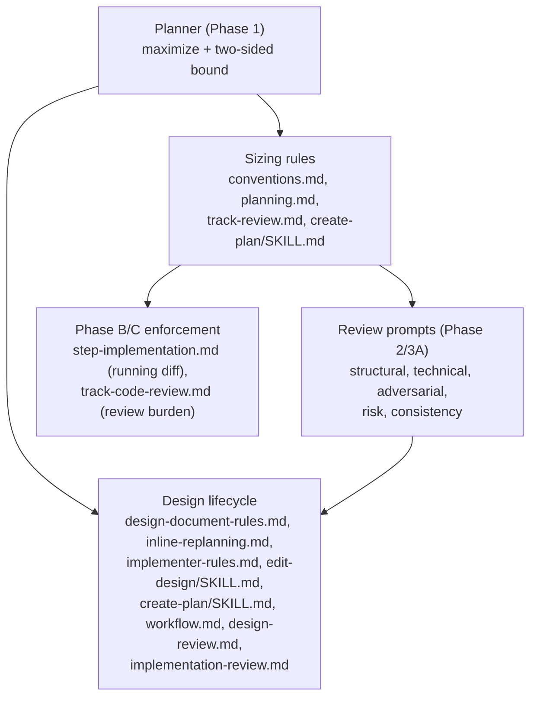

# Two-sided track sizing, phase-aware enforcement, and design-first freeze — Architecture Decision Record

## Summary

The workflow's only track-sizing rule was one-sided and stated in step
count: "more than ~5-7 steps, split." Mining the 42 committed tracks showed
it never bound anything (min 1 step, median 3, max 5); the dimension that
actually goes unbounded is file footprint. Separately, `design.md` was
authored last in the planning session and nominally mutable during
execution, which contradicted the workflow's own "frozen after Phase 1"
rule.

This change reframes a track as one PR in a stacked-diff series and replaces
the step ceiling with a two-sided file-footprint bound plus a *maximize*
directive that packs work into each track up to a soft ceiling. It binds
each size metric to the phase where it is knowable (files predict at plan
time, lines measure during and after execution), freezes `design.md` after
Phase 1 by removing the live mutation paths, and authors `design.md` first
in its own reviewed session so the plan derives from a frozen seed. It
addresses YTDB-1060 (Threads 1-4) and is its own first test case: the change
was decomposed by the new maximize directive (applied by hand, since the
rules were not yet live) and landed as one stacked-diff track of 18 workflow
files rather than four thin tracks.

## Goals

- Replace the step ceiling that never bound a track with a two-sided
  footprint bound, and reframe a track as one stacked-diff PR so the planner
  maximizes delivered work per track instead of fragmenting a feature into
  thin tracks that each pay the per-track review tax.
- Bind each size metric to the phase where it is knowable: files predict at
  Phase 1/A, the running diff measures at Phase B, the review-burden diff
  measures at Phase C.
- Freeze `design.md` after Phase 1 by removing the live mutation paths, and
  author it first in its own reviewed session.

**Adjusted for actual outcome.** The footprint ceiling was not introduced
net-new. A prior branch had already landed a `~20-25`-file split-candidate
ceiling worded to coexist with the `~5-7`-step rule, so the sizing work
*consolidates* that ceiling and *extends* it with the parts that were
missing — the file floor, the maximize directive, the `>~40` overblown tier,
the argumentation gate, and the phase-aware Phase B/C checks. The four
threads landed as one track because the maximize directive, applied by hand
to the change's own rollout, put the footprint comfortably under the soft
ceiling with no autonomy break.

## Constraints

- **Workflow-modifying.** Every target file is workflow machinery under
  `.claude/workflow/**` or `.claude/skills/**`, so edits stage under
  `_workflow/staged-workflow/` and a single Phase 4 promotion commit copies
  staged over live. Promotion is additive-only; this change has no whole-file
  deletions.
- **Bootstrap.** The rules this change introduces were not live during its
  own planning. The plan was authored under the design-last `create-plan`
  flow and the sizing rules applied by hand. The merged result is the first
  plan the live rules govern.
- **Develop moves underneath.** The sizing files had already been rewritten
  by two prior branches and could move further; the Phase 4 pre-promotion
  divergence check halts if the branch is behind, resolved by a rebase before
  promotion.
- **Thresholds are provisional.** The footprint numbers (~12 / ~20-25 / ~40
  files) and line numbers (~2,000 / ~4,000) are review-capacity estimates,
  recalibrated via the Phase C overblown-recording rather than pinned now.

## Architecture Notes

### Component Map

- **Sizing rules** — retired the `~5-7`-steps metric and added the
  stacked-diff track definition, the maximize directive, and the file-based
  floor plus footprint ceiling. Lives in the `conventions.md` glossary and
  plan-file section, `planning.md` track-descriptions (the authoritative copy
  of the full rule), `track-review.md` step decomposition, and the
  `create-plan/SKILL.md` Step 4 sizing rule.
- **Review prompts** — five prompts carried the retired metric and enforced
  it on reviewers; each moved to the two-sided cap, each Track-terminology
  bullet citing the authoritative `planning.md` rule, with a sync-list anchor
  in `structural-review.md`. `adversarial-review.md` also gained the
  design-scoped role/phase.
- **Phase B/C enforcement** — the running diff-stat early-warning in the
  Phase B step loop and the review-burden line check in the Phase C code
  review.
- **Design lifecycle** — froze `design.md` (removed the live mutation paths,
  routed replan intent to the Decision Records and track narrative) and
  reordered `create-plan` to author the design first, with the
  adversarial-then-cold-read ordering in the `edit-design` loop. The
  Phase-2 plan-review flow (`implementation-review.md`) entered this cluster
  during implementation when its design-fix path was found and rerouted.

### Decision Records

#### D1: A track is one PR in a stacked-diff series
- **Decision**: a track builds on prior tracks, stands alone as an
  independently reviewable and mergeable unit, and carries as much of the
  feature as one reviewable diff holds.
- **Alternatives considered**: keep the "coherent stream, max ~5-7 steps"
  definition (the status quo that mining 42 tracks showed never bound
  anything); a bare footprint metric with no autonomy framing.
- **Rationale**: the stacked-diff framing gives both bounds operational
  meaning. The routine changes (maximize); the concept is sharpened, not
  weakened.
- **Outcome**: implemented as planned. "PR" is a conceptual frame, not a
  git-enforced unit; reviewers apply judgment on autonomy.

#### D2: Maximize — bundle to the ceiling, relatedness-agnostic
- **Decision**: size each track up to the largest autonomous, reviewable
  bundle, opening a new track only when the next unit breaches the ceiling or
  breaks autonomy. Relatedness is not a packing criterion.
- **Alternatives considered**: cut at the first logical seam (the status-quo
  bias, which would have emitted four thin tracks here); bundle only units
  sharing a dependency seam or subsystem.
- **Rationale**: minimize the number of expensive track cycles subject to the
  ceiling and inter-track mergeability. Thematic coherence is not a
  reviewability constraint: two unrelated autonomous changes stay autonomous
  in one track and carry no interaction, so reviewing them together adds no
  cross-change reasoning cost over reviewing them apart. The real constraint
  is total volume, which the ceiling measures.
- **Outcome**: implemented as planned. The rationale is bounded, not
  absolute — bundling is worth it only up to the ceiling, and the Phase C
  review-burden check is the counterweight that keeps a maximized track from
  growing past what one reviewer can hold. A mid-track blocker holds the
  bundle, though per-step commits still land.

#### D3: Two-sided soft bound, argumentation-gated, flag-only
- **Decision**: floor at ≤~12 files (merge candidate), split-candidate
  ceiling at >~20-25, overblown at >~40. A track outside the bounds passes
  Phase 2 when it carries a written justification and escalates when it does
  not.
- **Alternatives considered**: a hard gate on the ceiling (fights maximize
  and the autonomous Phase 2); pure record-only (repeats "never bound
  anything"); a step-based or same-area floor (dissolves under the
  files-vs-steps split); floor auto-merge (a track merge fails the
  `mechanical` test).
- **Rationale**: Phase 2's classifier is binary (`mechanical` |
  `design-decision`), with no advisory tier, so the gate keys on the
  *presence of argumentation* rather than the count.
- **Outcome**: implemented as planned. The change adds no hard gates on
  size: the floor, the ceiling, and the Phase B running diff are all advisory.
  A *documented* oversize track no longer escalates on size alone, a
  deliberate loosening from the prior step-count escalation. The loosening is
  forced rather than chosen — the binary classifier leaves no advisory slot,
  so gating on argumentation is the only way to let maximize produce large
  tracks without escalating every one. The merge a flagged floor implies is
  performed by the planner, never a tool.

#### D4: Phase-aware enforcement — files predict, lines measure
- **Decision**: bind each metric to the phase where it is knowable. Phase
  1/A predicts with steps and in-scope files; Phase B reads a running
  `git diff base..HEAD --stat` early-warning; Phase C measures review burden.
- **Alternatives considered**: a single plan-time cap stated in lines —
  impossible, the code does not exist at plan time.
- **Rationale**: a planning-time cap cannot be stated in lines. The Phase C
  check uses total `+/-`, pages the cumulative diff at >~2,000 lines, records
  overblown at >~4,000, excludes generated code, and keeps test code.
- **Outcome**: implemented as planned, with two execution refinements. The
  Phase B early-warning was folded into the step loop's existing always-run
  sub-step rather than minting a new numbered sub-step, because the loop
  labels its phases by integer and a fractional insert would break the
  enumeration. The 2,000-line threshold pages the diff (it is the `Read`-tool
  truncation boundary, so a sub-agent does not silently truncate its read)
  and is not a bare record-only action.

#### D5: Update all 12 sizing-rule occurrences and add a sync-list
- **Decision**: move every occurrence of the retired metric to the two-sided
  cap and anchor the set with a sync-list comment.
- **Alternatives considered**: update only the 4 occurrences first listed
  (leaves five review prompts enforcing the retired metric on reviewers);
  leave the rule duplicated with no sync anchor (it drifts).
- **Rationale**: the metric appeared in 12 positions, five of them review
  prompts; unupdated, Phase 2/3A reviewers would flag tracks by a retired
  metric and the structural finding template would contradict the new cap.
- **Outcome**: implemented as planned. The pre-existing `~20-25` ceiling
  prose was consolidated into the new rule rather than left as a duplicate.
  The sync-list is a convention, not mechanically enforced.

#### D6: Freeze design.md after Phase 1
- **Decision**: remove the live `design.md`-mutation paths and route replan
  design intent into the plan's Decision Records and the track narrative.
  Phase 4 stays the single reconciliation point.
- **Alternatives considered**: keep `design.md` mutable during execution (the
  status quo, which self-contradicts: the mutation-discipline list named
  inline replanning a trigger while the freeze rule said `design.md` is never
  modified after planning).
- **Rationale**: the plan's Decision Records are already the de-facto source
  of truth during execution and no Phase 3 reviewer receives `design.md`.
- **Outcome**: modified during execution. The inline-replan mutation path was
  wired in three places, not one, and a *fourth* path surfaced: the Phase 2
  plan-review flow carried its own design-fix routing through `edit-design`.
  Because design-first authoring (D7) moves the freeze point to the design's
  own review pass — before plan derivation and therefore before Phase 2 — the
  Phase-2 path contradicts the freeze. It was rerouted: a Phase-2 consistency
  finding whose correction would touch `design.md` is recorded, the
  plan/track side is fixed directly, and the design correction defers to
  Phase 4. The behavior change is real: a `design.md` inaccuracy found at
  plan review is now recorded-and-deferred, not fixed in place. Closing the
  fourth path grew the footprint by one file. A semantic-staleness lint for a
  revised Decision Record's `Full design:` link is out of scope (YTDB-1079);
  a stale link is handled procedurally.

#### D7: Author design.md first, in its own reviewed session
- **Decision**: author `design.md` via `edit-design` in a dedicated session
  that ends when its review passes; `/create-plan` auto-resumes plan
  derivation in a fresh session. The review runs adversarial first (does it
  hold against the real code), then cold-read (can a fresh reader build a
  model).
- **Alternatives considered**: author the design last in one planning
  session (the status quo, where the design back-fills decisions the plan
  already crystallized).
- **Rationale**: the plan should derive from a frozen, reviewed seed.
  Cold-read should not assess the readability of a design the adversarial
  pass may still change.
- **Outcome**: implemented as planned, with two enforcement details added
  during execution. The auto-resume gate keys on a *committed and clean*
  `design.md`, not bare file presence: `edit-design` writes `design.md`
  before its review passes, so an interrupted authoring session would
  otherwise derive a plan from an unreviewed design. The `edit-design`
  iterate loop re-runs the adversarial pass on each round so a later edit
  cannot quietly reintroduce a challenged decision. This change is
  implemented here; YTDB-975 (overlapping design-first authoring) is
  corrected on a separate branch afterward, so the reorder is not built twice.

### Invariants & Contracts

- **Step definition unchanged.** Only the *sizing* use of step count is
  retired; the definition of a step is untouched.
- **Footprint counts live files 1:1 with staged.** Staging under `_workflow/`
  does not inflate footprint — the ceiling counts the distinct live
  `.claude/` files a track changes, which equals the staged-copy count.
- **Live workflow stays at develop state until promotion.** On a
  workflow-modifying branch, every `.claude/workflow/**` and
  `.claude/skills/**` edit lives in the staged subtree; the single Phase 4
  promotion commit is the only intra-branch transition that writes live paths.
- **The implementer never resolves a decision from the frozen snapshot.** The
  Phase 3B implementer takes build intent from the plan, may read `design.md`
  for context, and escalates `DESIGN_DECISION_NEEDED` when the plan is silent
  rather than reading intent from the snapshot.

### Integration Points

- **Phase 2 structural classifier** — binary (`mechanical` |
  `design-decision`, no advisory tier). The argumentation gate keys on this
  binary shape.
- **`edit-design` mutation loop** — gained an adversarial step before
  cold-read for the `phase1-creation` kind; the `phase4-creation` kind
  produces the final committed artifacts.
- **`create-plan` Step 4** — split into design authoring (a dedicated
  session that freezes the design on review pass) and plan derivation (a
  fresh session), with a resume check gating on a committed-and-clean
  `design.md`. This changes the create-plan commit cadence: the single
  initial commit becomes one for the design and one for the plan.
- **Sync-list anchor** — binds the rule-citing positions across the sizing
  files and review prompts so a future edit to one updates the rest.

### Non-Goals

- A semantic-staleness lint for a revised Decision Record's `Full design:`
  link — deferred to YTDB-1079.
- Re-implementing the design-first reorder inside YTDB-975 — corrected on a
  separate branch after this lands.
- Pinning final threshold values — the current numbers are provisional and
  recalibrated via the Phase C overblown-recording.
- Hard-gate or mechanical enforcement of the ceiling — the bound is
  argumentation-gated only.

## Key Discoveries

- **The retired metric appeared in 12 positions, not the 4 first listed, and
  five were review prompts.** Leaving the review prompts on the old metric
  would have made Phase 2/3A reviewers flag tracks by a retired rule and the
  structural finding template contradict the new cap. The review prompts were
  the consequential part of the change, not the planning prose.
- **A `~20-25`-file ceiling was already partly live.** A prior branch had
  landed the top of the footprint range worded to coexist with the step rule,
  so every sizing edit consolidates-and-extends rather than introducing
  net-new. What was missing and got added: the floor, the maximize directive,
  the `>~40` overblown tier, the argumentation gate, and the phase-aware
  Phase B/C checks.
- **The design freeze reached more sites than the mutation trigger alone.**
  The inline-replan path was wired in three places (the design rules, the
  inline-replan routing, the `edit-design` MUST-use entry), each carrying
  stale phase annotations that the freeze had to narrow across TOC rows and
  section comments, not just prose. A fourth path — the Phase 2 plan-review
  design-fix flow — surfaced during execution and was rerouted to
  record-and-defer, because design-first moves the freeze before Phase 2 ever
  reads `design.md`.
- **The role and phase annotation enums are closed.** The design-scoped
  adversarial slot reuses the existing adversarial reviewer role at phase 1
  with no new token; extending that role to phase 1 made the role-enum gloss
  dual-phase, a one-line consistency edit that rode with the change.
- **The design-first auto-resume must gate on a committed-and-clean design,
  not bare file presence.** `edit-design` writes `design.md` before its
  review passes, so a file-presence check would resume plan derivation from
  an unreviewed design left behind by an interrupted authoring session.
- **The Phase B early-warning could not be a new numbered sub-step.** The
  step loop labels its phases by integer in several places, so the
  early-warning folded into an existing always-run sub-step. The 2,000-line
  Phase C threshold is the `Read`-tool truncation boundary, which is why it
  pages the diff rather than merely recording a number.
- **The self-contradiction the freeze closes was mislocated in the first
  draft.** The mutation trigger sits in the design rules' mutation-discipline
  section and the freeze rule sits ~734 lines away in the rules section, not
  "four lines apart" as an early draft claimed. The contradiction is real;
  only the proximity framing was wrong.
- **The create-plan two-session split changes downstream commit-example
  docs.** The single initial create-plan commit becomes two, so any
  commit-conventions example citing the merged single commit needs
  reconciling.

## Token usage telemetry

Snapshot from this worktree's sessions over its lifetime (N=6 sessions across 40 transcripts).

### Tool mix — share of total session context

| Component             | Share |
|-----------------------|------:|
| `Read` tool results   | 65.4% |
| `Bash` tool results   | 9.4% |
| `Grep` tool results   | 0.0% |
| `Edit` tool results   | 0.5% |
| Other tool results    | 4.3% |
| Prompts and output    | 20.4% |

### Top files by share of `Read` token consumption

| File                                            | Share of Read |
|-------------------------------------------------|--------------:|
| <outside-worktree>                              | 25.0% |
| docs/adr/recap-track-size/_workflow/plan/track-1.md | 15.3% |
| .claude/workflow/implementer-rules.md           | 7.9% |
| docs/adr/recap-track-size/_workflow/staged-workflow/.claude/skills/edit-design/SKILL.md | 3.8% |
| .claude/workflow/design-document-rules.md       | 3.4% |
| .claude/workflow/self-improvement-reflection.md | 3.3% |
| docs/adr/recap-track-size/_workflow/staged-workflow/.claude/skills/create-plan/SKILL.md | 3.2% |
| docs/adr/recap-track-size/_workflow/design.md   | 3.1% |
| docs/adr/recap-track-size/_workflow/implementation-plan.md | 2.4% |
| .claude/skills/edit-design/SKILL.md             | 2.2% |

Generated by `.claude/scripts/measure-read-share.py` against
`~/.claude/projects/-home-andrii0lomakin-Projects-ytdb-recap-track-size/`.
