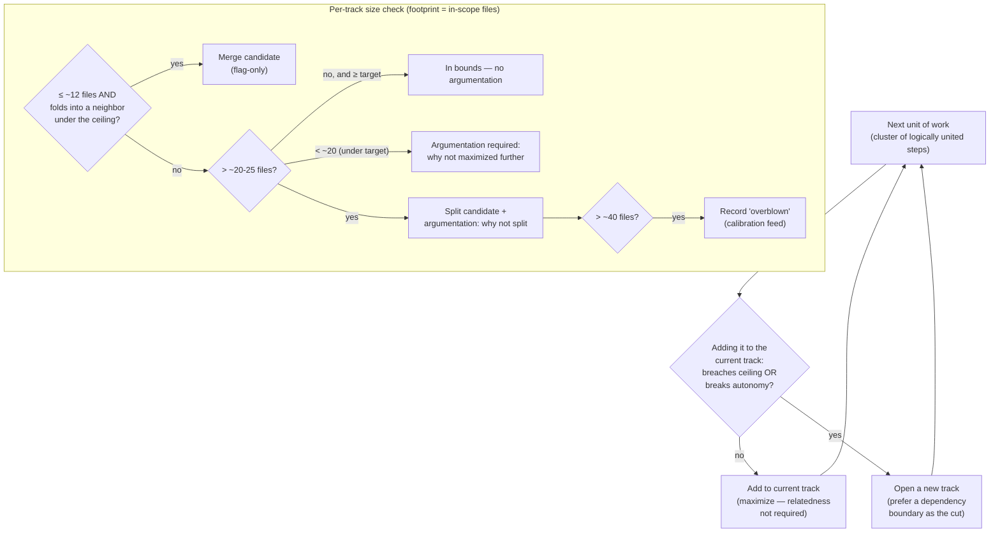
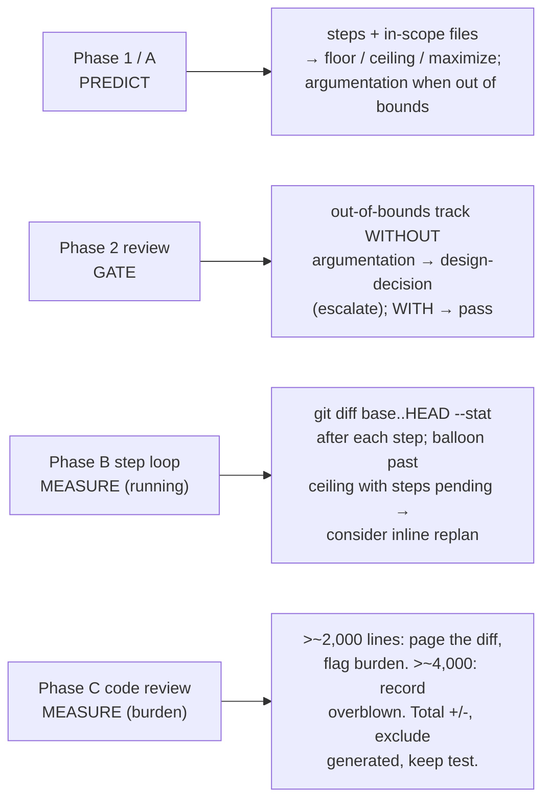
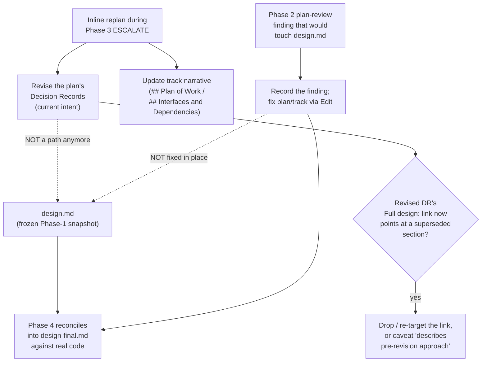
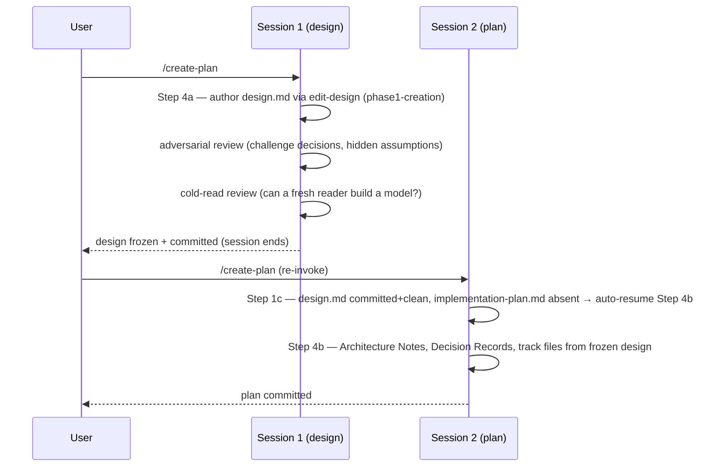

# Two-sided track sizing, phase-aware enforcement, and design-first freeze — Design

## Overview

The workflow sized a track by one rule: "more than ~5-7 steps, split."
Mining the 42 committed tracks showed that rule never bound anything — the
largest track was 5 steps, and a 35-file track passed every check. The
dimension that actually goes unbounded is file footprint. Separately,
`design.md` was authored last in the planning session and was nominally
mutable during execution, which contradicted the workflow's own "frozen
after Phase 1" rule and let the plan derive from a design that was still
moving.

This design makes four coordinated changes. It **redefines a track as one
PR in a stacked-diff series** (autonomous: stands alone, builds on prior
tracks, independently mergeable; reviewable: inside a footprint ceiling),
and replaces the step ceiling with a two-sided footprint bound plus a
*maximize* directive that packs work into each track up to that bound. It binds each size metric to the phase where it is knowable: files
predict at plan time, lines measure during and after execution. It
**freezes `design.md` after Phase 1** by removing the live mutation paths
and routing replan design intent into the plan's Decision Records and the
track narrative. And it **authors `design.md` first**, in its own session
that ends when the design's adversarial-then-cold-read review passes, so
the plan derives from a frozen, reviewed seed.

The footprint ceiling is not net-new: a prior branch had already landed the
`~20-25`-file split-candidate top, which this design consolidates and extends.

The two enabling primitives are the **files-predict / lines-measure phase
split** (a planning-time cap cannot be stated in lines because the code
does not exist yet) and the **argumentation gate** (a track outside the
bounds passes only if it carries a written justification, which keeps the
soft bound honest without a hard stop). The subsystems that change to fit:
the five review prompts that enforce the old metric, the Phase B step loop
and Phase C code review, the inline-replan routing, the `create-plan`
session ordering, and the `edit-design` mutation loop.

The rest of this document covers: Core Concepts → Track sizing → Phase-aware
enforcement → Design freeze → Design-first authoring → Sync surface and
staging.

## Core Concepts

This design introduces eight load-bearing ideas. Each is named and used
without re-definition in the sections that follow; each pairs the new
concept with what it replaces, so the delta from the baseline is visible
at a glance.

**Track as a stacked-diff PR.** A track is one PR in a stacked-diff series:
it builds on the tracks before it, stands on its own as an independently
reviewable and mergeable unit, and carries as much of the feature as one
reviewable diff holds. Replaces "a coherent stream of related work, max
~5-7 steps". → §"Track sizing".

**Maximize.** The planning directive: size each track up to the largest
autonomous, reviewable bundle, opening a new track only when the next unit
breaches the ceiling or breaks autonomy. Replaces the implicit
"cut at the first logical seam" bias. → §"Track sizing".

**Floor.** A track ≤~12 in-scope files that can fold into an adjacent track
under the ceiling is a merge candidate. Replaces "no lower bound". → §"Track
sizing".

**Ceiling.** A soft footprint bound: split candidate at >~20-25 in-scope
files, recorded "overblown" at >~40. Replaces the one-sided step ceiling.
→ §"Track sizing".

**Footprint.** The count of distinct in-scope files a track changes — the
plan-time-knowable size dimension, distinct from step count. Replaces "step
count is the size metric". → §"Phase-aware enforcement".

**Argumentation gate.** A track outside the bounds (under-floor, or below
the maximize target, or over the ceiling) must carry a written justification
in its track file; a documented out-of-bounds track passes Phase 2
autonomously, an undocumented one escalates. Replaces "the threshold either
blocks or is silently ignored". → §"Track sizing".

**Phase-aware enforcement.** Each metric is bound to the phase where it is
knowable: steps and files predict at Phase 1/A, the running diff measures at
Phase B, the review-burden diff measures at Phase C. Replaces "one
plan-time rule". → §"Phase-aware enforcement".

**Design freeze and design-first.** `design.md` is authored and reviewed in
its own session, frozen at Phase 1, and never mutated during execution;
replan design intent lives in the plan's Decision Records and the track
narrative. Replaces "design.md authored last and mutable mid-execution".
→ §"Design freeze", §"Design-first authoring".

## Track sizing

**TL;DR.** A track is one stacked-diff PR. Size it by *maximizing*: pack
units in up to a soft footprint ceiling, related or not, then clamp with a
floor below and a ceiling above. The bounds are soft: a track outside them
passes when it carries a written justification, and only escalates when it
does not. Step count is retired as the sizing metric; footprint (in-scope
files) replaces it.

The sizing routine runs on the planned in-scope file footprint, not step
count. The planner builds each track as large as the bounds allow, then
clamps:

The governing principle of both the floor and the maximize directive is one
sentence: **minimize the number of track cycles, subject to the reviewability
ceiling and inter-track mergeability.** Each track cycle is expensive (a
Phase A review and decomposition, a Phase B implementation pass, a Phase C
code review, and the session boundaries between them), so the plan pays a
fixed tax per track. Maximize is the proactive form (build big tracks up
front); the floor is the reactive backstop (fold in a track that slipped
through).

Two coherence properties must stay separate. **Inter-track autonomy** asks
whether the track stands alone and merges independently of *later* tracks;
the definition requires it. **Internal thematic coherence** asks whether the
changes within a track are about the same subsystem, and is *not* a sizing
criterion: bundling two unrelated autonomous changes into one track keeps
both autonomous. Unrelated changes carry no interaction, so reviewing them
together adds no cross-change reasoning cost over reviewing them apart; the
real reviewability constraint is total volume, which the ceiling measures.
The bundling is worth it only up to that ceiling, and the Phase C
review-burden check is the counterweight that keeps a maximized track from
silently growing past what one reviewer can hold.

The change adds no hard gates on size. The floor, the ceiling, and the Phase
B running diff are all advisory — flag-only at plan time, orchestrator
judgment at execution time. A *documented* oversize track no longer escalates
on size alone, which is a deliberate loosening from the prior step-count
escalation. The loosening is forced rather than chosen: the autonomous Phase
2 classifier is binary (`mechanical` | `design-decision`, no advisory tier),
so the only way to let maximize produce large tracks without escalating every
one of them is to gate on the *presence of argumentation* rather than the
count. See §"Phase-aware enforcement".

### Edge cases / Gotchas

- A track that lands under ~20 files but is genuinely complete (no further
  unit to add) satisfies the argumentation requirement trivially: "this is
  the whole change". The gate checks for a written reason, not for size
  above a line.
- The floor never auto-merges. A track merge re-partitions PRs, picks a
  neighbor, must preserve the dependency DAG, and renumbers cross-references
  — none of which is "a single unambiguous edit that doesn't change plan
  intent", so it fails the `mechanical` test and is performed by the
  planner, not a tool. See §"Phase-aware enforcement" for where the floor
  and ceiling are checked.
- "Overblown" (>~40 files) is a recorded status for calibration, not a
  build-blocking stop. Even the upper tier is soft.

### References

- D-records: D1, D2, D3
- Mechanics: §"Phase-aware enforcement" — which phase checks the bound and
  what each does.

## Phase-aware enforcement

**TL;DR.** A planning-time cap cannot be stated in lines, because the code
does not exist yet. Bind each metric to the phase where it is knowable:
files and steps *predict* at Phase 1/A; the running diff is a *measured
early-warning* at Phase B; the review-burden diff is a *measured check* at
Phase C. Only Phase 2 has any gate, and it gates on the presence of
argumentation, not on the count.

The Phase 2 structural reviewer classifies every finding as `mechanical`
(orchestrator auto-fixes) or `design-decision` (orchestrator escalates to
the user); there is no advisory tier. So "soft finding for the file
ceiling" is not an available slot. Instead the gate keys on the
argumentation: an out-of-bounds track (under-floor, below the maximize
target, or over the ceiling) that lacks a justification block is a
`design-decision`; a documented one passes without escalation. This keeps
the autonomous phase autonomous for the common case: maximize deliberately
produces large tracks, and they pass when documented. It still catches the
undocumented oversize that genuinely needs human judgment.

The line thresholds live only in the Phase B step loop and the Phase C code
review, never in the planning prose. The Phase B early-warning is folded
into the step loop's always-run checks: after each step it reads
`git diff base..HEAD --stat` and flags a running total ballooning past the
ceiling with steps still pending. The Phase C check measures total `+/-` (a
reviewer reads deletions too), pages the cumulative diff in ≤2,000-line
windows at >~2,000 lines (the `Read`-tool truncation boundary, so a
sub-agent does not silently truncate its read), and records "overblown" at
>~4,000. Generated code is excluded (consistent with the project's Spotless
and coverage exclusions) and test code is kept (it is real review burden).
The threshold values are review-capacity estimates; the Phase C
overblown-recording is the calibration feed that lets them be re-pinned
later.

### Edge cases / Gotchas

- The Phase B early-warning is orchestrator judgment, never a hard stop. A
  running total past the ceiling with steps still pending is a prompt to
  consider inline-replanning the tail, not an automatic split.
- The early-warning rides inside the step loop's existing always-run sub-step
  rather than minting a new numbered sub-step, because the loop labels its
  phases by integer and a fractional insert would break that enumeration.
- Staging does not inflate footprint. On a workflow-modifying branch the
  staged copies live under `_workflow/` (removed at Phase 4); the ceiling
  counts the distinct live `.claude/` files changed, 1:1 with the staged
  copies. See §"Sync surface and staging".

### References

- D-records: D3, D4
- Mechanics: §"Track sizing" — the bound the predictive metrics check.

## Design freeze

**TL;DR.** `design.md` is frozen after Phase 1. The live mutation paths are
removed, and replan design intent routes into the plan's Decision Records
(authoritative for current intent) and the track narrative (long-form),
never back into `design.md`. Phase 4 is the single point that reconciles
`design.md` into `design-final.md` against the real code.

The freeze closes a live self-contradiction: the design rules' mutation-discipline
list named inline replanning as a `design.md` mutation trigger, while a separate
freeze rule said `design.md` is never modified after planning. The model already held
about 70% — no Phase 3A or 3C reviewer receives `design.md`, and the de-facto
source of truth during execution is already the plan's immutable Decision
Records. This design removes the remaining live paths and adds one handling
rule.

The inline-replan mutation path turned out to be wired in three places, not
one: the design-rules mutation trigger plus its Direct-mutation example, the
inline-replanning routing blocks, and the `edit-design` MUST-use-this-skill
entry. Removing the trigger leaves stale `3A,3C` phase annotations on each
site, so the freeze narrows those annotations across every file's TOC rows
and section comments, not just the prose, so the per-section reader-filter
stops routing Phase-3 agents into the removed discipline.

A fourth `design.md`-mutation path surfaced during implementation and was
folded into the freeze: the Phase 2 plan-review flow carried its own
"mutation discipline for `design.md` fixes", routing a consistency finding's
design correction through `edit-design`. Authoring the design first (see
§"Design-first authoring") moves the freeze point to the design's own review
pass, which is *before* plan derivation and therefore before Phase 2. By the
time Phase 2 runs, `design.md` is already frozen and the Phase-2 mutation
path contradicts the freeze. The path is rerouted: a Phase-2 consistency
finding whose correction would touch `design.md` is **recorded**, the
plan/track side is fixed via `Edit`, and the `design.md` correction defers to
this Phase-4 reconciliation. The behavior change is real: a `design.md`
inaccuracy found at plan review is now recorded-and-deferred rather than
fixed in place. That is the right behavior once the design is frozen before
Phase 2 ever reads it.

A second consequence at Phase 2: on a re-run after an inline replan (when the
plan's `## Plan Review` was reset to `[ ]`), the consistency reviewer compares
the plan's Decision Records against the frozen `design.md`. A revised DR will
legitimately diverge from the design section it once mirrored. The
consistency-review prompt gains a note that this divergence is **expected,
not a finding**: the Decision Records are authoritative for current intent,
while `design.md` is the Phase-1 snapshot. The note is worded broadly enough
to cover a DR that diverges from a frozen section's *mechanism*, not only from
a stale `Full design:` link.

### Edge cases / Gotchas

- No script checks the *semantics* of a `Full design:` link, only its
  existence. A revised DR whose link points at a superseded section is
  handled procedurally (drop / re-target / caveat); a lint is deferred to
  YTDB-1079.
- The Phase 3B implementer takes current build intent from the plan, never
  resolving a decision out of frozen `design.md`; it may read the snapshot
  for context, but when the plan is silent it escalates
  `DESIGN_DECISION_NEEDED` rather than reading intent from the snapshot.

### References

- D-records: D6
- Mechanics: §"Design-first authoring" — the freeze point moves earlier, to
  the moment the design's own review passes.

## Design-first authoring

**TL;DR.** Author `design.md` first, in a dedicated session that ends when
its adversarial-then-cold-read review passes (or the user accepts open
risks). The implementation plan, Architecture Notes, Decision Records, and
track files derive from that frozen design in a separate session.
`/create-plan` auto-resumes plan derivation when `design.md` is committed and
clean and `implementation-plan.md` does not yet exist.

This mirrors the mandatory session boundary already enforced between Phases
A, B, and C. Previously `create-plan` authored Architecture Notes and the
track checklist first and wrote `design.md` last, so the design back-filled
decisions the plan already crystallized. Reordering makes the design the
seed the plan derives from.

The auto-resume gate keys on a **committed and clean** `design.md`, not bare
file presence. `edit-design` writes `design.md` to disk before its review
passes, so an interrupted authoring session leaves an unreviewed design on
disk; resuming on file-presence alone would derive a plan from a design that
never cleared review. A committed-and-clean check routes a finished design
into plan derivation and an uncommitted or dirty one back into authoring.

The review order is load-bearing: adversarial first answers "does the design
hold up against the real code"; cold-read then answers "can a fresh reader
build a working mental model." Running cold-read first would assess the
readability of a design the adversarial pass may still force to change. The
`edit-design` mutation loop gains an adversarial step before its cold-read
step for the `phase1-creation` kind, and its iterate loop re-runs that
adversarial pass on each round so a later edit cannot quietly reintroduce a
challenged decision.

### Edge cases / Gotchas

- The role and phase enums are closed, so the design-scoped adversarial slot
  reuses the existing adversarial reviewer role at phase 1 rather than
  minting a new token. Extending that role to phase 1 makes the role-enum
  gloss dual-phase, a one-line consistency edit that rides with the change.
- This change is implemented here; YTDB-975 (which specifies overlapping
  design-first authoring) is corrected on a separate branch afterward, so the
  reordering is not built twice.
- The new rules were not live during this issue's own planning. This plan was
  authored under the design-last flow and applied the sizing rules by hand;
  the merged result is the first plan the live rules govern.

### References

- D-records: D7
- Mechanics: §"Design freeze" — design-first moves the freeze point to the
  moment the design's review passes.

## Sync surface and staging

**TL;DR.** The retired sizing metric appeared in 12 places, not the 4 the
issue first listed; five of them are review prompts that enforce the old
rule on reviewers. All move to the two-sided cap, with a sync-list so they
cannot drift apart again. Every target file is workflow machinery, so edits
stage under `_workflow/staged-workflow/` and the staged-vs-live delta gets
the Phase C staged-delta review.

The "~5-7 steps" rule lived in `planning.md`, `conventions.md` (×2),
`track-review.md`, `create-plan/SKILL.md`, and the `structural` (×3),
`technical`, `adversarial`, `risk`, and `consistency` review prompts. The
five review prompts are the consequential part: if they keep the old metric,
Phase 2 and 3A reviewers will flag tracks by "≤5-7 steps" after the metric
is retired, and the structural reviewer's finding template would contradict
the new cap. A sync-list comment anchors the set so a future edit to one
updates the rest.

The metric appears in 12 places, but the change touched 18 files in all. The
gap is the design-lifecycle work: the freeze and the design-first reorder
reach files that never carried the sizing metric (the design rules, the
inline-replan routing, the implementer guard, the create-plan flow, the
adversarial and design-review prompts, the workflow phase listing). One of
those eighteen, the Phase 2 plan-review flow, entered scope only during
implementation, when the freeze was found to have a fourth mutation path (see
§"Design freeze"). The footprint sat comfortably under the soft ceiling
throughout, so the four threads landed as one stacked-diff track rather than
four — the maximize directive applied to its own rollout.

This plan carries the canonical workflow-modifying marker. Edits route to the
staged mirror under
`docs/adr/recap-track-size/_workflow/staged-workflow/.claude/...`; the live
tree stays at develop's state through Phase B/C; one Phase 4 promotion
commit copies staged over live just before final artifacts land. Staged
reads compose within the plan, so a later edit to a shared file (for example
`planning.md`, touched by the sizing and the design-first work) reads the
earlier edit's staged copy.

### Edge cases / Gotchas

- Promotion is additive-only — `cp -r` does not propagate whole-file
  deletions. This plan has none; every removal is a within-file content edit
  (a trigger bullet, a phase annotation), which the staged copy carries and
  `cp -r` overwrites cleanly.
- Develop moves on these exact files while the branch runs. The Phase 4
  pre-promotion divergence check halts if the branch is behind; the
  resolution is a rebase before promotion.
- The reindex of newly-authored staged content (TOC rows, in-file section
  references) is resolved by running the schema tool with `--write` at
  promotion, not left as a manual edit-list.

### References

- D-records: D5
- Mechanics: §"Track sizing", §"Design freeze" — the rules the synced files
  carry.
