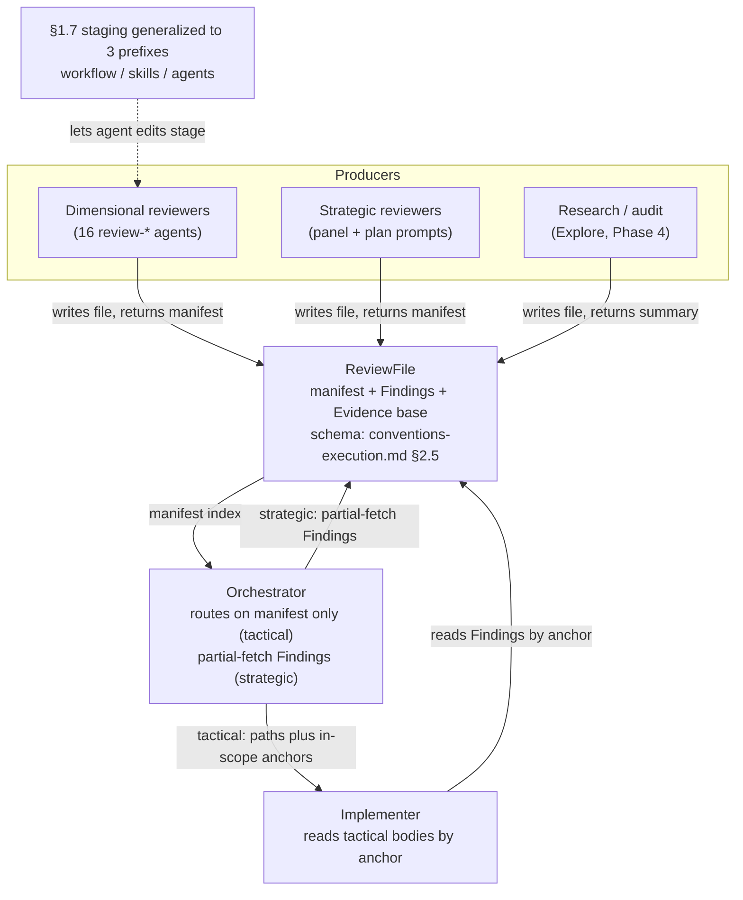

# Persist bulk sub-agent outputs; route tactical findings to the implementer — Architecture Decision Record

## Summary

The orchestrator's review loop was its dominant context filler. Every review sub-agent returned its findings inline, into resident context; the orchestrator deduplicated, re-graded severity, bucketed, and handed a merged list down. A body-heavy review session crossed the 40% `warning` gate and forced a teardown that reloaded the whole resident context as cache-create tokens (~120-180K estimated).

This change makes every bulk-producing review sub-agent write its structured output to a file at a spawn-supplied path and return only a thin manifest. Routing then splits by who consumes the finding bodies. **Tactical** code-fix fan-outs (Phase B `risk:high` step review, Phase C track review, gate-checks) keep every body off the orchestrator: it routes on manifest metadata and hands the in-scope anchors to the per-iteration implementer, which reads bodies by anchor, fixes at the code level, and escalates only design calls. **Strategic** reviews (Phase A panel, Phase 2 plan review, gate-verifications) keep the orchestrator's partial-fetch read, because the consumer is the planner. **Research/audit** sub-agents write a file and return a summary the orchestrator pulls on demand. The enabling primitive is a manifest-plus-sections file schema, addressed by stable heading anchors, defined once in `conventions-execution.md §2.5`.

The work shipped as four dependency-ordered tracks: generalize the §1.7 staging convention to a third path prefix (`.claude/agents/`) as a precursor; land the schema, lifecycle, and strategic/research producers; teach the sixteen dimensional `review-*` agents to write file-plus-manifest with a refutation trail; and reroute the orchestrator's tactical synthesis onto the manifest index with the implementer reading bodies.

## Goals

Cut the orchestrator's resident context from review fan-outs so a body-heavy review session stops crossing the 40% `warning` gate and triggering the teardown reload (~120-180K cache-create tokens). The steady-state carry is cheap; the restart it provokes is the cost removed. The mechanism is the file-plus-thin-manifest persistence plus consumer-keyed routing described in the Summary.

These goals shipped as planned. No goal was descoped during execution.

## Constraints

- **Workflow-modifying branch.** Every `.claude/workflow/**`, `.claude/skills/**`, and (newly) `.claude/agents/**` edit accumulated in the staged mirror and flipped on together at the single Phase 4 promotion commit.
- **No runtime dogfooding.** The branch ran develop-state machinery end to end; there was nothing half-flipped to corrupt a Phase C on the authoring branch, so the work needed no mid-branch self-adoption of the new routing or schema.
- **Shared agents must not break standalone callers.** The `review-*` agents serve the workflow fan-out plus the standalone `/code-review` and `/fix-ci-failure` skills, which read findings inline. Output is conditional on a supplied path; the no-path branch stays byte-for-byte the prior inline format.
- House style applies to every Markdown surface and the PR/commit prose (`conventions.md §1.5`).

One constraint sharpened during execution: `.claude/scripts/` is **not** a staged prefix. The staging convention covers `.claude/workflow/`, `.claude/skills/`, and `.claude/agents/` only, so the precheck and reindex scripts and their tests are edited live, and live script commits raise no drift because the workflow pathspecs exclude `.claude/scripts/`.

## Architecture Notes

### Component Map

Three actors and one new artifact, over a branch-mechanics layer that lets agent edits stage like every other workflow file.

- **Dimensional reviewers**: the sixteen `review-*` agents gained path-conditional file+manifest output, self-assign `<PREFIX><n>` IDs, and write a Phase-4 refutation trail to `## Evidence base`. Ten carry a refutation phase and write a cert-bearing evidence base; six (code-quality, test-structure, and the four workflow-machinery reviewers) have no refutation phase and are evidence-trail-exempt with `certs: 0`. The four pure-standalone agents carry an `exempt because…` annotation.
- **ReviewFile + strategic/research producers**: the manifest-plus-sections schema, its canonical home in `conventions-execution.md §2.5`, the lifecycle (committed at reviewer-return, swept by the Phase 4 cleanup), and the strategic + research producers that write files the orchestrator partial-fetches.
- **Orchestrator**: for tactical reviews it buckets on the manifest index and never ingests a body; for strategic it keeps its own partial-fetch read.
- **Implementer**: the one actor that reads tactical bodies, addressed by anchor; it reconciles cross-dimension framings at the code level and exits on a four-outcome `RESULT` block.
- **§1.7 staging**: generalized to a third prefix so agent-definition edits route to the staged mirror and promote with the rest.

### Decision Records

**D1. Router model for tactical reviews.** Alternatives: orchestrator partial-fetches tactical bodies from disk itself (the interim optimization, which still lands bodies in long-lived context and still crosses the warning gate); keep inline synthesis (status quo). Rationale: only routing the body-read to the short-lived implementer drops the footprint from the long-lived orchestrator. Implemented as planned: the tactical synthesis recipe collapsed to manifest-only routing, the orchestrator buckets on the index and spawns the implementer with paths plus anchors, and the implementer reconciles cross-dimension framings at the code level. Risk accepted: more reconciliation reasoning per `loc` in the implementer, in a context discarded after the fix.

**D2. Manifest-plus-sections file schema + thin return.** Alternatives: keep the inline return; a structured return without a file (no resume benefit). Rationale: the manifest header over anchored sections is the enabling primitive, defined once in `conventions-execution.md §2.5` and cited everywhere else. Implemented as planned, with two refinements that surfaced during execution: the index's six fields carry an explicit mandatory (`id`/`sev`/`anchor`) versus downstream (`loc`/`cert`/`basis`) split, and a verdict-producer manifest variant covers gate-verifying reviewers (per-prior-finding verdicts plus separate net-new findings).

**D3. Anchored partial-fetch addressing + count validation.** Alternative: line-offset addressing, rejected because it breaks on format drift. Rationale: stable heading anchors survive drift, and an ID-anchored grep validates the manifest before any body read. Implemented with one correction (see Key Discoveries): the count-validation regex is `^### [A-Z]+[0-9]+ ` — `[A-Z]+`, not the originally-planned `[A-Z]{2,}` — and the `### <PREFIX><N> ` heading shape is reserved **file-wide**, not only under `## Findings`.

**D4. Severity trust + upgrade-only `basis` backstop.** Alternatives: full trust dropping the OVERRIDE both ways (no under-severance backstop); tighten reviewer prompts only; pull the body on doubt (reintroduces body reads); a sev-only manifest (no drill signal). Rationale: a dropped downgrade is the cheaper direction while a missed upgrade ships a real bug, so a one-line `basis` per index entry is the minimum manifest signal that makes a one-directional upgrade check possible. Implemented as planned. Risk: a finding whose `basis` and label both under-describe the impact is missed.

**D5. Per-dimension IDs are the sole addressing; `M<n>` removed.** Alternative: keep the synthesis `M<n>` merge layer. Rationale: removing the merge step deletes the `M<n>`-to-dimension un-map and the audit-trail tracking; ID assignment moves to the reviewer, which continues from the per-dimension high-water-mark the orchestrator hands back at spawn (reusing the gate-check hand-back one step earlier). Implemented as planned; the implementer contract was reconciled to read bodies by the per-dimension IDs handed to it directly, with no merge layer.

**D6. Path-conditional agent output.** Alternatives: unconditional file output, which breaks the standalone skills; teach those skills to supply paths and read files, a scope balloon into two skills. Rationale: write file-plus-manifest only when handed an output path, so only the workflow caller switches behavior and a live agent-definition edit stays safe against the develop-state run. Implemented as planned: the output path is injected at the Phase B and Phase C dispatch sites that compose each review spawn, not in the agent-selection step.

**D7. Staging generalized to three prefixes (`.claude/agents/` added).** Alternatives: leave agents unstaged (agent edits land live mid-branch, I6 holds only partially); path-conditional output alone with no staging (keeps the run safe but loses I6 and the property that an agent-only develop commit registers as a workflow-format change). Rationale: uniform treatment of all workflow machinery, activating at the Phase 4 promotion. Implemented as the precursor — it landed first so the branch self-staged its own later agent edits via reads-precedence. The promotion `git add` and the rebase-precedes-promotion divergence check extended to three prefixes; the workflow-modifying marker matcher was made prefix-agnostic so a plan's verbatim two-prefix marker matches both the live two-prefix gate during the precursor track and the staged three-prefix gate after. Risk: cross-branch drift churn, accepted as correct.

**D8. Dimensional evidence trail in `## Evidence base`.** Alternatives: internal-only refutation (unverifiable); drop the guard. Rationale: writing the Phase-4 refutation reasoning to disk makes the false-positive guard verifiable after the fact, reuses YTDB-1069's roster rendering, and is read only on a contested-finding drill-down. Implemented with a clarified ownership split: `§2.5` standardizes the `## Evidence base` section, the `evidence_base` manifest summary, and the `cert_index`; the survived-one-line / refuted-in-full body-rendering convention lives in each dimensional agent definition. Risk: ~1.4K net-new tokens per reviewer (about 3% of review cost), with an `exempt because…` hatch where it does not pay.

**D9. Pure-standalone review agents exempt.** Scope: `code-reviewer`, `pr-reviewer`, `test-quality-reviewer`, `dr-audit`. Rationale: each is invoked standalone with output consumed by the user in the same turn, never accumulated in an orchestrator session, so the restart-reload motivation does not apply. Implemented as planned: each carries an explicit `exempt because…` annotation, distinct from the evidence-trail exemption that the six refutation-less dimensional agents carry.

**D10. Review files committed at reviewer-return.** Rationale: committing (not merely writing) at return is the resume precondition, so a crash before the commit cannot force the re-spawn the design avoids. Implemented as planned: the files are plan-directory artifacts under `_workflow/plan/track-N/reviews/` (never staged), swept by the Phase 4 cleanup, and the resume payoff is scoped to the completed-review boundary, not overriding the Phase A re-run-from-iteration-1 rule.

### Invariants & Contracts

- **S1 (no-bodies):** the orchestrator never retains a tactical finding body in steady-state context; the one bounded exception is a single contested-finding block pulled transiently on drill-down and dropped before the next teardown. Verifiable post-hoc against the committed review files.
- **S2 (id stability):** the per-reviewer `id` prefix is preserved end to end and never renumbered (it is the bucketing dimension proxy and the Review-mode override match key).
- **S3 (regression unmerged):** REGRESSION-flagged rows are excluded from `loc`-collapse and reach the implementer unmerged with `revert-or-repair` guidance.
- **S4 (count validation):** the manifest `findings` count must equal the ID-anchored grep count (`grep -cE '^### [A-Z]+[0-9]+ '`), else `CONTRACT_VIOLATION` and a whole-section fallback owned by the routing class. Mechanically tested.
- **S5 (coverage):** every bulk-producing sub-agent class follows the file-plus-manifest rule or carries an explicit `exempt because…` annotation.
- **S6 (heading-only validation):** validation reads heading lines only, never a finding body. Mechanically tested alongside S4.

### Integration Points

- **`conventions-execution.md §2.5`** is the single source of truth for the schema, the count-validation grep, the verdict-producer variant, and the coverage rule. Every reviewer prompt, the orchestrator routing, and the implementer's anchor-read cite it.
- **`finding-synthesis-recipe.md`** carries the tactical routing: validate-and-`loc`-collapse, the upgrade-only severity backstop, index bucketing, the pre-spawn budget check, the implementer spawn handoff (including the `### Whole-section fallback (CONTRACT_VIOLATION)` sub-section), and gate-check routing.
- **`implementer-rules.md`** carries the per-iteration implementer contract: the four-outcome `RESULT` enum, the `findings:` input (per-dimension IDs plus any whole-section-fallback entry), and the anchor-read of bodies.
- **§1.7 staging** (`conventions.md`) and the auto-running `workflow-startup-precheck.sh` / `workflow-reindex.py` scripts: the three-prefix generalization touches the write-routing, reads-precedence, divergence check, I6 invariant, `WORKFLOW_SHA` base, drift pathspec, pre-commit gate, and Phase 4 promotion.

### Non-Goals

- Teaching `/code-review` or `/fix-ci-failure` to supply paths and read files (the no-path inline branch covers them).
- Changing `commit-conventions.md` (review files commit as an existing Workflow-update commit; the recipe already speaks per-dimension).
- Mid-branch runtime adoption of the new routing/schema (the feature flips at Phase 4 promotion; the branch runs develop-state machinery).
- Folding cross-plan drift or re-partitioning the staged-mirror layout beyond the third prefix.

## Key Discoveries

- **The count-validation regex had to widen from `[A-Z]{2,}` to `[A-Z]+`.** Strategic reviewers use single-letter ID prefixes (`T` technical, `R` risk, `A` adversarial, `S` structural); dimensional reviewers use two-letter prefixes (`BC`, `CQ`, …). A two-or-more character class returns zero for a single-letter strategic file (`### T1 ` → 0) and raises a spurious `CONTRACT_VIOLATION`. This is an entailment of the per-dimension/strategic prefix split that the planned regex missed; it was caught and corrected, and the empirical claim that `[A-Z]{2,}` matches `### T1 ` (it does not) was disproved during verification. The frozen design carried the old regex; this ADR and `design-final.md` carry the corrected one.

- **The `### <PREFIX><N> ` reservation must be file-wide, not only under `## Findings`.** A stray `### ` heading anywhere in the file would inflate the count grep and trip a false `CONTRACT_VIOLATION`. The implemented schema reserves the three-hash `### <CAPS><digit>` shape across the whole file; all reasoning prose lives in `## Evidence base` (`#### ` four-hash entries) or inside a finding body.

- **The implementer's tactical return is a four-outcome contract, not the two-outcome happy path.** The per-iteration implementer returns `SUCCESS | DESIGN_DECISION_NEEDED | RISK_UPGRADE_REQUESTED | FAILED`. At `level=track`, `RISK_UPGRADE_REQUESTED` is a contract violation (risk tags are a step-level concept) and `FAILED` rolls back to the iteration's starting HEAD. The design body's two-outcome `SUCCESS`/`DESIGN_DECISION_NEEDED` phrasing was the common case; the full enum is what the orchestrator routes on, and the diagrams and prose were reconciled to show all four.

- **The `CONTRACT_VIOLATION` whole-section fallback needs both a handoff slot and a consumer clause.** Specifying the fallback only at the orchestrator-side dispatch sites left the implementer's malformed-manifest branch with nowhere to land. The fix added a `### Whole-section fallback (CONTRACT_VIOLATION)` sub-section to the implementer spawn handoff (paths only, no body) and a matching consumer clause in the implementer's `findings:` input, plus a rule that a violated file counts as one routing unit (never an orchestrator body-count) and a degenerate all-violated case.

- **The `.claude/agents/` staging is the precursor, and the marker matcher must be prefix-agnostic.** Every later agent-definition edit depends on the three-prefix rule landing first. Because a plan's workflow-modifying marker is copied verbatim from develop (two prefixes) and the live enforcement gate must recognize the plan from its first commit, the matcher was made prefix-agnostic: the same verbatim two-prefix marker matches both the live two-prefix gate during the precursor track and the staged three-prefix gate after promotion.

- **`.claude/scripts/` is not a staged prefix.** The staging pathspecs cover `.claude/workflow/`, `.claude/skills/`, and `.claude/agents/` only. The auto-running precheck and reindex scripts and their tests are edited live; live script commits raise no drift because the pathspecs exclude them. The `WORKFLOW_SHA` stamp base and the drift pathspec move in lockstep across the three staged prefixes — a lagging base would spuriously start a drift range before an agent-only commit.

- **A staged agent file routes into the reindex gate's narrow rule set, not the full loop.** The reindex script over-fires several annotation rules on an agent definition; a staged agent is routed into the same rules-6/7-only gate a live agent uses, so the staged-mirror copy validates identically to its eventual promoted form.

- **Evidence-trail ownership splits between the schema and the agent definitions.** `§2.5` owns the `## Evidence base` section structure, the `evidence_base` manifest summary, and the `cert_index`; the survived-one-line / refuted-in-full body rendering (YTDB-1069) lives in each agent definition. Six of the sixteen dimensional reviewers have no refutation phase and are evidence-trail-exempt, marking each finding's `cert` as `n/a` and writing an empty evidence base — distinct from the four standalone agents' file-plus-manifest exemption.

- **Workflow-tooling friction surfaced during execution and was filed for follow-up.** The startup precheck's roster parser reads the `risk:` tag and checkbox only from a roster step's column-0 `N.` line, so a multi-line-wrapped roster step counts as zero well-formed steps and an all-done track misroutes to a partial-steps resume (filed as YTDB-1087; the workaround is single-line roster grammar). Two further process gaps were filed: the Phase-A Track Pre-Flight gate fires on a never-gated track even on a State-C resume the routing prose calls "skipped" (YTDB-1085), and the staging convention's reads-precedence prose did not cover the orchestrator's own operating-procedure reads, which run live while it builds the staged model (YTDB-1090).

## Token usage telemetry

Snapshot from this worktree's sessions over its lifetime (N=23 sessions across 118 transcripts).

### Tool mix — share of total session context

| Component             | Share |
|-----------------------|------:|
| `Read` tool results   | 66.7% |
| `Bash` tool results   | 9.7% |
| `Grep` tool results   | 0.0% |
| `Edit` tool results   | 0.4% |
| Other tool results    | 3.8% |
| Prompts and output    | 19.4% |

### Top files by share of `Read` token consumption

| File                                            | Share of Read |
|-------------------------------------------------|--------------:|
| <outside-worktree>                              | 21.3% |
| .claude/workflow/implementer-rules.md           | 8.3% |
| docs/adr/reroute-tactical-reviews/_workflow/plan/track-2.md | 5.8% |
| docs/adr/reroute-tactical-reviews/_workflow/design.md | 5.5% |
| docs/adr/reroute-tactical-reviews/_workflow/plan/track-1.md | 4.1% |
| docs/adr/reroute-tactical-reviews/_workflow/implementation-plan.md | 3.8% |
| .claude/workflow/self-improvement-reflection.md | 3.2% |
| docs/adr/reroute-tactical-reviews/_workflow/staged-workflow/.claude/workflow/conventions-execution.md | 3.0% |
| .claude/workflow/track-code-review.md           | 2.8% |
| docs/adr/reroute-tactical-reviews/_workflow/plan/track-4.md | 2.5% |

Generated by `.claude/scripts/measure-read-share.py` against
`~/.claude/projects/-home-andrii0lomakin-Projects-ytdb-reroute-tactical-reviews/`.
