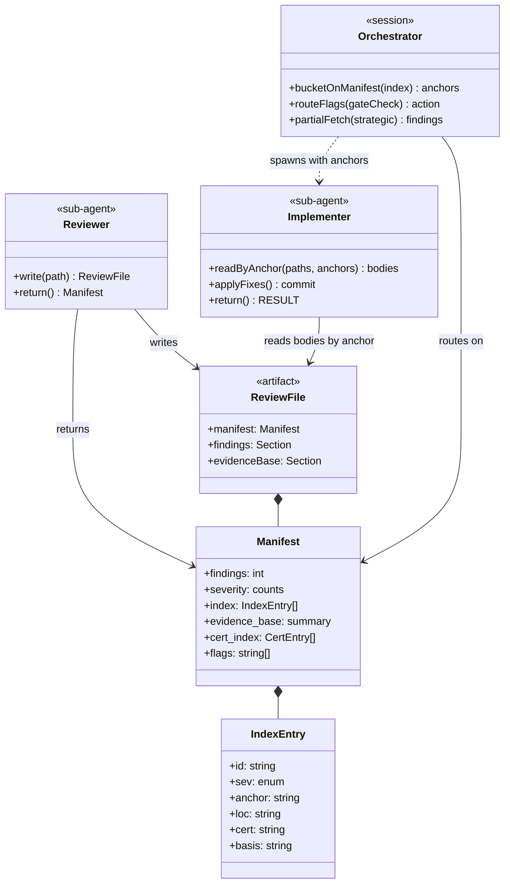
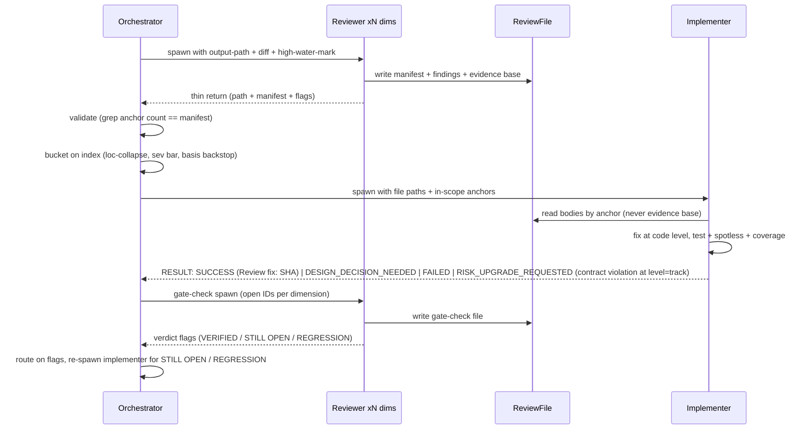
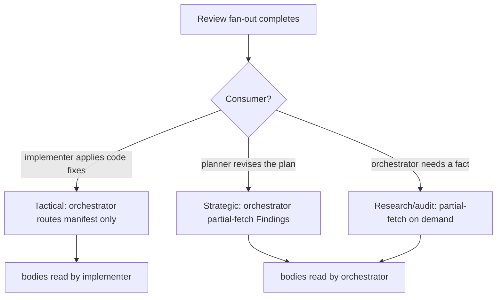

# Persist bulk sub-agent outputs; route tactical findings to the implementer — Design

## Overview

Before this change, every review sub-agent returned its findings as its final message, straight into the orchestrator's resident context. The orchestrator then deduplicated, assigned severity, bucketed, and handed a merged finding list to the implementer. That review loop was the orchestrator's dominant context filler and the near-exclusive cause of crossing the 40% `warning` gate, where a session teardown reloads the resident context as cache-create tokens — an estimated ~120-180K for a body-heavy review session. The steady-state carry is cheap; the restart it triggers is what costs.

This design serves the workflow engineer maintaining `.claude/`, and assumes familiarity with the Phase A/B/C review loop, the orchestrator's synthesis recipe (the former in-context dedup, severity, and bucket step), the §1.7 staging convention, the per-branch I6 invariant (live workflow stays at develop state until promotion), and the context-window `warning` gate.

Every bulk-producing sub-agent now writes its structured output to a file at a spawn-supplied path and returns only a thin manifest. The routing then splits by who consumes the finding bodies. For **tactical** code-review fan-outs (Phase B `risk:high` step review, Phase C track review, and gate-checks) the orchestrator never reads a body: it routes on the manifest metadata it already holds and hands the in-scope anchors to the per-iteration implementer, which partial-fetches the bodies, fixes at the code level, and escalates only design calls. For **strategic** reviews (Phase A panel, Phase 2 plan review, gate-verifications) the orchestrator keeps the partial-fetch read of `## Findings` from disk, because the consumer is the planner revising the plan, not an implementer. **Research and audit** sub-agents write their own file and return a summary the orchestrator partial-fetches on demand.

The enabling primitive is the manifest-plus-sections file schema: a machine-readable manifest header over anchored body sections, addressed by stable heading anchors rather than line offsets. The manifest is exactly what the sub-agent returns. Its canonical definition is a single subsection in `conventions-execution.md` (`§2.5`); every reviewer prompt, the orchestrator routing, and the implementer's anchor-read cite that subsection rather than restating the schema.

Restructured to fit: the synthesis recipe collapsed to manifest-only routing; per-dimension finding IDs became the sole addressing and the synthesis `M<n>` layer was removed; agent output became conditional on a supplied path because the dimensional agents are shared with standalone skills; the §1.7 staging convention generalized from two path prefixes to three so agent-definition edits stage like every other workflow file; and a verifiable refutation trail landed in each dimensional reviewer's file.

The rest of this document is structured as: Core Concepts, then Class Design and Workflow diagrams, then Part 1 (the persistence mechanism), Part 2 (routing and the decisions the orchestrator makes without bodies), Part 3 (the reviewer-side changes), and Part 4 (branch mechanics and coverage).

## Core Concepts

This design introduces eight load-bearing ideas. Each is named and used without re-definition in the Parts that follow; each entry pairs the concept with what it replaces so the delta from the prior state is visible at a glance.

**Manifest-plus-sections file.** A review output file whose head is a machine-readable manifest (counts, a per-finding index, evidence-base summary, flags) over anchored body sections (`## Findings`, `## Evidence base`). Replaces "the reviewer returns its findings inline as its final message". → Part 1 §"The file schema: manifest, anchors, and validation".

**Thin return.** The sub-agent's return is only the output-file path, the manifest block echoed verbatim, and urgent action signals. Replaces "the return is the full finding set". → Part 1 §"The file schema: manifest, anchors, and validation".

**Router model.** For tactical reviews the orchestrator routes on the manifest index and never ingests a body; the per-iteration implementer reads bodies by anchor and fixes. Replaces "the orchestrator reads every finding, synthesizes in-context, and hands a merged list down". → Part 2 §"Routing by consumer: tactical, strategic, research".

**Per-dimension addressing.** Findings are addressed by their per-reviewer ID prefix plus a heading anchor (`BC3` at `^### BC3 `), assigned by the reviewer itself rather than minted at synthesis; the synthesis-time `M<n>` IDs are removed. Replaces "the reviewer emits un-numbered `#### Critical`-style buckets and synthesis mints merged `M<n>` IDs that the orchestrator maps back to dimensions for gate-checks". → Part 2 §"Finding addressing without synthesis".

**Severity basis.** A one-line per-finding rationale in the manifest index that lets the orchestrator run an upgrade-only severity check without reading the body. Replaces "the orchestrator re-judges severity by reading each finding (the OVERRIDE step)". → Part 2 §"Severity: trust with an upgrade-only backstop".

**Path-conditional output.** A shared review agent writes the file-plus-manifest only when handed an output path, and returns inline otherwise. Replaces "the agent always returns inline". → Part 3 §"Path-conditional output and shared consumers".

**Dimensional evidence trail.** Each dimensional reviewer writes its Phase-4 refutation reasoning to the file's `## Evidence base` (survived claims as a roster line, refuted claims in full), making the false-positive guard verifiable post-hoc. Replaces "the refutation check is internal-only and unverifiable". → Part 3 §"The dimensional evidence trail".

**Three-prefix staging.** The §1.7 staging convention covers `.claude/workflow/`, `.claude/skills/`, and now `.claude/agents/`, so agent-definition edits stage and promote like every other workflow file. Replaces "agent edits are unstageable and land live on the branch". → Part 4 §"Staging generalized to three prefixes".

## Class Design

The artifacts and actors. The data shapes (`ReviewFile`, `Manifest`, `IndexEntry`) are what the schema standardizes; the three actors carry the responsibilities the routing splits between them.



The `Reviewer` writes a `ReviewFile` and returns its `Manifest`. The `Orchestrator` holds only `Manifest` data and never the body sections for tactical reviews; it buckets on the `IndexEntry` list, routes the gate-check `flags`, and (for strategic reviews only) partial-fetches `## Findings` itself. The `Implementer` is the one actor that reads tactical bodies, addressed by `IndexEntry.anchor`, and exits on a single structured `RESULT` block (`SUCCESS | DESIGN_DECISION_NEEDED | RISK_UPGRADE_REQUESTED | FAILED`; the routing under Part 2 covers which values are valid at `level=track`). The three mandatory `IndexEntry` fields (`id`, `sev`, `anchor`) are what every consumer can rely on; the three downstream fields (`loc`, `cert`, `basis`) are populated by the producer and read by the tactical-routing consumers — `loc` drives `loc`-collapse, `basis` feeds the orchestrator's severity backstop without a body, and `cert` addresses both the strategic certificate base and the dimensional evidence trail for contested-finding drill-down.

## Workflow

The tactical loop. Reviewers write files and return manifests; the orchestrator routes metadata; the implementer reads and fixes bodies; gate-checks return verdict flags the orchestrator routes on.



The routing decision that selects this loop versus the strategic path keys on the review's consumer, not its phase name.



# Part 1 — The persistence mechanism

This Part defines the file schema every bulk-producing sub-agent writes and the addressing that lets a reader fetch one finding without ingesting the rest.

## The file schema: manifest, anchors, and validation

**TL;DR.** Each bulk sub-agent persists its structured output to disk and returns only a machine-readable header over it. Readers reach one finding by a stable heading prefix (`^### T1 `), never a line number, and confirm the header's counts with a cheap ID-anchored grep before trusting the index; a count mismatch raises `CONTRACT_VIOLATION` and the reader falls back to the whole section. The schema's canonical home is `conventions-execution.md §2.5`, the single source of truth every other document cites.

The file opens with an HTML-comment manifest, then segregated sections:

```markdown
<!-- MANIFEST
findings: 12   severity: {blocker: 2, should-fix: 5, suggestion: 5}
index:
  - {id: BC1, sev: blocker,    loc: Foo.java:142, anchor: "### BC1 ", cert: C3, basis: "TOCTOU on shared cache map; concrete interleaving traced"}
  - {id: BC2, sev: should-fix, loc: Bar.java:88,  anchor: "### BC2 ", cert: C7, basis: "missing null check on nullable return"}
evidence_base: {section: "## Evidence base", certs: 20, matches: 16}
cert_index:
  - {id: C3, verdict: WRONG, anchor: "#### C3 "}
flags: [CONTRACT_OK]
-->

## Findings
### BC1 [blocker] ...
### BC2 [should-fix] ...

## Evidence base
#### C1 ... MATCHES
#### C3 ... WRONG
```

Addressing keys on anchors (`^### BC1 `, `^#### C3 `), which survive minor format drift; a line offset, when present, is an optional fast-path hint only. The manifest is the same block the sub-agent returns, echoed verbatim. Persisting to a file rather than returning the same structure inline is the load-bearing choice: an inline structured return tidies the message shape but leaves nothing on disk, so a mid-review `/clear` still re-spawns the whole panel. The file is what makes resume cheap.

Each `index` entry carries six fields under a mandatory-vs-downstream split. Three are **mandatory** on every producer's manifest: `id` (the per-reviewer finding ID, the anchor key and bucketing dimension proxy, never renumbered), `sev` (the severity, native scale allowed), and `anchor` (the stable heading the body is reached by). Three are **consumed downstream** — populated by every producer but read only by the tactical-routing consumers: `loc` (the `file:line` location, used for `loc`-collapse across dimensions), `cert` (the certificate or evidence-trail anchor, for contested-finding drill-down), and `basis` (the one-line impact statement, for the upgrade-only severity backstop). The split tells a reader which fields it may rely on being present versus which a particular consumer keys off.

Validation is an anchor-header grep, never a body read: a reader confirms the manifest's claimed `findings` count matches `grep -cE '^### [A-Z]+[0-9]+ '` over the file before trusting the index. The regex is ID-anchored on purpose. A bare `^### ` count would also catch any non-finding `### ` heading, the same false-positive trap the workflow-sha parser avoids by anchoring on its `workflow-sha:` literal instead of a bare 40-hex match. The character class is `[A-Z]+` (one-or-more uppercase), not `[A-Z]{2,}`: the strategic reviewers use single-letter prefixes (`T` technical, `R` risk, `A` adversarial, `S` structural) while the dimensional reviewers use two-letter prefixes (`BC`, `CQ`, …), and `[A-Z]{2,}` would return zero for a single-letter strategic file (`### T1 ` → 0) and raise a spurious `CONTRACT_VIOLATION`. The trailing space after `[0-9]+` excludes the four-hash `#### <cert>` evidence entries from the count.

So the `### <PREFIX><N> ` three-hash heading shape is reserved **file-wide** for finding anchors: a producer puts no other `### ` heading anywhere in the file, and all reasoning prose lives in `## Evidence base` (`#### ` four-hash entries) or inside a finding body. The file-wide reservation, not merely "under `## Findings`", keeps the count grep honest no matter where a stray heading might appear. Because the grep counts heading lines only, the orchestrator validates at spawn time without ingesting any body, so the no-bodies invariant holds through validation. On a count mismatch the manifest carries a `CONTRACT_VIOLATION` flag and the reader falls back to a whole-section read; the fallback owner differs by routing class (the implementer for tactical, the orchestrator or planner for strategic), so the orchestrator never falls back to a tactical body read.

### Edge cases / Gotchas

- A zero-finding reviewer writes an empty `## Findings` and a `findings: 0` manifest; the count grep returns 0, validation passes, and the orchestrator routes on counts and never spawns an implementer for an all-zero fan-out.
- Per-dimension filenames make every path unique across a parallel fan-out; concurrent reviewers never share a path. Each reviewer `mkdir -p`s its own `reviews/` directory (idempotent).
- The manifest comment must parse stably; it reuses the HTML-comment-plus-regex idiom the workflow-sha stamps already rely on.
- A gate-verifying reviewer writes the verdict-producer manifest variant: per-prior-finding verdicts in a verdicts block, with any net-new findings carried separately under the normal index.

### References

**D2. Manifest-plus-sections file schema + thin return.** Alternatives: keep the inline return (status quo); a structured return without a file, which gives no resume benefit. Rationale: the manifest header over anchored sections is the enabling primitive, and the thin return echoes it. The schema lives once in `conventions-execution.md §2.5`; consumers cite it. Risk: manifest parse-stability, mitigated by reusing the workflow-sha HTML-comment idiom.

**D3. Anchored partial-fetch addressing + count validation.** Alternative: line-offset addressing, rejected because it breaks on format drift. Rationale: stable heading anchors survive drift, and an ID-anchored grep validates the manifest before any body read. Risk: none material; line offsets stay an optional fast-path hint.

**S4.** The manifest `findings` count must equal the ID-anchored grep count (`^### [A-Z]+[0-9]+ `), else `CONTRACT_VIOLATION` and a whole-section fallback. The character class is `[A-Z]+`, covering both single-letter strategic and two-letter dimensional prefixes.

**S6.** Validation reads heading lines only, never a finding body.

# Part 2 — Routing and the decisions made without bodies

This Part defines the three routing classes and proves that the orchestrator can drive every tactical decision from the manifest index plus the track scope it already holds, with two named, deliberate exceptions.

## Routing by consumer: tactical, strategic, research

**TL;DR.** Who reads the finding bodies decides the class. Phase name does not enter the choice. A code-fix fan-out sends only anchors to the implementer and keeps every body out of the orchestrator; a plan-revision panel keeps the orchestrator's own partial-fetch; an Explore or audit pass writes a file and returns a summary the orchestrator pulls on demand. The orchestrator never retains a tactical body in its steady-state context; the one bounded exception is a single contested-finding block pulled transiently on drill-down and dropped before the next teardown.

Tactical fan-outs are Phase B `risk:high` step review, Phase C track review, and every gate-check re-run. The orchestrator buckets from the manifest index alone (collapse duplicate `loc` across dimensions, drop out-of-track findings to plan corrections by `loc`, keep blockers and in-scope should-fixes), then spawns the implementer with the raw file paths and the in-scope anchor list. The implementer reads the bodies by anchor and reconciles the cross-dimension framings at the code level — several reviewers flagging the same concern at one `file:line` resolve to a single edit, while genuinely distinct concerns at the same line (a lock-order bug and a missing null check) stay separate edits — so no orchestrator-side dedup pass runs; that reconciliation, including which same-line findings are one fix versus two, is the implementer's job. It applies the fixes and runs the standard test plus Spotless plus coverage gate, then exits on a structured `RESULT` block.

The per-iteration implementer runs at `level=track` and the orchestrator routes on its `RESULT`: `SUCCESS` carries a pushed `Review fix:` commit and the loop advances to the gate-check; `DESIGN_DECISION_NEEDED` escalates to the user and re-spawns; `FAILED` rolls back to the iteration's starting HEAD and routes to failure handling; `RISK_UPGRADE_REQUESTED` is a contract violation at track level (risk tags are a step-level concept) and is surfaced to the user rather than acted on. The four-outcome enum is the implementer's full return contract; the two-outcome happy path (`SUCCESS` / `DESIGN_DECISION_NEEDED`) is the common case, not the whole contract.

The alternative considered for tactical reviews was to have the orchestrator partial-fetch the bodies from disk itself, the way strategic reviews do. That loses: the read still lands the bodies in the long-lived orchestrator context and still crosses the warning gate, so it removes none of the restart-reload cost that motivates the design — it is the interim partial-fetch optimisation, not the win. Moving the body-read to the short-lived implementer is what drops the footprint, at the cost of more reconciliation reasoning per `loc` in the implementer; that cost is accepted, since the reasoning lives in a context discarded after the fix.

Strategic reviews are the Phase A technical/risk/adversarial panel, the Phase 2 consistency/structural plan review, and the plan/decomposition gate-verifications. Their consumer is the orchestrator or planner revising the plan; there is no implementer to delegate to, so the orchestrator keeps the partial-fetch read of `## Findings` from disk. The evidence base stays on disk, which is where the on-disk win is largest because the panel reviewers carry the biggest certificate bases.

Research and audit sub-agents (Phase 0/1 Explore, Phase 4 cold-read and design audit) write their own file in the same manifest schema and return a summary; the orchestrator partial-fetches the sections a decision needs.

The single place the orchestrator touches a tactical body is a contested-finding drill-down: it pulls one certificate or evidence-trail block by its `cert` anchor and drops it after the decision — transient, never retained across the next teardown, which is what keeps the qualified S1 above true. Escalation context does not need a body read, because the implementer that read the body carries the needed context forward in its `DESIGN_DECISION_NEEDED` return.

### Edge cases / Gotchas

- Gate-checks split across the boundary: a Phase B/C code gate-check is tactical (the implementer re-fixes), while a Phase 2/3A plan gate-verification is strategic (the orchestrator applies plan fixes itself).
- A `CONTRACT_VIOLATION` on a tactical file routes the whole-section fallback to the implementer through a dedicated handoff slot: the implementer spawn carries a `### Whole-section fallback (CONTRACT_VIOLATION)` sub-section listing the violated file paths, and the implementer's `findings:` input consumes that entry as a whole-section-fallback directive. The orchestrator never reads the violated body itself, so the no-bodies invariant holds even on the error path. A violated file counts as one routing unit, not a finding count the orchestrator cannot trust.
- Severity at a shared `loc` is routed per finding, not per merged row: the strictest finding at a `loc` is kept in-scope on its own merit, so collapsing at the code level loses none of the strictest-severity outcome the old synthesis merge produced. The upgrade backstop scans each `basis` independently; an emergent severity that surfaces only when several individually-benign findings combine is the one case it cannot see — the same blind spot the `basis` check already accepts.

### References

**D1. Router model for tactical reviews.** Alternatives: the orchestrator partial-fetches bodies from disk itself, which still lands them in long-lived context and still crosses the warning gate; keep inline synthesis (status quo). Rationale: only routing the body-read to the short-lived implementer drops the footprint from the long-lived orchestrator. Risk: more reconciliation reasoning per `loc` in the implementer, accepted because that context is discarded after the fix.

**S1.** The orchestrator never retains a tactical finding body in steady-state context; the one bounded exception is a single contested-finding block pulled transiently on drill-down and dropped before the next teardown.

## Severity: trust with an upgrade-only backstop

**TL;DR.** The orchestrator takes each reviewer's self-assigned label at face value and drops the body-dependent re-grading in the lenient direction. It keeps a one-directional check: a one-line `basis` field in the manifest index lets it raise an under-graded correctness finding without reading the body. A label that reads too harsh is safe; one that reads too lenient is the only case that can ship a real bug.

The former synthesis recipe had the orchestrator re-judge each finding's severity by reading the body: downgrade a `blocker` that is really a style preference, upgrade a `suggestion` whose stated impact reads higher. Both directions need the body. The manifest carries `sev` but not the rationale, so the body-dependent re-judgment cannot run on metadata alone.

The two directions are not equally dangerous. A downgrade dropped is the cheaper direction: trusting an over-severe reviewer routes a nit in-scope, the implementer fixes it, and nothing ships broken. It is not free — an over-severe `blocker` is always in-scope and consumes an implementer fix-cycle against the iteration cap, and the synthesis recipe's lenient-direction OVERRIDE partly existed to protect the orchestrator's pre-spawn context budget against exactly that inflation. But this design removes that orchestrator-side pressure at its root by keeping every tactical body off the orchestrator, so the residual cost of a dropped downgrade is implementer effort, not orchestrator context. An upgrade missed is the failure that matters: a real correctness, crash-safety, CI-hang, or data-loss issue under-severed as `suggestion` gets deferred or dropped with no backstop. So the design drops the downgrade OVERRIDE and keeps the upgrade direction, fed by the minimum signal that makes it possible: a one-line `basis` per index entry stating why the reviewer assigned that severity. The orchestrator scans, manifest-only, for any `suggestion`/`should-fix` whose `basis` describes a correctness/crash/CI-hang/data-loss impact and upgrades it; it never second-guesses a `blocker`.

This is the same signal the OVERRIDE used, compressed: OVERRIDE fired when a finding's prose impact contradicted its label, and `basis` surfaces exactly that contradiction. It misses only a finding whose one-liner also under-describes the impact, where the full body would mislead the orchestrator too. Two thinner alternatives were set aside: tightening reviewer prompts to never under-severe leaves nothing to catch the label that still slips through, and having the orchestrator pull the body whenever it doubts a label reintroduces the exact body reads the design removes. The `basis` field also seeds plan-correction stubs, so it earns its place twice.

### Edge cases / Gotchas

- Strategic reviews keep native OVERRIDE for free: the orchestrator reads `## Findings` there, so it has the body.
- `basis` is manifest metadata, not a body. Across a wide fan-out it adds roughly one line per finding, negligible against the body footprint removed; the no-bodies invariant is intact.

### References

**D4. Severity trust + upgrade-only `basis` backstop.** Alternatives: full trust dropping the OVERRIDE both ways (no under-severance backstop); tighten reviewer prompts only (no backstop); pull the body on doubt (reintroduces body reads); a sev-only manifest (no drill signal). Rationale: a dropped downgrade is the cheaper direction while a missed upgrade ships a real bug, so `basis` is the minimum manifest signal that makes a one-directional upgrade check possible. Risk: a finding whose `basis` and label both under-describe the impact is missed.

**S1.** The no-bodies invariant, stated in full under Routing by consumer.

## Finding addressing without synthesis

**TL;DR.** Per-dimension IDs (`BC3`, `TC4`) are the sole key for naming a review item; the merge-time `M<n>` labels are removed. ID assignment moved from the orchestrator's merge step to the reviewer itself: each dimensional agent self-assigns its `<PREFIX><n>` IDs and writes one `### <PREFIX><n> ` anchored body per item, where it formerly emitted un-numbered `#### Critical`-style buckets and the orchestrator minted the IDs while merging. The move simplifies the gate-check, which already speaks per-dimension, and deletes the `M<n>`-to-dimension un-mapping plus the audit-trail tracking that supported it. REGRESSION rows are excluded from `loc`-collapse.

The former synthesis assigned merged `M<n>` IDs, then the orchestrator mapped each `M<n>` back to its contributing dimensions to compose the gate-check's `{findings_under_recheck}` (which is why the recipe recorded contributing dimensions in an audit trail). Removing synthesis removes the merge step, so findings stay per-dimension end to end. The gate-check's per-dimension addressing becomes the only addressing, and the un-map round-trip plus the contributing-dimensions tracking both disappear. Per-dimension gate-check is also more precise: each dimension verifies its own concern against the implementer's one code-level fix.

Cumulative numbering moves with the IDs. The orchestrator formerly kept the per-dimension counter in the synthesis audit trail and handed it back to the reviewer at gate-check via `{findings_under_recheck}`, which the reviewer continued from. Under this design the orchestrator instead passes each dimension's prior high-water-mark to the reviewer at spawn, and the reviewer continues from it at the initial review too, reusing the same hand-back mechanism the gate-check already runs one step later. The `M<n>` counter was a redundant second counter and is dropped. The orchestrator's `loc`-collapse is non-destructive grouping that keeps every row individually addressable, so a Review-mode override naming `BC3` matches the manifest index `id` directly. REGRESSION-flagged rows are excluded from `loc`-collapse so a regression's `revert-or-repair` guidance reaches the implementer unmerged.

### Edge cases / Gotchas

- The per-reviewer `id` prefix is load-bearing twice: it is the dimension proxy for kind-based bucketing and the match key for the Review-mode override. It must be preserved, never renumbered.
- The `loc`-collapse groups on an exact `file:line` match (the `loc` field), with physical proximity an explicit non-load-bearing hint only; the implementer re-decides one-fix-versus-two at the code level when it reads the bodies.
- `commit-conventions.md` needs no change: it already speaks per-dimension (`CQ33`) and prefers a descriptive `Review fix:` subject over citing any ID.

### References

**D5. Per-dimension IDs are the sole addressing; `M<n>` removed.** Alternative: keep the synthesis `M<n>` layer. Rationale: removing the merge step deletes the `M<n>`-to-dimension un-map and the audit-trail tracking; ID assignment moves to the reviewer, which continues from the per-dimension high-water-mark the orchestrator already hands back at gate-check. Risk: none material; `commit-conventions.md` already speaks per-dimension.

**S2.** The per-reviewer `id` prefix is preserved, never renumbered.

**S3.** REGRESSION-flagged rows are excluded from `loc`-collapse and reach the implementer unmerged with `revert-or-repair` guidance.

# Part 3 — Reviewer-side changes

This Part covers what each dimensional agent emits: output gated on a supplied path, and a verifiable refutation trail.

## Path-conditional output and shared consumers

**TL;DR.** A dimensional review agent writes its file only when handed an output path; with no path it returns inline as before. The gate is mandatory because three callers spawn these agents — the workflow orchestrator plus the standalone `/code-review` and `/fix-ci-failure` skills — and the standalone two read findings inline. Supplying the path is what switches on the new behavior, so only the workflow caller gets it.

The same `review-*` agents serve the workflow fan-out and the standalone `/code-review` and `/fix-ci-failure` skills. An unconditional file-plus-manifest output would break the standalone skills, which read findings inline. Teaching `/code-review` and `/fix-ci-failure` to supply paths and read files would also have worked, but it balloons the change into two skills outside this issue's scope. So the agent's output is conditional on the output-path parameter: the workflow injects it at the dispatch sites that compose each review spawn (the Phase C track-level launch in `track-code-review.md` and the Phase B step-level launch in `step-implementation.md`, not `review-agent-selection.md`, which only picks which agents fire), so the workflow gets file-plus-manifest; the standalone skills supply no path, so they keep their inline behavior untouched. The no-path branch stays byte-for-byte the prior inline format, native severity scales and all, with no ID prefix; only the path branch emits the manifest plus `### <ID>` anchored bodies, so the reviewer-side ID assignment above never leaks into the standalone callers. The four pure-standalone agents (`code-reviewer`, `pr-reviewer`, `test-quality-reviewer`, `dr-audit`) are never in the workflow fan-out and carry an explicit `exempt because: invoked standalone, output consumed by the user in the same turn, not accumulated in an orchestrator session` annotation.

### Edge cases / Gotchas

- Path-conditional output also makes a live agent-definition edit safe against the develop-state branch run: with no path passed, the develop-state orchestrator gets inline output and nothing mismatches.
- The output path is a per-spawn variable; the manifest schema instruction lives in the agent definition (the natural home), gated by the path's presence.

### References

**D6. Path-conditional agent output.** Alternatives: unconditional file output, which breaks the standalone `/code-review` and `/fix-ci-failure` (they read inline); teach those skills to supply paths and read files, a scope balloon into two skills. Rationale: write file-plus-manifest only when handed an output path, so only the workflow caller switches behavior and a live agent-definition edit stays safe against the develop-state run. Risk: none material.

**S5.** The coverage rule, stated in full under Coverage and exemptions.

## The dimensional evidence trail

**TL;DR.** Each reviewer writes its Phase-4 refutation reasoning to the file's `## Evidence base` (survived claims as a one-line roster entry, refuted or non-passing claims in full), making the false-positive guard verifiable after the fact. It is read only on a contested-finding drill-down, so it never enters a long-lived context. A reviewer where the cost does not pay carries an `exempt because…` annotation.

The dimensional `review-*` agents run a structured protocol (premises, code-path traces, formal claims, and a Phase-4 refutation check that tries to disprove each claim before reporting) but formerly emitted only findings. Internal-only made the refutation check unverifiable: nothing on disk confirmed it ran, so a reviewer that skipped it under load looked identical to one that did it. The trail now lands in `## Evidence base`. The `§2.5` schema standardizes the section, the `evidence_base` manifest summary, and the `cert_index` of `#### <cert>` verdict entries; the body-rendering convention — survived claims compressed to one line, refuted or non-passing claims in full — lives in each dimensional agent definition, reusing YTDB-1069's roster rendering. The routine reader is the implementer, which reads only `## Findings`, so the trail never enters any long-lived context. The trade is a small, compressed, net-new reviewer-output cost (~1.4K tokens per reviewer, ~3% of review cost) for a verifiable guard, with an `exempt because…` hatch for any dimension where it does not pay.

### Edge cases / Gotchas

- The strategic reviewers already emit certificate bases; for them the `## Evidence base` schema maps existing output, and the change is mostly file-write plus thin return.
- A dimensional agent whose protocol carries no refutation phase (a `certs: 0` reviewer) writes an empty `## Evidence base` and marks each finding's `cert` as `n/a`, rather than cross-linking to a non-existent certificate.
- The `cert`/`cert_index` addressing covers both the strategic certificate base and this dimensional trail, so contested-finding drill-down uses one mechanism.

### References

**D8. Dimensional evidence trail in `## Evidence base`.** Alternatives: internal-only refutation (unverifiable); drop the guard. Rationale: writing the Phase-4 refutation reasoning to disk makes the false-positive guard verifiable after the fact, reuses YTDB-1069's roster rendering, and is read only on a contested-finding drill-down; `§2.5` standardizes the section shape while the agent definitions own the survived/refuted body rendering. Risk: roughly 1.4K net-new tokens per reviewer (about 3% of review cost), with an `exempt because…` hatch where it does not pay.

**S5.** The coverage rule, stated in full under Coverage and exemptions.

# Part 4 — Branch mechanics and coverage

This Part covers the staging change that lets agent edits stage like every other workflow file, the lifecycle that makes resume work, and the coverage rule that binds every bulk-producing class.

## Staging generalized to three prefixes

**TL;DR.** The §1.7 convention formerly covered two path prefixes; adding `.claude/agents/` makes it cover a third, so agent-definition edits route to the staged mirror, stay at develop state on the live tree until Phase 4, and promote with the rest. Every workflow-machinery edit activates together at promotion; the branch runs develop-state machinery at runtime and validates after promotion. This generalization lands first, as the precursor track every other track depends on.

Staging formerly covered `.claude/workflow/` and `.claude/skills/` only, so agent edits would land live on the branch and the harness would load them mid-branch. Generalizing to a third prefix makes the treatment uniform: write-routing, the reads-precedence check, the rebase-precedes-promotion divergence check, the I6 invariant, the `WORKFLOW_SHA` computation and drift pathspec, the pre-commit gate, and the Phase 4 promotion (`cp -r` plus the `git add .claude/workflow .claude/skills .claude/agents` line and the matching three-prefix divergence check) all extend to `.claude/agents/`. The canonical workflow-modifying marker sentence and its consumers update in lockstep; the marker matcher is prefix-agnostic so a plan's verbatim two-prefix marker still matches both the live gate during the precursor track and the staged three-prefix gate after.

Because the orchestrator reads develop-state workflow at runtime (post-promotion validation is accepted), the branch's own execution runs the old inline mechanism end to end with no mismatch, and the whole feature flips on together at the Phase 4 promotion commit. This is the load-bearing reason the design needs no runtime dogfooding: there is nothing half-flipped to corrupt a Phase C on the authoring branch. Path-conditional output alone would also keep the develop-state run safe with no staging at all, but it forfeits the I6 invariant and the staged-mirror hygiene, and an agent-only edit would no longer register as a workflow-format change for drift detection — so staging earns its place beyond runtime safety.

### Edge cases / Gotchas

- Cross-branch consequence: once agent edits count as workflow-format commits, an agent-only commit on develop triggers drift detection (and a migration prompt) for in-flight branches. This is correct: agent edits are workflow-format changes.
- The `WORKFLOW_SHA` stamp base and the drift `WORKFLOW_PATHSPECS` move in lockstep across all three prefixes; a lagging base would spuriously start a drift range before an agent-only commit.
- `.claude/scripts/` is not a staged prefix: the precheck and reindex scripts and their tests are edited live, and live script commits raise no drift because the workflow pathspecs exclude `.claude/scripts/`.
- The marker-sentence literal is matched case-sensitively by multiple consumers; the edit that adds the third prefix updates every matcher in the same commit.

### References

**D7. Staging generalized to three prefixes (`.claude/agents/` added).** Alternatives: leave agents unstaged, so agent edits land live mid-branch and I6 holds only partially; path-conditional output alone with no staging, which keeps the run safe but loses I6 and the property that an agent-only develop commit registers as a workflow-format change. Rationale: uniform treatment of all workflow machinery, activating at the Phase 4 promotion, with the branch self-staging its later-track agent edits via reads-precedence once the precursor track lands the rule. Risk: cross-branch drift churn, accepted as correct; the marker-sentence literal is the highest-care edit.

**S5.** The coverage rule, stated in full under Coverage and exemptions.

## Lifecycle, persistence, and resume

**TL;DR.** Review files are written and committed at reviewer-return, live in the real `_workflow/plan/track-N/reviews/`, and are swept by the Phase 4 cleanup commit. Committing at return (not merely writing) is the resume precondition: a `/clear` after a completed review pass resumes from the persisted files instead of re-spawning the panel, which is the restart-reload payoff. It does not change the Phase A re-run rule for an interrupted iteration.

The review files are plan-directory artifacts, not `.claude/` files, so they never touch the staged mirror; they live in the real `_workflow/` and the Phase 4 cleanup sweep removes them alongside `handoff-*.md`. The thin episode block points at the files and records manifest counts only, inside the canonical episode shape. On a pause after a review pass has completed and its file is committed, resume reads the committed file (manifests for routing, `## Findings` for strategic) rather than re-spawning that reviewer. This does not override the Phase A re-run rule for an *interrupted* iteration: `track-review.md` gates Phase A resume on the `## Outcomes & Retrospective` checkboxes and re-runs an interrupted review type from iteration 1, because mid-iteration findings are not trustworthy once a partial fix has landed. The persistence payoff is the completed-review boundary, where the file is the durable record. The commit point matters: a crash before the commit would lose the files and force the re-spawn the design avoids, so the orchestrator commits review files as a Workflow-update commit at reviewer-return.

### Edge cases / Gotchas

- The `plan/track-N.md` file and the `plan/track-N/` directory coexist without collision; the §2.1 lifecycle must not glob `plan/*` expecting files only.
- The manifest the orchestrator carries is small (roughly the index plus `basis`, a few hundred lines for a wide fan-out) against the 25-65K body footprint removed, so the manifest itself does not reintroduce the warning-gate pressure.

### References

**D10. Review files committed at reviewer-return.** Rationale: committing (not merely writing) at return is the resume precondition, so a crash before the commit cannot force the re-spawn the design avoids; the files are plan-directory artifacts (never staged), swept by the Phase 4 cleanup, and the resume payoff is scoped to the completed-review boundary, not overriding the Phase A re-run-from-iteration-1 rule. Risk: the `plan/track-N.md` file and the `plan/track-N/` directory coexist, so the §2.1 lifecycle must not glob `plan/*` expecting files only.

**S1.** The no-bodies invariant, stated in full under Routing by consumer.

## Coverage and exemptions

**TL;DR.** Every bulk-producing sub-agent class either follows the file-plus-manifest rule or carries an explicit `exempt because…` annotation. The rule's canonical home is the `conventions-execution.md §2.5` subsection; other docs cite it rather than restating it.

The covered classes are the Phase A panel reviewers, the Phase B and Phase C dimensional reviewers, the Phase B/C and Phase 2/3A gate-check reviewers, the Phase 2 plan reviewers, and the Phase 0/1 and Phase 4 research/audit sub-agents. Each writes its own file and returns a thin manifest or summary; the body consumer is the implementer for tactical findings and the orchestrator or planner for strategic findings and research. Across the sixteen dimensional `review-*` agents, ten carry a refutation phase and write a cert-bearing `## Evidence base`, while six (the code-quality, test-structure, and the four workflow-machinery reviewers) have no refutation phase and are evidence-trail-exempt with `certs: 0`. The four pure-standalone agents are exempt, and `review-mode.md`'s `FIX_FINDING` path is exempt because its triples are user-sourced, tiny, and already in the orchestrator's conversation context. The rule plus the `exempt because…` hatch is itself an invariant: a new bulk-producing agent class must declare one or the other.

### Edge cases / Gotchas

- The issue's Files list missed several load-bearing sites picked up during implementation: `implementer-rules.md` (the `findings:` field and `FIX_NOTES` references), the `structural-review.md` and `design-review.md` prompts, and `review-mode.md`; `Explore` has no agent file (its change lands in `research.md`'s delegation text); `commit-conventions.md` is out of scope, and `step-implementation-recovery.md` needs only a light consistency pass.

### References

**D9. Pure-standalone review agents exempt.** Scope: `code-reviewer`, `pr-reviewer`, `test-quality-reviewer`, `dr-audit`. Rationale: each is invoked standalone with output consumed by the user in the same turn, never accumulated in an orchestrator session, so the restart-reload motivation does not apply; each carries an explicit `exempt because…` annotation. Risk: none material.

**S5.** Every bulk-producing sub-agent class follows the file-plus-manifest rule or carries an explicit `exempt because…` annotation.
