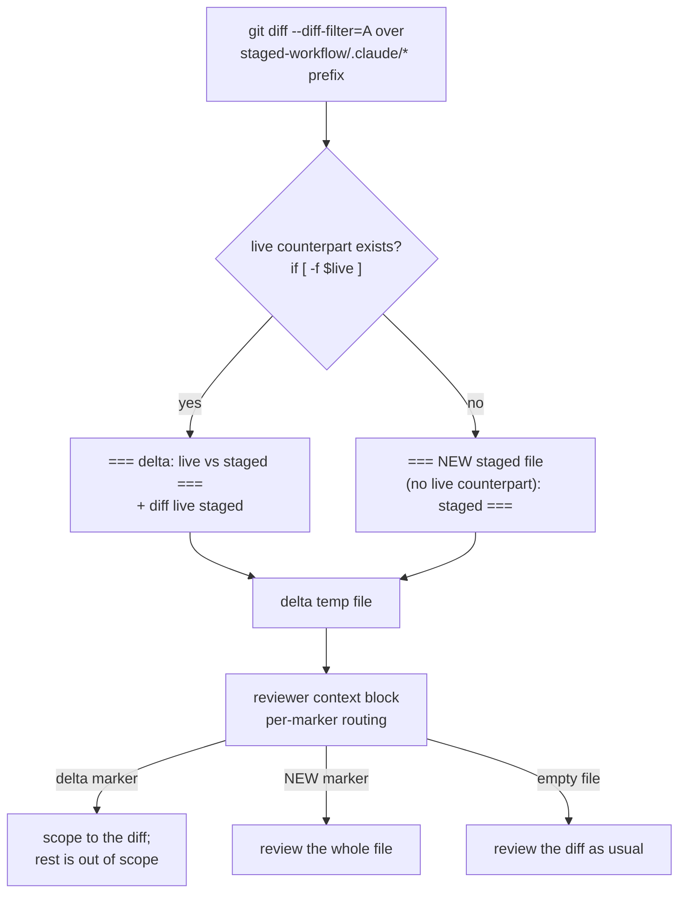

# Review genuinely-new staged files in full (Phase B/C) — Architecture Decision Record

## Summary

A genuinely-new staged `.claude/**` file — one with no counterpart on `develop` — is now reviewed in full during both Phase B (step-level review) and Phase C (track-level review). Before this change the staged-file review setup marked such a file out of scope and shipped it unreviewed while the machinery reported a clean pass.

Two terms recur below. A **staged copy** is the `docs/adr/<dir>/_workflow/staged-workflow/.claude/…` mirror of a `.claude/**` file that a workflow-modifying track edits; committing the mirror lets a draft PR show the edit without the branch overwriting a live rule mid-run. The **delta file** is a temp file the review setup builds so a reviewer scopes findings to the actual edit instead of the whole-file add the diff shows: for each staged copy with a live counterpart it holds a `diff <live> <staged>`.

The setup built a delta entry only when the staged copy had a live counterpart, and the reviewer-facing context block routed on the delta file being non-empty. A new file has no live counterpart, so it produced no delta entry and was treated as verbatim-copied, already-reviewed content — out of scope. The fix records new files under an explicit marker and rewrites the context block to route per marker: a copy-of-live file scopes to its delta, a new file is reviewed whole.

## Goals

- A staged file with no live counterpart is reviewed in full in both Phase B and Phase C, without the orchestrator hand-listing it for reviewers.
- The reviewer's context block distinguishes a copy-of-live staged file (scope to the delta) from a genuinely-new one (review in full).
- Copy-of-live staged files and ordinary (non-staged) plans keep their existing behavior — the delta-scoping and the inert empty-delta path are unchanged.

All three goals were met as planned; no goal was descoped or altered during implementation.

## Constraints

- The defect logic sits across four locations in each of two review-setup docs (`track-code-review.md` for Phase C, `step-implementation.md` for Phase B): the preamble prose, the loop's `if [ -f "$live" ]` guard, the post-loop narration, and the reviewer context block. All four must move together or the prose contradicts the bash. A fifth adjacent passage — the review-burden estimate — becomes wrong for a new file and must move with them.
- The two files carry a near-verbatim copy of the same setup. They stay mirrored (differing only in temp-file path and indentation) rather than sharing an include: workflow docs are standalone Markdown read independently per phase, and no include mechanism exists.
- All scoping edits ship in one commit. Any per-file or per-location split creates a committed intermediate state where the loop emits the new marker while the context block still folds it into "out of scope" — the exact contradiction the change removes.

## Architecture Notes

### Component Map

- The `else` branch on the `if [ -f "$live" ]` guard is the whole loop-side fix. The loop already enumerates the new file — it is a `--diff-filter=A` add under the staged prefix — the file simply fell through the guard with no else.
- The context block moved from a file-level gate ("when the delta file is non-empty, scope to the delta") to per-marker routing. Removing the file-level gate is the load-bearing part: a new-file-only delta file is non-empty yet carries zero diff lines, so any surviving "non-empty ⇒ scope to the delta" framing would route it into scoping-to-nothing and reintroduce the defect.
- Two documents carry this setup identically, modulo the temp-file path (`track-{N}-delta` vs `step-{N}-{M}-delta`) and indentation: `.claude/workflow/track-code-review.md` (Phase C Startup step 8, cumulative range `{base_commit}..HEAD`) and `.claude/workflow/step-implementation.md` (Phase B step-level review on `high` steps, step range `{commit}~1..{commit}`). Implemented in commit `c310214714`.

### Decision Records

**D1: Fix both files, all four scoping locations per file, plus the burden-measure line.** Fix `track-code-review.md` and `step-implementation.md`, and within each file the four scoping locations (preamble, loop guard, post-loop narration, context block) plus the review-burden estimate — ten edits across the two files. The context block is a full rewrite: it drops the file-level non-empty routing gate entirely and replaces it with per-marker routing. *Rationale:* the defect is one logical bug — a missing no-live-counterpart case plus the "out of scope" instruction — but the scoping that produces it is stated four times per file, and the near-verbatim second file under-covers silently if left untouched. Editing a subset leaves a prose/code contradiction a consistency review flags. *Rejected:* fixing only the loop and context block, or only the Phase C file the issue literally names (leaves contradicting preamble/post-loop prose and the defective Phase B copy); de-duplicating into a shared include (no include mechanism exists, and adding one dwarfs the bug). Implemented as planned.

**D2: The new-file marker emits the staged path.** The `else`-branch marker is `=== NEW staged file (no live counterpart): <staged> ===`, naming the staged path, not the derived live path. *Rationale:* the reviewer locates the file in the diff, which shows it under its staged path as a whole-file add; the derived live path is that path minus a fixed prefix, so it adds no locating power. *Rejected:* emitting the derived live path (names the semantic identity while the reviewer needs the file's location in the diff); emitting both (redundant — the live path is a deterministic prefix-strip). Implemented as planned; the marker text is identical in both files.

**D3: Edit the workflow prose live under the §1.7(k) opt-out.** The change edits the two files live under `.claude/workflow/` rather than staging copies — single-track, `design_gate=no`, minimal complexity. The **§1.7(k) opt-out** is the judgment-layer rule that lets a small prose fix skip the staging machinery. *Rationale:* the change is confined to judgment-layer workflow prose. This branch adds no new `.claude/**` file, so the bug it fixes cannot trigger on this branch's own review, and the opt-out disables the staged-delta prep the fix touches — editing live carries no self-referential hazard. *Rejected:* full §1.7 staging (its overhead is unwarranted for a two-file prose fix with no new-file adds). *Consequence:* the fix ships without in-workflow self-validation; a manual coherence trace across the ten edit points and the acceptance-verifying reviews stand in for the missing self-run.

### Invariants & Contracts

- A staged add with no live counterpart appears in the delta file under a `=== NEW staged file (no live counterpart): … ===` marker, never silently absent.
- The context block presents the delta-scoped case (scope to the delta) and the new-file case (review in full) as a per-entry, mutually-exclusive distinction keyed on the marker. No file-level "when non-empty ⇒ scope to the delta" gate and no blanket "out of scope" sentence survive — either would route a new-file-only (non-empty, zero-delta) file into scoping-to-nothing.
- The added `else` branch and the rewritten context block diverge across the two files only in the temp-file path and indentation. The surrounding loop scaffolding keeps its pre-existing git-diff-range divergence (`{commit}~1..{commit}` vs `{base_commit}..HEAD`), which the fix does not touch.
- On a plan with no staged adds the loop yields an empty delta file and the context block stays inert, matching pre-fix behavior.
- No file other than the two named carries a copy of the loop or context block; `conventions.md §1.7(k)` holds only a pointer, not a third copy.
- The review-burden estimate distinguishes a copy-of-live staged file (line count inflated; the `diff <live> <staged>` delta is the truer measure) from a new staged file (whole-file content is the real review surface; no such delta exists), so it never labels a new file's line count as review-free noise.

### Integration Points

- `conventions.md §1.7(k)` references the Phase C Startup staged-delta prep in `track-code-review.md` step 8 as a pointer. The fix keeps its step-8 wording consistent with that reference but lands no edit there.
- Reviewer dispatch already routes a new staged file to reviewers. The staged-path normalization in `code-review/SKILL.md` and `review-agent-selection.md` is a pure prefix-strip with no live-existence check, so a new staged file matches the workflow-review globs and a reviewer launches. The fix changes only what a launched reviewer treats as in-scope, which is why the two-file footprint is complete.

### Non-Goals

- De-duplicating the loop and context block into a shared include.
- Changing which reviewers launch or how dispatch resolves a staged path.
- Editing `conventions.md §1.7(k)` or any file beyond the two named review-setup docs.

## Key Discoveries

- **The defect lived in two files, not one.** The issue named only the Phase C setup. Research found a near-verbatim copy of the same loop and context block in the Phase B step-level review. Both had to move together, or the Phase B copy would keep under-covering silently.
- **The load-bearing bug sat in the file-level non-empty gate, one level above the "out of scope" sentence.** A new-file-only delta file is non-empty yet carries zero diff lines. Under the old wording the outer "when non-empty ⇒ scope to the delta" gate routed it into scoping-to-nothing, so an appended note would have left the defect in place. Dismantling the file-level gate and routing per marker was the correction.
- **Reviewer dispatch already handled new staged files, so the footprint is provably complete.** The staged-path normalization strips a fixed prefix with no live-existence check, so a new file already reaches a reviewer. Confirming this bounded the fix to what a launched reviewer treats as in-scope — no dispatch edit was needed.
- **The acceptance grep for the loop marker is ambiguous as first written.** The source marker is `=== delta: %s vs %s ===`. Grepping the quote-adjacent pattern `'delta: %s vs %s'` matches nothing under a literal-single-quote reading; the bare substring `delta: %s vs %s` is the form that resolves the loop and context block to exactly the two named files. Grepping the bare delta temp-path is not the check — it also matches the two inert `rm -f` teardown lines and adds noise.

## Adversarial gate verdicts

The pre-code adversarial gate over the research log passed on its second pass (blockers resolved, then passed — 2 passes). The first pass returned one blocker and one should-fix: the fix scope was too narrow (the no-live-counterpart scoping also lived in the preamble and post-loop narration, beyond the loop and context block), and the context block needed a full rewrite rather than an appended sentence (a new-file marker makes the delta file non-empty, so an append would still sit under the blanket "out of scope" routing). Both were resolved — the scope was widened to all four per-file locations and the context-block rewrite was specified — and the second pass cleared with no new findings, ready for artifact derivation.

## Token usage telemetry

Snapshot from this worktree's sessions over its lifetime (N=7 sessions across 27 transcripts).

### Tool mix — share of total session context

| Component             | Share |
|-----------------------|------:|
| `Read` tool results   | 65.5% |
| `Bash` tool results   | 7.6% |
| `Grep` tool results   | 0.2% |
| `Edit` tool results   | 0.4% |
| Other tool results    | 2.4% |
| Prompts and output    | 23.9% |

### Top files by share of `Read` token consumption

| File                                            | Share of Read |
|-------------------------------------------------|--------------:|
| docs/adr/review-new-files/_workflow/plan/track-1.md | 23.4% |
| .claude/workflow/track-code-review.md           | 7.2% |
| .claude/output-styles/house-style.md            | 6.8% |
| .claude/workflow/implementer-rules.md           | 5.9% |
| .claude/workflow/step-implementation.md         | 5.8% |
| .claude/workflow/prompts/adversarial-review.md  | 5.8% |
| .claude/workflow/prompts/consistency-review.md  | 3.7% |
| docs/adr/review-new-files/_workflow/research-log.md | 3.6% |
| .claude/workflow/track-review.md                | 3.4% |
| .claude/workflow/conventions-execution.md       | 3.3% |

Generated by `.claude/scripts/measure-read-share.py` against
`~/.claude/projects/-home-andrii0lomakin-Projects-ytdb-review-new-files/`.
