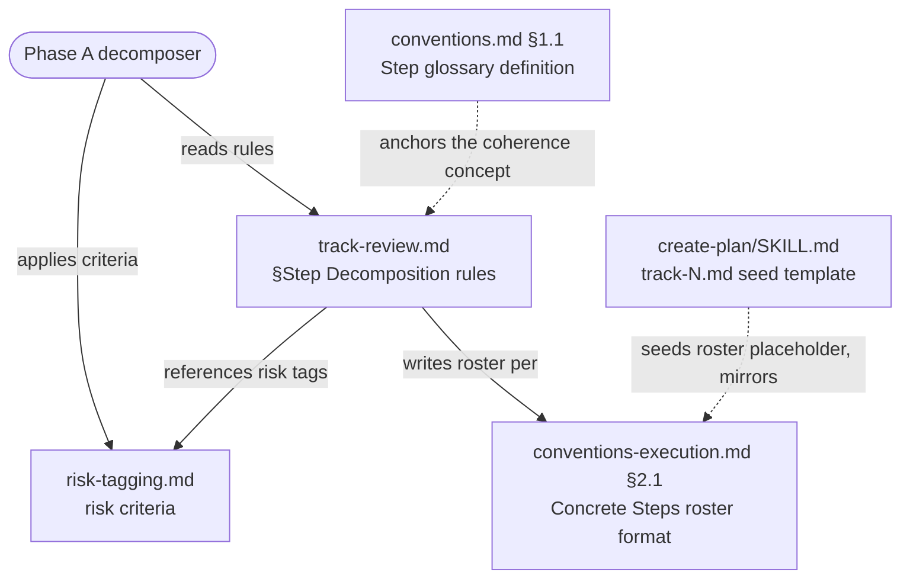

# Low/Medium Step Merging and Under-Fill Justification — Architecture Decision Record

## Summary

The Phase A decomposer now sizes `low`/`medium` steps with an accountability rule. Coherence drops from a mandatory split wall to a preference for `low`/`medium` steps, so the decomposer may merge several changes, related or not, into one step to reach the ~12-edited-files fill target. A `low`/`medium` step that still lands below the target carries an inline `— size: ~N files; <reason>` clause on its `## Concrete Steps` roster line, naming a reason from a closed two-entry set. `high` steps keep their existing isolation: each HIGH change stays its own step with no file cap, so step-level dimensional review still sees one whole change at a time.

The change is directive-only and spans five workflow files the decomposer reads: the glossary "Step" definition, the §Step Decomposition rules, the risk-tagging criteria, the canonical roster format, and the create-plan seed template. It introduces no new threshold and no new verification gate.

## Goals

- Give the fill-toward-~12 directive an accountability half: an under-filled `low`/`medium` step must justify its size, so over-splitting a track into many small steps is visible rather than silent. **Met.**
- Remove the coherence obstacle that blocked merging: let the decomposer merge unrelated `low`/`medium` work toward the fill target. **Met.**
- Preserve `high`-step isolation and the step-level-review routing that depends on it. **Met** — the high-isolation bullet and the `risk: high`-only step-level review gate are unchanged.
- Keep the blast radius small. **Met** — five files, no new threshold, no Phase C verification gate.

## Constraints

- Workflow-modifying plan: edits land under `.claude/workflow/**` and `.claude/skills/**`. Per `conventions.md` §1.7 the edits accumulated in a staged mirror during execution and promoted to the live tree at Phase 4.
- Reuse the existing `~12` fill number as the justification trigger; introduce no new per-step threshold. The workflow already keeps `~5`, `~12`, and `~20-25` distinct and warns against conflating them, and `~14` (the overblown-split line) lives in `track-review.md` §Step Decomposition. **Held** — the trigger is the existing `~12`.
- Do not change the fill-toward-~12 rationale, the `~5` MEDIUM trigger value, or the `~20-25` track-level ceiling. **Held.**
- All prose follows the House Style (`.claude/output-styles/house-style.md`).

## Architecture Notes

### Component Map

- **`conventions.md` §1.1 (glossary "Step").** The "Step" row defines a step as one logically continuous change committed together, not a minimal file count. As built, the row makes coherence mandatory for `high` steps and a preference for `low`/`medium`, and points to `track-review.md` §Step Decomposition for the sizing detail.
- **`track-review.md` §Step Decomposition.** The decomposer-facing rules; the bulk of the change. The Coherence bullet is scoped so coherence is mandatory only at `high`; the Fill-toward-~12 bullet gains the `low`/`medium` merge allowance and the under-fill justification sub-bullet; the risk-tagging roster example gains the optional `— size:` clause.
- **`risk-tagging.md`.** Gains a short merged-step rule near the ~5/~12 interplay note: re-apply the standard criteria to the combined content (the max of the constituents' tags). A `high` change is never merged.
- **`conventions-execution.md` §2.1.** The canonical `## Concrete Steps` roster format and its lifecycle-table row gain the optional inline `— size:` clause, present only when an under-filled `low`/`medium` step triggers it.
- **`.claude/skills/create-plan/SKILL.md`.** The `track-N.md` seed template's `## Concrete Steps` placeholder comment gains a mention of the optional `size:` clause, parallel to the existing `commit:` annotation, so every new track file starts consistent with the canonical roster format.

### Decision Records

#### D1: Reuse `~12` as the justification trigger, not a new threshold
- **Decision**: Tie the under-fill trigger to the existing `~12` fill target rather than adding a separate `< 10 files` cutoff.
- **Rationale**: The workflow already maintains several distinct per-step / per-track numbers and warns against conflating them — `conventions.md` §1.2 keeps `~5`, `~12`, and `~20-25` distinct, and `~14` is the overblown-split line in `track-review.md`. Reusing `~12` keeps "fill toward the ceiling" and "justify if you land below it" as two halves of one number; a fifth number adds confusion for no gain.
- **Caveat**: A step at 11 files is technically "below ~12." The `~` approximate convention absorbs it; the rule reads "below the fill target," not a hard cutoff.
- **Outcome**: Implemented as planned. The under-fill rule in `track-review.md` §Step Decomposition triggers on the existing `~12`; no new threshold was added.

#### D2: Relax mandatory coherence for `low`/`medium`; allow merging
- **Decision**: Drop coherence from mandatory to preferred for `low`/`medium` steps so unrelated changes may merge toward ~12.
- **Rationale**: The project squash-merges every PR into one commit, so per-step commits never reach `develop` and the revert/bisect granularity coherence protected is the whole PR regardless. Fewer, fuller steps remove (k-1) cold-read re-pays per track, which is the fill directive's own stated rationale.
- **Caveat**: Muddier per-step episodes, lost intra-track parallelism for merged steps, and multi-concern `medium` commits that exist only inside the branch. All bounded; none survives merge.
- **Outcome**: Implemented as planned. The Coherence bullet in `track-review.md` is scoped to `high`; `low`/`medium` may merge unrelated coherent changes, and the glossary "Step" row carries the same split.

#### D3: `high` steps are never merged; each stays isolated
- **Decision**: Keep every HIGH change in its own isolated `high` step; the merge allowance is confined to `low`/`medium`.
- **Rationale**: Step-level dimensional review fires only on `risk: high` (`code-review-protocol.md`, `review-agent-selection.md`, `track-code-review.md`). Isolating every HIGH change keeps that review seeing one whole change at a time. This is the load-bearing property that makes D2 safe: merging `low`/`medium` hides nothing a reviewer would otherwise see.
- **Outcome**: Implemented as planned. The High-risk isolation bullet is preserved verbatim; the merge allowance never touches `high`.

#### D4: Merged-step risk tag = standard criteria re-applied to combined content
- **Decision**: Tag a merged step by re-applying the standard `risk-tagging.md` criteria to its combined content, not by a bespoke "merged → medium" rule.
- **Rationale**: Re-applying the criteria yields the max of the constituents' tags in the common case (`low+low → low`, `low+medium → medium`), and the existing ">~5 files of logic in one module" MEDIUM trigger raises a `low+low` logic merge to `medium` with no new rule. The direction is always safe: a merged step is reviewed at least as heavily as its largest constituent.
- **Caveat**: A decomposer must re-evaluate the merged content, not carry a stale constituent tag forward. The rule states this explicitly.
- **Outcome**: Implemented as planned. The merged-step rule sits in `risk-tagging.md` next to the ~5/~12 interplay note.

#### D5: Inline, triggered-only justification clause with a closed reason set
- **Decision**: Add the justification as an inline clause on the roster line, present only when triggered, with a closed two-entry reason set.
- **Rationale**: An inline clause matches the thin-roster contract and the existing `risk: <level> (override: <reason>)` parenthetical precedent. The valid reasons are a closed set of two: no mergeable `low`/`medium` work fits (rest of the track is `high`, end of the track, or the only remaining unit would overflow the ~14 line), and the heavy-iteration carve-out. "Unrelated" and "inter-step dependency" are excluded by construction, since unrelated and interdependent `low`/`medium` work is merged, not left small.
- **Caveat**: The reason set is a judgement the decomposer asserts; a false claim is visible on the roster line but not machine-checked (D6).
- **Outcome**: Implemented as planned. The clause form is `— size: ~N files; <reason>`, written at Phase A and immutable afterward.

#### D6: Directive-only; no Phase C verification gate
- **Decision**: Land the rule as a decomposer-facing directive with no automated Phase C check that flags a sub-threshold step missing its clause.
- **Rationale**: Keeps the blast radius to five files (no `track-code-review.md` edit). The decomposer self-applies the rule at Phase A, where the roster is written.
- **Caveat**: No automated verification; a decomposer could omit the clause. Accepted; revisit if under-filling persists in practice.
- **Out-of-scope rationale (widened during implementation)**: The original plan justified leaving two reader-side roster-format descriptions (`step-implementation.md`, `track-code-review.md`) unedited on the grounds that they serve roster→episode joining via the `commit:` annotation, which the optional `size:` clause does not affect. That rationale was incomplete for `track-code-review.md`: it also parses the inline `risk:` token to weight focal points, not only `commit:` for joining. The decision still holds, for a sharper reason than the plan stated. The roster line orders its tokens as `description — risk: … — size: … [status] commit: …`, so the `size:` clause sits after the `risk:` token behind the ` — ` separator, and the `commit:` annotation lands after any `size:` clause. A consumer that reads `risk:` or `commit:` by token position sees the same value with or without the size clause. Both reader-side descriptions therefore stay correct unedited, and the canonical optional-annotation set lives in `conventions-execution.md` §2.1. The five-file blast radius holds for behavioral routing and the canonical format.
- **Outcome**: Implemented as planned, with the out-of-scope rationale widened as above.

### Invariants & Contracts

- **S1**: Every HIGH-category change occupies its own `high` step; no merged step contains a HIGH category. This is the property that makes coherence relaxation safe.
- **S2**: A merged `low`/`medium` step's risk tag equals the standard criteria applied to its combined content, never below the max of its constituents' tags.
- **S3**: The glossary "Step" definition, the Coherence rule, the Fill/merge rule, the roster format, and the create-plan seed-template placeholder tell one non-contradicting story across the five edited files.

### Non-Goals

- No change to `high`-step isolation or step-level-review routing.
- No new Phase C (`track-code-review`) verification gate.
- No change to the `~5` MEDIUM trigger value or the `~20-25` track-level ceiling.
- No change to how the actual edited-file count is measured at Phase B; the rule operates on the Phase A planned footprint, as the fill directive already does.

## Key Discoveries

- **The roster needs an explicit token order once a second optional annotation exists.** With both an optional `— size:` clause and the existing `commit:` annotation on the line, the append order has to be pinned: `risk:` first, then any `size:` clause, then the status checkbox, then `commit:`. Without the pin, a consumer that joins roster lines to episodes by token position could misread. The canonical order is stated in `conventions-execution.md` §2.1 and mirrored in the create-plan seed template, so every new track file starts consistent. This ordering is also what keeps `track-code-review.md`'s `risk:`-token focal-point read unaffected by the new clause (see D6).

- **A `track-code-review.md` reader parses `risk:`, not only `commit:`.** The out-of-scope analysis for the reader-side roster-format descriptions initially rested on the `commit:` annotation alone. `track-code-review.md` also reads the inline `risk:` token to weight focal points. The delimited token order keeps that read correct, but the discovery sharpens the blast-radius argument: an additive roster clause is safe for token-position readers only when it lands behind a stable delimiter and after the tokens those readers key on.

- **A single-step `risk: high` track collapses the two review layers into one.** A track with exactly one `high` step skips the Phase C track-level code review, because the cumulative track diff and the single step's diff are identical. The step-level review on such a track therefore has to stand in for the track-level pass and run the full workflow-review selection, not the narrow step-level set. This matters to any future workflow change in the step-sizing / risk-tagging / review-routing area: the step-level and track-level review selections are not always two separate passes.

- **The change is reflexive and self-applied cleanly.** This rule governs how the decomposer sizes steps, so the decomposition of the change itself was subject to it. Workflow machinery is a HIGH risk category, so the five-file edit landed as a single isolated `high` step rather than being split — which is exactly what the high-isolation rule (D3) prescribes for a coherent HIGH change spanning many files.

## Token usage telemetry

Snapshot from this worktree's sessions over its lifetime (N=9 sessions across 23 transcripts).

### Tool mix — share of total session context

| Component             | Share |
|-----------------------|------:|
| `Read` tool results   | 65.3% |
| `Bash` tool results   | 8.3% |
| `Grep` tool results   | 0.0% |
| `Edit` tool results   | 0.5% |
| Other tool results    | 3.9% |
| Prompts and output    | 22.0% |

### Top files by share of `Read` token consumption

| File                                            | Share of Read |
|-------------------------------------------------|--------------:|
| <outside-worktree>                              | 10.0% |
| .claude/workflow/self-improvement-reflection.md | 7.6% |
| docs/adr/step-size-jsutification/_workflow/plan/track-1.md | 7.6% |
| .claude/workflow/implementer-rules.md           | 7.2% |
| .claude/skills/edit-design/SKILL.md             | 4.9% |
| docs/adr/step-size-jsutification/_workflow/staged-workflow/.claude/workflow/track-review.md | 4.8% |
| docs/adr/step-size-jsutification/_workflow/implementation-plan.md | 4.6% |
| .claude/workflow/conventions.md                 | 4.3% |
| .claude/output-styles/house-style.md            | 4.3% |
| .claude/workflow/track-review.md                | 3.7% |

Generated by `.claude/scripts/measure-read-share.py` against
`~/.claude/projects/-home-andrii0lomakin-Projects-ytdb-step-size-jsutification/`.
