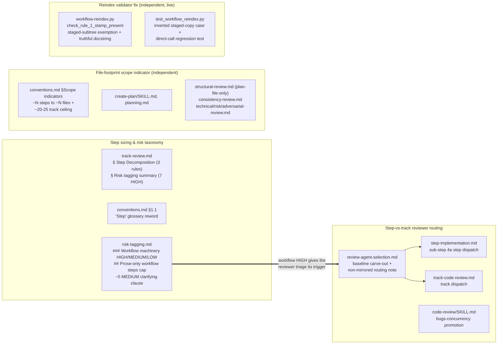

# Step Sizing and Reviewer Routing — Architecture Decision Record

## Summary

The per-step `~3 edited file` size cap was unmeasured and never bound: a third of realized steps exceeded it cleanly, and over-cap steps showed a *lower* recorded-defect rate than within-cap ones. This change removes the cap and sizes steps by three rules instead — coherence (one logical change per step), high-risk isolation (each HIGH change alone in its own `high`-tagged step), and a fill-toward-~12-edited-files directive for ordinary steps. It also splits review-agent dispatch into step-level versus track-level for the first time: a reviewer fires at a high step only when its findings are localized to that step's diff and would be buried if deferred; everything else defers to the cumulative Phase C track review. Two supporting changes make the split well-defined and consistent: a workflow-machinery risk taxonomy (so a `.claude/**` edit can be tagged HIGH and trigger the workflow-reviewer split) and the promotion of `review-bugs-concurrency` to a mandatory baseline across all three review paths. The plan-checklist scope indicator also moves from a `~N steps` count to a `~N files` footprint, because steps do not exist until decomposition while the file set is known at plan time.

All work landed in workflow-machinery prose under `.claude/workflow/**` and `.claude/skills/**` (staged under the branch's `_workflow/staged-workflow/` mirror until the Phase 4 promotion) plus one live validator fix in `.claude/scripts/workflow-reindex.py`.

## Goals

The four planned goals were met, with one decision modified mid-execution and one added.

- **Drop the unmeasured `~3`-file cap and size by three rules instead.** Achieved. `track-review.md` § Step Decomposition now states coherence, high-risk isolation, and fill-toward-~12; the `conventions.md` §1.1 glossary "Step" row was reworded so "atomic" means coherent, not minimal-file.
- **Split review-agent dispatch into step-level versus track-level.** Achieved. A new non-mirrored routing note in `review-agent-selection.md` is the single source of truth that the step dispatch (`step-implementation.md` sub-step 4a) and the track dispatch (`track-code-review.md`) consume.
- **Add a workflow-machinery risk taxonomy.** Achieved. `risk-tagging.md` gained a `### Workflow machinery` HIGH subsection, workflow MEDIUM/LOW lines, and a `## Prose-only workflow steps` cap; this is the precondition that gives the workflow-reviewer triage its trigger.
- **Promote `review-bugs-concurrency` to a mandatory baseline and state its workflow exclusion.** Achieved. `code-review/SKILL.md` lists it as always-launched, matching its baseline status in the workflow path.

Two adjustments to the planned scope:

- The scope-indicator change (a `~N files` footprint replacing `~N steps`) gained a track-level `~20-25`-file plausibility ceiling during execution, distinct from the per-step thresholds. See D8.
- A validator fix emerged: the first end-to-end exercise of the staging convention hit a reindex false-positive that blocks the CI gate on a non-draft PR. See D9.

## Constraints

- **Workflow-modifying staging.** Every workflow-prose edit routed through the §1.7 staging mirror; the live `.claude/workflow/**` and `.claude/skills/**` tree stayed at develop's state for the whole branch lifetime, promoted in one Phase 4 commit. The staging invariant held throughout (no live-path workflow write outside the promotion commit).
- **Mirror-set wiring.** The step-vs-track timing could not live in the `§Maintenance`-mirrored sections of `review-agent-selection.md`, which mirror `code-review/SKILL.md` verbatim and `SKILL.md` carries no step/track notion. It went into a new, non-mirrored note.
- **Shared files across concerns.** `risk-tagging.md` and `conventions.md` were each touched by two concerns in disjoint sections; the staged copy accumulated both, and each review delta-scoped to its own sections.
- **Self-application limit.** This branch's diffs are workflow-only, so the baseline-skip override removes the whole baseline group at every step and no step exercises the Java-step baseline routing the change introduces. The branch exercises the step sizing rules, the workflow risk taxonomy, the workflow-reviewer triage, and the staged-vs-live review; the baseline-routing change reviews its own diff at the track level, not at a step. Under develop's live taxonomy (no workflow-machinery category), every step on this branch tagged `low`, so all review deferred to the Phase C track pass.
- **Validator fix scope.** The `.claude/scripts/` validator edit is outside the staging scope, so it landed live and left the staged set untouched.

## Architecture Notes

### Component Map

The change is a rules change across workflow-machinery prose plus one validator script. The load-bearing edge is that the workflow-machinery risk taxonomy is the trigger the workflow-reviewer split keys off, so the routing change depends on the taxonomy. The scope-indicator rewrite and the validator fix are independent.

### Decision Records

#### D1: Raise the per-step footprint cap to ~12 with a fill-toward-cap directive
**Decision.** Replace the `~3 edited file` cap with three rules: coherence (the only mandatory split, all tiers; file count alone never forces a split), high-risk isolation (each HIGH change in its own `high`-tagged step, no file cap), and a fill-toward-~12-edited-files directive for ordinary `low`/`medium` steps that flags ~14+ as overblown.
**Rationale.** The `~3` cap never bound (33% of steps exceeded it cleanly) and bought no quality (over-cap defect rate 5.9% versus within-cap 15.8%). Peak implementer context tracks iteration count (Pearson r 0.81), not edited files (r 0.37); the measured ceiling for ≤13 edited files sat at 245K against the 400K warning band. The fill rule is a directive — collapsing k small steps removes (k-1) ~23K-token cold-read re-pays — not a permission.
**Outcome.** Implemented as planned in `track-review.md` § Step Decomposition, keeping the trivial-merge floor verbatim. The ~14+ overblown flag was scoped to `low`/`medium` steps during review so it does not collide with high-risk isolation's no-file-cap. Carve-out retained: prefer splitting when the work is iteration-heavy (debugging-prone or test-churny). The coverage gate is unchanged.

#### D2: Reword the glossary "Step" so "atomic" means coherent, not minimal files
**Decision.** Reword the `conventions.md` §1.1 "Step" row so "atomic" means one coherent, logically continuous change committed together, explicitly not a minimal file count, with a pointer to the footprint guidance.
**Rationale.** "Atomic" read as "smallest indivisible," which fights the fill directive at the most authoritative definition site (the glossary is annotated `roles=any phases=any`).
**Outcome.** Implemented as planned; the reword reuses the § Step Decomposition coherence phrasing so the two sites agree.

#### D3: Keep ~5 as the MEDIUM threshold, distinct from the ~12 split cap
**Decision.** Keep `risk-tagging.md`'s MEDIUM trigger at ~5 files; add only a clarifying clause tying it to the ~12 split cap.
**Rationale.** The two numbers measure the same unit (edited files) for two different decisions: crossing ~5 raises a logic step to `medium` (more Phase C focal-point attention), while ~12 is where any step splits. The old ~3 cap sat *below* ~5, an inversion that split a step before it could be classified medium-by-file-count; at ~12 the ordering is restored. Bumping ~5 toward ~12 would drop 6–11-file logic changes to `low` and lose the focal-point signal.
**Outcome.** Implemented as planned; the clause also notes that fill-toward-~12 routinely pushes ordinary single-module steps past ~5, producing a larger `medium`-tagged Phase C population by design.

#### D4: Baseline triage — bugs-concurrency at the step, the other three at track
**Decision.** Of the four baseline (Java) reviewers, only `review-bugs-concurrency` runs at a high step; `review-code-quality`, `review-test-behavior`, and `review-test-completeness` defer to the cumulative Phase C track review.
**Rationale.** `review-bugs-concurrency` (bug / logic-error / resource-leak / null-safety) catches defects best before they bury in a cumulative diff. The other three read identically on the cumulative diff, so they lose no coverage by deferring.
**Outcome.** Implemented in `review-agent-selection.md`, `step-implementation.md` sub-step 4a, and `track-code-review.md`. The track-level set is unchanged: all four baselines plus the full trigger-based workflow-reviewer selection still run at Phase C. "Defer to track" means an agent no longer also runs at the step; the track pass already runs it. Subordinate to the workflow-only/docs-only baseline-skip override.

#### D5: Workflow-reviewer triage — hook-safety and prompt-design at the step
**Decision.** Of the six workflow-machinery reviewers, `review-workflow-hook-safety` and `review-workflow-prompt-design` run at a high step (selected by their existing file-pattern globs); `consistency`, `context-budget`, `writing-style`, and `instruction-completeness` defer to track.
**Rationale.** The same localized-versus-cumulative test partitions the six. `hook-safety` (script correctness, `/tmp` collisions, JSON validity) and `prompt-design` (one prompt's decision rules, frontmatter, `$ARGUMENTS`) are localized. `consistency` (cross-file), `context-budget` (whole-system surface), and `writing-style` (diff-agnostic) are cumulative. `instruction-completeness` is the judgment call: its gate/resume-path checks span files, so a step lands false positives a later step resolves — it defers to track.
**Outcome.** Implemented in the non-mirrored routing note plus the two dispatch points. The step dispatch was made to explicitly inherit the `§Workflow-machinery override`'s staged-path normalization, closing a completeness gap: without it, a high step's staged paths on a workflow-modifying plan would have matched no live-path glob and the step-level workflow reviewers would have silently failed to launch. The step-level workflow reviewers are selected by file-pattern glob, not by risk category — the taxonomy only decides whether a step is `high`.

#### D6: Add the workflow-machinery risk taxonomy
**Decision.** Add HIGH/MEDIUM/LOW criteria for `.claude/**` edits, keyed to blast radius across sessions and whether the artifact executes or drives control flow, plus a prose-only LOW cap.
**Rationale.** No workflow HIGH category existed, so the workflow-reviewer triage would have had no trigger. HIGH covers a hook/script/`settings*.json` that runs automatically, a load-bearing gate or protocol, the shared schema every file keys off, and the always-loaded context surface (root `CLAUDE.md`). The prose-only cap is the workflow analog of the existing tests-only cap.
**Outcome.** Implemented as a `### Workflow machinery` subsection under `## HIGH-risk triggers` in `risk-tagging.md`, with workflow MEDIUM/LOW lines and a `## Prose-only workflow steps` cap. Root `CLAUDE.md` is HIGH (MEDIUM was weighed and rejected). The `track-review.md` § Risk tagging summary was synced to seven HIGH categories so it does not drift. The prose-only cap carries the full "no hook/script/settings change and no gate/dispatch/schema change" qualifier, and the schema-change-versus-gloss hinge is stated so a meaning-changing glossary/TOC/enum edit reads HIGH while a wording-preserving gloss reads LOW.

#### D7: bugs-concurrency mandatory in three paths, excluded from workflow
**Decision.** Promote `review-bugs-concurrency` in `code-review/SKILL.md` to "Always launched (unless `docs-only` or `build-config` are the ONLY categories)," and state its exclusion from workflow-machinery changes as an explicit triage rule.
**Rationale.** It was baseline in the workflow path but conditional in the standalone `/code-review` skill, a cross-path discrepancy. The workflow exclusion is already the behavior (workflow-only diffs skip the baseline group; mixed diffs scope-filter to Java files); stating it makes the Java and workflow review paths read as deliberately disjoint.
**Outcome.** Implemented as planned. The plural "are the ONLY categories" wording was chosen over the singular paraphrase to match the sibling test-review baselines verbatim and to correctly cover a pure `docs-only` + `build-config` diff. The baseline/conditional table is outside the `§Maintenance` mirror set, so no sync-stamp bump was needed.

#### D8: Scope indicators measure planned file footprint, not step count
**Decision.** Rewrite the plan-checklist `**Scope:**` line from `~N steps covering X, Y, Z` to `~N files covering X, Y, Z`, and rekey the structural/consistency sizing check from a claimed-versus-described mismatch to a footprint-versus-norm comparison.
**Rationale.** A step count pre-judges decomposition (steps do not exist until execution) and anchors the reader on a number the workflow itself calls non-binding. The planned in-scope file set already lives in each track file's §Interfaces and Dependencies at plan time, so a file footprint reports scope rather than a decomposition prediction. A line count was rejected as fabricated precision; full removal was rejected because it drops the plan-file-only sizing check for no gain over dropping just the misleading unit.
**Outcome.** Modified during execution in two ways. First, a track-level plausibility ceiling of `~20-25` in-scope files was added, distinct from the per-step ~12 split cap and ~5 MEDIUM trigger: a legitimate multi-step track aggregates many steps and routinely sits past 12 files, so reusing the per-step numbers as the track ceiling would mis-flag normal-sized tracks. (This is also distinct from the unrelated `~5-7 steps` track-sizing rule — a count of steps a track may hold — which was left untouched.) Second, the structural-review sizing check became plan-file-only by *removing* a cross-file track-file read it actually carried; the plan's "stays plan-file-only" framing was a mis-statement of the status quo, corrected to "establishes plan-file-only by dropping the read." The resulting check is a coarser plausibility signal, a trade accepted in exchange for the plan-file-only property. Three enumerated targets turned out to carry no `~N steps` format literal (`implementation-review.md`, `inline-replanning.md`, the `review-workflow-consistency` agent) and were verified rather than edited.

#### D9: Exempt the staged-workflow mirror from reindex rule_1
**Decision.** Exempt the staged-workflow subtree from `workflow-reindex.py`'s `check_rule_1_stamp_present` (rule_1) via the existing `_STAGED_SUBTREE_PREFIX_RE`, placed before rule_1's `docs/adr/` early-return.
**Rationale.** Rule_1 demands a line-1 `workflow-sha` stamp on every in-scope `docs/adr/`-rooted path, but the validator's in-scope globs are entirely the staged-workflow mirror, which §1.7(e) requires to be a byte-verbatim copy of the unstamped live file (§1.6(f) excludes staged copies from the stamped set). Rule_1 therefore false-positived on every staged copy, and the CI `workflow-toc-check.yml --check` gate fails on a non-draft PR for any workflow-modifying branch that stages a copy. Rejected alternatives: prepend a stamp to each staged copy (the Phase 4 promotion `cp -r` would land the stamp on the live file, corrupting it), and relocate the mirror (§1.7(a) fixes the staging location).
**Rationale for keeping rule_1.** After the exemption, rule_1 has no remaining reachable in-scope target: its live-path globs are filtered out by the `docs/adr/` early-return, and the only `docs/adr/`-rooted globs are the now-exempt staged mirror. It is kept as a harmless guard against a future re-introduced non-exempt `docs/adr/` glob. The "document rule_1 as drift-gate-enforced" framing was rejected as factually wrong: the startup-precheck drift gate enforces line-1 stamps on the §1.6(f) stamped artifact set, a set disjoint from the validator's in-scope globs, not on rule_1's staged-mirror target.
**Outcome.** Implemented as a live `.claude/scripts/` edit, outside the staging scope, so the staged-set invariant was unaffected. The rule_1 docstring was rewritten to the truthful framing above. The existing staged-path missing-stamp test was inverted and renamed to assert exemption, and a direct-call regression test (the suite's first) was added to keep rule_1's empty-file and malformed-stamp branches covered after the exemption orphans them from glob reachability. The validator's `--check` now exits 0 on a tree carrying staged copies.

### Invariants & Contracts

- **Staging invariant (§1.7(g)).** The branch's own authoring of `.claude/workflow/**` and `.claude/skills/**` content moves from the staged mirror into the live tree only at the single Phase 4 promotion commit; no other commit on the branch carries a live-path workflow write. Held throughout.
- **Stamp exclusions (§1.6(f)).** Staged copies and the Phase 4 final artifacts (`design-final.md`, `adr.md`) are excluded from the workflow-sha stamped set. The validator fix aligns rule_1 with this exclusion.
- **Reviewer-coverage invariant.** Deferring a reviewer from the step level to the track level loses no coverage, because the Phase C track review runs against the cumulative diff. The track-level reviewer set was held unchanged (all four baselines plus the full workflow-reviewer selection).
- **Threshold separation.** Three file-count numbers stay distinct and must not be conflated: the per-step ~12 split cap, the per-step ~5 MEDIUM trigger, and the track-level ~20-25 scope-indicator ceiling. The `~5-7 steps` track-sizing rule is a fourth, separate signal (a step count) left untouched.

### Non-Goals

- Changing the MEDIUM ~5-file threshold *value* (only its wording was clarified).
- Adding step-level review for `low`/`medium` steps (only `high` steps reach step-level review).
- Widening any conditional reviewer's trigger or forcing any agent on.
- A workflow-specific "when in doubt, high" decomposer override (the existing override applies unchanged).
- Migrating this branch's own plan-file scope lines from `~N steps` to `~N files` mid-branch — the live convention is unchanged until the Phase 4 promotion and the plan file is removed at cleanup, so those lines never reach develop.

## Key Discoveries

- **The cap was unmeasured and counterproductive.** The `~3` number entered verbatim in the first workflow commit and was never calibrated. The measured picture inverts the intuition behind it: over-cap steps had a lower recorded-defect rate (5.9%) than within-cap steps (15.8%), bugs cluster in small logic-dense steps, and peak implementer context correlates with iteration count (r 0.81) far more than edited files (r 0.37). This is the evidentiary basis for sizing by coherence and iteration risk rather than file count.
- **The staging convention's first end-to-end exercise exposed a latent tooling contradiction.** The reindex validator demanded a stamp on exactly the staged copies that the staging rules require to be unstamped verbatim duplicates, so the CI `--check` gate fails on a non-draft PR for any workflow-modifying branch. This is structural, not branch-specific: every future workflow-modifying branch that stages a copy would hit it absent the fix. It surfaced only because this was the first branch to run staging from first staged write through promotion.
- **Exempting the staged mirror orphans rule_1 from glob reachability.** Once staged copies are exempt, rule_1 has no path that both passes its `docs/adr/` gate and reaches the stamp check, because the validator's only `docs/adr/`-rooted globs are the staged mirror. Stamp enforcement for the real stamped set lives in a disjoint gate (the startup-precheck drift gate), not in this validator. The orphaned empty-file and malformed-stamp branches needed the suite's first direct-call unit test to stay covered, since `--check` no longer reaches them.
- **Three file-count numbers measure the same unit at different granularities.** The per-step ~12 split, the per-step ~5 MEDIUM trigger, and the track-level ~20-25 scope-indicator ceiling all count files but answer different questions; the per-step thresholds leaked into the track-footprint checks during execution and would have mis-flagged normal-sized tracks until the track-level ceiling was carved out. A fourth signal, the `~5-7 steps` track-sizing rule, counts steps and is unrelated.
- **A workflow-only branch cannot fully dogfood Java-step baseline routing.** Under develop's live risk taxonomy (which has no workflow-machinery category until this change reaches develop), workflow-prose edits fall to the docs/LOW default, so every step here tagged `low` and none reached step-level dimensional review. The baseline-skip override further removes the whole baseline group on a workflow-only diff. The branch validates the sizing rules, the workflow taxonomy, the workflow-reviewer triage, and the staged-vs-live review; the Java-step baseline routing it introduces is reviewed at the track level on its own diff, not exercised at a step.
- **The step-level workflow dispatch must inherit the override's staged-path normalization.** A high step on a future workflow-modifying plan presents staged paths (`_workflow/staged-workflow/.claude/...`); without explicitly routing those through the same normalization the track-level dispatch uses, they match no live-path reviewer glob and the step-level workflow reviewers silently launch none. The dispatch now points at the override mechanics directly.

## Token usage telemetry

Snapshot from this worktree's sessions over its lifetime (N=22 sessions across 99 transcripts).

### Tool mix — share of total session context

| Component             | Share |
|-----------------------|------:|
| `Read` tool results   | 65.7% |
| `Bash` tool results   | 9.3% |
| `Grep` tool results   | 0.0% |
| `Edit` tool results   | 0.4% |
| Other tool results    | 4.1% |
| Prompts and output    | 20.5% |

### Top files by share of `Read` token consumption

| File                                            | Share of Read |
|-------------------------------------------------|--------------:|
| .claude/workflow/implementer-rules.md           | 11.7% |
| <outside-worktree>                              | 11.6% |
| docs/adr/step-size-recap/_workflow/plan/track-3.md | 6.6% |
| docs/adr/step-size-recap/_workflow/design.md    | 6.0% |
| docs/adr/step-size-recap/_workflow/implementation-plan.md | 5.4% |
| docs/adr/step-size-recap/_workflow/plan/track-2.md | 5.2% |
| .claude/workflow/self-improvement-reflection.md | 5.0% |
| docs/adr/step-size-recap/_workflow/plan/track-1.md | 3.4% |
| .claude/workflow/track-code-review.md           | 2.9% |
| docs/adr/step-size-recap/_workflow/plan/track-4.md | 2.7% |

Generated by `.claude/scripts/measure-read-share.py` against
`~/.claude/projects/-home-andrii0lomakin-Projects-ytdb-step-size-recap/`.
