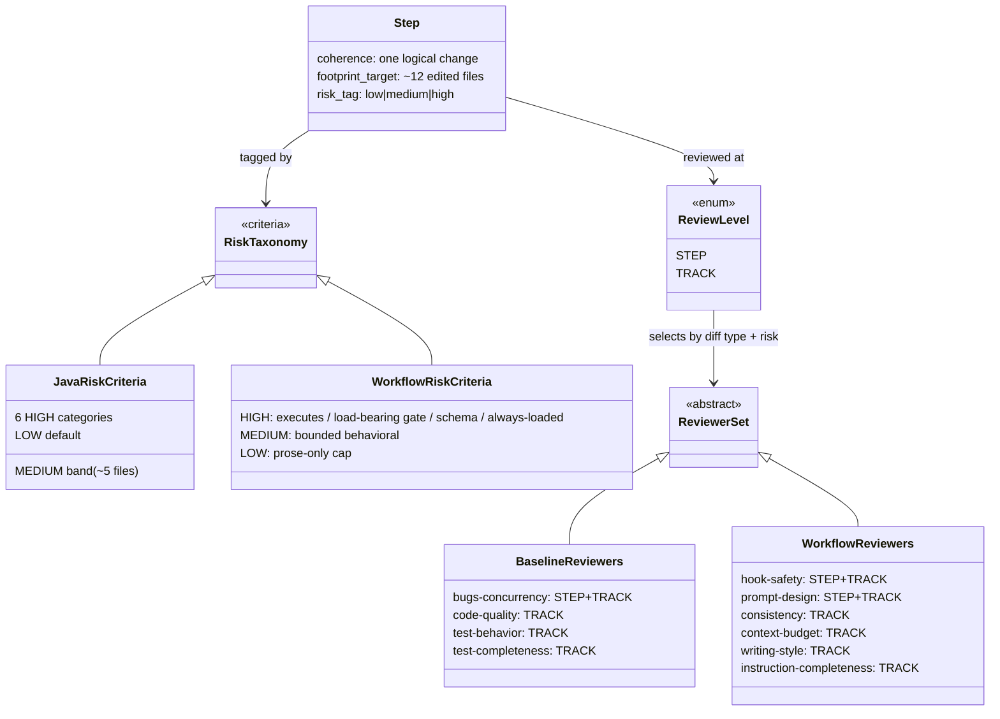
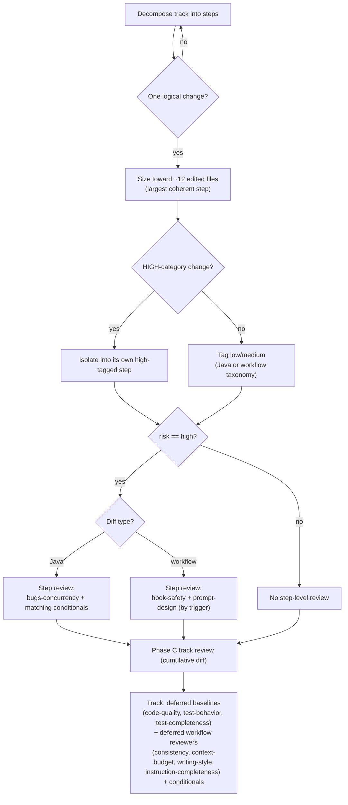

# Step Sizing and Reviewer Routing — Design

## Overview

The workflow used to size every step by a `~3 edited file` cap (`track-review.md`) plus a risk tag, then spawn a fresh implementer per step that re-pays a ~23K-token cold read. The cap never bound: 33% of realized steps already exceeded it cleanly, including 19- and 22-file refactors. It bought no measured quality either. Across 236 implementer transcripts, peak context tracks iteration count (Pearson r 0.81), not edited files (r 0.37), and no implementer touching ≤13 edited files ever reached the 400K warning band.

This design replaces the file cap with three sizing rules: coherence (one logical change per step), high-risk isolation (each HIGH change in its own `high`-tagged step), and a fill-toward-~12-edited-files directive for ordinary steps. It also splits review-agent dispatch into step-level versus track-level for the first time. Of the four baseline (Java) reviewers, only `review-bugs-concurrency` runs at a high step; the other three defer to the cumulative Phase C track review. The six workflow-machinery reviewers gain the same split: `review-workflow-hook-safety` and `review-workflow-prompt-design` run at a high step, the other four defer.

The split needs a precondition the workflow lacked: criteria for risk-tagging a workflow-machinery edit. `risk-tagging.md` classified only Java/storage changes, so a `.claude/**` edit had no HIGH category and the workflow-reviewer triage would have had no trigger. This design adds a workflow-machinery risk taxonomy keyed to blast radius across sessions and whether the artifact executes or drives control flow.

Two changes ride alongside the routing split. The plan-checklist scope indicator now reports a planned file footprint (`~N files covering X, Y, Z`) instead of a step count, because steps do not exist until decomposition while the in-scope file set is known at plan time. And `review-bugs-concurrency` becomes a mandatory baseline across all three review paths, closing a cross-path discrepancy where it was baseline in the workflow path but conditional in the standalone `/code-review` skill.

Two existing guardrails carry the safety the file cap nominally provided: the session-end context gate (the orchestrator backstop, which fires less often with fewer, larger steps) and the mid-implementation `RISK_UPGRADE_REQUESTED` valve (re-enables step-level review when a grouped step turns out more invasive than tagged).

The rest of this document covers: Core Concepts, Class Design, Workflow, the four rule changes (sizing, the two per-step file-count numbers, the scope-indicator unit, the workflow risk taxonomy), reviewer routing, the `review-bugs-concurrency` three-path rule, and the consistency, staging, and self-application constraints (including a validator fix the staging machinery required).

## Core Concepts

This design introduces nine load-bearing ideas. Each is named here with its delta from the prior behavior and a pointer to the section that elaborates it.

**Footprint cap.** The per-step edited-file ceiling, raised from ~3 to ~12 soft / ~14+ flagged overblown, applied to all tiers. Replaces the unmeasured ~3 cap that never bound. → §"Step sizing: coherence, isolation, and fill-toward-cap".

**Fill-toward-cap directive.** Decompose an ordinary (`low`/`medium`) step to be the largest coherent change within ~12 edited files, not the smallest. Replaces the default slicing habit; each avoided spawn removes one ~23K-token cold-read re-pay. → §"Step sizing: coherence, isolation, and fill-toward-cap".

**High-risk isolation.** Every HIGH-category change goes in its own `high`-tagged step, sized by the change, with no file cap. Replaces "cap high steps small," which the old rule never said but the ~3 cap implied. → §"Step sizing: coherence, isolation, and fill-toward-cap".

**Footprint cap vs risk classification.** Two distinct per-step file-count numbers: ~12 (footprint split, edited files, all tiers) and ~5 (the MEDIUM risk-classification threshold). After the cap rises they read in the correct order, medium at 5, split at 12. Replaces a prior inversion where the ~3 cap split a step before it could be classified medium-by-file-count. → §"The two file-count numbers".

**Step-vs-track reviewer routing.** The first distinction between which reviewers fire at a high step versus the cumulative Phase C track review. A reviewer runs at the step only if its findings are localized to that step's diff and get buried if deferred; it defers to track if its findings read identically on the cumulative diff. Replaces "the same selection runs at both levels." → §"Step-vs-track reviewer routing".

**Workflow-machinery risk taxonomy.** HIGH/MEDIUM/LOW criteria for `.claude/**` edits, keyed to blast radius across sessions and whether the artifact executes or drives control flow. Replaces the absence of any workflow risk criteria; it is the precondition that gives the workflow-reviewer triage its trigger. → §"Workflow-machinery risk taxonomy".

**Prose-only cap.** A workflow step editing only prose (no hook/script/settings change and no gate/dispatch/schema change) is at most `low`, the workflow analog of the existing tests-only cap. Keeps ordinary workflow `.md` rewording out of the step-level review path. → §"Workflow-machinery risk taxonomy".

**review-bugs-concurrency exclusion from workflow.** The Java bug/logic reviewer never reviews workflow-machinery files, already true behaviorally (scope-filtering on mixed diffs plus the workflow-only baseline skip), now stated as an explicit triage rule so the two review paths read as deliberately disjoint. → §"review-bugs-concurrency across the three review paths".

**File-footprint scope indicator.** The plan-checklist `**Scope:**` line reports `~N files covering X, Y, Z` instead of `~N steps`, because steps do not exist until decomposition while the in-scope file set is known at plan time. Replaces the step count that anchored readers on a non-binding pre-decomposition number. → §"Scope indicators measure file footprint, not steps".

## Class Design

**TL;DR.** This is a rules change, so the "classes" are the workflow concepts the rules govern. A step carries a coherence constraint, a footprint target, and a risk tag. The tag is computed by one of two taxonomies, Java or workflow-machinery. The tag plus the diff type select a reviewer set at each of two review levels.

The two `RiskTaxonomy` subclasses are the load-bearing addition. `WorkflowRiskCriteria` did not exist before this change; it now lives as a `### Workflow machinery` subsection in `risk-tagging.md` keyed to whether the artifact executes or drives control flow plus always-loaded blast radius. A `Step` reaches `ReviewLevel.STEP` only when it is tagged `high`; `low`/`medium` steps go straight to the track review. The `ReviewerSet` partition is the routing change: `BaselineReviewers` apply to Java diffs and `WorkflowReviewers` to workflow-machinery diffs, and each set names which members fire at `STEP` versus only at `TRACK`. A reviewer marked `STEP+TRACK` runs at a high step and again on the cumulative track diff; a `TRACK`-only reviewer runs once, at Phase C. `review-bugs-concurrency` is the sole baseline that is `STEP+TRACK`; the workflow set's two `STEP+TRACK` members are the localized-defect reviewers.

### Edge cases / Gotchas

- The diagram shows the *intended* membership. On a workflow-only diff the existing baseline-skip override removes the entire baseline group, so `BaselineReviewers` never reach the step at all. See §"Constraints: mirror, staging, and self-application".

### References

- D1: raise the per-step footprint cap to ~12 with a fill-toward-cap directive
- D4: baseline triage, `review-bugs-concurrency` at the step, the other three at track
- D5: workflow-reviewer triage, `hook-safety` and `prompt-design` at the step
- D6: add the workflow-machinery risk taxonomy
- Invariants: none new
- Mechanics: none (the design fits in this file)

## Workflow

**TL;DR.** Decomposition sizes a step toward ~12 files under the coherence and isolation rules, tags it, and fires a step-level review only when the tag is `high`; that review's membership depends on diff type. All tiers reach the cumulative Phase C track review, which runs the deferred reviewers.

The two diff-type branches (H) are where this design departs from the prior single shared selection. A Java high step draws `review-bugs-concurrency` plus any conditional reviewers whose triggers match its files; a workflow high step draws `review-workflow-hook-safety` and `review-workflow-prompt-design` when their file-pattern triggers match. The `low`/`medium` path (K) skips step review entirely and is covered only at Phase C, unchanged. Phase C (M) always runs against the cumulative track diff, so the deferred reviewers lose no coverage by not firing per step.

### Edge cases / Gotchas

- A workflow high step editing only `.claude/workflow/*.md` matches neither step-level workflow trigger (`prompt-design` wants SKILL/agents/prompts; `hook-safety` wants scripts/settings), so it draws zero step-level reviewers and is fully deferred to Phase C. This is intended: those files' defects are the cumulative class.
- The step-level workflow-reviewer dispatch inherits the `§Workflow-machinery override`'s staged-path normalization, so on a workflow-modifying plan a high step's staged paths still match the live-path globs the reviewers key off rather than silently matching none.
- `RISK_UPGRADE_REQUESTED` mid-implementation re-enters this flow at G with `risk == high`, restoring the step-level review a grouped step would otherwise have skipped.

### References

- D4: baseline triage, `review-bugs-concurrency` at the step, the other three at track
- D5: workflow-reviewer triage, `hook-safety` and `prompt-design` at the step
- D7: `review-bugs-concurrency` mandatory in three paths, excluded from workflow
- Invariants: none new
- Mechanics: none

## Step sizing: coherence, isolation, and fill-toward-cap

**TL;DR.** Three rules replace the `~3 edited file` cap: split a step that does unrelated things (coherence, all tiers); isolate each HIGH change into its own `high`-tagged step sized by the change; fill ordinary steps toward ~12 edited files and flag ~14+ as overblown. The fill rule is a directive, not a permission. Collapsing k small steps into one removes (k-1) cold-read re-pays.

The cap lived at `track-review.md` § Step Decomposition (the line "If a step touches more than ~3 files or does unrelated things, split it"). It is now three rules. Coherence is the only mandatory split: a step is one coherent, logically continuous change, and file count alone never forces a split. High-risk isolation puts each HIGH-category change in its own `high`-tagged step with no file cap. The fill rule decomposes ordinary `low`/`medium` steps toward the largest coherent change within ~12 edited files, flags ~14+ as overblown, and is scoped to `low`/`medium` so it does not collide with high-risk isolation's no-file-cap. The trivial-merge floor ("If a step feels trivial, merge it into a neighbor", with its `(single import, single rename)` parenthetical) stays verbatim.

The change also rewords the `conventions.md` §1.1 Glossary "Step" definition. "Atomic" used to read as "smallest indivisible," which fights the fill directive at the most authoritative definition site (the glossary is annotated `roles=any phases=any`). It now means one coherent, logically continuous change committed together, explicitly not a minimal file count, with a pointer to the footprint guidance.

The evidence is three measured facts. First, the cap never bound: 33% of realized steps already exceeded ~3 edited files cleanly, and the ~3 number entered verbatim in the first workflow commit and was never calibrated. Second, the small cap bought no quality: over-cap steps showed a *lower* recorded-defect rate (5.9%) than within-cap steps (15.8%); bugs cluster in small, logic-dense steps, not large mechanical ones. Third, footprint is not the context risk; iteration is. Peak implementer context correlates with turn count at Pearson r 0.81 versus 0.37 for edited files, and the measured ceiling for ≤13 edited files sat at 245K against the 400K warning band, far enough below to license a directive rather than a cautious permission.

### Edge cases / Gotchas

- One carve-out to the fill directive: defer to splitting when the work is likely to need heavy per-step iteration (debugging-prone or test-churny), since iteration count, not footprint, is the measured context driver.
- Coarser bisect granularity and larger review diffs are real costs the design accepts; they are not a gate weakening, because Phase C reviews the cumulative diff regardless of slicing.
- An ordinary step is still bounded by the 85% line / 70% branch coverage gate on its larger diff; the fill rule does not relax coverage.

### References

- D1: raise the per-step footprint cap to ~12 with a fill-toward-cap directive
- D2: reword the glossary "Step" so "atomic" means coherent, not minimal files
- Invariants: none new
- Mechanics: none

## The two file-count numbers

**TL;DR.** With the footprint cap at ~12, the medium-classification threshold (~5) and the split cap (~12) coexist and must read as complementary, not rival: crossing ~5 raises a logic step to `medium` (more Phase C focal-point attention), while ~12 is where any step splits. `risk-tagging.md`'s MEDIUM trigger keeps ~5; only a clarifying clause was added.

The MEDIUM trigger "Logic changes touching more than ~5 files within one module" stays at ~5. A clause now ties it to the ~12 split cap so the two numbers read in the correct order: crossing ~5 files raises the step to `medium` (still no step-level dimensional review, just more focal-point attention at Phase C), while ~12 is where the step splits. The old ~3 cap sat *below* the ~5 trigger, an inversion: a step would split before it could ever be classified medium-by-file-count. At ~12 the ordering is restored. The clause also notes that fill-toward-~12 will routinely push ordinary single-module steps past ~5, producing a larger `medium`-tagged population at Phase C, which is intended (larger diffs warrant more focal-point attention), not a miscalibration.

Bumping ~5 toward ~12 was rejected. It would drop 6–11-file logic changes to `low` and lose the medium focal-point signal Phase C relies on. The number stays ~5; only the wording is clarified to name the distinct role each threshold plays.

### Edge cases / Gotchas

- The two numbers measure the same thing (edited files) for two different decisions (classification versus splitting), which is why they must be stated together at the MEDIUM trigger site or a future reader reads them as competing caps.

### References

- D3: keep ~5 as the medium threshold, distinct from the ~12 split cap
- Invariants: none new
- Mechanics: none

## Scope indicators measure file footprint, not steps

**TL;DR.** The checklist sizing line now reads `~N files covering X, Y, Z` instead of `~N steps covering X, Y, Z`. A count of steps pre-judges decomposition, which only happens at execution, and anchors the reader on a number the workflow itself calls non-binding; a planned count of edited artifacts is knowable when the plan is written. The rekeyed plausibility check compares that count and its coverage-list cardinality against a track-level ceiling of ~20-25 in-scope files, reading only the plan checklist.

The `**Scope:**` line (`conventions.md` §Scope indicators (required)) serves three purposes: structural review's sizing check, a human effort gauge, and a decomposition starting point. The step count was the misleading part. Decomposition happens only at Phase A, and `conventions.md` itself calls scope indicators "strategic signals, not tactical commitments," so a pre-decomposition count anchors the orchestrator on a number the workflow explicitly treats as non-binding. The file footprint replaces it: the planned in-scope file set already lives in each track file's §Interfaces and Dependencies at plan time, so `~N files` reports scope, not a decomposition prediction.

The sizing check survives in rekeyed and plan-file-only form. Structural review's check used to read the track file for the "described" half of a claimed-versus-described comparison (it carried a `*(cross-file: … Compare both halves.)*` annotation). The rekey drops that track-file read: the check now compares the footprint count and the coverage-list cardinality, both of which live on the plan-checklist `**Scope:**` line, against a track-level norm. A footprint at or above ~20-25 in-scope files, or a coverage list naming far more distinct subsystems than the footprint plausibly spans, signals a track that should split into dependent tracks. The resulting check is a coarser plausibility signal than the old cross-file comparison, a trade this design accepts in exchange for the plan-file-only property.

The ~20-25 ceiling is track-level and deliberately distinct from the per-step numbers. ~12 is the per-step split cap and ~5 the per-step MEDIUM trigger; a legitimate ~5-7-step track aggregates many steps and routinely sits well past 12 files, so reusing the per-step numbers as the track ceiling would mis-flag normal-sized tracks. It is also distinct from the `~5-7 steps` track-sizing rule (how many steps a track may hold), which is a separate concept the change leaves untouched; only the scope-indicator unit moves from steps to files.

Lines were considered as the unit and rejected: a line count depends on implementation that does not exist when the scope line is written, so a `~N lines` figure would be fabricated precision, the same misleading-number failure in a worse unit. Removing the indicator entirely was also rejected: it drops the plan-file-only sizing check and the human effort gauge for no gain over dropping just the misleading unit.

The blast radius is the convention spec (`conventions.md` §Scope indicators, the §1.1 glossary "Scope indicator" row, the §1.2 checklist examples), the writers (`create-plan/SKILL.md`, `planning.md`), the checkers (`structural-review.md`, `consistency-review.md`, the Phase A review-prompt glossaries in `technical-review.md` / `risk-review.md` / `adversarial-review.md`, and one inline-replan scope-indicator writer in `track-code-review.md`), and the renderer (`plan-slim-rendering.md`). Three files carry no `~N steps` format literal and were verified rather than edited: `implementation-review.md` (format-agnostic "scope indicators changed substantially" re-run triggers), `inline-replanning.md` (abstract `**Scope:**` marker mentions), and the `review-workflow-consistency` agent (lists "Scope indicator" as a closed glossary *term* whose name the unit change does not touch).

### Edge cases / Gotchas

- The file footprint is an estimate, as the step count was; "~3-5 files" stays acceptable and exact counts are not required. The win is that the unit is knowable at plan time, not that it is precise.
- The file footprint is a track-level soft heuristic, not a per-step cap; it does not reintroduce the ~3-file step cap this design removes. The per-step file-count signals stay at ~12 / ~5; the track-level scope-indicator ceiling is ~20-25 files.

### References

- D8: scope indicators measure planned file footprint, not step count
- Invariants: none new
- Mechanics: none

## Workflow-machinery risk taxonomy

**TL;DR.** `risk-tagging.md` had no criteria for workflow-machinery edits; every category was Java/storage-shaped. HIGH/MEDIUM/LOW workflow triggers now key to blast radius across sessions and whether the artifact executes or drives control flow, plus a prose-only LOW cap. This is the precondition that gives the workflow-reviewer triage a defined trigger.

The organizing axis mirrors the Java categories' "blast radius × reversibility × hard-to-catch," recast for machinery: does the artifact execute or drive control flow, and how many sessions does a defect reach before a human notices?

- **HIGH** — a hook/script/`settings*.json` that runs automatically (broken → wedges every session); a load-bearing gate or protocol (auto-resume State machine, drift/divergence gate, review-iteration protocol, §1.7 staging, §1.6 stamp scheme); the shared schema every file keys off (§1.8 role/phase enums, TOC format, glossary closed terms); the always-loaded context surface (root `CLAUDE.md`).
- **MEDIUM** — behavioral but bounded: one phase prompt's or skill's decision/dispatch logic; a single review-agent spec; adding/removing/renaming a section other files cross-reference; multi-file prose that changes agent-observable behavior.
- **LOW** — prose/clarity with no behavioral change: house-style reword, typo, TOC-format reindex, glossary gloss, non-load-bearing example, single-file prose touching no gate/dispatch/schema.

The taxonomy is a `### Workflow machinery` subsection under `## HIGH-risk triggers`, with workflow lines under MEDIUM and LOW, plus a `## Prose-only workflow steps` cap as an analog of the existing tests-only cap. `risk-tagging.md` is not in the `§Maintenance` mirror set, so the addition carries no sync-stamp constraint. The `track-review.md` § Risk tagging summary, which enumerates the categories, now names the workflow category and counts seven HIGH categories, so it does not drift, the kind of drift `review-workflow-consistency` is built to catch.

### Edge cases / Gotchas

- Root `CLAUDE.md` is a HIGH trigger because always-loaded content has every-session blast radius; MEDIUM was weighed and rejected during design review.
- The prose-only cap carries the full "no hook/script/settings change and no gate/dispatch/schema change" qualifier so it cannot fire on a control-flow-driving prose edit the HIGH taxonomy also matches. The schema-change-versus-gloss hinge is explicit: a meaning-changing glossary/TOC/enum edit reads HIGH while a wording-preserving gloss reads prose-only/LOW.
- The prose-only cap is the lever that keeps ordinary workflow `.md` rewording from drawing a step-level review, matching the decision to defer `instruction-completeness` to the track level.
- The existing "when in doubt, high" decomposer override applies unchanged; no workflow-specific override was added.

### References

- D6: add the workflow-machinery risk taxonomy
- Invariants: none new
- Mechanics: none

## Step-vs-track reviewer routing

**TL;DR.** For the first time, which agents fire at a high step differs from which review the cumulative track diff. An agent runs at a high step only if its findings are localized to that step's diff and buried if deferred; it defers to the cumulative Phase C track pass if its findings read identically on the cumulative diff. Of four baselines, only `review-bugs-concurrency` stays at the step; of six workflow reviewers, only `hook-safety` and `prompt-design` stay at the step. The track-level set is unchanged.

`review-agent-selection.md` used to run the same selection at both levels. A new non-mirrored `## Step-level vs track-level routing` note now carries the distinction, and the two dispatch points consume it as their source of truth: `step-implementation.md` sub-step 4a (step) and `track-code-review.md` § Agent selection and launching (track). For the baseline (Java) reviewers: `review-bugs-concurrency` (general bug / logic-error / resource-leak / null-safety) catches defects best before they are buried in a cumulative diff, so it stays at the step; `review-code-quality`, `review-test-behavior`, and `review-test-completeness` read the same on the cumulative diff (style and whole-suite test quality), so they defer to Phase C.

For the workflow reviewers, the same test partitions the six:

| Reviewer | Localized to one step's diff? | Level |
|---|---|---|
| `review-workflow-hook-safety` | yes — script correctness, `/tmp` collisions, JSON validity | STEP |
| `review-workflow-prompt-design` | yes — this prompt's decision rules, frontmatter, `$ARGUMENTS` | STEP |
| `review-workflow-consistency` | no — cross-file; one step lands one side of a pair | TRACK |
| `review-workflow-context-budget` | no — whole-system always-loaded surface | TRACK |
| `review-workflow-writing-style` | no — diff-agnostic, identical per file | TRACK |
| `review-workflow-instruction-completeness` | mixed — procedural-logic but gates span steps | TRACK |

`instruction-completeness` is the one judgment call: it has the localized flavor of a logic reviewer, but its "every gate has a resume path" checks span files, so a step lands false positives that a later step resolves. It defers to track. Its trigger is also the only one matching bare `.claude/workflow/*.md`, so deferring it means a high step editing only those files draws no step-level reviewer, consistent with the prose-only cap.

The split's timing cannot live in the `§Maintenance`-mirrored sections (`§Workflow-review agents`, `§Workflow-machinery file set`, `§Per-agent file-pattern triggers`, `§Workflow-machinery override`), which mirror `code-review/SKILL.md` verbatim and `SKILL.md` has no step/track notion. It lives in the new note plus the two dispatch points. The note selects the step-level workflow reviewers by file-pattern glob, not by risk category: the taxonomy decides whether a step is `high` while the globs decide which workflow reviewers fire.

### Edge cases / Gotchas

- "Unconditionally" for `review-bugs-concurrency` at the step is subordinate to the existing workflow-only/docs-only baseline-skip override: on those diffs the whole baseline group, `review-bugs-concurrency` included, is still skipped.
- The split changes only *which mandatory baselines* run at the step. Conditional reviewers keep firing by their existing characteristic triggers, unchanged; no agent is forced on and no trigger is widened.
- The step-level workflow dispatch points at the `§Workflow-machinery override` mechanics explicitly, so its staged-path normalization and in-scope-file scoping apply at the step as they do at the track; without that pointer a high step's staged paths on a workflow-modifying plan would match no live-path glob and the step-level workflow reviewers would silently fail to launch.

### References

- D4: baseline triage, `review-bugs-concurrency` at the step, the other three at track
- D5: workflow-reviewer triage, `hook-safety` and `prompt-design` at the step
- Invariants: none new
- Mechanics: none

## review-bugs-concurrency across the three review paths

**TL;DR.** `review-bugs-concurrency` is now mandatory everywhere it can run: the standalone `/code-review` skill, the Phase C track pass, and every high Java step. It is explicitly excluded from workflow-machinery changes. Promoting it in `SKILL.md` closes a prior cross-path discrepancy where it was baseline in the workflow path but conditional in the standalone skill.

`code-review/SKILL.md` used to list `review-bugs-concurrency` as conditional (firing on `concurrency`, `storage-engine`, and similar categories), while `review-agent-selection.md` treated it as a baseline. It is now promoted in `SKILL.md` to "Always launched (unless `docs-only` or `build-config` are the ONLY categories)," word-for-word matching the two test-review baselines' exclusion shape and its baseline status in the workflow path. The plural "are the ONLY categories" was chosen over the singular paraphrase because it is semantically correct (it covers a pure `docs-only` + `build-config` diff) and keeps the three always-launched baselines internally identical. The prior tests-only special mention becomes redundant but stays harmless.

The exclusion from workflow changes is already the behavior: workflow-only diffs skip the baseline group, and mixed diffs scope-filter `review-bugs-concurrency` to Java files via `IN_SCOPE_FILES`. Stating it as a triage rule makes the Java and workflow review paths read as deliberately disjoint: `review-bugs-concurrency` owns Java code defects, the workflow reviewers own workflow machinery, and neither bleeds into the other.

The `SKILL.md` code-review baseline/conditional tables are not in the `§Maintenance` mirror set (that stamp covers only the workflow-review sections), so the promotion needed no sync-stamp bump. The step-vs-track timing lives only in the workflow files; `SKILL.md` carries no step/track notion.

### Edge cases / Gotchas

- The promotion is a cross-file agreement (`SKILL.md` baseline status ↔ `review-agent-selection.md`), exactly what the Phase C `§1.7(h)` consistency review confirms.

### References

- D7: `review-bugs-concurrency` mandatory in three paths, excluded from workflow
- Invariants: none new
- Mechanics: none

## Constraints: mirror, staging, and self-application

**TL;DR.** Three rules governed the implementation: keep the step-vs-track timing out of the `§Maintenance`-mirrored sections; route every workflow-prose edit through §1.7 staging; and accept that this branch's workflow-only diffs cannot fully exercise the baseline routing it introduces. A fourth constraint surfaced during execution: §1.7 staging collided with the reindex validator, and a live-script fix resolved it.

Every workflow-prose edit target is workflow machinery, so the plan declares itself workflow-modifying with the canonical §1.7(b) marker, each `.claude/workflow/**` and `.claude/skills/**` edit stages under `docs/adr/<dir>/_workflow/staged-workflow/`, the live tree stays at develop's state, and the staged-vs-live delta gets the Phase C §1.7(h) review. Phase C reviewers scope to the live-vs-staged delta (the delta-scoping convention), not the whole-file staged copy, which keeps the cumulative review diff within budget despite each touched file appearing as a whole-file add.

Self-application has a limit worth stating plainly. A "dogfood it" framing would claim any high step on this branch runs `review-bugs-concurrency` at the step. It cannot: this branch's diffs are workflow-only, so the baseline-skip override removes the whole baseline group at the step, `review-bugs-concurrency` included, and the workflow-review group runs instead. What this branch *does* exercise is the step sizing rules, the workflow risk taxonomy, the workflow-reviewer triage, and the §1.7(h) staged-vs-live review. The baseline-routing companion change reviews its own diff at Phase C, not at a step.

### Edge cases / Gotchas

- `risk-tagging.md` is touched by two areas of the change (sizing and risk taxonomy; the `high` reviewer-routing quick-ref) in disjoint sections; under §1.7 staging the staged copy accumulates both edits, and each Phase C review delta-scopes to its own sections. The same holds for `conventions.md` (the §1.1 "Step" reword and the §Scope-indicator rewrite are disjoint).
- The workflow-reviewer triage depends on the workflow risk taxonomy for its trigger, so the routing work follows the taxonomy work.
- §1.7 staging collided with the reindex validator's `check_rule_1_stamp_present` (rule_1), which demands a line-1 `workflow-sha` stamp on every in-scope `docs/adr/`-rooted path. The validator's in-scope globs are entirely the staged-workflow mirror, and §1.7(e) mandates those copies be byte-verbatim duplicates of the unstamped live files, which §1.6(f) excludes from the stamped set. Rule_1 therefore false-positived on every staged copy, and `workflow-toc-check.yml --check` failed the gate on a non-draft PR. The fix exempts the staged subtree from rule_1 via the existing `_STAGED_SUBTREE_PREFIX_RE`, placed before rule_1's `docs/adr/` early-return in `workflow-reindex.py`. It is a live `.claude/scripts/` edit, outside §1.7 staging scope, so the §1.7(g) staging invariant (the live `.claude/workflow/**` and `.claude/skills/**` tree stays at develop's state until the Phase 4 promotion) is unaffected.
- After the exemption, rule_1 has no remaining reachable in-scope target (its live-path globs are filtered out by the `docs/adr/` early-return, and the only `docs/adr/`-rooted globs are the now-exempt staged mirror). It is kept as a harmless guard against a future re-introduced non-exempt `docs/adr/` glob, and its docstring was rewritten truthfully: the §1.6(f) stamped artifact set is enforced by the disjoint `workflow-startup-precheck.sh` drift gate (those artifacts are not in this script's in-scope globs), not by rule_1. A direct-call regression test pins rule_1's empty-file and malformed-stamp branches, which the exemption orphans from glob reachability.

### References

- D1: raise the per-step footprint cap to ~12 with a fill-toward-cap directive
- D4: baseline triage, `review-bugs-concurrency` at the step, the other three at track
- D5: workflow-reviewer triage, `hook-safety` and `prompt-design` at the step
- D6: add the workflow-machinery risk taxonomy
- D7: `review-bugs-concurrency` mandatory in three paths, excluded from workflow
- D8: scope indicators measure planned file footprint, not step count
- D9: exempt the staged-workflow mirror from reindex rule_1 so staged copies stay unstamped
- Invariants: none new
- Mechanics: none
