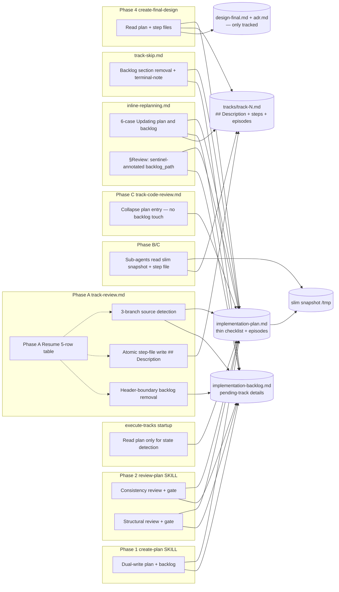

# Thin Workflow — Split Plan from Backlog — Architecture Decision Record

## Summary

The `/execute-tracks` workflow used to re-read the full
`implementation-plan.md` at every session start, including
`**What/How/Constraints/Interactions**` subsections and track-level
Mermaid diagrams whose detail is only consumed in one phase of one
track per session. This change splits those subsections into a new
companion file, `implementation-backlog.md`, and threads the detailed
description through the step file (`tracks/track-N.md`'s new
`## Description` section) during Phase A. Sessions still read the
plan at startup, but the plan is now a thin checklist for pending
tracks. The backlog is read only when a track enters Phase A or when
a track is skipped. Legacy plans (no backlog file) continue executing
unmodified under a file-existence fallback.

## Goals

All original goals landed as planned.

- Cut main-agent startup context in `/execute-tracks` by moving
  per-track `**W/H/C/I**` detail (and any track-level Mermaid diagram)
  out of the plan file into `implementation-backlog.md`. Achieved —
  pending-track entries in the plan are now title + intro + `Scope` +
  `Depends on` only.
- Keep the plan as the single source of truth for strategic context
  (Goals, Constraints, Architecture Notes, Decision Records, Component
  Map) and for track status + episodic memory. Achieved unchanged.
- Make the description travel with the work: Phase A copies the
  current track's description from the backlog into its step file so
  Phase B/C sub-agents see it via the step file they already read.
  Achieved — the step-file template now opens with `## Description`,
  written in the same atomic `Write` call that creates the shell.
- Preserve backward compatibility with plans created before the split.
  Achieved — file-existence detection (the D4 rule) routes legacy
  plans through the old read-from-plan path with zero user action.
- Keep the `/execute-tracks` state-detection logic intact. Achieved —
  status markers live in the plan, so the startup read is unchanged.

No goals were descoped.

## Constraints

All original constraints held. Two evolved during execution:

- **No changes to dimensional review agent definitions** — held.
  `~/.claude/agents/review-*.md` and `.claude/agents/` are untouched;
  every change is in workflow docs / prompts / SKILLs.
- **No information loss** — held. Plan + backlog + step files together
  preserve everything the original single-file plan carried.
- **Backward compatibility is mandatory** — held. Legacy plans
  continue to execute. Detection is a single `test -f` per decision
  point, re-evaluated per-operation so an in-session backlog
  materialization is picked up immediately.
- **Workflow files remain untracked** — held. Only `design-final.md`
  and `adr.md` are committed in Phase 4.
- **Monotonic shrinkage** — held. Entries are only added during
  Phase 1 or inline replanning; normal execution only removes or
  leaves them unchanged. The backlog file itself is never deleted
  during execution (load-bearing-file rule — see Invariants below).
- **Idempotent phase transitions** — held, and strengthened. Phase A
  atomicity became a 3×3 state space partitioned into a 5-row resume
  decision table rather than the original 3-state pre/mid/post form.

One new operational constraint emerged during execution:

- **Ephemeral-ID rule** — plan-internal Decision Record IDs (D1–D5)
  and named invariants (Single-authority, Untracked-file, etc.) live
  in the untracked plan file and disappear with the branch. Long-lived
  workflow documents must not cite those IDs by name; they need
  self-contained explanations or cross-reference the stable location
  (`conventions.md` §1.2) where the rule is restated.

## Architecture Notes

### Component Map

- **`implementation-plan.md`** — thinned. Strategic sections unchanged;
  checklist rows for pending tracks carry title + intro + Scope +
  Depends-on only. Completed tracks still carry Track episode + Step
  file pointer + Strategy refresh.
- **`implementation-backlog.md`** — new, untracked, load-bearing
  marker. Holds `**W/H/C/I**` + optional track-level diagrams for
  pending tracks. Shrinks monotonically; stays on disk even when
  header-only so D4 keeps evaluating true.
- **`tracks/track-N.md`** — gains `## Description` at the top, written
  atomically with the shell at Phase A start.
- **Phase A (`track-review.md`)** — 3-branch source detection, atomic
  step-file write, header-boundary backlog removal, 5-row resume
  decision table. Consolidated "Inputs passed to Phase A review
  sub-agents" section owns the shared input contract.
- **Phase C (`track-code-review.md`)** — collapse simplified to a
  pointer into `conventions-execution.md` §2.1; universal
  "does not touch backlog" invariant.
- **`track-skip.md`** — backlog cleanup between skip-record and
  step-file-delete; "Backlog deletion is terminal" warning.
- **`inline-replanning.md`** — new `## Updating plan and backlog`
  section with six authoritative-location cases; §Review passes
  `backlog_path` via the sentinel rule.
- **`plan-slim-rendering.md`** — 4-row rendering rule evaluated
  top-down, Legacy-fallback row pre-empts the `[ ]`/`[>]` default.
- **Phase 2 orchestration** — `review-plan/SKILL.md` is authoritative
  for path-passing (four spawn sites all pass `backlog_path` with
  sentinel); `implementation-review.md` + workflow-side
  `structural-review.md` describe the pipeline conceptually.
- **Phase A review prompts** (`technical-review.md`, `risk-review.md`,
  `adversarial-review.md`, `review-gate-verification.md`) — gained a
  `Step file:` input and a "Where things live during Phase A"
  paragraph; the gate prompt also absorbed the finding-input split.
- **Phase 2 review prompts** (`consistency-review.md`,
  `structural-review.md`, and their gate prompts) — gained
  `Backlog file: {backlog_path} (may be absent — ...)` in Inputs
  plus per-bullet or per-block retargeting of criterion sources.
- **`create-final-design.md`** — Step 2 reading list names the step
  file's `## Description` section explicitly; no backlog read.
- **Slim snapshot** — unchanged in file contract, simpler rule; current
  track always rendered in full.

### Decision Records

#### D1: Backlog file naming — `implementation-backlog.md`

- **Implemented**: as planned. Parallel naming with
  `implementation-plan.md` makes the companion relationship
  immediately obvious. A `Backlog` glossary row in `conventions.md`
  §1.1 makes the term unambiguous within the workflow.
- **Actual outcome**: no naming regret in practice. Every agent
  prompt that references the file uses the full name; no ambiguity.

#### D2: Monotonic shrinkage — remove from backlog at Phase A start

- **Implemented**: as planned, with the ordering
  rule made explicit as a constraint: single-Write step-file creation
  first, then header-boundary backlog removal.
- **Actual outcome**: the ordering, combined with the
  "Backlog section body extraction rule" centralization, closes the
  description-loss window on every observable crash point. Resume
  logic (5-row decision table, see D6 below) handles all four states
  a crash can leave behind.

#### D3: Description lives in the step file during Phase B/C

- **Implemented**: as planned. Step-file content template gains a
  `## Description` section at the top. Phase B and Phase C sub-agent
  context blocks advertise it with a legacy fallback ("if the file
  does not contain `## Description`, read from the plan entry").
- **Actual outcome**: no Phase B/C prompt restructuring was needed
  beyond the one-sentence note in the context blocks — sub-agents
  already read the step file.

#### D4: Legacy plan compatibility via file-existence detection

- **Implemented**: as planned. The detection rule is stated once in
  `conventions.md` §1.2 and applied per-operation. Track 4 elaborated
  the sentinel convention (always pass `backlog_path`; annotate
  `(none — legacy plan)` when absent) so the wire shape is stable
  across plan shapes; the prompt-reader layer owns the `(may be
  absent — …)` degradation prose.
- **Actual outcome**: detection is trivial. The only subtlety is that
  D4 evaluation is per-operation rather than per-session — caching
  was rejected to avoid false positives if the user or a tool
  materializes the backlog mid-session.

#### D5: Track-level Mermaid diagrams travel with the description

- **Implemented**: as planned. `planning.md` §Track-level component
  interaction diagrams explicitly states diagrams live in the backlog
  at Phase 1, move to the step file's `## Description` section at
  Phase A, and are never rendered in the plan file.
- **Actual outcome**: straightforward consequence of D3. No diagram
  in any completed track exceeded the ~10-node cap; no case arose
  where elevating a track-level diagram into the top-level Component
  Map was needed.

#### D6 (new): 3-branch Phase A source detection

- **Rationale**: The original design's 2-branch (present/absent) check
  did not cover a mid-migration case where the backlog file exists
  but Track N's section is missing — e.g., hand-edited plan after a
  partial migration. Falling through to the "Track N section exists"
  branch would cause a read failure.
- **Resolution**: branches (i) new-format read, (ii) mid-migration
  fallback (read plan entry, skip backlog removal), (iii) legacy read.
  Branch (ii) also serves a defensive role via a drift crosscheck:
  if the plan entry still carries `**W/H/C/I**` AND the backlog has
  a Track N section, Phase A halts and flags for user reconciliation
  before any write.
- **Implemented in**: Track 2 Step 1.

#### D7 (new): Consolidated Phase A sub-agent inputs contract

- **Rationale**: Phase A spawns up to four review sub-agents
  (technical, risk, adversarial, and the gate). Pre-split, each
  prompt restated its own `Inputs:` list, with drift risk at every
  convergent change. The orchestration also needed a stable wire
  contract for the new `step_file_path` argument.
- **Resolution**: new `### Inputs passed to Phase A review sub-agents`
  section in `track-review.md` owns the six shared inputs. The four
  review mini-sections point at it; the gate mini-section additionally
  names its two extra inputs (`findings`, `review_type`). Downstream
  prompts (Track 3 delivery) map their `Inputs:` blocks onto the
  shared set so future additions touch one file.
- **Implemented in**: Track 2 Step 3.

#### D8 (new): Finding-input split — `previous_findings` vs `findings under re-check`

- **Rationale**: Gate prompts pre-split used `Previous findings:
  {findings}`, where the label read "previous" but the placeholder
  carried the current iteration's findings under re-check. Track 3's
  code review caught this as semantic drift. Fixing only the Phase A
  gate would have left the Phase 2 gates carrying the old pattern.
- **Resolution**: split into two inputs at every gate spawn site.
  `previous_findings` is context-only (finalized earlier-iteration
  findings); `findings` is under re-check in the current iteration.
  Loop header renamed to `For each finding under re-check:`. Applied
  uniformly at five spawn sites (one Phase A + two Phase 2 prompts,
  four Phase 2 SKILL spawn sites at items 7 and 16). Not wired into
  `inline-replanning.md` §Iterate — that loop is full re-review
  per iteration, not a gate re-check.
- **Implemented in**: Track 3 (Phase A gate), Track 4 (Phase 2 gates
  and SKILL), Track 5 (deferral preserved in inline-replanning).

#### D9 (new): Sentinel convention for `backlog_path`

- **Rationale**: Phase 2 sub-agents and inline-replanning all need to
  receive a `backlog_path` argument. Omitting the argument for legacy
  plans would give two wire shapes and push the fork into every
  spawn-site invocation. Omitting the sentinel in favor of prompt-
  only degradation would obscure the presence-or-absence fact at the
  orchestrator level.
- **Resolution**: always pass `backlog_path`. When the file exists,
  pass its absolute path. When it does not, pass the would-be path
  annotated `(none — legacy plan)`. Prompts describe the degradation
  in prose (`(may be absent — when implementation-backlog.md does
  not exist on disk, track descriptions live in the plan file's
  checklist entries)`). Path-passing and degradation prose are
  explicitly separated — the SKILL owns the former, the prompts own
  the latter.
- **Implemented in**: Track 4 Step 5 (review-plan SKILL top-level
  "Backlog file and legacy-fallback sentinel rule" section); Track 5
  Step 1 (inline-replanning §Review).

#### D10 (new): Centralized "Backlog section body extraction rule"

- **Rationale**: Three call sites (Phase A sub-step (e),
  `track-skip.md` step 3, inline-replanning) all need to remove a
  Track N section from the backlog. Repeating the algorithm invited
  drift; worse, subtle wording differences in the "no-op if already
  gone" branch appeared in early drafts. The line-count-deletion
  prohibition (which breaks in the presence of track-level
  `mermaid` blocks or multi-paragraph blockquotes) also needed a
  single home.
- **Resolution**: new `### Backlog section body extraction rule`
  subsection in `conventions-execution.md` §2.1. All three call
  sites delegate by pointer; none restate the mechanics or the
  prohibition.
- **Implemented in**: Track 2 Step 1 (rule authored), Track 2 Step 6
  (track-skip delegation), Track 5 Step 1 (inline-replanning
  delegation).

#### D11 (new): Top-down 4-row rendering rule in `plan-slim-rendering.md`

- **Rationale**: The rewrite initially listed the default `[ ]`/`[>]`
  row first and the new Legacy-fallback row second. Track-level
  review (CQ102) noted that a table-only skimmer would apply the
  default row to a legacy `[ ]`/`[>]` entry and skip the stripping.
- **Resolution**: Legacy-fallback row is first, with an explicit
  "top-down evaluation" note. Its trigger is the conjunction
  `D4 ∧ per-entry-subsection-presence`, which covers both pure-legacy
  (D4 false) and mid-migration (D4 true but entry not migrated)
  cases without affecting cleanly-migrated entries.
- **Implemented in**: Track 5 Step 2.

### Invariants & Contracts

Five invariants from the plan landed and held:

- **No-loss invariant**: at any moment, plan + backlog + step files
  together contain every track description the single-plan form would
  have contained. Phase A's atomic write + ordered remove is what
  keeps this true across crash points.
- **Single-authority invariant**: each track's detailed description
  has exactly one authoritative location at any moment — backlog
  (before Phase A), step file (during/after Phase A), plan entry
  (collapsed intro after Phase C, or retained under `[~]` for skipped
  tracks).
- **Startup-read invariant**: `/execute-tracks` state detection reads
  only the plan. The backlog is loaded later, when a track enters
  Phase A or is skipped.
- **Monotonic-shrinkage invariant**: backlog entries are added only
  in Phase 1 or inline replanning; normal execution only removes or
  leaves entries unchanged.
- **Untracked-file invariant**: `implementation-backlog.md` is never
  committed to git.

Two additional invariants became explicit during execution:

- **Load-bearing-file rule**: the backlog file remains on disk
  throughout execution, even after the last track section is
  removed. Its presence is what signals the new-format plan shape
  to every downstream consumer; deleting it mid-execution would
  flip later operations into the legacy branch.
- **Byte-identical anchor rule**: when the same rule is cross-
  referenced from multiple sites inside a prompt (e.g.,
  `"per the per-entry fallback rule above"` or `"resolved per the
  legacy-fallback sentinel rule above"`), every anchor site must use
  the identical phrase. Drift here broke Track 4 iteration 1 and
  surfaced again in Track 4 CQ87 — the invariant is about mechanical
  uniformity, not stylistic preference.

### Integration Points

All original integration points landed.

- `/create-plan` Phase 1: SKILL writes plan + backlog via a single
  dual-write flow. The SKILL's plan-file template and its new
  backlog-file template both use 4-backtick outer fencing so nested
  `mermaid` blocks cannot terminate the example fence.
- `/review-plan` Phase 2: consistency review + gate + structural
  review + gate all receive `backlog_path` via the sentinel
  convention. The two review prompts lock their own anchor phrase
  (consistency: `"in 'How to Review' step 2"`; structural:
  `"per the per-entry fallback rule above"`).
- `/execute-tracks` startup: reads plan only.
- Phase A `track-review.md`: reads backlog for current track via the
  3-branch detection; writes step file with `## Description` at the
  top (single Write); removes Track N from backlog. Review sub-agents
  receive step file path via the consolidated Inputs section.
- Phase C `track-code-review.md`: collapses plan entry per
  `conventions-execution.md` §2.1 pointer; does not touch the backlog
  (Phase A already removed the section for new-format plans; legacy
  plans have no backlog to touch).
- `track-skip.md`: removes Track N from backlog between the
  skip-record write and the step-file delete. The
  "Backlog deletion is terminal" paragraph is the authoritative
  warning for inline-replanning's revise-skipped case.
- `inline-replanning.md`: applies the six-case authoritative-location
  rule in `## Updating plan and backlog`; §Review passes
  `backlog_path` per the sentinel convention.
- `/create-final-design.md` Phase 4: reads plan + step files; the
  backlog is header-only by Phase 4 and Phase 4 does not read it.

### Non-Goals

Retained as originally stated; no changes during execution.

- Per-track backlog files.
- Automated migration of legacy plans.
- Changes to dimensional review agent definitions.
- Changes to Phase B/C sub-agent prompt structure.
- Refactoring Phase 4 artifacts.
- Changing the `## Base commit` or `## Reviews completed` sections of
  the step file.

## Key Discoveries

Things learned during execution that weren't known at planning time:

- **Nested-fence pattern**: Markdown templates that embed a `mermaid`
  block (or any inner fenced example) must use 4-backtick outer
  fencing to avoid premature closure. Applied in `conventions.md`
  §1.2 backlog template, `conventions-execution.md` §2.1 step-file
  template, and `create-plan/SKILL.md` backlog template. Future edits
  to these templates should preserve the fencing.
- **Ephemeral-ID rule**: Plan-internal Decision Record IDs (D1–D5)
  and named invariants live in the untracked plan file and disappear
  with the branch. Long-lived workflow documents (`conventions.md`,
  `conventions-execution.md`, `track-review.md`, etc.) must not cite
  those IDs by name; they need self-contained explanations or
  cross-references to stable locations.
- **Roman-numeral branch labels** beat (a)/(b)/(c) whenever a
  conditional branches inside a lettered sub-step list. The collision
  between branch labels and sub-step labels creates reading friction
  at every subsequent reference. Applied preemptively in Track 2
  Step 1 after catching it via CQ33.
- **Byte-identity discipline for anchors**: when the same cross-
  reference phrase appears at multiple sites inside a prompt, mechanical
  byte-for-byte uniformity matters more than stylistic variety.
  Deviations look benign but accumulate drift. Track 4 iteration 1
  lost an entire gate-verification round to this (CQ72 fixed three
  anchors; CQ78 caught the two residual sites the first fix missed).
- **Description-source detection encodes in the step file**:
  downstream sub-agents (Phase B/C) can't tell whether a
  `## Description` section came from a new-format backlog, a
  mid-migration fallback, or a legacy plan entry — the step file is
  the single authoritative source after Phase A's atomic write. This
  simplified every Phase B/C prompt change to a one-sentence note.
- **Context-window pressure near the end of Phase B**: Track 5's
  Step 3 pushed the `warning` threshold (~26% consumption) on the
  final Phase B step, triggering the mandatory session-refresh
  protocol. Phase C (track-level review + track completion) and
  Phase 4 each started with a fresh session. The workflow's
  session-boundary + context-check rules paid for themselves here.
- **"Incipient triplication" deferrals**: four findings (CQ60, CQ82,
  CQ89, CQ97) flagged near-duplicate wording across sibling sections
  as future-drift risk. All four were deferred indefinitely per
  reviewer characterization — the reuse is load-bearing, and the
  refactor cost exceeds the correctness benefit at present. Future
  workflow edits should watch these sites and either extract a shared
  section or preserve the parallel wording deliberately.
- **The D11 table reorder** (Legacy-fallback row first) was an easy
  miss in a table-only skim. This shaped the
  code-review habit of asking "what does a table-only reader see?"
  whenever a multi-row rule includes an override case.
- **Track sizing reality**: the plan's track count was 5; actual
  step counts totaled 22 (5+7+2+5+3). The per-track scope indicators
  in the plan had said ~4, ~4, ~2, ~4, ~3 — only Track 2 overshot
  materially (7 vs ~4). The overshoot was driven by the number of
  distinct files touched, not by scope expansion; each step is a
  single-file change. Future plans with cross-file coordination
  should use files-touched as a sizing proxy rather than "logical
  units of work."
