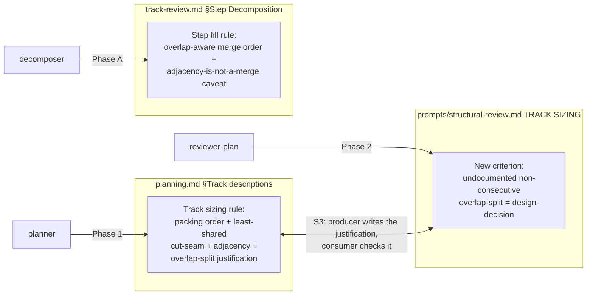

# Token-economy-oriented planning — Architecture Decision Record

## Summary

Adds source-file overlap as a second, advisory, co-locate-first token lever on top of the workflow's existing agent-count minimization. Three workflow prose rules were refined: the planner's track-sizing rule in `.claude/workflow/planning.md`, the decomposer's step-fill rule in `.claude/workflow/track-review.md`, and the Phase 2 structural-review checks in `.claude/workflow/prompts/structural-review.md`. The change orders packing choices and cut seams when overlapping work is available, and a single reviewer-judgment criterion backstops the planner-facing half. It never moves a step or track out of bounds or past a dependency. No code, no automated overlap detector, no change to the file-footprint sizing metric or the ~12 / ~20-25 bounds.

## Goals

All goals were met as planned, prose-only:

- Add overlap as a co-locate-first tie-breaker at both track granularity (planner, Phase 1) and step granularity (decomposer, Phase A).
- When packing fits under the cap, prefer the candidate unit that overlaps files the step or track already holds, because it spends less of the file-count budget and skips a later cold-read of the shared file.
- When a cut is forced, cut along the seam sharing the fewest files and order the resulting tracks adjacent.
- Name adjacency between units that cannot share an agent as the marginal fallback that removes no agent, so a future author does not promote it into a saving it cannot deliver.
- Backstop the planner-facing half with one Phase 2 structural-review criterion enforced by reviewer judgment, not an automated detector.

## Constraints

- Workflow-modifying, prose-only: three rule refinements under `.claude/workflow/`, no code.
- The change is advisory and subordinate to step coherence (mandatory at `high`), high-isolation, inter-track mergeability, dependency ordering, and the footprint bounds (S1).
- The file-footprint sizing metric and the ~12 / ~20-25 bounds are unchanged (S2). Every synchronized copy of the sizing rule stays byte-identical. The authoritative enumeration is the SYNC comment in `prompts/structural-review.md`: the `conventions.md` §1.1 glossary and §1.2 plan-file Planning rule summary, the create-plan skill's Step 4 sizing rule, and the Track-terminology paraphrase in all five review prompts (technical, risk, adversarial, consistency, and `structural-review.md`'s own Track-terminology bullet, distinct from the TRACK SIZING region this change edits).
- The planner-facing justification requirement and the reviewer-facing structural-review criterion land in the same change; neither half ships without the other (S3).

## Architecture Notes

### Component Map

Three prose rules in three files, each owned by a different role, plus the producer/consumer pairing the change introduces between the planner rule and the reviewer criterion.

- **`planning.md` §Track descriptions** (planner, Phase 1) — the *Maximize first* and cut-seam text gained three sub-paragraphs: a packing-order preference for an overlapping candidate at the tie, a least-shared cut-seam rule with adjacent ordering, and a requirement that an unavoidable overlap-split carries a written justification naming the matching structural-review check. Refines D1/D2/D3, carries the S3 producer half.
- **`track-review.md` §Step Decomposition** (decomposer, Phase A) — the *Fill ordinary steps* bullet gained an overlap-aware merge ordering (with a worked `Foo`/`Bar`/`Baz` example) and a caveat that step adjacency without a merge removes no implementer. Refines D2/D4.
- **`prompts/structural-review.md` TRACK SIZING** (reviewer-plan, Phase 2) — one new criterion bullet alongside the existing out-of-bounds check, plus a matching clause in the `design-decision` triage list; same class and severity. Implements D5, carries the S3 consumer half.

### Decision Records

#### D1: Overlap-awareness as a second, co-locate-first lever

- **Alternatives considered**: do nothing (the maximize/fill rules get no signal to prefer overlapping work at the cap); the naive "make overlapping changes adjacent" (misstates the mechanism — adjacency removes no agent); make overlap a sizing or relatedness criterion (contradicts the standing rule that thematic coherence is not a sizing criterion).
- **Rationale**: the dominant token cost is the number of fresh agent contexts, which the existing rules already minimize by merging related and unrelated work alike. Overlap-aware packing fits more change per capped agent and skips a later re-read, so it refines that lever rather than competing with it.
- **Risks/Caveats**: authors may read "adjacent" as the goal or over-weight the cold-read saving; the rule text leads with merge-and-pack and names per-agent cost as the dominant lever.
- **Outcome**: implemented as planned in `planning.md` §Track descriptions and `track-review.md` §Step Decomposition.

#### D2: Apply at both track and step granularity

- **Alternatives considered**: track-only (leaves the step fill rule's which-unit choice overlap-blind); step-only (leaves track packing and cut-seam choices overlap-blind).
- **Rationale**: a step spawns an implementer and a track spawns a review fan-out, so reducing either count is the dominant saving; the step-level gain is distinct from the existing maximize-fill because it orders which mergeable unit to pull in first.
- **Risks/Caveats**: two authoritative edit sites instead of one, accepted because the principle is identical and stated once in the design's token-model section.
- **Outcome**: implemented as planned; the shared principle is stated once in `design-final.md` §"The token model" and referenced from both rule sites.

#### D3: Track cut-seam and adjacency ordering

- **Alternatives considered**: leave cut-point choice to the dependency boundary and the ceiling alone (overlap-blind); always co-locate overlapping files even at the cost of breaking mergeability (violates S1).
- **Rationale**: when a cut is forced, the least-shared seam keeps overlap on one side at no cost to the metric, and adjacent ordering recovers the residual rebase and freshness benefit. "Prefer a dependency boundary as the cut" stays the primary cut rule and wins any disagreement with the least-shared seam.
- **Risks/Caveats**: the seam choice needs the in-scope file lists, which are estimates at Phase 1; the planner estimates, matching how scope indicators already work.
- **Outcome**: implemented as planned in `planning.md` §Track descriptions, extending the existing dependency-boundary cut rule rather than replacing it.

#### D4: Step overlap-aware fill, with step adjacency named as not a merge

- **Alternatives considered**: extend the fill rule to prefer overlap silently (loses the caveat, lets a future author reintroduce "make steps adjacent" as a false token claim); leave fill overlap-blind (status quo).
- **Rationale**: preferring an overlapping unit fits more change under the ~12 cap, so a step absorbs work that would otherwise spill into another implementer invocation; the shared-file cold-read saving is a smaller bonus. Stating the adjacency caveat keeps the rule from drifting.
- **Risks/Caveats**: none material; one ordering clause plus one caveat on an existing rule.
- **Outcome**: implemented as planned in `track-review.md` §Step Decomposition; the closed two-reason under-fill `— size:` set was left untouched.

#### D5: Advisory, enforced by one reviewer-judgment criterion, not a detector

- **Alternatives considered**: a mechanical detector computing cross-track file intersection (heavier than a tie-breaker warrants, redundant with the reviewer already reading the track lists); pure advisory with no review criterion (the existing argumentation gate fires on out-of-bounds footprint count, never on overlap, so the directive would have no backstop).
- **Rationale**: the Phase 2 structural review already reads every pending track file's `## Interfaces and Dependencies`, so one criterion bullet gives a real backstop at the cost of one bullet and no computation, matching the class of the existing out-of-bounds-track criterion.
- **Risks/Caveats**: enforcement rests on reviewer judgment reading the track lists, accepted because the directive is a tie-breaker, not a correctness rule.
- **Outcome**: implemented in `prompts/structural-review.md`. Two refinements emerged during code review and are reflected in the committed criterion. First, the criterion was given a citable home in the existing `design-decision` triage list — not only the TRACK SIZING check bullet — so the reviewer routes an undocumented overlap-split through the escalation path it already uses. Second, the criterion dedups against the existing maximization criterion: when a track left under the ceiling with a mergeable unit unpacked is the same track pair as the overlap-split, the review files one finding under the maximization clause and names the overlap as its motivation, filing the overlap-split separately only when the sharing tracks are not that under-fill pair.

### Invariants & Contracts

- **S1 — Subordination.** The overlap tie-breaker is subordinate to step coherence (mandatory at `high`), high-isolation, inter-track mergeability, dependency ordering, and the footprint bounds. The edited rule text states the subordination explicitly and never instructs moving a step or track out of bounds or past a dependency to chase overlap.
- **S2 — Metric and bounds unchanged.** The file-footprint sizing metric and the ~12 / ~20-25 bounds do not move. Every synchronized copy of the sizing rule named in the `prompts/structural-review.md` SYNC comment stays byte-identical: the §1.1 glossary, the §1.2 plan-file Planning rule summary, the create-plan Step 4 rule, and the Track-terminology paraphrase in all five review prompts. `structural-review.md` is edited only in its TRACK SIZING check region, so its paraphrase bullet stays byte-identical alongside the rest. The change adds a criterion and refines packing order; it does not edit the rule those sites paraphrase.
- **S3 — Producer/consumer co-ship.** The planner-facing justification requirement (`planning.md`) and the reviewer-facing criterion (`structural-review.md`) land in the same change. Both files appear in the change's diff; neither edit merges without the other, so the producer is never flagged for a requirement it was not given.

### Integration Points

- The new structural-review criterion plugs into the **existing argumentation gate**: an undocumented non-consecutive overlap-split becomes a `design-decision` finding, the same class and severity as the existing undocumented out-of-bounds track. No new finding class, no new escalation path.
- The track-level cut-seam refinement extends the existing **"Prefer a dependency boundary as the cut"** rule rather than replacing it; the dependency boundary stays the primary cut and wins any disagreement with the least-shared seam.
- The step-level ordering clause attaches to the existing **"Fill ordinary steps toward ~12 edited files"** bullet; the closed two-reason under-fill `— size:` set is untouched.

### Non-Goals

- No automated cross-track file-intersection detector (D5 rejects it).
- No change to the file-footprint sizing metric or the ~12 / ~20-25 bounds (S2).
- Overlap is not a sizing or thematic-relatedness criterion; thematic coherence remains not a sizing criterion (D1 rejects that framing).
- Step adjacency is not promoted to a token saving on par with merging; the rule text states it buys almost nothing (D4).

## Key Discoveries

- **The byte-identical paraphrase set is larger than the first draft named.** An early statement of S2 enumerated only the technical/risk/adversarial review-prompt paraphrases plus two summary sites. The authoritative enumeration is the SYNC comment in `prompts/structural-review.md`, which is broader: it adds the create-plan Step 4 rule and the Track-terminology paraphrase in all five review prompts, including `structural-review.md`'s own Track-terminology bullet (which is distinct from the TRACK SIZING region this change edits, so editing one region leaves the paraphrase byte-identical). Any future change that claims "the sizing rule is untouched" must check against that SYNC comment, not a remembered subset.

- **The overlap-split criterion overlaps the existing maximization criterion.** A track left below the ceiling with a mergeable unit unpacked, where that unit overlaps the track's files, satisfies both the existing under-fill maximization check and the new overlap-split criterion. Reporting both would double-count one underlying problem. The committed criterion resolves this by filing one finding under the maximization clause and naming the overlap as its motivation, reserving a standalone overlap-split finding for the case where the sharing tracks are not the under-fill pair. A reviewer applying the criterion needs to hold both checks together rather than firing each independently.

- **A reviewer-judgment criterion needs a citable triage home, not just a check bullet.** The criterion reads the in-scope file lists the structural review's TRACK DESCRIPTIONS checks already open, so it adds no new read. But to route through the existing escalation path cleanly, the criterion had to be listed in the review's `design-decision` triage enumeration alongside the out-of-bounds track, not only stated as a TRACK SIZING check. An early draft also mis-attributed the per-track `## Interfaces and Dependencies` read to a plan-file-only footprint check; the correct source is the TRACK DESCRIPTIONS checks, which already read each track's in-scope list.

- **The whole feature was a single small step.** The change is three short prose edits across three files, well under the ~12 fill cap, with no other low/medium work in scope to merge — the step held the entire track. This is the degenerate case the sizing rules tolerate: an under-filled step justified by "the step already holds the whole track," not by an arbitrary cap shortfall.

## Token usage telemetry

Snapshot from this worktree's sessions over its lifetime (N=7 sessions across 28 transcripts).

### Tool mix — share of total session context

| Component             | Share |
|-----------------------|------:|
| `Read` tool results   | 66.4% |
| `Bash` tool results   | 9.3% |
| `Grep` tool results   | 0.0% |
| `Edit` tool results   | 0.4% |
| Other tool results    | 2.9% |
| Prompts and output    | 21.0% |

### Top files by share of `Read` token consumption

| File                                            | Share of Read |
|-------------------------------------------------|--------------:|
| .claude/workflow/conventions.md                 | 9.2% |
| docs/adr/token-economy-oriented-planning/_workflow/design.md | 8.6% |
| <outside-worktree>                              | 6.3% |
| docs/adr/token-economy-oriented-planning/_workflow/plan/track-1.md | 6.3% |
| .claude/workflow/track-review.md                | 5.2% |
| .claude/workflow/self-improvement-reflection.md | 4.7% |
| .claude/workflow/implementer-rules.md           | 4.7% |
| .claude/workflow/prompts/structural-review.md   | 4.4% |
| .claude/workflow/conventions-execution.md       | 4.0% |
| docs/adr/token-economy-oriented-planning/_workflow/implementation-plan.md | 4.0% |

Generated by `.claude/scripts/measure-read-share.py` against
`~/.claude/projects/-home-andrii0lomakin-Projects-ytdb-token-economy-oriented-planning/`.
