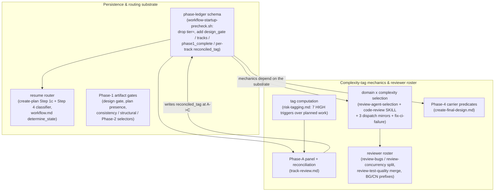

# Per-track complexity tag — Architecture Decision Record

## Summary

The workflow modeled change complexity as one whole-change enum — the **tier**
(`full` / `lite` / `minimal`) — that the planner picked once at the Phase 0→1
boundary and the machinery read wherever a process decision depended on how big the
change was. That single value answered three independent questions at once: does the
change need a `design.md`, does it span more than one track, and how hard is the work.
The third question is a property of each track, not of the whole change, so the tier
forced one intensity answer across every track of a change.

This change removed the tier and split it into three independent axes. The **design
gate** (`design_gate=yes/no`) stays change-level and decides whether `design.md`
exists. The **track count** (`tracks=N`) decides whether `implementation-plan.md`
exists, a decision deferred to the end of Phase 1 once the planner has decomposed into
track files. The **per-track complexity tag** (`low` / `medium` / `high`) is the sole
control input for process intensity: it sets Phase-A review-panel breadth and Phase-C
review rigor. The reviewer roster changed to match: `review-bugs-concurrency` split
into `review-bugs` (always-on) plus `review-concurrency` (fires on the `concurrency`
category), and `review-test-behavior` + `review-test-completeness` merged into
`review-test-quality`. The new state lives in the phase ledger, which lost `tier=` and
gained `design_gate`, `tracks`, `phase1_complete`, and a per-track `reconciled_tag`.

## Goals

- Unbundle the whole-change tier into the three axes it conflated, so a change with one
  hard track and several mechanical ones is no longer forced to one intensity. **Done.**
- Make the per-track complexity tag the single process-intensity control: it sets the
  Phase-A strategic-panel breadth and the Phase-C rigor dial. **Done.**
- Compute the tag before decomposition from the track's planned work, then reconcile it
  to `max(step tags)` after decomposition, running any missed strategic reviewers on an
  upward divergence. **Done.**
- Re-derive the durable-artifact set from the axes — `design-final.md` iff a design
  exists, `adr.md` iff a track reached medium-or-higher complexity — replacing the
  tier-keyed artifact table. **Done.**
- Split the bugs/concurrency reviewer by cognitive mode and merge the two test
  reviewers, updating the finding-prefix schema to match. **Done.**

Descoped during planning and held to it through execution: the Phase-B implementer
stays Opus on every step. The originating issue proposed swapping it to Fable 5 on
`high` steps; that swap (and its step-level-review reshape, tracked under YTDB-1100, and
YTDB-1056 Part 2) stayed out of scope, keeping this change a structural tier-unbundling
rather than a coupled model experiment. Only the YTDB-1056 Part 1 test-reviewer merge
was absorbed.

## Constraints

- **Workflow-modifying staging (§1.7).** Every `.claude/**` edit accumulated under a
  staging subtree while the live workflow stayed at develop's state, so plan citations
  resolved against a stable surface and the branch never destabilized the machinery it
  was running on. A single Phase-4 promotion commit copied the staged tree onto the live
  paths. `.claude/scripts/**` is in staging scope, because the change edits the startup
  precheck script and its tests.
- **Promotion is additive-only.** The promotion `cp -r` propagates additions and
  modifications but not deletions, so retiring a live workflow file cannot route through
  staging. Retiring the three superseded reviewer agents had to land as a hand-edit
  immediately after the promotion commit.
- **Ledger grammar preserved.** The four new ledger fields keep the append-only,
  last-value-wins-per-key read semantics and the loud-reject append validation (a
  newline or a space in a bare-token field exits non-zero); a torn append leaves the
  prior ledger tail intact via temp-file-plus-rename.
- **Forward-applicable.** The new model binds branches opened after it reaches develop.
  This branch itself ran under the old tier model and recorded `tier=full` in its own
  ledger, so its Phase-4 artifact selection maps `tier=full` onto both axes
  (`design_gate=yes`, both tracks reconciled `high`).

## Architecture Notes

### Component Map

- **Phase-ledger schema** — the append-only ledger lost `tier=` and gained
  `design_gate` (`yes`/`no`), `tracks=N` (the track-count / plan-presence signal),
  `phase1_complete=yes` (a mid-authoring-crash disambiguator), and a per-track
  `reconciled_tag` emitted on its own `track=` line and read track-scoped. Lives in
  `workflow-startup-precheck.sh`; every downstream consumer reads one of these fields.
- **Resume router** — `create-plan` Step 1c and `determine_state` route a resumed
  session off the new fields instead of `tier`. Step 4 became a design-gate classifier;
  the plan-presence decision moved to the end of Step 4b.
- **Phase-1 artifact gates** — the design gate decides `design.md` existence at the
  Phase 0→1 boundary; the consistency review, the structural review, and the Phase-2
  pass selector read `design_gate` and the track-count signal instead of the tier.
- **Tag computation** — the seven `risk-tagging.md` HIGH triggers run at track
  granularity over each track's `## Plan of Work` plus `## Interfaces and Dependencies`.
- **Phase-A panel + reconciliation** — complexity sets how many of the strategic trio
  run; reconciliation closes the prediction-vs-`max(step tags)` gap and writes the
  reconciled tag to the ledger at the A→C boundary.
- **Domain × complexity selection** — domain alone selects the Phase-C dimensional set;
  complexity moves only the rigor dial. Mirrored across `code-review/SKILL.md`,
  `review-agent-selection.md`, `track-code-review.md`, `step-implementation.md`, and
  `fix-ci-failure/SKILL.md`.
- **Reviewer roster** — the split/merged agents plus the finding-prefix owner table in
  `review-iteration.md` (retire `BC`, add `BG`/`CN`, keep `TB`/`TC`).
- **Phase-4 carrier predicates** — `create-final-design.md` derives the artifact set
  from the axes.

### Decision Records

#### D1 — Plan presence is decided at the end of Step 4b, within planning
`implementation-plan.md` exists iff the planner authored more than one track file. Track
count is unknown before decomposition, so the rule cannot fire earlier; deferring it to
Phase A would split plan authoring across a session boundary. **Implemented as planned**
in `create-plan` Step 4b.

#### D2 — The tag drives two consumers, not three; the implementer stays Opus
The per-track tag sets Phase-A panel breadth and Phase-C rigor. The third proposed
consumer — a Fable-5 implementer swap on `high` steps — was deferred so this change
stays a structural unbundling, not a coupled model experiment. **Implemented as
planned**: the implementer is Opus on every step; only the YTDB-1056 Part 1 test merge
was absorbed, with YTDB-1100 and YTDB-1056 Part 2 left out of scope.

#### D3 — Step-level review keeps the live localized-versus-buried rule, roster-adapted
The step-versus-track routing logic is unchanged; only the roster names adapt. The
burial role is inherited by `review-bugs` always and `review-concurrency` when the
`concurrency` category is present; the deferred-to-track-pass role is inherited by
`review-test-quality`. The per-track complexity tag does **not** drive step-level
selection — that stays gated on the per-step `risk: high` tag. **Implemented as planned.**

#### D5 — Reconciliation runs at Phase A on any upward divergence, at most once
When decomposition produces `max(step tags)` above the predicted track tag, the
orchestrator runs the missed higher-intensity strategic reviewers before the A→C commit,
feeds their findings back into decomposition, and fires at most once (the `high` ceiling
bounds it). A downward divergence runs no missed reviewers and floors Phase C at
`max(step tags)`. **Implemented as planned** in `track-review.md`; the reconciled tag is
appended as `--reconciled-tag <max(step tags)>` onto the A→C ledger line, recomputed
deterministically from the step roster on resume so the write is idempotent.

#### D6 — Domain × complexity selection; the floor is never suppressed
At Phase A complexity sets how many of the strategic trio run (`low` → Technical only;
`medium` → + Adversarial; `high` → + Risk + Adversarial); the Phase-A reviewer model is
keyed on `design_gate` (Fable 5 when a design exists, else Opus). At Phase C domain
alone selects the dimensional set and complexity moves only the rigor dial. The floor
plus the domain-matched set is never suppressed, because the Phase-C specialists and the
`high` triggers correlate — letting complexity drop a selected specialist would subtract
review in the dangerous direction. A `high` track adds no extra Phase-C
finding-verification, because step-level review on high steps was measured to catch
essentially no production-logic bugs (YTDB-1100). **Implemented as planned.**

#### D7 — Bugs/concurrency ownership is by cognitive mode, not location or symptom
`review-concurrency` owns every defect whose detection requires reasoning about two or
more threads interleaving; `review-bugs` owns every defect findable by single-threaded
sequential reasoning, regardless of whether the code sits inside a lock. A data race
goes to `review-concurrency` only; a code fragment with both a sequential and an
interleaving flaw produces two findings, one per reviewer. Because `review-concurrency`
fires only on the `concurrency` category, `review-bugs` emits a one-line triage-gap note
when it meets concurrent-looking code that was not triaged onto `review-concurrency`.
**Implemented as planned**; finding prefixes are `BG` (review-bugs) and `CN`
(review-concurrency), `BC` retired, `TB`/`TC` kept verbatim on `review-test-quality`.

#### D8a — Phase-1 artifact existence derives from the design gate and the track count
`design.md` exists iff `design_gate=yes`; `implementation-plan.md` exists iff
`tracks > 1`. **Implemented as planned.**

#### D8b — The `adr.md` predicate reads the reconciled per-track tag
`adr.md` exists iff at least one track reconciled to medium-or-higher complexity, and
`design-final.md` iff a design exists — two independent predicates, so the final-artifact
commit fires when either carrier exists. An ADR tracks decision substance, not the
track-count proxy the tier table used: an all-`low` multi-track change now drops `adr.md`,
a high-complexity single-track change now earns one, and the design-plus-single-track cell
the tier model could not represent produces `design-final.md` + `adr.md` with no plan.
**Implemented as planned** in `create-final-design.md`. The design-plus-all-low cell
(`design-final.md` with no `adr.md`) is the one combination the old tier-coupled carrier
table could not express; the independent predicates handle it, with the verdict fold
re-routing to the PR description when no `adr.md` exists.

#### D9 — The tag is computed over planned work, not a file-path list
The seven HIGH triggers test what a change *does* ("introduces synchronization",
"modifies WAL recovery"), which a bare file-path list cannot evaluate, so the tag is
computed over the `## Plan of Work` prose plus the `## Interfaces and Dependencies` file
set. The seven complexity triggers and the thirteen code-review categories stay distinct
taxonomies — mapped, not merged. **Implemented as planned** in `risk-tagging.md`.

#### D10 — Phase-ledger schema delta and resume disambiguation
The ledger drops `tier=` and adds `design_gate`, `tracks`, `phase1_complete`, and the
per-track `reconciled_tag`. Resume disambiguation reads `design_gate`, the
`phase1_complete` marker, and the track-count signal. The marker resolves the one
collision the unbundling creates: the design-plus-single-track steady state has an
on-disk signature (a `design.md`, no plan, one track file) byte-identical to a
mid-authoring crash, told apart only by whether Phase 1 finished cleanly (marker set) or
not (marker unset). **Implemented as planned**; the chosen renderings are `tracks=N`
(carrying strictly more than a `plan=yes/no` flag) and `phase1_complete=yes`. The Step-1c
router keeps the design-present case as one branch that fans out internally on the marker.

#### D11 — Reindex staged-skill scope fix (emerged during execution)
A new decision surfaced after the selection-mirror sweep had to stage a non-anchor skill
(`fix-ci-failure/SKILL.md`) to re-key its roster references. The reindex check's live
glob excludes that skill from the TOC-bearing anchor set, but its staged glob matched any
staged skill, so the verbatim staged copy (no TOC, matching its live namesake) tripped
the TOC and annotation rules and failed the whole-repo check. Resolved by mirroring the
existing staged-agent partition: a staged copy of a non-anchor skill validates exactly as
its out-of-scope live namesake would (out of the TOC/annotation rules, kept in the
citing-scope rules), chosen over narrowing the glob because it preserves citing-scope
validation. The fix takes effect on develop only at the Phase-4 promotion; until then the
live script over-fired on the staged copy, tolerated because the TOC-check CI gate skips
draft PRs. **Implemented** in `workflow-reindex.py` with a `_is_staged_nonanchor_skill`
partition and four regression tests.

### Invariants & Contracts

- The ledger append validates each new bare field with the existing loud-reject grammar;
  last-value-wins-per-key holds for the new keys; the per-track `reconciled_tag` is read
  track-scoped, so a completed prior track's tag cannot leak into a later track's
  selection; a torn append leaves the prior ledger tail intact.
- Resume routing maps every on-disk artifact combination to a defined path, never a dead
  end; the `phase1_complete` marker separates the design-plus-single-track steady state
  from a mid-authoring crash.
- At Phase C, complexity never drops a reviewer the domain selected — it changes only how
  many iterations each selected reviewer runs.
- No promoted file reads the dropped `tier` ledger field or runs `--append-ledger
  --tier`; the finding-prefix owner table carries `BG`/`CN`/`TB`/`TC`/`TX` and no `BC`.

### Non-Goals

- A Fable-5 implementer swap on `high` steps, and any reshape of the step-level
  dimensional review (YTDB-1100, YTDB-1056 Part 2) — explicitly deferred.
- Changing the step-level review trigger: step-level review stays gated on the per-step
  `risk: high` tag and the live localized-versus-buried routing, not on the per-track tag.

## Key Discoveries

- **The design-plus-single-track steady state collides with a mid-authoring crash.** Both
  leave a `design.md`, no plan, and one track file on disk — an identical signature. Only
  the `phase1_complete` marker distinguishes them, which is why the schema delta added a
  Phase-1-complete signal rather than relying on file presence alone.
- **Additive-only promotion cannot retire a file.** The staging convention copies
  additions and modifications onto the live tree but never deletions, so a roster change
  that supersedes agents must hand-delete the live originals immediately after the
  promotion commit. Any future branch that shrinks the workflow roster inherits this step.
- **A staged copy of a non-anchor skill over-fires the reindex TOC/annotation rules.** The
  reindex live glob and staged glob disagreed on which skills carry a TOC, so staging a
  verbatim TOC-less skill (required to re-key its references) failed the whole-repo check
  until the staged-non-anchor-skill partition landed. The fix reaches develop only at
  promotion, and the CI gate skips draft PRs, so the failure was contained.
- **The precheck ledger reader keys on a leading-space ` key=` match, not a line-start
  `key=`.** The reader's own comment still advertises a column-0 match it does not deliver;
  the schema-contract tests were written against the real leading-space semantics, but the
  inaccurate comment in `workflow-startup-precheck.sh` is a known residual for a future
  cleanup.
- **The Phase-2 pass-selector rename was self-contained.** Renaming the selector section
  from "Tier-driven pass selection" to "Axis-driven pass selection" touched only the
  structural-review cross-reference plus the selector's own internal references — no other
  workflow file hardcoded the old heading — so the rename needed no wide referrer sweep.

## Adversarial gate verdicts

The pre-code adversarial gate on the research log resolved **PASS** after two iterations.
The first iteration returned NEEDS REVISION with two blockers, five should-fix, and two
suggestions; all nine findings were resolved into the decision set above and verified in
the second iteration, which passed with one new non-gating suggestion (the Step-1c
branch arrangement, recorded as a rendering detail). The gate cleared before any code was
written.

## Token usage telemetry

Snapshot from this worktree's sessions over its lifetime (N=12 sessions across 128 transcripts).

### Tool mix — share of total session context

| Component             | Share |
|-----------------------|------:|
| `Read` tool results   | 71.2% |
| `Bash` tool results   | 8.9% |
| `Grep` tool results   | 0.2% |
| `Edit` tool results   | 0.6% |
| Other tool results    | 2.8% |
| Prompts and output    | 16.3% |

### Top files by share of `Read` token consumption

| File                                            | Share of Read |
|-------------------------------------------------|--------------:|
| <outside-worktree>                              | 14.0% |
| docs/adr/track-complexity-assessment-workflow-optimization/_workflow/plan/track-2.md | 10.3% |
| docs/adr/track-complexity-assessment-workflow-optimization/_workflow/plan/track-1.md | 7.7% |
| docs/adr/track-complexity-assessment-workflow-optimization/_workflow/design.md | 6.8% |
| .claude/workflow/implementer-rules.md           | 5.3% |
| .claude/output-styles/house-style.md            | 4.9% |
| .claude/scripts/workflow-startup-precheck.sh    | 3.8% |
| docs/adr/track-complexity-assessment-workflow-optimization/_workflow/research-log.md | 2.9% |
| .claude/workflow/conventions.md                 | 2.5% |
| docs/adr/track-complexity-assessment-workflow-optimization/design-final.md | 2.3% |

Generated by `.claude/scripts/measure-read-share.py` against
`~/.claude/projects/-home-andrii0lomakin-Projects-ytdb-track-complexity-assessment-workflow-optimization/`.
