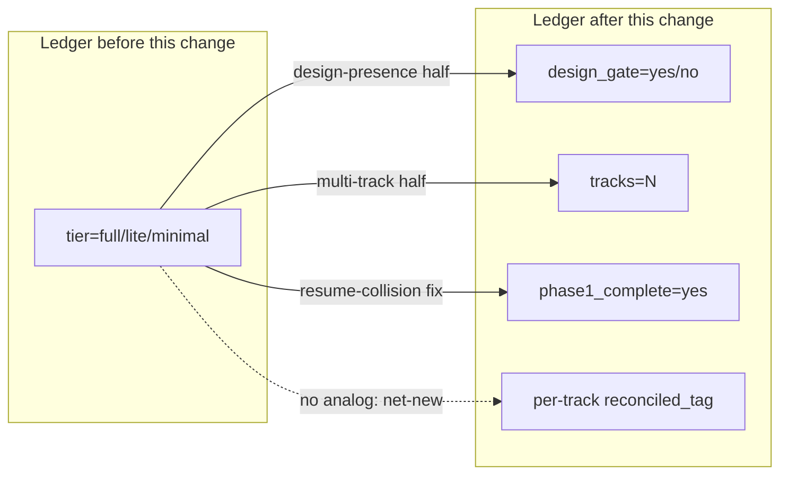
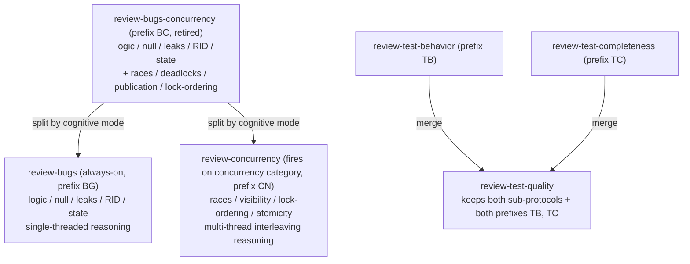
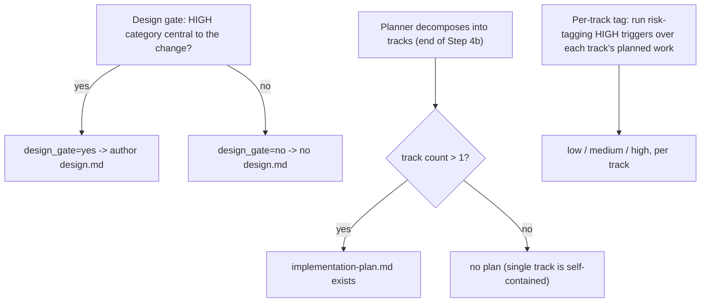
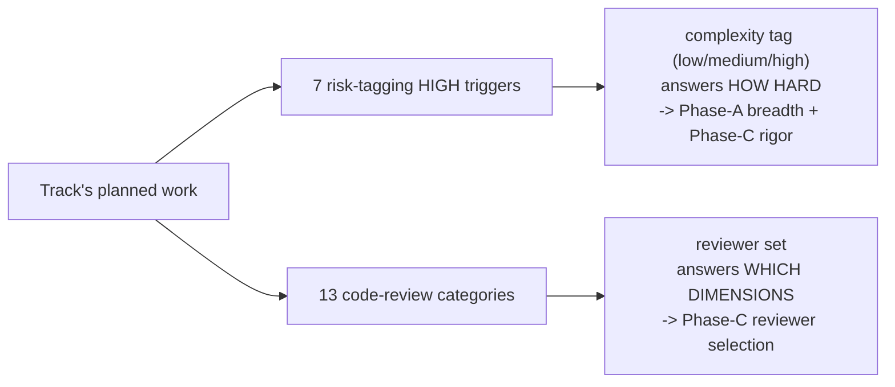
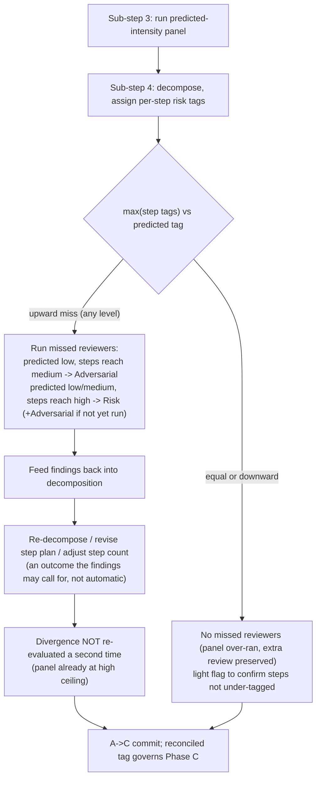
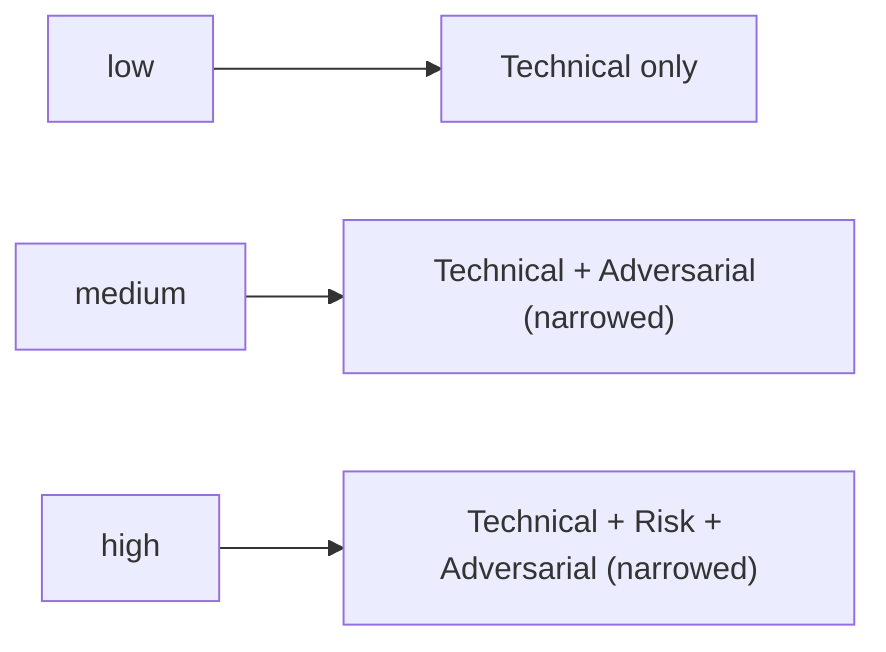
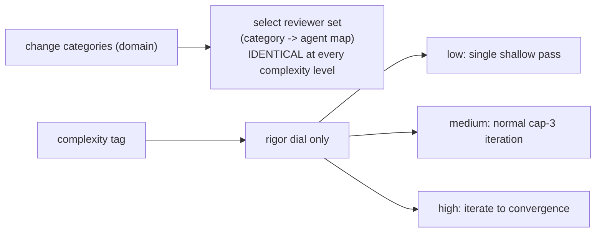
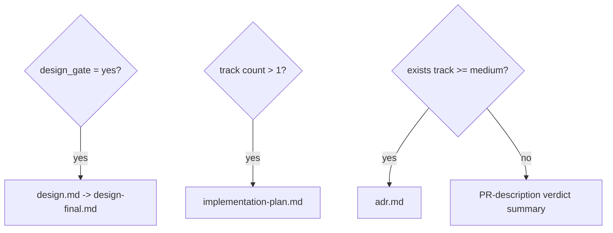
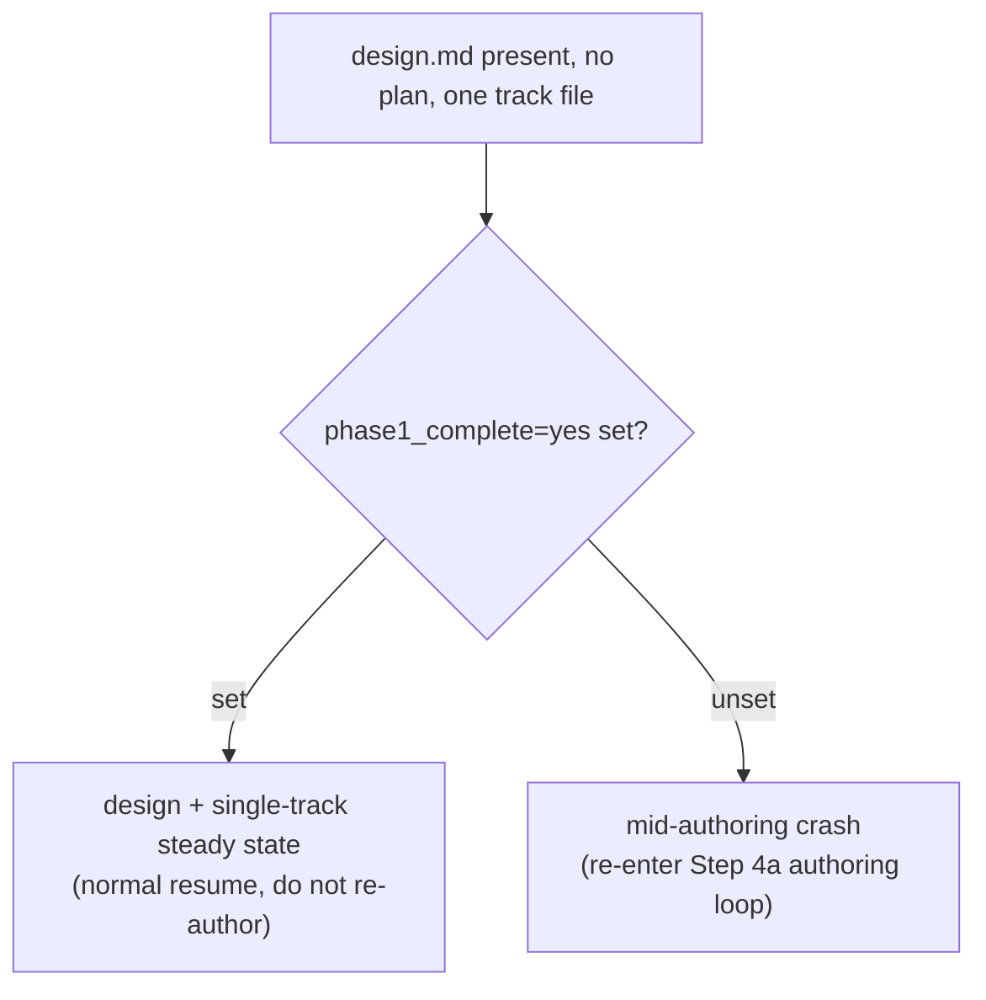
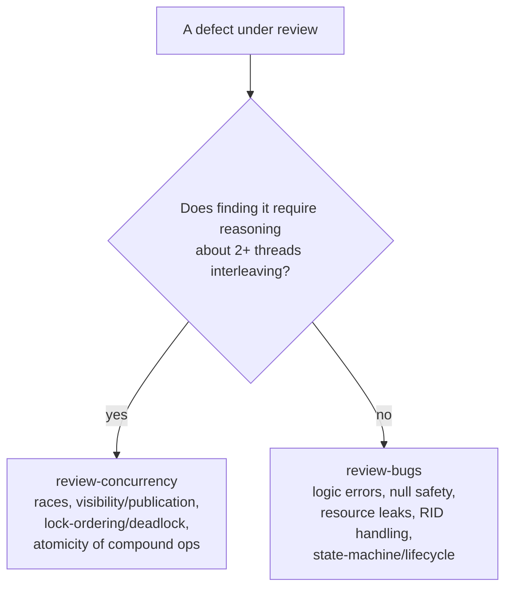

# Per-track complexity tag — Design

## Overview

The workflow used to model change complexity as one whole-change enum — the
**tier** (`full` / `lite` / `minimal`), a value the planner picked once at the
Phase 0→1 boundary and the machinery read everywhere a process decision depended
on how big the change is. That one value answered three independent questions at
once: does the change need a `design.md`, does it span more than one track, and
how hard is the work. Conflating them was wrong because the third question — how
hard — is a property of each track, not of the change: a change with one
architecture-central track and three mechanical ones was forced into one answer
for all four.

This change replaced the whole-change tier enum with the three independent axes
it conflated. The **design gate** (`design_gate=yes/no`) stays change-level and
decides whether `design.md` exists. The **track count** decides whether
`implementation-plan.md` exists — a deferred decision made once the planner has
decomposed into track files at the end of Phase 1. The **per-track complexity
tag** (`low` / `medium` / `high`) is computed per track from its planned work
using the existing `risk-tagging.md` HIGH triggers, then reconciled with the
post-decomposition `max(step tags)`. The tag is the single control input for
process intensity: it sets Phase-A review-panel breadth and Phase-C review rigor.

The new state lives in the **phase ledger** (`_workflow/phase-ledger.md`, the
append-only event log the resume state machine reads). It lost `tier=` and gained
four fields that re-home what the tier carried: `design_gate=`, a track-count
signal (`tracks=N`), a Phase-1-complete marker (`phase1_complete=yes`), and a
per-track reconciled-tag home (`reconciled_tag=`). This change also made two
reviewer-roster changes: `review-bugs-concurrency` split into `review-bugs`
(always-on) plus `review-concurrency` (fires on the `concurrency` category), and
`review-test-behavior` + `review-test-completeness` merged into one
`review-test-quality`.

This is a workflow-machinery design for a reader who maintains
`.claude/workflow/**` and `.claude/scripts/workflow-startup-precheck.sh`, and who
knows the former tier model, the Phase A / B / C review structure, and the
phase-ledger resume contract. The rest covers Core Concepts, a Data model section
and six Parts: the three axes, Phase-A reconciliation, reviewer selection,
artifact derivation, resume routing, and roster-split ownership.

## Core Concepts

This design rests on six load-bearing ideas. Each is named and used without
re-definition in the Parts that follow; if a Part later references one, the
definition is here. Each entry pairs the new concept with what it replaced, so
the delta from the tier model is visible at a glance.

**Design gate.** A change-level yes/no — does this change need a `design.md`. It
reuses the existing `risk-tagging.md` Gate-1 test (a HIGH category is *central*
to the change's purpose) unchanged in logic; only its persistence home moved. It
replaces the design-presence half of the tier (`full` had a design, `lite` and
`minimal` did not). → Part 1 §"The three axes", Part 4 §"Artifact derivation".

**Track count.** The number of track files the planner authored at the end of
Phase 1 Step 4b. `implementation-plan.md` exists iff this count exceeds one. It
replaces Gate 2 (the multi-track half of the tier) and turns plan presence from
an up-front tier pick into a decision read off the track files once they exist.
→ Part 1 §"The three axes", Part 4 §"Artifact derivation".

**Per-track complexity tag.** A `low` / `medium` / `high` value per track,
predicted before decomposition from the track's planned work, then reconciled to
`max(step tags)` after decomposition. It is the sole input that scales process
intensity. It replaces the whole-change tier as the intensity knob the Phase-A
panel and the Phase-C rigor dial read. → Part 1 §"Computing the tag", Part 3
§"Reviewer selection".

**Prediction vs reconciled tag.** The Phase-A review panel runs *before*
decomposition (sub-step 3 reviews; sub-step 4 decomposes), so when the panel runs
no step tags exist and it must size itself from the prediction alone. The
reconciled tag — `max(step tags)` — is computable only after sub-step 4. The gap
between the two is real and is what reconciliation closes. The tier model had no
analog: the panel read the whole-change tier, which never diverges from itself.
→ Part 2 §"Reconciliation on upward divergence".

**Domain × complexity selection.** The two-input rule that picks reviewers.
Domain (the change's categories) decides *which* reviewers run. Complexity decides
*how many* of the strategic trio (technical / risk / adversarial) run at Phase A.
It also decides *how hard* the dimensional panel — one reviewer per dimension —
iterates at Phase C. It replaces tier-driven panel selection, which keyed the
Phase-A pipeline on the whole-change tier and took no complexity input at Phase C
at all. → Part 3 §"Reviewer selection".

**Reconciled-tag home.** A per-track field in the phase ledger
(`reconciled_tag=`), written at the Phase A→C boundary, holding each track's
reconciled tag. A fresh Phase-C session reads it for rigor selection; the Phase-4
`adr.md` predicate reads it for the "any track tagged medium or higher" test. The
tier model had no analog — the tier was one change-level value, so it needed no
per-track home. → Part 5 §"Resume routing", Part 4 §"Artifact derivation".

## Data model

The ledger schema delta and the reviewer-roster split/merge are the two
structural changes — the workflow-design analog of a class diagram. Both are
shown below as tables and diagrams; the mechanism that consumes them is in the
Parts that follow.

### Phase-ledger schema delta

**TL;DR.** Drop the `tier=` field; add four fields that re-home what the tier
carried plus the new per-track tag. The ledger is the established resume-state
home — it already carried `tier` — so the new state joins it rather than
scattering across track files.

The phase ledger is an append-only event log with last-value-wins-per-key read
semantics: a reader scans every line and keeps the most recent value for each
key. The former key set was
`{ phase, track, tier, substate, categories, s17, paused }`. The delta replaced
`tier` with four keys:

| Key | Status | Value | Purpose |
|---|---|---|---|
| `tier` | removed | — | The conflated whole-change enum being unbundled. |
| `design_gate` | added | `yes` / `no` | The change-level design decision; seeded at Phase 1. Replaces the `tier`-keyed model/effort pin (the reviewer model the Phase-A panel selects — Fable 5 when a design exists, else Opus) and the design-presence gates in the consistency and structural reviews. |
| `tracks` | added | `N` (an integer) | The track-count signal, decided at the end of Step 4b. Carries strictly more than a `plan=yes/no` flag — the count itself, not just its sign. Replaces the `tier=minimal` trigger that the no-plan / single-track resume machinery keyed off. |
| `phase1_complete` | added | `yes` (presence is the signal) | Lets Step 1c tell the new `design + single-track` steady state apart from a mid-authoring crash. |
| `reconciled_tag` | added | per-track `low` / `medium` / `high` | Written at the A→C boundary on the same line as its `track=` token; read by Phase C for rigor and by Phase 4 for the `adr.md` predicate. |

The diagram shows the unbundling: the one `tier` value splits into the three
questions it conflated, mapped field-by-field above. One field has no tier analog
at all — the per-track `reconciled_tag` exists only because complexity is now
per-track state, so nothing in the old single-value tier maps onto it. The four
`--append-ledger` flags map to keys directly: `--design-gate`→`design_gate`,
`--tracks`→`tracks`, `--phase1-complete`→`phase1_complete`, and
`--reconciled-tag`→`reconciled_tag`.

The keys keep the existing ledger grammar: bare metacharacter-free tokens
validated on append (a newline, a space in a bare-token field, or a double quote
in `categories` is rejected with exit 3). The per-track `reconciled_tag` is read
track-scoped: the reader resolves it only on a ledger line whose `track=` matches
the track being selected. This is the same last-value-wins-for-this-track read the
`substate` key already uses. So a completed prior track's tag cannot leak into a
later track's selection.

#### Edge cases / Gotchas

- An absent `design_gate` on an old ledger (a branch predating this scheme) reads
  as the malformed / pre-scheme case the resume router already handles for an
  absent `tier`; Part 5 routes it to the "surface the inconsistency" arm rather
  than guessing.
- A torn append still leaves the prior ledger tail intact (temp-file + rename),
  so a crash mid-write loses the new field's append but never corrupts the
  existing fields the resume read depends on.

### References

- D10: ledger schema delta — drop `tier=`, add the four fields.
- D8: the `adr.md` predicate reads the per-track reconciled tag.
- D5: the reconciled tag is written at the A→C boundary.

### Reviewer-roster split and merge

**TL;DR.** Split `review-bugs-concurrency` into `review-bugs` (always-on, prefix
`BG`) and `review-concurrency` (fires on the `concurrency` category, prefix
`CN`); the combined `BC` prefix is retired. Merge `review-test-behavior` +
`review-test-completeness` into `review-test-quality`, which keeps both the `TB`
and `TC` prefixes verbatim. The split draws its boundary on the reasoning mode a
defect needs, not on where the code sits.

The split follows the template the test side already set: it had merged its
behaviour and completeness reviewers but split `review-test-concurrency` (prefix
`TX`) out separately, because race-finding needs a different reasoning mode. The
production split mirrors that — `review-concurrency` is the production analog of
`review-test-concurrency`. The ownership boundary (which defect goes to which
reviewer) is the subject of Part 6; this section only names the agents and the
prefixes they carry. The canonical owner table in `review-iteration.md`
§"Finding ID prefixes" holds the prefix family: `BG` for Bugs review, `CN` for
Concurrency review, `TB` and `TC` for the merged test reviewer, `TX` unchanged on
`review-test-concurrency`, and no `BC` row.

#### Edge cases / Gotchas

- `review-concurrency` fires only on the `concurrency` category, so subtle
  concurrency that the categorizer misses would escape it. Part 6's triage
  backstop closes this: `review-bugs`, reasoning sequentially, emits a one-line
  "concurrency triage gap here" note when it meets concurrent-looking code that
  `review-concurrency` was not triaged onto.
- The merge does not change the test-side category map — `review-test-quality`
  launches under the same always-on rule the two merged agents had.

### References

- D7: bugs/concurrency ownership is by cognitive mode (the split's boundary).
- D6: `review-bugs` + `review-test-quality` are part of the Phase-C floor.

# Part 1 — The three axes

The tier conflated three questions into one value. This Part defines the three
axes that replace it and how the per-track complexity tag is computed.

## The three axes

**TL;DR.** Three independent inputs replace the one tier: the change-level design
gate (does `design.md` exist), the track count (does `implementation-plan.md`
exist), and the per-track complexity tag (how hard each track is). Each is
decided at its natural point in Phase 1 and persisted in the ledger.

The tier was one value answering three questions, so it forced one answer where
three were needed. Unbundling restores the independence. The axes and their
decision points:

The design gate is decided at the Phase 0→1 boundary, exactly where Gate 1 was
decided before; only its name and persistence changed. The track-count axis is
decided at the end of Step 4b, once the planner has authored the track files — a
shift *within* Phase 1, not a deferral to Phase A. Track count is unknown before
decomposition, so the rule "plan exists iff more than one track" cannot fire
earlier. Deferring it to Phase A would split plan authoring across a session
boundary: Phase A is per-track *step* decomposition, and it runs later in a fresh
session. Keeping the decision at the end of Step 4b leaves the whole
plan-vs-no-plan choice in the planner's hands.

The two old tiers map cleanly onto the axes: `full` was design=yes + multi,
`lite` was design=no + multi, `minimal` was design=no + single. The third axis
(complexity) was the part the tier could not express per-track at all.

### Edge cases / Gotchas

- A design-needing change was multi-track by construction under the tier model,
  so the design=yes + single cell did not exist. It exists now: `design.md` →
  `design-final.md` + `adr.md`, no plan. Part 5 handles the resume collision this
  new cell creates.
- A change with one architecture-central track does not fall through a gap by
  being single-track: its track hits the Architecture HIGH trigger and tags
  `high`, so it earns full Phase-A and Phase-C intensity regardless of track
  count.

### References

- D1: plan presence is decided at the end of Step 4b, within planning.
- D8: artifact set derived from the three axes.
- D10: the three axes persist in the ledger.

## Computing the tag

**TL;DR.** The pre-decomposition tag is computed by running the seven
`risk-tagging.md` HIGH triggers over the track's *planned work* — its
`## Plan of Work` prose plus its `## Interfaces and Dependencies` file set — not
over a bare file-path list. The HIGH triggers are content predicates a path list
cannot evaluate. The result is a prediction, reconciled to `max(step tags)` after
decomposition.

The whole model rests on the tag being computable before decomposition. The
planner has described each track's planned edits by the end of Phase 1, so the
content to read exists. The catch is what to read it *over*. The seven HIGH
triggers — Concurrency, Crash-safety / Durability, Public API, Security,
Architecture / cross-component coordination, Performance hot path, and Workflow
machinery — test what the change *does* ("introduces synchronization", "modifies
WAL recovery", "adds an abstraction layer / SPI registration"), not which files
it touches. A bare list of file paths cannot answer "does this *introduce*
synchronization"; it can only say a file was touched. So the tag is computed over
the track's planned work: the `## Plan of Work` (the prose sequence of edits)
plus the `## Interfaces and Dependencies` (the in-scope file set), where the
content needed to evaluate a verb-on-change predicate lives.

This is the same seven-trigger set the per-step risk tag uses, run at track
granularity instead of step granularity. It stays a *prediction* — the planner's
described work, not the realized diff — which is why D5's reconciliation against
the content-based step tags exists to absorb the residual error.

Two taxonomies stay distinct and serve two purposes:

The seven HIGH triggers drive the complexity tag (how hard). The thirteen
`code-review` categories drive Phase-C reviewer selection (which dimensions). They
overlap but are distinct: the design maps them but does not merge them. A track
can tag `high` on the Architecture trigger while its categories select a
particular specialist set; the two answers are computed from the same planned
work through two different lenses.

### Edge cases / Gotchas

- A track whose `## Plan of Work` is thin or vague yields a weak prediction; D5's
  reconciliation is the safety net — the content-based step tags computed after
  decomposition correct an under-prediction by running the missed reviewers
  (Part 2).
- A genuinely `low` track is a pure refactor / tests / docs track that matches no
  HIGH trigger. An architecture-central track is never `low`: it hits the
  Architecture trigger. The risk-tag override is the backstop for the subtle case
  the prediction misses — at reconciliation, the content-derived `risk:` step tag
  floors an under-predicted track tag (Part 2).

### References

- D9: the tag is computed over planned work, not a file-path list; two taxonomies
  (7 triggers / 13 categories), mapped not merged.
- D5: the prediction is reconciled to `max(step tags)`.

# Part 2 — Phase-A reconciliation

Phase A reviews before it decomposes. The panel runs at the predicted intensity,
then decomposition can reveal the steps are harder than predicted. This Part
defines what the orchestrator does on that upward divergence.

## Reconciliation on upward divergence

**TL;DR.** When decomposition produces `max(step tags)` above the predicted track
tag — any upward miss — the orchestrator reconciles before the A→C commit. Still
within Phase A, it runs the higher-intensity strategic reviewers the predicted
panel skipped, feeds their findings back into decomposition, and re-runs to PASS
through the existing cap-3 loop. Reconciliation fires at most once per Phase A.

Phase A runs sub-step 3 (the technical / risk / adversarial panel) before sub-step
4 (decompose into steps, assign per-step risk tags). When the panel runs, step
tags do not yet exist, so it sizes itself from the track-tag prediction alone.
`max(step tags)` is computable only after sub-step 4. So the panel can run at the
predicted intensity and only afterward discover the steps are harder — a real
prediction-vs-reconciled gap.

The divergence is detectable at the end of Phase A, before any code is written —
the cheapest place to fix the plan. Running the missed reviewers there catches
approach and decomposition problems before implementation and lets their findings
drive re-decomposition while it is still free.

The missed reviewers are the ones the higher-intensity panel would have run, per
the Phase-A complexity→panel map (Part 3): a predicted `low` track whose steps
reach `medium` runs Adversarial; a predicted `low`/`medium` track whose steps
reach `high` runs Risk, plus Adversarial if it has not already run. This brings
the panel up to the reconciled intensity. They run as ordinary Phase-A review
passes — each its own review type under the existing per-review-type cap-3 on
sub-step 3, exactly like the predicted-intensity panel. The missed-reviewer pass
appends review types to the sub-step-3 panel, then returns to sub-step 4 once.

The orchestrator writes the reconciled tag at the A→C commit by appending
`--reconciled-tag <max(step tags)>` onto the same `--append-ledger` line that
already carries `--track <N>`, so the tag that governs Phase C lands on its
track's ledger line for the track-scoped read. On resume the orchestrator
recomputes `max(step tags)` from the committed step roster, so a re-run produces
the same value and the write is idempotent.

Termination is bounded because the intensity ceiling is `high`. Reconciliation
fires at most once per Phase A: after the missed reviewers run and any
re-decomposition lands, the divergence comparison is not re-evaluated against a
second upward miss. If re-decomposition raises `max(step tags)` again, it can only
reach `high`, which the missed-reviewer pass already covered — so there is no
decompose-then-re-review ping-pong.

Downward divergence (the steps came out *easier* than predicted) needs no missed
reviewers: the panel already over-ran, so the extra review is preserved and the
result is safe. Phase C reads `max(step tags)` as the floor: even when the
prediction over-ran, the rigor never drops below the step-derived maximum. A light
flag asks the decomposer to re-check that no step was tagged below the work it
actually does before the lower reconciled tag is trusted; no re-review.

### Edge cases / Gotchas

- The reconciled tag, not the prediction, governs Phase C: the per-track home in
  the ledger (Part 5) is written with `max(step tags)` at the A→C commit.
- A predicted `high` track cannot diverge upward (there is no level above
  `high`), so it never triggers the missed-reviewer pass.
- An interrupted mid-Phase-A resume must re-enter reconciliation, not jump
  straight to the A→C commit: the handoff records whether decomposition has run
  but reconciliation is still pending, so the strategic reviewers the
  upward-divergence pass adds are not dropped.

### References

- D5: reconciliation runs at Phase A, before Phase B, on any upward divergence;
  fires at most once; downward divergence floors at `max(steps)` with no
  re-review.
- D6: the Phase-A complexity→panel map defines which reviewers the missed-pass
  runs.

# Part 3 — Reviewer selection

The two review phases run different reviewer populations, so the per-track tag
acts differently in each. This Part defines `domain × complexity` selection for
Phase A and Phase C.

The per-track tag drives two consumers here, not three: Phase-A panel intensity
and Phase-C reviewer selection. A third consumer the originating issue proposed —
swapping the Phase-B implementer to Fable 5 on `high` steps — stayed deferred; the
implementer is Opus for every step, keeping this change a structural
tier-unbundling and not a coupled model experiment. That deferral narrows the
scope: YTDB-1100 (its implementer upgrade and its step-level-review reshape) and
YTDB-1056 Part 2 are out of scope here — they stay open and untouched. Only
YTDB-1056 Part 1, the `review-test-behavior` + `review-test-completeness` →
`review-test-quality` merge, is absorbed.

## Reviewer selection

**TL;DR.** Phase A runs the strategic trio (technical / risk / adversarial),
which is holistic; complexity sets *how many* of the three run; domain only biases
which concerns the Risk and Adversarial reviewers emphasize, not which of the
three run. Phase C runs the dimensional panel; domain *alone* selects the reviewer
set, complexity moves only the rigor dial (iteration depth). At Phase C the floor
plus the domain-matched set is never suppressed: complexity never drops a selected
specialist.

The reason the tag acts differently is that the two phases review different
things. Phase A's trio is holistic — each reviewer judges the whole track
approach, not one dimension — so the only knob complexity can turn is how many of
the three run. Phase C's panel is dimensional — each reviewer owns one domain — so
domain presence is what selects the set, and complexity can only change how many
iterations each selected reviewer runs.

### Phase A — complexity sets the count

Complexity sets how many of the strategic trio run; domain only biases which
concerns the Risk and Adversarial reviewers emphasize. This re-keys the former
tier-driven panel onto the per-track tag with no structural change: Adversarial is
the default extra at medium and above, Risk is the high-stakes add, because a
`high` tag *is* a HIGH-trigger characteristic. Dropping Adversarial on `low` is
deliberate: the prior rule ran Adversarial in every `lite`/`full` track, but a
genuinely `low` track (pure refactor / tests / docs) gets Technical only. An
architecture-central track does not fall through this gap — it tags `high` (it hit
the Architecture HIGH trigger over its planned work, Part 1) and so runs Risk +
Adversarial; the risk-tag override is the backstop for a subtle case the
prediction misses.

### Phase C — complexity is the rigor dial

Domain alone selects the reviewer set through the category→agent map; the set is
identical at every complexity level. Complexity moves only the rigor dial —
iteration depth — and nothing more. A `high` track adds no adversarial
finding-verification at Phase C — the per-finding adversarial re-check a Phase-A
`high` track would otherwise get. It is withheld because the step-level
dimensional-review catch-rate study behind YTDB-1100 found that step-level review
on high steps caught essentially no production-logic bugs, so the extra
verification would be unearned cost.

The floor plus the domain-matched set is never suppressed at Phase C — complexity
never drops a selected specialist — for a concrete reason. The Phase-C specialists
are gated on largely the same HIGH triggers that make a track `high`, so domain
and complexity are correlated. The link is the category set itself: a category
that selects a Phase-C specialist — `configuration` selecting `review-security`,
say — is also the kind of characteristic that pushes a track toward `high`, so a
track dangerous enough to need a specialist has usually already tagged `high`. The
corollary: a genuinely `low`/`medium` track's domain rarely selects specialists,
so it gets mostly the floor anyway. Letting complexity *suppress* a specialist
whose domain is present would subtract review in the dangerous direction — a `low`
track touching `configuration` getting less `review-security`. So complexity only
decides how deep the iteration goes; it never removes a reviewer the domain
selected.

**The floor** (the minimum set kept on every track regardless of complexity):
`review-code-quality`, `review-bugs`, `review-test-quality` (plus
`review-test-structure` if tests changed). The workflow-machinery analog is
`review-workflow-consistency` + `review-workflow-context-budget`, plus four
reviewers that each fire when the diff touches files matching their glob, per
`review-agent-selection.md` §"Per-agent file-pattern triggers":

- `hook-safety` — on `.claude/scripts/**`, `.claude/hooks/*.sh`, or
  `.claude/settings*.json`.
- `writing-style` — on any `*.md`.
- `prompt-design` — on the SKILL / agent / prompt globs.
- `instruction-completeness` — on the SKILL / agent / prompt globs.

### Step-level review keeps the live localized-versus-buried rule

Step-level review (Phase B sub-step 4, fires on `risk: high` steps) keeps the live
`localized-versus-buried` rule in `review-agent-selection.md` §"Step-level vs
track-level routing" unchanged in logic; only the agent roster adapted to the
split/merge. The rule decides which reviewers run at a step versus defer to the
cumulative Phase-C track pass, by asking whether a reviewer's findings would be
*buried* once the step diff folds into the cumulative diff.

The roster adaptation:

- The combined `review-bugs-concurrency` had a step-level burial role: its
  bug / logic / leak / null findings get buried once the step diff folds into the
  cumulative diff, so it must see each step in isolation. After the split, that
  role is inherited by `review-bugs` always, and by `review-concurrency` when the
  `concurrency` category is present — a race in the step diff can be buried for the
  same reason.
- The merged `review-test-quality` inherits the deferred-to-track-pass role of the
  two test baselines: they read whole-suite quality off the cumulative diff
  identically, so the step adds nothing.
- The single-step-high override is unchanged: a sole-step track runs the full
  track-pass-equivalent selection at the step, because Phase C is skipped.

The per-track complexity tag does **not** drive step-level selection. Step-level
stays gated on the per-*step* `risk: high` tag plus the live burial routing. The
tag drives Phase-A panel breadth and Phase-C rigor only. For a workflow-machinery
high step, the governing rule is the "Workflow-review group" paragraph of
`review-agent-selection.md` §"Step-level vs track-level routing" — the narrowing
that, at a high step, runs only the workflow reviewers whose file-pattern globs
match the step diff and defers the rest to the cumulative track pass. That rule
governs here unchanged in logic; only the roster adapted — the split/merge changes
which agents the globs name, not the step / track split itself. The design defers
to that paragraph and invents no new rule.

### Edge cases / Gotchas

- A mis-tagged or cross-domain track is protected at Phase C: because domain
  selects the set, a track tagged `low` that nonetheless touches a dangerous
  category still gets that category's specialist; complexity only shortens the
  iteration, never drops the reviewer.
- The selection logic that takes a complexity input is net-new — the prior
  reviewer selection was purely category-driven. This selection lives in
  `code-review/SKILL.md` Step 5, mirrored in `review-agent-selection.md`,
  dispatched by `track-code-review.md` and `step-implementation.md`, and mirrored
  again in `fix-ci-failure/SKILL.md` (a drift vector all sites must stay
  synchronized with).

### References

- D2: the tag drives two consumers (Phase-A intensity, Phase-C selection), not
  three — the Fable-5 implementer swap is deferred, implementer stays Opus; only
  YTDB-1056 Part 1 is absorbed, YTDB-1100 and YTDB-1056 Part 2 stay out of scope.
- D6: domain × complexity — complexity sets count at Phase A, rigor at Phase C;
  the floor is sacred; `high` adds no extra Phase-C verification.
- D3: step-level review keeps the live localized-versus-buried rule,
  roster-adapted.
- D9: 7 HIGH triggers (tag) vs 13 categories (Phase-C set) stay distinct.

# Part 4 — Artifact derivation

The tier conflated three questions, so the per-tier artifact table re-derives by
tying each artifact to the axis that justifies it. This Part defines the new
derivation and how the `adr.md` predicate changes.

## Artifact derivation

**TL;DR.** Each artifact ties to the axis that justifies it: `design.md` exists
iff the design gate is yes; `implementation-plan.md` iff track count > 1; `adr.md`
iff at least one track is medium-or-high reconciled complexity. The ADR tracks
decision *substance* (complexity), not the track-count / design-need proxies the
tier table used.

The artifact-to-axis mapping:

| Artifact | Axis that justifies it |
|---|---|
| `design.md` / `design-final.md` | design gate = yes |
| `implementation-plan.md` | track count > 1 (a cross-track summary is vacuous for one track) |
| `adr.md` | ∃ track with reconciled complexity ≥ medium |
| `research-log.md`, `phase-ledger.md`, `plan-review.md`, `plan/track-N.md` | universal (every change) |
| PR-description verdict summary | the floor — carries the adversarial-gate verdict whenever no `adr.md` exists |

The `adr.md` change is the substantive one. An ADR is a decision record, so it
should track decision substance — how complex the work was — not a proxy. Under
the tier model, `lite` always wrote an `adr.md` and `minimal` never did, which
keyed the durable ADR on track count. Now `adr.md` exists iff at least one track
reconciled to medium or high. The refinements this produces:

- An all-`low` multi-track change drops `adr.md` (the old `lite` always wrote one)
  — no decisions worth recording in a durable ADR.
- A high-complexity single-track change *gets* `adr.md` (the old `minimal` gave
  none) — it has decisions worth recording even though it is one track.
- The design=yes + single cell (which the tier model could not represent) gets
  `design.md` → `design-final.md` + `adr.md`, no plan.

The `adr.md` predicate reads the **reconciled** per-track tags (the
`max(step tags)` values written to the ledger at the A→C boundary, Part 5), which
are settled by Phase 4. `adr.md` is a Phase-4 artifact; the verdict-fold (placing
the adversarial-gate verdict into a durable document) that runs when no `adr.md`
exists checks the same predicate. The Phase-4 carrier selection
in `create-final-design.md` reads two ledger fields — `design_gate` and the
per-track `reconciled_tag` scan — and resolves two independent produce-decisions:
produce `design-final` iff `design_gate=yes`; produce `adr` iff a track reached
medium or above. The verdict fold lands in `adr.md` when one exists, in the PR description
otherwise.

### Edge cases / Gotchas

- The design gate and complexity are highly correlated — a design is warranted
  when a HIGH category is central, which also drives a track `high` — so
  "design + all-low" is rare. If it occurs, `design-final.md` exists without
  `adr.md`, and the decisions live in `design-final`'s D-records.
- The verdict fold runs in every change; only its destination varies by
  predicate.

### References

- D8: artifact set derived from the three axes; `adr` ⟺ ∃ track ≥ medium; the
  three old tiers all map (full / lite / minimal); the new design+single cell is
  representable.
- D10: the reconciled-tag home the predicate reads is in the ledger.

# Part 5 — Resume routing

Two ledger edits change what Step 1c reads to route a resumed session: removing
`tier=`, and adding the `design_gate=yes` + single-track cell. This Part states
the routing *contract* — which ledger fields disambiguate which resume cases — and
records the branch arrangement that reads them.

## Resume routing

**TL;DR.** Step 1c routes a resumed `/create-plan` session by reading the ledger's
`design_gate`, the Phase-1-complete marker (`phase1_complete=yes`), and the
track-count signal (`tracks=N`) — not the removed `tier=` field. The
Phase-1-complete marker is the field that resolves the one collision the
unbundling creates: the new `design + single-track` steady state has the same
on-disk file signature as a mid-authoring crash.

Step 1c runs after the drift and handoff gates clear and routes by what exists on
disk plus the ledger. It used to read `tier=` to disambiguate the `minimal`
no-plan case from the `lite`/`full` plan cases. With `tier=` removed, the three
ledger fields below carry the routing signal instead:

| Resume case | Disambiguating ledger field(s) |
|---|---|
| `design + single-track` steady state (new D8 cell): `design.md` present, no plan, one track file | `design_gate=yes` AND `phase1_complete=yes` |
| Design mid-authoring crash: `design.md` present, plan absent, authoring not finished | `design_gate=yes` AND `phase1_complete` **unset** |
| Old `minimal` single-track no-plan resume | `design_gate=no` AND `tracks=1` |
| `lite`/`full` plan already derived | `tracks>1` (`design_gate` distinguishes which) |

One collision is the load-bearing case the routing contract must handle. Under the
tier model, a `design.md` present with no plan meant exactly one thing — a
`full`-tier session that crashed mid-authoring — because the `design_gate=yes` +
single-track steady state did not exist. D8 creates that steady state, and its
on-disk signature (a `design.md`, no plan, one track file) is byte-identical to
the mid-authoring crash. File presence alone cannot tell them apart. The
Phase-1-complete marker (added by D10) resolves it: the steady state has it set
(Phase 1 finished cleanly), the crash has it unset (Phase 1 never completed). The
marker is set by the Step-4 ledger seed, which runs after the track files are
authored — so a clean Phase-1 completion always seeds it and a crash before the
seed never does.

The router's mid-authoring arm still applies its existing committed-and-clean
check (a `design.md` that is committed and clean is frozen and reviewed; an
uncommitted or dirty one routes back to Step 4a to finish authoring). The
Phase-1-complete marker is the check that runs *before* distinguishing those
sub-cases — it first separates "Phase 1 is done, this is the steady state" from
"Phase 1 is not done, recover authoring".

The branch arrangement: the `design.md`-present case is one branch that fans out
internally on the Phase-1-complete marker. With the marker set, the router lands
in the design + single-track steady state and does not re-author. With the marker
unset, it is a mid-authoring crash, and the existing committed-and-clean check
then routes Step 4b versus Step 4a. The plan-less re-seed arm and the fresh-start
arm stay separate branches. This satisfies the D10 routing contract: the three
ledger fields disambiguate every resume case.

### Edge cases / Gotchas

- The fresh-start arm is unchanged in intent: no ledger, or a ledger with no
  routing-relevant fields and no track file on disk, reads as a fresh start.
  Removing `tier=` does not remove this arm; it only swaps which fields the resume
  arms read.
- An old ledger carrying `tier=` but none of the new fields is a pre-scheme
  branch; the router surfaces the inconsistency to the user rather than guessing,
  the same posture the prior router took for an absent `tier`.

### References

- D10: resume disambiguation via `design_gate`, the Phase-1-complete marker, and
  the track-count signal; the Phase-1-complete marker is what tells the
  `design_gate=yes` + single-track steady state apart from a mid-authoring crash,
  since the two share an on-disk signature.
- D8: the `design_gate=yes` + single-track steady state whose resume this routing
  must handle is the cell D8 introduces.
- D1: plan presence is decided at end of Step 4b — the signal `tracks=N` records.

# Part 6 — Roster split ownership

The `review-bugs-concurrency` split is sound only if the boundary between the two
new agents is the reasoning mode a defect needs, not where the code sits. This
Part defines that boundary and the backstop that closes the trigger gap.

## Bugs / concurrency ownership

**TL;DR.** Ownership is by cognitive mode, not location or symptom.
`review-concurrency` owns every defect whose detection requires reasoning about
two or more threads interleaving; `review-bugs` owns every defect findable by
single-threaded sequential reasoning, regardless of whether the code sits inside a
lock or on a concurrent path. Syntactic location and symptom never transfer
ownership; only the reasoning mode does.

The split's stated principle is "one reviewer = one cognitive mode". That holds
only if the boundary is the mode itself, not the code's location or the defect's
symptom. Drawing it on location ("anything inside a `synchronized` block goes to
`review-concurrency`") or symptom ("any leak goes to `review-bugs`") would re-mix
the modes and reintroduce the double-report the split exists to remove. Take the
symptom boundary: sending every leak to `review-bugs` makes the leak owner
responsible for a leak that only manifests under interleaving (sub-case 2 below).
Finding that leak is race reasoning. So the symptom boundary forces one reviewer
to span both cognitive modes — exactly what the mode-based split exists to
prevent.

The three sub-cases the boundary must resolve:

1. **Logic bug inside a `synchronized` block** → `review-bugs`. The lock wrapper
   is irrelevant to finding an off-by-one. Only a defect in the *synchronization
   itself* → `review-concurrency`.
2. **Resource leak on a concurrent path** → `review-bugs` (a local acquire/release
   exit-path defect, found by sequential reasoning). The narrow exception: a leak
   that *only manifests under interleaving* → `review-concurrency` (the same
   cognitive-mode test applied to leaks).
3. **Data race** → `review-concurrency` only. `review-bugs` defers it and never
   reports it. This is the non-overlap rule that kills the double-report.

When one piece of code has both a sequential flaw and an interleaving flaw, they
are two distinct findings — one per reviewer — never the same defect reported
twice.

The trigger backstop closes the gap the split opens. `review-bugs` is always-on,
but `review-concurrency` fires only on the `concurrency` category. When
`review-bugs`, reasoning sequentially, meets concurrent-looking code (shared
mutable state, locks) that `review-concurrency` was not triaged onto, it emits a
one-line "concurrency triage gap here" note — not an interleaving analysis — so
the orchestrator can launch `review-concurrency`. This closes the case where
subtle concurrency escapes the step categorizer (the triage that assigns the
`concurrency` category and so decides whether `review-concurrency` fires).

### Edge cases / Gotchas

- The backstop note is deliberately one line and carries no interleaving
  reasoning. `review-bugs` does not do `review-concurrency`'s job; it only flags
  that the job may be needed. Reasoning about the race is `review-concurrency`'s
  alone, once launched.
- The merged `review-test-quality` carries both `TB` and `TC` prefixes verbatim,
  so existing finding references and the `finding-synthesis-recipe.md` prefix
  family resolve unchanged.

### References

- D7: ownership by cognitive mode; location and symptom never transfer ownership;
  the symmetric tiebreak (two flaws = two findings); the triage backstop.
- D6: `review-bugs` and `review-test-quality` are in the Phase-C floor.
