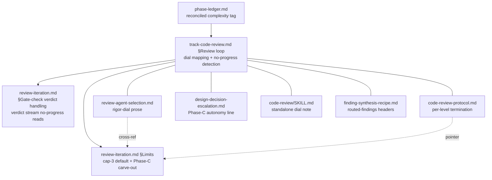

# Phase-C review iteration keyed to the complexity tag — Architecture Decision Record

## Summary

Phase-C track code review no longer caps every track at three iterations. Its
termination is now keyed to the per-track complexity tag — the `low` / `medium` /
`high` value reconciled to `max(step tags)` and read from the phase ledger at the
A→C boundary. Three rules replace the flat cap: blockers loop uncapped until clear
at every level; the should-fix loop's depth scales with the tag (`low` none,
`medium` up to three, `high` uncapped); and no-progress detection — escalate on
the first iteration that clears nothing and surfaces no new fixable finding —
replaces the fixed cap-3 escalation as the safety valve. The change is prose-only
under `.claude/workflow/**` and `.claude/skills/**`, and is scoped to Phase C
alone; Phase-2 plan reviews, Phase-A track reviews, and Phase-B step reviews keep
the canonical cap-3-then-escalate behavior of `review-iteration.md` §Limits.

## Goals

- Let a genuinely converging high-complexity track iterate to full convergence
  instead of being cut off at three iterations with blockers or should-fix still
  open.
- Keep blockers looping until clear at every complexity level, so the dial never
  shortens a must-fix gate.
- Preserve a termination guarantee once the fixed cap is gone, so an unfixable
  loop escalates to the user instead of looping forever.
- Change no behavior outside Phase C, and ship no derived workflow file that
  contradicts itself once the cap is removed.

All goals were met as stated; none were descoped.

## Constraints

- The new termination rule may only key on the per-track complexity tag, the one
  tag reconciled and available at the A→C boundary. The per-step risk tag is
  step-scoped and has no single track-level value, so it cannot drive a track
  loop.
- No new measurement machinery. No-progress detection had to read a signal the
  loop already emits — it reads the gate-check verdict stream
  (`VERIFIED` / `REJECTED` / `MOOT` / `STILL OPEN` / `REGRESSION`), so it adds no
  new instrumentation.
- The cap-3-then-escalate default in `review-iteration.md` §Limits must stay live
  for the non-Phase-C loops that still depend on it.
- Every cap-3-keyed assertion that describes the Phase-C track-level loop had to
  be restated across the whole set of files a Phase-C reader loads, or a derived
  file would ship self-contradictory text.

## Architecture Notes

### Component Map

The Phase-C loop reads the reconciled tag, runs the tag-keyed termination rule in
`track-code-review.md` §Review loop, and defers the cap-3 default to
`review-iteration.md` §Limits (which now carries the Phase-C carve-out). Five more
Phase-C-loading files carry cap-3 prose that had to stay consistent.

- `track-code-review.md` §Review loop carries the substantive change: the new
  per-level dial mapping, the no-progress detection definition, the `medium`
  single-shared-counter rule, the context-pause composition note, and every
  restated cap-3-keyed track-level mechanic.
- `review-iteration.md` §Limits keeps cap-3-then-escalate as the default for
  Phases 2 / 3A / 3B and gains the Phase-C carve-out sentence; its §Gate-check
  verdict handling is the verdict stream no-progress detection reads. Two in-file
  residuals were also restated: the §Iteration flow diagram and the §Limits TOC
  summary.
- `review-agent-selection.md`, `code-review/SKILL.md`, `code-review-protocol.md`,
  `design-decision-escalation.md`, and `finding-synthesis-recipe.md` each carry a
  Phase-C-loading dependency on the cap and were kept in sync.

### Decision Records

**D1: The tag axis is the per-track complexity tag, never the per-step risk tag.**
The new iteration policy keys on the per-track complexity tag (reconciled to
`max(step tags)`, read track-scoped from the phase ledger at the A→C boundary).
The per-step risk tag was rejected: it is step-scoped and has no single
track-level value to read, so keying a track loop on it would have no well-defined
input at the A→C boundary. The per-track tag is the only tag that already drives
review iteration (it is the Phase-C rigor dial), so this is a refinement of an
existing dial, not a new rule. Implemented as planned.

**D2: Scope is the Phase-C track code review loop only.** Only the Phase-C
track-level loop's termination changes. Phase-2 plan reviews, Phase-A track
reviews, and Phase-B step reviews keep cap-3-then-escalate. Alternatives — all
review loops (rejected: would require inventing a tag source for Phase 2, where no
track tag yet exists, and carries a larger blast radius) and Phase-C + Phase-A
(rejected: the user scoped the iteration-depth change to Phase C alone). The tag
is only reconciled at the A→C boundary, so Phase C is where the dial already
lives. Implemented as planned; the scope stayed Phase-C-only throughout, including
across the restate-set expansion described in Key Discoveries.

- **D2.1: Wire the §Limits carve-out; do not merely assert the override at the
  override site.** `review-iteration.md` §Limits is the canonical shared home for
  the cap-3 protocol and its table-of-contents filter loads it in Phase C, so a
  Phase-C reader landing there would read "Max 3, then escalate" — contradicting
  the new policy. §Limits keeps cap-3 as the default for Phases 2 / 3A / 3B and
  gains one carve-out sentence pointing at `track-code-review.md` §Review loop.
  The override is announced at the canonical home, not only at the override site.

**D3: The per-level iteration policy — the new dial.** Blockers loop uncapped to
clear at every level; `low` stops there (should-fix never drives iteration),
`medium` adds a should-fix loop bounded at three iterations, and `high` makes the
should-fix loop uncapped too. Alternatives — keeping the flat cap-3 for all levels
(rejected: does not let `high` converge fully) and the prior "iterate to
convergence within the cap-3 ceiling" for `high` (rejected: capping at three
contradicts the intent of no bound on iteration count). The policy decouples
blocker-looping (always loop until clear) from should-fix-looping (depth scales
with complexity). Implemented as planned.

- **D3.1: The `medium` single shared counter.** The iteration counter is shared
  across all dimensions (one counter, not per-dimension). `medium` needs the
  blocker loop uncapped while the should-fix loop caps at three on that same
  counter, so "should-fix drives a new iteration" is gated on `iteration ≤ 3`
  while "a surviving blocker drives a new iteration" is not — the blocker loop
  continues past three, bounded by no-progress detection. A should-fix that
  re-surfaces in a post-3 blocker-driven iteration is fixed opportunistically if
  the implementer is already touching that code, otherwise surfaced at track
  completion. No second counter was introduced.

**D4: No-progress detection replaces the cap-3 escalation safety valve.** Because
the blocker loops (all levels) and `high`'s should-fix loop are now uncapped,
termination uses no-progress detection: escalate to the user when an iteration
makes no progress, rather than capping at a fixed count. Alternatives — a hard
ceiling that still escalates (rejected: reintroduces the arbitrary cap) and a
truly unbounded loop (rejected: a stuck blocker would loop forever). No-progress
detection bounds the loop on the real convergence signal — whether findings are
shrinking — so a converging high-risk track is never cut off early while a stuck
loop escalates the moment it clears nothing. Implemented as planned.

- **D4.1: Operational definition on the gate-check verdict stream.** No-progress
  detection reads the per-finding verdict stream the gate-check already emits.
  *Identity* — a finding is "the same" by its reviewer-assigned `id`, not its text
  or location. *Threshold* — an iteration makes no progress when its gate-check
  returns `STILL OPEN` for every carried finding, clears none, and surfaces no new
  fixable finding; a "new fixable finding" is a new in-scope `blocker` or
  `should-fix` (a new `suggestion` does not count). One net clear or one new
  fixable finding is progress; a `REGRESSION` is always progress-negative and
  escalates immediately. *Which loops it gates* — each uncapped loop: the blocker
  loop at all levels and `high`'s should-fix loop; the `medium` should-fix loop is
  already capped, so no-progress detection governs `medium` only once a surviving
  blocker carries iterations past three.

- **D4.2: Composition with the existing per-iteration context pause.** The Phase-C
  loop already halts at `warning` (≥40%) / `critical` (≥50%) context and writes a
  `mid-phase-handoff.md`. The two termination mechanisms compose on orthogonal
  axes: the context pause bounds per-session burn (pauses and resumes next
  session), while no-progress detection bounds convergence (escalates when findings
  stop shrinking, including across a resume). A slow-but-real-progress `high` track
  hits the context pause and continues next session without ever escalating; a
  stuck track escalates on the first no-progress iteration regardless of context
  level. Neither substitutes for the other.

### Invariants & Contracts

- Blockers always loop until clear at every complexity level — the dial never
  shortens a must-fix gate.
- No cap-3-keyed site that describes the Phase-C track-level loop still asserts a
  fixed `/3` cap as live behavior. Step-level (Phase B), Phase-2, and Phase-3A
  cap-3 assertions stay live and unchanged.
- `review-iteration.md` §Limits carries the Phase-C carve-out and keeps cap-3 as
  the stated default for Phases 2 / 3A / 3B.
- The dial changes only iteration depth / termination, never which reviewers run
  — the domain-selected reviewer set is unchanged.

### Non-Goals

- Changing the reviewer selection at any complexity level (complexity moves the
  rigor dial, never the reviewer set).
- Changing any review loop outside Phase C.
- Adding new measurement machinery for no-progress detection.

## Key Discoveries

- **A single-file restate grep structurally misses cap-3 prose scattered across
  the whole Phase-C-loading file set.** The planned restate set was one file plus
  a handful of known sync sites. The as-built rule is a tree-wide restate
  authority over every file a Phase-C reader loads, re-triaged each run. The gap
  surfaced progressively: the Phase-A risk and adversarial reviews added two files
  carrying standalone cap-3 assertions (`code-review-protocol.md`'s synthesis
  preamble and `design-decision-escalation.md`'s Phase-C autonomy line) beyond the
  originally-enumerated set; the Phase-B step-level review added a seventh file
  (`finding-synthesis-recipe.md`, whose routed-findings headers carried an
  `iteration {N}/3` denominator readable as a Phase-C cap) plus two in-file
  residuals in `review-iteration.md` (the §Iteration flow diagram, which still
  showed `Iteration 3 → escalate`, and the §Limits table-of-contents summary,
  which did not advertise the new exception). The durable lesson for future
  workflow-prose changes that re-key a shared protocol: scope the restate grep to
  the whole set of files that load the affected section, not to the one file that
  owns the change.
- **The "flat assertion vs. pointer" distinction decides whether a file needs a
  restate.** `code-review-protocol.md` §Iteration protocol states "max 3
  iterations" only as a pointer to `review-iteration.md` §Limits, so it inherited
  the carve-out and needed no separate edit; the same file's synthesis preamble
  asserted the cap flatly and did need a restate. When a shared protocol changes,
  a file that defers by pointer is safe; a file that restates the protocol inline
  is not.
- **The no-progress threshold needs "new fixable finding" pinned to a severity.**
  Left undefined, the term is ambiguous about whether a new `suggestion` counts as
  progress. It was pinned to a new in-scope `blocker` or `should-fix`; a new
  `suggestion` does not count, consistent with suggestions never driving iteration
  at any level.

## Adversarial gate verdicts

The pre-code adversarial gate ran on the research log at the Phase 0→1 boundary
and passed after three iterations. The first pass returned NEEDS REVISION with 2
blockers and 4 should-fix (no-progress detection undefined; the cap-3-keyed blast
radius undercounted; plus should-fix findings on the `medium` shared-counter
interaction, the unwired §Limits contradiction, the `low` delta framing, and the
context-pause composition). The second pass closed all six and raised one further
should-fix. The third pass (2026-06-30T13:18Z) verified that finding closed with
the rest still closed — gate clear, 0 blockers and 0 should-fix. One non-gating
suggestion (a spelled-out "three iteration" count the cited grep pattern missed)
was folded in anyway.

## Token usage telemetry

Snapshot from this worktree's sessions over its lifetime (N=7 sessions across 59 transcripts).

### Tool mix — share of total session context

| Component             | Share |
|-----------------------|------:|
| `Read` tool results   | 68.4% |
| `Bash` tool results   | 7.7% |
| `Grep` tool results   | 0.3% |
| `Edit` tool results   | 0.3% |
| Other tool results    | 3.7% |
| Prompts and output    | 19.6% |

### Top files by share of `Read` token consumption

| File                                            | Share of Read |
|-------------------------------------------------|--------------:|
| docs/adr/track-reconciliation-rules/_workflow/plan/track-1.md | 16.9% |
| docs/adr/track-reconciliation-rules/_workflow/design.md | 10.8% |
| .claude/workflow/track-code-review.md           | 7.0% |
| .claude/output-styles/house-style.md            | 6.7% |
| <outside-worktree>                              | 5.1% |
| .claude/workflow/prompts/adversarial-review.md  | 4.3% |
| docs/adr/track-reconciliation-rules/design-final.md | 3.5% |
| .claude/skills/edit-design/SKILL.md             | 3.1% |
| docs/adr/track-reconciliation-rules/_workflow/research-log.md | 3.1% |
| .claude/workflow/self-improvement-reflection.md | 3.0% |

Generated by `.claude/scripts/measure-read-share.py` against
`~/.claude/projects/-home-andrii0lomakin-Projects-ytdb-track-reconciliation-rules/`.
