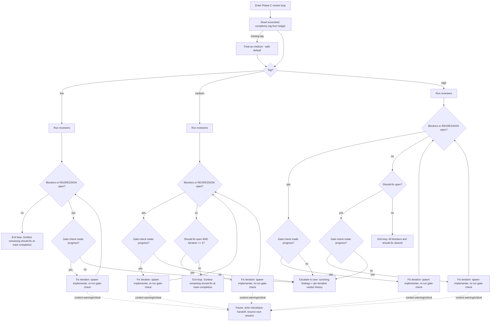

# Phase-C review iteration keyed to the complexity tag — Design

## Overview

The Phase-C track code review loop caps every track at three iterations and
escalates if blockers survive the cap. This change removes that fixed cap where
the complexity tag calls for it — the blocker loop at every level, and the
should-fix loop on `high` — and replaces it with no-progress detection: the loop
iterates as long as it keeps clearing findings, and escalates the moment an
iteration clears nothing. The per-track complexity tag — the `low` / `medium` /
`high` value already reconciled to `max(step tags)` and read from the phase
ledger at the A→C boundary — sets how the loop terminates, the same dial that
already sets how hard the loop iterates.

The dial moves from "how many iterations" to "what terminates the loop." Before
this change the tag chose a depth within a flat cap-3 ceiling: `low` ran once,
`medium` ran the normal cap-3, `high` ran all three iterations. After it the tag
chooses a termination rule. A `low` track loops on blockers until none remain,
uncapped. A `medium` track does the same and also iterates up to three times to
clear should-fix findings. A `high` track loops until no blockers and no
should-fix remain, uncapped on both. Blocker-looping is decoupled from
should-fix-looping: blockers always loop until clear, and should-fix-looping
depth scales with the tag.

Removing the cap removes the safety valve that stopped an unfixable blocker from
looping forever, so the change supplies a replacement: no-progress detection. An
iteration that returns `STILL OPEN` for every carried finding, clears none, and
surfaces no new fixable finding has made no progress; the orchestrator escalates
to the user instead of looping again. The signal is the gate-check verdict stream
the loop already emits, so no-progress detection adds no new measurement
machinery — it reads a stream that already exists.

This is a workflow-machinery design for a reader who maintains
`.claude/workflow/**` and knows the Phase A / B / C review structure, the
per-track complexity tag (its reconciliation and ledger home), and the cap-3
review-iteration protocol in `review-iteration.md`. The change touches workflow
prose only — no scripts, hooks, settings, or Java. The rest covers the load-
bearing concepts, a flowchart of the new loop, the no-progress definition, the
per-level policy as a delta from the prior behavior, and the scope carve-outs the
change restates at the cap-3-keyed sites.

## Core concepts

**TL;DR.** Four ideas the rest of the document uses without re-defining: the
*per-track complexity tag* (the rigor dial this change re-keys), the
*cap-3-then-escalate protocol* (the shared rule Phase C overrides), the
*gate-check verdict stream* (the per-finding verdicts the loop already emits),
and *no-progress detection* (the termination rule that replaces the fixed cap).

**Per-track complexity tag.** The `low` / `medium` / `high` value computed per
track and reconciled to `max(step tags)` at the Phase A→C boundary, read
track-scoped from the phase ledger. It is the only tag that drives review
iteration — the Phase-C rigor dial. It is distinct from the per-*step* risk tag,
which gates Phase-B step review and has no single track-level value to read. The
new policy keys on this per-track tag, never on the per-step risk tag.

**The cap-3-then-escalate protocol.** The canonical shared review-iteration rule
in `review-iteration.md` §Limits: "Max 3 iterations per review type; if blockers
persist after 3 iterations, escalate." Phase-2 plan reviews, Phase-A track
reviews, and Phase-B step reviews all use it. The Phase-C track code review used
it too before this change; this change overrides it for Phase C alone.

**Gate-check verdict stream.** Each review iteration after the first re-runs the
affected reviewers as a gate-check, which emits one verdict per carried finding:
`VERIFIED`, `REJECTED`, `MOOT`, `STILL OPEN`, or `REGRESSION`
(`review-iteration.md` §Gate-check verdict handling). `VERIFIED` / `REJECTED` /
`MOOT` clear a finding; `STILL OPEN` carries it forward; `REGRESSION` forces a
`FAIL`. No-progress detection reads this stream — it needs no new measurement.

**No-progress detection.** The termination rule that replaces the fixed cap on
the uncapped loops. An iteration makes no progress when its gate-check clears no
carried finding and surfaces no new fixable finding; the orchestrator then
escalates instead of looping again. Defined in full under §No-progress detection.

### References

- D1: tag axis is the per-track complexity tag
- D2: scope is Phase-C track code review only
- D3: per-level iteration policy
- D4: no-progress detection replaces the cap-3 safety valve

## The new Phase-C review loop

**TL;DR.** The orchestrator reads the reconciled complexity tag and runs a
termination rule the tag selects. The blocker gate is identical at every level —
blockers loop until clear; the levels differ only in whether and how long
should-fix findings keep the loop running. The flowchart below traces one entry,
with the per-iteration context pause drawn on a separate axis.

Read the flowchart top-down: the diamond at `Tag?` splits into the three
per-level columns, and the dashed edges at the bottom belong to the independent
context-pause axis.



The dashed edges are the existing per-iteration context-consumption pause, drawn
to show it sits on a different axis from no-progress detection: any fix iteration
can hit it, and it suspends rather than terminates the loop. §No-progress
detection covers why the two never substitute for each other.

The `low` track has no should-fix branch at all — its only exit on a clean
gate-check is the blocker check returning "no." It therefore relies entirely on
no-progress detection for its escalation path; it has no should-fix cap as a
backstop.

### Edge cases

- **Missing or torn tag.** When the ledger carries no reconciled tag (a pre-scheme
  branch or a torn append), the loop treats the track as `medium` and runs the
  standard cap-3, the same safe default the dial used before.
- **Suggestions never drive iteration.** A leftover suggestion never causes a
  `FAIL` or another round at any level. Suggestions are applied opportunistically,
  routed to plan corrections if out-of-track, or dropped if rejected. The new dial
  stays silent on suggestions; nothing changes for them.
- **`REGRESSION` short-circuits.** A `REGRESSION` verdict is progress-negative and
  escalates immediately at every level — it already forces a `FAIL` under existing
  handling, so it never waits for the no-progress check.

### References

- D1: tag axis is the per-track complexity tag
- D2: scope is Phase-C track code review only
- D3: per-level iteration policy
- D4: no-progress detection replaces the cap-3 safety valve

## No-progress detection

**TL;DR.** An iteration makes no progress when its gate-check returns `STILL
OPEN` for every carried finding, clears none, and surfaces no new fixable
finding; the orchestrator then escalates instead of looping again. Findings are
compared across iterations by their reviewer-assigned `id`. The rule gates every
uncapped loop and is read off the verdict stream the loop already emits, so it
adds no new measurement machinery.

No-progress detection bounds the uncapped loops by the real convergence signal —
whether findings are shrinking — not by a fixed iteration count. A genuinely
converging high-risk track is never cut off early; a stuck loop escalates on the
first iteration that clears nothing. The definition turns on three parts.

**Identity.** A finding is "the same" by its reviewer-assigned `id` — the
cumulative finding ID the gate-check already verdicts by. The unit of comparison
across iterations is the finding `id`, not its text or location.

**Threshold.** An iteration makes no progress when its gate-check returns `STILL
OPEN` for every finding carried into it, clears none (no `VERIFIED` / `MOOT` /
`REJECTED`), and surfaces no new fixable finding. A "new fixable finding" is a
new in-scope `blocker` or `should-fix` finding; a new `suggestion` does not
count, because suggestions never drive iteration. One net clear, or one new
fixable finding, is progress and the loop continues. A `REGRESSION` is always
progress-negative and escalates immediately, because it already forces a `FAIL`
under existing verdict handling.

**Which loops it gates.** The rule gates each uncapped loop: the blocker loop at
all three levels and `high`'s should-fix loop. The `medium` should-fix loop is
already bounded by its cap-3, so no-progress detection is moot there. It applies
to `medium` only once a surviving blocker carries the loop past three iterations,
at which point the blocker loop's no-progress gate takes over.

On a no-progress iteration the orchestrator escalates to the user rather than
looping again. It surfaces the surviving findings and the per-iteration verdict
history — the same escalation shape the cap-3 exhaustion produced, fired on the
no-progress signal instead of a fixed count.

### Composition with the context-consumption pause

The Phase-C loop already carries a mandatory per-iteration context-consumption
check that halts at `warning` (≥40%) / `critical` (≥50%) and writes a
`mid-phase-handoff.md` so the next session resumes the loop. No-progress detection
and the context pause compose on independent axes, and neither substitutes for the
other.

The context pause bounds per-session burn. It pauses the loop and resumes it next
session; the cross-session resume re-reads loop state. No-progress detection
bounds convergence. It escalates when findings stop shrinking across iterations,
including across a resume.

The two combine cleanly because they measure different things. A slow-but-real-
progress `high` track makes real progress each iteration, so it never triggers
no-progress escalation; it hits the context pause, hands off, and continues next
session. A stuck track escalates on the first no-progress iteration regardless of
the context level. The context pause never substitutes for no-progress escalation,
and no-progress escalation never preempts a context pause.

### Edge cases

- **First iteration.** Iteration 1 is the full review, not a gate-check, so it has
  no carried findings to verdict and cannot register as no-progress. The earliest
  an iteration can be no-progress is iteration 2.
- **Resume across the pause.** A track that paused on context and resumes still
  carries its open-findings state, so no-progress detection spans the resume — a
  resumed iteration that clears nothing escalates exactly as an in-session one
  would.

### References

- D4: no-progress detection replaces the cap-3 safety valve
- D2: scope is Phase-C track code review only

## Per-level iteration policy

**TL;DR.** Stated as a delta from the prior behavior: blockers loop uncapped to
clear at every level; `low` stops there, `medium` adds a should-fix loop bounded
at three iterations, and `high` makes the should-fix loop uncapped too. The cap-3
ceiling is replaced by no-progress detection on the uncapped loops, and `medium`
keeps the single shared iteration counter, gating only should-fix continuation.

The cap is removed only on the paths the user scoped uncapped, keyed per level:

| Level | Before | After this change |
|---|---|---|
| `low` | single shallow pass; blocker/REGRESSION forces continuation within cap-3 | blocker loop runs uncapped to clear; should-fix never drives iteration; remaining should-fix surface at track completion |
| `medium` | normal cap-3 iteration | uncapped blocker loop, plus up to 3 iterations to clear should-fix; after 3, remaining should-fix surface at track completion |
| `high` | iterate to convergence within the cap-3 ceiling (run all 3) | loop until no blockers and no should-fix remain; no fixed cap on either |

The blocker loop clears independent of should-fix depth at every level; only the
should-fix termination rule shifts across the three.

### Why `low` removes the cap rather than introducing a loop

`low` already loops on blockers — the single-pass shortcut shortens optional
iteration depth, never the must-fix gates, so a blocker or `REGRESSION` already
forces a `low` track to continue past the single pass. This change removes the
cap-3 ceiling on that existing blocker loop; it does not introduce a loop where
there was none. The delta for `low` is "the blocker loop is now uncapped,"
nothing more on the should-fix side.

### The `medium` shared counter

The iteration counter is shared across all dimensions — one counter, not
independent per-dimension counters. `medium` needs the blocker loop uncapped while
the should-fix loop caps at three on that one counter, so this change keeps the
single shared counter and gates only the should-fix continuation.

"Should-fix drives a new iteration" is gated on `iteration ≤ 3`. "A surviving
blocker drives a new iteration" is not gated — it continues past three, bounded by
no-progress detection. A should-fix finding that re-surfaces in a post-3,
blocker-driven iteration is fixed opportunistically when the implementer is
already touching that code, otherwise surfaced at track completion. No second
counter is introduced.

### Edge cases

- **`high` with only should-fix open.** Once blockers clear, a `high` track keeps
  looping on should-fix alone, gated by no-progress detection. A should-fix loop
  that clears nothing escalates the same way a stuck blocker loop does.
- **`medium` past iteration 3 with a blocker.** The blocker continues to drive
  iterations past three; the should-fix loop stops at three. Any should-fix that
  re-surfaces in those post-3 iterations is fixed opportunistically, not as its own
  driver.

### References

- D3: per-level iteration policy
- D3.1: the `medium` shared-counter interaction
- D4: no-progress detection replaces the cap-3 safety valve

## Scope and the cap-3-keyed restate sites

**TL;DR.** The change is scoped to the Phase-C track code review loop only; the
Phase-2 / 3A / 3B loops keep cap-3-then-escalate. `review-iteration.md` §Limits
keeps cap-3 as its default and gains one carve-out sentence announcing the
Phase-C override at the canonical home. Every cap-3-keyed mechanic that describes
the Phase-C track-level loop must be restated so no derived file ships
self-contradictory text. The restate authority is a tree-wide grep over the
whole Phase-C-loading file set, not one file, because a single-file grep
structurally misses cap-3 prose in sibling files a Phase-C reader also loads.

The change is scoped to the Phase-C track code review loop only. Phase-2 plan
reviews, Phase-A track reviews, and Phase-B step reviews keep the cap-3-then-
escalate behavior, because the per-track complexity tag is only reconciled and
available at the A→C boundary — Phase-2 plan reviews run before any track tag
exists, and the user scoped the iteration-depth change to Phase C alone.

### Wiring the §Limits carve-out

`review-iteration.md` §Limits is the canonical shared home for the cap-3 protocol,
and its table-of-contents (TOC) filter loads it in Phase C. A Phase-C reader who lands on §Limits (for
example via the `review-agent-selection.md` rigor-dial cross-reference) would
otherwise read "Max 3, then escalate," which contradicts the new uncapped Phase-C
policy. So §Limits is in scope: it keeps cap-3-then-escalate as the default for
Phases 2 / 3A / 3B and gains one carve-out sentence — Phase-C track code review
overrides this per `track-code-review.md` §Review loop, with iteration depth keyed
to the per-track complexity tag, no fixed cap, terminated by no-progress
detection. The override is announced at the canonical home, not silently asserted
only at the override site. Default behavior for the non-Phase-C loops is unchanged.

### The restate set is the whole Phase-C-loading file set

Uncapping the `low` / `medium` blocker loop and the `high` should-fix loop
invalidates every cap-3-keyed mechanic that describes the Phase-C track-level loop.
Each such mechanic must be restated, or the file ships self-contradictory text.
The authority is a tree-wide grep re-run at implementation time, not a frozen line
list, over the whole Phase-C-loading file set:

```bash
grep -rnE '3 iterations|N/3|/3|of 3|three iteration|Max 3|up to 3' \
  .claude/workflow/track-code-review.md \
  .claude/workflow/code-review-protocol.md \
  .claude/workflow/design-decision-escalation.md \
  .claude/workflow/review-iteration.md \
  .claude/workflow/review-agent-selection.md \
  .claude/skills/code-review/SKILL.md \
  .claude/workflow/finding-synthesis-recipe.md
```

Triage each hit: restate any assertion describing the **Phase-C track-level**
loop; leave step-level (Phase B), Phase-2, and Phase-3A assertions on cap-3
(out of scope), and reword illustrative cost-model counts only where they cite the
cap as a hard bound. The `three iteration` alternative in the pattern catches the
spelled-out count the digit-only patterns miss — keep it.

`track-code-review.md` carries the substantive change and the bulk of the
restates:

- **Dial site** (§Review loop): gets the new per-level mapping from §Per-level
  iteration policy.
- **Progress format**: `iteration N complete (N/3 iterations)` drops the `/3`
  denominator; record `iteration N complete` with no fixed denominator.
- **Resume**: "Max 3 iterations total across sessions — on resume, read the
  iteration count to determine how many remain" no longer applies, because with
  no cap there is no "remaining" count. Resume reads the running iteration count
  plus the no-progress / open-findings state, not a remaining-cap count.
- **Commit guard and failure/budget mentions**: "blockers persist after 3
  iterations" and "exited with blockers open after 3 iterations" become the
  no-progress exit — "escalates on no-progress with blockers open."
- **Cost models**: counts that used the cap as a hard cost bound (`× 3 iterations
  per track`) reword to a representative or typical count.

### The other Phase-C-loading files

Six more files carry a Phase-C-loading dependency on the cap and must stay in
sync:

- `review-agent-selection.md` §"Complexity sets the Phase-C rigor dial, never the
  set": the `low` / `medium` / `high` dial-mapping prose gets the new policy; its
  cross-reference to §Limits stays.
- `code-review/SKILL.md`: the standalone-skill note describing the dial. The
  `/code-review` skill takes no complexity input, but its prose must stay in sync
  with the new mapping.
- `code-review-protocol.md`: its synthesis preamble asserts `Max 3 iterations per
  level` as a flat cap covering the track-level loop; restate it so termination is
  per-level (step-level / Phase-2 / 3A keep §Limits cap-3, Phase-C is keyed to the
  tag). Its §Iteration protocol pointer already defers to §Limits, so it inherits
  the carve-out.
- `design-decision-escalation.md` §Per-phase autonomy: the Phase-C line
  `track-level code review (up to 3 iterations; …)` is restated to the new policy;
  the Phase-B step-level line just above it (`up to 3 per step`) stays cap-3.
- `review-iteration.md` also carries two in-file residuals beyond the §Limits
  carve-out: its §Iteration flow diagram showed `Iteration 3 → escalate`, and its
  §Limits TOC summary did not advertise the exception. A Phase-C reader is
  TOC-gated onto both, so each gains a carve-out note routing to the override.
- `finding-synthesis-recipe.md`: a shared finding-routing recipe the orchestrator
  loads in both the still-capped step-level loop and the uncapped Phase-C loop. Its
  routed-findings headers carried an `iteration {N}/3` denominator that reads as a
  cap-3 bound for the Phase-C loop; the `/3` is dropped. One borderline hit
  (`(2 of 3 used)`) is step-level pacing shared with the still-capped loop and
  stays.

### Edge cases

- **The grep can drift.** Any line numbers are valid only as of a given branch
  state; an author on a later branch state re-runs the grep rather than trusting a
  listed line, because intervening edits move them.
- **A single-file grep is not enough.** Scoping the restate grep to one file
  structurally misses cap-3 prose in sibling files a Phase-C reader also loads.
  The restate authority is the whole Phase-C-loading file set, re-triaged each run.

### References

- D2: scope is Phase-C track code review only
- D2.1: wire the §Limits carve-out, do not merely assert the override
