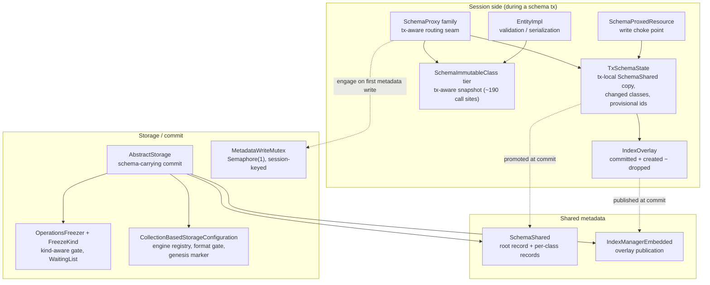

# Transactional Schema Operations — Architecture Decision Record

## Summary

YTDB-382. Before this change, storage led a schema change: creating or dropping
a class or an index mutated storage structure first (collections, index
engines), then reflected the result into a metadata record; each operation
self-committed in its own micro-transaction outside the user's transaction; the
whole schema lived in one record rewritten on every change; and a schema change
could not roll back with the transaction that made it.

This branch inverts the dependency. During a transaction, a schema or index
change mutates only metadata records — ordinary transactional records, so
rollback is free. At commit, storage diffs the committed metadata against the
current structure and creates or drops the matching collections and engines
inside the commit's own atomic operation, so the structural change is atomic
with the record writes and recoverable from the WAL. A per-class record format
replaces the monolithic schema record, killing the write amplification YTDB-382
exists for. Around the core inversion, the branch ships: a transaction-scoped
metadata-write mutex; a tx-local index-definition overlay; a commit-time index
build for empty sources; a tx-aware immutable schema snapshot; file-base-keyed
index-engine files that make renames metadata-only; a freeze-kind-aware gate
that keeps a schema commit from turning an operator freeze into a read outage;
a two-phase genesis bootstrap guarded by a durable completion marker; and an
operator-driven, fail-closed export/import migration for the format changes.

The peer artifact `design-final.md` develops the mechanisms; this document is
the decision record. Its section footers cite the decision codes D1–D23, all of
which are restated in full under Decision Records below.

At close the branch was green across 17,539 core unit tests, 2,219 sequential
tests, 18 vmlens concurrency tests, and 1,300 tests-module tests, plus the full
513-test integration profile; the changed-line coverage gate closed at 88.9%
line / 81.0% branch.

## Goals

- **Make schema and index operations fully transactional** — atomic, isolated,
  and freely rollback-able. Achieved: every schema and index mutation entry
  point rides the user transaction (the entry points that threw on an open
  transaction and the ones that self-committed in nested transactions were both
  reworked), isolation is record-local and identical to data records, and a
  rolled-back or crashed transaction leaves storage files byte-for-byte
  unchanged.
- **Remove the per-property write amplification** that YTDB-382 exists to kill.
  Achieved structurally by the per-class record format (D14): a one-class
  change writes one class record, and the root record is written exactly when
  its own non-link payload changes. This structural fix is the measured
  performance outcome of the branch; no further performance mechanism was
  needed.
- **Goal widened during execution:** the schema *contract* — validation,
  property types, constraint rules — became transactional too, not only the
  schema *structure*. The immutable snapshot is now tx-aware (D21), so entity
  validation enforces a same-transaction constraint instead of silently
  skipping it. This was added after the commit machinery was complete.
- **Bounded on purpose:** the v1 in-commit index build covers only an empty
  source collection; a populated source is rejected loudly, naming the deferred
  off-lock/streamed build (YTDB-1064). The index's own stored name lags after a
  class rename; the inert index-name rename is deferred (YTDB-1066).
- **Enabling outcomes:** genesis was restructured into a two-phase bootstrap
  that doubles as the end-to-end smoke test of the commit machinery (D18, D22,
  D23), and the export/import path was hardened fail-closed on both sides so it
  can carry this format migration and the next one (D20).

## Constraints

Carried from planning, all still binding:

- **Schema isolation must equal data-record isolation.** A transaction sees
  only its own uncommitted schema; other sessions see committed state until
  commit (D4).
- **No optimistic schema concurrency** (assignee constraint). A second schema
  transaction blocks on a lock; it is never aborted or rolled back on
  contention (D5).
- **The storage state lock (`ScalableRWLock`) is non-reentrant.** A commit
  holding the write lock must reach structure through lock-free inner
  primitives, never the public structural methods (D3, D19).
- **The low schema-change rate is the load-bearing premise.** It is what makes
  pessimistic serialization (D5, D7), the whole-commit exclusive lock (D19),
  and the in-commit index build (D12) acceptable. If that premise ever breaks,
  these decisions need revisiting together.
- **Existing databases migrate by operator-driven export/import**, never an
  in-place on-open migrator. New binaries reject an old-format database on a
  version check and redirect to the documented operator procedure (D14, D16,
  D20).
- **The whole-commit write lock must not become a read outage.** The remaining
  lock-based hot read sites converted to snapshot-first reads, and a schema
  commit throws loudly against an operator freeze rather than parking inside
  the lock window (D19, D7).

Discovered or tightened during execution:

- **Index-engine registry slot ids are reused by design** (failed-commit
  cleanup restores them), so nothing durable may be keyed by a slot id. This
  falsified the planned engine-file naming scheme and forced a new persisted
  identity (D16).
- **The commit-window re-entry surface is the whole session record-read path**,
  not just the structural primitives: schema serialization, promotion, and
  security lookups all re-enter the read lock unless given lock-free variants
  (D3).
- **The file-base-id allocator must work on a virgin storage configuration
  before genesis runs**, because the genesis schema transaction itself creates
  an index (D16, D18).
- **The v1 index-build boundary settled to empty-source-only** — the planning
  alternative of "a documented size bound" was dropped in favor of a loud
  rejection (D12).
- **The schema serializer's synchronization contract is the caller's held
  schema write lock and nothing else**, asserted at entry; any future change
  to the schema lock model must preserve or consciously revise this (D14).

## Architecture Notes

### Component Map

- **Session side.** `SchemaProxy`, `SchemaClassProxy`, and `SchemaPropertyProxy`
  form the tx-aware routing seam (three-tier resolution: snapshot, captured
  delegate, name-binding into the tx-local copy during the session's own schema
  transaction). `SchemaProxedResource` is the tx-local write choke point;
  resolving a write target there marks the owning class changed — one of the
  three marking channels behind the commit-time delta (D6).
  `TxSchemaState` holds the tx-local `SchemaShared` copy, the changed-class
  set, the provisional-to-real id carrier, and the `IndexOverlay`.
  `SchemaImmutableClass` instances (reached through the metadata facade) form
  the refcount-pinned snapshot tier roughly 190 call sites consume; `EntityImpl`
  validation and serialization read it.
- **Shared metadata.** `SchemaShared` carries the per-class records under a
  root link set, the copy-for-transaction seeding, promotion, the counter-only
  collection naming, and the write-lock-asserted serializer. `SchemaClassImpl`
  / `SchemaClassEmbedded` bind each class to its own record and produce
  provisional ids at the two producer sites. `IndexManagerEmbedded` is the
  per-session index routing seam and publishes the overlay at commit as
  replacement objects under its write lock; `ClassIndexManager` maintains
  automatic indexes from the snapshot's index sets; `IndexDefinition` carries
  the class-name re-key on rename.
- **Storage / commit.** `AbstractStorage` owns the schema-carrying commit:
  entry signal, four-lock order, freezer probe and gate, reconciliation
  (drops then creates), provisional-id resolution, the lock-free commit-window
  read substrate, the commit-time index build, promotion with a single snapshot
  refresh, and the undo arms of the failure path — plus the lazy-consult WAL
  replay fix. `CollectionBasedStorageConfiguration` persists the index-engine
  registry (each engine's `IndexEngineData` with its file-base id and the
  allocation floor), enforces the storage-format version gate, and stores the
  genesis completion marker. `BTreeSingleValueIndexEngine`,
  `BTreeMultiValueIndexEngine`, and `IndexHistogramManager` derive their file
  names from the persisted file-base id. `AtomicOperationsManager` provides the
  single atomic operation per commit; `ChangeableRecordId` is the temp-RID
  resolution precedent the provisional collection ids extend.
- **Concurrency lifecycle.** `MetadataWriteMutex` is the one-permit semaphore
  with the session-keyed ownership record. `OperationsFreezer`, `FreezeKind`,
  and `WaitingList` carry the kind taxonomy, the kind-aware gate, and the
  serialized operator cut-and-unpark. `DatabaseSessionEmbedded`,
  `DatabaseSessionEmbeddedPooled`, `DatabasePoolImpl`, and
  `FrontendTransactionImpl` implement the teardown-intent handshake and the
  pool-close skip protocol. `DiskStorage` hosts the backup-related freeze
  registration sites.
- **Genesis / migration.** `SharedContext` and `SecurityShared` implement the
  two-phase genesis and the completion-marker check
  (`GenesisIncompleteException` on absence). `DatabaseExport` (format
  version 15) and `DatabaseImport` implement the hardened dump write and read;
  `GlobalConfiguration` carries the export spill-threshold knob.

### Decision Records

Each record states the decision as built, the rationale, and — where an
alternative was actually considered — what was rejected. Status marks whether
the record survived execution as planned, was refined, was corrected, or was
added. Accepted risks and trade-offs are folded into the owning record as
closing bullets rather than into a separate register, because each one is a
consequence of exactly one decision.

---

**D1 — Metadata-first inversion.** *Implemented as planned.*
During a transaction, a schema or index change mutates only metadata records;
at commit, storage diffs the committed metadata against the current structure
and creates or drops collections and engines inside the commit's own atomic
operation.
*Rationale:* rollback becomes free, and the structural change is atomic with
the record writes and recoverable from the WAL. *Rejected:* the status quo —
storage-first mutation with self-committing micro-transactions — is exactly
what this decision removes; no variant of it was retained.

---

**D2 — Provisional collection ids.** *Refined during execution.*
A collection created in a transaction carries a provisional sentinel id
`<= -2` — disjoint from the abstract-class marker `-1` — resolved to its real
id at commit before any record serializes, mirroring temporary-record-id
resolution (`ChangeableRecordId`). As built, BOTH producer sites route through
the provisional seam: class creation and the tx-local abstract-to-concrete
class alter.
*Rationale:* a provisional id reaching durable bytes would lose the class's
collections at the next open; the alter path previously allocated a real
collection eagerly and carried the same rollback exposure, which is why it was
pulled into the seam. *Rejected:* eager real-id allocation at create time.

---

**D3 — Lock-free reconciliation under the held write lock.** *Refined during
execution.*
The commit reconciles structure before record allocation, through lock-free
inner primitives under the already-held write lock — never the public
structural methods, which take the non-reentrant state lock. As built this
required a general lock-free commit-window record-read substrate: every session
record-read path the commit body reaches under the write lock — schema
serialization, promotion, the security subsystem's collection-name lookups —
received a lock-free variant, after a thread dump caught schema serialization
re-entering the read lock and self-deadlocking.
*Rationale:* an engine must exist before any lookup by id and a collection
before a record position is allocated in it, so reconciliation must run first
and inside the lock; the read-lock re-entry surface turned out to be the whole
session record-read path, not just the storage primitives.

---

**D4 — Record-local schema isolation.** *Implemented as planned.*
Schema isolation is record-local, identical to data-record updates: a
transaction changes only its own metadata-record copies; other sessions see
committed state until commit.
*Rationale:* rollback is free, and the isolation model is the one data records
already use — no second isolation mechanism to reason about.

---

**D5 — One schema writer at a time, by blocking.** *Implemented as planned.*
Exactly one schema-changing transaction runs at a time, enforced by blocking on
a lock — never by aborting or rolling back a schema transaction on contention
(assignee constraint).
*Rationale:* the low schema-change rate makes blocking rare. *Rejected:*
contention-abort (optimistic schema concurrency) was explicitly ruled out.

---

**D6 — Structural delta from existing change tracking.** *Refined during
execution.*
The commit-time structural delta reads from the transaction's existing change
tracking — no new intent list. As built, the changed-class signal arrives
through three marking channels: the tx-local write choke point in
`SchemaProxedResource` marks the resolved class (or a property's owner class)
on every routed write; the whole-schema operations — class create, drop, and
rename — mark their specific classes explicitly, since a whole-schema hook
could not derive the names they touch; and root-payload writes (global
properties, blob collections) are caught by the commit's root-payload diff
rather than by class marking. Over-marking is correctness-safe (an unchanged
class serializes identically) while under-marking silently drops a per-class
record write, which is why the choke-point channel exists. A rename un-marks
the old name (an absent name reads as a drop on the write-back side), and a
pure-data truncate stays off the schema-carrying path.
*Rationale:* drops are NOT in the changed-record set — a dropped class is a
record deletion, not a property change — so create/drop detection uses the D9
set difference instead; the choke-point channel closes the whole class of
future mutator omissions. *Rejected:* a separate commit-time intent list.

---

**D7 — The transaction-scoped metadata-write mutex.** *Refined during
execution.*
A dedicated transaction-scoped metadata-write mutex — one `Semaphore(1)`
covering schema AND index changes — engaged above the shared metadata locks on
the transaction's first metadata write. Three facets as built:

*(a) Engagement.* Engage on first write, a loud same-thread rejection when the
current holder is a different session (instead of a self-deadlock), and normal
release in the outermost teardown.

*(b) Lifecycle.* An authoritative ownership record — owning session, acquire
ordinal, acquiring thread — written at acquire; a session-keyed
compare-and-clear release (exactly one releaser, never double-released; the
release from teardown warn-noops rather than throwing); teardown only on the
owner thread; a store-then-load teardown-intent handshake (the intent mark is
set at the top of every internal close and cleared on session reuse, and an
engage re-checks it after acquiring, self-releasing and throwing if caught
mid-teardown); an unbounded, interruptible timed re-wait engage loop with a
periodic WARN naming the holder (session, thread, ordinal, elapsed) — DDL never
spuriously fails on a slow holder; and the pool-close skip protocol: a pool
close that finds the session's transaction committing on its owner thread
performs only mark-and-log and defers full teardown to the owner as sole
completer. Normal and abnormal releases funnel through one atomic claim of the
acquire ordinal, so an exception-path teardown can never leave a permit with
two releasers or none. A same-session re-engage on a stranded holder throws
immediately, naming the stranded holder and the likely cause.

*(c) Freezer gate.* A schema commit never turns an operator freeze into a read
outage. Freezes carry a kind taxonomy (operator vs transient), recorded at the
four production freeze-registration sites — the operator filesystem-snapshot
freeze, storage synchronization, the incremental-backup WAL copy, and the
backup segment cut; index rebuild rides the transient synchronization freeze
rather than registering its own. A kind-aware gate is evaluated at four
checkpoints: a best-effort entry probe sharing one helper with the gate (single
counter read, single exception factory); an abort-predicate write-lock
acquisition on `ScalableRWLock` (acquire the write bit once, poll the
operator-freeze counter inside the reader drain, release everything and throw
on a freeze); the loop-top throw site; and the park-decision re-check after
enqueueing. A schema commit therefore throws
`ModificationOperationProhibitedException` — with a distinct, stable, tested
message naming the storage and advising retry after release — with zero locks
held against an operator freeze, while it parks normally for transient
quiesces. The operator arm cuts and unparks the waiting list, so an
already-parked entrant wakes, re-evaluates the kind, and throws; under a
throw-mode operator freeze, cut-woken parked data commits deterministically
throw the registered supplier's exception. The guarantee is deliberately
one-sided: rare spurious throws near freeze release are accepted, and tests
must not pin the absence of false positives.

*Rationale:* holding the storage write lock for the whole transaction, or
reusing the schema lock, is too coarse; a bare semaphore or a thread-owned lock
either wedges (teardown of a checked-out pooled session legitimately runs on a
foreign thread) or admits a second writer. For the gate: an undifferentiated
gate parked inside the four-lock window would convert a freeze into a total
read outage, while keying on any freeze would abort DDL against routine
quiesces. *Rejected:* whole-transaction storage write lock; schema-lock reuse;
bare semaphore; thread-owned lock; an undifferentiated or any-freeze-keyed
gate.

*Accepted risks and trade-offs:*
- A wedged or stranded schema-transaction owner keeps the mutex; cross-thread
  reaping is out of scope, so DDL stays loudly unavailable until restart.
  Deferred as YTDB-1114.
- Legacy top-level DDL is unarmed by the freezer gate: under a park-mode
  operator freeze it can park holding metadata locks or the storage write lock
  — up to a full read-and-write outage for the freeze duration. Accepted
  because the legacy path is removed in an upcoming change; the gate design is
  legacy-agnostic so later arming is additive. Revisit if the removal slips.
- The freezer kind-counter retract window can spuriously throw a schema commit
  just as an operator freeze releases — loud and retryable, one-sided by
  design.
- The cut-and-unpark herd: parked data commits wake and re-park, bounded to
  once per operator-freeze engagement.
- Owner and pool concurrently tearing down the same idle open transaction
  produce bounded double-teardown log noise on a discard path.
- The pool-close skip protocol's detection is racy by design: a late skip means
  the commit already finished; a late rollback is the previous behavior —
  strictly no worse. Post-pool-close choreography can race a live commit's
  in-memory map publication only via non-skip close paths; durable state stays
  serialized by the state lock.
- Pre-existing and unchanged: the freezer's identity-less counters allow
  quiesce theft (a double release racing another registered freeze can silently
  void that freeze's quiesce; a per-id release ledger is the eventual fix), and
  supplier-record misattribution under overlapping mixed-mode operator freezes
  shares the same root cause — the thrown error is always a genuine
  operator-freeze rejection, only its attributed source can be wrong.

---

**D8 — Per-session copy-on-first-write tx-local schema.** *Refined during
execution.*
The tx-local schema view is a per-session copy-on-first-write `SchemaShared`.
As built, the seed is a READ-ONLY re-parse of the committed root record and its
per-class records — not a re-serialization of the live shared instance, which
would dirty committed records into the caller's transaction and could rebind a
committed class record id. The seed binds each class to its committed
per-class record id; commit promotes into the existing shared instances.
*Rationale:* a full working copy reuses the existing mutation machinery
unchanged — the inheritance ripple and each class's polymorphic collection-id
union are recomputed for free — while a field clone would leak shared owner and
sibling references into the private copy. *Rejected:* a field clone; a
serialization of the live instance; a schema overlay (it would re-implement the
derived-state recomputation inside the read path).

---

**D9 — Structural diff over collection ids.** *Implemented as planned.*
The structural diff runs over collection ids and index definitions, not class
names: the collection id is the stable structural identity, so a rename keeps
its ids and is structurally inert; create/drop is the set difference of the
committed versus tx-local collection-id sets.
*Rationale:* name-keyed diffs break on rename. The predicate distinguishes the
abstract marker (`-1`) from provisional ids (`<= -2`). *Rejected:* diffing by
class name.

---

**D10 — Structural revertibility rides the atomic-operation WAL.** *Refined
during execution.*
No deletion or id-reuse pool was added: file create and delete are buffered
intent applied only at atomic-operation commit, which rollback skips, so a
rolled-back or crashed-before-commit transaction leaves storage files
byte-for-byte unchanged. The crash-recovery half rests on the WAL-replay
lazy-consult fix shipped with this work: a missing-file page redo now scans the
current atomic unit forward for the matching file-create record and
materializes the file — a single reconciliation point reached by both restore
callers, including incremental-backup restore. One asymmetry needed a dedicated
arm: the in-memory disk cache never reverts an eager file add, so the
commit-failure path gained a component-guarded create-side revert that drops
the orphaned engine file (a no-op on the disk engine).
*Rationale:* the pool's only correctness benefit is already free in the
buffered-intent model; and without the replay fix, a crash between a unit's
durable end record and its physical apply aborted the restore and discarded all
later committed units. *Rejected:* a file deletion/reuse pool.

---

**D11 — Counter-only collection names.** *Implemented as planned.*
Collection names are generated from a counter alone (the `c_` prefix plus a
counter, decoupled from class names), so a class rename touches zero collection
files; the collection-renaming path is neutered outright. The single generator
skips names already present — an import can declare collection names colliding
with the counter's sequence, a real import bug found and fixed together with
the skip.
*Rationale:* name-derived collection files made class rename ride a physical
file rename that was not WAL-safe. *Rejected:* keeping name-derived collection
files with a journaled rename.

---

**D12 — Commit-time index build, empty-source-only.** *Refined during
execution.*
The index build for a tx-created index runs inside the exclusive-locked commit
as a lock-free scan of the source collection feeding the engine, plus a
final-state re-derivation — the scan skips record ids in the transaction's own
record-operation set, and the re-derivation contributes final-state puts only —
emitting zero extra WAL units, so the build rolls back with the commit. The v1
boundary was settled during execution: only an EMPTY source collection is built
eagerly; a non-empty source is a loud rejection naming the follow-up issue
(YTDB-1064).
*Rationale:* forward-build and recovery-replay heap both scale with the atomic
unit's size, and the low schema-change rate makes the bounded commit stall
acceptable. *Rejected:* accepting a populated-source build with a documented
heap envelope — judged a silent operational trap.

*Accepted risks:*
- The populated-source (off-lock, streamed) build is deferred as YTDB-1064,
  together with the incremental index-manager link-set optimization.
- The residual concurrent-data-commit-versus-new-index window stays at today's
  semantics: a pure-data commit whose index enqueue ran before the new index
  published can still miss it — the same shape as the pre-existing fill race.
  Closure is YTDB-1101.

---

**D13 — A tx-created index is not query-usable until commit.** *Refined during
execution.*
The planner skips any index whose engine is not built and falls through to the
merged transaction scan, which returns the correct view (committed rows plus
the transaction's own changes). As built, a guard also covers non-planner
readers reaching an engine-less index, so nothing outside the planner can trip
over the missing engine.
*Rationale:* the new index's engine does not exist mid-transaction, and the
scan fallback is already correct — no partial index view is ever exposed.

---

**D14 — Per-class schema records.** *Refined during execution.*
The monolithic schema record is split into a root record — global-property
table, collection counter, blob collections — holding a link set to one
standalone record per class, mirroring the index-manager pattern; a one-class
change writes one record. The schema format version moved 4→6 with a strict
equality gate: any other version, including the legacy version-5 form,
rejects-and-redirects to export/import rather than risking a mis-parse. The
schema serializer's sole synchronization is the caller's held schema write
lock, asserted at entry; the root record is written exactly when its non-link
payload changes.
*Rationale:* this is the write-amplification kill YTDB-382 exists for;
strictness prevents silent mis-parse of legacy formats. *Rejected:* a lenient
or range-based version gate for in-place opens.

---

**D15 — Tx-local index-definition overlay.** *Implemented as planned.*
Indexes get a tx-local DEFINITION overlay (`IndexOverlay`), never a content
copy: the effective set is committed + tx-created − tx-dropped, with four
tracked categories — created, dropped, in-place rename, and in-place
collection membership. The overlay is consulted through a deliberately scoped
per-session routing seam — the class-index lookup family feeding the snapshot
and automatic index selection — and the tx-local snapshot force-rebuilds lazily
(null-and-rebuild) on every mid-transaction index change. Execution hardened
the edges: a tx-created index now honors the ignore-null-values setting, an
in-transaction duplicate index create is rejected loudly while
conditional-create and drop-then-recreate flows are preserved, and the seam was
extended to the involved-index family for the tx-dropped direction only — a
tx-created index stays invisible to it until commit; the deferred
membership-fold mutators and both membership-ripple resolver sites gained
fail-loud null/blank guards.
*Rationale:* an index is a thin handle over a storage-backed engine — copying
handles gives no isolation, and a tx-created index has no engine to copy at
all; membership-only change is a category in its own right or polymorphic
coverage is silently lost. *Rejected:* a content copy of index state.

---

**D16 — Persisted file-base-keyed engine files and the storage-format gate.**
*Corrected as-built — the original premise was falsified during execution.*
Every index-engine file (data, null-bucket, histogram) derives its on-disk base
from a NEW persisted, monotonically allocated per-engine file-base id (stems
`ie_<fileBaseId>`, via `INDEX_ENGINE_FILE_STEM_PREFIX` in `AbstractStorage`) —
NOT from the engine's registry slot id, because slot ids are REUSED by design
after failed-commit cleanup, and not from the index name. The id is a persisted
field of the engine's configuration (`IndexEngineData.fileBaseId`), carried by
`CollectionBasedStorageConfiguration`'s engine-entry property version 1→2 —
the version lives on the configuration's serialized engine entry, not on any
separate binary-version field of `IndexEngineData`. Allocation is a
non-reverting in-process high-water-mark allocator seeded at open from the
maximum of a persisted floor (an integer property riding the creating atomic
operation), the maximum persisted file-base id, and a sweep of existing `ie_`
files — so a rolled-back allocation can never cause a stem collision. The
storage-configuration format version (`StorageConfiguration.CURRENT_VERSION`)
moved 23→24 with a load-time gate checked BEFORE the configuration is parsed,
rejecting BOTH directions: older versions redirect to export/import; newer
versions are rejected with an instruction to open the database with the version
that created it. Pre-branch binaries had NO load-time version check at all, so
they fail cryptically on a version-24 database — documented as unsupported,
matching the precedent of the previous format bump. An index rename is
metadata-only and never touches the engine or its files; base-keying also
dissolves the same-name drop-and-recreate file collision, so WAL replay runs
one uniform path with no file-name recycle branch. The null-bucket extension
was added to the drop-time extension list in the same change, fixing a
pre-existing file leak.
*Rationale:* under import-only migration no name-keyed file can exist, and the
originally planned "stable engine id" premise was falsified — slot ids recycle
— so a fresh persisted identity was introduced. The storage-config-level gate
is owned here because the schema-record version gate ships inside the database
and runs only after storage opens, so it cannot cover a storage-format break.
*Rejected:* keying by the engine registry slot id (falsified premise); keying
by index name (impossible under import-only migration and broken by rename).

The decision was revised after an adversarial design review mid-execution (two
blockers resolved) and re-approved. In-execution hardening in the same change:
a configuration-clobber fix on the in-memory engine's failed drop-and-recreate
path; stem-matching hardening including a ceiling against high-water-mark
poisoning by stray files; user-facing error messages carrying logical index
names via the component display name; the version gate reordered to run before
configuration parse; the engine-files-present check re-keyed to the new stems;
and a dead self-deadlocking copy path deleted.

*Accepted risks:*
- Never-reused engine-file stems accumulate write-cache name-map tombstones
  under heavy DDL churn.
- File-base-id allocation safety rests on the storage state write lock alone —
  pinned as a documented invariant plus an assertion.
- Crash and WAL-replay soundness of engine-family creation credits the
  lazy-consult replay fix (D10) as a prerequisite; a mid-family-creation crash
  test pins it.

---

**D17 — Metadata-only class-rename re-association.** *Refined during
execution.*
v1 ships the metadata-only class-rename re-association: a class rename re-keys
the class-to-indexes association and updates each affected definition's class
name (recursing into composite definitions), so indexes keep accelerating
queries under the new name; the index's own stored name lags (acceptable; the
full inert index-name rename plus an explicit rename statement is YTDB-1066).
On the transactional path the re-association is commit-only via the overlay's
class-rename category — the renaming transaction's own queries fall back to an
unaccelerated scan until commit; a symmetric eager arm covers legacy top-level
DDL, keyed add-before-remove so no window exists where neither key resolves.
Commit-time application publishes REPLACEMENT definition objects — no field
writes into shared definitions — so lock-free readers never see a torn class
name. Baseline tracing confirmed this fixes a pre-existing defect: renamed
classes previously left their indexes durably orphaned.
*Rationale:* resolving indexes by class name is what the planner does, so the
association must follow the rename; replacement-object publication is the
torn-read defense.
*Accepted trade-offs:* the renaming transaction's own queries on the renamed
class are unaccelerated until commit; the index-name lag is deferred as
YTDB-1066.

---

**D18 — Two-phase genesis bootstrap.** *Implemented as planned.*
Genesis is two-phase: ONE schema transaction spanning all metadata creators and
the O/V/E graph classes (single commit, single mutex engagement, all-or-nothing
— building the `OUser` name UNIQUE index at commit), then ONE merged data
transaction inserting the default roles and users. Genesis is the end-to-end
smoke test of the whole commit machinery against an empty schema, exercised on
every database create.
*Rationale:* the security bootstrap looks users up through direct
(non-planner) index reads, which need a built engine; committing the schema
phase first guarantees the index exists before any user record is inserted.
*Rejected:* a unified single transaction — it would expose the same-transaction
unbuilt index to the direct lookups. Genesis itself creates the function and
sequence classes inside the schema transaction; only the lazy create-if-absent
seam those libraries keep for databases lacking the classes stays on the
legacy top-level creation path until that path's removal.

---

**D19 — Write lock from commit entry for schema-carrying commits.**
*Implemented as planned.*
A schema-carrying commit takes the storage write lock FROM THE START — decided
at commit entry from the same schema-or-index signal that engaged the mutex; an
index-only transaction takes the write branch too — removing the mid-commit
read-to-write upgrade and its interleaving window. Pure-data commits keep the
read-lock fast path unchanged. The two remaining lock-based hot read sites
(per-record class resolution on the vertex-creation path, lower-subclass
resolution in graph pattern matching) converted to snapshot-first reads with a
guarded fallback.
*Rationale:* the upgrade window was the design's original sin — a second writer
could interleave between the read and write phases. *Rejected:* keeping the
upgrade with compensating re-validation.
*Accepted trade-off (the design's one deliberate throughput cost):* a
schema-carrying commit excludes concurrent data commits for its whole duration.
The stall envelope is bounded by what the commit does — metadata record writes,
collection and engine creation, and the empty-source-bounded index build (D12)
— and the acceptance rests on the low-schema-change-rate premise stated under
Constraints. This is the load-bearing trade-off of the whole design, not an
incidental one.

---

**D20 — Operator-driven export/import migration.** *Refined during execution.*
Schema-format migration is operator-driven JSON export/import — never an
in-place migrator: export reads the logical schema and import rebuilds through
the schema API, so new code never parses the old format and no
partial-migration state exists. The in-place on-open migrator that planning
once listed was REPLACED by this path, not deferred.

As built: the exporter moved from format version 14 to 15; it rethrows
record-scan failures by default (best-effort skipping is an explicit opt-out
that records an acknowledgment marker in the dump's info section), spills
oversized records to a bounded transient buffer past a configurable threshold
(the `EXPORT_RECORD_SPILL_THRESHOLD` knob on `GlobalConfiguration`, defaulting
in the tens of megabytes), writes a trailing in-dump manifest (class, index,
and record counts) strictly last, and promotes the dump atomically gated on a
completion flag. The importer dispatches on the DECLARED exporter version:
version 14 and below keeps the lenient legacy path (the migration vehicle);
version 15 gets the strict matrix — manifest verification, section-presence
checks, single-member whole-stream gzip full-consumption validation via
inflater arithmetic with non-gzip input rejected, the best-effort
acknowledgment gate, and info-field validation with a schema-version range
check (the declared version must fall between `MIN_IMPORTABLE_SCHEMA_VERSION`
on `DatabaseImport` and the current version on `SchemaShared` — deliberately
two separate constants, equal today at 6, so a future bump is a one-constant
change); version 16 and above rejects with a redirect naming both versions. An
UNDECLARED exporter version rejects fail-closed at the first non-info tag or
end of stream — only corrupt or hand-damaged dumps lack one; a version
re-declaration rejects at parse rather than silently letting the last value
win. The acknowledgment gate is marker-keyed, not version-gated: any dump whose
info section carries the best-effort marker is refused without the explicit
operator acknowledgment flag, regardless of declared version. Reader loops are
bounded by explicit end-of-stream detection on every path and version, legacy
included, so truncation is loud everywhere. Pre-flight rejections (the
info-section matrix) throw before any target mutation; structural whole-stream
rejections (manifest counts, gzip consumption, section presence) are inherently
post-mutation, so the operator runbook mandates importing into a fresh database
and discarding the target on any failure — a structurally rejected target is
condemned, never returned to service. Opening an old-format database is
rejected on the schema version check with a redirect to the documented
operator migration procedure shipped with this change
(`operator-migration-procedure.md`). Migration verification is
logical equivalence — class set, typed properties, per-class record counts,
record contents including link topology, user indexes, blob bytes — pinned by
the end-to-end migration rehearsal in `DatabaseImportInfoMatrixTest`.
*Rationale:* fail-closed and whole-or-nothing; the hardening protects the NEXT
format migration, not just this one. *Rejected:* an in-place on-open migrator
(replaced); a two-pass import (considered and rejected — the condemned-target
runbook covers the post-mutation cases); a rid-mapping-aware database
comparator (explicitly not commissioned — the import renumbers collections and
randomizes blob placement, so id-keyed comparison is structurally
unsatisfiable).
*Accepted trade-off:* operator-driven migration means downtime and an explicit
operator procedure instead of in-place magic.

---

**D21 — Tx-aware immutable schema snapshot.** *Added after the commit
machinery was complete; supersedes the committed-only snapshot of the original
design.*
The immutable schema snapshot is tx-aware: during a schema or index
transaction, snapshot construction on `SchemaProxy` resolves the tx-local
structure, so `EntityImpl` validation and entity serialization — the single
snapshot tier roughly 190 call sites consume — enforce same-transaction
classes, property types, and constraint rules instead of silently skipping
them. Read-your-writes previously held for schema structure but broke for the
schema contract. The snapshot stays refcount-pinned per operation and rebuilds
through the same lazy force-rebuild seam as the index overlay; the commit-path
working-set read is guarded so a tx-aware snapshot never hands the collection
resolver a provisional id; the planner extends its skip-unbuilt treatment to
classes whose collections are still provisional.
*Rationale:* accepting the silent constraint-skip was a real
developer-experience break — code that relied on it was relying on a defect.
*Rejected:* per-field resolution through the proxies on the validation path
(measured too slow); keeping the committed-only snapshot (the silent skip).

---

**D22 — Genesis completion marker.** *Added during execution.*
Genesis is guarded by a completion marker: a `genesisCompleted`
storage-configuration string property, stored durably via
`CollectionBasedStorageConfiguration`, written by `SharedContext` as its FINAL
creation act in its OWN dedicated WAL atomic operation, strictly after the
phase-1 (schema) and phase-2 (data) genesis commits — a third separate durable
act, folded into neither transaction. At open, `SharedContext` reads it back,
deliberately AFTER schema load, so an old-format database hits the
schema-version redirect before the marker check; absence raises
`GenesisIncompleteException`. The same check runs when a create call adopts an
existing on-disk residue. The system database is covered by the identical
mechanism with no special-casing.
*Rationale:* a partially-genesis'd database is indistinguishable from
corruption; loud refusal beats automated repair. *Rejected:* automated repair
or silent re-genesis of a half-created database.
*Accepted trade-off:* a fail-closed false-refusal window — a crash after both
genesis commits but before the marker's own atomic operation is durable makes a
genesis-complete database refuse to open.

---

**D23 — Storage-embedded blob collections.** *Added during execution.*
Blob collections are storage-embedded: `AbstractStorage` creation runs ONE
atomic operation that creates the internal collection and then the blob
collections — this single creation operation is what RENUMBERS collection ids
on fresh databases (blobs occupy the low slots; class collections shift up).
Genesis registers the blob collections in the schema afterward — a pure
root-payload write riding the phase-1 schema transaction — and shared-context
creation is resolve-by-name plus schema registration only. Production lookups
are name- and schema-dynamic, and the importer remaps dump-declared
blob-collection ids through its collection mapping — it never uses raw source
ids in the target id space.
*Rationale:* embedding blob creation in storage creation lets genesis phase 1
be a pure schema transaction, with no structural side channel outside the
commit machinery.

### Invariants & Contracts

The guarantees below are stated as prose contracts; each names what it
guarantees and where it is enforced.

**Atomicity and rollback.**
A structural schema change is atomic with its commit and free to roll back: a
rolled-back or crashed-before-commit transaction leaves storage files
byte-for-byte unchanged, and a committed structural change replays from the
WAL — including a committed file-creating unit whose physical apply was lost to
a crash, via the lazy-consult replay. Enforced by the `AbstractStorage` commit
and the atomic-operation machinery; pinned by
`RestoreAtomicUnitPageOperationTest` and `SchemaCommitReconciliationTest`.
A provisional collection id never reaches durable bytes: resolution to real ids
happens before any record serializes, in the commit-time reconciliation inside
`AbstractStorage`. The commit applies structure strictly before it needs it —
an engine exists before any lookup by id, a collection before a record position
is allocated in it — by the commit's ordering. A failed commit leaves no
phantom registration: neither a collection nor an index engine remains
registered in memory or on disk after the failure path runs, on both the disk
and in-memory engines; enforced by the undo arms of the commit failure path and
pinned by the reconciliation and commit-time index build tests.

**Isolation and the single writer.**
Schema isolation is record-local: a transaction sees its own uncommitted
schema; other sessions see committed state until commit. Enforced by
`TxSchemaState` and the `SchemaProxy` routing; pinned by `SchemaDeguardTest`.
Exactly one schema-changing transaction runs at a time, serialized by blocking
on `MetadataWriteMutex` — never aborted on contention; `MetadataWriteMutexTest`
pins that two concurrent schema transactions serialize without abort. Every
schema and index mutation entry point rides the user transaction: no de-guarded
entry point self-commits, and the silent failure pinned by test is the eager
shared index-membership apply — a rollback must leave the shared index's
collection membership untouched. Enforced by routing the de-guarded entry
points through `SchemaProxedResource` and the overlay; pinned by
`SchemaDeguardTest`.

**Locking and lifecycle.**
The four locks are taken in one acyclic order — metadata-write mutex, then the
schema lock, then the index-manager lock, then the storage state write lock —
by the `AbstractStorage` schema-carrying commit. The mutex engages above the
shared metadata locks, never from inside one, and engaging on a thread whose
current holder is a different session fails loudly instead of deadlocking;
enforced in the `MetadataWriteMutex` engage path. Transaction-scoped resources
are torn down only on the owning thread; the one legitimate cross-thread caller
— pool shutdown of a checked-out session — runs the owning session's own
teardown, implemented across `DatabaseSessionEmbedded`,
`DatabaseSessionEmbeddedPooled`, and `DatabasePoolImpl`. (Cross-thread reaping
of a stranded transaction is out of scope — YTDB-1114 — so a wedged owner keeps
the mutex and DDL stays loudly unavailable.) The mutex has exactly one releaser
and never wedges: the session-keyed compare-and-clear releases only if the
session still owns the permit, the acquire ordinal rejects stale presenters,
normal and abnormal releases funnel through one atomic claim, and the release
from teardown warn-noops rather than throws; enforced in `MetadataWriteMutex`
and pinned by `MetadataWriteMutexTest`. A schema commit never turns an operator
freeze into a read outage: against an operator freeze it throws with zero locks
held (the kind-aware gate at every checkpoint); it parks only for transient
quiesces; the guarantee is one-sided — rare spurious throws near freeze release
are accepted, and tests must not pin the absence of false positives. Enforced
by `OperationsFreezer` with `FreezeKind` and the abort-predicate exclusive
acquisition on `ScalableRWLock`.

**Promotion and the snapshot.**
Commit promotes the tx-local schema into the EXISTING shared instances and
invalidates the snapshot exactly once; enforced by the promotion step of the
`AbstractStorage` commit together with `SchemaShared`. Indexes are overlaid,
never copied, and the tx-local snapshot force-rebuilds on every mid-transaction
index change, so same-transaction inserts into a tx-created index are tracked;
enforced by `IndexOverlay` and the snapshot rebuild seam. A tx-created index is
not query-usable until commit: the planner — and any non-planner reader — skips
an unbuilt index and falls through to the merged transaction scan; pinned by
`CommitTimeIndexBuildTest`. The commit-time build commits exactly the
transaction's final state: the scan skips the transaction's own record
operations and the re-derivation contributes final-state puts; pinned by
`CommitTimeIndexBuildTest`. During a schema or index transaction the immutable
snapshot reflects tx-local classes, property types, and constraint rules, so
entity validation enforces a same-transaction-created constraint instead of
silently skipping it; enforced by snapshot construction on `SchemaProxy` and
`EntityImpl` validation.

**Format and rename.**
Per-class records remove the write amplification: a one-class change writes one
class record, and the root record is written exactly when its non-link payload
changes; enforced by `SchemaShared`'s selective serialization. A class rename
touches zero storage files and keeps every index accelerating under the new
name, and an index rename is metadata-only, because collection names are
counter-generated and engine files are keyed by the persisted file-base id;
enforced by `SchemaShared` collection naming and the engine file basing.
Genesis builds and commits the schema — including the user-name unique index —
before any user record is inserted, and a half-created database is refused
loudly at open; enforced by `SecurityShared` and `SharedContext` creation, with
`GenesisIncompleteException` as the refusal. A schema-carrying commit holds the
storage write lock from entry; a pure-data commit keeps the read-lock fast
path; enforced at the `AbstractStorage` commit entry.

**Migration.**
Format migration is operator-driven export/import that fails loudly: pre-flight
rejections precede any target mutation; a record is exported whole or not at
all, including its copy-out into the dump; the exporter promotes nothing on
failure; structural whole-stream failures condemn the fresh target per the
operator runbook. Enforced by `DatabaseExport` and `DatabaseImport`; pinned by
the end-to-end migration rehearsal in `DatabaseImportInfoMatrixTest`.

**Serializer contract.**
The schema serializer takes no lock of its own: the caller's held schema write
lock — the schema's own lock, not the storage state lock — is its sole
synchronization, asserted at entry, in `SchemaShared` serialization.
Any future change to the schema lock model must preserve or consciously revise
this contract.

### Integration Points

- A schema or index mutation engages `MetadataWriteMutex` at the
  `SchemaProxy` / index-routing layer on the transaction's first metadata
  write; the same signal later selects the commit's write-lock branch.
- The `AbstractStorage` commit reads the unified schema-or-index signal at
  entry to choose the write-lock branch, run the freezer probe, and run
  reconciliation before record allocation.
- The query planner reads the effective index set through the per-session
  routing seam, skips unbuilt indexes, and extends the same skip treatment to
  classes whose collections are still provisional.
- `EntityImpl` validation and entity serialization read the schema contract
  through the tx-aware snapshot (roughly 190 call sites on the single snapshot
  tier), so a same-transaction schema change is enforced on that transaction's
  own entities.
- Storage open runs three gates in order: the storage-configuration format
  gate (version 24, both directions, before configuration parse), the schema
  format gate (version 6, strict equality, redirecting to export/import), and
  the genesis completion marker check (after schema load, so old-format
  databases hit the schema redirect first).
- The freezer gate integrates with the four production freeze-registration
  sites — the operator filesystem-snapshot freeze, storage synchronization, the
  incremental-backup WAL copy, and the backup segment cut (on `DiskStorage` and
  the backup paths); index rebuild rides the transient synchronization freeze.
- Pool lifecycle: `DatabasePoolImpl` participates in the teardown-intent
  handshake and the pool-close skip protocol so cross-thread pool shutdown
  never strands or double-releases the mutex.
- Provisional collection ids extend the temp-RID resolution pattern of
  `ChangeableRecordId`, so the commit resolves both through the same
  conceptual seam.
- Migration tooling: `DatabaseExport` (format version 15) and `DatabaseImport`
  integrate with the operator runbook shipped in the product documentation
  (`operator-migration-procedure.md`); the export spill threshold is a
  `GlobalConfiguration` knob.

### Non-Goals

- **Populated-source in-commit index build.** The off-lock, streamed build of
  an index over a non-empty source collection is deferred as YTDB-1064
  (together with the incremental index-manager link-set optimization); v1
  rejects a populated source loudly, naming the issue.
- **Inert index-name rename and an explicit index-rename statement.** Deferred
  as YTDB-1066; after a class rename the index keeps accelerating but its own
  stored name lags.
- **Cross-thread reaping of a stranded schema transaction.** Deferred as
  YTDB-1114; a wedged owner keeps the mutex and DDL stays loudly unavailable
  until restart.
- **Closing the residual concurrent-data-commit-versus-new-index window.**
  Deferred as YTDB-1101; the window stays at today's (pre-branch) semantics.
- **An in-place on-open schema-format migrator.** REPLACED, not deferred: the
  export/import path of D20 supersedes it by design, so new code never parses
  the old format and no partial-migration state can exist. There is no
  follow-up to build one.
- **A rid-mapping-aware database comparator.** Considered and explicitly not
  commissioned: the import renumbers collections and randomizes blob placement,
  so id-keyed comparison is structurally unsatisfiable; migration verification
  is logical equivalence.
- **Cross-section point-in-time export consistency.** A migration export's
  consistency is manifest-only: the records section reads one MVCC snapshot
  while the schema, collection, blob, and index sections are live reads, so
  concurrent DDL can make sections mutually disagree. The operator runbook
  mandates quiescing DDL during a migration export; a cross-section pin is a
  possible future design.
- **Arming the freezer gate on the legacy top-level DDL path.** Not done here;
  the legacy path is removed in an upcoming change, and the gate design is
  legacy-agnostic so later arming would be additive if that removal slips.

## Key Discoveries

Discoveries made during execution that changed the design or fixed latent
defects:

- **Engine registry slot ids are reused by design.** The failed-commit cleanup
  invariant restores slot ids for reuse, which falsified the planned "stable
  engine id" file-naming premise and forced the persisted file-base id of D16.
  Relatedly, pre-branch binaries carry no load-time storage-format version
  check at all, so they fail cryptically on a newer database — documented as
  unsupported, matching the previous format bump's precedent.
- **The commit-window read-lock re-entry surface is the whole session
  record-read path.** A thread dump caught schema serialization re-entering the
  read lock under the held write lock and self-deadlocking; the fix generalized
  into a lock-free commit-window record-read substrate (D3) instead of
  case-by-case patches.
- **WAL replay aborted committed file-creating units.** A crash between an
  atomic unit's durable end record and its physical apply aborted the restore
  and discarded all later committed units; the lazy-consult replay fix (D10)
  materializes the missing file from the unit's own file-create record and is
  reached by both restore callers, including incremental-backup restore.
- **Renamed classes left their indexes durably orphaned.** Baseline tracing
  during the rename work confirmed this pre-existing defect; the class-rename
  re-association (D17) fixes it.
- **An import could collide with the collection-name counter.** A dump can
  declare collection names that clash with the counter-only generator's
  sequence — a real import bug found and fixed together with the
  collision-skip in the generator (D11).
- **The freezer's waiting-list cut assumed a single cutter.** Concurrent
  cutters could capture a cross-generation head-and-tail pair and wait forever
  on a link never completed — a real pre-existing-shape liveness defect. The
  cut is now serialized; a walk-only alternative was rejected as a proven
  livelock.
- **A tx-created index ignored the ignore-null-values setting**, and a null
  placeholder could enter the index's collection-membership set — both fixed,
  including a review-found asymmetry in the remove-side membership ripple. An
  in-transaction duplicate index create is now rejected loudly while
  conditional-create and drop-then-recreate flows are preserved.
- **Empty metadata root shells needed bootstrap-valid handling.** Commit
  reconciliation and reopen originally choked on the empty schema root shell a
  fresh database starts from; verification showed the index-manager root needed
  the same fix, and both landed.
- **The tx-local schema seed could read stale committed state.** The seeding
  read was scoped to a fresh committed read; the same hardening round added a
  slot-reuse undo guard and corrected the commit-failure routing at the end of
  the transaction commit. A side effect healed the test shape around the
  YTDB-1101 visibility window (the broader race is not claimed closed).
- **The null-bucket file extension was missing from the drop-time extension
  list** — a pre-existing engine-file leak, fixed inside the file-base-id
  change (D16).

Surviving limitations, carried as prose (each is tracked in the issue tracker;
where a YouTrack id already exists it is named):

- The supernode index shortcut in the out()/in() SQL traversal functions
  deterministically fails whenever it executes: reading a matched edge's
  endpoint through the generic property API trips the reserved-edge-property
  guard, even for committed, healthy indexes. Pre-existing; surfaced while
  testing the index overlay.
- A schema-carrying commit can silently lose records if a metadata root
  record's link set converts from its embedded to its B-tree-backed
  representation mid-serialization inside the commit window. This branch
  contains the trigger surface; the root cause is pre-existing.
- A failed storage open leaks partially-initialized WAL and disk-cache
  direct-memory buffers. No correctness impact on a healthy open; under
  direct-memory leak tracking it kills the JVM fork at shutdown. Pre-existing.
- In the schema-carrying commit's post-durability tail, publishing the
  reconciled index definitions is the one step outside the containment guard: a
  throw there reports an already-durable commit as failed with partially
  published in-memory index maps. Self-heals on reopen; pre-existing.
- The in-doubt-commit containment that moves storage to an error state on a
  mid-apply failure covers schema-carrying commits; a pure-data commit failing
  at the same point gets a bare rethrow with no error-state transition.
  Pre-existing.
- During a schema or index transaction, the transactional index overlay is
  consulted only by the class-index lookup family that feeds the snapshot and
  automatic index selection; the wider index-manager introspection surface
  (existence checks, flat enumeration, direct name lookup) still reads
  committed state, so a few SQL DDL statements and schema-API introspections
  observe committed-only index state mid-transaction. Deliberate seam scoping.
- Dropping a class inside a transaction does not drop the class's committed
  indexes at commit — drop-side reconciliation covers explicitly dropped
  indexes only. Pre-existing seam, deliberately left outside the rename
  re-association work.
- Best-effort export classifies an environmental I/O failure of its spill
  directory (for example disk-full) the same as record corruption, silently
  shedding a healthy oversized record into the broken-records list.
- Security-policy predicate initialization can throw a class-cast error on
  stale mid-import policy links resolving to type-mismatched records — a
  pre-existing product gap surfaced by an import fixture.
- The historical import/export round-trip suites remain disabled: they assume
  an id-preserving import, which the renumbering import makes structurally
  unsatisfiable — the same reason migration verification is logical
  equivalence.
- A small set of suggestion-grade import-strictness asymmetries is tracked in
  the issue tracker.

## Adversarial gate verdicts

The pre-code adversarial evidence trail, folded from the research log before
its deletion (verdict and status only):

- **Manual hardening passes:** thirteen adversarial passes ran against the
  research spine during exploration (concurrency and durability lenses from the
  fifth pass on). Every pass's findings were resolved; the thirteenth pass was
  resolved by consolidating the mechanism prose into the invariant list.
- **Formal pre-planning adversarial gate:** converged over three iterations —
  3 findings, then 1, then 0 — with the final iteration a PASS and zero new
  findings. The gate was CLEARED on 2026-06-15, and design authoring proceeded
  from the consolidated invariant list. Net verdict:
  blockers-resolved-then-passed, three iterations.
- **Branch-level verdict line** (carried verbatim on the pull request):
  "Adversarial review: passed, 5 accepted risks — 2026-06-15 (carried over from
  legacy workflow gates)". No branch artifact enumerates a labeled five-item
  list — the line was synthesized at a mid-branch workflow migration. The
  accepted residuals on record at design close were the four issue-backed
  deferrals — the populated-source in-commit index build (YTDB-1064), the
  index-name staleness after class rename (YTDB-1066), the residual
  concurrent-data-commit-versus-new-index window (YTDB-1101), and the
  stranded-owner mutex with no cross-thread reaping (YTDB-1114) — plus the
  exclusive commit-window stall accepted on the low-schema-change-rate premise,
  which the sources carry as a load-bearing constraint rather than a labeled
  risk.
- **Mid-execution design gate:** the engine-file identity decision (D16) was
  revised after an adversarial design review (two blockers resolved) and
  re-approved before implementation.
- **Mid-execution concurrency gate:** the concurrency-control design — the
  metadata-write-mutex lifecycle and the freezer gate that D7 records — was
  adversarially re-reviewed mid-execution (2026-07-21) against its agreed
  design draft rather than the research spine, under concurrency and
  durability lenses, over three rounds: a full-design round and a round scoped
  to the resulting amendments each surfaced blockers, all resolved across two
  amendment rounds, and a closing micro round on the re-amendments found no
  blocker. The amended design was re-approved and then implemented.

## Token usage telemetry

Skipped: no transcripts found under this worktree's transcript folder.
The worktree may have been used from an IDE without a Claude Code session log.
