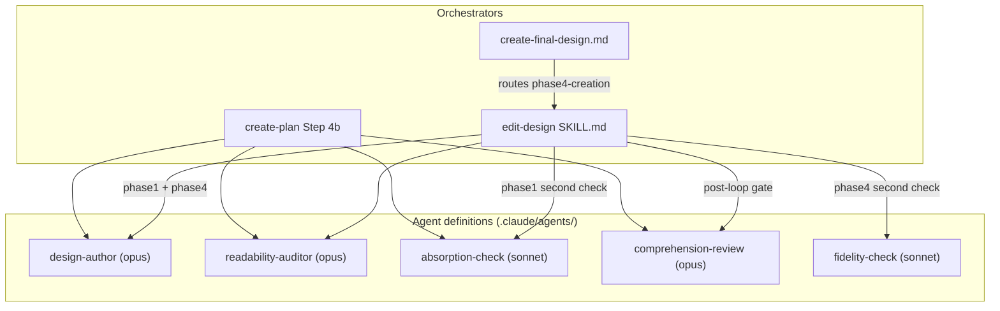

# Two-role authoring loop for readable design docs — Architecture Decision Record

## Summary

The workflow now drafts design docs and track files through a generate-then-verify
loop instead of one agent writing with the whole planning conversation loaded. A
code-grounded **author** sub-agent drafts for a reader who has only the finished
document; a cold **readability auditor** reports every passage that reader cannot
reconstruct; a warm per-round **absorption check** confirms the draft still carries
every load-bearing decision. The loop repeats until both checks are clean, then a
de-warmed **comprehension review** gates the converged draft over the doc alone.
The same loop runs at three authoring points — `design.md` (in `edit-design`), the
track files (in `create-plan` Step 4b), and the Phase 4 `design-final.md` — with
the per-round second check keyed by where it runs: absorption at design and track
authoring, a doc-against-episodes **fidelity check** at Phase 4. Five agent
definitions under `.claude/agents/` carry the roles with minimal tool allow-lists.
The change is workflow machinery only; it added no production code.

## Goals

- Stop dense, hard-to-read prose from surviving design authoring. Achieved: the
  prose-readability axis moved to a dedicated cold auditor that owns it on every
  prose-checked surface, replacing the one-fifth-of-a-pass it got on the old
  multi-axis reviewer.
- Make the comprehension verdict genuinely cold. Achieved: the comprehension
  reviewer lost its research-log read (the old absorption cross-check), so it now
  judges the doc alone.
- Extend readability help to the tiers with no design doc. Achieved: the loop runs
  at `create-plan` Step 4b on the track files, so `lite` and `minimal` get the
  same treatment.
- Keep Phase 4 honest about what was built. Achieved: the Phase 4 second check is
  fidelity against the step and track episodes (PSI for the residual), not a
  re-assertion of planned decisions.
- Hold the per-round fan-out cost down. Partially achieved: the tool-surface cut
  via agent definitions landed; the fan-out cache warm-up is specified as a
  tunable lever with a disabled-is-correct baseline, with its concrete wait
  mechanism deferred to live wiring (see Key Discoveries).

No goal was descoped. One was deliberately bounded out from the start: the
YTDB-1128 / YTDB-1129 house-style rule additions and PR-description readability
move to separate PRs.

## Constraints

- **Workflow-modifying, so staged.** Every edit accumulated under
  `_workflow/staged-workflow/.claude/` and the live workflow stayed at develop
  state for the whole branch. Phase 4 promotes the staged subtree onto the live
  tree. A consequence held throughout: the branch authored its own design and ran
  its own Phase 4 with the *old* single-agent routine, because the new routine is
  non-live until this promotion.
- **By-reference orchestration is load-bearing** for the 4a/4b session-boundary
  collapse: every author spawn must return a thin summary, never the drafted
  document, or the combined session re-accumulates the context the boundary kept
  apart. Confirmed statically; a live-harness re-confirmation is carried to the
  first live run.
- **Diagrams stay Mermaid.** No SVG or ASCII toolchain entered the branch.
- **Memory and `CLAUDE.md` cannot be skipped per agent.** Only the built-in
  Explore and Plan agents skip them, and Explore's locate-don't-audit disposition
  fights the auditor's enumerate disposition, so custom agents carry that fixed
  per-spawn cost and the warm-up amortizes it rather than removing it.

## Architecture Notes

### Component Map

Five agent definitions, three orchestrators. `edit-design` is the direct spawner
on both the Phase 1 and Phase 4 design paths and selects the per-round second
check by mutation kind; `create-final-design` routes `phase4-creation` through
`edit-design` rather than spawning the sub-agents itself.

- **`design-author`** (`Read`, `Write`, `Edit`, `Bash`, mcp-steroid PSI; opus) —
  the only writer. Grounds on the research log and the live code, never the
  authoring conversation.
- **`readability-auditor`** (`Read`, `Grep`; opus) — range-sliced cold prose
  auditor; owns the prose AI-tell axis on every prose-checked surface.
- **`absorption-check`** (`Read`, `Grep`; sonnet) — warm per-round coverage match
  between the research log's load-bearing decisions and the draft's decision
  records.
- **`comprehension-review`** (`Read`, `Grep`; opus) — de-warmed cold
  comprehension-and-structure gate; judges the doc alone.
- **`fidelity-check`** (`Read`, mcp-steroid PSI; sonnet) — Phase 4 per-round
  doc-against-episodes match, PSI for the residual.

### Decision Records

The plan seeded D1–D19; D20 emerged during implementation. All retain their
numbering. Most landed as planned; the entries below note where execution changed
the rationale or surfaced something new.

- **D1** — Target reader is a mid-level developer; domain terms stay and are
  glossed in place. Implemented as planned, in the auditor's stopping rules.
- **D2** — Mechanisms are explained to the **reconstructibility bar**, bounded
  below by the house-style too-terse floor and above by two named house-style
  clauses. Implemented as planned, as the auditor's enumerate-to-the-bar
  obligation.
- **D3** — The author is code-grounded: it reads the log and the codebase via PSI,
  not the authoring conversation. Implemented as planned. PSI access is the
  mcp-steroid wildcard tool (see Key Discoveries).
- **D4** — The auditor is a dedicated cold role reusing the `readability-feedback`
  audit contract, realized as an agent definition. Implemented as planned, as
  `readability-auditor`.
- **D5** — One cold comprehension-and-structure review at creation; the warm
  reviewer is retired. Implemented as planned, by de-warming `design-review.md`
  (dropped prose axis, dropped absorption cross-check, dropped log read).
- **D6** — Absorption is a co-equal per-round check, justified by the
  cross-slice-drop failure under range-slicing. Implemented as planned, as the
  per-round pairing inside the inner loop.
- **D7** — Absorption stays at creation as a small warm agent, not deferred to
  Phase 2. Implemented as planned, as `absorption-check` on Sonnet.
- **D8** — The five human-reader checks split by context need between the sliced
  auditor and the whole-doc reviewer. Implemented as planned. D20 adjusted the
  comprehension reviewer's tool list (below) without changing this split.
- **D9** — The auditor owns the prose AI-tell axis on every prose-checked surface;
  the comprehension reviewer runs it nowhere. Implemented as planned, and extended
  during execution: the `design-sync` surface initially had the axis on neither
  reviewer, fixed by wiring a `design-sync`-scoped auditor prose pass so the
  auditor stays the single prose owner there too (see Key Discoveries).
- **D10** — Phase 4 fidelity is primarily doc-against-episodes; PSI covers the
  diagram, signature, and no-episode-trace residual. Implemented as planned. The
  kind-keyed swap of fidelity-over-absorption lives in `edit-design`, and the
  fidelity check's `episodes_path` and frozen `design_path` derive from the
  design-directory offset (see Key Discoveries).
- **D11** — The loop wires at two authoring points: `edit-design` for the design
  and `create-plan` Step 4b for the tracks. Implemented as planned at both.
- **D12** — Keep Mermaid; no diagram-format change. Held as planned.
- **D13** — Cost levers: minimal tool allow-lists, fan-out cache warm-up,
  ground-once with targeted re-grounding, findings-in-file. Tool-surface cut and
  ground-once landed; the warm-up's concrete wait mechanism was deferred to live
  wiring with a disabled-is-correct baseline (see Key Discoveries).
- **D14** — Memory and `CLAUDE.md` are not per-agent configurable; the warm-up
  amortizes them and the `tools:` allow-list cuts the tool surface. Confirmed
  during execution against the live Agent-tool docs.
- **D15** — Collapse the 4a/4b session boundary into one `create-plan` invocation;
  a staged auto-resume-contract change with a hard by-reference requirement.
  Implemented as planned: by-reference confirmed statically, so the boundary was
  collapsed rather than retained; the live-harness re-confirmation is carried to
  the first live run.
- **D16** — Defer the Agent SDK and cross-model review; keep the Agent tool. Held
  as planned.
- **D17** — Dogfood on real targets including a workflow-prose target;
  self-wiring is blocked by staging and the temporal bootstrap. The staging /
  bootstrap block held as predicted; the first design authored after promotion is
  the routine's first natural use.
- **D18** — Extend S2 to name the warm absorption agent as a sanctioned log
  reader. **Changed during execution:** the wording edit landed in `research.md`
  (S2's canonical home) and its `design-document-rules.md` restatement;
  `conventions.md` needed no edit, because its cross-refs name the two read
  *sites*, not the readers (see Key Discoveries). The plan had named `conventions.md`
  as a deliverable target.
- **D19** — Scope is the full two-role loop; the YTDB-1128 / YTDB-1129 house-style
  rules move to a separate PR. Held as planned.
- **D20** — **New, emerged during execution.** The `comprehension-review`
  allow-list is `Read, Grep`, not `Read`-only. The gate's own reading rules direct
  it to resolve `**Full design**` links and read cited `house-style.md § <heading>`
  sections — the same grep-a-cited-section pattern the sibling cold roles already
  carry — and a `Read`-only gate cannot run those resolutions or its structural
  checks. Adding `Grep` is a read-only expansion that touches no invariant (S1
  governs the auditor not reading the research log, not the gate's tool surface).

### Invariants & Contracts

- **S1** — The cold readability auditor never reads the research log.
- **S2** — The research log is read for decision content only at the sanctioned
  sites (Step 4a/4b artifact authoring, with the absorption agent named under that
  site; and the Phase 2 consistency review), keeping the site count at two.
- **S3** — The cold-read does not run while a log-adversarial gate entry is open
  (the freeze-order gate, on `phase1-creation`).
- **S4** — No surface runs the prose AI-tell axis on both the auditor and the
  comprehension reviewer.
- **S5** — The dual-clean inner loop exits only when both per-round checks are
  clean or the iteration budget is spent.
- **S6** — Phase 4 reflects what was built and never re-asserts a superseded log
  decision.
- **S7** — The new routine stays staged and non-live until the Phase 4 promotion.

### Integration Points

- **`edit-design/SKILL.md`** — the multi-agent orchestrator for `design.md` and
  `design-final.md`; Steps 1/4/6 became the author spawn, the per-round
  auditor-plus-second-check pair, and the bounded dual-clean loop, with the
  post-loop comprehension gate.
- **`create-plan` Step 4b** — runs the same loop on the track files
  (`target=tracks`); also the home of the collapsed 4a/4b boundary, with Step 1c
  auto-resume now crash-recovery-only on the committed-clean-design arm.
- **`create-final-design.md`** — routes `phase4-creation` through `edit-design`
  and threads the fidelity inputs (episodes path, `output_path`).
- **`design-review.md`** — the de-warmed comprehension-and-structure prompt.
- **`research.md` / `design-document-rules.md`** — carry the S2 wording extension.
- **`workflow.md` / `planning.md`** — carry the 4a/4b boundary-collapse wording.

### Non-Goals

- PR-description readability — tracked by a separate issue.
- The YTDB-1128 / YTDB-1129 house-style rule additions — separate PRs. The auditor
  reads the live `house-style.md`, so it absorbs them whenever they land.
- A diagram-format change — Mermaid stays.

## Key Discoveries

- **The comprehension gate needs `Grep`, not just `Read` (D20).** Its own reading
  rules resolve `**Full design**` links and read cited `house-style.md` sections.
  The fix kept the role's coldness (a property of *what it judges* — the doc,
  never the log) while giving it the read-only tool its rules require. The frozen
  seed design recorded `Read`-only, so the final design reconciles to `Read, Grep`.
- **The author's PSI access is a single wildcard tool entry.** `tools:
  mcp__localhost-6315__*` is the one allow-list form that covers PSI execution,
  project preflight, and resource fetch together; naming the PSI tools
  individually would have missed the preflight and fetch calls.
- **`conventions.md` needed no S2 edit (D18 changed).** Its two read-scope
  cross-references name the sanctioned read *sites*, not the reader roles, so they
  stay accurate after a third reader is named under an existing site. The S2
  wording extension landed only in `research.md` (its canonical home) and the
  `design-document-rules.md` restatement. The plan had over-scoped the deliverable
  to `conventions.md`.
- **The fan-out cache warm-up has no foreground-delay primitive in this harness.**
  `Bash` cannot hold a timed wait, so the concrete wait mechanism is deferred to
  live wiring. The loop is specified to be correct with the warm-up disabled (pay
  N cold prefixes), so the warm-up is a pure cost lever, not a correctness
  dependency. The byte-identical-prompt assumption that makes the shared prompt
  body cache is confirmed against the live Agent tool on the first live run.
- **The fidelity-over-absorption swap lives in `edit-design`, not
  `create-final-design`.** `create-final-design` only routes `phase4-creation` and
  threads inputs. The fidelity check's `episodes_path` and frozen `design_path`
  derive from the design-directory offset rather than the plan directory, which
  keeps the parameter contract inside the narrow `edit-design` boundary — the
  load-bearing reconciliation of the Phase 4 wiring.
- **By-reference orchestration confirmed statically, so the 4a/4b boundary
  collapsed.** The author return contract returns a thin summary and the Step-4b
  wiring passes `output_path`, so the orchestrator never receives the drafted doc.
  The live-harness re-confirmation against the running Agent tool is the one
  carried-forward item.
- **The `design-sync` surface needed an explicit prose owner (D9).** De-warming
  the comprehension reviewer plus reworking `edit-design` initially left
  `design-sync` with the prose AI-tell axis on neither reviewer, a latent S4
  break. The fix wired a `design-sync`-scoped `readability-auditor` prose pass, so
  the auditor stays the single prose owner there. The lesson: the prose axis must
  move to the auditor on *every* prose-checked surface at once, or it falls through
  on whichever surface the de-warm forgot.
- **A stale cold-read description outlived the de-warm.** The `create-plan` Step-4a
  `phase1-creation` description still claimed the design cold-read runs the
  absorption cross-check (the pre-de-warm framing), which the de-warm made false.
  It was reconciled to match the new split. Stale procedure prose is easy to leave
  behind when one surface is de-warmed and a sibling surface is not edited in the
  same pass.
- **Model availability fell back to opus.** The `fable` model pinned for some role
  spawns was unavailable in the execution environment, so opus was used in its
  place throughout (a documented fallback, not a downgrade decision). The
  Sonnet-pinned roles — the absorption check and the fidelity check — ran on Sonnet
  as designed.

## Adversarial gate verdicts

The pre-code decision/assumption challenge ran as a gate on the research log at the
Phase 0 → 1 boundary (the in-skill adversarial pass was relocated there). Verdict:
**passed at iteration 2.** Iteration 1 returned NEEDS REVISION with 0 blockers, 6
should-fix, and 3 suggestions; the resolutions were appended to the decision record
and re-challenged. Iteration 2 verified all 9 prior findings against the revised log
and the live machinery, found no new findings, and cleared the gate — so design
authoring proceeded only after every decision had survived challenge.

## Token usage telemetry

Snapshot from this worktree's sessions over its lifetime (N=11 sessions across 79 transcripts).

### Tool mix — share of total session context

| Component             | Share |
|-----------------------|------:|
| `Read` tool results   | 68.8% |
| `Bash` tool results   | 8.3% |
| `Grep` tool results   | 0.0% |
| `Edit` tool results   | 0.5% |
| Other tool results    | 3.3% |
| Prompts and output    | 19.1% |

### Top files by share of `Read` token consumption

| File                                            | Share of Read |
|-------------------------------------------------|--------------:|
| <outside-worktree>                              | 10.6% |
| docs/adr/understandable-design/_workflow/plan/track-1.md | 9.7% |
| .claude/workflow/implementer-rules.md           | 8.0% |
| docs/adr/understandable-design/_workflow/plan/track-2.md | 7.2% |
| docs/adr/understandable-design/_workflow/staged-workflow/.claude/skills/edit-design/SKILL.md | 6.6% |
| docs/adr/understandable-design/_workflow/design.md | 4.3% |
| .claude/skills/edit-design/SKILL.md             | 3.8% |
| docs/adr/understandable-design/_workflow/research-log.md | 3.5% |
| .claude/workflow/prompts/design-review.md       | 3.4% |
| docs/adr/understandable-design/_workflow/staged-workflow/.claude/skills/create-plan/SKILL.md | 3.3% |

Generated by `.claude/scripts/measure-read-share.py` against
`~/.claude/projects/-home-andrii0lomakin-Projects-ytdb-understandable-design/`.
