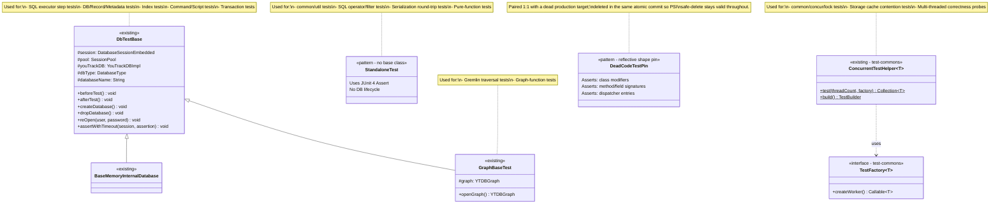
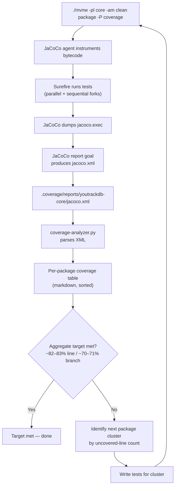
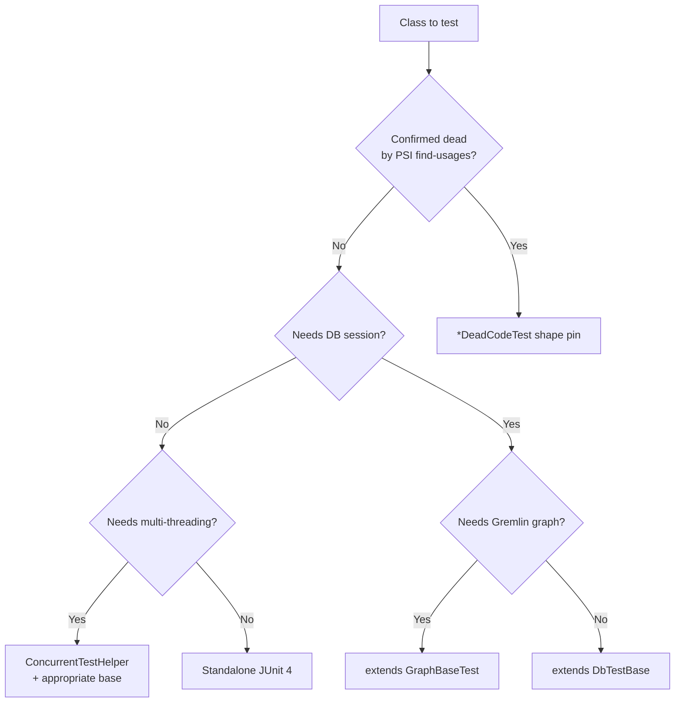
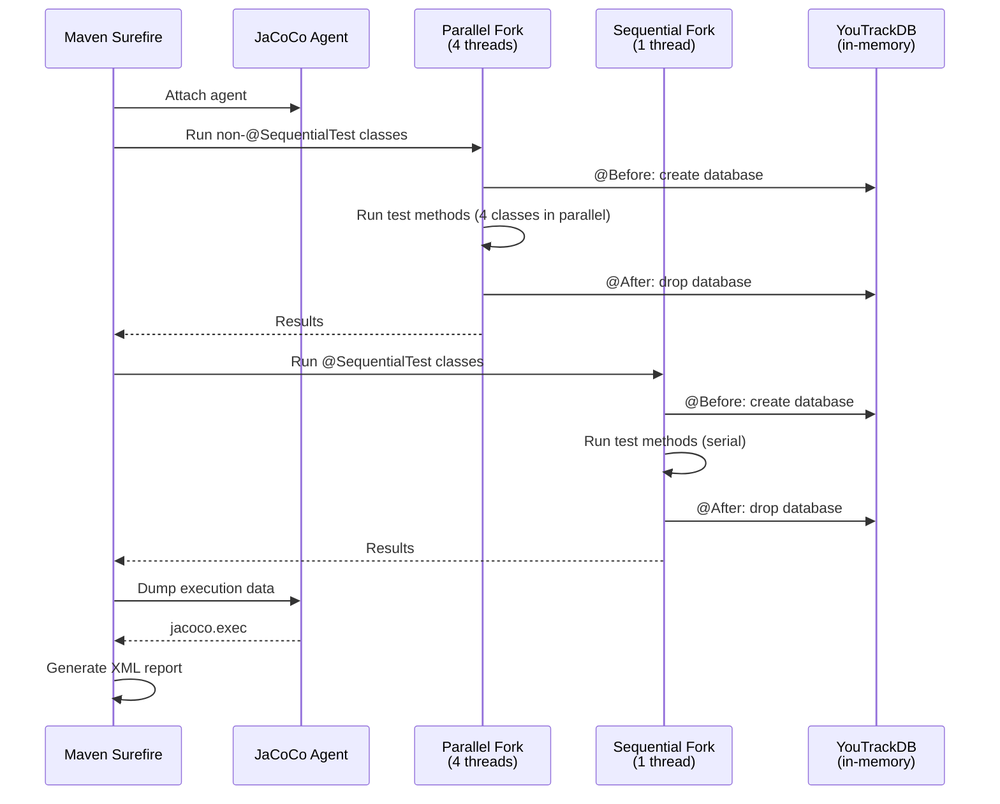

# Unit Test Coverage — Core Module — Final Design

## Overview

The `core` module's JaCoCo baseline measured 63.6% line / 53.3%
branch across 177 packages, with the lowest-coverage areas in SQL
operators (20.9%), the legacy string serializer (30.9%),
command/script (31.4%), security (32.1%), and live-query / fetch
(13–46%); write cache, WAL, and B-tree storage sat in the 60–75%
band.

This branch raises the aggregate to **81.4% line / 71.1% branch**
(+17.8 pp on both axes; +18,907 covered lines / +9,025 covered
branches) and removes 6,196 lines of dead production code in
lockstep with its pins. Work is test-additive on surviving
packages plus deletion-only commits where PSI find-usages
confirmed zero live consumers.

Two enabling primitives carry the change. A Python per-package
coverage analyzer (`.github/scripts/coverage-analyzer.py`) parses
JaCoCo XML and emits a markdown table sorted by uncovered-line
count, complementing the unchanged per-PR diff gate
(`coverage-gate.py`). A `*DeadCodeTest.java` shape-pin convention
pairs every dead-code candidate with a reflective JUnit 4 class
asserting modifiers, signatures, and dispatcher entries — so one
atomic commit deletes production code and pin together.

The test surface restructures along existing infrastructure
(`DbTestBase`, `BaseMemoryInternalDatabase`, `GraphBaseTest`,
`ConcurrentTestHelper`) with no new base classes.
`@Category(SequentialTest)` (115 files) gates tests that mutate
JVM-global state so the parallel 4-thread surefire fork stays
safe. A falsifiable-regression convention pins latent production
bugs with `// WHEN-FIXED: YTDB-NNN` line-comments anchored to the
69 YouTrack issues opened by this branch.

The rest covers test-infrastructure class shape; coverage /
selection / execution workflows; the analyzer script; parallelism
boundaries; testing approaches for serialization / storage /
concurrency / SQL operators; and the dead-code pinning and
WHEN-FIXED marker conventions.

## Class Design



The four runtime test patterns are existing infrastructure — this
branch added no new base classes. Each new test class selects a
pattern from its dependency profile:

- **Standalone JUnit 4 tests** (no base class) for pure logic with no
  database dependency. The fastest pattern; used heavily in
  `common/*` utility tests, SQL operator / filter / method tests,
  and serialization round-trip suites.
- **`DbTestBase`** for code that requires a `DatabaseSessionEmbedded`.
  Provides per-method database lifecycle via `@Before` / `@After`.
  Used by SQL executor, DB/record, metadata/schema, index,
  command/script, and transaction tests.
- **`BaseMemoryInternalDatabase`** (extends `DbTestBase`) when the
  test explicitly relies on in-memory-storage guarantees.
- **`GraphBaseTest`** (extends `DbTestBase`, adds Gremlin graph
  setup) for traversal and graph-function tests.
- **`ConcurrentTestHelper<T>` + `TestFactory<T>`** for multi-threaded
  correctness probes. Spawns a thread pool, runs workers, collects
  failures.

The fifth pattern — **`*DeadCodeTest.java` reflective shape pins** —
is the only convention this branch introduces. A shape pin is a
standalone JUnit 4 class that uses reflection (`Class.getMethods()`,
`Field.getModifiers()`, `SPI.load()`) to assert the structural shape
of a piece of dead production code: modifiers, return types,
parameter lists, throws clauses, dispatcher-table entries. When the
production surface is deleted, the pin's compile-time references go
red and the deletion commit must remove both files atomically.
~35 such pins live in the test tree; 47 more were deleted in
lockstep with their production targets during the dead-code
deletion sweep.

## Workflow

### Coverage Measurement and Progress Tracking



The cycle iterates per cluster of packages: run the coverage build,
read the analyzer table to pick the largest remaining uncovered
gap, write tests, commit, and re-run the build. The aggregate
target was set at ~82–83% line / ~70–71% branch — the achieved
end-state is 81.4% line / 71.1% branch, exceeding the branch target
and landing 0.6 pp below the lower bound of the line target after
the deletion lockstep's denominator drop.

### Test Selection Decision Flow



The decision flow runs once per class under test. The first
question — is the class confirmed dead by PSI find-usages across
all modules? — routes to a shape pin rather than a behavioral
suite, because driving "live coverage" on a class with no
production callers is wasted effort and produces brittle tests
that the deletion commit then breaks. For everything else, the
fastest viable pattern wins: standalone if possible, escalate to
the base classes only when the code genuinely needs a session or
a graph.

### Test Execution Architecture



Core-module tests run in two surefire executions: a parallel fork
(4 threads, all classes except `@SequentialTest`) and a sequential
fork (single thread, `@SequentialTest` only). Each test method
gets its own database instance via `DbTestBase`'s
`@Before` / `@After`. JaCoCo instruments all non-excluded classes
and dumps execution data after both forks complete.

New tests do not carry `@SequentialTest` by default. The annotation
is reserved for tests that mutate JVM-global state — most often
`GlobalConfiguration` values, static singletons, or process-wide
thread-locals — where parallel execution would race other classes
sharing the same JVM. 115 test files on this branch carry the
annotation; the remaining ~480 new/extended test files run in the
parallel fork.

## Coverage Analyzer Script

**TL;DR.** `coverage-analyzer.py` is the only new non-test artifact
this branch ships. It parses `jacoco.xml` (the same report the
existing `coverage` Maven profile produces) and emits a sorted
markdown table of packages by uncovered-line count, plus an
aggregate-totals header. It is read-only, has no CI integration,
and complements rather than replaces `coverage-gate.py`.

The 185-line script lives at `.github/scripts/coverage-analyzer.py`
alongside the existing gate scripts. It is intentionally simple:

| Aspect | `coverage-gate.py` (existing) | `coverage-analyzer.py` (new) |
|---|---|---|
| Scope | Changed lines only (git diff) | All lines, all packages |
| Purpose | PR gate (pass/fail) | Progress tracking |
| Output | PR comment markdown | Per-package table + aggregate |
| CI integration | Runs on every PR | Run manually or in nightly CI |
| Git dependency | Requires git diff against base branch | None — reads XML only |
| `assert`-line exclusion | Yes (phantom-branch handling) | No (raw JaCoCo counters) |

The analyzer parses `<counter type="LINE">` and
`<counter type="BRANCH">` elements at the `<package>` level in
JaCoCo XML, merges counters when multiple report fragments cover
the same package, and skips packages with a zero line denominator
(generated code, package-info-only packages). Output is sorted by
uncovered-line count descending so the largest remaining gaps
surface first.

The analyzer does NOT apply `coverage-gate.py`'s `assert`-line
exclusion. Whole-codebase progress tracking and PR-gate accuracy
are different problems — the gate's exclusion matters when JaCoCo
emits phantom uncovered branches on `assert` statements, but those
same branches are a small constant in aggregate and the analyzer's
sort order does not benefit from the extra filtering. When a
displayed per-package branch number is close to the 70% target,
the gate's number is authoritative — not the analyzer's.

### Edge cases / Gotchas

- The analyzer treats `total_lines == 0` as "skip the package"
  rather than emitting a 100% row. Packages composed solely of
  annotations, package-info, or `@ServiceLoader` resource files
  drop out of the table.
- When two JaCoCo report fragments cover the same package (rare
  but possible if a future workflow runs `core` and `tests` in
  parallel), the merge logic sums covered and missed across
  fragments. Double-counting is avoided because each fragment's
  numerator and denominator are independent slices of the same
  set of class files.
- The analyzer is invoked via `python3` (not the platform Python).
  CI runners and developer machines must have a Python 3
  interpreter on `PATH`; the script has no third-party
  dependencies — it uses `xml.etree.ElementTree` and `glob` from
  the standard library.

### References

- Script: `.github/scripts/coverage-analyzer.py`
- Companion gate (per-PR diff): `.github/scripts/coverage-gate.py`
- Coverage Maven profile: `core/pom.xml` (existing, unchanged)

## Test Parallelism Constraints

**TL;DR.** Tests run in two surefire forks: a parallel 4-thread
fork for the default classes and a sequential single-thread fork
for `@SequentialTest`-annotated classes. Anything that mutates
JVM-global state must opt into the sequential fork; everything
else stays in the parallel fork. A second project-wide rule —
only one `./mvnw test` invocation per worktree at a time —
constrains how the coverage build is run, not test design.

The boundaries that matter for test authors:

- **When to use `@Category(SequentialTest)`**: tests that call
  `GlobalConfiguration.setValue()`, mutate static singletons,
  install custom thread-local state, or otherwise reach
  JVM-global mutable surface. 115 test files on this branch
  carry the annotation. Read-only access to global config is
  safe in parallel.
- **`GlobalConfiguration` mutations**: any `setValue()` call is
  JVM-global. Snapshot-and-restore in `@Before` / `@After` is not
  enough on its own — without `@SequentialTest`, a sibling class
  in the parallel fork can observe the mutation mid-test. The
  combination of `@SequentialTest` + snapshot/restore is the
  durable pattern.
- **`@After rollbackIfLeftOpen` safety net**: the `TestUtilsFixture`
  helper carries an `@After` hook that rolls back any transaction
  left open by a test method, preventing a leaked transaction
  from cascade-failing every method in the class. New test classes
  that extend `TestUtilsFixture` or its derivatives inherit it for
  free.
- **Tracked-`spawn()` discipline**: tests that spawn helper
  threads must keep references so `@After` can `join()` them
  with a finite timeout. Bare `new Thread(...).start()` leaks
  daemon threads that survive into the next class's run on
  surefire's worker reuse.
- **Database isolation**: `DbTestBase` creates a fresh in-memory
  database per test method via `@Before`. Tests in the parallel
  fork do not share a database instance.

### Edge cases / Gotchas

- `@SequentialTest` is a JUnit 4 `@Category` marker, not its own
  annotation hierarchy. Surefire's parallel-fork configuration
  filters on the category. New tests that need sequential
  execution must import the existing marker, not invent a new
  one.
- `surefire-junit47` (the runner core uses) interprets
  `@FixMethodOrder(MethodSorters.NAME_ASCENDING)` deterministically.
  Tests that rely on a specific order across methods within a
  class must annotate `@FixMethodOrder` explicitly; the default
  is JVM-dependent.
- Native libraries (Kerberos JNI, OS-specific allocators) cannot
  be reloaded in the same JVM. Tests that touch native state
  belong in the sequential fork even if no Java-level global
  state changes.
- The single-worktree constraint applies to **`./mvnw test`** at
  the process level. Two `./mvnw test` invocations on the same
  working tree fight over surefire's tmp directories and
  database files. Running tests in two separate worktree clones
  is fine.

### References

- Marker: `test-commons/src/main/java/.../test/SequentialTest.java`
- Fork configuration: `core/pom.xml` (`maven-surefire-plugin`
  `<executions>`, existing)
- Helper: `TestUtilsFixture` (extended on this branch)

## Testing Serialization Round-Trips

**TL;DR.** Serialization is one of the largest absolute coverage
gaps. The strategy is **round-trip verification** — write, read
back, assert equality — which exercises both encode and decode
paths in a single test case and roughly doubles coverage per
written test. Each serializer is tested across its full
~20-element type matrix (String, Integer, Long, Double, Float,
Short, Byte, Boolean, Date, DateTime, Decimal, Binary, Embedded,
EmbeddedList, EmbeddedSet, EmbeddedMap, Link, LinkList, LinkSet,
LinkMap), with null variants and at least one nested case.

The pattern is uniform across the binary, string, and JSON-Jackson
serializers:

1. Create a document or record with specific property types.
2. Serialize to the target format (CSV-like string, length-prefixed
   binary, or JSON bytes).
3. Deserialize back to a document or record.
4. Assert that every property matches the original — values,
   types, ordering where load-bearing, and link identities for
   reference types.

Three serializer-specific extensions:

- **Binary serializer round-trips** pair each value-level test
  with a *byte-shape pin* that asserts the exact wire-format
  bytes the encoder produces. The pin catches accidental
  changes to VarInt length prefixes, type tags, or version
  headers that a value-only round-trip would silently absorb.
- **String (CSV) serializer round-trips** specifically include
  tests for the four special characters that need escaping in
  the CSV format: `"`, `,`, `\n`, `#`. Each character has a
  dedicated round-trip case with the character inside a string
  value, inside an embedded document field name, and inside a
  collection element.
- **JSON-Jackson serializer round-trips** are exercised in three
  separate suites — default mode, import-instance mode, and
  import-backwards-compat mode — because the three modes share
  the same serializer class but route through three different
  read paths whose branch coverage is otherwise hard to
  separate.

### Edge cases / Gotchas

- **Null handling per type**: every type's round-trip suite
  carries an explicit null case. This is the single most common
  uncovered path in serializer code; without the null variant a
  type's coverage saturates at ~85% on the happy path alone.
- **Nested structures**: embedded documents within embedded
  documents, collections of collections, and links inside
  embedded documents are tested separately from the flat type
  matrix. The recursion paths are gated by `Object` dispatch
  and look superficially covered by the flat tests, but the
  branches that distinguish "embedded document" from "primitive
  value" only fire when the value's type is genuinely composite.
- **`session.commit()` detaches `Iterable<Vertex>`**: any test
  that round-trips through the database session must materialize
  returned iterables to a local `List` before calling `commit()`.
  The wrapper becomes unusable after commit, and the symptom
  (NPE or empty result) reads as "test bug" rather than "API
  surprise".
- **Inert converter test trap**: the three abstract-base
  `*ConverterTest` files in `common/serialization` originally
  carried test methods on the abstract class with no `@Test`
  annotation, so JUnit 4 silently never ran them. The fix is
  the helper-method + per-subclass `@Test` pattern documented
  in `AbstractComparatorTest`; any new abstract-base test class
  should follow the same shape.

### References

- Round-trip pattern: `RecordSerializerBinaryTestFixture.runInTx(...)`,
  `BinaryComparatorV0TestFixture.field(...)`, JSON Jackson
  fixtures under `serialization/serializer/record/string/`.
- Type matrix definition:
  `com.jetbrains.youtrackdb.api.schema.PropertyType` (existing).
- Helper-method pattern reference: `AbstractComparatorTest`.

## Testing Storage & Cache Components

**TL;DR.** Storage components — the write cache (`WOWCache`),
read cache, double-write log, WAL machinery, B-tree storage —
are the hardest part of `core` to unit-test. They depend on
page buffers, file I/O, concurrent access, and recovery logic
that real integration tests usually drive. The unit-test
strategy combines three approaches: page-level direct-memory
tests, component-lifecycle tests on a temp directory, and short
concurrency smoke tests. Per-package targets are explicitly
lower than the project-wide gate for storage internals because
some paths (WAL replay, crash recovery, async checkpoint
coordination) genuinely require integration-test scope.

The three approaches:

1. **Page-level direct-memory tests**. Acquire a buffer from
   `ByteBufferPool.acquireDirect()`, wrap it in a `CachePointer`,
   create a `CacheEntry`, acquire the exclusive lock, perform
   the page operation under test, release the lock, and call
   `decrementReferrer` in `finally`. The `@After` hook calls
   `bufferPool.clear()` + `allocator.checkMemoryLeaks()` to
   surface leaked buffers. This pattern unit-tests page
   serialization logic without booting a full storage stack.
2. **Component-lifecycle tests**. Construct the component
   against a temporary directory (the project's per-PID
   suffix discipline applies — `/tmp/...-$$.tmp`), call
   `open()`, exercise the public API, call `close()`, and
   verify state. Covers initialization, normal operation, and
   shutdown paths without requiring a full database.
3. **Concurrency smoke tests**. Use `ConcurrentTestHelper` to
   spawn 4–8 worker threads exercising a shared component for
   a short duration (< 5 seconds). These are not exhaustive
   concurrency tests — those belong in integration tests — but
   catch obvious thread-safety regressions. For race-shape
   pins, a `CyclicBarrier(N)` synchronizes worker start so the
   race window is real, not pseudo-real.

The write cache (`WOWCache`, ~4,500 lines) is the largest single
storage class. Unit-testing its full internal state machine —
page-dirty tracking, async flush, checkpoint coordination — is
impractical at the unit level. The tests focus on its
externally-observable surface: page allocation and deallocation,
file creation and deletion through the cache, checkpoint
trigger conditions, and the double-write log integration
points.

### Edge cases / Gotchas

- **`ByteBuffer.order()` defaults to BIG_ENDIAN**. Storage code
  that reads back legacy headers (e.g.,
  `StorageStartupMetadata.open()` size ≤ 9) silently relies on
  the BIG_ENDIAN default rather than calling `nativeOrder()`.
  Tests that write little-endian bytes will fail on read-back;
  match the production endianness exactly.
- **`@Category(SequentialTest)` for B-tree tests that mutate
  `GlobalConfiguration.BTREE_MAX_KEY_SIZE`**. Surefire's
  parallel execution races schema init in sibling test classes
  when this config value changes mid-fork.
- **`CASDiskWriteAheadLog.close()` is not idempotent**. Double-
  close paths exist in the test surface; use a local boolean
  closed-flag pattern in the test's `finally` block to avoid
  a second `close()` after an earlier failure.
- **`MPSCFAAArrayDequeue.Node.enqidx` initialises to 1**, not 0.
  A 1024-element offer fills slots 1..1023 in the first node
  and the 1025th offer triggers a fresh node. Off-by-one
  boundary tests must account for the initial offset.
- **Mockito `when(...).thenReturn(...)` traps on void-returning
  `WriteCache` / `CacheEntry` stubs**. Prefer
  `doReturn(...).when(...).method(...)` for any method whose
  return type is influenced by a side effect Mockito can't
  reason about.

### References

- Pattern source: existing `CollectionPageTest`, extended on
  this branch.
- Helper: `ByteBufferPool.acquireDirect(...)`,
  `CachePointer`, `CacheEntry`, `bufferPool.clear()`,
  `allocator.checkMemoryLeaks()` (existing).
- Per-package coverage allowances: storage internals target
  ~63–88% line by package — see the analyzer table for the
  per-package landing state.

## Testing Concurrency Primitives

**TL;DR.** The `common/concur/lock` package and the wider
concurrency infrastructure carry locks used throughout `core`.
Lock tests require careful thread coordination — synchronized
start via `CountDownLatch` / `CyclicBarrier`, short test
durations to limit flakiness, and proper handling of interrupt
semantics. `Thread.sleep()` is never used for synchronization;
synchronization primitives are.

Testing layers, from simplest to most demanding:

- **Basic lock semantics**: acquire / release / `tryLock` with
  timeout, reentrant behaviour. Single-threaded — verifies the
  lock's state machine without thread contention.
- **Contention tests**: two or more worker threads compete for
  a lock. `CountDownLatch` or `CyclicBarrier` synchronises
  start so the contention is real; assertions verify that only
  one thread holds the lock at a time.
- **Fairness and ordering**: where the lock claims FIFO or
  arrival-order fairness, threads register their attempt order
  via an `AtomicReference` chain and the test asserts the
  acquisition order matches.
- **Edge cases**: lock release by a non-owner thread, double
  release, interrupt during wait, timeout expiration. These
  are usually the lowest-coverage paths.

The tracked-`spawn()` discipline applies in full here: every
worker thread is kept in a list field; `@After` iterates the
list and `join(2_000)` each thread; any thread still alive is
`interrupt()`-ed and the test fails with a diagnostic message.
Bare `new Thread(...).start()` is a flake source.

### Edge cases / Gotchas

- **Surefire worker reuse** carries thread-local state between
  consecutive test classes. Tests that install a custom
  `ThreadLocal` (e.g., `SerializationThreadLocal`) must call
  `.remove()` in `@After`.
- **`ReadersWriterSpinLock` has no read→write upgrade**. Tests
  that assume upgrade semantics from `ReentrantReadWriteLock`
  will deadlock. The lock's contract is documented; the test
  fixture pins it via a dedicated upgrade-attempt test.
- **`NonDaemonThreadFactory` inherits daemon-flag** from the
  current thread. A test running in a daemon-thread surefire
  worker can produce non-daemon factory threads that survive
  the JVM if not joined.
- **Race-shape pins use `CyclicBarrier(N)`** to synchronise
  worker start. A `CountDownLatch` works for one-shot start
  but a barrier is reusable across multiple rounds in the
  same test, which matters when verifying lock reentrancy
  under contention.

### References

- Helper: `ConcurrentTestHelper.test(threadCount, factory)`,
  `ConcurrentTestHelper.build()` (`test-commons`).
- Pattern: tracked-`spawn()` discipline, codified in lock-test
  fixtures on this branch.
- Locks under test: `common/concur/lock/*`,
  `common/concur/resource/*`.

## Testing SQL Operators

**TL;DR.** SQL operators were the lowest-coverage SQL-layer
package at the baseline. They are also among the most
testable: each operator implements a small set of well-typed
methods (`evaluateRecord` / `compare`) and the input space
factors cleanly into type pairs, null variants, and operator-
specific patterns. The testing approach is a type cross-product
plus operator-specific edge sets, run as standalone JUnit 4
tests (no database session).

For each operator:

- **Type cross-product**: every supported type pair (e.g.,
  `String × String`, `Integer × Integer`, `String × Integer`
  for coercion, `Long × Decimal` for promotion) gets at least
  one test method.
- **Null operands**: left null, right null, both null. These
  are the most common uncovered branches.
- **Edge values**: empty strings, zero, negative numbers,
  `Integer.MIN_VALUE` / `MAX_VALUE`, `Long.MIN_VALUE` /
  `MAX_VALUE`, `Double.NaN`, infinities where the operator
  accepts floats.
- **Collation**: case-sensitive and case-insensitive variants
  for any operator that consults a collation
  (`LIKE`, `MATCHES`, `CONTAINS`, comparison operators on
  `String`).

Pattern-rich operators — `LIKE`, `CONTAINS`, `BETWEEN`, `IN`,
`MATCHES` — get dedicated test methods per pattern class. For
`LIKE`, that means one method per escape sequence the regex
translator handles (eight characters with regex special
meaning, plus the `_` and `%` wildcards).

### Edge cases / Gotchas

- **`In` operator bypasses type coercion**. `Set.contains()` is
  identity-based on the contained values' `equals()` /
  `hashCode()`, so a `Long(1L)` is not "in" a `Set<Integer>`
  containing `1`. The test fixture pins this asymmetry as a
  falsifiable regression with a `WHEN-FIXED: YTDB-NNN` marker
  because production code likely intends symmetric coercion.
- **`Mod` operator dispatches on left type only**. The right
  operand is silently truncated to the left type, so
  `5.5 % 2` returns `1.5` but `5 % 2.7` returns `1`. Pinned
  as falsifiable.
- **Operator `Instanceof` is asymmetric**. The left/right
  contract differs from Java's `instanceof`; tests document
  the YouTrackDB semantics rather than assuming Java's.
- **`ContainsAll` over-counts duplicates**. `[1, 1, 2]
  containsAll [1, 2]` returns true (correct), but `[1, 2]
  containsAll [1, 1, 2]` also returns true (debatable). The
  test pins the current behaviour and forwards the design
  question via WHEN-FIXED.
- **Comparator selection in `SQLFilterClasses`**: comparator
  paths for cross-type compares (e.g., `BinaryField` vs
  `EntitySerializer`) are gated by SQL-execution context
  state that standalone tests cannot reach. Those branches
  are covered transitively by SQL-executor integration tests
  and explicitly left at the per-package landing state.

### References

- Operators under test: `core/sql/operator/*`,
  `core/sql/operator/math/*`, `core/sql/filter/*`.
- Falsifiable-regression convention: `// WHEN-FIXED: YTDB-NNN`
  line-comment markers anchored to YouTrack issues.

## Dead-Code Pinning Convention

**TL;DR.** Dead code identified during the coverage sweep is
not deleted on discovery — it is pinned via a
`*DeadCodeTest.java` reflective shape pin and queued for a
deletion-only commit that removes the production code and its
pin together. The convention solves three problems
simultaneously: it keeps the coverage analyzer's denominator
honest (dead code can't artificially deflate aggregate
percentages once it is gone), it gates deletion behind a PSI
find-usages re-confirmation step, and it makes deletion
bisectable — each cluster removed in one commit.

The pin pattern:

```java
public class FooDeadCodeTest {
  @Test
  public void fooClassShapeIsPinned() {
    // Assertions on class modifiers, declared methods, fields,
    // and any service-loader registration. Each assertion is
    // a structural claim that the deletion commit invalidates.
  }
}
```

A pin's only job is to fail loudly when the production target
changes. It does not exercise behaviour, does not measure
coverage in a meaningful sense, and does not interact with a
database session. The reflective assertions encode three
claims:

1. **Class shape**: package, name, modifiers, superclass,
   interfaces.
2. **Member shape**: every declared method's signature
   (return type, name, parameter types, throws clause); every
   declared field's type and modifiers.
3. **Dispatcher entries**: where the dead surface is
   registered in a factory, service-loader file
   (`META-INF/services/...`), or static dispatch table, the
   pin asserts the entry is still present.

When the production target is deleted, the pin's
compile-time references go red, forcing the deletion commit
to remove the test class in the same atomic step.

Dead-code clusters land in a single bisectable commit per
cluster. The end-state of this branch removed 11 clusters
(named A–K in the working notes), spanning binary-token /
JWT, sbtree singlevalue v1, narrow singletons, command-script
internals, and a partial-class trim of
`BasicCommandContext.copy()`. Five packages were emptied
outright by the lockstep, and the analyzer table shrank from
177 to 173 packages.

Not every dead-code candidate is deletion-eligible. Three
classification categories emerge from PSI find-usages:

- **delete-in-track**: zero production callers across all
  modules; no SPI registration; no api-reachable surface.
  Deleted atomically with the pin.
- **defer-to-issue**: one or more PSI hybrid-policy criteria
  fail — live consumer, abstract base with subclasses, SPI
  service, exception type catchable by external code,
  api-reachable. The pin stays in place; a YouTrack issue
  captures the deletion task for a follow-up PR.
- **pin-maintenance**: PSI shows the production target is
  ALIVE despite the pin's `DeadCode` suffix; the test is
  renamed (drop `DeadCode`) or its assertions retuned
  without touching production code.

### Edge cases / Gotchas

- **Reflection asymmetry on inner classes**. Anonymous inner
  classes (`Foo$1`) appear in `Class.getDeclaredClasses()`
  only when the enclosing class is loaded. Pins that target
  anonymous-inner shape must load the enclosing class first
  via `Class.forName(...)`.
- **`META-INF/services/*` resource pins** read the resource
  text directly rather than relying on `ServiceLoader.load()`,
  because `ServiceLoader` silently swallows
  `ServiceConfigurationError` for malformed entries and a
  reflection-only check would miss the registration
  altogether.
- **Multi-target pins** (one pin file claiming several
  classes are dead together) are deleted as a unit. Splitting
  the deletion across two commits leaves a window in which
  the pin's references are half-red and the cluster is in an
  inconsistent state.
- **`Mockito` interaction pins** (`Mockito.verify(...).times(1)`)
  inside dead-code pins assert a side-effect-free invocation
  on a stub. When the production target's signature changes
  before deletion, Mockito's stub creation fails with a
  cryptic message; prefer reflective assertions for shape
  pins and reserve Mockito for behavioural tests.

### References

- Pin file locations: `core/src/test/java/**/*DeadCodeTest.java`
  (35 files on disk at the final state; 47 more were deleted
  in lockstep with their production targets during the sweep).
- PSI find-usages tool: `mcp-steroid://ide/safe-delete` recipe
  (used at classification time, not by the pins themselves).

## WHEN-FIXED Marker Convention

**TL;DR.** Latent production bugs discovered during the
coverage sweep are not fixed in test-additive tracks — they
are pinned with a falsifiable regression test plus a
`// WHEN-FIXED: YTDB-NNN` line-comment marker that names the
YouTrack issue tracking the production-side fix. When the fix
lands, the regression test fails (because the production
behaviour now differs from what the pin asserted), forcing
the fixer to either tighten the pin or update the marker in
the same commit. 69 YouTrack issues (`YTDB-723..793`, with
two gaps) anchor the markers this branch produced.

The marker shape is line-comment-anchored:

```java
@Test
public void someLatentBugIsPinned() {
  // Assert the current (buggy) observable behaviour.
  // WHEN-FIXED: YTDB-NNN — short description of the fix.
  assertEquals(currentBuggyResult, actualResult);
}
```

The convention enforces three rules:

1. **One marker, one issue, one pin**. Markers point at exactly
   one YouTrack issue. If a single bug requires multiple test
   pins, all of them reference the same `YTDB-NNN`. If multiple
   independent bugs cluster under an umbrella issue (e.g., the
   `WOWCache` pin-migration cluster), the umbrella issue
   captures the relationship and individual markers point at
   the umbrella.
2. **Falsifiable assertion shape**. The assertion is a
   positive equality on the buggy result, not a "this
   currently throws" hedge. When the fix lands, the equality
   breaks and the test fails loudly.
3. **No workflow-track placeholder markers in durable content**.
   Transient placeholder markers used during the coverage sweep
   were rewritten to `YTDB-NNN` once the YouTrack issues were
   minted. The final state of this branch carries zero workflow-
   placeholder marker syntax in `core/src/test/`; the verification
   grep enforces this at audit time.

### Edge cases / Gotchas

- **The verification regex must enumerate every syntactic
  shape**. The marker convention permits multiple forms —
  canonical line-comment, parenthesised (`WHEN-FIXED (...)`),
  trailing prose (`WHEN-FIXED: ... .`), Javadoc-continuation
  prose, and assertion-message string literals. A
  validation grep that anchors only on the canonical form
  silently misses the variants.
- **Javadoc `{@code //}` carve-out**. `{@code //}` Javadoc
  meta-references that happen to contain the marker syntax
  must be excluded from the rewrite-target count. Two pin
  files on this branch carry meta-references in addition to
  real markers; both required carve-out treatment.
- **Bidirectional anchoring**. When the YouTrack issue is
  minted after the marker is written, the in-source comment
  carries the placeholder and the YouTrack issue's
  description gets back-anchored with the marker line
  reference. The mechanical append is a one-line edit per
  site and runs as part of the marker-rewrite step.
- **Mechanical bulk substitution noise**. Replacing
  `Track NN` → `YTDB-NNN` produces a long tail of
  prose-aesthetic awkwardness ("a YTDB-738 hardening that
  wraps…"). This is non-load-bearing — the marker's job is
  programmatic linkage, not narrative readability. A
  dedicated cleanup pass is optional, not required.

### References

- YouTrack issue range: `YTDB-723`..`YTDB-793` (gap at 784–785).
- Marker grep:
  `core/src/test/java/**/*.java` for `WHEN-FIXED:` followed by
  any of the syntactic variants above.
- Falsifiable-assertion pattern: positive equality on the
  buggy result, with a comment naming both the current and
  expected behaviour.
