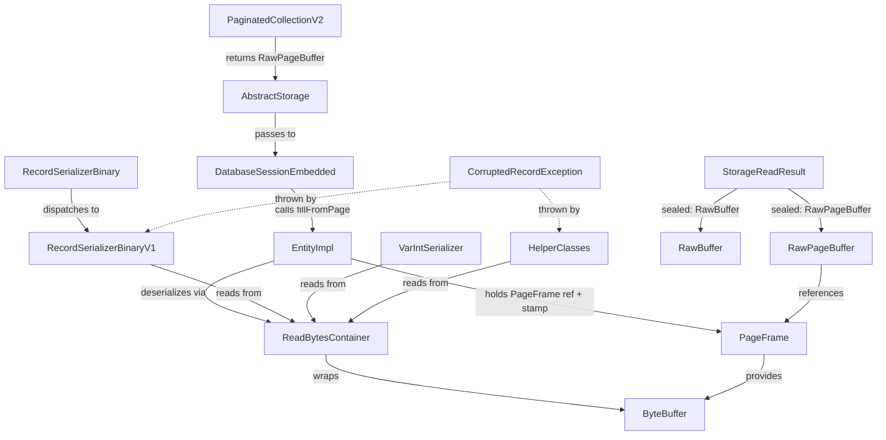

# Zero-Copy Record Deserialization via PageFrame References — Architecture Decision Record

## Summary

Eliminates byte[] copying on the record read path for single-page records by
threading a PageFrame reference from the disk cache through the storage layer
into EntityImpl. Property deserialization reads directly from the PageFrame's
ByteBuffer; a StampedLock stamp validates data consistency after speculative
deserialization. On invalidation, a one-shot fallback re-reads the record into
byte[] as before.

## Goals

- **Eliminate byte[] allocation on hot read path** — achieved for single-page
  records on the optimistic path. The byte[] `fromStream` path was also
  rerouted through `ReadBytesContainer` internally, unifying deserialization code.
- **Prevent OOM from corrupted records** — achieved via 17 guard allocation
  sites throwing `CorruptedRecordException`.
- **Type-safe storage read dispatch** — achieved via sealed `StorageReadResult`
  interface with pattern matching in `DatabaseSessionEmbedded`.
- **Lazy deserialization from PageFrame** — achieved in EntityImpl with stamp
  validation and one-shot byte[] fallback.

No goals were descoped or changed during implementation.

## Constraints

All original constraints were upheld:
- Multi-page records fall back to the byte[] path (enforced in
  `doReadRecordOptimisticInner` via nextPagePointer check).
- Write path remains unchanged — `BytesContainer` is untouched.
- StampedLock semantics preserved — the deserialization-time validation is
  independent of the storage-level optimistic read validation.
- Session required for fallback — `reReadFromStorage()` uses the active session's
  storage and atomic operation.
- Guard allocations validate all stream-driven sizes against `remaining()`.

**New constraint discovered**: Link bag element counts are metadata, not
buffer-consuming data. BTree-based bags store elements in the BTree, so
`count > remaining()` produces false positives. These sites use `< 0` only.

## Architecture Notes

### Component Map

- **ReadBytesContainer** — final class, ByteBuffer-backed, read-only. Three
  constructors: `ByteBuffer` (zero-copy), `byte[]` (full wrap), `byte[], offset`
  (skip version byte). Provides position-tracked reads with OOM guards.
- **BytesContainer** — unchanged, write-path only.
- **StorageReadResult** — sealed interface with `recordVersion()`,
  `recordType()`, and `toRawBuffer()` default method. `RawBuffer` (byte[])
  and `RawPageBuffer` (PageFrame + coordinates) are the two variants.
- **RawPageBuffer** — record with compact constructor validation (non-null
  pageFrame, non-negative offsets, overflow-safe bounds via `Math.addExact`).
  `sliceContent()` returns an independent ByteBuffer view.
- **CollectionPage** — `RECORD_METADATA_HEADER_SIZE` (13B) and
  `RECORD_TAIL_SIZE` (9B) constants, plus `getRecordContentOffset()` and
  `getRecordContentLength()` methods.
- **EntityImpl** — four PageFrame fields, `fillFromPage()`, `clearPageFrame()`,
  `deserializeFromPageFrame()`, `reReadFromStorage()`,
  `checkDeserializedProperties()`. Lifecycle guards in 7+ methods.
- **CorruptedRecordException** — extends `DatabaseException`, 4 constructors.

### Decision Records

#### D1: ByteBuffer-backed ReadBytesContainer instead of byte[] BytesContainer

Implemented as planned. `ReadBytesContainer` is a final class with no virtual
dispatch. The `getInternedString` signature was changed from
`(DatabaseSessionEmbedded, int)` to `(StringCache, int)` for decoupling — the
`StringCache` is resolved once per `deserialize()`/`deserializePartial()` call
via a `resolveStringCache()` helper.

Additionally, the byte[] `fromStream` in `RecordSerializerBinary` was wired
through `ReadBytesContainer` internally — `new ReadBytesContainer(source, 1)`
skips the version byte. This made all 566 existing test classes exercise the
new deserialization path without any test changes.

#### D2: One-shot PageFrame with permanent byte[] fallback on invalidation

Implemented as planned. The speculative deserialization pattern:
1. Capture PageFrame fields in local variables (needed because `clearSource()`
   during full deser triggers `clearPageFrame()`)
2. Read version byte + create ReadBytesContainer from PageFrame slice
3. Call serializer's `fromStream()` speculatively
4. Catch `RuntimeException` → treat as torn page, fall back
5. Validate stamp → if invalid, clear PageFrame, `reReadFromStorage()`,
   re-enter `deserializeProperties()` on byte[] path

No retry logic. One stamp check per deserialization call.

#### D3: Sealed interface for storage read result

Implemented as planned. `StorageReadResult` is a sealed interface with
`RawBuffer` and `RawPageBuffer`. A `toRawBuffer()` default method was added
(not in original plan) for callers that always need byte[] — uses pattern
matching internally. This replaced direct `(RawBuffer)` casts at 4 production
sites (`CollectionBasedStorageConfiguration`, `DatabaseCompare`) and 30+ test
sites.

The `readRecord()` return type changed from `RawBuffer` to `StorageReadResult`
across `Storage`, `StorageCollection`, `AbstractStorage`, and
`PaginatedCollectionV2`.

#### D4: Guard allocations via remaining-bytes check

Implemented with one refinement: link bag sizes use `< 0` only (not
`> remaining()`). BTree-based link bags store element counts as metadata — a bag
with 45 elements may need only ~6 bytes in the buffer. The
`linkBagSize > remaining()` check caused false positives on valid data. All
other 15 guard sites use the full `size < 0 || size > remaining()` pattern.

DECIMAL guard accounts for 8-byte header offset after seek-back (tightened
during track-level code review).

#### D5: toRawBuffer() default method on StorageReadResult (new)

Emerged during Track 4 when all callers casting `readRecord()` to `(RawBuffer)`
needed updating for the new `StorageReadResult` return type. Instead of
scattering casts, a `toRawBuffer()` default method provides polymorphic
conversion: returns itself for `RawBuffer`, extracts bytes via
`sliceContent()` for `RawPageBuffer`.

#### D6: PageFrame fields on EntityImpl, not RecordAbstract (new)

Only `EntityImpl` uses `deserializeProperties()` — the PageFrame lazy
deserialization path. Placing fields on `RecordAbstract` would add unused state
to `Blob` and other record types. Non-EntityImpl records (Blob) extract bytes
immediately in `executeReadRecord()` via `toRawBuffer()`.

### Invariants

- Deserialization from a validated PageFrame stamp produces identical results to
  deserialization from the equivalent byte[] copy.
- Guard checks reject any stream-driven size that exceeds `remaining()` bytes
  (or is negative) before allocation.
- After stamp invalidation fallback, EntityImpl holds no PageFrame reference
  (GC-safe).
- Multi-page records never take the PageFrame zero-copy path.
- The write/serialization path remains unchanged (BytesContainer).
- PageFrame fields are cleared in all lifecycle transitions: `internalReset()`,
  `fill()`, `fromStream()`, `clearSource()`, `setDirty()`,
  `setDirtyNoChanged()`.

### Integration Points

- `PaginatedCollectionV2.doReadRecordOptimisticInner()` — returns
  `RawPageBuffer` for single-page records on the optimistic path.
- `DatabaseSessionEmbedded.executeReadRecord()` — pattern matches on sealed
  `StorageReadResult` to dispatch fill path (EntityImpl → `fillFromPage()`,
  non-EntityImpl → `toRawBuffer()` + byte[] path).
- `EntityImpl.deserializeProperties()` — PageFrame branch delegates to
  `deserializeFromPageFrame()` for speculative deserialization.
- `RecordSerializerBinary.fromStream(byte[])` — internally wraps in
  `ReadBytesContainer(source, 1)`, unifying both paths.

### Non-Goals

- Modifying the write/serialization path or `BytesContainer` for writes.
- Zero-copy for multi-page records (remain on byte[] path).
- Changes to the V2 serializer (separate branch).
- Retry logic for stamp invalidation (one-shot by design decision D2).

## Key Discoveries

- **clearSource() triggers clearPageFrame()**: During full deserialization,
  `RecordSerializerBinaryV1.deserialize()` calls `clearSource()` on the entity,
  which triggers `clearPageFrame()`. PageFrame fields must be captured in local
  variables before the serializer call, otherwise stamp validation reads zeroed
  fields.

- **fillFromPage's checkForBinding() rejects NOT_LOADED**: Factory-created
  records have NOT_LOADED status. `checkForBinding()` rejects this status, but
  `getSession()` with pattern matching works. The `fillFromPage()` method uses
  `getSession()` instead of `checkForBinding()`.

- **recordType must accept 'v' and 'e'**: The original assertion only checked
  for document type 'd'. Vertex ('v') and edge ('e') records also take the
  PageFrame path — assertions were updated.

- **BTree link bag false positives**: `linkBagSize` is an element count stored
  as metadata. For BTree-based bags, elements live in the BTree, not in the
  serialized buffer. A BTree bag with 45 elements needs only ~6 bytes
  (fileId + linkBagId pointers), so `45 > remaining=6` was a false positive.
  Fixed by using only the `< 0` negativity guard for link bag sizes.

- **Optimistic read requires warm read cache**: The optimistic read path
  requires pages to already be in the read cache. The first load after database
  reopen always goes through the pinned path. Tests needed a warmup step (load
  records once via pinned path) before zero-copy reads could be exercised.

- **CollectionPage.appendRecord stores raw bytes**: The metadata header and
  chunk tail are added by `PaginatedCollectionV2` before calling
  `appendRecord()`. Tests building page content directly must construct properly
  formatted chunks.

- **StringCache.getString() dead throws declaration**: The method declared
  `throws UnsupportedEncodingException` despite using `StandardCharsets.UTF_8`
  which never throws. Cleaned up the declaration and all callers.

- **readLinkMap NPE**: Pre-existing bug where `readLinkMap` with
  `justRunThrough=true` could NPE due to missing null guard. Fixed in the
  `ReadBytesContainer` overload.

- **DECIMAL extraction optimization**: Original code extracted the entire
  remaining buffer for DECIMAL; optimized to read exact size from the 8-byte
  header (scale:4B + unscaledLen:4B + unscaled bytes).

- **readEmbeddedLinkBag uses continueFlag loop**: Not a counted loop — it reads
  entries until a continue flag is false. No guard needed on the counter; it's
  already guarded at callers (`readLinkSet`, `readLinkBag`).
