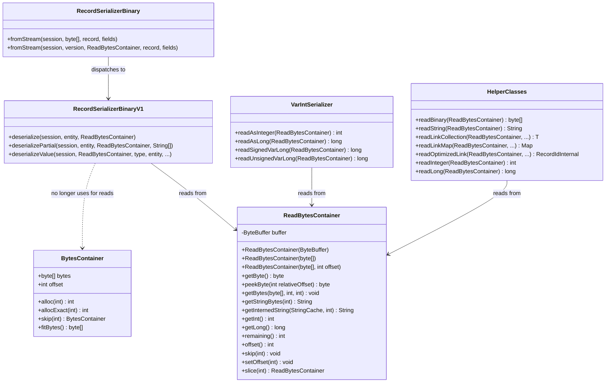
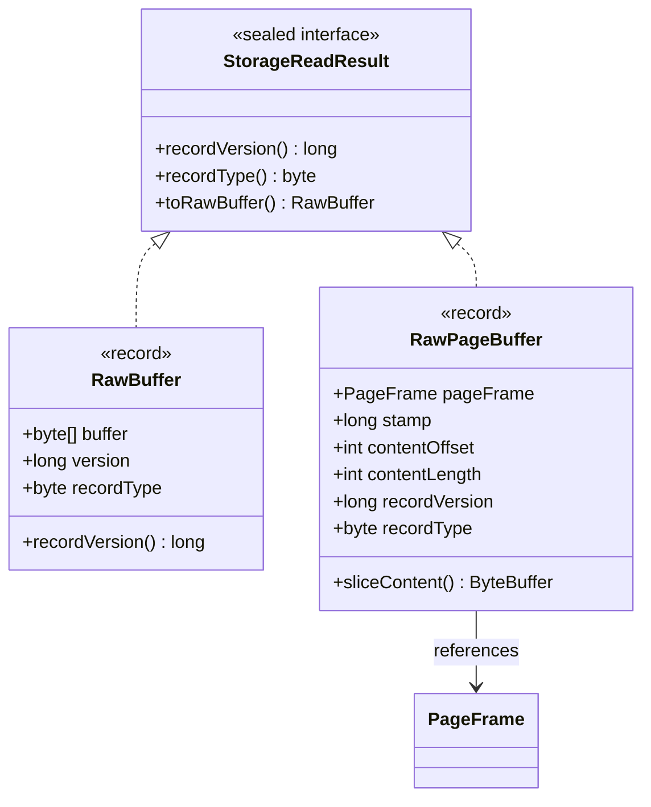
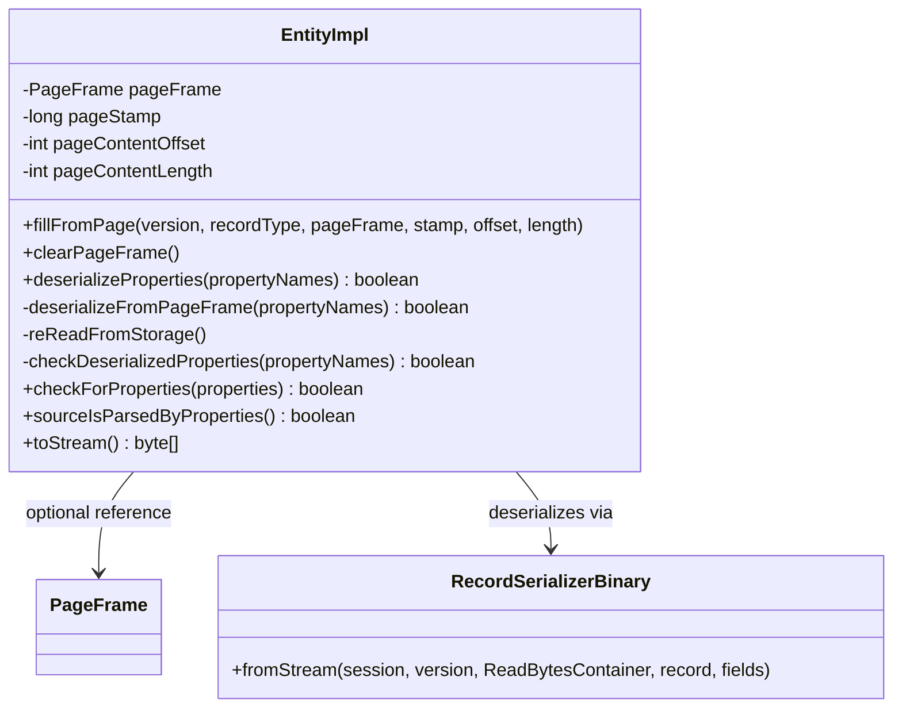
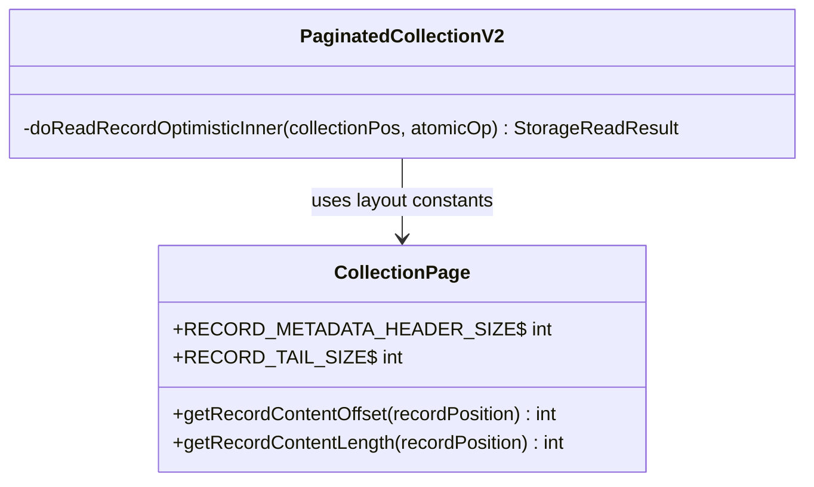
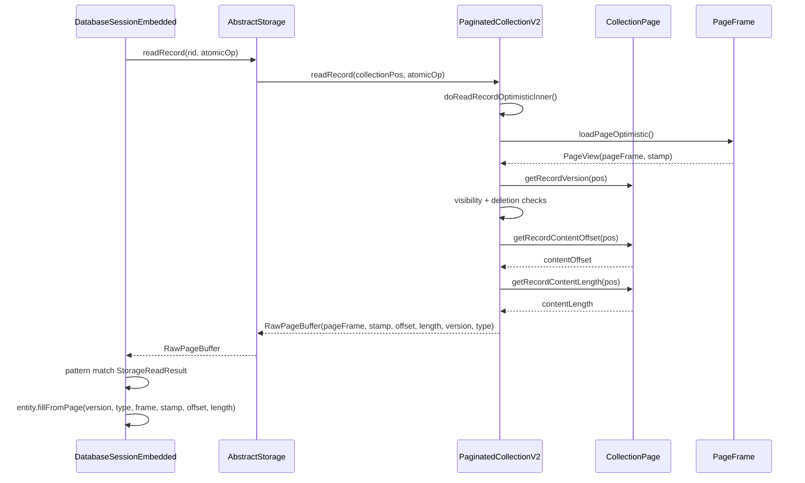
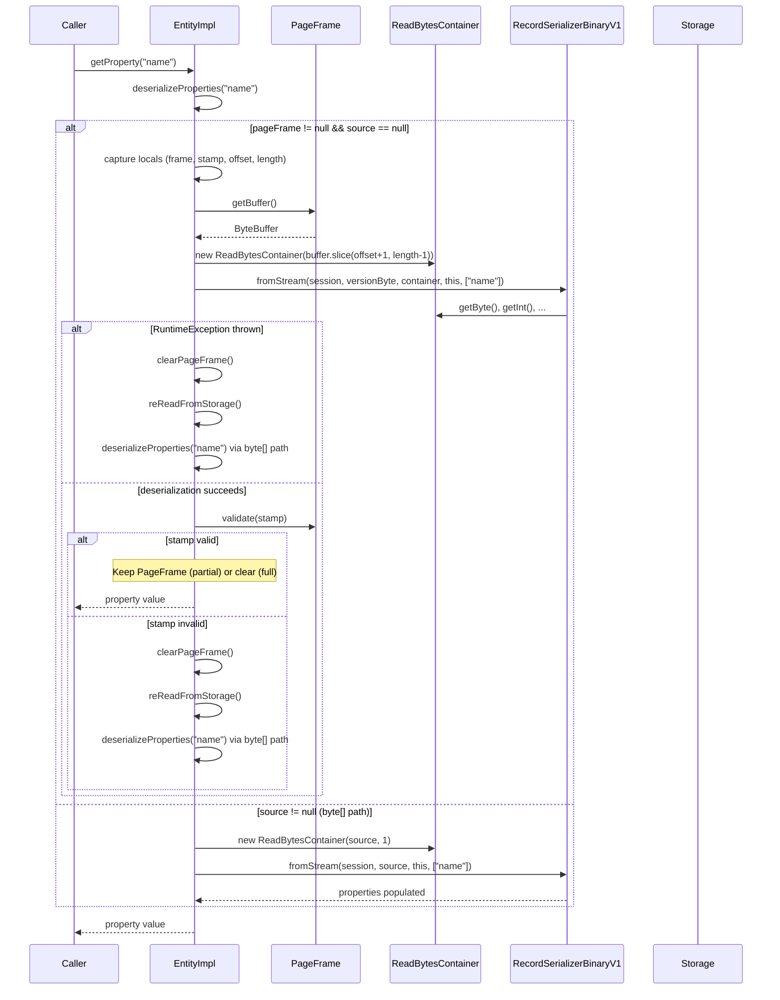
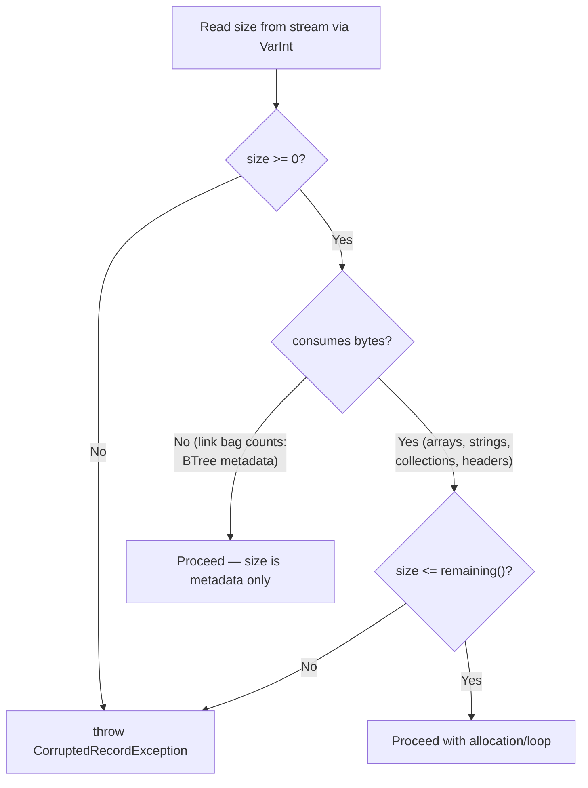

# Zero-Copy Record Deserialization via PageFrame References — Final Design

## Overview

This feature eliminates byte[] copying on the record read path by keeping a
reference to the disk cache PageFrame in EntityImpl. For single-page records on
the optimistic read path, the storage layer returns a `RawPageBuffer` carrying
PageFrame coordinates instead of copying bytes. EntityImpl stores these
coordinates and deserializes directly from the PageFrame's ByteBuffer at
property-access time. A StampedLock stamp captured during the optimistic read is
validated after speculative deserialization; on invalidation, a one-shot fallback
re-reads the record through the pinned storage path into byte[].

The implementation touches four layers:
1. **Deserialization container** — `ReadBytesContainer` replaces byte[]-backed
   `BytesContainer` for all reads
2. **Guard allocations** — `CorruptedRecordException` prevents OOM from
   corrupted size fields
3. **Storage read result** — sealed `StorageReadResult` interface with
   `RawBuffer` and `RawPageBuffer` variants
4. **EntityImpl lifecycle** — PageFrame fields, speculative deserialization,
   stamp validation, and fallback

Deviations from the original design are minor: `getInternedString` accepts
`StringCache` instead of `DatabaseSessionEmbedded`, the byte[] `fromStream`
path was wired through `ReadBytesContainer` internally (making all 566 existing
tests exercise the new path), and link bag guards use `< 0` only (not
`> remaining()`) because BTree-based bags store element counts as metadata, not
buffer-consuming data.

## Class Design

### Deserialization Container Split

`ReadBytesContainer` is a `final` class wrapping a `ByteBuffer` (direct or
heap). Three constructors support the zero-copy path (`ByteBuffer` from
PageFrame), the fallback path (`byte[]`), and the legacy entry point
(`byte[], int offset`). The byte[] `fromStream` in `RecordSerializerBinary`
creates a `ReadBytesContainer(source, 1)` (skipping the version byte), so both
paths converge to the same deserialization code.

`BytesContainer` remains unchanged and is used exclusively by the
serialization (write) path.

Key API methods replace direct array access patterns:
- `getByte()` replaces `bytes.bytes[bytes.offset++]`
- `peekByte(relativeOffset)` replaces `bytes.bytes[bytes.offset + j]` for
  field name matching without advancing position
- `getInt()`/`getLong()` provide zero-allocation big-endian reads
- `getInternedString(StringCache, len)` replaces
  `stringFromBytesIntern(session, bytes.bytes, offset, len)` — accepts
  `StringCache` directly for decoupling from `DatabaseSessionEmbedded`
- `remaining()` enables guard allocation checks against buffer capacity

### Storage Read Result Hierarchy

`StorageReadResult` is a sealed interface permitting `RawBuffer` and
`RawPageBuffer`. The `toRawBuffer()` default method uses pattern matching to
either return itself (`RawBuffer`) or extract bytes from the PageFrame
(`RawPageBuffer.sliceContent()` → `new RawBuffer(...)`). This is used by
callers that always need byte[] (storage config, database compare, non-EntityImpl
records like Blob).

`RawPageBuffer`'s compact constructor validates: non-null pageFrame,
non-negative contentOffset and contentLength, overflow-safe bounds check
(`Math.addExact(contentOffset, contentLength) <= pageFrame.getBuffer().capacity()`).

### EntityImpl State Extensions

EntityImpl holds four PageFrame-related fields (all on EntityImpl, not
RecordAbstract, since only EntityImpl uses `deserializeProperties()`).
`fillFromPage()` sets these fields instead of `source`; `clearPageFrame()` nulls
them. The PageFrame is cleared in all lifecycle transitions: `internalReset()`,
`fill()`, `fromStream()`, `clearSource()`, `setDirty()`, `setDirtyNoChanged()`.

### CollectionPage Layout Constants

`RECORD_METADATA_HEADER_SIZE` (13 bytes: recordType + contentSize +
collectionPosition) and `RECORD_TAIL_SIZE` (9 bytes: firstRecordFlag +
nextPagePointer) are public constants on `CollectionPage`.
`getRecordContentOffset()` computes the absolute byte offset to content within
the page buffer. `getRecordContentLength()` derives content length from record
size minus header and tail. Both have assertion preconditions for non-deleted,
first-chunk records.

## Workflow

### Optimistic Read Path (Zero-Copy)

On the optimistic single-page path, `PaginatedCollectionV2.doReadRecordOptimisticInner()`
validates record status, visibility, deletion, minimum size, first-chunk flag,
and single-page constraint (nextPagePointer < 0). It then constructs a
`RawPageBuffer` with page coordinates instead of copying bytes.
`DatabaseSessionEmbedded.executeReadRecord()` pattern-matches: `RawBuffer` takes
the existing fill+fromStream path; `RawPageBuffer` with `EntityImpl` calls
`fillFromPage()` for lazy deserialization; `RawPageBuffer` with non-EntityImpl
(Blob) extracts bytes via `toRawBuffer()`.

### Property Deserialization with Stamp Validation

The deserialization flow captures PageFrame fields in local variables before
calling the serializer (because `clearSource()` during full deserialization
triggers `clearPageFrame()`, zeroing the entity's fields). The serializer
version byte is read from the absolute buffer position; the remaining content is
sliced into a `ReadBytesContainer`. On `RuntimeException` (torn page from
concurrent modification) or stamp invalidation, the fallback path calls
`reReadFromStorage()` which re-reads via the pinned storage path, calls
`fill()` + `fromStream()` to populate `source`, and re-enters
`deserializeProperties()` on the byte[] path.

### Guard Allocation Check Flow

Guard checks are applied at 17 sites across `HelperClasses` (4 sites) and
`RecordSerializerBinaryV1` (13 sites). The pattern is
`if (size < 0 || size > bytes.remaining()) throw new CorruptedRecordException(...)`.
Link bag sizes (`readLinkSet`, `readLinkBag`) use only `< 0` checks because
BTree-based bags store element counts as metadata — the actual elements live in
the BTree, not in the buffer.

## Stamp Validation and Memory Safety

The StampedLock optimistic read protocol guarantees that `validate(stamp)`
returns `false` if any exclusive lock was acquired since the stamp was issued.
This covers page modification, eviction, and frame reuse. `PageFramePool`
recycles frames (never deallocates), so stale frames always point to valid
mapped memory.

**Critical ordering**: `validate(stamp)` is called AFTER reading all data from
the PageFrame buffer — the same pattern as `executeOptimisticStorageRead` in
`DurableComponent`. The speculative deserialization completes fully before
validation. If a concurrent write produced torn data, the guard allocation
checks (via `CorruptedRecordException`) catch it before stamp validation.

**Local variable capture**: PageFrame fields must be captured in locals before
calling the serializer because `RecordSerializerBinaryV1.deserialize()` calls
`clearSource()` → `clearPageFrame()` as part of full deserialization. Without
local capture, the stamp validation after deserialization would read zeroed
fields.

## Partial Deserialization and Fallback Interaction

EntityImpl supports partial deserialization — requesting specific properties by
name. The PageFrame lifecycle mirrors the existing `source` (byte[]) lifecycle:

- **Partial call (stamp valid)**: Deserialize requested properties from
  PageFrame. Keep PageFrame reference for subsequent calls — `deserializePartial()`
  does not call `clearSource()`, so PageFrame is retained.
- **Subsequent partial call (stamp still valid)**: Deserialize additional
  properties from the same PageFrame.
- **Partial call (stamp invalid)**: Clear PageFrame, re-read into byte[], store
  as `source`. Future partial calls use byte[] path.
- **Full deserialization (stamp valid)**: `deserialize()` calls
  `clearSource()` → `clearPageFrame()`. Properties are fully populated.
- **Full deserialization (stamp invalid)**: Clear PageFrame, re-read, the byte[]
  `deserialize()` calls `clearSource()` after parsing.

The `checkDeserializedProperties()` method validates that partial deserialization
found at least one requested property — extracted from duplicated inline logic
into a shared method during Track 5.

## Guard Allocation Strategy

`CorruptedRecordException` extends `DatabaseException` with four constructor
signatures (copy, message-only, dbName+message, session+message). Guards are
placed at every site where a VarInt-decoded size drives an allocation or loop:

| Category | Guard pattern | Sites |
|---|---|---|
| Byte-consuming sizes (arrays, strings, collections, headers) | `size < 0 \|\| size > remaining()` | 15 sites |
| Metadata-only counts (link bag element counts for BTree bags) | `size < 0` | 2 sites |

The distinction exists because BTree-based link bags store the element count as
metadata — elements live in the BTree, not in the serialized buffer. A bag with
45 elements may need only ~6 bytes in the buffer (fileId + linkBagId pointers),
so `45 > remaining=6` would be a false positive.
