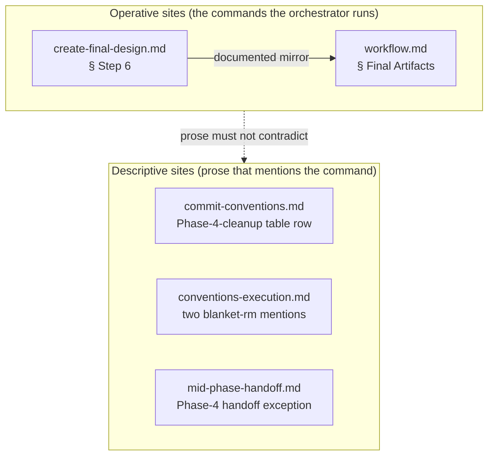

# Robust Phase-4 `_workflow/` cleanup — Architecture Decision Record

## Summary

The Phase-4 cleanup command that removes a branch's `_workflow/` scaffolding tree was a bare `git rm -r docs/adr/<dir-name>/_workflow/`. `git rm -r` aborts on a tracked file with uncommitted modifications and never touches untracked files, so on a real Phase-4 run it fails partway: the `edit-design` final-design loop leaves `design-mutations.md` tracked-but-modified, while the cold-read output files, the per-round params files, and `.pyc` caches sit untracked under `_workflow/`. The fix makes the cleanup robust — `git rm -rf docs/adr/<dir-name>/_workflow/` followed by `rm -rf docs/adr/<dir-name>/_workflow/` — at the two operative command sites, and reconciles four descriptive mentions so no doc contradicts the fix. The change is prose-only across five `.claude/workflow/` files. It closes YTDB-1180 and its four duplicates YTDB-868, YTDB-902, YTDB-1055, and YTDB-1135.

## Goals

- Phase-4 cleanup runs to completion on a dirty `_workflow/` tree — a tracked-but-modified file plus untracked siblings — leaving `git status` clean and no `_workflow/` content on disk.
- Every doc that describes the cleanup command tells one story after the fix; no prose still claims the recursive `git rm` sweeps untracked files.
- The two existing contracts hold: the cleanup stays a single commit, and the caution against a separate `plan/*`-glob delete is preserved.

## Constraints

- The branch is workflow-modifying in `§1.7` staged mode: edits accumulate under the staged mirror subtree and promote to the live `.claude/workflow/**` files only at the Phase-4 promote step. The live docs stay at `develop` state through implementation and review.
- A workflow-prose change has no automated test. Acceptance is a grep gate plus a documented Phase-4 dry-run.
- Scope is bounded to five files. A sixth `git rm -r` grep match, in a test fixture under `.claude/scripts/tests/`, is illustrative finding-body text that exercises a count-validation regex, not a live instruction, and stays untouched.

## Architecture Notes

### Component Map

- The two operative sites carry the actual command block and must stay in step: they are documented mirrors, so a change to one alone reintroduces the contradiction.
- The descriptive sites mention the command in prose. Two of them (in `create-final-design.md` and `workflow.md`, alongside their operative blocks) asserted the recursive `git rm` "sweeps the review-file directories automatically" — true only for tracked files. The fix splits that claim: `git rm -rf` sweeps the tracked files, and the follow-up `rm -rf` clears the untracked remnants.

### Decision Records

**D1 — Robust cleanup command (`git rm -rf` + `rm -rf`).**
Change the cleanup to `git rm -rf docs/adr/<dir-name>/_workflow/` followed by `rm -rf docs/adr/<dir-name>/_workflow/`, rather than eliminating the sources of the dirty state. The alternatives were (b) dropping the `edit-design` `design-mutations.md` log write so that file is never modified — the older YTDB-868 / YTDB-902 proposal — and (c) committing `_workflow/` before cleanup so nothing is modified or untracked. Only the robust command also clears the *untracked* remnants — the cold-read output files, the per-round params files, and the `.pyc` caches — which exist independently of the `design-mutations.md` append and which (b) and (c) both leave behind. The `-f` flag lets `git rm` delete the tracked-but-modified file; the follow-up `rm -rf` clears what `git rm` cannot reach. Force-discarding local modifications is safe here because the whole subtree is being deleted, so discarding uncommitted changes to a file about to be removed loses nothing. The `rm -rf` runs inside the same cleanup step and adds no commit, so the single-commit contract holds. Its blast radius is bounded by Phase-4 step ordering: cleanup runs *after* the promote step has copied the staged subtree onto the live tree and committed it, so `rm -rf` discards only an already-promoted, already-committed copy under `_workflow/` — never the live workflow files, and never `design-final.md` / `adr.md`, which live at `docs/adr/<dir-name>/` outside `_workflow/`. Implemented in commit `a989816b40`.

**D2 — Reconcile every descriptive mention, not only the two commands.**
Fix the two operative sites *and* correct the "sweeps automatically" prose plus the descriptive mentions in the other three files, so no doc contradicts the fix. The alternative was to fix only the operative commands and leave the prose. The "sweeps the review-file directories automatically" text is true only for tracked files; left in place after the fix it creates an internal contradiction a consistency reviewer would flag. Reconciling the descriptive rows keeps every doc telling one story. Scope stays bounded to the five files. Implemented in commit `a989816b40`.

**D3 — `§1.7` mode: stage, not the prose-rule opt-out.**
The branch uses `§1.7` staged mode — edits accumulate under the staged mirror and promote at Phase 4 — rather than the `§1.7(k)` prose-rule self-application opt-out that edits `.claude/workflow/**` live. The opt-out qualifies a plan only when *every* edited file's in-branch consumer is judgment-layer prose (style rules, review criteria, prompt blurbs); its second criterion keeps a file that a running phase reads as executable procedure staged even on an otherwise-qualifying plan. Both operative sites here are Phase-4 execution procedure the orchestrator runs, not judgment-layer prose, so that criterion fails and the opt-out does not apply. A consequence: staging means the fix does not self-apply to this branch's own Phase 4 — staged edits go live only at the promote step. That gap is inert for this branch, because the promote step lands before cleanup (so this branch's cleanup runs the fixed command) and `design_gate=no` produces no `design-mutations.md` or per-round params to trip the old command. The gap is a pre-existing property of `design_gate=yes` staged branches. Implemented in commit `a989816b40`.

### Invariants & Contracts

- No bare `git rm -r` (without `-f`) remains for the `_workflow/` cleanup at any in-scope site, operative or descriptive. Verified by `grep -rnE "git rm -r([^f]|$)" .claude/workflow` returning no match. The pattern spans every bug shape — `git rm -r docs/adr/…`, `git rm -r _workflow/`, and the inline `` `git rm -r`s `` mention — and excludes `git rm -rf`, so a partial fix that updated only the operative sites cannot pass while a descriptive site still carries the bare command.
- Both operative command blocks carry `git rm -rf docs/adr/<dir-name>/_workflow/` followed by `rm -rf docs/adr/<dir-name>/_workflow/`, with a one-line rationale.
- The cleanup stays a single commit: the added `rm -rf` operates on files that are untracked or already staged for deletion, so it introduces no second commit.
- The existing warning against a separate `plan/*`-glob removal is preserved — a bare `plan/*` glob would catch the `plan/track-N.md` files, which the blanket recursive delete already handles.
- After the cleanup step, `git status` is clean and no `_workflow/` content, tracked or untracked, remains on disk. Verified by a documented Phase-4 dry-run.

### Non-Goals

- Not eliminating the sources of the dirty state (rejected D1 alternatives (b) and (c)) — the robust command supersedes them and also handles the untracked remnants they leave behind.
- No `edit-design` `SKILL.md` change: the robust command supersedes the older "skip the `design-mutations.md` log write" proposal, so the logging behavior stays as is.

## Key Discoveries

- An empirical git repro confirmed the three-part diagnosis: with a modified tracked file plus an untracked sibling under a directory, `git rm -r <dir>` exits 1 on the modified file; `git rm -rf <dir>` succeeds but leaves the untracked sibling; a follow-up `rm -rf <dir>` clears it. All three arms are needed.
- The follow-up-`rm -rf` rationale must scope "under `staged-workflow/`" to the `.pyc` caches only. The cold-read output and per-round params live directly under `_workflow/`, not under `staged-workflow/`. A rationale that mis-scopes all untracked remnants under `staged-workflow/` is a latent invitation for a future editor to narrow the delete and reintroduce the bug.
- The bug had a five-issue duplicate cluster (YTDB-868, YTDB-902, YTDB-1055, YTDB-1135, YTDB-1180). The fix matches the union of all five; YTDB-1180 is the retained tracker.
- For a `§1.7` staged-mode branch, the cumulative diff stat is misleading. Five freshly-staged whole-file copies read as ~3,093 insertions while the real change surface is ~15 delta lines. A staged whole-file copy inflates the stat by an order of magnitude, so the oversize-track signal is unreliable for staged-mode branches and should be read as a copy artifact, not a size warning.

## Adversarial gate verdicts

The pre-code adversarial gate over the research log passed. It cleared at the second attempt: the first returned NEEDS REVISION with 0 blockers, 1 should-fix, and 2 suggestions; the should-fix and suggestions were addressed in the research log and re-challenged; the second attempt returned PASS with all prior findings verified and no new findings. No blocker ever fired — the core fix survived adversarial scrutiny unchanged.

## Token usage telemetry

Snapshot from this worktree's sessions over its lifetime (N=6 sessions across 30 transcripts).

### Tool mix — share of total session context

| Component             | Share |
|-----------------------|------:|
| `Read` tool results   | 63.5% |
| `Bash` tool results   | 7.4% |
| `Grep` tool results   | 0.1% |
| `Edit` tool results   | 0.3% |
| Other tool results    | 5.0% |
| Prompts and output    | 23.7% |

### Top files by share of `Read` token consumption

| File                                            | Share of Read |
|-------------------------------------------------|--------------:|
| docs/adr/workflow-scaffolding-fix/_workflow/plan/track-1.md | 23.4% |
| .claude/workflow/prompts/adversarial-review.md  | 6.9% |
| .claude/workflow/implementer-rules.md           | 6.4% |
| .claude/workflow/self-improvement-reflection.md | 6.0% |
| .claude/output-styles/house-style.md            | 5.3% |
| .claude/workflow/conventions.md                 | 4.7% |
| <outside-worktree>                              | 4.6% |
| .claude/workflow/track-code-review.md           | 4.2% |
| docs/adr/workflow-scaffolding-fix/_workflow/research-log.md | 4.2% |
| .claude/workflow/workflow.md                    | 3.8% |

Generated by `.claude/scripts/measure-read-share.py` against
`~/.claude/projects/-home-andrii0lomakin-Projects-ytdb-workflow-scaffolding-fix/`.
