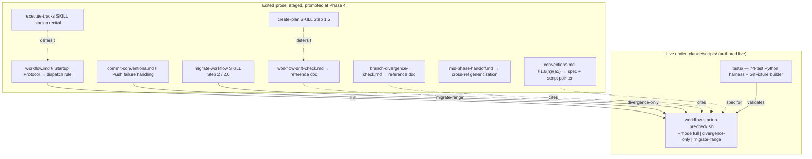

# Workflow startup precheck — Architecture Decision Record

## Summary

The workflow's session-startup gates (`/execute-tracks` and `/create-plan`)
used to read roughly 1,200 lines of detection prose at every session start —
`workflow.md § Startup Protocol`, `branch-divergence-check.md`,
`workflow-drift-check.md`, and the resume bits of `mid-phase-handoff.md` — just
to answer two questions: which phase does this session resume into, and is
anything blocking it.

This change moves the mechanical detection into one script,
`.claude/scripts/workflow-startup-precheck.sh` (bash + jq). The script emits a
single JSON blob describing branch divergence, workflow-format drift, pending
handoffs, the resume state, and any autonomous mutation it performed; the agent
parses that blob and runs only the conversational gate UX the script reports.
The gate prose shrank to a short agent-side dispatch rule. A `--mode
{full,divergence-only,migrate-range}` flag selects which detection runs and
which JSON shape the script emits. The script ships with a 74-test Python
harness under `.claude/scripts/tests/`. The edited prose surfaces were staged
under `_workflow/staged-workflow/` for the branch's lifetime and promote onto
the live tree at this Phase 4 commit; the script itself was authored live.

## Goals

- **One behavioral home for startup detection.** Achieved: branch-divergence
  detection, the two-phase drift walk, the no-drift normalization commit, and
  resume-state determination all live in the script.
- **Free startup context by replacing gate prose with a dispatch rule.**
  Achieved structurally: `workflow.md § Startup Protocol` is now a dispatch
  rule over the JSON's five keys, and the two detection-gate docs shrank to
  reference docs that cite the script.
- **Behavior parity for all four gate paths and every resume state.** Achieved,
  with one acknowledged parity-delta: the `full`-mode startup fetch is bounded
  by `timeout 10` so it cannot hang session startup, which diverges from the
  byte-source's unbounded fetch only on a slow-but-reachable remote past ten
  seconds (the per-commit push re-check still catches the missed divergence).
- **Collapse the four byte-copies of the `§1.6(h)` artifact walk to one
  implementation plus one readable spec.** Achieved: `conventions.md §1.6(h)`
  keeps the bash as the spec; the script is the single implementation; a
  conformance fixture pins the script's walk to the spec.

## Constraints

- The script requires `jq` (present, v1.8.1); no jq-free JSON emitter.
- The script never prompts and never performs force-push or `git reset`; those
  stay agent-side and user-gated. Held.
- Live `.claude/workflow/**` and `.claude/skills/**` stayed at develop state
  for the whole branch, so the branch's own `/execute-tracks` sessions ran the
  existing inline-bash path, not the new script. Held.
- **Relaxed during execution:** the "a prose-consolidation effort does not
  touch the live script" boundary was crossed once. A repeatable `--exclude-sha`
  flag was added to the live script while rewriting the migration prose, because
  the agent-side merge-base-failure recovery loop could not otherwise terminate
  (see D2 and Key Discoveries). This is sound under the staging asymmetry: the
  script is inert on this branch, so the flag matters only once the staged prose
  promotes.

## Architecture Notes

### Component Map

The change ships two live artifacts under `.claude/scripts/` and nine staged
prose surfaces that promote at Phase 4.

- **`workflow-startup-precheck.sh`** — the single behavioral home for startup
  detection. Detection functions (`detect_divergence`, `detect_drift` with
  `no_drift_normalization`, `scan_handoffs`, `determine_state`,
  `detect_migrate_range`) each write plain shell variables; one jq assembly
  point (`emit_json`) owns the JSON shape.
- **`.claude/scripts/tests/`** — a fixture-based Python harness (74 tests at
  merge) built on a reusable `GitFixture` builder, plus a `§1.6(h)` byte-source
  conformance check.
- **Staged prose surfaces** — nine files: six under `.claude/workflow/`
  (`workflow.md`, `workflow-drift-check.md`, `branch-divergence-check.md`,
  `conventions.md`, `commit-conventions.md`, `mid-phase-handoff.md`) and three
  SKILLs (`execute-tracks`, `create-plan`, `migrate-workflow`). The two consumer
  SKILLs reach the script by delegation: they defer to the rewritten
  `workflow.md` / `workflow-drift-check.md` rather than calling the script
  themselves, so the post-merge workflow describes one startup procedure.

### Decision Records

- **D1 — Script location and language.** A single bash + jq script under
  `.claude/scripts/`, alongside `statusline-command.sh` and `session-stats.py`.
  bash keeps the artifact walk close to the `§1.6(h)` spec it implements; jq
  makes JSON correct by construction. Implemented as planned. The script runs
  with no global `set -e`, matching the sibling scripts' defensive `|| true`
  posture over errexit.

- **D2 — Three run modes via a `--mode` flag.** `full` runs the whole startup
  precheck; `divergence-only` re-checks divergence after a mid-session push
  rejection; `migrate-range` emits the migration's stamp-fold range and
  per-artifact pairs. **Changed during execution:** `migrate-range` gained a
  repeatable `--exclude-sha <sha>` modifier (alongside the planned optional
  `--bootstrap-sha`). It drops named SHAs from the fold input so an agent-side
  re-invoke after a merge-base failure clears the failing pair instead of
  re-folding it forever. `--exclude-sha` is now a permanent part of the
  `migrate-range` contract: recovery prose passes one `--exclude-sha` per
  `merge_base_failed[].sha`.

- **D3 — `actions_taken` reports autonomous mutations only.** The script's only
  autonomous mutation is the no-drift normalization commit; force-push and reset
  stay agent-side because they are conversational and user-gated. Implemented as
  planned. The landed entry has the shape
  `{action, commit, subject}`, mirroring the `first_commits` `{sha, subject}`
  convention; every non-landing path leaves `actions_taken` empty.

- **D4 — `§1.6(h)` keeps the spec; the script implements it.** The four
  byte-copies of the artifact walk (`§1.6(h)`, the drift-check Detection block,
  and the migration's classify and range walks) collapse to one script
  implementation plus one readable spec. Implemented as planned. The migration's
  two range-derivation walks both collapsed onto `migrate-range`, holding the
  "four byte-copies → one" framing; the migration's stamp-*rewriting* steps stay
  agent-side and were not folded.

- **D5 — Walk-not-compute boundary.** The script absorbs the `§1.6(h)` walk that
  reads existing stamps at startup and migration, not the `§1.6(b)` create-time
  stamp computation that `/create-plan` and `edit-design` run when they author
  artifacts. Implemented as planned; the two stay in separate homes.

- **D6 — Staging asymmetry: staged prose, live script.** `§1.7(a)` scopes
  staging to `.claude/workflow/**` and `.claude/skills/**` only;
  `.claude/scripts/` is neither, so the script and tests were authored live
  while the prose edits staged. Implemented as planned. The one live-script
  change during prose work (`--exclude-sha`, D2) is sound under this asymmetry:
  nothing live calls `migrate-range` on this branch.

- **D7 — Fixtures cover every gate path and every state.** State determination
  parses markdown rather than git output, so it is the riskiest surface and
  earns the heaviest coverage: the four gate paths, every `state.phase`, all six
  State C sub-states plus the section-discrepancy edge, the normalization
  commit's subject and line-1-only diff shape (including the abort-restore), and
  the `§1.6(h)` byte-source conformance check. Implemented as planned across the
  74-test harness.

- **D8 — SKILL entry points reconciled.** The two consumer-layer entry points
  (`execute-tracks/SKILL.md` startup recital, `create-plan/SKILL.md` Step 1.5)
  were reconciled so the post-merge workflow describes one startup procedure.
  Added during execution (the original prose scope edited only the workflow
  docs, leaving `execute-tracks/SKILL.md` with a contradicting inline copy of
  the startup sequence). Realized as **delegation**: both SKILLs defer to the
  rewritten `workflow.md` / `workflow-drift-check.md` rather than calling the
  script directly.

### Invariants & Contracts

- **S1 — Behavior parity.** The script reaches the same on-disk outcomes as the
  old prose for all four gate paths and every resume state. Held, with the one
  acknowledged `timeout 10` fetch delta noted under Goals.
- **S2 — Script never prompts.** No mode reads stdin or asks the user; the
  conversational gate UX stays in the agent. Held.
- **S3 — Normalization commit unchanged.** Same subject (`Normalize
  workflow-sha stamps to <short>`), same line-1-only diff shape, same
  all-or-nothing abort-restore as the byte-source. Held; the commit additionally
  surfaces in `actions_taken`, the one intended behavior delta.
- **S4 — Staging invariant.** Live `.claude/workflow/**` and `.claude/skills/**`
  stayed at develop state for the whole branch until this Phase 4 promotion.
  Held.

### Integration Points

- `/execute-tracks` startup and `/create-plan` Step 1.5 consume `--mode full`
  JSON (`{divergence, drift, handoffs, state, actions_taken}`) by delegating to
  the rewritten `workflow.md` / `workflow-drift-check.md`.
- `commit-conventions.md § Push failure handling` re-runs `--mode
  divergence-only` (`{divergence, actions_taken}`) on a mid-session
  non-fast-forward push.
- `/migrate-workflow` Step 2 consumes `--mode migrate-range`
  (`{stamped_artifacts, unstamped_files, base_sha, log_range,
  merge_base_failed}`) with optional `--bootstrap-sha` and repeatable
  `--exclude-sha`. Because `log_range` is uncapped (the migration replays every
  workflow commit), the consumer reads the JSON from a `/tmp` file via offset/
  limit rather than inlining the whole blob.

### Non-Goals

- The script never prompts the user; the three-resolution gate UX stays agent-
  side (S2).
- The script never performs force-push or `git reset`; those stay agent-side and
  user-gated (D3).
- The script does not absorb `§1.6(b)` create-time stamp computation (D5).
- This branch does not run the new dispatch path end-to-end; the live workflow
  prose stayed at develop state and the new path goes live only for the first
  post-merge workflow-modifying branch (S4 / D6).

## Key Discoveries

**The JSON contract diverged from the planned design in three ways, all
reconciled in `design-final.md`.** The `state` object is `{phase, substate}`
with no `track` field — the active track number is computed internally to locate
the track file but not emitted, so the dispatch rule re-derives it from the plan
checklist. `state.substate` carries one of six slug strings
(`decomposition-pending`, `steps-partial`, `failed-step`,
`steps-done-review-pending`, `review-done-track-open`, plus the literal
`section-discrepancy`), not the verbose row gloss the planned design showed. And
`migrate-range` emits a flat five-key object (`stamped_artifacts`,
`unstamped_files`, `base_sha`, `log_range`, `merge_base_failed`) with no `drift`
wrapper and no `actions_taken`; `merge_base_failed` is an array of
`{base, sha, files}` objects, not a scalar flag.

**jq emitting `null` for an absent scalar is not automatic, and the idiom must
be exercised by a live witness.** A naive `--arg x "$VAR"` binds an empty shell
variable to the JSON empty string, never `null`; the load-bearing emit surface
in `emit_json` uses the explicit `($x | if . == "" then null else . end)` idiom
(with `... else tonumber end` for counts). Downstream `jq -e '.field == null'`
assertions depend on `null`, not `""`, so a test that pins the idiom against a
hard-coded `null` proves nothing — the migrate-range `base_sha` was deliberately
re-sourced from the fold so the idiom has a real empty-vs-present witness.

**The drift gate emits five `{detected, kind}` shapes, not four.** The
`{detected: false, kind: "stamped"}` no-drift steady state is the common startup
path, and an early version of the dispatch rule that enumerated only four
branches left it un-instructed. The dispatch rule was re-keyed to test
`drift.detected` first so it routes every shape the script emits.

**State parsing must run inline in the main shell, never inside `$(...)`.** The
parser's `parse_error` path calls `exit`, which a subshell swallows — it would
print the diagnostic but still exit 0 with a coerced state. The closed-enum
parse-error contract is total over the bounded `## Checklist` region (every
track line's glyph is validated, not just those up to the first `[ ]`), the
checkbox glob was broadened from a single-bracket-char match to `- [*]` so `[]`,
`[ x]`, and `[X]` route to `parse_error` instead of silently collapsing to State
0, and the section-heading match is trailing-whitespace-tolerant at all reading
sites.

**The State C sub-state is a joint read with a fixed precedence.** It reads the
track file's `## Progress` log, the `## Concrete Steps` roster, and the
plan-file track checkbox. The roster status checkbox cannot be read as the first
`[...]` on a line, because roster descriptions embed bracket tokens in prose;
the status anchors to the post-`risk:` tail per the immutable-roster grammar.
Precedence is `decomposition-pending` (short-circuit) → `section-discrepancy`
(a `[x]` roster step with no matching `Step N` Progress entry, joined by step
number, overrides normal routing) → `failed-step` → `steps-partial` →
`review-done-track-open` / `steps-done-review-pending`.

**The artifact walk appears three times in the script, so the conformance
harness keys on what each walk builds, not where it sits.** The Phase 1 drift
classification and the `migrate-range` walk both build the stamped set (the
latter additionally builds a `STAMPED_PAIRS` `file=sha` table so
`merge_base_failed[].files` can name the owning artifact); the no-drift
normalization recompute is a third walk that builds a `STAMPED_FILES` path list.
The conformance extractors distinguish them by presence of the pairs table and
by what each builds, so a fourth walk must extend the harness rather than rely on
position. The walk's canonical idiom closes the shell quote mid-path
(`"$PLAN_DIR/_workflow/plan/"track-*.md`), so the conformance normalizer strips
quotes, the `$PLAN_DIR` prefix, and the `ls` tail before comparing; the
branch-resolved `PLAN_DIR` is the one line that legitimately differs from the
`§1.6(h)` literal placeholder.

**The shared merge-base fold is parameterized by one axis: failure handling.**
`fold_stamps_to_base "break"` (used by `full`/drift) records the first failing
pair and stops; `fold_stamps_to_base "continue"` (used by `migrate-range`)
collects every failing pair. The continue-fold resets its running base on a
failure and re-seeds from the next stamp, so collecting two failing pairs
requires the walk order `[real, orphan, real, orphan]`, and because the
`§1.6(h)` `ls` sorts operands lexically, fixtures must stamp artifacts in that
sorted order.

**`--exclude-sha` exists because the recovery loop could not otherwise
terminate.** Without it, `detect_migrate_range` re-walked all stamps fresh on
every re-invoke and `--bootstrap-sha` only appended to the fold input, so a
stamp on a pruned or unreachable commit re-walked and re-failed every time,
exhausting the session-wide attempt cap on input the user cannot fix. The
repeatable `--exclude-sha` drops the named SHAs from the fold input so the
re-invoke clears the failing pair; a fixture proves a `--bootstrap-sha …
--exclude-sha …` re-invoke yields a clean `base_sha` and empty
`merge_base_failed`.

**Test infrastructure: any git-touching test must run inside the `GitFixture`
builder or it performs a real network fetch.** The builder gives each test a
hermetic `file://` bare remote with `GIT_CONFIG_GLOBAL`/`SYSTEM` isolation and a
`main` initial branch. Because the byte-source resolves the plan dir to
`docs/adr/<branch>` and the default fixture branch is `main`, fixture plan
artifacts live under `docs/adr/main/_workflow/`. Several real-commit helpers
(`plan_artifact`, `handoff`, `workflow_commit`, `staged_workflow_commit`,
`orphan_branch`) grew on the builder as the suite expanded.

**Two byte-faithful details protect the single JSON stdout channel and
portability.** The in-script normalization commit uses `git commit -q` so git's
summary cannot corrupt the JSON channel, and the line-1 stamp rewrite uses
`printf … ; tail -n +2` into a `.tmp`+`mv` rather than `sed -i`, avoiding the
BSD/GNU `sed -i` divergence. On a multi-SHA fold the reported `commit` (the new
commit hash) and the subject's `<short>` (the base-SHA abbreviation) are
genuinely distinct values.

**Two known-debt items are recorded for future work, both inherited from the
byte-source.** Guard 2's porcelain parse (`git status --porcelain | awk '{print
$2}'`) truncates the path of an untracked `_workflow/` file whose name contains
a space, so such a dirty file could slip past the guard meant to catch it; the
idiom is byte-identical to the `workflow-drift-check.md § No-drift
normalization` source and the fix site is that prose, not the script. Separately,
the normalization has no `trap` handler, so an interruption between the rewrite
and the guard check leaves a half-rewritten tree with no commit — a recoverable
state, since the rewritten stamps are already uniform to the base SHA (a re-run
does not re-fire) and the per-file `.tmp`+`mv` is atomic.

## Token usage telemetry

Snapshot from this worktree's sessions over its lifetime (N=25 sessions across 124 transcripts).

### Tool mix — share of total session context

| Component             | Share |
|-----------------------|------:|
| `Read` tool results   | 70.8% |
| `Bash` tool results   | 7.7% |
| `Grep` tool results   | 0.0% |
| `Edit` tool results   | 0.3% |
| Other tool results    | 3.8% |
| Prompts and output    | 17.4% |

### Top files by share of `Read` token consumption

| File                                            | Share of Read |
|-------------------------------------------------|--------------:|
| <outside-worktree>                              | 19.9% |
| .claude/scripts/workflow-startup-precheck.sh    | 14.1% |
| .claude/workflow/implementer-rules.md           | 8.9% |
| docs/adr/ytdb-1007-script-startup/_workflow/implementation-plan.md | 5.3% |
| .claude/scripts/tests/test_workflow_startup_precheck.py | 5.3% |
| docs/adr/ytdb-1007-script-startup/_workflow/plan/track-4.md | 4.3% |
| .claude/workflow/self-improvement-reflection.md | 3.8% |
| .claude/workflow/workflow-drift-check.md        | 2.9% |
| .claude/workflow/conventions.md                 | 2.7% |
| docs/adr/ytdb-1007-script-startup/_workflow/plan/track-1.md | 2.2% |

Generated by `.claude/scripts/measure-read-share.py` against
`~/.claude/projects/-home-andrii0lomakin-Projects-ytdb-script-startup/`.
