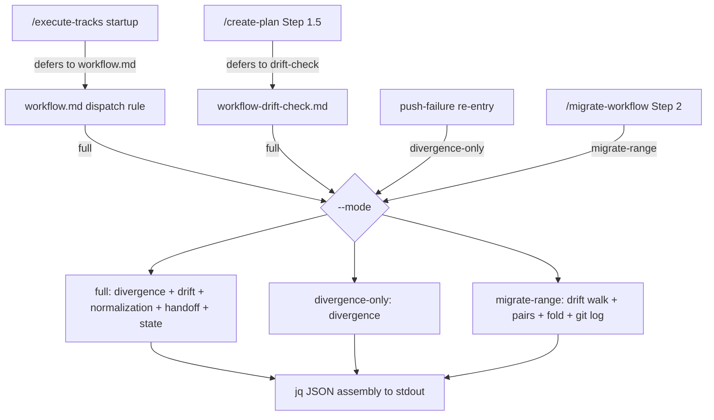
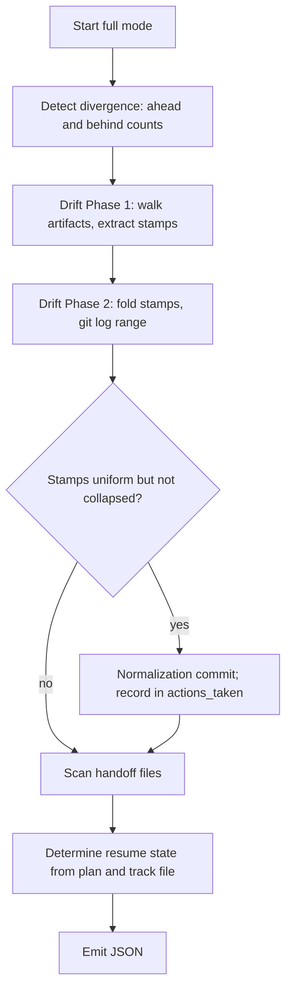
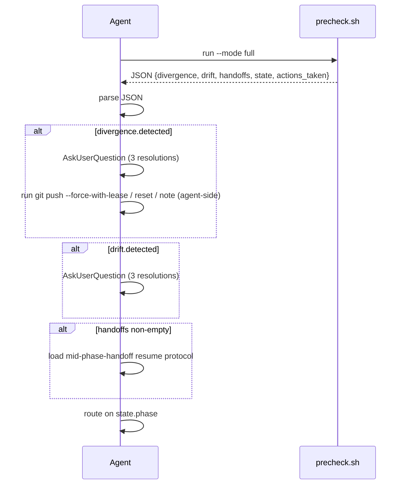
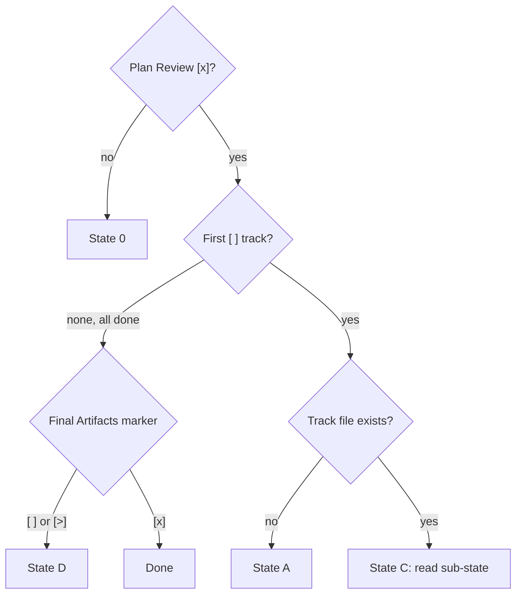

# Workflow startup precheck — Design (final)

## Overview

`/execute-tracks` and `/create-plan` used to read roughly 1,200 lines of gate
prose at every session start. `workflow.md § Startup Protocol`,
`branch-divergence-check.md`, `workflow-drift-check.md`, and the resume bits of
`mid-phase-handoff.md` all loaded just to answer two questions: which phase
does this session resume into, and is anything blocking it. The bash inside
those files already did the mechanical detection; the agent only interpreted
output, prompted the user when a gate fired, and dispatched the resolution.

This work moves that mechanical detection into one script,
`.claude/scripts/workflow-startup-precheck.sh`. The script emits a single JSON
blob describing branch divergence, workflow drift, pending handoffs, and the
resume state, and the agent parses it instead of re-deriving the same facts
from prose. The enabling primitive is that JSON contract: a stable
machine-readable summary that separates detection (the script's job) from the
conversational gate UX (the agent's job, which the script never owns).

The gate prose shrinks to a short agent-side dispatch rule. Four pieces moved
into the script and kept their on-disk behavior: branch-divergence detection,
the two-phase drift walk, the no-drift normalization commit, and resume-state
determination. The byte-copied artifact walk that `conventions.md §1.6(h)`
owns becomes one script implementation the prose cites. The script lives under
`.claude/scripts/`, outside the trees the `§1.7` staging convention governs, so
it was authored live while the edited prose files were staged, and both
surfaces unified at the Phase 4 promotion.

The rest of this document covers Core Concepts, a Component design diagram and
a Workflow runtime diagram, then one section each for the JSON contract, state
determination, the normalization path, the byte-source consolidation, the
migrate-range reuse, the staging asymmetry, the mid-session re-entry, and the
testing strategy.

## Core Concepts

This design has seven load-bearing ideas. Each is named here and used without
re-definition below; the definition pairs the new idea with what it replaces,
so the delta from the old prose-only world is visible at a glance.

**Precheck script.** The single bash and jq artifact
`workflow-startup-precheck.sh` that runs the mechanical startup detection and
emits JSON. Replaces the inline bash scattered across the gate files.
→ §"Component design".

**Run mode.** A `--mode {full,divergence-only,migrate-range}` flag that
selects which detection runs and which JSON shape the script emits. Replaces
the prose-encoded "run all the gate bash in sequence". → §"The JSON contract",
§"Mid-session re-entry", §"migrate-range reuse".

**JSON contract.** The stable stdout schema every caller parses. Replaces the
agent reading raw git output and interpreting it against a prose table.
→ §"The JSON contract".

**actions_taken.** The JSON list of mutations the script performed on its own,
with no user input. On a startup run that is at most the no-drift
normalization commit; force-push and reset stay agent-side because the user
gates them. Replaces the silent normalization of the old prose path.
→ §"No-drift normalization path".

**State determination.** The markdown walk over `implementation-plan.md` and
the active track file that computes the resume state and its State C
sub-state. Replaces `workflow.md § Startup Protocol` step 5's prose table.
→ §"State determination".

**Byte-source consolidation.** The artifact-walk bash that
`conventions.md §1.6(h)` owns, once copied byte-for-byte into three other
places, becomes one script implementation those places call. `§1.6(h)` keeps
the bash as the readable spec. → §"Byte-source consolidation".

**Staging asymmetry.** The script and its tests sit under `.claude/scripts/`,
which the `§1.7` staging convention does not govern, so they were authored
live; the edited prose files sit under the staged trees and accumulated under
`staged-workflow/`. → §"Staging asymmetry".

## Component design

**TL;DR.** One script, three modes, four logical callers. `full` mode runs the
whole startup precheck for `/execute-tracks` startup and `/create-plan`
Step 1.5. `divergence-only` re-checks divergence after a mid-session push
rejection. `migrate-range` emits the stamp-fold range and per-artifact pairs
that `/migrate-workflow` Step 2 needs. Every mode ends at a single jq assembly
point. The two consumer SKILLs reach `full` mode by delegation, not a direct
call: they defer to the rewritten `workflow.md § Startup Protocol` and
`workflow-drift-check.md`, which run the script.



The script is a set of detection functions plus one emit function. `full` mode
calls `detect_divergence`, `detect_drift` (which calls
`no_drift_normalization` on the uniform-but-uncollapsed-stamps path),
`scan_handoffs`, and `determine_state`, then hands a set of populated shell
variables to the jq assembly. `divergence-only` calls only
`detect_divergence`. `migrate-range` calls `detect_migrate_range`. Each
detection function writes plain shell variables; the jq step (`emit_json`) is
the only place that knows the JSON shape, so the contract has one authoring
site.

### Edge cases / Gotchas

- `migrate-range` deliberately skips normalization, state, divergence, and
  handoffs. The migration runs its own session and needs only the range, the
  pairs, and the unstamped list.
- `full` mode is the only mode that can mutate, via the normalization commit.
  The other two are read-only.
- The four callers are fixed at rollout. A new caller picks an existing mode
  rather than adding a fourth, unless a genuinely new detection need arises.
- The two consumer SKILLs do not call the script directly. They point at the
  rewritten workflow docs, so the startup procedure has one description after
  merge rather than a SKILL-local copy that could drift.

### References

- D1: bash + jq script under `.claude/scripts/`.
- D2: three run modes selected by `--mode`.
- D8: the two consumer SKILLs reconciled to defer to the rewritten workflow
  docs.
- S2: the script never prompts.

## Workflow

The runtime has two halves: the script's `full`-mode detection order, and the
agent's dispatch loop over the JSON the script returns.



The order matters in one place: normalization runs inside the drift step
because it depends on the fold's base SHA, and it must land before state
determination reads the plan so the working tree is clean when state is
computed. Divergence and the handoff scan are independent and could run in any
order; the sequence above groups them with the gates they feed.



The agent never reads the gate prose at startup. It runs the script, parses,
and presents the conversational gates the script reports without owning. The
dispatch order mirrors the old protocol: divergence first, then drift, then
handoffs, then state routing.

## The JSON contract

**TL;DR.** `full` mode emits five top-level keys: `divergence`, `drift`,
`handoffs`, `state`, and `actions_taken`. `divergence-only` emits `divergence`
and `actions_taken`. `migrate-range` emits a flat object of five
migration-specific keys with no `drift` wrapper and no `actions_taken`. jq
builds every blob, so quoting and escaping are correct by construction.

The `full`-mode shape:

```json
{
  "divergence": { "detected": true, "ahead": 3, "behind": 2, "skipped": false, "skip_reason": null },
  "drift": {
    "detected": true, "kind": "stamped", "base_sha": "abc1234", "commit_count": 5,
    "first_commits": [ { "sha": "abc1234", "subject": "..." } ],
    "normalization_landed": false
  },
  "handoffs": ["handoff-phase4.md"],
  "state": { "phase": "C", "substate": "review-done-track-open" },
  "actions_taken": []
}
```

The `state` object is `{phase, substate}` — there is no `track` field. The
active track number is computed internally to locate the `plan/track-N.md`
file, but it is not emitted; the dispatch rule re-derives the active track from
the plan checklist walk. `state.phase` is one of `0`, `A`, `C`, `D`, `Done`.
`state.substate` is one of six slug strings for State C (see §"State
determination") and `null` for every other phase. `drift.kind` is one of
`stamped`, `unstamped`, `merge-base-failed`, or `null` (the empty-input
no-drift path). When `kind` is `unstamped` or `merge-base-failed`, the fold
scalars (`base_sha`, `commit_count`, `first_commits`) are null or empty and the
agent routes to the `/migrate-workflow` bootstrap. `actions_taken` carries one
entry when normalization lands, otherwise it is empty.

### Edge cases / Gotchas

- `handoffs` preserves the `ls -t` mtime order so the agent resumes
  most-recent-first.
- `divergence.skipped` is true with a `skip_reason` of `no-upstream` or
  `fetch-failed` when the upstream or fetch guard trips; `detected` is then
  false.
- jq emits `null` for an absent scalar, never the empty string, via the
  explicit `if . == "" then null else . end` idiom, so the agent's
  `jq -e '.field == null'` tests are unambiguous.
- The migrate-range shape is documented in its own section; it is flat by
  design and shares no envelope with `full`/`divergence-only`.

### References

- D2: the mode flag selects the emitted shape.
- D3: `actions_taken` reports autonomous mutations only.
- S2: the script never prompts; the gate UX stays agent-side.

## State determination

**TL;DR.** The script reads `## Plan Review`, the track checklist, and the
active track file's `## Progress` log plus its `## Concrete Steps` roster, then
reports `state.phase` (0/A/C/D/Done) and, for State C, a sub-state slug. This
is the one piece that parses markdown rather than git output, so it is the
riskiest surface and the most heavily fixtured.

State follows the precedence `workflow.md § Startup Protocol` step 5 encodes.
State 0 is checked first: an absent plan file, an absent `## Plan Review`
section, or a first-checkbox `[ ]` all mean plan review has not passed.
Otherwise the script walks the track checklist in order. The first `[ ]` track
decides between State A and State C: no track file means State A (pre-Phase-A),
an existing track file means State C (mid-track resume). When every track is
`[x]` or `[~]`, the `## Final Artifacts` marker chooses State D (`[ ]` or
`[>]`) or Done (`[x]`).



For State C the sub-state comes from a joint read over three sources: the track
file's `## Progress` log (the `Review + decomposition` and `code review`
entries), the `## Concrete Steps` roster (the per-step checkboxes), and the
plan-file track checkbox. The result is one of six slug strings in priority
order: `decomposition-pending`, `section-discrepancy`, `failed-step`,
`steps-partial`, `steps-done-review-pending`, `review-done-track-open`. The
`section-discrepancy` slug fires when a roster step flipped `[x]` has no
matching `Step N` entry in the Progress log, so the agent reconstructs the
missing entry from the Episodes block.

### Edge cases / Gotchas

- An entirely absent `## Plan Review` section is treated as State 0, identical
  to an unchecked entry.
- The checklist walk validates every track line's glyph over the whole bounded
  `## Checklist` region, not just lines up to the first `[ ]`. A malformed
  marker anywhere (`[]`, `[ x]`, `[X]`) is an explicit stderr parse-error with
  a non-zero exit and no JSON, never a coerced sixth state.
- State C sub-state detection reads only the active track's file, not every
  track file, to keep the parse cheap.

### References

- D7: fixtures cover every `state.phase` and every State C sub-state.
- S1: behavior parity with the old prose precedence.

## No-drift normalization path

**TL;DR.** When every artifact is stamped and the drift `git log` is empty but
the stamps sit on more than one distinct SHA, the script rewrites each line-1
stamp to the folded base SHA and lands one commit, `Normalize workflow-sha
stamps to <short>`. This is the only mutation the script performs without user
input, and it is reported in `actions_taken`.

The path is faithful to the existing `workflow-drift-check.md § No-drift
normalization` block: recompute the stamped-file list under the `§1.6(h)`
enumeration, rewrite line 1 with a printf-and-tail pattern via a `.tmp`+`mv`,
then verify two diff-shape guards before committing. Guard 1 rejects any hunk
that starts off line 1; guard 2 rejects any dirty path inside the active
plan's `_workflow/` that the rewrite did not touch. On either mismatch the
script restores the stamped files from HEAD and exits non-zero with a
diagnostic, landing no commit. On success it stages the stamped files, commits
with `-q`, and appends the commit to `actions_taken`.

### Edge cases / Gotchas

- The path fires only in `full` mode. `divergence-only` and `migrate-range`
  never mutate.
- The all-or-nothing contract holds: either every stamp moves to the base SHA
  in one commit, or the working tree is unchanged.
- Surfacing the commit in `actions_taken` is the one behavior delta from the
  old prose, where the normalization was silent. The agent names it in the
  resume summary; it does not prompt.
- The distinct-SHA fire gate, which the byte-source kept only in surrounding
  prose, gains an explicit in-script home so a single-SHA stamp set does not
  trigger a spurious commit.
- The `git commit -q` keeps git's summary off the single JSON stdout channel.

### References

- D3: the normalization commit is the only entry `actions_taken` reports.
- S3: the commit subject, the line-1-only diff shape, and the abort-restore
  are unchanged from the old prose.

## Byte-source consolidation

**TL;DR.** The artifact-walk bash lived in four places: `conventions.md
§1.6(h)` as the declared source, plus byte-copies in
`workflow-drift-check.md § Detection`, `/migrate-workflow` Step 2.0, and
`/migrate-workflow` Step 2. The script becomes the single implementation.
`§1.6(h)` keeps its bash block as the human-readable spec and gains a pointer
to the script; the copies are replaced by a call to the script.

`conventions.md §1.6` declares itself the single source of truth for the stamp
format, the parser idioms, and the walk. Moving the walk out of conventions
entirely would weaken that, so the spec stays and the script cites it in a
header comment. The contract changes shape: it was "keep four bash blocks
byte-identical", and it is now "keep the script conforming to the `§1.6(h)`
spec", checkable by a conformance fixture. The script absorbs the walk that
reads existing stamps at startup and migration, but not `§1.6(b)`, the
create-time stamp computation that `/create-plan` and `edit-design` run when
they author artifacts. Reading stamps is a startup concern; computing a new
stamp is a creation concern; the two stay in separate homes.

### Edge cases / Gotchas

- The script now contains three `§1.6(h)`-shaped enumerations: the Phase 1
  drift classification, the `migrate-range` walk, and the normalization
  recompute. The conformance harness keys on what each walk builds (the
  stamped-file list versus the stamped-SHA set), not on its position, so a
  fourth walk must extend the harness rather than rely on order.
- The migration's Step 2 needs the per-artifact `(file, sha)` pairing the
  drift path does not. That pairing lives in `migrate-range` mode, not as a
  prose extension.
- `conventions.md` is durable: it survives the Phase 4 cleanup commit into
  `develop`, so the spec it carries outlives the branch. The script is durable
  too, since it is committed code, so both spec and implementation persist.
- The script uses the anchored stamp regex from `§1.6(a1)`; the unanchored
  variant is rejected.

### References

- D4: `§1.6(h)` keeps the spec; the script implements it.
- D5: the walk-not-compute boundary excludes `§1.6(b)`.
- S1: behavior parity, checked by the conformance fixture.

## migrate-range reuse

**TL;DR.** `/migrate-workflow` Step 2 needs the same artifact walk and
stamp-fold the drift gate runs, plus a per-artifact `(file, sha)` pairing for
merge-base-failure recovery, plus the option to fold in a user-supplied
bootstrap SHA for previously-unstamped artifacts. `migrate-range` mode emits
all three; the conversational unstamped-bootstrap prompt stays in the migrate
skill.

`migrate-range` emits a flat object: `stamped_artifacts` as `(file, sha)`
pairs, `unstamped_files` as a list, `base_sha` as the folded base (a full `%H`
SHA, or `null` when the fold produced no clean base), `log_range` as the
`git log BASE..HEAD` commit list (`{sha, subject}` entries, oldest first, with
no head cap because the migration replays every workflow commit), and
`merge_base_failed` as an array of `{base, sha, files}` objects naming each
failing pair and the artifact paths the failing SHA owns. The mode takes an
optional `--bootstrap-sha` the skill passes once the user supplies a base for
the unstamped set, and a repeatable `--exclude-sha` that drops named SHAs from
the fold input. The skill reads those fields instead of re-deriving the walk
in prose. The script never prompts: when artifacts are unstamped and no
`--bootstrap-sha` is supplied, the mode reports the unstamped list, the skill
drives the bootstrap prompt, then re-invokes with the validated SHA.

### Edge cases / Gotchas

- `--exclude-sha` exists so the agent-side merge-base-failure recovery loop can
  terminate: the skill re-invokes with one `--exclude-sha` per
  `merge_base_failed[].sha` (alongside a fresh `--bootstrap-sha`), and the
  restarted fold clears the failing pair instead of re-folding it forever.
- The fold here runs in continue-and-collect mode, gathering every failing
  pair into one batch, because the migration's bootstrap re-prompt is
  user-interactive; the drift gate folds in first-failure (break) mode.
- The bootstrap SHA is validated by the migrate skill (peel-and-reachability)
  before it reaches the script, so the script trusts the value it receives.
- `migrate-range` emits no `state`, `handoffs`, or `divergence` keys; the
  migration runs in its own session and does not need them.

### References

- D2: `migrate-range` is a run mode; `--bootstrap-sha` and `--exclude-sha`
  are its modifiers.
- D4: the migration reuses the one byte-source walk.
- S1: the walk and fold match the drift gate's behavior.

## Staging asymmetry

**TL;DR.** This work is workflow-modifying, so its prose edits accumulated
under `staged-workflow/` and promote at Phase 4. The new script and its tests
live under `.claude/scripts/`, which `§1.7` does not govern, so they were
authored live. The two surfaces unify at the Phase 4 promotion: the staged
prose that wires in the script promotes while the script already sits live.

`§1.7(a)` scopes staging to `.claude/workflow/**` and `.claude/skills/**` only.
`.claude/scripts/` is neither, so the write-routing rule does not touch it and
the script was created live during implementation. This is safe because the
live workflow prose stayed at develop state for the whole branch under the
staging invariant, so the branch's own `/execute-tracks` sessions ran the
existing inline-bash path and never called the new script. The script's
correctness is verified against the fixture set instead, and the new dispatch
path goes live only for the first post-merge workflow-modifying branch. The
drift gate's pathspec watches `.claude/workflow/` and `.claude/skills/`, not
`.claude/scripts/`, so creating the script live raised no drift for other
branches in flight, and the `§1.7(e)` pre-commit gate, which refuses only live
workflow and skills matches, did not fire on it.

### Edge cases / Gotchas

- Promotion is additive: the Phase 4 `cp -r` lays staged prose over live
  paths. The script is already live, so nothing about it needs promotion.
- One repeatable flag (`--exclude-sha`) was added to the live script during the
  prose-consolidation work, not the script-authoring work, because the
  migrate-recovery prose could not terminate its fold loop without it. That is
  sound under the staging asymmetry: the script is inert on this branch
  (nothing live calls `migrate-range`) and the flag matters only once the
  staged prose promotes.
- This branch did not exercise the new path end-to-end; that is structural,
  not a gap. The first post-merge workflow-modifying branch is the first to
  run the script at startup.

### References

- D1: the script's location under `.claude/scripts/`.
- D6: staged prose, live script.
- S1, S4: behavior parity and the staging invariant both hold for the branch.

## Mid-session re-entry

**TL;DR.** `commit-conventions.md § Push failure handling` routes the first
non-fast-forward push rejection in a session to the divergence gate. After this
work, the agent carries the divergence resolution as a session variable from
the startup JSON; on a push rejection it either treats the failure as expected
when the resolution was defer, or re-runs the script in `divergence-only` mode.
No gate prose reloads in either path.

When the startup run reports clean divergence and the user makes no choice, the
session variable is unset. A later push rejection then means the remote moved
mid-session, so the agent re-runs `divergence-only` to re-detect and present
the three resolutions fresh. When the startup run reported divergence and the
user chose defer, subsequent rejections are expected and the agent records and
continues. The remote-authoritative reset case is unchanged: a `git reset
--hard` shifts both the divergence and drift ranges, so the agent ends the
session and the user re-invokes rather than re-running the script against a
moved HEAD.

### Edge cases / Gotchas

- `divergence-only` mode emits only `divergence` and `actions_taken`, so the
  re-entry is cheap and recomputes neither drift nor state.
- The session variable lives in the conversation, not on disk, matching the
  existing in-session resolution semantics.
- The remote-authoritative re-entry contract is one-sided today; the script
  does not change that, and the session-end-and-re-invoke path is preserved.

### References

- D2: `divergence-only` is the cheap re-entry mode.
- S2: the script never prompts; the re-entry gate UX stays agent-side.

## Testing strategy

**TL;DR.** The script has a fixture-based Python harness under
`.claude/scripts/tests/`. The suite (74 tests at merge) covers the four gate
paths (clean, divergence, drift, both) and every `state.phase` output (0, A, C
with each sub-state, D, Done), plus the normalization commit's subject and
diff shape and the `§1.6(h)` byte-source conformance check. Tests assert the
JSON shape and the on-disk effect, so behavior parity is mechanically checked.

Each fixture is a small constructed git state: a plan dir with
`implementation-plan.md` and track files at known checkbox states, and a commit
graph that produces the intended divergence or drift. A reusable `GitFixture`
builder (hermetic `file://` remotes, `GIT_CONFIG` isolation, real-commit
helpers) underpins every git-touching test; because the byte-source resolves
the plan dir to `docs/adr/<branch>` with the default fixture branch `main`,
fixture plan artifacts live under `docs/adr/main/_workflow/`. The harness runs
the script against the fixture and asserts the emitted JSON plus, for the
normalization fixture, the resulting commit subject and the line-1-only diff
shape. The byte-source conformance test pins the script's walk against the
`§1.6(h)` spec so a future spec edit the script misses fails the suite.

### Edge cases / Gotchas

- State C sub-state fixtures cover all six slugs plus the section-discrepancy
  edge, since state determination is the riskiest surface.
- The normalization fixture asserts both the success commit and the
  abort-and-restore path: a deliberately malformed rewrite must leave the tree
  at HEAD.
- The `divergence-only` and `migrate-range` modes get their own fixtures so the
  reduced shapes are pinned, not just `full`. A `migrate-range` fixture proves
  the `--exclude-sha` re-invoke clears a failing merge-base pair.
- Tests live under `.claude/scripts/`, outside the staged trees, so they were
  authored live alongside the script.

### References

- D7: fixtures cover every gate path and every state.
- S1, S3: behavior parity and the normalization contract are the properties
  the suite pins.
