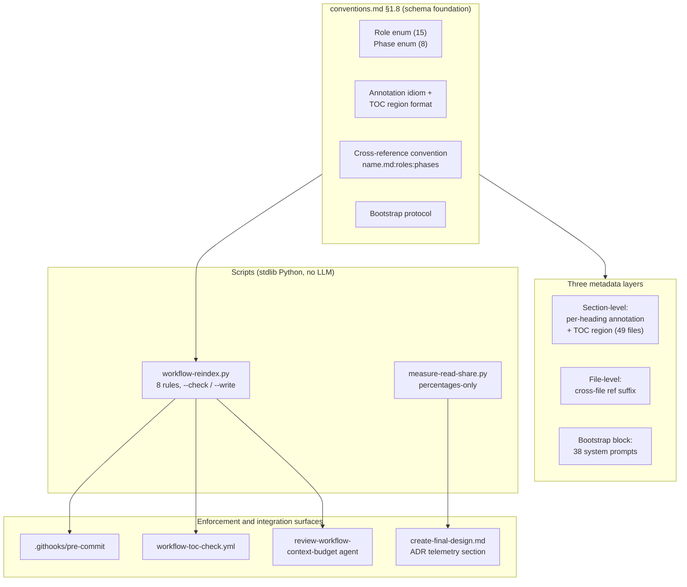

# Per-document TOC + per-section role/phase annotations — Architecture Decision Record

## Summary

This change cuts the Read tool's share of workflow-session context by giving every agent enough metadata to decide whether to open a workflow file and which section to jump to before paying the read cost. Read tool results accounted for 51.9% of session context across the projects measured in YTDB-1023, and 72.9% measured locally from this worktree. The fix adds three metadata layers across the in-scope workflow surface: a bootstrap instruction block at the top of 38 system prompts, a `name.md:roles:phases` cross-reference suffix at every cross-file reference site, and an HTML annotation comment after every `##`/`###` heading mirrored into a delimited TOC region under each file's H1. Two stdlib-only Python scripts carry the rest: `workflow-reindex.py` validates the schema at pre-commit and CI and rebuilds the TOC tables, and `measure-read-share.py` emits a percentages-only Read-share snapshot into every future ADR.

## Goals

- **Cut the Read tool's share of session context.** The three metadata layers ship across all 49 annotated files and 38 system prompts, and the schema is enforced at CI. The reduction is not measured on this branch: annotated files take effect only for sessions that start after they land, and this worktree's sessions predate the rollout. The 72.9% figure below is the pre-rollout baseline future ADRs compare against.
- **Lock the per-section schema as workflow infrastructure.** Done. `conventions.md §1.8` defines the role enum (15 values), the phase enum (8 values), the annotation idiom, the TOC region format, the cross-reference convention, and the bootstrap protocol. The reindex script's eight rules fail CI on any schema violation, so full-file reads of a workflow doc when one section is load-bearing cannot reappear silently.
- **Ship a standing telemetry mechanism.** Done. `measure-read-share.py` runs once per Phase 4 ADR from the worktree, and the Phase 4 prompt embeds its output as a locked `## Token usage telemetry` section. This ADR carries the first such section.

## Constraints

- This plan is workflow-modifying (it edits `.claude/workflow/**` and `.claude/skills/**`) and is the first to exercise the `conventions.md §1.7` staging path end-to-end. Staging held: every workflow-file edit accumulated under `_workflow/staged-workflow/` and the live tree stayed at develop's state through implementation and review. Staging also surfaced the staged-first resolution gaps the reindex script needed (see D14, D15, D16).
- Annotations are author-written, never LLM-inferred. The reindex script is mechanical (scrape, validate, rebuild); no model is in the loop.
- Enforcement fires at commit time (the pre-commit hook) and at CI only. No periodic background runs.
- All annotation tokens are drawn from the locked enums; out-of-enum tokens fail CI.
- Telemetry publishes percentages only, never absolute token counts, and runs from a worktree only (it skips on the main checkout).
- Discovered during execution: the restructured `.githooks/pre-commit` runs `set -euo pipefail`, so any future hook pipeline that legitimately returns nonzero must be wrapped (`{ ... || true; }` or a `set +e`/`set -e` fence) or it fails the commit.
- `CLAUDE.md` is out of scope by design. It is a general-purpose project guide loaded into every session regardless of role or phase, so the file-level filter does not apply.

## Architecture Notes

### Component Map

- **Schema (`conventions.md §1.8`).** The single source every other component reads from. Locks both enums, the HTML-comment annotation idiom, the TOC region format, the cross-reference convention, and the bootstrap block content.
- **Section-level layer.** One HTML annotation comment after each `##`/`###` heading, mirrored into a `<!--Document index start--> … <!--Document index end-->` table under each file's H1. Covers 31 docs under `.claude/workflow/`, 11 prompts, and 7 workflow-referencing SKILL.md (~600 author-written annotations).
- **File-level layer.** The `name.md:roles:phases` suffix at every cross-file reference site in the in-scope workflow docs and prompts, plus SKILL.md read-lists and agent files. The reader filters by role and phase before opening.
- **Bootstrap layer.** A ~30-line instruction block at the top of 38 system prompts (7 SKILL.md, 11 prompts, 20 agent files), teaching a freshly-spawned sub-agent the TOC-aware reading protocol before its first Read.
- **`workflow-reindex.py`.** Mechanical validator and TOC rebuilder. `--check` for CI and pre-commit, `--write` for author rebuild. Self-bootstraps the enum tokens from `conventions.md §1.8`, staged-aware.
- **`measure-read-share.py`.** Worktree-scoped, percentages-only Read-share snapshot, embedded once per Phase 4 ADR.
- **Enforcement surfaces.** The pre-commit hook and a new GitHub Actions workflow both call `--check`; the `review-workflow-context-budget` agent absorbs the qualitative audit at PR review.

### Decision Records

#### D1: Lock the enum at 15 roles and 8 phases

The role and phase vocabularies are closed at rollout in `conventions.md §1.8`. A smaller 10-role enum loses filter precision (`planner` has a distinct file-load profile from `orchestrator`), and pre-allocating phase slots for an in-flight Phase 1 sub-split would pre-empt that work's own design choices on its own branch. Implemented as planned. Future additions require a workflow-format commit, which the drift gate then surfaces on every active branch.

#### D2: Per-section annotation as an HTML comment on the line after the heading

The annotation is `<!-- roles=… phases=… summary="…" -->` directly under each heading. Implemented as planned. It parses with one regex, lives adjacent to the section it describes (no heading-to-metadata drift), and stays invisible to humans and Markdown tooling. The in-file TOC mirrors the comment so a long section's off-screen annotation is recoverable from the top of the file.

*(One record from the original numbering was dropped during Phase 1 design refinement; the sequence below skips from D2 to D4 accordingly.)*

#### D4: Telemetry script runs from worktree only, skips on the main checkout

`measure-read-share.py` measures the worktree's `~/.claude/projects/<encoded-cwd>/**/*.jsonl` transcripts and publishes percentages only. Implemented as planned. Worktree-vs-main detection routes through the `.git` file-vs-directory shape, which git documents as stable, rather than `git worktree list` ordering. Four skip-notice templates ship, one per cause, and every skip path exits 0 so the ADR commit never fails on telemetry.

#### D5: Reindex script at `.claude/scripts/workflow-reindex.py`, mechanical Python, no LLM

A standalone stdlib-only script, parallel to the existing `design-mechanical-checks.py` and the slim-plan renderer. Implemented as planned (~2200 lines, exit codes 0/1/2, modes `--check` and `--write`). A SKILL.md form was rejected as over-engineered for a mechanical pass invokable from hooks and CI without a Claude session.

#### D6: Agent files get a refs-only suffix sweep plus the bootstrap block, no per-section annotations

The 20 `.claude/agents/*.md` files carry the bootstrap block and the cross-file suffix on their outgoing refs, but no per-section annotations or TOC. Implemented as planned and reinforced by D17. The Read tool never opens agent files (they load as system prompts), so per-section annotations would save no Read-tool tokens; the outgoing-ref filter still benefits.

#### D7: Migration replay is a content no-op for this change

This change edits workflow rules and tooling but does not alter `_workflow/**` artifact shape, so `/migrate-workflow` has no content to replay onto branch artifacts; the workflow-sha bump is what other branches' drift gates pick up. Core decision unchanged. The two-branch verification originally scoped here was reframed as a post-merge acceptance step once the reviews found it unrunnable before merge (see D18).

#### D8: Bootstrap block embedded in every workflow-related system prompt

System prompts load without a prior Read, and a spawned sub-agent shares no context with its parent, so the TOC-aware protocol must live in the agent's own system prompt. Implemented across 38 files. The block body needed three successive corrections during the rollout (see D19 and Key Discoveries); the reindex script's rule 7 enforces presence only, by literal heading match.

#### D9: In-file `§X.Y(z)` references auto-stamped with a target-derived suffix

`workflow-reindex.py --write` resolves each in-file ref's target heading, reads its annotation, and stamps the matching `:roles:phases` suffix. Implemented as planned. In-file refs are common and the citer almost always means the target's full annotation, so auto-stamping removes author burden and keeps the suffix in sync; cross-file refs stay hand-written because the citer's slice is genuinely narrower.

#### D10: Subset-validate cross-file ref suffixes against target annotations

For each hand-written cross-file ref the script checks `citer.roles ⊆ target.roles` AND `citer.phases ⊆ target.phases`. Implemented as planned. Equality is not required (narrower is the contract); a subset violation surfaces when a target's annotation is tightened, and the CI error names both sides.

#### D11: `WC / WP / WI / WH / WB / WS` finding-prefix family on the six `review-workflow-*` agents

Each of the six workflow-machinery review agents gains a per-finding numeric prefix alongside its existing `Critical / Recommended / Minor` severity labels. Modified during execution: the prefix letters first drafted for four agents collided with the canonical letters already defined in `review-iteration.md` and `review-agent-selection.md`. The four were conformed to the canonical family (commit `fc2d829421`), and a within-bucket ordering rule (source, then file path, then ascending line) fixes the emission order.

#### D12: Reindex script self-bootstraps enum tokens via a staged-aware probe of `conventions.md §1.8`

The script reads the 15 roles and 8 phases from `§1.8` at run time rather than hard-coding them, via the same staged-first reads-precedence the cross-file lookup uses. Implemented as planned. A probe that finds two staged `conventions.md` candidates across multiple workflow-modifying plans in one worktree halts with exit 2 rather than guessing.

#### D13: Cross-file suffix convention widened to all in-scope workflow docs and prompts

Originally the suffix was scoped to agent files and SKILL.md read-lists. Modified during execution: the rollout found rule 6 flags every bare `name.md` token (Markdown link targets, link text, and bare prose mentions), so a green full-set `--check` was unreachable while workflow docs carried plain links. The fix converts every Markdown link to an in-scope `.md` target into the bare `name.md:roles:phases` form, so the load-on-demand filter rides at every cross-file reference site; references to non-annotatable targets (`CLAUDE.md`, `design.md`, the final artifacts, and the rest) are backtick-wrapped and excluded. Later revised by D14, which made the converted refs resolvable on a workflow-modifying branch.

#### D14: `build_file_lookup` resolves cross-file targets staged-first

The first conversion attempt found the lookup resolved a converted ref to the live develop-state copy, which carries no annotations on a workflow-modifying branch, so rule 6 failed permanently. Modified during execution: the lookup now prefers the staged copy keyed by its relative `.claude/...` path when a basename resolves to both. Forward-safe: on `develop` and non-workflow-modifying branches no staged copy exists, so the lookup stays pure-live.

#### D15: bare-basename ref resolves to the workflow-root file when a `prompts/` namesake exists

A later conversion attempt found the bare-basename key collided between a workflow-root file and its `prompts/` namesake (the `structural-review.md` pair), and first-match-wins handed the key to the prompt. Modified during execution: a prompts file claims the bare key only when no workflow-root namesake exists, so the bare key resolves to the workflow-root file, matching the bare-vs-`prompts/` convention `§1.8(e)` already states. The collision set is bounded and enumerable.

#### D16: `build_file_lookup` records a `<skill-dir>/SKILL.md` key

A SKILL.md cross-file target was unresolvable because all seven SKILL.md files collided on the single bare `SKILL.md` key and the lookup recorded no directory-prefixed key. Modified during execution: the lookup records a `<skill-dir>/SKILL.md` key per skill, keyed on the logical `.claude/...` path so a staged skill copy keys identically to its live namesake. `§1.8(e)` already prescribes this ref form, so the script (not the convention) was the defect.

#### D17: `workflow-reindex.py` scopes live `.claude/agents/**/*.md` into rules 6 and 7 only

The discovery globs carried only a dead staged-agents glob (agents are never staged), so rules 6 (cross-file ref suffix) and 7 (bootstrap presence) never fired on the 20 live agent files. Modified during execution: a dedicated rules-6/7-only citing scope enters live agents, with a per-rule applicability gate so the TOC-density rules (2, 3, 4) never demand a TOC on an agent file. Routing agents through the in-scope globs instead would have over-fired those rules.

#### D18: Migration replay verification is a post-merge acceptance step

The reviews found the two-branch verification structurally unrunnable before this plan reaches `develop`: the drift gate ranges `git log $BASE_SHA..HEAD` over a candidate branch's own HEAD and never fetches `develop`, so a candidate rebased onto current `develop` gains zero workflow-format commits from a plan that has not merged. Modified during execution. The in-branch work is limited to runnable substitutes (a static check that the no-artifact-shape-change premise holds, plus local `--check` and telemetry smokes). The real verification runs after the squash-merge lands: the user runs `/migrate-workflow` in a fresh session on two active candidate branches rebased onto post-plan `develop` and confirms clean completion (a single stamp-rewrite normalization commit, or a silent skip when stamps are already uniform), followed by a clean `/execute-tracks` startup. The candidate pool of active branches carrying `_workflow/` artifacts is `ytdb-612-rollback-log`, `read-cache-concurrency-bug`, `ytdb-614-property-map`, and `failed-wal-recovery`; the two picks and the outcome are recorded post-merge.

#### D19: Bootstrap block reader-side match expands the reader's own `any`; read window is delimiter-bounded

The high-risk dimensional review found three body-level gaps that the presence-only rule 7 cannot catch: the step-2 match rule never expanded a reader whose own role or phase is the wildcard `any`, step 1 hardcoded a fixed line count that truncates `conventions.md`'s ~80-line TOC, and the closing line over-asserted that every inline ref carries a suffix. Modified during execution: the match rule now expands a wildcard on either side, the read window keys on the `<!--Document index start-->`/`<!--Document index end-->` delimiters, and the closing line notes that backtick-wrapped refs carry no suffix. The fix landed in the canonical `design.md` body, in `conventions.md §1.8(f)`, and across all 38 files. The reader-side `any` expansion is distinct from the one-way citer-side subset rule of D10: a citer's `any` never widens against a narrower target.

### Invariants & Contracts

- Every annotated `##`/`###` heading is followed by exactly one annotation comment on the next line.
- Every annotated file carries exactly one TOC region whose section list matches every `##` and `###` heading 1:1. The bootstrap-block heading `## Reading workflow files (TOC protocol)` is the sole literal-heading exception.
- All role and phase tokens are drawn from the locked enums in `conventions.md §1.8`. Out-of-enum tokens fail CI.
- `measure-read-share.py` never emits absolute token counts. Output is percentages only, plus session and transcript counts.
- Every in-scope system prompt (7 SKILL.md, 11 prompts, 20 agent files) carries the bootstrap block, validated for presence by literal heading match. Live agent files enter that check through the dedicated rules-6/7 citing scope.
- Every in-file `§X.Y`/`§X.Y(z)` reference carries a `:roles:phases` suffix matching the target heading's current annotation; `--write` is the sole writer, and plain or drifted refs fail CI.
- Every cross-file `name.md:roles:phases` reference's roles and phases are subsets of the target heading's annotation (narrower is the contract). Non-annotatable targets are backtick-wrapped and excluded. On a workflow-modifying branch the target resolves staged-first.

### Integration Points

- **`.githooks/pre-commit`** (extended): restructured into `run_java_checks` and `run_workflow_reindex_check`, both invoked unconditionally. The workflow block filters staged files with `git diff --cached --name-only --diff-filter=ACMR` (excluding deletions) against a regex matching both live and staged in-scope paths, then runs `--check --files` on the matched set. A grep exit-code discriminator separates "no matches" from a real grep failure.
- **`.github/workflows/workflow-toc-check.yml`** (new): runs `--check` against the full file set on `pull_request`. The activity-types filter includes `ready_for_review` and the job is gated `if: github.event.pull_request.draft == false`, so the gate is silent during draft iteration and runs the moment the PR is marked ready for review.
- **`.claude/agents/review-workflow-context-budget.md`**: invokes the script during workflow-machinery PR review and absorbs the qualitative audit.
- **`prompts/create-final-design.md`**: invokes `measure-read-share.py` while composing `adr.md` and embeds its stdout as the locked `## Token usage telemetry` section.

### Non-Goals

- Cross-repo or cross-project telemetry aggregation. The published section reports this worktree only.
- Annotations on Phase 4 final artifacts (`design-final.md`, `adr.md`) or on ephemeral `_workflow/**` artifacts.
- Backward-compatible support for un-annotated workflow files after rollout. Every in-scope file carries the schema once the rollout lands.
- `CLAUDE.md` cross-reference suffix application. A workflow-doc reference to `CLAUDE.md` is backtick-wrapped; CLAUDE.md itself stays outside the suffix convention while the cross-file-ref rule stays green.
- Bootstrap block on non-workflow skills (`ai-tells`, `run-jmh-benchmarks-hetzner`, `profile-jmh-regressions`, and the rest). Scope is the 7 workflow-referencing SKILL.md files.

## Key Discoveries

**The reindex script's cross-file resolution needed six reopens, each one layer below the text work.** The annotation rollout repeatedly surfaced a deeper script-resolution gap where the convention committed to a behavior but `build_file_lookup` lacked the matching key or scope. In order: fenced-heading and delimiter exclusion in the density rules; staged-first target resolution (the live develop-state copy carries no annotations on a workflow-modifying branch); the bare-basename collision between a workflow-root file and its `prompts/` namesake; the missing `<skill-dir>/SKILL.md` key (all seven skills collided on the bare key); and the missing live-agent scope (rules 6 and 7 never fired on the 20 live agents because discovery carried only a dead staged-agents glob). Each gap was invisible until the text work reached the layer that exercised it. A future change to the script's cross-file resolution should expect the same shape and test against staged, bare-basename, SKILL-directory, and live-agent targets up front.

**Bootstrap-block presence is gate-checked; body correctness is not, so body defects surfaced only under hand-review.** Rule 7 matches the literal heading and cannot see the body, so the bootstrap block needed three successive corrections, each found one layer deeper. The high-risk dimensional review found the missing `any`-axis expansion, the truncating fixed-count read window, and the over-asserted suffix line. The re-propagation found a file-level `any` under-match and a missing no-TOC read complement. The track-level review found the singular match clause breaking multi-hat readers (the dimensional agents, `code-reviewer`, `test-quality-reviewer`, and multi-role gate prompts carry role/phase sets), the bootstrap heading defeating its own no-TOC trigger, and a missing zero-rows-match terminal that left the read-decision flowchart with a dead-end sink. The corrected body, verified clean by the final track-level review, is the byte-identical form in all 38 files (`Review fix: 16ed654728`). Any future bootstrap-body edit carries the same exposure: it must be hand-reviewed, because the gate will pass a broken body.

**The telemetry top-files table collapsed to all-`<outside-worktree>` on symlinked worktrees.** The repo root used to relativise file paths was unresolved, so every path failed the repo-relative match. The resolve-then-fallback path (resolve the cwd via `Path.cwd().resolve()` first, fall back to the raw cwd encoding when the resolved folder is missing) now guards it, with a regression test that fails without the fix (commit `d00cd91f25`). Symlinked worktrees are the exact setup the fallback exists for.

**A cross-file ref that pins a sub-section does not validate in live prose.** The in-file scanner matches the `§X.Y` tail independently of the filename, so the fused `name.md§X.Y:roles:phases` form fails. The working shape is a whole-file `name.md:roles:phases` ref plus a separate backtick-wrapped `§X.Y` token. A whole-file ref's role/phase union is computed from `##`/`###` annotations only; `####` (H4) annotations are excluded, so a citer claiming an H4-only token fails the subset check.

**The annotation rollout's staged `--check` carries a known missing-stamp residue that clears at promotion.** The staged-subtree check is green on the content rules but reports a line-1 stamp residue (rule 1): 49 findings over the full staged subtree and 18 over the mechanically-derived in-scope set of 7 SKILL.md plus 11 prompts (the 20 live agent files are stamp-exempt). The residue is a property of validating the staged copies in place, since they mirror live `.claude/**` paths rather than stamped `_workflow/**` artifacts. It clears when the promotion commit copies the content to its live paths and the cleanup commit removes the staged subtree; the live SKILL.md and prompt bootstrap-presence findings clear in the same transition.

## Token usage telemetry

Snapshot from this worktree's sessions over its lifetime (N=60 sessions across 237 transcripts).

### Tool mix — share of total session context

| Component             | Share |
|-----------------------|------:|
| `Read` tool results   | 72.9% |
| `Bash` tool results   | 8.5% |
| `Grep` tool results   | 0.0% |
| `Edit` tool results   | 0.4% |
| Other tool results    | 3.0% |
| Prompts and output    | 15.2% |

### Top files by share of `Read` token consumption

| File                                            | Share of Read |
|-------------------------------------------------|--------------:|
| <outside-worktree>                              | 16.3% |
| docs/adr/ytdb-1023-workflow-toc/_workflow/implementation-plan.md | 9.8% |
| docs/adr/ytdb-1023-workflow-toc/_workflow/plan/track-4.md | 6.9% |
| .claude/workflow/conventions.md                 | 6.5% |
| docs/adr/ytdb-1023-workflow-toc/_workflow/design.md | 6.5% |
| .claude/workflow/implementer-rules.md           | 5.7% |
| .claude/workflow/self-improvement-reflection.md | 4.7% |
| .claude/scripts/workflow-reindex.py             | 4.6% |
| docs/adr/ytdb-1023-workflow-toc/_workflow/plan/track-5.md | 4.1% |
| .claude/workflow/workflow.md                    | 3.5% |

Generated by `.claude/scripts/measure-read-share.py` against
`~/.claude/projects/-home-andrii0lomakin-Projects-ytdb-workflow-toc/`.
