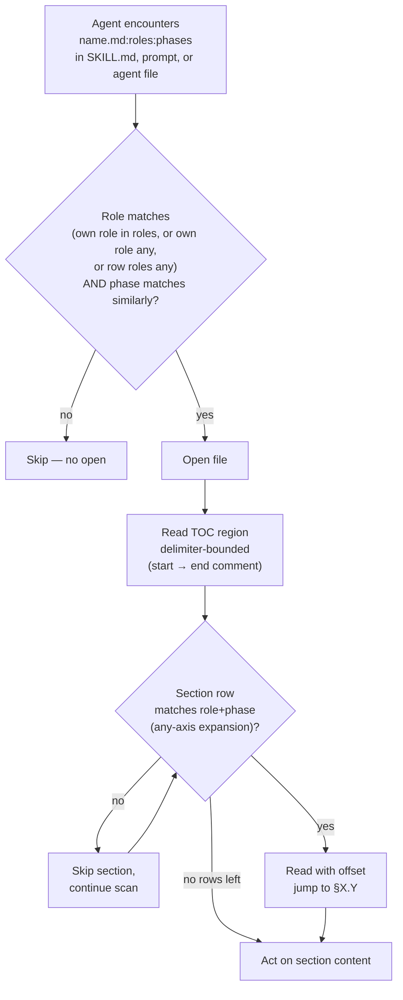

# Per-document TOC + per-section role/phase annotations — Final Design

## Overview

YouTrackDB's workflow docs are full-file-loaded by the Read tool. That one tool accounted for 51.9% of session context across the active projects measured in YTDB-1023, and telemetry run from this worktree at the end of the rollout put the local figure higher still, near 72.6%. The orchestrator opened `implementer-rules.md` in full even though the design declares it implementer-only; agents opened `conventions.md` in full to learn one rule out of fifteen. Section-level filtering was missing.

The rollout adds three metadata layers so an agent can decide *whether* to open a file and *which section to jump to* before paying the read cost. The **bootstrap layer** is an instruction block at the top of every workflow-related system prompt: 7 SKILL.md files, 11 `.claude/workflow/prompts/*.md`, and 20 `.claude/agents/*.md`, 38 surfaces in all, loaded by the harness or as Agent-tool prompt content without a prior Read. A fresh sub-agent learns the TOC-aware reading protocol from its own system prompt before it Reads anything. The **file-level layer** is the `name.md:roles:phases` cross-reference suffix, carried at every cross-file reference site across the in-scope workflow docs and prompts, not only in SKILL.md read-lists and agent files as first scoped. The reader filters by role and phase before opening. The **section-level layer** is an HTML annotation comment on the line after every `##`/`###` heading, mirrored into a machine-extractable `<!--Document index start--> … <!--Document index end-->` table at the top of each file. Both filter layers draw role and phase tokens from locked enums in a new `conventions.md §1.8`.

`CLAUDE.md` is intentionally out of scope. It is a general-purpose project guide loaded into every session regardless of role or phase; the file-level filter does not apply, and the bootstrap block lives in workflow-related system prompts only. A workflow-doc reference *to* `CLAUDE.md` is backtick-wrapped as a non-annotatable target.

Two mechanical Python scripts, no LLM, carry the enforcement. `workflow-reindex.py` validates the schema at pre-commit and CI time and rebuilds the TOC tables; the `review-workflow-context-budget` agent absorbs the qualitative audit at PR review. `measure-read-share.py` is standing Phase 4 infrastructure: every future ADR carries a percentages-only token-usage snapshot for the worktree that ran it.

The rest of this document covers, in order: Core Concepts; the files and surfaces out of scope; the annotation idiom and TOC region; the role and phase enums; the cross-reference convention; the bootstrap protocol for agent system prompts; the reindex script; the telemetry script; the CI gate semantics; the migration replay semantics; and the Phase 4 ADR template extension.

## Core Concepts

This design introduces eight load-bearing ideas. Each is named and used without re-definition in the sections that follow.

**TOC region.** A delimited Markdown table directly under the H1 of every annotated file, between `<!--Document index start-->` and `<!--Document index end-->` comments. Lists one row per `##` and one row per `###` heading, no author-judged granularity. The CI gate rebuilds the table from the per-section annotations and fails on divergence. Replaces the implicit "open the file and scan its `##` headings" pattern. → §"Annotation idiom and TOC region".

**Section annotation.** An HTML comment on the line after every `##` and `###` heading carrying `roles=...`, `phases=...`, and `summary="..."`. Invisible to humans, parsed by one regex. The single source of truth for the TOC region above. → §"Annotation idiom and TOC region".

**Role enum.** 15 values naming every distinct calling agent across the workflow: `orchestrator`, `planner`, `implementer`, `decomposer`, `final-designer`, `migrator`, `pr-reviewer`, `reviewer-technical`, `reviewer-risk`, `reviewer-adversarial`, `reviewer-plan`, `reviewer-design`, `reviewer-dim-step`, `reviewer-dim-track`, `any`. Locked in `§1.8`. → §"Role and phase enums".

**Phase enum.** 8 values naming the workflow's phase taxonomy: `0`, `1`, `2`, `3A`, `3B`, `3C`, `4`, `any`. → §"Role and phase enums".

**Cross-reference convention.** Workflow-doc references carry a `roles:phases` suffix so the reader can filter before opening or jumping. Cross-file refs use the full `name.md:roles:phases` form and are hand-written, with the script subset-validating each citer's slice against the target heading's current annotation. The convention covers every cross-file reference site in the in-scope workflow docs and prompts, and the SKILL.md read-lists and agent files; non-annotatable targets are backtick-wrapped instead of suffixed. In-file refs (`§X.Y` and `§X.Y(z)` inside a workflow doc) use the shorter `§X.Y(z):roles:phases` form and are auto-stamped by `workflow-reindex.py --write`. → §"Cross-reference convention".

**Bootstrap block.** An instruction block at the top of every workflow-related system prompt that names the agent's role and explains the TOC-aware reading protocol. Scope: 7 SKILL.md, 11 `.claude/workflow/prompts/*.md`, 20 `.claude/agents/*.md`, 38 files total. Closes the chicken-and-egg gap: the cross-ref protocol is defined in `conventions.md §1.8`, but an agent that does not know the protocol would Read §1.8 in full to learn it. → §"Bootstrap protocol for agent system prompts".

**`workflow-reindex.py`.** Mechanical Python script at `.claude/scripts/workflow-reindex.py`, stdlib only. Modes: `--check` (CI / pre-commit) and `--write` (author rebuild of TOC tables and in-file ref auto-stamping). Eight validation rules; no LLM. → §"Reindex script".

**`measure-read-share.py`.** Mechanical Python script at `.claude/scripts/measure-read-share.py`. Runs once per Phase 4 ADR creation, from the worktree only. Outputs a percentages-only Read% snapshot over the worktree's transcript-folder lifetime. → §"Telemetry script".

## Files and surfaces out of scope

**TL;DR.** The schema covers a specific set of workflow-related Markdown: 31 docs under `.claude/workflow/`, 11 prompts under `.claude/workflow/prompts/`, 7 workflow-referencing SKILL.md, and 20 agent definitions under `.claude/agents/`. Six exclusions follow; each cross-references the mechanism section that owns its authoritative rule. This section is the single anchor a reader follows when asking "does the schema apply to X?".

### The six exclusions

1. **Agent files lack per-section TOC + annotations.** The 20 `.claude/agents/*.md` files carry the bootstrap block at the top and the cross-file `:roles:phases` suffix on their outgoing workflow-doc references, but no per-section HTML annotation comments and no TOC region. The Read tool never opens agent files; they load as system prompts when sub-agents spawn, so per-section annotations would not save Read-tool tokens. The cross-file suffix convention is broader than agent files alone (every in-scope workflow doc and prompt carries the suffix at its cross-file reference sites); agent files are one citing surface among several, and they enter the reindex gate's cross-file-ref and bootstrap-presence rules through a dedicated live-agent citing scope rather than the in-scope discovery globs. → §"Bootstrap protocol", §"Reindex script" → §"Discovery mechanism".

2. **`CLAUDE.md` is excluded from all three layers.** No section-level annotations, no cross-file suffix on its workflow-doc references, no bootstrap block. It is a general-purpose project guide loaded into every session regardless of role or phase, so the skip-on-role-mismatch filter does not apply. A workflow-doc reference *to* `CLAUDE.md` is backtick-wrapped as a non-annotatable target so the cross-file-ref rule stays green without suffixing a file the convention does not govern. → §"Overview".

3. **Phase 4 final artifacts carry no annotations.** `design-final.md`, `design-mechanics-final.md` (when present), and `adr.md` are durable post-merge artifacts under `docs/adr/<dir>/`, outside `_workflow/`. They are committed once and read by humans on GitHub, not loaded by sub-agents at runtime, so the Read-share problem this rollout solves does not reach them. → §"Migration replay semantics".

4. **Ephemeral `_workflow/**` artifacts carry no annotations.** `implementation-plan.md`, `design.md`, `design-mechanics.md` (when present), `plan/track-N.md`, `design-mutations.md`, and any `handoff-*.md` live under `_workflow/` for the branch's lifetime and are removed in the Phase 4 cleanup commit before merge. Per-section TOC + annotations on them would impose author-time burden on every plan for marginal savings on already-short working files. The discovery globs deliberately omit `_workflow/**` live paths; the staged subtree under `_workflow/staged-workflow/` is the one exception, and only because it mirrors live `.claude/workflow/**` and `.claude/skills/**` paths the convention does govern. → §"Reindex script" → §"Discovery mechanism".

5. **Non-workflow skills carry no bootstrap block.** Skills like `ai-tells`, `run-jmh-benchmarks-hetzner`, `profile-jmh-regressions`, `run`, `verify`, `init`, `review`, `security-review` do not Read files under `.claude/workflow/` or `.claude/skills/` at runtime, so the bootstrap block would be inert text. The 7 workflow-referencing skills (`create-plan`, `execute-tracks`, `edit-design`, `migrate-workflow`, `review-workflow-pr`, `review-plan`, `code-review`) are the explicit allow-list for bootstrap insertion. → §"Bootstrap protocol".

6. **Files with no `^## ` headings carry no TOC region.** A rare but legal shape. The reindex script's rule 2 accepts an empty or omitted TOC for such files; rule 4 (annotation density) is trivially satisfied with no headings to annotate. → §"Reindex script" → §"Edge cases / Gotchas".

The `.claude/scripts/**` tree is non-Markdown (Python source) and outside any annotation scope by file extension; that exclusion is mechanical rather than a design decision and is named here for completeness.

### Edge cases / Gotchas

- A `.claude/agents/*.md` file that grows large enough to consider per-section TOC: the answer stays "no per-section annotations for agent files." The fix for an oversized agent file is to extract content into a workflow doc the agent Reads on demand, not to annotate the agent file.
- A skill that is non-workflow today but starts Reading workflow files in the future: the bootstrap-block scope and the reindex script's rule 7 allow-list grow in the same commit as the new Read path.
- A new `_workflow/**` artifact type a future workflow-format commit adds stays unannotated by default; a commit that wants the schema to cover it opts in by extending the discovery globs.

### References

- D6: Agent files get refs-only suffix sweep plus bootstrap block (no per-section annotations).
- D8: Bootstrap block embedded in every workflow-related system prompt.
- D13: Cross-file suffix convention applies to all in-scope workflow docs and prompts.

## Annotation idiom and TOC region

**TL;DR.** Every in-scope file carries a delimited index table directly under the H1 plus a one-line HTML comment after every `##`/`###` heading. The table mirrors the comments; `workflow-reindex.py` keeps both halves in sync.

### Idiom shape

```markdown
<!-- workflow-sha: <40-char SHA> -->
# Conventions

<!--Document index start-->
| Section | Roles | Phases | Summary |
|---|---|---|---|
| §1.1 Glossary | any | any | Workflow vocabulary, controlled enums. |
| §1.6 Workflow-SHA stamps | orchestrator, migrator | 1,3A,3B,3C,4 | Stamp format, computation, range. |
| §1.7 Staging for workflow-modifying branches | orchestrator, implementer, final-designer | 3A,3B,3C,4 | Staged subtree, marker, reads precedence. |
<!--Document index end-->

## 1.1 Glossary
<!-- roles=any phases=any summary="Workflow vocabulary, controlled enums." -->

| Term | Definition |
|---|---|
...
```

The annotation comment lives on the line immediately after the heading. A reader scrolling to a section sees the annotation as context; a reader scanning the file's table of contents sees the same metadata aggregated.

### Field rules

- `roles=`: comma-separated list of role-enum values, no spaces, at least one value. `roles=any` is allowed.
- `phases=`: comma-separated list of phase-enum values, no spaces, at least one value. `phases=any` is allowed.
- `summary="..."`: one-line human-readable description, ≤120 chars, double-quoted. Quotes inside the summary escape (`summary="Reads \"index\" entries"`), or the author rewrites to avoid them.
- The TOC's column order is fixed: `Section | Roles | Phases | Summary`. The `Section` cell carries the `§X.Y` anchor plus the heading text; a `|` inside heading text is escaped so it does not break the table.

### Edge cases / Gotchas

- Headings inside fenced code blocks or HTML comments are not real headings; the reindex script's regex skips them.
- A `##` or `###` heading without an annotation comment on the next line is a CI blocker. `### ` annotations are required at the same density as `## ` annotations. The single exception is the bootstrap-block heading `## Reading workflow files (TOC protocol)`; see §"Bootstrap protocol" → §"Block placement and stability".
- A file with no `^## ` headings needs no TOC region; the gate accepts an empty or omitted TOC for such files.

### References

- D2: Per-section annotation as HTML comment on the line after the heading.

## Role and phase enums

**TL;DR.** Both vocabularies live in `conventions.md §1.8` and are closed at rollout: 15 values name every distinct calling agent across the workflow, 8 values name the workflow's phase taxonomy. Out-of-enum tokens fail CI; future additions require a workflow-format commit.

### Role enum (15 values)

```
any
orchestrator         — /execute-tracks session-level driver (Phases 2, 3A/B/C, 4 orchestration)
planner              — /create-plan agent (Phases 0, 1)
implementer          — per-step implementer (Phase 3B sub-steps 1–3)
decomposer           — Phase 3A step decomposer
final-designer       — Phase 4 final-artifact authoring (prompts/create-final-design.md)
migrator             — /migrate-workflow agent
pr-reviewer          — /review-workflow-pr agent
reviewer-technical   — Phase 3A technical review
reviewer-risk        — Phase 3A risk review
reviewer-adversarial — Phase 3A adversarial review
reviewer-plan        — Phase 2 consistency + structural reviewers (paired role)
reviewer-design      — design-mutation cold-read (prompts/design-review.md)
reviewer-dim-step    — Phase 3B step-level dimensional reviewers
reviewer-dim-track   — Phase 3C track-level dimensional reviewers
```

`reviewer-plan` folds the Phase 2 consistency and structural reviewers into one tag because the pair always run together. The 6 `review-workflow-*` agents activate as scope-flagged variants of `reviewer-dim-step` / `reviewer-dim-track`; no separate role.

### Phase enum (8 values)

```
0    Research                              (/create-plan interactive exploration)
1    Planning                              (/create-plan plan + design authoring)
2    Plan Review                           (autonomous, /execute-tracks State 0)
3A   Track Review + Decomposition
3B   Step Implementation
3C   Track-Level Code Review + Track Completion
4    Final Artifacts                       (workflow-modifying plans: 3 commits;
                                            non-workflow-modifying: 2 commits)
any  Wildcard
```

### Cross-cutting flows

The phase taxonomy does not carve out separate tokens for ESCALATE / inline-replanning (runs within Phase 3A or 3C; tag `phases=3A,3C`), review mode (same tag), or `edit-design` mutations (Phase 1, 3A, 3C, 4; tag the union). `/migrate-workflow` and `/review-workflow-pr` sit outside the phase taxonomy and use `phases=any`.

### Edge cases / Gotchas

- The CI gate accepts enum tokens with zero in-file users — future enum additions land before their first author.
- Comma-separated lists must not contain spaces; the script's regex enforces this.

### References

- D1: Lock the enum at 15 roles + 8 phases.

## Cross-reference convention

**TL;DR.** Workflow-doc references carry a `roles:phases` suffix so the reader filters before opening (cross-file refs) or before jumping (in-file refs). Cross-file refs use the full `name.md:roles:phases` form and are hand-written across every in-scope workflow doc and prompt, plus SKILL.md read-lists and agent files; references to non-annotatable targets are backtick-wrapped instead of suffixed. In-file refs use the shorter `§X.Y(z):roles:phases` form and are auto-stamped by `workflow-reindex.py --write`. `CLAUDE.md` is a backtick-wrapped non-annotatable target.

### Format

```
conventions.md:orchestrator,implementer:1,3A,3B,3C       # cross-file, hand-written
step-implementation.md:implementer:3B                    # cross-file, hand-written
implementer-rules.md:implementer:3B,3C                   # cross-file, hand-written
prompts/technical-review.md:reviewer-technical:3A        # cross-file, hand-written
§1.6(c):migrator:3A,3B,3C,4                              # in-file, auto-stamped by --write
§1.7:orchestrator,implementer,final-designer:3A,3B,3C,4  # in-file, auto-stamped by --write
```

The path is relative to the conventional anchor (`.claude/workflow/`, `.claude/skills/`). The suffix's colons separate the three fields; `,`-separated lists inside each field follow the same no-space rule as section annotations. Cross-file refs carry the `.md` filename; in-file refs start at `§` and omit the file part. A workflow-root file is referenced bare (`structural-review.md:...`); a prompt with the same basename carries the `prompts/` prefix (`prompts/structural-review.md:...`).

### Read-decision flow



The flow's load-bearing properties: the file-level filter avoids the open when neither role nor phase matches; the TOC filter avoids the full-section read when the section's role+phase does not match. The read window is bounded by the `<!--Document index start-->` / `<!--Document index end-->` delimiters rather than a fixed line count, because on `conventions.md` the TOC region exceeds 80 lines and a fixed-count reader truncates it. The match expands the reader's own `any` on either axis: a reader whose role or phase is `any` is audience-agnostic on that axis and considers every row.

### In-file reference auto-stamping

In-file `§X.Y` and `§X.Y(z)` references inside any in-scope workflow doc are auto-stamped by `workflow-reindex.py --write`. The author writes the plain ref (`§1.6(c)`); the script resolves the target heading, reads its annotation, derives the matching `roles:phases` suffix, and rewrites the ref in place. The author never types the suffix and never updates it when the target's annotation changes — `--write` is the single source of truth for the stamped form.

**Why auto-stamp in-file but hand-write cross-file.** Cross-file refs are fewer per file and the citer often cares about a narrow slice of the target's role/phase set, so hand-writing lets the citer record what it cares about. In-file refs are common, the target's annotation lives in the same file (so resolving the suffix is mechanical), and the citer almost always means the target's full annotation, so auto-stamping eliminates author burden and keeps the suffix in sync mechanically.

**Cross-file drift detection.** The script subset-validates each hand-written cross-file slice against the target heading's current annotation: `citer.roles ⊆ target.roles` AND `citer.phases ⊆ target.phases`. Equality is not required — narrower is the contract. A subset violation surfaces when a target's annotation is tightened and the citer's slice falls out of subset; the CI error names both sides. The reader-side `any`-axis expansion in the TOC match is distinct from this one-way citer-side subset rule: a citer's `any` never widens against a narrower target. A whole-file cross-file ref resolves against the union of every `##`/`###` annotation in the target file; `####` annotations are excluded from that union, so a citer claiming an H4-only token fails the subset check.

**Staged target resolution on workflow-modifying branches.** On a workflow-modifying branch the annotated copy of a cross-file target is the staged copy, not the live develop-state copy (which carries no annotations yet). The script's file lookup resolves a cross-file target staged-first: when a basename resolves to both a live and a staged copy, it prefers the staged copy keyed by its relative `.claude/...` path. A bare-basename ref resolves to the workflow-root file when a `prompts/` namesake exists, and a `<skill-dir>/SKILL.md` ref resolves through a directory-prefixed key. On `develop` and non-workflow-modifying branches no staged copy exists, so the lookup stays pure-live.

**Cross-file sub-section precision.** A cross-file ref may pin a sub-section by appending `§X.Y(z)` after the filename. In live prose the in-file scanner matches the `§X.Y` tail independently, so a cross-file ref that pins a sub-section is written as a whole-file `name.md:roles:phases` ref plus a separate backtick-wrapped `§X.Y` token rather than the fused `name.md§X.Y:...` form.

### Edge cases / Gotchas

- A reference without the `:roles:phases` suffix in scope of the CI gate is a blocker; a reference to a non-annotatable target is backtick-wrapped and excluded instead.
- A reference inside fenced code blocks or example text is excluded from both `--check` validation and `--write` rewriting by code-fence boundary tracking.
- An in-file ref to a heading that does not exist (typo in the section number or letter) is a CI blocker surfaced at `--check` time.

### References

- D2: Per-section annotation as HTML comment on the line after the heading.
- D9: In-file `§X.Y(z)` references auto-stamped with target-derived suffix.
- D10: Subset-validate cross-file ref suffixes against target annotations.
- D13: Cross-file suffix convention widened to all in-scope workflow docs and prompts.
- D14: Cross-file ref targets resolve staged-first on workflow-modifying branches.
- D15: Bare-basename refs resolve to the workflow-root file when a `prompts/` namesake exists.
- D16: `<skill-dir>/SKILL.md` key so SKILL targets resolve.
- D19: Reader-side TOC match expands the reader's own `any`; read window is delimiter-bounded.

## Bootstrap protocol for agent system prompts

**TL;DR.** Every workflow-related SKILL.md, `.claude/workflow/prompts/*.md`, and `.claude/agents/*.md` carries a short instruction block at the top. The block teaches the TOC-aware reading filter so a spawned sub-agent (which loads with a fresh context window and no inheritance from its parent) applies the filter from its first Read instead of paying the full-file cost to bootstrap itself.

### Why the bootstrap exists

The TOC protocol relies on the agent filtering by role and phase before opening a workflow file. The schema lives in `conventions.md §1.8`. An agent that does not know the protocol would Read `conventions.md` in full to learn it, which defeats the purpose. The workflow spawns sub-agents at every review boundary (Phase 2, Phase 3A, Phase 3B step-level, Phase 3C track-level, Phase 4), each starting with a fresh context window; the parent's TOC-aware decisions do not propagate. The bootstrap block embeds enough protocol detail in every system prompt that the agent applies it from its first Read onward.

### Bootstrap block content

Embedded at the top of each in-scope file:

```markdown
## Reading workflow files (TOC protocol)

When you Read any file under `.claude/workflow/` or `.claude/skills/`, follow the protocol in `conventions.md §1.8`:

1. Read the TOC region — from `<!--Document index start-->` to `<!--Document index end-->`. Read to the closing delimiter rather than stopping at a fixed line count; on large files like `conventions.md` the region exceeds 80 lines. If a file has no TOC region, read its opening section to orient instead.
2. Match TOC rows where Roles contains any of your roles (or one of your roles is `any`, or the row's Roles is `any`) AND Phases contains any of your phases (or one of your phases is `any`, or the row's Phases is `any`).
3. Use `Read(offset, limit)` to read only matched sections. If no rows match, you need nothing from the file — stop.

Your role: <role token(s) from the §1.8 role enum>.
Your phase: <fixed for agent files and prompts; auto-resume-derived for SKILL.md>.

Inline refs you find inside workflow files carry the same `name.md:roles:phases` suffix; apply file-level filtering before opening. Backtick-wrapped refs (for example a non-annotatable target, or a bare `§1.8(d)` anchor) carry no suffix; open or skip them at your discretion.
```

The block is byte-identical across all 38 files except for the role and phase lines. The match rule is any-of/OR on both axes so a multi-hat reader (a dimensional reviewer, `code-reviewer`, `test-quality-reviewer`, or a multi-role gate prompt that carries a role/phase *set*) matches a row when any of its roles and any of its phases line up. A reader with no matching rows stops without opening sections.

### Scope and uniformity

- **In scope (38 files).** 7 workflow-referencing SKILL.md; 11 prompts under `.claude/workflow/prompts/`; 20 agent files under `.claude/agents/`.
- **Uniform application.** Every in-scope file carries the block regardless of whether the agent ever Reads a workflow file at runtime. The cost is a short system-prompt block per file, paid against forward refactor safety when future workflow changes add new Read paths.
- **Out of scope.** `CLAUDE.md`; non-workflow skills that do not Read files under `.claude/workflow/` or `.claude/skills/` at runtime.

### Block placement and stability

The block sits between the frontmatter and the main body. Three anchor shapes are accepted, matching the structural variety across the 38 files: directly under the H1 (files that open with a title), after the frontmatter `---` block (SKILL.md and most agent files), and at the top of the file (prose-first prompts with neither frontmatter nor an early H1). On files with a TOC region (the 7 SKILL.md and 11 prompts), the bootstrap block sits before the TOC region; the TOC region remains directly under the H1.

When an in-scope file is updated, the block is preserved byte-for-byte unless the role or phase mapping changes. The reindex script's rule 7 validates presence by literal heading match (`## Reading workflow files (TOC protocol)`); content is hand-written and not validated.

**Interaction with TOC density rules.** The bootstrap heading is exempt from rule 3 (every heading has a TOC row) and rule 4 (every heading carries an annotation comment), via the same literal-heading match rule 7 already keys off, so the script holds one carve-out, not three. The heading carries no annotation comment and produces no TOC row in any of the 38 files. The no-TOC reading complement in the bootstrap body (step 1's "if a file has no TOC region, read its opening section") and the no-rows-match terminal (step 3's "stop") close the two decision branches a fixed-shape body left open.

### CI enforcement

Rule 7 checks bootstrap-block presence on every in-scope SKILL.md, prompt, and agent file. The 20 live agent files enter rule 7 (and the cross-file-ref rule 6) through a dedicated live-agent citing scope, not the in-scope discovery globs; see §"Reindex script" → §"Discovery mechanism". A missing block fails the gate. The check is presence-only.

### Edge cases / Gotchas

- Rule 7 validates presence, not body correctness. A body defect (a stale match clause, a truncating read window) is gate-invisible and surfaces only under hand-review. Three successive hand-review passes during the rollout each found a deeper body gap for exactly this reason; the body in the 38 files is the corrected form.
- An agent file that never Reads a workflow file at runtime still carries the block per the uniformity rule.
- A new in-scope file added after rollout must carry the block before its first commit; the script catches the omission at CI time.
- Updating the block across all 38 files is a single coordinated edit via `steroid_apply_patch` on the unified heading + body pair.

### References

- D8: Bootstrap block embedded in every workflow-related system prompt.
- D19: Bootstrap block reader-side match expands the reader's own `any`; read window delimiter-bounded.

## Reindex script

**TL;DR.** `.claude/scripts/workflow-reindex.py`, mechanical Python, stdlib only. Modes: `--check` (CI / pre-commit, exit nonzero on findings) and `--write` (rebuild TOC tables and auto-stamp in-file refs in place, idempotent on already-consistent files). Eight validation rules. Self-bootstraps the enum tokens from `conventions.md §1.8`, staged-aware.

### Discovery mechanism

The walk runs a fixed set of globs, not a manifest. Six glob patterns ship: three for the live tree and three for the staged subtree present only on workflow-modifying branches.

```
# Live — the canonical workflow surface
.claude/workflow/**/*.md
.claude/workflow/prompts/**/*.md
.claude/skills/{create-plan,execute-tracks,edit-design,migrate-workflow,review-plan,review-workflow-pr,code-review}/SKILL.md

# Staged — workflow-modifying branches only (conventions.md §1.7)
docs/adr/*/_workflow/staged-workflow/.claude/workflow/**/*.md
docs/adr/*/_workflow/staged-workflow/.claude/skills/**/SKILL.md
docs/adr/*/_workflow/staged-workflow/.claude/agents/**/*.md   # inert — agents are never staged
```

The pre-commit hook and the CI workflow pass staged paths through `--files`, so the discovery walk has to enumerate the same staged surface. The staged-agents glob is inert: agent files fall outside the stageable-path scope (`.claude/workflow/**` and `.claude/skills/**` only), so no staged agent ever exists. It is left in place rather than removed because it changes no observable behaviour and a test asserts its presence.

Live agent files are validated through a **separate rules-6/7-only citing scope**, not the in-scope globs. Routing the 20 `.claude/agents/*.md` files through `IN_SCOPE_GLOBS` would subject them to all eight rules and over-fire the TOC-density rules (2, 3, 4) and the annotation/in-file rules (5, 8) — agent files carry no TOC and no per-section annotations by design. The dedicated scope enters them into only the cross-file-ref subset rule (6) and the bootstrap-presence rule (7), with a per-rule applicability gate that keeps the TOC rules from demanding a TOC on an agent file.

The enum tokens (15 roles, 8 phases) are read from `conventions.md §1.8` at run time, via the same staged-first reads-precedence the cross-file lookup uses: on a workflow-modifying branch the script reads the staged `conventions.md §1.8` when present, falling back to the live copy. A probe that finds two staged `conventions.md` candidates across multiple workflow-modifying plans in one worktree halts with exit 2 rather than guessing.

### Validation rules

For every in-scope file:

1. **Stamp present.** Line 1 carries the workflow-SHA stamp per `conventions.md §1.6`. Live agent files are exempt (they carry no `_workflow/**` stamp), which is why the live-agent citing scope enters only rules 6 and 7.
2. **TOC region present.** Exactly one `<!--Document index start-->`/`end-->` pair under the H1. Exempt: files with no `^## ` headings, and the bootstrap heading by literal match.
3. **TOC matches annotations.** Every `^## ` and `^### ` heading has a TOC row; every TOC row maps to a real heading. `--write` rebuilds the TOC from the annotations. Exempt: the bootstrap heading by literal match.
4. **Annotation present after every `## ` and `### ` heading.** No author-judged granularity. Exempt: the bootstrap heading by literal match. Fenced-code and HTML-comment headings are skipped by the parser; final-artifact template headings shown inside fenced blocks are out of scope.
5. **Annotation fields well-formed.** `roles=`, `phases=`, `summary="..."`; all tokens drawn from the locked enums.
6. **Cross-file reference suffix (hand-written, subset-validated).** Every workflow-doc reference in the in-scope files, in `.claude/skills/*/SKILL.md`, and in `.claude/agents/*.md` carries the `name.md:roles:phases` suffix; the citer's roles/phases must be a subset of the target heading's current annotation. Sub-section refs resolve to that section's annotation; whole-file refs resolve to the union of every `##`/`###` annotation (H4 excluded). Targets resolve staged-first, with bare-basename → workflow-root and `<skill-dir>/SKILL.md` keying. Non-annotatable targets are backtick-wrapped and excluded.
7. **Bootstrap block presence.** Each of the 7 SKILL.md, 11 prompts, and 20 live agent files carries the bootstrap block, by literal heading match. Presence-only.
8. **In-file reference suffix (auto-stamped).** Every in-file `§X.Y` / `§X.Y(z)` ref carries the matching `:roles:phases` suffix derived from the target heading. Unstamped refs, drifted suffixes, and refs to a non-existent heading are blockers; `--write` fixes the first two. Refs inside fenced code blocks and example text are excluded.

### Exit codes

- `0` — all checks pass.
- `1` — one or more findings (CI failure).
- `2` — script error (invalid argument, missing files, ambiguous staged probe).

### Output format

Findings print one line per finding: `path:line:category: explanation`. The `in-file-ref:` category covers unstamped, drifted, and unresolved refs; the `cross-file-ref:` category covers subset violations, unresolved targets, and missing suffix.

### `--write` semantics

- Rebuilds the TOC region in place from current annotation comments.
- Auto-stamps in-file `§X.Y` / `§X.Y(z)` refs from each target heading's annotation; plain refs gain the suffix, drifted refs are rewritten.
- Does NOT add or modify per-section annotations or cross-file suffixes — those are the author's responsibility.
- Skips refs inside fenced code blocks and example text; halts and reports without rewriting if any in-file ref does not resolve.
- Idempotent: a second run produces no diff.

### Edge cases / Gotchas

- A file with a TOC region but no annotations is a CI failure — the TOC has no source of truth to rebuild from.
- The pre-commit hook runs the script only on staged in-scope files; CI runs against the full file set.
- The hand-vs-auto split for ref suffixes follows cross-file vs in-file, not the presence of `§X.Y(z)`. `--write` never touches cross-file refs.
- A cross-file subset violation from a tightened target lands as a `--check` blocker; the fix is hand-editing the citer or the target, not `--write`.

### References

- D5: Reindex script at `.claude/scripts/workflow-reindex.py`, mechanical Python, no LLM.
- D9: In-file `§X.Y(z)` references auto-stamped with target-derived suffix.
- D10: Subset-validate cross-file ref suffixes against target annotations.
- D12: Reindex script self-bootstraps enum tokens via staged-aware probe of `conventions.md §1.8`.
- D13: Cross-file suffix convention widened to all in-scope workflow docs and prompts.
- D14: `build_file_lookup` resolves cross-file targets staged-first.
- D15: `build_file_lookup` resolves a bare-basename ref to the workflow-root file when a `prompts/` namesake exists.
- D16: `build_file_lookup` records a `<skill-dir>/SKILL.md` key.
- D17: `workflow-reindex.py` scopes live agent files into rules 6 and 7 only.

## Telemetry script

**TL;DR.** `.claude/scripts/measure-read-share.py`. Runs once per Phase 4 ADR creation, from the worktree only. Outputs a percentages-only Read% snapshot over the worktree's transcript-folder lifetime. Skips with a notice when invoked outside a dedicated worktree. Standing infrastructure: every future Phase 4 ADR carries the section.

### Scope and detection

The script measures `~/.claude/projects/<encoded-cwd>/**/*.jsonl` recursively (sub-agent transcripts live under `<transcript-stem>/subagents/` and account for most jsonl files). `<encoded-cwd>` is the cwd with `/` replaced by `-`; the script resolves the cwd via `Path.cwd().resolve()` first so a symlinked worktree root maps to the right encoded folder, and falls back to the raw `Path.cwd()` encoding if the resolved-path folder is missing.

Worktree-vs-main detection routes through the `.git` file-vs-directory shape, not `git worktree list` ordering: the main checkout has `.git` as a directory; a linked worktree has `.git` as a file. The shape check is documented by git and stable across versions, where the porcelain-position heuristic ("first entry is main") is not.

### Measurement methodology

For each transcript: read every line as JSON; build a `tool_use_id → (tool_name, tool_input)` index from `assistant` records' `tool_use` entries (so `tool_result` blocks, which carry only `tool_use_id`, recover their tool name); classify content blocks into six buckets (`Read`, `Bash`, `Grep`, `Edit`, other tool results, prompts-and-output); dedup per record by `uuid`; sum content tokens per bucket with a `char/4` approximation; compute Read share. The top-files table ranks paths within the Read bucket, normalises every path repo-relative against the worktree root, and emits the top ten. Percentages render to one decimal place with largest-remainder rounding so each column sums to exactly 100.0%.

Several methodology limits are worth recording for a reader interpreting the published number. The `char/4` heuristic diverges from the API's `usage.input_tokens` by roughly 10–20%; absolute counts are never published, only percentages, so the approximation does not affect the reported figure but it does mean the snapshot is not a token-accurate accounting. The window is the worktree's full lifetime, which is not comparable across ADRs of different durations — two ADRs' Read% are read as independent snapshots, not a controlled trend. The script's per-record `uuid` dedup is deliberately distinct from `session-stats.py`'s assistant-only `(message.id, requestId)` key, which does not exist on `tool_result` records; the two scripts share a transcript-walker shape but diverge on the dedup key, so they are not drop-in equivalents.

### Output format

On success the script emits a `## Token usage telemetry` section: a tool-mix table (six rows, summing to 100.0%) and a repo-relative top-files table, plus a one-line `Generated by …` footer. The script buffers the full section in memory and prints it atomically.

Four skip-notice templates ship, one per distinct cause so an ADR reader can tell which trigger fired:

- **Main checkout** (`.git` is a directory) — per-feature telemetry only applies in a dedicated worktree.
- **No transcripts** — the worktree's transcript folder is empty (an IDE session with no Claude Code log).
- **No checkout** (`.git` missing or unreadable) — running outside any git tree.
- **Mid-walk parse error** — a transcript line failed to parse; the script prints the per-file error and exits 0 so the ADR commit still succeeds.

Every skip path exits 0, so the ADR commit never fails on telemetry.

### Phase 4 integration

`prompts/create-final-design.md`'s ADR-write step invokes the script while composing `adr.md` and embeds its stdout as the `## Token usage telemetry` section in the same write. The final-artifacts commit only stages files already on disk, so it is not the hook point.

### Edge cases / Gotchas

- A transcript that mixes pre-rollout and post-rollout sessions is reported as a lifetime aggregate; the user interprets it in ADR prose.
- A Phase 4 session that resumes after an interruption re-runs the script; the output reflects the worktree's full lifetime, so resuming does not produce inconsistent snapshots.
- The top-files table once collapsed to all-`<outside-worktree>` because the repo-root used for relativisation was unresolved on symlinked worktrees; the resolve-then-fallback path now guards it (commit `d00cd91f25`), with a regression test that fails without the fix.

### References

- D4: Telemetry script runs from worktree only; skips when run from main.

## CI gate semantics

**TL;DR.** Two enforcement surfaces call `workflow-reindex.py --check`: an extended `.githooks/pre-commit` hook and a new GitHub Actions workflow. The author fixes findings with `--write` (mechanical) plus hand-editing (annotations, enum tokens, cross-file slices).

### Pre-commit hook (local enforcement surface)

`.githooks/pre-commit` is restructured into two named functions, `run_java_checks` and `run_workflow_reindex_check`, both invoked unconditionally (the Java gate fires only when Java files are staged). The hook runs `set -euo pipefail`, so any future pipeline that legitimately returns nonzero must be wrapped (`{ ... || true; }` or a `set +e`/`set -e` fence) or it fails the commit. The workflow-reindex block filters staged files with `git diff --cached --name-only --diff-filter=ACMR` (excluding deletions) against a regex that matches both live `.claude/{workflow,skills}/**/*.md` / `.claude/agents/**/*.md` paths and their staged-subtree counterparts, then runs `--check --files` on the matched set. A grep exit-code discriminator separates "no matches" (clean, skip the check) from a real grep failure.

### GitHub Actions step

A dedicated workflow at `.github/workflows/workflow-toc-check.yml` (`name: Workflow TOC check`) runs `workflow-reindex.py --check` against the full file set on `pull_request`. The activity-types filter includes `ready_for_review`, and the job is gated with `if: github.event.pull_request.draft == false`, so the gate is silent during draft iteration and runs the moment the PR is marked ready for review.

### Author fix loop

Run `--check` locally; for mechanical findings (TOC out of sync, in-file-ref drift) run `--write`; for annotation findings (missing field, out-of-enum token) and cross-file subset violations hand-edit; commit and push; CI re-runs the check.

### Agent-side absorption

`.claude/agents/review-workflow-context-budget.md` invokes the script during workflow-machinery PR review. The six `review-workflow-*` agents each carry a per-finding numeric prefix drawn from the family `WC / WP / WI / WH / WB / WS` (one letter per review dimension), matching the canonical letters in `review-iteration.md` and `review-agent-selection.md`. The prefix lives alongside the existing `Critical / Recommended / Minor` severity labels, and a within-bucket ordering rule (source, then file path, then ascending line) fixes the emission order.

### Edge cases / Gotchas

- The hook's staged-file filter must use `--diff-filter=ACMR` so a deleted file does not fail the gate for itself.
- CI runs in a fresh checkout; the script reads enums from the checked-out `conventions.md §1.8`, so the gate self-bootstraps once §1.8 lands.
- A PR that deletes an in-scope file must also delete its cross-references; the gate detects the dangling reference.

### References

- D5: Reindex script at `.claude/scripts/workflow-reindex.py`, mechanical Python, no LLM.
- D11: `WC / WP / WI / WH / WB / WS` finding-prefix family on the six `review-workflow-*` agents.

## Migration replay semantics

**TL;DR.** This change edits workflow rules and tooling but does not alter `_workflow/**` artifact shape, so `/migrate-workflow`'s replay loop has no content to apply onto branch artifacts. Acceptance is a post-merge procedure: after this plan squash-merges to `develop`, the skill runs clean on candidate branches rebased onto post-plan `develop` — typically a stamp-rewrite-only normalization, or a silent skip when branch stamps are already uniform.

### What this change touches vs. what migration replays

`/migrate-workflow` replays workflow-format commits onto branches' `_workflow/**` files only when a commit alters the shape of those artifacts. The edits here are `conventions.md §1.8` (a new read-only schema section), two new scripts, the agent definitions (refs sweep + bootstrap block), and the workflow docs / prompts / 7 skill files (per-section TOC + annotations, plus the bootstrap block on prompts and SKILL.md). None of these alter the shape of any branch's `_workflow/**` artifacts. Branches that rebase onto `develop` pick up the new rules naturally; their existing artifacts satisfy the new rules without modification.

### What the drift gate sees

A branch with `_workflow/**` artifacts stamped at an older SHA rebases onto `develop`. The Phase 1 walk finds the old stamps; the Phase 2 fold computes the old `BASE_SHA`; `git log <BASE_SHA>..HEAD -- .claude/workflow .claude/skills` returns this plan's commits, and the user is prompted to migrate. The per-commit replay loop finds no `_workflow/**` artifact-shape change to apply (the commits touch `.claude/...` only), so it completes with no edits to the branch's artifacts; the final step rewrites each artifact's stamp to the new workflow-sha in one normalization commit.

### Post-merge acceptance verification

This step is structurally unrunnable before the plan reaches `develop`: the drift gate ranges `git log $BASE_SHA..HEAD` over a candidate branch's own HEAD and never fetches `develop`, so a candidate rebased onto current `develop` gains zero workflow-format commits from a plan that has not merged yet. It runs instead once the squash-merge lands on `develop`: the user runs `/migrate-workflow` in a fresh session on two active candidate branches rebased onto post-plan `develop`, and confirms clean completion (a single stamp-rewrite commit, or a silent skip when stamps are already uniform) followed by a clean `/execute-tracks` startup. The candidate pool of active branches carrying `_workflow/` artifacts includes `ytdb-612-rollback-log`, `read-cache-concurrency-bug`, `ytdb-614-property-map`, and `failed-wal-recovery`; the two picks and the outcome are recorded post-merge in this plan's ADR. The in-branch substitute is a static check that the no-artifact-shape-change premise holds, plus local `--check` and telemetry smokes.

### Edge cases / Gotchas

- A branch whose stamps are non-uniform hits the gate's no-drift-normalization sub-step rather than full migration; either path leaves the branch usable.
- A branch that gained `_workflow/**` artifacts between this plan's start and merge is treated identically: no artifact-shape change to apply, stamp-rewrite-only normalization.
- A branch with un-pushed local commits to its `_workflow/**` artifacts is caught by `/migrate-workflow`'s existing pre-flight, which halts before any rewrite.

### References

- D7: Migration replay is a no-op for this change; verification confirms drift-gate normalization.
- D18: Migration replay verification is a post-merge acceptance step; the in-branch work is a static premise check plus local smokes.

## Phase 4 ADR template extension

**TL;DR.** Every future ADR carries a standard `## Token usage telemetry` section populated by `measure-read-share.py`. The section's prose template lives in `prompts/create-final-design.md`; the script's output is embedded as-is.

### Section placement in `adr.md`

The telemetry output lands at a locked position: immediately after `## Key Discoveries`. It is fixed in the Phase 4 prompt rather than configurable per prompt, so every ADR carries it in the same spot and a reader knows where to find it. The order:

```
# <Plan name> — Architecture Decision Record
## Summary
## Goals
## Constraints
## Architecture Notes
  ### Component Map
  ### Decision Records
  ### Invariants & Contracts
  ### Integration Points
  ### Non-Goals
## Key Discoveries
## Token usage telemetry        ← inserted here (locked position)
```

The telemetry is metadata about session shape, not load-bearing ADR content; placing it after `## Key Discoveries` leaves every existing H2 in place.

### Standing infrastructure properties

- **Every future ADR runs the script.** The Phase 4 prompt invokes `measure-read-share.py` unconditionally; the script's worktree-vs-main detection handles the skip case internally.
- **Output is percentages-only.** The repo is open-source; the script never emits absolute token counts. Skipping anonymization is intentional (single-project scope). The published value is a non-comparable lifetime snapshot, not a token-accurate or cross-ADR-comparable metric — a reader treats consecutive ADRs' figures as independent snapshots.
- **Format is stable across ADRs.** The template (column headers, top-10 cap, generated-by footer) is fixed in the Phase 4 prompt. Future CLI enhancements keep the default rendering stable.

### Edge cases / Gotchas

- A Phase 4 session that runs from the main checkout emits the skip notice; the ADR still carries the section, with the skip explanation.
- On a workflow-modifying plan, telemetry runs during ADR composition, which precedes the promote-staged-workflow commit, so that commit's own session activity is not captured. The omission is one commit's tool-call traffic against a percentages-only lifetime aggregate, below measurement precision.

### References

- D4: Telemetry script runs from worktree only; skips when run from main.
