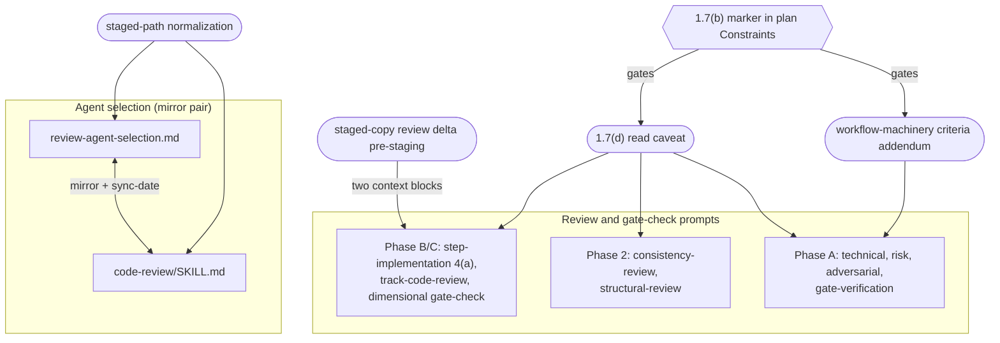

# Staging-aware review machinery — Architecture Decision Record

## Summary

The development workflow reviews its own machinery at three points: a
plan-level review before execution (Phase 2), a track-level review before
each track is decomposed (Phase A), and a dimensional code review of each
track's diff (Phase B/C). Every part addressed workflow files by their live
`.claude/...` path. The `§1.7` staging convention broke that assumption: on
a plan that edits `.claude/workflow/**` or `.claude/skills/**`, the authored
edits accumulate under `docs/adr/<dir>/_workflow/staged-workflow/.claude/...`
and the live files stay at develop's state until one Phase 4 promotion. The
review machinery had not learned this and went stale on such plans in three
ways: selection picked the wrong reviewers, reading compared a change against
develop's version of a rule the branch had already rewritten, and the Phase A
criteria misfired on a track that edits prose.

This work makes the machinery staging-aware. Selection strips the staged
prefix before matching the triggers that pick reviewers. Every review and
gate prompt carries a marker-gated caveat that routes a workflow-document
read through `§1.7(d)` precedence (staged copy when present, else live), and
the orchestrator pre-stages a `diff <live> <staged>` delta so a
freshly-created staged copy is reviewed as its real change rather than a
whole-file add. The Phase A technical, risk, and adversarial reviewers carry
a marker-gated addendum that re-points their criteria from Java to prose. The
change adds no Java types — it edits workflow documents and the rules inside
them.

## Goals

All three met as planned.

- **Selection (YTDB-1032).** A staged workflow edit is seen by the
  reviewer-selection logic as its live counterpart, so every reviewer that
  should fire does.
- **Reading (YTDB-1038), two facets.** A reviewer on a workflow-modifying
  plan reads the staged copy of a referenced rule rather than develop's
  stale version, and a reviewer handed a freshly-created staged copy reviews
  the real delta against the live file rather than the whole-file add.
- **Phase A criteria (YTDB-1046).** The Phase A criteria reviewers verify
  workflow paths and `§`-anchors instead of Java symbols on a
  workflow-machinery track, so a prose reference stops raising a phantom
  `NOT FOUND` blocker.

## Constraints

- The plan was itself workflow-modifying, so all edits staged under
  `docs/adr/<dir>/_workflow/staged-workflow/` and the live tree stayed at
  develop's state until the Phase 4 promotion (the I6 invariant,
  `conventions.md §1.7(g)`).
- **Self-application carve-out (`conventions.md §1.7(h)`).** Because the
  branch stages its own edits, its own Phase A and Phase B/C reviews ran
  against the unfixed live machinery. The orchestrator hand-injected the
  staging and prose-criteria guidance throughout execution — the same manual
  steps these fixes remove for later plans. The fixes take effect for the
  first workflow-modifying plan opened after this branch promotes.
- The selection mirror stays in lockstep (S1): `review-agent-selection.md`
  and the matching steps of `code-review/SKILL.md` changed in one commit with
  the single canonical `<!-- Last sync-checked … -->` date bumped.
- The read caveat reads uniformly across the nine prompts that carry it and
  the Phase A addendum across the three (S3); both fixes and the delta key
  off the single `§1.7(b)` marker or the staged prefix.
- Promotion is additive: the Phase 4 `cp -r` carries additions and edits, not
  deletions. These fixes only add text, so promotion is safe.
- House style applies to every edited Markdown surface.

## Architecture Notes

### Component Map

The components are workflow documents, the rules inside them, and the two
cross-file mirrors.

- **Selection mirror pair** (`review-agent-selection.md` ↔
  `code-review/SKILL.md`): the normalization rule (NORM) lands in both, bound
  by the S1 sync-date constraint.
- **Prompt layers** (Phase B/C dimensional, Phase 2 plan, Phase A track): the
  read caveat (CAVEAT) reaches all three; the addendum (ADD) reaches the
  three Phase A criteria reviewers only; the delta pre-staging (DELTA)
  reaches the two Phase B/C dimensional context blocks only.
- **Marker** (`§1.7(b)` sentence in the plan's `### Constraints`): the single
  gating signal for CAVEAT and ADD, surfaced to review agents through the
  slim plan snapshot. NORM and DELTA key off the staged prefix and need no
  marker — staged paths exist only on plans that carry the marker anyway.

### Decision Records

#### D1: Selection — staged-path normalization over per-glob editing

- **Decision**: strip the anchored
  `docs/adr/<dir>/_workflow/staged-workflow/` prefix from a changed path
  before matching the per-agent trigger globs, rather than extending each
  literal glob in both mirror files to also match the staged prefix.
- **Rationale**: one normalization rule per mirror file is DRY, and a staged
  file then evaluates exactly as its live counterpart would.
- **Outcome**: implemented as planned. The preamble heads
  `§Workflow-machinery override` in `review-agent-selection.md` and Step 5d in
  `code-review/SKILL.md`, with a positive and a negative worked example added
  in `§Examples`. Normalization is scoped to the exact two-level
  `…/_workflow/staged-workflow/.claude/` prefix; a path that merely contains
  `.claude/` lower down does not normalize.

#### D2: Read caveat self-gates on the marker, not orchestrator injection

- **Decision**: embed a static caveat in the prompt templates that self-gates
  on the `§1.7(b)` marker, rather than have the orchestrator hand-inject the
  staged-read caveat per review.
- **Rationale**: self-gating removes the per-review manual step. The agent
  detects the marker from the slim plan snapshot, which retains
  `### Constraints` verbatim (the renderer copies the strategic header
  unchanged and filters only the track checklist).
- **Outcome**: implemented. The caveat invokes `§1.7(d)`, which as written
  scoped staged-first precedence to the implementer and excluded reviewers.
  Rather than word the caveat to override a rule whose own text still excluded
  reviewers, `§1.7(d)` was amended to list two staged-first consumers (the
  implementer read site and review agents on a workflow-modifying plan) and
  give the three live-only consumers a per-consumer rationale in place of the
  stale shared one. At track completion the gate clause was reworded to key on
  "the canonical `§1.7(b)` workflow-modifying marker sentence", closing a
  literal-token-vs-sentence ambiguity that would misfire on a future plan
  carrying the sentence but not the bare token.

#### D3: Caveat rides in the fenced prompt body, not a document section

- **Decision**: place the caveat as a short block inside each host file's
  fenced prompt body rather than as a new `##` document section.
- **Rationale**: the prompt body keeps the caveat out of the host file's
  section structure, so no TOC row or per-section annotation churns across the
  nine host files.
- **Outcome**: implemented. The two Phase B/C context blocks carry the caveat
  as a block; the seven other prompts carry it as a one-line mirror after
  their `Inputs` block. The two context blocks are parallel copies, not a
  shared include, so the block landed in both (S2).

#### D4: Phase A criteria via marker-gated addendum

- **Decision**: add a marker-gated addendum inside the existing
  technical/risk/adversarial prompts, rather than create new workflow-aware
  Phase A prompt files or swap the `track-review.md` complexity-assessment
  dispatch.
- **Rationale**: the addendum adds no new files and no dispatch change; the
  same three reviewers self-adapt by reading the marker, so a track mixing
  prose and code gets one reviewer applying both lenses.
- **Outcome**: implemented. The addendum re-points named-reference checks to
  workflow paths and `§`-anchors via grep and Read, and supersedes each
  prompt's own Java-oriented criteria (including any WAL, crash, migration,
  and hot-caller concerns) with five prose criteria — rule coherence and
  non-contradiction, instruction completeness, prompt-design soundness,
  context-budget impact, and dependent-prompt or agent breakage. Worded to
  supersede rather than enumerate, so it does not tell the risk and
  adversarial reviewers to replace criteria only the technical reviewer holds.
  `review-gate-verification.md` re-checks prior findings rather than
  generating criteria, so it is criteria-agnostic and took the read caveat
  alone.

#### D5: Review-target delta-scoping — orchestrator pre-stages the delta

- **Decision**: the orchestrator pre-stages a `diff <live> <staged>` delta
  file and points reviewers at it through the context block, rather than have
  each review agent diff the staged copy against its live counterpart itself.
- **Rationale**: orchestrator pre-staging is deterministic across the review
  fan-out — every reviewer sees the same scoped delta and the same
  out-of-scope note, where self-diffing repeats the work per agent and varies
  with each agent's interpretation. The orchestrator already stages the diff
  for review, so the delta rides alongside it.
- **Outcome**: implemented. A delta-staging `bash` block was added to both
  parallel review setups — the Phase C diff-staging step in
  `track-code-review.md §Phase C Startup` and the high-risk Phase B
  step-review setup in `step-implementation.md` sub-step 4(a) — and a scope
  note rides in the two dimensional context blocks only, not the gate-check
  prompt. The trigger is precise: a new-file add under the anchored
  `…/_workflow/staged-workflow/.claude/…` prefix with a live counterpart. An
  ordinary edit to an already-restaged file stages no delta, and the delta
  file is empty (inert) on ordinary plans.

### Invariants & Contracts

- **S1 (selection mirror).** `review-agent-selection.md` (§Workflow-machinery
  file set, §Per-agent file-pattern triggers, §Workflow-machinery override)
  and `code-review/SKILL.md` Steps 5a/5b/5d/6 change in one commit with the
  single canonical `<!-- Last sync-checked … -->` date bumped. Enforced by the
  `review-workflow-consistency` reviewer at Phase C; no script checks it.
- **S2 (parallel-block).** The canonical context block in
  `step-implementation.md` sub-step 4(a) and its parallel copy in
  `track-code-review.md` carry the same caveat and delta note, or a Phase C
  review behaves differently from its Phase B counterpart. Held: the delta
  note is byte-identical across both modulo two forced differences — the
  deeper code-fence indentation in `step-implementation.md` and the per-step
  versus per-track delta-path token.
- **S3 (uniformity).** The read caveat reads the same across all nine prompts
  and the Phase A addendum across the three, both keyed off the single
  `§1.7(b)` marker. Held: the caveat sentence and the addendum block were each
  verified byte-uniform across their sites.

### Integration Points

- The `§1.7(b)` marker in the plan's `### Constraints` is the gating signal
  for the read caveat and the Phase A addendum, surfaced to review agents via
  the slim plan snapshot (`render-slim-plan.py` retains `### Constraints`).
- Selection normalization plugs into `review-agent-selection.md`
  §Workflow-machinery override and the mirrored `code-review/SKILL.md` Step
  5d, ahead of the per-agent glob match.
- Delta pre-staging plugs into `track-code-review.md` (the Phase C
  diff-staging step) and `step-implementation.md` (the high-risk Phase B
  step-review setup), with the scope note carried in the two dimensional
  context blocks.

### Non-Goals

- The branch did not fix its own Phase A/C review (self-application carve-out,
  `§1.7(h)`); the orchestrator hand-injected during execution.
- No new Phase A prompt files and no change to the `track-review.md`
  complexity-assessment dispatch.
- `workflow-reindex.py --check` gains no mirror check and no staged-copy
  awareness.
- The `create-plan` design-vs-plan ordering the user flagged is a separate
  change.

## Key Discoveries

- **The "three glob-gated reviewers" framing is a superset, not a per-file
  claim.** No single changed file can match all three glob-gated reviewers at
  once: the SKILL/agents/prompts globs (`review-workflow-prompt-design`,
  `review-workflow-instruction-completeness`) and the hooks/scripts/settings
  globs (`review-workflow-hook-safety`) are disjoint. A worked example of the
  normalization rule therefore shows at most two of the three firing alongside
  the always-run consistency and context-budget pair (five agents total). A
  validation criterion that says "three" is describing the rule's reach across
  files, not any one example.

- **The ephemeral-identifier pre-commit gate does not see staged copies.** The
  gate excludes `docs/adr/*/_workflow/**`, so a forbidden Track/Step label
  authored into a staged workflow file is not caught at commit time. One such
  label was already present in the selection mirror's `§Maintenance`
  sync-stamp reason parenthetical; bumping the sync-date replaced it with an
  issue ID plus a descriptive phrase, which is why the promotion target stays
  clean. A future plan that stages workflow edits should not rely on the gate
  to keep staged content label-free.

- **The `§1.7` reviewer-annotation gap.** Several `§1.7` subsections address
  reviewers in their prose yet carry no reviewer role in their `§1.8`
  annotations, so a reviewer following the TOC read-filter cannot reach the
  rule addressed to it. There is no behavioral impact here — reviewers act
  through the prompt caveat, not a direct `§1.7(d)` read — but a future
  `§1.7`-wide consistency sweep should decide whether those subsections gain
  reviewer roles. Out of scope for this change.

- **`## Tooling` is the shared logical anchor for the two context blocks.** The
  Phase B and Phase C context blocks differ in section order
  (`step-implementation.md` runs Tooling, Changed Files, Diff;
  `track-code-review.md` runs Changed Files, Skip, Tooling, Diff), so an
  absolute line number is not a portable placement rule. Both share a
  `## Tooling` section, which is the unambiguous anchor for landing parallel
  blocks in matching positions.

- **The Phase A addendum had to supersede each prompt's own criteria, not
  enumerate one prompt's.** An addendum that listed the technical reviewer's
  named criteria and told all three reviewers to replace them was wrong for
  the risk and adversarial reviewers, which do not carry those criteria.
  Phrasing the block to supersede "this prompt's Java-oriented criteria,
  including any WAL, crash, migration, and hot-caller concerns" keeps the
  block byte-uniform while binding correctly in each prompt.

- **Delta pre-staging does not fire when the delta-host files were staged
  earlier in the same branch.** The two files that carry the delta-staging
  step were themselves first-created as staged copies earlier in the branch,
  so within the delta change's own commit range they are ordinary edits, not
  whole-file adds — the delta trigger correctly stayed silent. Self-applying
  the staging fixes to that change still required staged-path normalization,
  staged-read precedence, and the prose-criteria lens, just not delta
  pre-staging. The trigger keys on first-creation in the reviewed range, which
  is narrower than "is a staged copy".

- **The delta temp file needed cleanup-fence and regeneration-anchor
  coverage.** The new `diff <live> <staged>` temp file had to be added to both
  review setups' cleanup fences, or it would leak across steps and tracks
  within a session. Regeneration anchors in `track-code-review.md` that named
  only the cumulative-diff staging step had to be widened to cover the new
  delta-staging step, or the delta would go stale after a `Review fix:` commit
  regenerated the diff but not the delta.

## Token usage telemetry

Snapshot from this worktree's sessions over its lifetime (N=22 sessions across 84 transcripts).

### Tool mix — share of total session context

| Component             | Share |
|-----------------------|------:|
| `Read` tool results   | 68.1% |
| `Bash` tool results   | 6.2% |
| `Grep` tool results   | 0.0% |
| `Edit` tool results   | 0.3% |
| Other tool results    | 4.3% |
| Prompts and output    | 21.1% |

### Top files by share of `Read` token consumption

| File                                            | Share of Read |
|-------------------------------------------------|--------------:|
| <outside-worktree>                              | 9.4% |
| .claude/workflow/implementer-rules.md           | 8.6% |
| .claude/workflow/self-improvement-reflection.md | 8.1% |
| docs/adr/ytdb-1038-review-gate-for-workflow/_workflow/implementation-plan.md | 6.1% |
| docs/adr/ytdb-1038-review-gate-for-workflow/_workflow/plan/track-2.md | 5.4% |
| .claude/workflow/conventions.md                 | 4.8% |
| docs/adr/ytdb-1038-review-gate-for-workflow/_workflow/design.md | 4.7% |
| .claude/workflow/track-code-review.md           | 3.6% |
| .claude/workflow/step-implementation.md         | 3.1% |
| .claude/output-styles/house-style.md            | 2.5% |

Generated by `.claude/scripts/measure-read-share.py` against
`~/.claude/projects/-home-andrii0lomakin-Projects-ytdb-review-gate-for-workflow/`.
