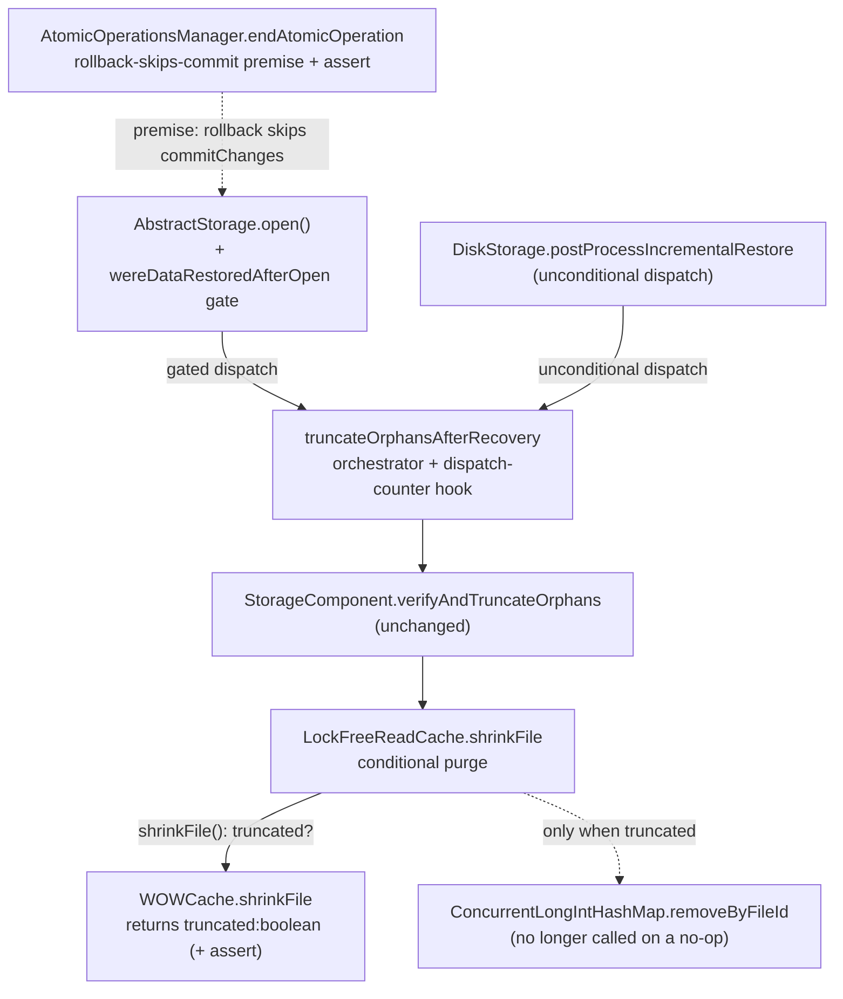

# Speed up open() on databases with many collections — Architecture Decision Record

## Summary

Reopening a cleanly-closed disk database was O(N²) in collection count. A
recovery-time orphan-truncation pass ran on every `open()` and, per
entry-point-equipped component, dispatched a `shrinkFile` that swept the entire
read-cache section map and rehashed; a 4000-collection database took over two
minutes to reopen, with a sampling profiler putting 97% of that in one hash-map
sweep. This change skips the pass entirely when the open replayed no write-ahead
log (a graceful close leaves no orphan to truncate), making a clean reopen
independent of collection count. On the crash-recovery path where the pass still
runs, it purges the read cache only when the write-cache layer physically dropped
pages, so a clean component costs O(1) instead of an O(capacity) sweep.

## Goals

- Make a clean reopen's cost independent of collection count. Achieved: the gate
  on `wereDataRestoredAfterOpen` skips the pass on every non-WAL-replay open.
- Keep crash recovery on a large-collection database off the O(N²) curve.
  Achieved: the read-cache purge fires only on a real truncate, so a clean
  component the pass visits pays no `removeByFileId` sweep.
- Preserve crash safety. Achieved: the pass still runs on every WAL-replay open,
  the only path that can create an orphan; pinned by a production assertion and a
  crash-injection regression suite.
- No on-disk format change. Achieved: the gate reuses an existing in-memory
  signal rather than adding a persisted marker.

## Constraints

- Crash safety is paramount. The gate overturns a documented invariant of the
  read-cache-concurrency-bug ADR (the pass "must not be `isDirty`-gated"). It is
  admissible only because a rolled-back disk transaction leaves zero physical
  footprint, so a disk orphan can arise only from a crash, which always sets the
  dirty flag. The change landed behind a crash-injection regression test and an
  assertion that pins the load-bearing premise.
- Disk engine only. The in-memory engine's `shrinkFile` is a no-op, so neither
  change affects it; in-memory rollback-orphan behavior stays out of scope.
- Incremental restore stays unconditional. `DiskStorage.postProcessIncrementalRestore`
  always restored pages, so it keeps dispatching the pass without the gate.
- No on-disk format change; 2-space indent, 100-column, braces always,
  Spotless-clean, JDK 21.

## Architecture Notes

### Component Map

- **`AbstractStorage.open()`** wraps the pass dispatch in
  `if (wereDataRestoredAfterOpen)`. This is the whole of the clean-open behavior
  change; the orchestrator and per-component helpers are untouched.
- **`DiskStorage.postProcessIncrementalRestore`** keeps an unconditional
  dispatch: incremental restore always replays pages, so it must always
  re-establish the invariant.
- **`WriteCache.shrinkFile`** returns `boolean truncated`; `WOWCache` derives it
  from the same `getFileSize()` snapshot that drives its no-op early return.
- **`LockFreeReadCache.shrinkFile`** calls `clearFile`/`removeByFileId` only on a
  `true` result, eliminating the profiled `removeByFileId` hotspot.
- **`AtomicOperationsManager.endAtomicOperation`** is the anchor of the rollback
  premise the clean-open gate rests on; a production `assert` there converts a
  silent break of that premise into a test failure.

### Decision Records

**D1. Gate the open-time orphan pass on `wereDataRestoredAfterOpen`.**
Implemented as planned. `AbstractStorage.open()` wraps the recovery-time
orphan-truncation pass dispatch in `if (wereDataRestoredAfterOpen)`, so a
gracefully-closed disk database that replays no WAL skips the pass entirely.
Alternatives rejected: a persistent orphan-free marker in `StorageStartupMetadata`
plus a close-time confirming pass (adds an on-disk format bump and close-time cost
for no benefit the rollback-zero-footprint proof does not already provide), and
re-reading `isDirty()` at the dispatch (it reads false by then because
`recoverIfNeeded` runs `flushAllData` then `clearStorageDirty`, so the field is
the correct "did this open replay the WAL" signal). Rationale: a disk orphan is
crash-only, and a crash always drives the next open into WAL replay, so gating on
the WAL-replay signal preserves the physical-never-exceeds-logical invariant while
skipping the pass on every clean reopen. Pinned by the assertion in S2 and a
crash-injection regression suite.

**D2. Skip the read-cache purge when nothing was physically truncated.**
Implemented as planned. `WriteCache.shrinkFile` now returns `boolean truncated`,
and `LockFreeReadCache.shrinkFile` runs its `clearFile`/`removeByFileId` purge only
when the write-cache layer reports a real truncate. This removes the O(capacity)
`removeByFileId` sweep on the crash-recovery path and on any clean component the
pass visits. Alternative rejected: a secondary `fileId` index on
`ConcurrentLongIntHashMap` to make `removeByFileId` O(matches), unnecessary once
the purge is skipped on no-ops because genuine orphans are rare and few. The
boolean is read off the same `getFileSize()` snapshot, taken under
`filesLock.writeLock`, that drives WOWCache's no-op early return, so it is exact
with no recomputed compare that would reopen a time-of-check window. Pinned by the
assertion in S3.

**D3. Do not reset `wereDataRestoredAfterOpen` on close.**
Emerged during execution. The field is written once (in `recoverIfNeeded`) and
never reset. A second production consumer, `IndexManagerEmbedded.autoRecreateIndexesAfterCrash`,
already reads its getter with the same "did this open replay the WAL" meaning.
Resetting on close would broaden that consumer's blast radius for no gain on the
gate side: a stale `true` only forces an unnecessary, now-O(1) pass, and a stale
`false` is impossible because the field is only ever set, never cleared.

**D4. Observe "pass dispatched" with a package-private counter, not file size.**
Emerged during execution. A clean reopen's observable effect is the absence of
work, which file size cannot witness: a clean reopen and a dirty-but-orphan-free
reopen leave identical files but differ in whether the pass ran. `AbstractStorage`
gained a package-private `orphanTruncationDispatchCountForTests` counter,
incremented inside `truncateOrphansAfterRecovery` and read from same-package tests.
The increment is null-guarded because Mockito `CALLS_REAL_METHODS` mocks skip field
initializers, leaving the counter null on a mock; an unguarded increment NPE'd the
mock-based orchestrator unit test.

### Invariants & Contracts

- **S1. Physical never exceeds logical after `open()`.** After
  `AbstractStorage.open()` returns, every entry-point-equipped disk component
  satisfies `entryPoint.logicalPages <= physicalPages`. The gated pass preserves
  this: it still runs on every WAL-replay open, the only path that can create an
  orphan. This is the disk-engine refinement of the read-cache-concurrency-bug
  ADR's I6.
- **S2. A rolled-back operation has zero disk footprint.** A rolled-back atomic
  operation never enters `commitChanges`, which `AtomicOperationsManager.endAtomicOperation`
  invokes only when the operation is not rolling back. So a rollback performs no
  `AsyncFile` extend, dirties no real cache page, and submits no
  `EnsurePageIsValidInFileTask`. A production `assert !operation.isRollbackInProgress()`
  immediately before the `commitChanges` call pins the write-path half. The
  read-extend half (no correct production read extends a file outside crash
  recovery) is a component-correctness invariant, not assertable there.
- **S3. The read-cache purge runs iff the write-cache layer physically truncated.**
  `LockFreeReadCache.shrinkFile` purges only on a `true` return from
  `WriteCache.shrinkFile`. Skipping the purge on a no-op leaves no stale cache
  entry because no page was dropped. A production `assert file.getFileSize() ==
  targetBytes` after the real shrink in `WOWCache` pins that a `true` return means
  the file reached its target.
- **Contract change.** `WriteCache.shrinkFile(long, long)` returns `boolean` (was
  `void`): `true` iff the file was physically shrunk. The two production
  implementations (`WOWCache`, `DirectMemoryOnlyDiskCache`) and five test mocks
  were updated.

### Integration Points

- The gate reads `wereDataRestoredAfterOpen`, set only in `recoverIfNeeded`. The
  same getter is read by `IndexManagerEmbedded.autoRecreateIndexesAfterCrash`,
  which is why the field is not reset on close.
- The `boolean` return from `WriteCache.shrinkFile` reaches
  `LockFreeReadCache.shrinkFile`; `DirectMemoryOnlyDiskCache` returns `false` and
  keeps a separate three-arg `ReadCache.shrinkFile` forwarder that discards it.
- The orphan pass dispatches from two sites: the gated `AbstractStorage.open()`
  and the unconditional `DiskStorage.postProcessIncrementalRestore`. Both
  increment the dispatch counter.
- The read-cache-concurrency-bug ADR under `docs/adr/read-cache-concurrency-bug/`
  was amended preserve-with-scoping: its D6 discovery and I6 invariant note now
  record the disk engine as WAL-replay-gated per this change, while keeping the
  unconditional rule for the in-memory engine, whose rollback leaves
  eagerly-installed pages.

### Non-Goals

- The in-memory engine: `DirectMemoryOnlyDiskCache.shrinkFile` is a no-op, so
  neither change affects it; its rollback-orphan behavior is out of scope.
- A structural O(matches) `removeByFileId` via a secondary `fileId` index:
  unneeded once the purge is skipped on no-ops.
- A persistent orphan-free marker or `StorageStartupMetadata` format bump:
  rejected under D1.
- The pre-existing torn-write / OS-writeback durability gap: a separate ticket,
  noted in the read-cache-concurrency-bug design.

## Key Discoveries

A disk orphan is crash-only because a rolled-back transaction never reaches
`commitChanges`. Tracing every disk-write primitive (`AsyncFile` extend,
dirty-page install, ensure-valid task) back to its callers finds none reachable
from a rolled-back, cleanly-closed transaction. The load-bearing line is the
rollback check in `endAtomicOperation` that skips `commitChanges` wholesale; the
`if (!rollback)` inside `commitChanges` guards only snapshot-buffer flushing and
would not protect the physical apply on its own. The assertion was therefore
placed at the caller, not inside `commitChanges`.

`wereDataRestoredAfterOpen` is the correct WAL-replay signal at the dispatch site,
not `isDirty()`. By the dispatch, `recoverIfNeeded` has run `flushAllData` then
`clearStorageDirty`, so `isDirty()` reads false even on a crash reopen. The field
is set once and never reset, which is conservative-safe: a stale `true` only
re-runs a now-O(1) pass, and a stale `false` cannot occur.

The truncation boolean must come from the same locked `getFileSize()` snapshot
that drives WOWCache's no-op early return. Computing the answer one layer up at
`StorageComponent.verifyAndTruncateOrphans`, by comparing already-read sizes, was
considered and rejected: that path reads size through a second accessor not
synchronized with WOWCache's authoritative snapshot under `filesLock.writeLock`,
opening a time-of-check window the in-cache derivation avoids.

File size alone cannot distinguish "pass skipped" from "pass ran and truncated
nothing", because a clean reopen and a dirty-but-orphan-free reopen leave
identical files. Tests need an explicit dispatch-observation hook; the
package-private counter on `AbstractStorage` is that hook, and its increment must
be null-guarded so it does not NPE Mockito `CALLS_REAL_METHODS` orchestrator
mocks.

The gate invalidated the existing orphan-fabrication test technique. The prior
tests fabricated an orphan on a gracefully-closed file and asserted truncation on
the next reopen, but that reopen is clean, so post-gate the pass is skipped and
every truncate-assertion fails. The reproductions were migrated to a genuinely
dirty WAL-replay reopen by deleting the `dirty.fl` and `dirty.flb` markers before
reopen; the dirty signal is the markers' absence, not their contents, which routes
the next open through WAL replay. The clean-reopen path is now covered by the dual
scenario: fabricate an orphan on a clean file, reopen without forcing dirty, and
assert the orphan survives, which pins the gate's defining behavior and fails if a
future change re-runs the pass on the clean path.

The gate gives up one bounded best-effort retry. The pass is best-effort: a
per-component failure logs a WARN and continues. The two failure shapes differ. An
unreadable entry point means the component is already corrupt and is handled by
the storage-corruption runbook. A transient `shrinkFile` IOException on an
otherwise readable component is the one genuinely-lost cross-clean-cycle retry,
accepted as bounded because it is loud and re-armed by any later crash.

A stale `WOWCache.loadOrAdd` Javadoc claimed "no production callers yet". PSI
find-usages on the concrete override returns zero non-test callers because the
production call site reaches it through the `WriteCache` interface at
`LockFreeReadCache.doLoad`, shared by `loadForRead` and `loadOrAddForWrite`; the
Javadoc now names `doLoad` as the production caller.

Two tooling notes carry forward. JaCoCo's report goal binds to the
`prepare-package` phase, not `test`, so a coverage run must go through `package -P
coverage` to regenerate `jacoco.xml` before the changed-line coverage gate reads
it. The two failsafe integration tests that carry the `shrinkFile` signature
change run via `verify -P ci-integration-tests`, not the surefire `test` goal.

The accepted test boundaries are deliberate. There is no genuine process-kill
crash test: the marker-deletion mechanism is the chosen dirty-reopen lever, and
`LocalPaginatedStorageRestoreFromWALIT` covers genuine crash-plus-replay at the
storage level. Truncate-failure injection is exercised on one component group with
a cross-group continue assertion rather than per group, and the synthetic
orphan-page count is fixed at four across the migrated scenarios.

## Token usage telemetry

Snapshot from this worktree's sessions over its lifetime (N=15 sessions across 111 transcripts).

### Tool mix — share of total session context

| Component             | Share |
|-----------------------|------:|
| `Read` tool results   | 62.6% |
| `Bash` tool results   | 6.4% |
| `Grep` tool results   | 0.0% |
| `Edit` tool results   | 0.1% |
| Other tool results    | 9.6% |
| Prompts and output    | 21.3% |

### Top files by share of `Read` token consumption

| File                                            | Share of Read |
|-------------------------------------------------|--------------:|
| <outside-worktree>                              | 21.8% |
| docs/adr/ytdb-1039-open-sepedup/_workflow/plan/track-2.md | 11.0% |
| .claude/workflow/implementer-rules.md           | 7.8% |
| core/src/test/java/com/jetbrains/youtrackdb/internal/core/storage/impl/local/TruncateOrphansAfterRecoveryIT.java | 4.9% |
| docs/adr/ytdb-1039-open-sepedup/_workflow/plan/track-1.md | 3.9% |
| .claude/workflow/self-improvement-reflection.md | 3.7% |
| core/src/test/java/com/jetbrains/youtrackdb/internal/core/storage/cache/chm/LockFreeReadCacheFileOpsTest.java | 3.2% |
| core/src/main/java/com/jetbrains/youtrackdb/internal/core/storage/impl/local/AbstractStorage.java | 2.7% |
| core/src/main/java/com/jetbrains/youtrackdb/internal/core/storage/impl/local/paginated/atomicoperations/AtomicOperationBinaryTracking.java | 2.3% |
| docs/adr/ytdb-1039-open-sepedup/_workflow/implementation-plan.md | 2.2% |

Generated by `.claude/scripts/measure-read-share.py` against
`~/.claude/projects/-home-andrii0lomakin-Projects-ytdb-open-speedup/`.
