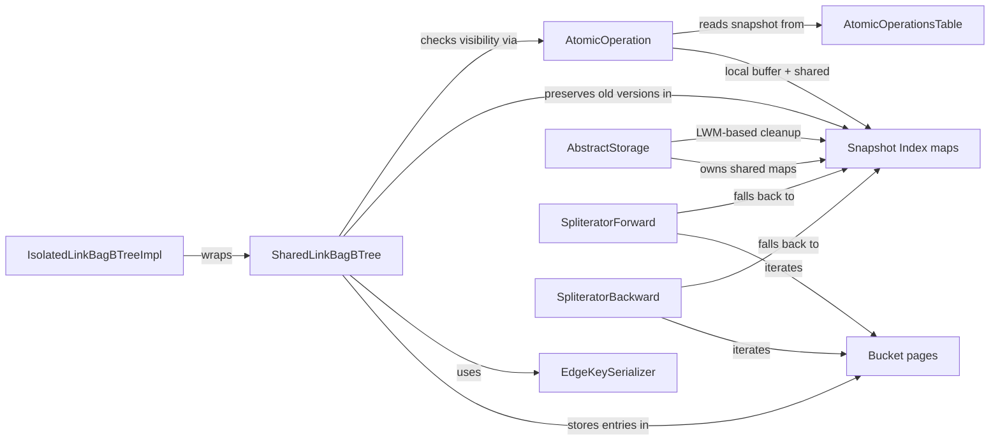

# Snapshot Isolation for Edges (SharedLinkBagBTree)

## High-level plan

### Goals

Implement Snapshot Isolation (SI) for edge storage in `SharedLinkBagBTree`,
following the same pattern already established in `PaginatedCollectionV2` for
collections. This ensures that concurrent readers see a consistent snapshot of
edges while writers modify the B-tree, enabling full MVCC across both vertex
collections and edge link bags.

Specifically:
- Embed the transaction timestamp (`ts`) into `EdgeKey` so every B-tree entry
  carries version information.
- Support tombstones in the B-tree for deleted edges (not removed in this PR;
  GC comes in a follow-up).
- Preserve old versions of entries in a snapshot index so older transactions
  can read them.
- During range queries, iterate over current B-tree entries, check visibility,
  and fall back to the snapshot index for entries not visible to the current
  transaction.
- Reuse the same cleanup mechanics (LWM-based eviction via visibility index)
  as `PaginatedCollectionV2`.

### Constraints

- **Storage format change**: Adding `ts` to `EdgeKey` changes the on-disk key
  format. This is acceptable for `0.5.0-SNAPSHOT` but is a breaking change for
  any existing B-tree files.
- **No tombstone GC in this PR**: Tombstones accumulate in the B-tree until a
  follow-up PR implements garbage collection. This means the B-tree may grow
  over time for workloads with heavy edge deletion.
- **At most one entry per logical edge in the B-tree**: The B-tree holds
  exactly one entry per `(ridBagId, targetCollection, targetPosition)` — either
  a live entry or a tombstone. Old versions are always moved to the snapshot
  index before modification.
- **Prefix lookup required**: Since `ts` is part of the key comparison,
  single-edge lookups (where the caller doesn't know the current `ts`) require
  a prefix range search: `(ridBagId, tc, tp, Long.MIN_VALUE)` to
  `(ridBagId, tc, tp, Long.MAX_VALUE)`.
- **Snapshot index must store actual values**: Unlike `PaginatedCollectionV2`
  (which stores `PositionEntry` page locations), the link bag snapshot index
  must store the full `LinkBagValue` because B-tree entries don't have stable
  page positions across splits/merges.
- **Coverage**: 85% line / 70% branch coverage on all new/changed code.
- **Spotless**: Run `./mvnw -pl core spotless:apply` after modifications.

### Architecture Notes

#### Component Map

- **EdgeKey** — modified: gains `long ts` field as 4th comparison component.
  Ordering becomes `ridBagId → targetCollection → targetPosition → ts`.
- **EdgeKeySerializer** — modified: serializes/deserializes the new `ts` field
  using variable-length `LongSerializer`.
- **LinkBagValue** — modified: gains `boolean tombstone` field to mark
  deletions. Tombstone entries have the deletion `ts` in their EdgeKey and
  `tombstone=true` in the value.
- **LinkBagValueSerializer** — modified: serializes/deserializes the tombstone
  flag.
- **SharedLinkBagBTree** — modified: write path preserves old versions in
  snapshot index; read/iteration path checks visibility and falls back to
  snapshot index.
- **Bucket** — unchanged structurally (variable-length keys already supported),
  but handles larger serialized keys.
- **SpliteratorForward / SpliteratorBackward** — modified: apply visibility
  checks during iteration and fall back to snapshot index for invisible entries.
- **IsolatedLinkBagBTreeImpl** — modified: passes `AtomicOperation` context for
  visibility; adapts to new `EdgeKey` constructor with `ts`.
- **EdgeSnapshotKey** — new: snapshot index key for link bag entries,
  `(int componentId, long ridBagId, int targetCollection, long targetPosition,
  long version)`.
- **EdgeVisibilityKey** — new: visibility index key for link bag cleanup,
  `(long recordTs, int componentId, long ridBagId, int targetCollection,
  long targetPosition)`.
- **AtomicOperationBinaryTracking** — extended: new local buffers and methods
  for edge snapshot/visibility entries.
- **AbstractStorage** — extended: new shared maps for edge snapshot entries,
  cleanup wired into existing `evictStaleSnapshotEntries` flow.

#### D1: Embed `ts` in EdgeKey vs. store separately in a position map

- **Alternatives considered**:
  1. Store `ts` in a separate position map (like `PaginatedCollectionV2` uses
     `CollectionPositionMapV2`).
  2. Store `ts` only in the value (`LinkBagValue`).
  3. Embed `ts` in `EdgeKey` as a comparison field.
- **Rationale**: Option 3 chosen per design requirement. The B-tree's key
  ordering naturally groups versions of the same logical edge together,
  enabling prefix range scans. Avoids the need for a separate position map
  data structure. The B-tree already supports variable-length keys, so the
  extra `long` is a minor overhead.
- **Risks/Caveats**: Single-edge lookups now require prefix range search
  instead of exact key match — slightly more complex but efficient since
  at most one entry exists per logical edge. Existing data is incompatible
  (acceptable for 0.5.0-SNAPSHOT).
- **Implemented in**: Track 1

#### D2: Separate snapshot index maps vs. reuse existing collection snapshot index

- **Alternatives considered**:
  1. Reuse existing `ConcurrentSkipListMap<SnapshotKey, PositionEntry>` with
     encoded keys.
  2. Create generic/polymorphic snapshot store infrastructure.
  3. Create parallel snapshot index maps with new edge-specific key types.
- **Rationale**: Option 3 chosen. The existing `SnapshotKey(int, long, long)`
  cannot represent the 3-field edge identity `(long ridBagId,
  int targetCollection, long targetPosition)` — it only has one `long`
  position field. The value type also differs: `PositionEntry` (page location)
  vs. `LinkBagValue` (actual data). Parallel maps with the same cleanup
  pattern are cleaner than forcing incompatible data into shared types or
  adding premature generic abstractions.
- **Risks/Caveats**: More code to maintain (two sets of snapshot maps). The
  cleanup logic needs to handle both map sets, but the LWM-based eviction
  pattern is identical.
- **Implemented in**: Track 2

#### D3: Tombstone representation — flag in value vs. key vs. sentinel

- **Alternatives considered**:
  1. Boolean field in `EdgeKey`.
  2. Special sentinel `LinkBagValue` (e.g., counter = -1).
  3. Boolean `tombstone` field in `LinkBagValue`.
- **Rationale**: Option 3 chosen. The key identifies the entry (which edge,
  when); the value represents the state (data or deleted). A dedicated boolean
  is more explicit than a sentinel value and doesn't pollute the key's
  comparison logic.
- **Risks/Caveats**: Tombstone entries still consume space in the B-tree.
  This is by design — GC is deferred to the next PR.
- **Implemented in**: Track 1

#### D4: Snapshot index value stores `LinkBagValue` (not page position)

- **Alternatives considered**:
  1. Store `PositionEntry` (page index + record position) like collections do.
  2. Store full `LinkBagValue` directly.
- **Rationale**: Option 2 chosen. B-tree entries don't have stable page
  positions — they move during bucket splits and merges. The only reliable
  way to preserve an old version is to store the actual value. `LinkBagValue`
  is small (two ints + one long + one boolean ≈ 21 bytes), so memory overhead
  is acceptable.
- **Risks/Caveats**: Slightly higher memory per snapshot entry compared to a
  page pointer, but necessary for correctness.
- **Implemented in**: Track 2

#### Invariants

- **Single-version invariant**: At most one B-tree entry per logical edge
  `(ridBagId, targetCollection, targetPosition)` at any time. Old versions
  are always moved to snapshot index before the B-tree entry is modified.
- **Version monotonicity**: When updating an edge, `newTs > oldTs` (enforced
  by assertion). Same-transaction overwrites (`newTs == oldTs`) skip snapshot
  preservation.
- **Tombstone preservation**: Deleted edges become tombstone entries in the
  B-tree. The old live value is moved to the snapshot index. Tombstones are
  not removed in this PR.
- **Visibility correctness**: A reader with snapshot `S` sees an edge iff:
  (a) the B-tree entry's `ts` is visible to `S` and the entry is not a
  tombstone, OR (b) the B-tree entry's `ts` is not visible and the snapshot
  index contains a visible non-tombstone version.
- **Snapshot cleanup safety**: Snapshot entries are only evicted when their
  `recordTs` is below the global low-water-mark (all transactions that could
  need them have completed).

#### Integration Points

- **AtomicOperation**: New methods for edge snapshot/visibility entry
  management (`putEdgeSnapshotEntry`, `getEdgeSnapshotEntry`,
  `edgeSnapshotSubMapDescending`, `putEdgeVisibilityEntry`).
- **AbstractStorage**: New shared maps (`sharedEdgeSnapshotIndex`,
  `edgeVisibilityIndex`, `edgeSnapshotIndexSize`). Cleanup wired into
  existing `cleanupSnapshotIndex()` call path, which is already invoked
  from both the commit path (`endTxCommit`) and `resetTsMin()` (when
  the last transaction on a thread closes). This means edge snapshot
  entries are cleaned up on both read-only and read-write transaction
  close — same as collection snapshot entries. No additional call sites
  needed.
- **AtomicOperationsTable.AtomicOperationsSnapshot**: Reused as-is for
  visibility checks (`isEntryVisible(ts)`). No changes needed.

#### Non-Goals

- **Tombstone garbage collection**: Deferred to next PR. Tombstones
  accumulate in the B-tree.
- **B-tree rebalancing on delete**: The current implementation does not
  rebalance/merge buckets on removal. This remains unchanged.
- **Migration of existing data**: This is a format-breaking change. No
  migration path is provided for existing B-tree files.

## Checklist

- [x] Track 1: EdgeKey timestamp and tombstone value model
  > **What**: Extend `EdgeKey` with a `long ts` field as the 4th comparison
  > component, and add a `boolean tombstone` field to `LinkBagValue`. This is
  > the foundational data model change that all other tracks depend on.
  >
  > **How**: Add `ts` to `EdgeKey` fields, constructor, `equals`, `hashCode`,
  > `compareTo`, and `toString`. Update `EdgeKeySerializer` to serialize `ts`
  > using `LongSerializer` (variable-length, appended after `targetPosition`).
  > Add `tombstone` to the `LinkBagValue` record and update
  > `LinkBagValueSerializer` to serialize the boolean flag. Update all call
  > sites that construct `EdgeKey` or `LinkBagValue` to supply the new fields
  > (search for `new EdgeKey(` and `new LinkBagValue(` across the codebase).
  >
  > **Constraints**:
  > - Breaking on-disk format change — acceptable for 0.5.0-SNAPSHOT.
  > - `EdgeKey.compareTo` must order by `ts` last so that entries for the same
  >   logical edge remain adjacent in the B-tree, enabling prefix range scans.
  > - `EdgeKey.equals` and `hashCode` must include `ts` — two entries with
  >   different `ts` are different keys.
  > - The tombstone flag must be serialized as a single byte (0/1) in
  >   `LinkBagValueSerializer`, appended after existing fields.
  >
  > **Interactions**: Foundation for all other tracks. No dependencies.
  >
  > **Scope:** ~4-5 steps covering EdgeKey modification, EdgeKeySerializer
  > update, LinkBagValue/LinkBagValueSerializer tombstone support, call site
  > updates, and serialization round-trip tests
  >
  > **Track episode:**
  > Extended the edge storage data model with snapshot isolation foundations.
  > Added `long ts` as the 4th comparison component to `EdgeKey` (ordering:
  > ridBagId → targetCollection → targetPosition → ts), enabling prefix range
  > scans for single-edge lookups. Added `boolean tombstone` to `LinkBagValue`
  > for marking deleted edges. Fixed a pre-existing offset bug in
  > `EdgeKeySerializer.doGetObjectSize`. Updated ~40 call sites across
  > production and test code. Discovered that range query boundary keys in
  > `spliteratorEntriesBetween` and `loadEntriesMajor` need
  > `Long.MIN_VALUE`/`Long.MAX_VALUE` for ts bounds (not `0L`) — fixed during
  > code review.
  >
  > **Step file:** `tracks/track-1.md` (3 steps, 0 failed)
  >
  > **Strategy refresh:** CONTINUE — no downstream impact detected.

- [x] Track 2: Snapshot index infrastructure for link bag entries
  > **What**: Create the snapshot index types and plumbing for storing old
  > versions of link bag entries, following the same pattern as the collection
  > snapshot index but with edge-specific key types.
  >
  > **How**:
  > - Create `EdgeSnapshotKey` record:
  >   `(int componentId, long ridBagId, int targetCollection,
  >   long targetPosition, long version)` with natural ordering
  >   `componentId → ridBagId → targetCollection → targetPosition → version`.
  >   `componentId` identifies the `SharedLinkBagBTree` durable component
  >   instance (same concept as in collection snapshot keys — obtained via
  >   `DurableComponent.getId()`).
  > - Create `EdgeVisibilityKey` record:
  >   `(long recordTs, int componentId, long ridBagId, int targetCollection,
  >   long targetPosition)` with natural ordering
  >   `recordTs → componentId → ridBagId → targetCollection → targetPosition`.
  >   `componentId` same as in `EdgeSnapshotKey`.
  > - Add to `AbstractStorage`:
  >   `ConcurrentSkipListMap<EdgeSnapshotKey, LinkBagValue>
  >   sharedEdgeSnapshotIndex`,
  >   `ConcurrentSkipListMap<EdgeVisibilityKey, EdgeSnapshotKey>
  >   edgeVisibilityIndex`, and `AtomicLong edgeSnapshotIndexSize`.
  > - Add to `AtomicOperation` interface: `putEdgeSnapshotEntry`,
  >   `getEdgeSnapshotEntry`, `edgeSnapshotSubMapDescending`,
  >   `putEdgeVisibilityEntry`, `containsEdgeVisibilityEntry`.
  > - Implement in `AtomicOperationBinaryTracking` with local overlay
  >   buffers (same pattern as existing collection snapshot buffers):
  >   `TreeMap<EdgeSnapshotKey, LinkBagValue>` for snapshot,
  >   `HashMap<EdgeVisibilityKey, EdgeSnapshotKey>` for visibility.
  > - Implement `flushEdgeSnapshotBuffers()` called during commit, merging
  >   local buffers into shared maps.
  > - Wire edge snapshot cleanup into `AbstractStorage.cleanupSnapshotIndex()`
  >   — call `evictStaleEdgeSnapshotEntries()` with the same LWM used for
  >   collection cleanup. `cleanupSnapshotIndex()` is already called from
  >   both the commit path and `resetTsMin()` (when the last tx on a thread
  >   closes), so edge cleanup triggers on both read and write tx close
  >   automatically.
  >
  > **Constraints**:
  > - `EdgeVisibilityKey` must sort by `recordTs` first (like `VisibilityKey`)
  >   to enable efficient `headMap(lwm)` range-scan during cleanup.
  > - Local buffers must be lazily allocated (same pattern as collection
  >   buffers) to avoid overhead for transactions that don't touch edges.
  > - `edgeSnapshotSubMapDescending` must merge local and shared maps in
  >   descending order (newest version first) — same `MergingDescendingIterator`
  >   pattern as collection snapshot lookups.
  >
  > **Interactions**: Partially independent of Track 1 — the key types
  > (`EdgeSnapshotKey`, `EdgeVisibilityKey`) use logical edge identity fields,
  > not the new `EdgeKey` with `ts`. However, the snapshot value type
  > (`LinkBagValue`) gains a `tombstone` field in Track 1, so either track can
  > go first but Track 1 first is the natural order. Tracks 3 and 4 depend on
  > this.
  >
  > **Scope:** ~5-6 steps covering new key types, AbstractStorage maps,
  > AtomicOperation interface methods, AtomicOperationBinaryTracking
  > implementation with local buffers, cleanup wiring, and unit tests
  >
  > **Track episode:**
  > Built the complete snapshot index infrastructure for link bag entries,
  > following the same pattern as the collection snapshot index but with
  > edge-specific key types. Created `EdgeSnapshotKey` (5-field:
  > componentId → ridBagId → targetCollection → targetPosition → version)
  > and `EdgeVisibilityKey` (5-field with recordTs first for efficient LWM
  > eviction). Added 3 shared maps to `AbstractStorage` with cleanup wired
  > into the existing `cleanupSnapshotIndex()` flow. Extended
  > `AtomicOperation` interface with 5 new methods and implemented local
  > overlay buffers in `AtomicOperationBinaryTracking` with lazy allocation.
  > Made `MergingDescendingIterator` generic to reuse for edge snapshot
  > lookups. Fixed a pre-existing bug: missing `snapshotIndexSize` reset in
  > the delete path. No plan deviations with cross-track impact.
  >
  > **Step file:** `tracks/track-2.md` (5 steps, 0 failed)
  >
  > **Strategy refresh:** CONTINUE — no downstream impact detected.

- [x] Track 3: SharedLinkBagBTree write path with SI
  > **What**: Modify the write operations (`put`, `remove`) in
  > `SharedLinkBagBTree` to preserve old versions in the snapshot index and
  > embed the transaction timestamp in new entries. Implement prefix-based
  > lookup for finding the current entry of a logical edge.
  >
  > **How**:
  > - **Prefix lookup**: Implement a helper method
  >   `findCurrentEntry(ridBagId, targetCollection, targetPosition, atomicOp)`
  >   that searches for `EdgeKey(ridBagId, tc, tp, Long.MIN_VALUE)` and checks
  >   the entry at the resulting insertion point. Since at most one entry per
  >   logical edge exists, the entry (if present) is at the insertion point
  >   with a matching `(ridBagId, tc, tp)` prefix.
  > - **put()**: Before inserting/updating, use prefix lookup to find the
  >   existing entry. If found and its `ts` differs from the current
  >   transaction's `commitTs`:
  >   1. Save old entry to snapshot index via
  >      `atomicOp.putEdgeSnapshotEntry(edgeSnapshotKey, oldValue)` and
  >      `atomicOp.putEdgeVisibilityEntry(edgeVisibilityKey, edgeSnapshotKey)`.
  >   2. Remove old entry from B-tree.
  >   3. Insert new entry with `EdgeKey(..., commitTs)` and new value.
  >   If same `ts` (same-transaction overwrite), update in place without
  >   snapshot preservation.
  > - **remove()**: Use prefix lookup to find the existing entry. If found:
  >   1. Save old entry to snapshot index (same as put).
  >   2. Remove old entry from B-tree.
  >   3. Insert tombstone entry: `EdgeKey(..., commitTs)` with
  >      `LinkBagValue(..., tombstone=true)`.
  >   The tree size does not change (one entry replaced by one tombstone).
  >
  > - **IsolatedLinkBagBTreeImpl write path**: Update `put()` and `remove()`
  >   call sites to pass `commitTs` when constructing `EdgeKey` and forward
  >   the `AtomicOperation` to `SharedLinkBagBTree` for snapshot preservation.
  >
  > **Constraints**:
  > - `commitTs` is obtained from `atomicOperation.getCommitTs()` — this must
  >   be available at write time.
  > - Version monotonicity assertion: `newTs > oldTs` unless same-transaction
  >   overwrite.
  > - The put/remove methods must acquire exclusive lock as they do today.
  > - Snapshot preservation must happen inside the same atomic operation as the
  >   B-tree modification (transactional consistency).
  >
  > **Interactions**: Depends on Track 1 (new EdgeKey/LinkBagValue format) and
  > Track 2 (snapshot index infrastructure). Track 4 depends on this for
  > correct visibility behavior (Track 4 covers `IsolatedLinkBagBTreeImpl`
  > read/iteration path changes).
  >
  > **Scope:** ~4-5 steps covering prefix lookup helper, put() SI logic,
  > remove() tombstone logic, IsolatedLinkBagBTreeImpl write path updates,
  > and write-path SI tests
  > **Depends on:** Track 1, Track 2
  >
  > **Track episode:**
  > Modified `SharedLinkBagBTree` write operations (`put`, `remove`) to
  > preserve old versions in the snapshot index and embed transaction
  > timestamps. Added `findCurrentEntry` prefix lookup using
  > `Long.MIN_VALUE` ts with insertion-point checking and right-sibling
  > fallback for bucket boundaries. `put()` detects cross-tx updates and
  > preserves old versions before replacement; same-ts overwrites skip
  > preservation. `remove()` creates tombstones for cross-tx deletes and
  > physically deletes for same-tx removes (no tombstone needed since no
  > other tx can see the entry). Wired `IsolatedLinkBagBTreeImpl` to use
  > real `commitTs` and added tombstone filtering to all read-path methods.
  > Key discovery: same-tx removes should physically delete rather than
  > create tombstones. Step 4 expanded beyond plan to include tombstone
  > filtering on read paths, necessary to maintain passing higher-level
  > tests once real timestamps activated cross-tx tombstone creation.
  >
  > **Step file:** `tracks/track-3.md` (4 steps, 0 failed)
  >
  > **Strategy refresh:** CONTINUE — Track 3 Step 4 already added tombstone
  > filtering to IsolatedLinkBagBTreeImpl read paths (originally Track 4
  > scope), reducing Track 4's IsolatedLinkBagBTreeImpl step. Core Track 4
  > work (SI visibility checks + snapshot index fallback in SharedLinkBagBTree
  > and spliterators) remains correctly scoped.

- [x] Track 4: SharedLinkBagBTree read and iteration path with SI
  > **What**: Modify the read operations (`get`) and iteration
  > (`SpliteratorForward`, `SpliteratorBackward`, range query streams) to
  > apply visibility checks and fall back to the snapshot index for entries
  > that are not visible to the current transaction.
  >
  > **How**:
  > - **get()**: Use prefix lookup to find the current B-tree entry. Check
  >   visibility of its `ts`:
  >   - If visible and not tombstone → return value.
  >   - If visible and tombstone → return null (edge deleted).
  >   - If not visible → search snapshot index via
  >     `edgeSnapshotSubMapDescending(lowerKey, upperKey)` for the newest
  >     visible non-tombstone version. Return value if found, null otherwise.
  > - **SpliteratorForward / SpliteratorBackward**: In the cache-filling
  >   methods (`readKeysFromBucketsForward/Backward`), for each B-tree entry:
  >   1. Check visibility of `entry.key.ts`.
  >   2. If visible and not tombstone → add to cache.
  >   3. If visible and tombstone → skip (edge deleted from reader's view).
  >   4. If not visible → search snapshot index for a visible version.
  >      - If found non-tombstone → add snapshot version to cache.
  >      - If found tombstone or not found → skip.
  >   The spliterators need access to `AtomicOperation` for visibility checks
  >   and snapshot lookups — verify whether spliterator constructors/factory
  >   methods already accept `AtomicOperation` or need a signature change to
  >   pass it through.
  > - **IsolatedLinkBagBTreeImpl**: Update `get()`, `spliteratorEntriesBetween`,
  >   `loadEntriesMajor`, and other methods to work with the new SI-aware
  >   APIs. The `TransformingSpliterator` must strip the `ts` from EdgeKey
  >   when converting to RID (callers don't see timestamps).
  >
  > **Constraints**:
  > - Visibility checks use `AtomicOperationsTable.AtomicOperationsSnapshot`
  >   (same as collection SI) — obtained from the current `AtomicOperation`.
  > - Self-read shortcut: if `entry.ts == currentOperationTs`, always visible
  >   (transaction reads its own writes).
  > - Iteration must not skip edges that exist in the snapshot index but not
  >   in the B-tree (created and then replaced by a concurrent transaction).
  >   However, since the B-tree always has the LATEST version (or tombstone),
  >   and we fall back to snapshot index when it's not visible, this case is
  >   covered.
  > - Performance: snapshot index lookups add overhead per invisible entry.
  >   This is expected and acceptable — under low contention, most entries
  >   will be visible and the fast path (B-tree only) is taken.
  >
  > **Interactions**: Depends on Track 1 (new EdgeKey format), Track 2
  > (snapshot index infrastructure), and Track 3 (write path must be
  > producing correctly versioned entries for reads to work).
  >
  > **Scope:** ~5-6 steps covering get() SI logic, SpliteratorForward SI,
  > SpliteratorBackward SI, IsolatedLinkBagBTreeImpl updates, and
  > comprehensive read-path SI tests (concurrent readers/writers scenarios)
  > **Depends on:** Track 1, Track 2, Track 3
  >
  > **Track episode:**
  > Modified `SharedLinkBagBTree` and its spliterators to apply snapshot
  > isolation visibility checks on all read paths. Added
  > `isEdgeVersionVisible()`, `resolveVisibleEntry()`,
  > `findVisibleSnapshotEntry()`, and `findVisibleEntry()` to
  > SharedLinkBagBTree. Spliterators (Forward and Backward) now resolve
  > visibility per entry during cache filling — invisible entries fall back
  > to snapshot index, tombstones are skipped. Key discovery: spliterator
  > cache entries must retain the ORIGINAL B-tree key (not the resolved
  > snapshot key) to avoid infinite re-positioning loops in
  > `fetchNextCachePortionForward/Backward`. All IsolatedLinkBagBTreeImpl
  > read-path methods already delegate through SI-aware spliterators, so no
  > production changes were needed for Step 3. Added 30 tests (24 unit, 6
  > multi-threaded). Track-level code review passed in 2 iterations. No plan
  > deviations with cross-track impact — Track 3 had already added tombstone
  > filtering to IsolatedLinkBagBTreeImpl, reducing Step 3 to
  > verification-only.
  >
  > **Step file:** `tracks/track-4.md` (4 steps, 0 failed)
  >
  > **Strategy refresh:** CONTINUE — no downstream impact detected.

- [x] Track 5: Enable and extend TransactionTest edge SI tests
  > **What**: Enable the 3 disabled edge SI tests in `TransactionTest` that
  > were waiting on LinkBag SI support, validate they pass, and write new
  > tests for scenarios not yet covered. This is the end-to-end validation
  > that the full SI stack works correctly for edges at the graph API level.
  >
  > **How**:
  > - **Enable existing disabled tests** (remove `@Ignore` annotations):
  >   - `testSIEdgeCreationIsolationMultiThread` (line ~794): Reader's
  >     snapshot must not see edges created by a concurrent committed
  >     transaction. Verifies LinkBag SI for edge creation.
  >   - `testSIEdgeDeletionIsolationMultiThread` (line ~872): Reader's
  >     snapshot must still see edges deleted by a concurrent committed
  >     transaction. Verifies tombstone visibility and snapshot fallback.
  >   - `testSIEdgeCountStabilityMultiThread` (line ~1682): Reader's edge
  >     count must remain stable while a writer adds more edges and commits.
  >     Verifies LinkBag iteration count consistency under SI.
  > - **Validate and fix** each enabled test — they may need adjustments
  >   to match the new SI semantics (e.g., ensuring edges are stored in
  >   the BTree-backed LinkBag, not embedded links).
  > - **Write new tests** for missing scenarios:
  >   - **Edge iteration consistency under SI**: While iterating
  >     `vertex.getEdges(Direction.OUT)`, a concurrent writer modifies
  >     the LinkBag — the iterator must return a consistent snapshot.
  >   - **Concurrent edge creation and deletion**: One thread creates
  >     edges, another deletes edges on the same vertex — both isolated.
  >   - **Snapshot fallback for deleted edges**: Reader with an old
  >     snapshot loads an edge that was deleted — must still see the old
  >     edge record via snapshot index fallback.
  >   - **Edge label filter under SI**: `getEdges(Direction, label)`
  >     consistency when concurrent transactions add/remove edges with
  >     different labels.
  >   - **Multiple readers from same snapshot epoch**: Two readers
  >     start at the same snapshot point and both see consistent edge
  >     state despite concurrent writes between their reads.
  >
  > **Constraints**:
  > - Tests must exercise the BTree-backed LinkBag path (edges above the
  >   embedded threshold), since that is where SI is implemented. Some
  >   existing tests intentionally stay below the threshold — new tests
  >   should ensure BTree storage is triggered.
  > - All tests are multi-threaded SI tests following the established
  >   pattern in `TransactionTest`: thread A holds a snapshot, main thread
  >   modifies and commits, thread A verifies isolation, then a fresh
  >   transaction verifies the committed state.
  > - Tests must not rely on index-based queries (indexes don't support SI
  >   yet) — use direct vertex/edge traversal via `getEdges()`/`getVertices()`.
  >
  > **Interactions**: This is the final validation track. Depends on all
  > prior tracks being complete (the full SI stack must be functional).
  >
  > **Scope:** ~4-5 steps covering enabling and validating existing disabled
  > tests, writing new edge iteration/deletion/creation isolation tests,
  > and a multi-scenario stress test
  > **Depends on:** Track 1, Track 2, Track 3, Track 4
  >
  > **Track episode:**
  > Enabled and extended the edge SI end-to-end test suite in
  > `TransactionTest`. Removed `@Ignore` from 3 pre-existing disabled tests
  > — all passed without modification, validating the full SI stack from
  > Tracks 1-4 at the graph API level. Added 4 new multi-threaded SI tests
  > covering: mid-iteration consistency, concurrent creation/deletion
  > isolation (identity-based assertions), snapshot fallback for deleted
  > edges via iteration, edge label filtering with explicit edge subclasses,
  > and multiple readers from the same snapshot epoch. All tests force
  > BTree-backed LinkBag via `EMBEDDED_TO_BTREE_THRESHOLD=-1`. Track-level
  > code review passed in 2 iterations — extracted BTree-forcing helpers
  > and strengthened assertions. No plan deviations with cross-track impact.
  >
  > **Step file:** `tracks/track-5.md` (4 steps, 0 failed)
