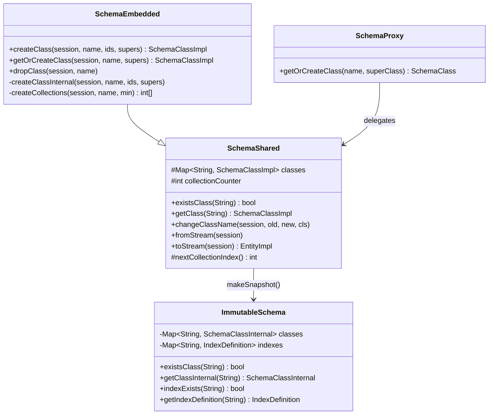
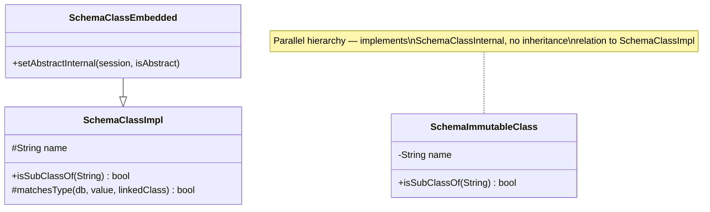
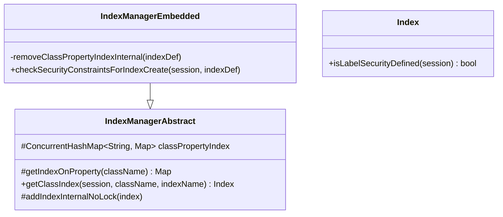
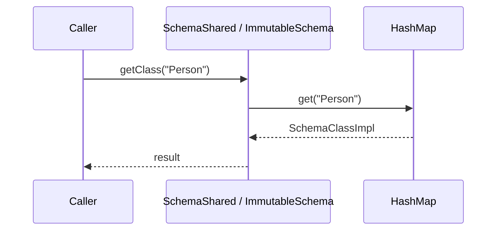
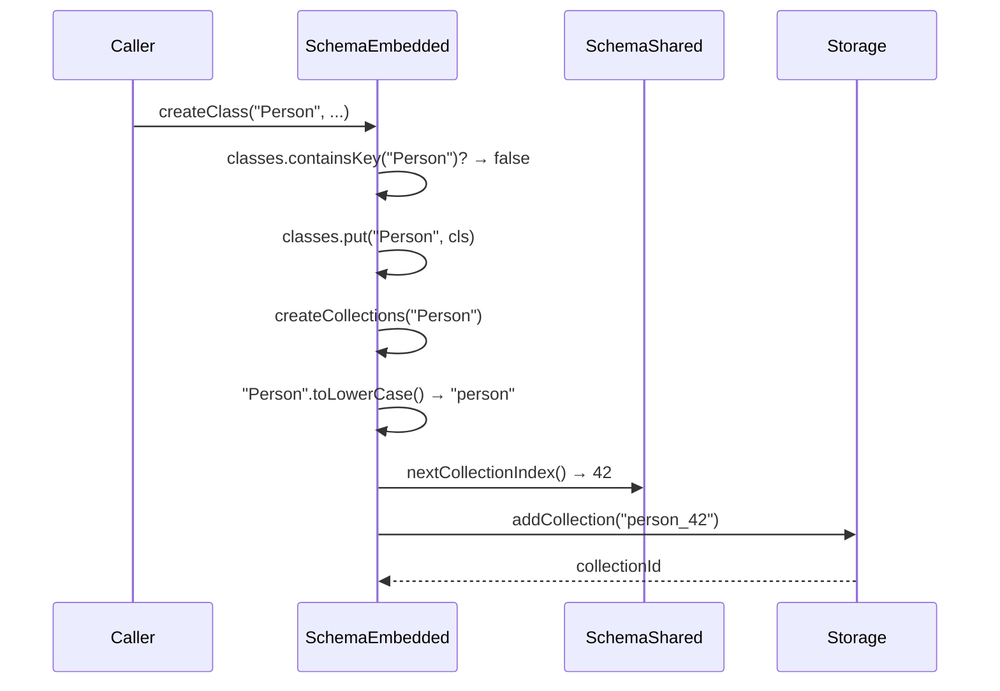
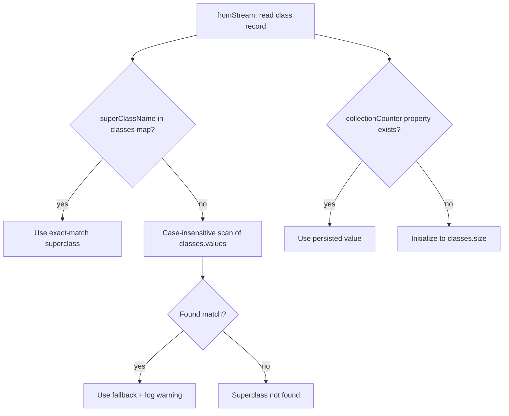

# Case-Sensitive Class and Index Names — Final Design

## Overview

This feature eliminated all `toLowerCase()` and `equalsIgnoreCase()` calls
used for class-name and index-name normalization across the schema and index
layers. Class names and index names are now stored and looked up by their
original case in plain `HashMap`/`ConcurrentHashMap` containers, removing one
throwaway `String` allocation per lookup on hot paths (record deserialization,
query execution, index operations).

The implementation closely followed the planned design with three deviations:

1. **renameCollection() rewrite** — the plan did not identify a hidden
   dependency on the old naming convention (`collection name = lowercase class
   name`). The method was rewritten to iterate collection IDs and replace the
   old prefix with the new one, handling both legacy (no suffix) and
   counter-based naming.
2. **Legacy superclass fallback** — `SchemaShared.fromStream()` gained a
   case-insensitive scan fallback for superclass resolution, to handle
   pre-migration databases that may have stored lowercased superclass names.
   This was not in the original design.
3. **Latent NPE fix in security filters** — `SecurityResourceProperty.getClassName()`
   returns null for wildcard policies (`database.class.*`). Both `Index` and
   `IndexManagerEmbedded` security filters gained an `isAllClasses()` guard
   before the class-name comparison. This was a pre-existing bug exposed by the
   `equalsIgnoreCase()` → `equals()` migration.

## Class Design

### Schema Layer

All `classes` and `indexes` maps use the original-case name as the key.
`SchemaShared.existsClass()` and `getClass()` are direct `HashMap.get()`
calls with no normalization. `ImmutableSchema.getClassInternal()` is a
single `HashMap.get()` — the two-phase fast-path/fallback optimization from
the old code was removed. `SchemaProxy.getOrCreateClass()` passes names
through without transformation.

### Class Hierarchy Comparisons

`isSubClassOf(String)` in both hierarchies uses `equals()` instead of
`equalsIgnoreCase()`. `matchesType()` in `SchemaClassImpl` similarly uses
`equals()`. `SchemaClassEmbedded.setAbstractInternal()` was also updated
(not in the original design — discovered during implementation).

### Index Manager

`classPropertyIndex` uses the original-case class name from
`indexDefinition.getClassName()` as the outer map key. All
`toLowerCase(Locale.ROOT)` calls in `getIndexOnProperty()`,
`getClassIndex()`, `addIndexInternalNoLock()`, and
`removeClassPropertyIndexInternal()` were removed.

Both security filter methods (`Index.isLabelSecurityDefined()` and
`IndexManagerEmbedded.checkSecurityConstraintsForIndexCreate()`) use
`x.isAllClasses() || className.equals(x.getClassName())` — the
`isAllClasses()` guard prevents NPE when `getClassName()` returns null for
wildcard security policies.

### Adjacent Code Changes

Three additional files had `equalsIgnoreCase()` → `equals()` changes for
class-name comparisons:

- **CheckSafeDeleteStep** — compares with `"V"` / `"E"` vertex/edge class constants
- **DatabaseImport** — class drop ordering and `"ORestricted"` check;
  index-name comparison with `EXPORT_IMPORT_INDEX_NAME`
- **VertexEntityImpl** — edge class detection (only class-name comparisons
  were changed; unrelated `equalsIgnoreCase` on property values like
  `"true"` / `"ordered"` were left as-is)

## Workflow

### Class Lookup (Single HashMap.get)

No intermediate `String` allocation. Both mutable (`SchemaShared`) and
immutable (`ImmutableSchema`) schemas use the same pattern: a single
`HashMap.get()` with the caller-provided name.

### Class Creation with Collection Counter

Collection names are always lowercase with a counter suffix
(`<lowercase>_<counter>`). The counter is protected by the schema write lock
and persisted in the schema record.

### Schema Load with Legacy Superclass Fallback

The legacy fallback is defensive — it handles pre-migration databases where
superclass names may have been stored in lowercase. It logs a warning when
triggered. The `collectionCounter` initialization from `classes.size()`
ensures new collections get suffixes that are unlikely to collide with
existing names.

## Collection Name Uniqueness — Global Counter

With case-sensitive class names, distinct classes like `Person`, `PERSON`,
and `person` all derive the same lowercase collection prefix (`person`). The
global `collectionCounter` in `SchemaShared` resolves this.

### Counter Design

- **Field**: `protected int collectionCounter` in `SchemaShared`
- **Access**: `nextCollectionIndex()` returns `collectionCounter++` — must be
  called under the schema write lock (enforced by assertion)
- **Collection name**: `className.toLowerCase(Locale.ENGLISH) + "_" + nextCollectionIndex()`
- **Persistence**: `toStream()` writes `"collectionCounter"` property;
  `fromStream()` reads it or initializes from `classes.size()` for
  pre-migration schemas

### Backward Compatibility

Existing databases have collections named without the counter suffix (e.g.,
`person` not `person_0`). This is safe because:

1. The schema-to-collection mapping is integer-based (collection IDs, not
   names). `fromStream()` rebuilds this from stored class-to-collection-ID
   mappings.
2. Existing collection names are never renamed — only newly created classes
   get the counter suffix.
3. The `renameCollection()` method handles both legacy and counter-based
   naming — it identifies collections by iterating the class's collection IDs
   and matching the old lowercase prefix, then replaces the prefix while
   preserving any `_N` suffix.

## Legacy Superclass Fallback

**What**: When `SchemaShared.fromStream()` resolves superclass references, it
first does an exact-case `classes.get(superClassName)`. If that fails, it
falls back to a case-insensitive scan of all classes.

**Why**: Pre-migration databases may have stored superclass names in
lowercase in the schema record. The exact-match lookup would fail for these
because the class itself was registered with its original case. Without the
fallback, opening such databases would produce broken inheritance chains.

**Gotchas**:
- The fallback is O(n) over all classes, but only triggers for legacy data —
  new databases always store the correct-case superclass name.
- A warning is logged each time the fallback is used, making it visible in
  production logs.
- The fallback does not update the stored superclass name — it only resolves
  the in-memory reference. The stale name persists until the next schema
  modification triggers `toStream()`.

## Security Filter NPE Guard

**What**: `Index.isLabelSecurityDefined()` and
`IndexManagerEmbedded.checkSecurityConstraintsForIndexCreate()` compare
class names from `SecurityResourceProperty`. Both now guard with
`x.isAllClasses()` before calling `x.getClassName()`.

**Why**: `SecurityResourceProperty.getClassName()` returns `null` when the
security rule uses a wildcard pattern like `database.class.*.<property>`.
The old `equalsIgnoreCase()` happened to work because `null` was the
receiver's argument (the method was called as
`className.equalsIgnoreCase(x.getClassName())`), which returns `false` for
null. The new `equals()` call uses the same receiver pattern but was
discovered during code review to be fragile — adding an explicit guard makes
the null-handling visible.

**Gotchas**: This is a correctness fix, not just a refactoring artifact. The
old code worked by accident — reversing the receiver order would have caused
an NPE even before this migration.
