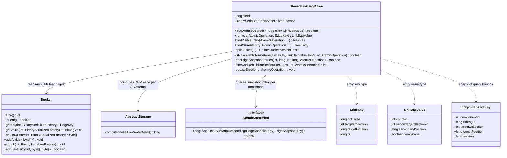
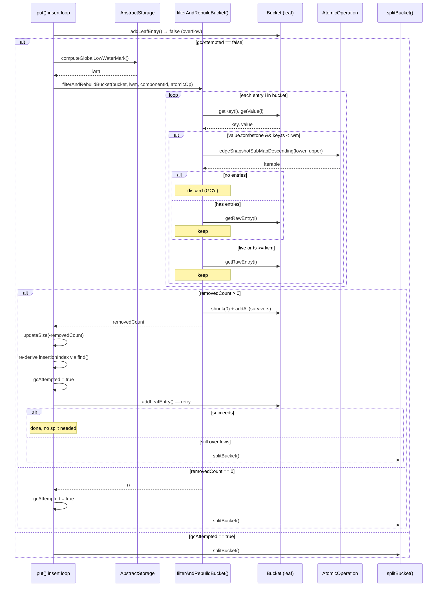
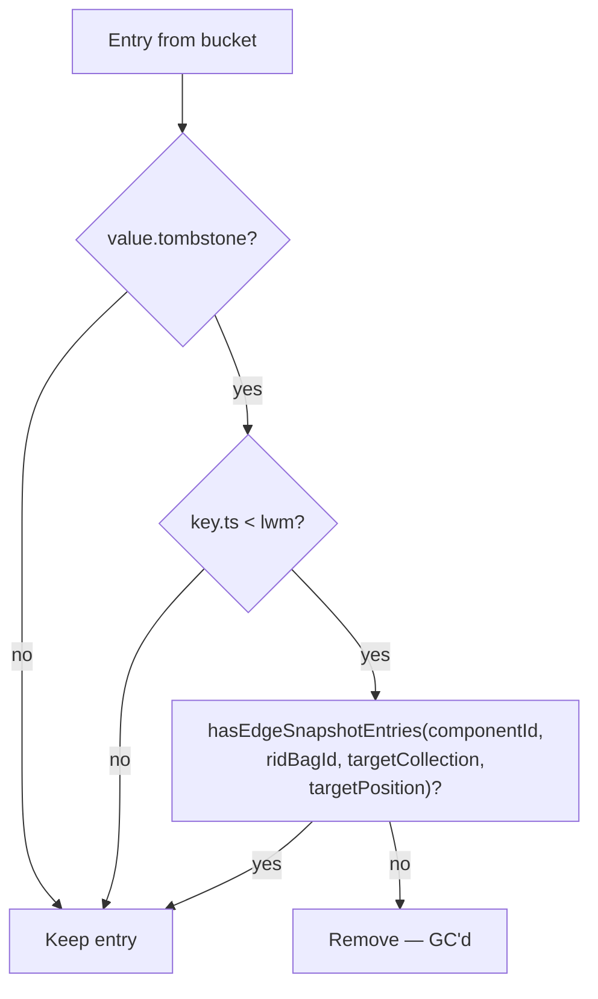

# Edge Tombstone GC During Page Split — Final Design

## Overview

The implementation adds tombstone garbage collection to `SharedLinkBagBTree`,
triggered when a leaf bucket overflows during `put()` or `remove()`. When a
bucket is full, the GC filters out removable tombstones, rebuilds the bucket
with survivors only, and retries the insert. A split occurs only if the bucket
is still full after filtering.

The final implementation matches the planned design closely. Key deviations:

- **GC in `remove()` path**: The plan focused on `put()`, but the same
  filter-rebuild-retry pattern was applied to `remove()`'s cross-transaction
  tombstone insertion loop, which also calls `addLeafEntry()` and can overflow.
- **`componentId` parameter**: `hasEdgeSnapshotEntries()` requires the B-tree's
  `componentId` (extracted from `fileId`) to construct `EdgeSnapshotKey` range
  bounds. This was implicit in the plan but explicit in the implementation.
- **Separate key/value deserialization**: The plan described using
  `getEntry(i, serializerFactory)` (returns both key and value). The
  implementation uses `getKey(i, serializerFactory)` and
  `getValue(i, serializerFactory)` separately, which is the actual Bucket API.

## Class Design

**`SharedLinkBagBTree`** is the only modified class. Three private helper
methods were added (`isRemovableTombstone`, `hasEdgeSnapshotEntries`,
`filterAndRebuildBucket`) and two call sites were modified (`put()` and
`remove()`). No changes to `Bucket`, `AbstractStorage`, `AtomicOperation`,
or any other existing class.

The `componentId` (extracted via `AbstractWriteCache.extractFileId(getFileId())`)
is needed to construct `EdgeSnapshotKey` range bounds because the shared
snapshot index is keyed by `(componentId, ridBagId, targetCollection,
targetPosition, version)` — the `componentId` scopes the query to this
B-tree instance.

## Workflow

### Filter-Rebuild-Retry in `put()`

The same pattern is applied in `remove()`'s cross-transaction tombstone
insertion loop (where a tombstone replaces a live entry with a different
timestamp). The `remove()` path first preserves the old entry in the
snapshot index, removes it, then inserts a tombstone — the overflow check
and GC attempt happen on the tombstone insertion's `addLeafEntry()`.

### Tombstone Eligibility Check

The check is conservative: any doubt keeps the entry. The strict inequality
`key.ts < lwm` (not `<=`) ensures that the transaction at exactly the LWM
timestamp — which is still active — sees its own tombstones.

## Ghost Resurrection Prevention

The most critical invariant: removing a tombstone must never cause a deleted
edge to reappear. The attack scenario:

1. Tombstone T is GC'd from the B-tree.
2. A reader searches for the logical edge, finds nothing in the B-tree.
3. The reader falls through to `findVisibleSnapshotEntry()`.
4. A stale snapshot entry S (a live version from before the deletion) lingers
   in the snapshot index.
5. The reader sees S and concludes the edge is alive — **ghost resurrection**.

`hasEdgeSnapshotEntries()` prevents this by querying the snapshot index for
the full version range of the logical edge (`Long.MIN_VALUE` to
`Long.MAX_VALUE`). If any entry exists — regardless of timestamp or
visibility — the tombstone is kept.

**Why LWM alone is insufficient:** Snapshot cleanup
(`evictStaleEdgeSnapshotEntries()`) is lazy and threshold-based. Entries
with `ts < LWM` may persist in the snapshot index indefinitely until the
eviction threshold is exceeded. During this window, removing the B-tree
tombstone would expose the stale snapshot entry.

**Concurrent snapshot insertions are safe:** A concurrent transaction inserting
a new snapshot entry for the same logical edge between the
`hasEdgeSnapshotEntries()` check and the bucket rebuild is not a problem.
Such a transaction has `ts >= lwm` and will write its own B-tree entry
(tombstone or live) with a newer timestamp. The old tombstone being GC'd has
`ts < lwm`, so all active transactions already see past it. The new snapshot
entry pairs with the newer B-tree entry, not the old tombstone.

**Atomicity guarantee:** The GC runs within the exclusive lock held during
`put()`/`remove()` on the bucket's cache entry. No concurrent modification
of the same bucket can occur between the snapshot check and the rebuild.

## Insert Retry After Filtering

After `filterAndRebuildBucket()` removes tombstones and rebuilds the bucket:

1. **Re-derive the insertion index**: `keyBucket.find(key, serializerFactory)`
   must be called again because entry positions shifted. A runtime
   `StorageException` guards the invariant that the key must not already
   exist (the entry being inserted is new).
2. **Retry via `continue`**: The `while (!addLeafEntry(...))` loop condition
   re-evaluates, attempting the insert on the filtered bucket.
3. **Three outcomes**:
   - Insert succeeds → no split, loop exits naturally.
   - Insert fails → next iteration hits `gcAttempted == true`, proceeds to
     `splitBucket()` on already-filtered entries.
   - All entries removed → empty bucket, insert trivially succeeds.

The `gcAttempted` flag ensures filtering runs at most once per `put()`/
`remove()` call, preventing repeated scans if the insert continues to
overflow (e.g., cascading splits at higher tree levels).

## Tree Size Accounting

Tree size is tracked in the B-tree entry point page and must equal the actual
number of leaf entries. Four cases during a GC-enabled insert:

| Scenario | Size change |
|---|---|
| New entry, no GC | +1 |
| New entry, GC removed N tombstones | -N (immediate) then +1 (after insert) |
| Replacement (same logical edge, different ts) | 0 (remove old -1, insert new +1) |
| Replacement with GC | -N (GC) then 0 (replacement) |

`updateSize(-removedCount)` is called immediately after GC succeeds.
The final `updateSize(sizeDiff)` at the end of `put()`/`remove()` handles
the insert itself. The `sizeDiff` variable is set to 0 for replacements
and 1 for new entries.

## Performance Characteristics

| Operation | Cost | Notes |
|---|---|---|
| LWM computation | O(T), T = active threads | Once per GC attempt. Iterates `TsMinHolder` instances, typically < 100. |
| Entry iteration | O(N), N = bucket entries | Key + value deserialization per entry. N bounded by bucket capacity (~hundreds for 8 KB pages). |
| Snapshot query | O(log S) per tombstone | S = snapshot index size. `ConcurrentSkipListMap.subMap()`. Short-circuits on first entry. Only for entries passing the LWM check. |
| Bucket rebuild | O(N), N = survivors | `shrink(0)` + `addAll()`. Only when removedCount > 0. |
| Overall per GC attempt | O(N + K log S), K = tombstones | K is typically a small fraction of N. Non-tombstone entries are filtered cheaply by the `tombstone` flag check. |

The GC adds no cost when there are no tombstones in the bucket (the flag check
on each entry is the only overhead). When tombstones exist, the dominant cost
is the snapshot index query — one `subMap()` call per tombstone candidate that
passes the LWM check.
