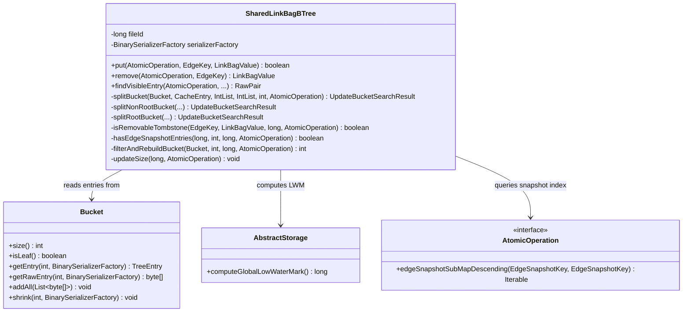
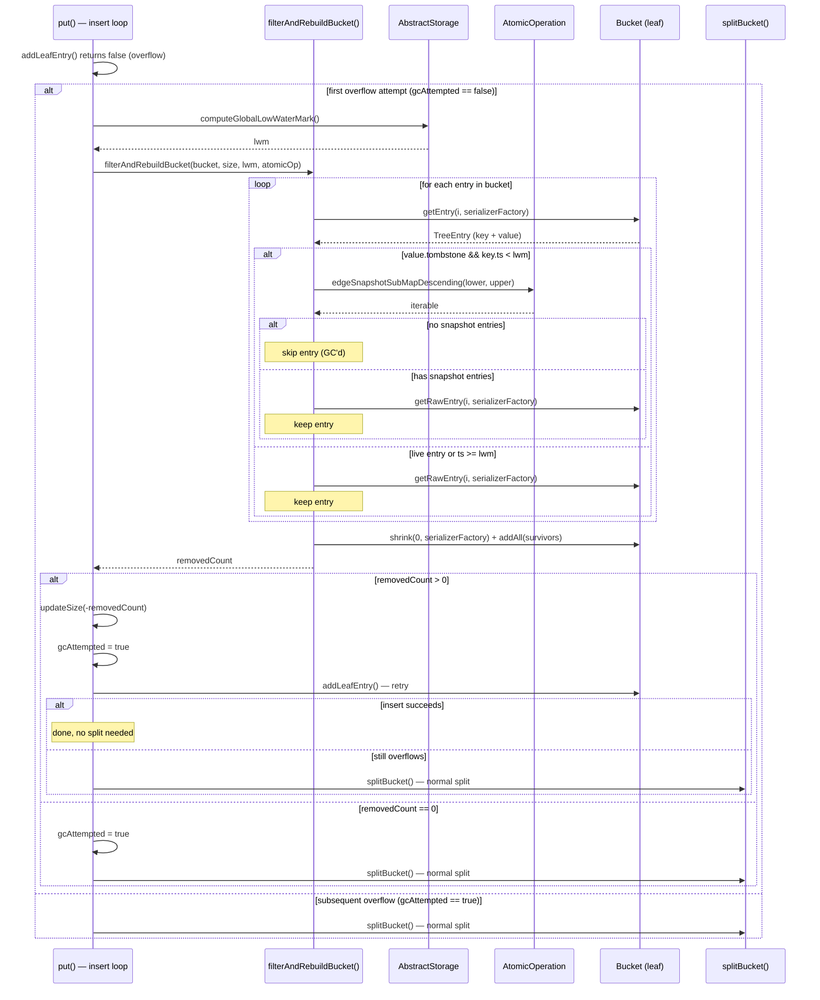
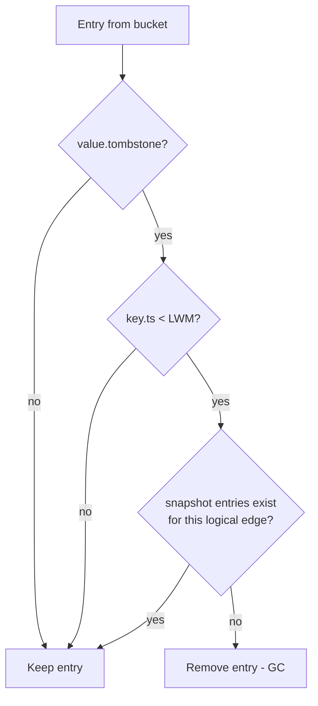

# Edge Tombstone GC During Page Split — Design

## Overview

When an edge is deleted by a transaction different from the one that created it,
`SharedLinkBagBTree` inserts a **tombstone** entry (an `EdgeKey` with the
deleting transaction's timestamp and a `LinkBagValue` with `tombstone=true`).
These tombstones accumulate indefinitely because no existing mechanism removes
them from the B-tree.

This design adds tombstone garbage collection triggered by leaf page overflow.
When a bucket overflows and would normally trigger a split, we first filter out
tombstones that are safe to remove, rebuild the bucket with surviving entries,
and retry the insert. Only if the insert still fails does the normal split
proceed. A tombstone is removable when (a) its timestamp is below the global
low-water mark (LWM) and (b) no entries exist in the edge snapshot index for
the same logical edge.

The approach piggybacks on the existing overflow handling — no new background
tasks, no new WAL record types, no changes to the `Bucket` page format. When
tombstone removal frees enough space, the split is avoided entirely.

## Class Design

**New methods on `SharedLinkBagBTree`:**

- `isRemovableTombstone(EdgeKey, LinkBagValue, long lwm, AtomicOperation)` —
  Returns `true` if the entry is a tombstone, its timestamp is below the LWM,
  and no edge snapshot entries exist for the same logical edge. This is the
  core eligibility check.

- `hasEdgeSnapshotEntries(long ridBagId, int targetCollection, long targetPosition, AtomicOperation)` —
  Queries `edgeSnapshotSubMapDescending()` with the full range for the logical
  edge. Returns `true` if any entry exists. Short-circuits on first match.

- `filterAndRebuildBucket(Bucket, int bucketSize, long lwm, AtomicOperation)` —
  Iterates all entries in a leaf bucket using `Bucket.getEntry(i, serializerFactory)`
  (returns both key and value in a single deserialization pass), collecting
  surviving entries as raw bytes. Rebuilds the bucket in-place via
  `shrink(0, serializerFactory)` + `addAll(survivors)`. Returns the number of
  removed tombstones (0 if none were eligible).

No changes to `Bucket`, `AbstractStorage`, `AtomicOperation`, or any other
existing class.

## Workflow

### Overflow Handling with Tombstone Filtering

The filter loop uses two different `Bucket` accessors per entry:
`getEntry(i, serializerFactory)` deserializes the key and value for
tombstone eligibility checking, while `getRawEntry(i, serializerFactory)`
retrieves the original serialized bytes for survivors — these raw bytes
are collected into a list and passed to `addAll()` during the rebuild.
The two calls are necessary because `addAll()` operates on raw byte
arrays, not deserialized objects.

### Tombstone Eligibility Check

The eligibility check is conservative: any doubt results in keeping the
entry. Using a stale (lower) LWM is safe because it only causes us to
skip eligible tombstones, never to remove one prematurely.

## Ghost Resurrection Prevention

The most critical invariant is that removing a tombstone must not cause
a deleted edge to reappear. This can happen if:

1. Tombstone T is removed from the B-tree.
2. A reader searches for the logical edge, finds nothing in the B-tree.
3. The reader falls through to the edge snapshot index.
4. A stale snapshot entry S (a live version from before the deletion)
   still exists in the snapshot index.
5. The reader sees S and concludes the edge is alive → **ghost resurrection**.

The `hasEdgeSnapshotEntries()` check prevents this by verifying that no
snapshot entries exist for the logical edge before removing the tombstone.
Since both the B-tree tombstone removal and the snapshot index query happen
within the same atomic operation's scope, and the snapshot index is only
modified at commit time, the check is consistent.

**Why LWM alone is not sufficient:** The snapshot index cleanup
(`evictStaleEdgeSnapshotEntries()`) is lazy and threshold-based. Entries
with `ts < LWM` may linger in the index indefinitely until the cleanup
threshold is exceeded. During this window, removing a tombstone from the
B-tree would expose the stale snapshot entry to readers.

**Concurrency with concurrent snapshot insertions:** The snapshot index
is a `ConcurrentSkipListMap` shared across transactions. A concurrent
transaction could insert a new snapshot entry for the same logical edge
between the `hasEdgeSnapshotEntries()` check and the bucket rebuild. This
is safe because any such concurrent insertion means another transaction is
actively modifying the same edge — that transaction will also write its own
B-tree entry (tombstone or live) with a newer timestamp. The tombstone
being GC'd has `ts < LWM`, meaning all active transactions already see
past it. The new snapshot entry belongs to a transaction with `ts >= LWM`,
so it pairs with a newer B-tree entry, not the old tombstone. Removing the
old tombstone cannot expose the new snapshot entry to ghost resurrection
because readers will find the newer B-tree entry first.

## Insert Retry After Filtering

After tombstone filtering, the bucket is rebuilt with only the surviving
entries. The caller then retries `addLeafEntry()`:

- **Insert succeeds**: No split needed. This is the common case when
  tombstones freed enough space. The tree avoids an unnecessary split
  that would have created two under-filled buckets.
- **Insert still fails**: The bucket is still full with live entries.
  The normal `splitBucket()` proceeds. Since the bucket was already
  rebuilt without tombstones, the split operates on clean data — the
  midpoint and separation key reflect only live entries.
- **All entries removed**: The bucket is empty after filtering. The
  insert trivially succeeds into the empty bucket. No split needed.

The `gcAttempted` flag ensures filtering runs at most once per insert
operation, preventing repeated scans if the insert continues to overflow
due to cascading splits at higher tree levels.

## Performance Characteristics

| Operation | Cost per split | Notes |
|---|---|---|
| LWM computation | O(T) where T = active threads | Computed once per split. Typically T < 100. |
| Entry iteration | O(N) where N = bucket entries | Already done by the split. Added cost: key+value deserialization for tombstone candidates. |
| Snapshot query per tombstone | O(log S) where S = snapshot index size | One `subMap()` call per tombstone. Short-circuits on first entry. Only invoked for entries that pass the LWM check. |
| Bucket rebuild | O(N) where N = surviving entries | `shrink(0, serializerFactory)` + `addAll(survivors)` rewrites the page. Only happens when at least one tombstone is removed. |
| Overall | O(N + K × log S) where K = tombstones in bucket | K is typically small (fraction of N). The LWM check filters most non-tombstone entries cheaply. |

The main added cost is the snapshot index query for each tombstone candidate.
In the common case (few tombstones per bucket, small snapshot index), this is
negligible compared to the page I/O cost of the split itself.
