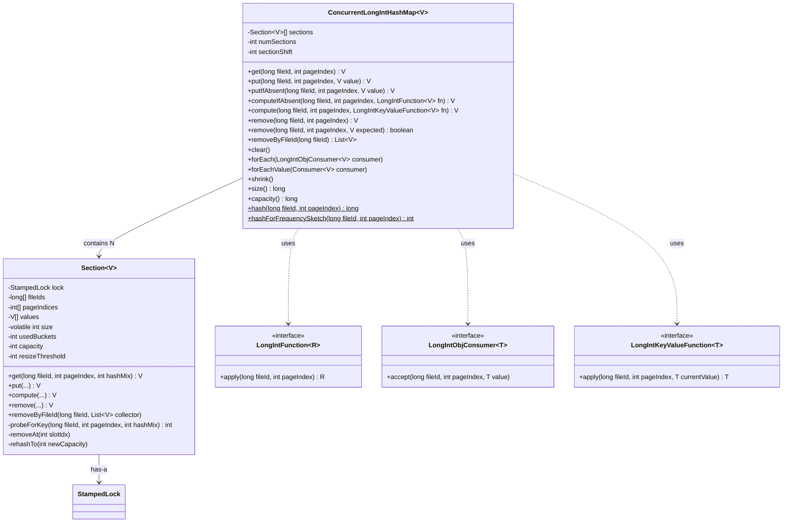
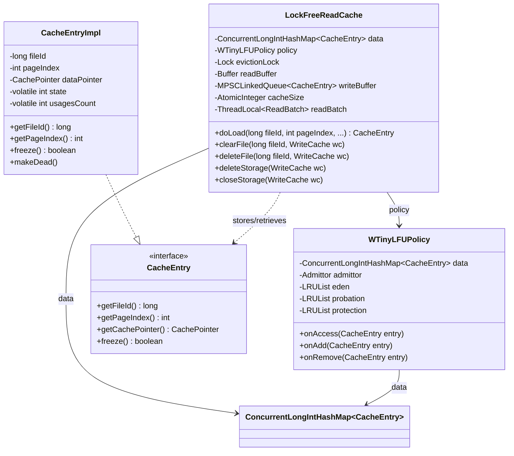
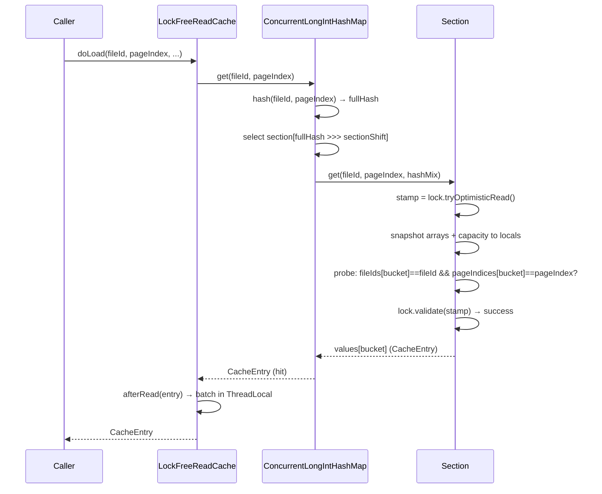
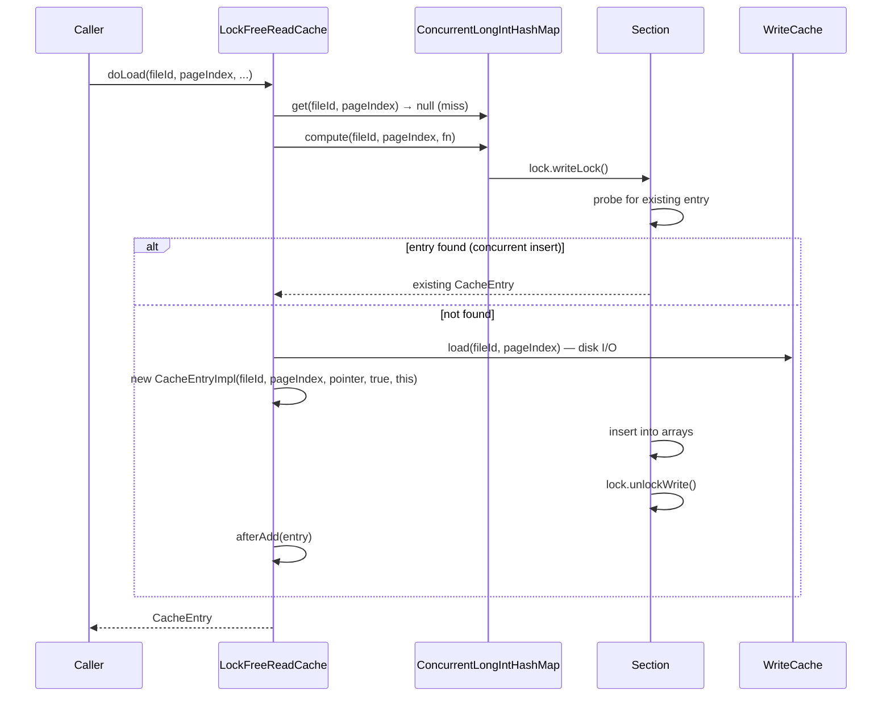
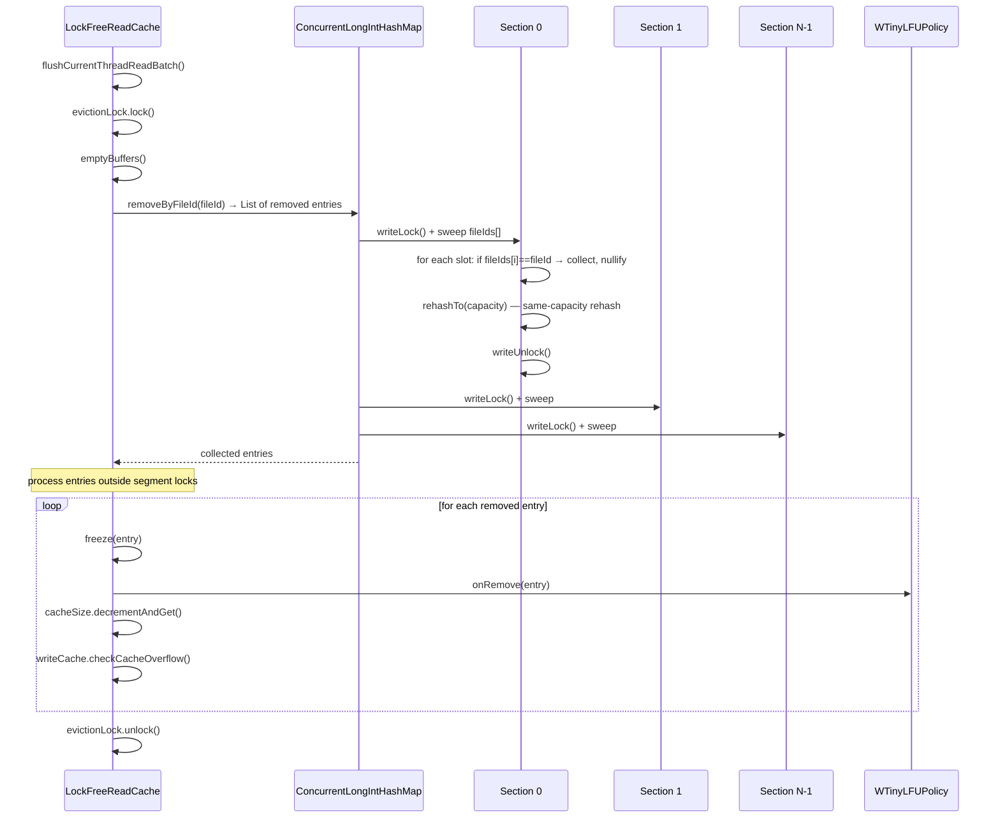
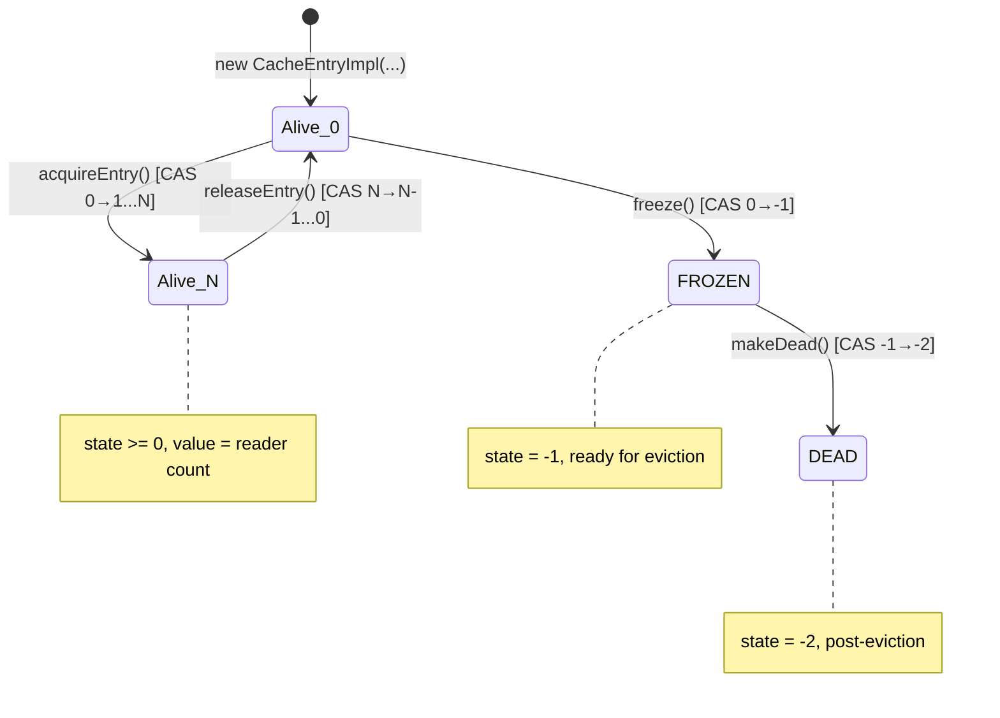

# Primitive CHM Cache — Final Design

## Overview

The implementation replaced `ConcurrentHashMap<PageKey, CacheEntry>` in `LockFreeReadCache`
with `ConcurrentLongIntHashMap<CacheEntry>` — a segmented, open-addressing hash map storing
composite `(long fileId, int pageIndex)` keys inline in parallel primitive arrays. This
eliminates all `PageKey` allocations on the hot read path and reduces per-entry memory
overhead from ~96 bytes to ~20 bytes.

**Deviations from the planned design:**

1. **Section uses composition, not inheritance** — `Section` has-a `StampedLock` instead of
   extending it. This was a review-driven change (A11/T6) to improve encapsulation.
2. **removeByFileId uses unconditional same-capacity rehash** — the plan specified conditional
   compaction (tombstone ratio threshold). The implementation always rehashes after bulk
   removal since the sweep uses nullification (not backward-sweep per entry), leaving gaps
   that must be compacted. Simpler and always correct.
3. **hashForFrequencySketch uses independent hash** — the plan proposed truncating the
   murmur hash to 32 bits. Review (A2) identified this correlates with bucket position.
   The implementation uses `Long.hashCode(fileId) * 31 + pageIndex` instead.
4. **Section count alignment** — the plan stated the map constructor aligns section count
   to power of two internally. It does not — only per-section capacity is aligned. The
   caller (`LockFreeReadCache`) wraps `N_CPU << 1` with `ceilingPowerOfTwo()`.
5. **clearFile no longer takes filledUpTo** — a natural consequence of `removeByFileId()`
   finding all entries by file regardless of page count. Simplified callers (`deleteStorage`,
   `closeStorage`) no longer pre-collect `filledUpTo` into `RawPairLongInteger` lists.
6. **rehashTo writes arrays before capacity** — a concurrency bug fix discovered during
   Track 3 stress testing. The original BookKeeper-derived code wrote `capacity` before
   the new arrays, allowing optimistic readers to see the new (larger) capacity with old
   (smaller) arrays (AIOOBE). This is exactly the BOOKKEEPER-4317 class of bug.

## Class Design



**ConcurrentLongIntHashMap** is the outer class holding a fixed-size array of `Section`
objects (power-of-two count, default 16). It routes operations to the correct section using
the upper bits of a 64-bit Murmur3 hash, then delegates. The three functional interfaces are
nested inside the map class to avoid boxing primitive key components.

**Section** holds per-segment parallel arrays (`long[] fileIds`, `int[] pageIndices`,
`V[] values`) and manages probing, resize, and compaction. Unlike the planned design where
Section extended `StampedLock`, the implementation uses composition (`StampedLock lock` field)
for better encapsulation. `values[i] == null` marks an empty slot; null values are disallowed.
The `size` field is `volatile` to support lock-free aggregate `size()` reads from the outer
class.

**probeForKey** is a shared helper extracted during implementation to eliminate 3x probe loop
duplication. It returns a bitwise-encoded result: the position of a matching key, or the
bitwise complement of the first empty slot encountered.



**CacheEntryImpl** stores `long fileId` and `int pageIndex` directly as primitive fields.
The `getPageKey()` method and `PageKey` field are removed. The `chm.PageKey` record class
is deleted entirely. The `local.PageKey` class used by `WOWCache` is unaffected (different
package, different field types: `int fileId, long pageIndex`).

**CacheEntryImpl.hashCode()** uses `Long.hashCode(fileId) * 31 + pageIndex` — matching
`ConcurrentLongIntHashMap.hashForFrequencySketch()`. This is intentional: the frequency
sketch uses this hash for TinyLFU admission counting. `CacheEntryImpl` is not used as a
hash key in any collection, so the hash formula serves only the frequency sketch.

**clearFile** no longer takes a `filledUpTo` parameter. Since `removeByFileId()` finds all
entries for a file via linear sweep, the caller does not need to know the page count.
`deleteStorage` and `closeStorage` were simplified — they no longer pre-collect
`filledUpTo` values into `RawPairLongInteger` lists.

## Workflow

### Read path (cache hit)



The hot read path is lock-free on cache hit. `tryOptimisticRead()` captures a stamp, then
all mutable fields (array references and capacity) are snapshotted to local variables before
the probe loop. This is critical: reading fields directly (not via locals) would allow stale
reads to pass validation after a concurrent resize. The probe compares both `fileIds[bucket]`
and `pageIndices[bucket]` — two primitive comparisons, no virtual dispatch. If validation
fails (rare — only during concurrent writes to the same segment), a single read-lock
fallback re-probes. There is no retry loop to avoid livelock under heavy write contention.

**Zero allocation**: no `PageKey`, no iterator, no lambda — just primitive field comparisons
on flat arrays.

### Read path (cache miss)



On cache miss, `compute()` acquires the segment write lock and calls the remapping function.
Disk I/O (`writeCache.load()`) happens under the segment write lock. The `compute()` method
supports null return from the remapping function: absent key + null return = no-op; present
key + null return = removal. This matches `ConcurrentHashMap.compute()` semantics and is
used by `silentLoadForRead()` as a virtual lock — the function stores via a side-channel
and returns null.

### clearFile (bulk removal)



Each section's sweep holds the segment write lock, scans all `fileIds[]` slots, collects
matching entries (nullifying their slots), and performs a same-capacity rehash to restore
probe chain integrity. The collected entries are returned to the caller for post-removal
processing (freeze/onRemove/checkCacheOverflow) outside any segment lock.

The unconditional rehash after sweep is simpler than the planned conditional tombstone
threshold. Since the sweep nullifies slots (rather than using backward-sweep compaction per
entry), probe chains may be broken. Rehash at the same capacity restores all chains without
growing the array. The cost is acceptable because `clearFile()` is called on file
close/truncate/delete — not a latency-sensitive path.

## Hashing and Probing

The hash function combines both key fields using a Murmur3-style 64-bit mixer:

```
h = fileId * 0xc6a4a7935bd1e995L
h ^= h >>> 47
h = (h ^ pageIndex) * 0xc6a4a7935bd1e995L
h ^= h >>> 47
```

The 64-bit hash is split:
- **Upper bits** select the section: `hash >>> sectionShift` (where
  `sectionShift = 64 - log2(numSections)`)
- **Lower bits** select the starting bucket: `(int) hash & (capacity - 1)`

Linear probing advances by 1 on collision. Each probe step compares both `fileIds[bucket]`
and `pageIndices[bucket]`. The probe terminates when a matching entry is found (both fields
match and value is non-null) or a null value slot is encountered (end of probe chain).

**Frequency sketch hashing** uses a deliberately independent formula:
`Long.hashCode(fileId) * 31 + pageIndex`. This avoids correlation with bucket position
(the murmur hash's lower 32 bits are used for both bucket selection and would be reused if
truncated). The frequency sketch is approximate by design (Count-Min Sketch) and tolerates
hash quality variations.

## Concurrency Model

Each `Section` holds a `StampedLock` providing three access modes:

1. **Optimistic read** (`get()`): `tryOptimisticRead()` → snapshot locals → read arrays →
   `validate(stamp)`. Zero contention on the fast path. Falls back to read lock on
   validation failure — one attempt only, no retry loop to avoid livelock.

2. **Read lock** (`get()` fallback, `forEach()`, `forEachValue()`): shared access for when
   optimistic read fails or during iteration.

3. **Write lock** (`put()`, `compute()`, `remove()`, `removeByFileId()`, `rehashTo()`):
   exclusive access per segment. Multiple segments can be written concurrently.

**Rehash safety**: `rehashTo()` allocates new arrays, populates them, then updates the
array references. The `capacity` field is written **last** — after the array references.
This ordering prevents the BOOKKEEPER-4317 class of bug where an optimistic reader could
snapshot the new (larger) capacity with old (smaller) arrays, causing
`ArrayIndexOutOfBoundsException`. Optimistic readers that captured old array references use
the old capacity for bucket indexing, which is safe — they either find the entry or fail
validation and fall back to read lock, where they see the new arrays.

**`compute()` null-return semantics**: `silentLoadForRead()` uses `compute()` purely as a
lock mechanism — the remapping function creates a `CacheEntryImpl` stored via a side-channel
(`updatedEntry[0]`) and returns `null`, meaning "do not insert into the map." For absent
key + null return = no-op; for present key + null return = removal. This matches
`ConcurrentHashMap.compute()` semantics.

## Backward-Sweep Compaction

The `remove()` and conditional `remove()` operations use backward-sweep compaction instead
of tombstones. When an entry is removed at slot `i`:

1. Set `values[i] = null` and decrement `size` and `usedBuckets`.
2. Walk forward from `i+1`. For each occupied slot `j`, check if its natural bucket (from
   hash) lies "between" `i` and `j` in circular distance (`isBetween`). If so, the entry at
   `j` was displaced past the now-empty `i` — move it back to `i`, set `values[j] = null`,
   and continue from `j`.
3. This eliminates tombstones entirely for single-entry removal, keeping `usedBuckets == size`.

This is distinct from `removeByFileId`, which uses bulk nullification followed by
same-capacity rehash. Backward-sweep would be O(n²) for bulk removal since each individual
removal shifts entries that may themselves need removal. The unconditional rehash is O(n)
and restores all probe chains in a single pass.

## Lock Ordering

`StampedLock` is not reentrant. Code running under a segment write lock must not re-enter
the map. This constraint shapes the `removeByFileId` design:

- `freeze()` — CAS on `CacheEntry.state`. Does not access the map. Safe.
- `policy.onRemove()` — removes from LRU lists. Does not access the map. Safe.
- `writeCache.checkCacheOverflow()` — may trigger operations that access the read cache
  map. **Not safe** under segment lock — would deadlock if routed to the same segment.

Therefore, `removeByFileId` collects entries during the sweep and returns them for the
caller to process after the lock is released.

**Lock acquisition order** (always in this order to prevent deadlock):
1. `evictionLock` (`ReentrantLock`) — outermost
2. Segment write lock (`StampedLock`) — innermost

## CacheEntry State Machine

`CacheEntryImpl` uses an `int state` field (via `AtomicIntegerFieldUpdater`) encoding both
reader count and lifecycle:



- `acquireEntry()` succeeds only when `state >= 0` (alive), incrementing the reader count.
- `freeze()` succeeds only when `state == 0` (released, no readers), transitioning to FROZEN.
- `makeDead()` succeeds only from FROZEN, transitioning to DEAD.
- All transitions are CAS-based, requiring no external locks.

## WTinyLFU Three-Level Eviction

The eviction policy is unchanged from the pre-migration design. Three LRU lists form a
hierarchy:

- **Eden** (20% of max capacity): newly inserted entries. FIFO order.
- **Protection** (remaining 80% of second-level capacity): entries that proved their
  frequency. LRU order.
- **Probation** (20% of second-level capacity): entries demoted from protection or promoted
  from eden. Second-chance entries.

On eden overflow, the LRU victim from eden is compared against the LRU victim from
probation by frequency (from the Count-Min Sketch). The loser is evicted; the winner enters
probation. On access, probation entries that have sufficient frequency are promoted to
protection.

The only change is the frequency sketch keying: `hashForFrequencySketch(entry.getFileId(),
entry.getPageIndex())` replaces `entry.getPageKey().hashCode()`. The formulas differ
(`Long.hashCode * 31 + pageIndex` vs `Objects.hash(fileId, pageIndex)`) but the frequency
sketch's approximate nature makes this a non-issue — the sketch periodically halves all
counters and adapts to any hash distribution.
