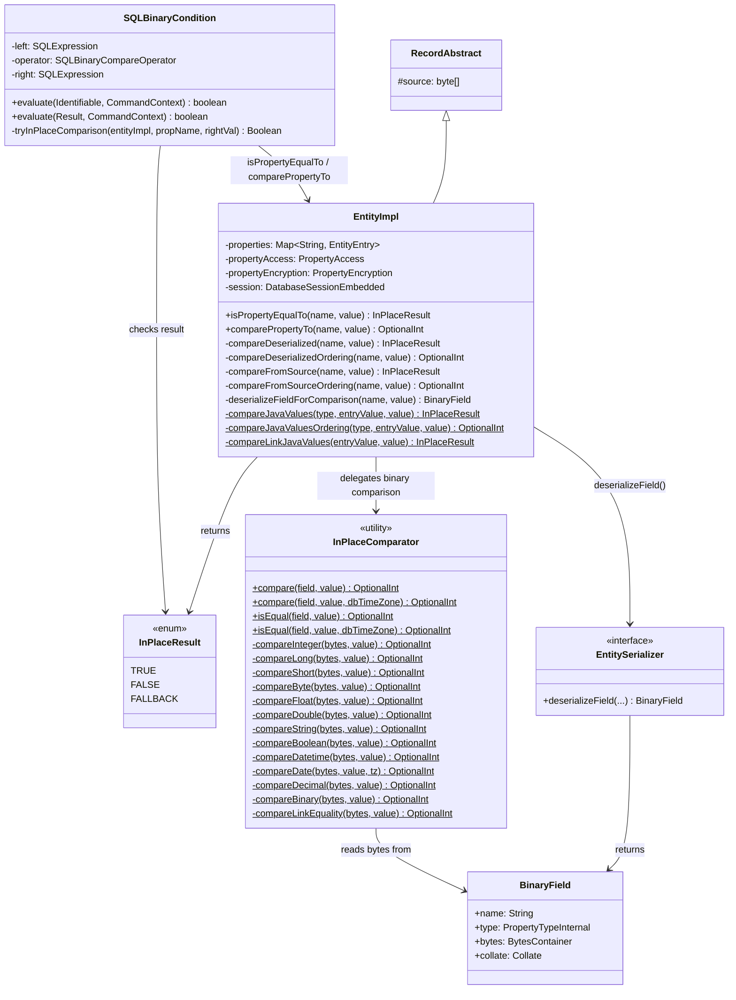
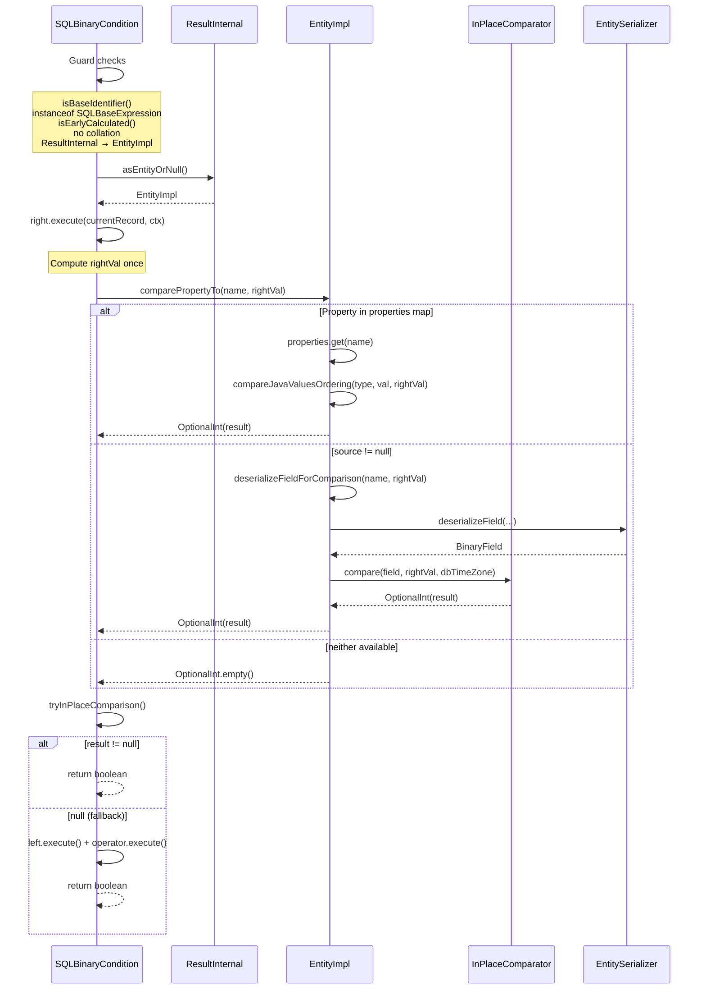
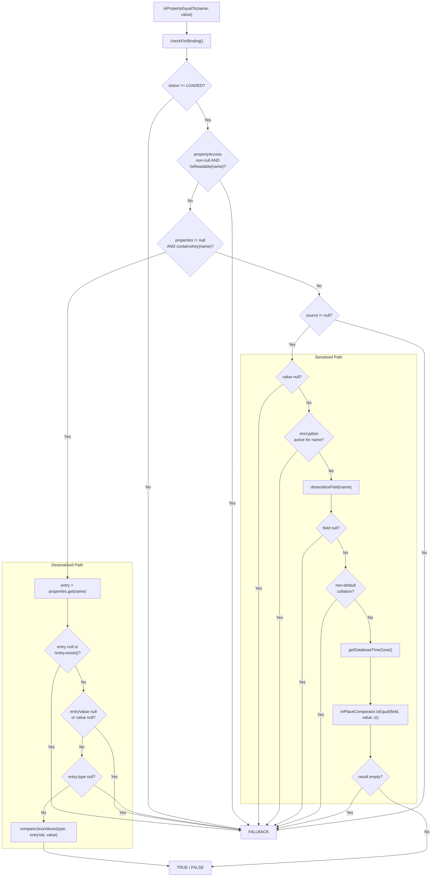

# In-Place Property Comparison for SQL WHERE Clauses — Final Design

## Overview

This feature avoids property deserialization overhead during SQL WHERE clause
evaluation by comparing property values in-place — either against the
already-deserialized Java object in the `properties` map, or directly against
the serialized bytes in the `source` buffer.

Two layers were implemented, matching the planned design:
1. **InPlaceComparator** — stateless utility with per-type binary comparison
   methods and type conversion logic (13 types).
2. **EntityImpl dispatch methods** — `isPropertyEqualTo()` and
   `comparePropertyTo()` that route to either the deserialized or serialized
   comparison path.

These are wired into `SQLBinaryCondition.evaluate()` (both overloads) as a
fast path before the existing deserialization-based evaluation.

**Deviations from the planned design:**
- `Optional<Boolean>` (D5) was replaced with `InPlaceResult` enum
  (TRUE/FALSE/FALLBACK) for clarity — this was recommended during Track 1
  review and adopted before any code was committed.
- The deserialized path in EntityImpl uses the same type conversion and
  precision guards as InPlaceComparator (not plain `Objects.equals`) to ensure
  cross-path equivalence. This emerged during Track 1 technical review.
- LINK equality is supported in both source and deserialized paths, while LINK
  ordering returns FALLBACK/empty in both.
- `SQLBinaryCondition.tryInPlaceComparison()` returns `Boolean` (null =
  fallback) instead of `Optional<Boolean>` — simpler for the if-null-fallback
  pattern.

All changes are in the `core` module.

## Class Design

**EntityImpl** has two new public methods: `isPropertyEqualTo` returns
`InPlaceResult` (tri-state enum), `comparePropertyTo` returns `OptionalInt`.
Both follow the same three-tier dispatch: deserialized properties map →
serialized source bytes → FALLBACK. Six private helper methods handle the
two paths (equality and ordering) and shared setup.

**InPlaceComparator** is a stateless utility class with per-type comparison
methods. It accepts `BinaryField` (type + bytes pointer) and a Java object.
The `compare` and `isEqual` methods have overloads accepting an optional
`TimeZone` parameter for DATE fields. LINK is supported for equality only
(via `compareLinkEquality`); LINK ordering returns empty.

**InPlaceResult** is a tri-state enum (TRUE/FALSE/FALLBACK) replacing the
originally planned `Optional<Boolean>`. This was adopted after review found
`Optional<Boolean>` prone to semantic confusion.

**SQLBinaryCondition** has a private `tryInPlaceComparison()` method shared
by both `evaluate()` overloads. It returns `Boolean` (null = fallback),
dispatching to `isPropertyEqualTo` for `=`/`<>`/`!=` and
`comparePropertyTo` for `<`/`>`/`<=`/`>=`.

## Workflow

### In-Place Comparison Path (Result-based overload)

The Identifiable-based overload follows the same structure but skips collation
guards (the existing overload never applies collation) and casts
`currentRecord` directly to `EntityImpl` instead of unwrapping from
`ResultInternal`.

### EntityImpl Dispatch (Equality Path)

`comparePropertyTo()` follows the same structure but returns `OptionalInt`
and uses `compareJavaValuesOrdering()` / `InPlaceComparator.compare()`.

## Type Conversion Strategy

The passed-in Java value is converted to match the serialized property's type
before comparison. This avoids an NxN cross-type matrix.

### Conversion Rules (as implemented)

| Serialized Type | Accepted Java Types | Conversion | Overflow Handling |
|---|---|---|---|
| INTEGER | Integer, Long, Short, Byte | `Number.intValue()` | Long out of int range → empty (fallback) |
| LONG | Integer, Long, Short, Byte | `Number.longValue()` | Always fits |
| SHORT | Short, Byte, Integer, Long | `Number.shortValue()` | Out of short range → empty |
| BYTE | Byte, Short, Integer, Long | `Number.byteValue()` | Out of byte range → empty |
| FLOAT | Float; Integer/Long/Short/Byte (if |val| ≤ 2^24); Double (widen to double) | `Float.floatToIntBits()` or widen both to double | Precision-unsafe integers → empty |
| DOUBLE | Double, Float; Integer/Long/Short/Byte (if |val| ≤ 2^53) | `Double.doubleToLongBits()` | Precision-unsafe longs → empty |
| STRING | String | Identity | N/A |
| BOOLEAN | Boolean | Identity | N/A |
| DATETIME | Date, Number | `Date.getTime()` or `longValue()` | N/A |
| DATE | Date, Number | millis via timezone conversion | Requires non-null `TimeZone` |
| DECIMAL | BigDecimal; Number (NaN/Infinity → empty) | `BigDecimal.valueOf()` | N/A |
| BINARY | byte[] | Identity | N/A |
| LINK | RID, Identifiable | `getIdentity()` | Equality only |

**Key difference from planned design:** Float/Double → integer type
conversions always fall back (return empty). This was a deliberate choice —
floating-point to integer truncation could silently change comparison
semantics. The planned design mentioned overflow detection for narrowing
conversions; the implementation goes further by rejecting Float/Double
entirely for integer target types.

**Precision boundaries for integer → floating-point:**
- `int → float`: safe if `|value| ≤ 2^24` (16,777,216)
- `long → double`: safe if `|value| ≤ 2^53` (9,007,199,254,740,992)

These boundaries apply in both the InPlaceComparator (source path) and the
EntityImpl `compareJavaValuesOrdering` (deserialized path) to ensure
cross-path equivalence.

## Cross-Path Equivalence

A critical invariant: for any given property and value, the deserialized
path (properties map) and the serialized path (source bytes) must produce
the same comparison result. This is enforced by:

1. **Same type conversion logic** in both paths. EntityImpl's
   `compareJavaValuesOrdering()` applies the same precision boundaries
   (2^24 for float, 2^53 for double) and the same Float/Double rejection
   for integer types as InPlaceComparator's `convertToInt/Long/Short/Byte`.

2. **Same comparison methods**: `Float.compare()` (not `==`),
   `Double.compare()` (not `==`), `BigDecimal.compareTo()` (not `equals()`),
   `Arrays.compare()` for byte arrays.

3. **Float widening to double**: When comparing a FLOAT property against a
   Double value, both paths widen the float to double precision before
   comparison (avoiding precision loss from double → float narrowing).

4. **235 unit tests + 43 cross-path equivalence tests** verify this invariant
   across all 13 types, cross-type conversions, precision boundaries, NaN,
   -0.0, infinity, and null handling.

**Known intentional asymmetry:** LINK equality in the deserialized path
compares RID components directly via `compareLinkJavaValues()`. The source
path uses `InPlaceComparator.compareLinkEquality()`. Both produce the same
result. However, `compareJavaValuesOrdering()` returns empty for LINK (no
ordering), so `comparePropertyTo` on a deserialized LINK returns empty while
`isPropertyEqualTo` succeeds.

## NULL Handling

When either the property value or the passed-in comparison value is null,
both `isPropertyEqualTo` and `comparePropertyTo` return FALLBACK/empty.
This defers NULL semantics to the standard SQL evaluation path, which
implements SQL three-valued logic (`NULL = NULL` → `NULL`, not `true`).

In the deserialized path, null is detected at `entry.value == null` or
`value == null`. In the serialized path, `value == null` is checked in
`deserializeFieldForComparison()`, and `deserializeField()` returns null
for missing properties.

## Property Access Security

Both methods check `propertyAccess.isReadable(name)` when `propertyAccess`
is non-null, falling back to the deserialization path if the property is
restricted. This maintains defense-in-depth consistency with
`EntityImpl.getProperty()`.

Additionally, encrypted properties are detected via
`propertyEncryption.isEncrypted(name)` and fall back — the in-place
comparator cannot read encrypted bytes.

## SQLBinaryCondition Integration

The integration uses a shared `tryInPlaceComparison(EntityImpl, String,
Object)` method called by both `evaluate()` overloads. Key design choices:

1. **Right value computed once**: `right.execute()` is called before
   attempting in-place comparison. On FALLBACK, only `left.execute()` is
   needed — avoiding double evaluation of the right side.

2. **Zero-allocation property name extraction**: Uses direct traversal
   `((SQLBaseExpression) left.mathExpression).getIdentifier().getSuffix()
   .getIdentifier().getStringValue()` instead of `getDefaultAlias()` (which
   allocates `new SQLIdentifier()` per call). Safe because
   `isBaseIdentifier()` guarantees the structure, and the additional
   `instanceof SQLBaseExpression` guard filters out
   `SQLGetInternalPropertyExpression` (which also passes `isBaseIdentifier()`
   but has a different internal structure).

3. **Result overload guards**: `isBaseIdentifier()`, `instanceof
   SQLBaseExpression`, `isEarlyCalculated()`, both collations null,
   `ResultInternal.asEntityOrNull() instanceof EntityImpl`.

4. **Identifiable overload guards**: Same as Result minus collation checks
   (this overload never applies collation) and minus ResultInternal
   unwrapping (cast directly to EntityImpl).

5. **Operator dispatch**: Equality (`=`) and not-equal (`<>`, `!=`) use
   `isPropertyEqualTo`; range operators (`<`, `>`, `<=`, `>=`) use
   `comparePropertyTo`. The `isRangeOperator()` method covers all four
   range operators.

## Performance Considerations

The optimization avoids Java object allocation during WHERE clause evaluation
for records that don't match the filter condition. For scan-heavy queries
(large result sets with selective filters), this eliminates the dominant cost
of `getProperty()` → deserialization → discard.

The per-property cost is a single header scan via `deserializeField()` — a
sequential read of the field-name/offset table at the start of the serialized
record. Multi-property optimization (batch header scan for
`WHERE a = 1 AND b = 2`) is explicitly a non-goal for v1.

When the property is already in the `properties` map (previously accessed),
the deserialized path avoids even the header scan — it compares Java objects
directly with the same type-safe conversion logic.
