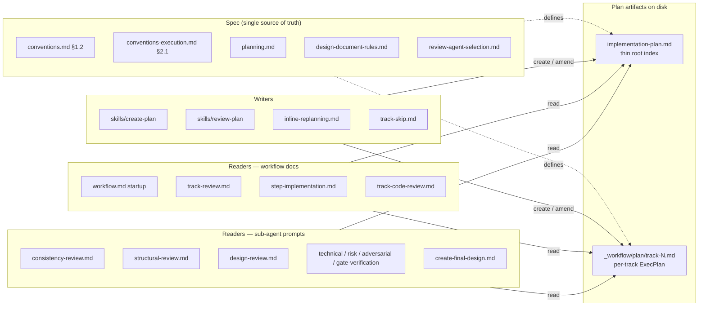

# YTDB-817 — New per-track file format (Move 4) — Architecture Decision Record

## Summary

This change replaces the legacy five-section per-track working-file shape (`_workflow/tracks/track-N.md` with `## Description` / `## Progress` / `## Reviews completed` / `## Base commit` / `## Steps`) with a fourteen-section ExecPlan template adopted from OpenAI's PLANS.md cookbook (twelve OpenAI sections verbatim plus two workflow-specific siblings, `## Episodes` and `## Base commit`). The directory `_workflow/tracks/` becomes `_workflow/plan/`; the prose term "step file" becomes "track file" in every workflow doc, sub-agent prompt, agent prompt, and skill file. The plan also extends `review-agent-selection.md` so Phase B and Phase C dimensional reviews dispatch six workflow-review agents on workflow-machinery diffs (and skip the four Java-focused baseline agents when the diff is workflow-only). Three reserved slots inside the new per-track template — under `## Purpose / Big Picture`, `## Decision Log`, and `## Validation and Acceptance` — wait for sibling Moves (YTDB-815, YTDB-814, YTDB-816) to land their content additions. The change applies only to plans created after this lands; in-flight branches keep their existing layout.

## Goals

- Replace the monolithic per-track file with a directory-of-tracks shape so a fresh `/execute-tracks` session reads a thin root index plus the one per-track file it needs, instead of the whole plan.
- Give a human reviewer one file that holds a track's full picture (purpose, scope, decisions, acceptance, progress).
- Achieve restart-from-cold: any new session can resume a track from `plan/track-N.md` alone, without reconstructing context from elsewhere.
- Make this the structural anchor for the rest of epic YTDB-813 — sibling Moves 1, 2, 3 land per-track after this Move defines what a track is as a file.
- Ship without disrupting in-flight branches whose workflow state still lives under `_workflow/tracks/` in the legacy shape.

All five goals landed as planned. The fourteen-section template (`conventions-execution.md` §2.1) is the canonical reference; per-track files under `_workflow/plan/` carry the restart-from-cold continuous-log content (Progress / Surprises & Discoveries / Decision Log / Outcomes & Retrospective / Episodes) at the top of the file; in-flight branches operate under their own snapshot of the workflow docs untouched.

## Constraints

- **In-flight branches keep their current format.** Branches with active workflow state under `_workflow/tracks/` (rollback-log, pinless-disk-cache, read-cache-concurrency-bug, si-links-consistency, ytdb-614-property-map, …) are not migrated. The new shape applies only to plans created after this lands.
- **This branch self-migrates atomically with the spec change.** This branch's `_workflow/tracks/` directory and `track-1.md`…`track-4.md` files share the same commit history as the workflow they modify, so the "in-flight branches keep their current format" rule cannot apply here. One atomic commit performed the `git mv` of this branch's `_workflow/tracks/` → `_workflow/plan/`, the five-section → fourteen-section shape migration of each track file (back-filling already-written episode content from `## Steps` blockquotes to `## Episodes` blocks), and the episode-writer rewire in `step-implementation.md` sub-step 7 + `episode-format-reference.md` + adjacent Progress writers.
- **No automated migration tooling.** Out of scope.
- **No substance changes to Phase A/B/C decision semantics.** Phase model, gate semantics, review iteration limits, risk-tag rules, and the resume protocol all stay identical. The write-side episode discipline gains a mandatory `[ctx=<level>]` field on `## Progress` entries and `## Episodes` block headers (a forcing function for context-window monitoring), and the writer-side multi-section write per the Episodes-separation rule — these are write-format changes that change what gets recorded at each Progress / Episode write, but they do not change which writes happen or when. Decision semantics are unchanged.
- **Sibling Moves' slots are pre-allocated, not pre-filled.** The new template reserves the ADDED/MODIFIED/REMOVED slot (Move 2) and the EARS/Gherkin acceptance slot (Move 3) and the per-track inlined Decision Records slot (Move 1); leaving them empty as HTML-comment placeholders is fine — Moves 1–3 will populate them.
- **No new test infrastructure.** Workflow-machinery change. Validation is a manual `/create-plan` smoke test against a synthetic sentinel directory plus a two-pattern grep verification.

## Architecture Notes

### Component Map

- **`conventions.md` §1.2, `conventions-execution.md` §2.1, `planning.md`, `design-document-rules.md`** — single source of truth for the directory layout, per-track template, lifecycle table, and per-section budgets. Every reader and writer resolves to these.
- **`review-agent-selection.md`** — single source of truth for Phase B/C dimensional-review agent dispatch. Carries the workflow-review tier, per-agent file-pattern triggers, and the baseline-skip override for workflow-only diffs. A durable audit-anchor at the bottom of the file pins the mirror with `.claude/skills/code-review/SKILL.md` so future drift sweeps show up as a single-line `git blame`.
- **`_workflow/plan/track-N.md`** — per-track ExecPlan adopting OpenAI's twelve-section template plus `## Episodes` and `## Base commit`. Restart-from-cold readable: a fresh session reading only this file can resume.
- **`implementation-plan.md` (root)** — thin checklist index. Carries Goals / Constraints / Architecture Notes plus one line per track (intro + Scope + Depends-on + link to track file). Move 2 will later add the ADDED/MODIFIED/REMOVED triad per track.
- **Writers** (`/create-plan`, `/review-plan`, `inline-replanning.md`, `track-skip.md`) — every code path that creates or amends the root or a per-track file. Templates target the new shape; the embedded fourteen-section template body in `create-plan/SKILL.md` is the durable copy (the working `design.md` under `_workflow/` is removed by the Phase 4 cleanup commit).
- **Readers** (`workflow.md` startup, Phase A/B/C docs, sub-agent prompts) — every doc that names a section heading or the `tracks/` path. Mechanical updates; legacy section names retired as their content folded into new sections.

### Decision Records

#### D1 — One file per track, not a directory per track

- **Alternatives considered**: a directory per track (`_workflow/plan/track-1/` containing `plan.md`, artifact subfiles); keep the legacy flat layout.
- **Rationale**: the twelve-section ExecPlan template fits comfortably in one Markdown file. A per-track directory would add navigation friction without an immediate artifact need — there are no binary artifacts or large companion files per track today. If a future use case needs per-track artifacts, a single track can graduate to a directory without re-shaping the whole format.
- **Risks / Caveats**: if Move 3's EARS/Gherkin lines plus Move 1's inlined Decision Records bloat individual track files past the structural-review caps, the decision may need revisiting. Mitigation: per-section budgets already exist and structural review enforces them.
- **Outcome**: implemented as planned. All four tracks on this branch fit comfortably in one Markdown file each; the longest is ~190 lines including continuous-log episode content.
- **Full design**: `design-final.md` §"New per-track file shape".

#### D2 — Root `implementation-plan.md` is a thin index, not a thirteenth ExecPlan

- **Alternatives considered**: apply the twelve-section template to the root file too (every plan is a recursive ExecPlan); keep the root shape unchanged.
- **Rationale**: the root carries cross-track context (Goals, Constraints, Architecture Notes top-level Component Map, top-level Decision Records that span tracks) plus a checklist. OpenAI's PLANS.md is one ExecPlan per feature; this design stacks N per-track ExecPlans under one umbrella. Forcing the umbrella into ExecPlan shape would duplicate sections (Purpose, Progress) that already live per-track.
- **Risks / Caveats**: root and per-track files use different shapes, so the reader must know which one they are looking at. Mitigated by file location (root is always `implementation-plan.md`; tracks are always `plan/track-N.md`) and by per-track files starting with `# Track N: <title>`.
- **Outcome**: implemented as planned. The root file kept its existing shape with only per-track checklist entries rewritten to point at `plan/track-N.md`.
- **Full design**: `design-final.md` §"Root index — `implementation-plan.md`".

#### D3 — Section order is OpenAI's verbatim — continuous-log sections near the top

- **Alternatives considered**: reorder to put plan-at-start sections (Purpose / Context / Plan of Work / Concrete Steps) first, then continuous-log (Progress / Surprises / Decision Log) at the bottom — closer to the legacy reading order.
- **Rationale**: OpenAI puts Progress / Surprises / Decision Log / Outcomes right after Purpose so a resume reader sees current state before static plan. This design adopts the same — restart-from-cold is the goal that distinguishes ExecPlan from a static plan.
- **Risks / Caveats**: humans coming from the legacy shape will initially expect Steps near the top. Mitigated by leaving `## Concrete Steps` at section #8 (matching OpenAI) and surfacing the section ordering in the design doc.
- **Outcome**: implemented as planned.
- **Full design**: `design-final.md` §"Continuous-log discipline" (subsection *Why continuous-log sections come first*).

#### D4 — Adopt all twelve section names verbatim; retain `## Base commit`; fold `## Reviews completed` into `## Outcomes & Retrospective`

- **Alternatives considered**: keep existing names (`## Description`, `## Steps`, `## Reviews completed`) to minimize rewire blast radius; rename everything to ExecPlan names including `## Base commit`; keep `## Reviews completed` as its own section in the new shape.
- **Rationale**: section-name fidelity to OpenAI makes the format recognizable to anyone who has read the cookbook. The rewire is mechanical (~85 references across ~30 files for the directory rename; ~348 references across ~44 files for the terminology rename). `## Base commit` does not map to any of the twelve slots cleanly — it is workflow housekeeping (Phase B writes; Phase C reads). Keeping it as a separate sibling avoids forcing a parse-tree change on every workflow reader. `## Reviews completed` is genuinely a continuous log of review outcomes per phase, so it folds naturally into `## Outcomes & Retrospective` with each entry timestamped. `## Episodes` is similarly a workflow-specific addition alongside `## Base commit` — added on top of OpenAI's twelve rather than overloading one of them with per-step episode content.
- **Risks / Caveats**: every reader that today greps for `## Description` or `## Reviews completed` needs the new section name. The reader-side sweep had to catch them all.
- **Outcome**: implemented as planned. End-of-execution grep verification (heading-form patterns `^## Description$`, `^## Reviews completed$`, `^## Steps$`, `tracks/track-N`; prose-form patterns ` `## Description` `, ` `## Reviews completed` `, ` `**What/How/Constraints/Interactions**` `, ` `**Risk:**` `) returned zero matches outside the explicit allow-list of intentional retired-section explanations and one fenced example block.
- **Full design**: `design-final.md` §"Section mapping — old shape to new".

#### D5 — Continuous-log sections live at track-file level; per-step episodes live in their own dedicated section

- **Alternatives considered**: keep all discoveries inside per-step episodes only; duplicate every discovery in both a per-step episode and the track-level Surprises section; keep the per-step episode wedged inside each Concrete Steps item (legacy shape).
- **Rationale**: OpenAI's restart-from-cold invariant requires Surprises / Decision Log to be readable from the top of the file without scanning every step. Per-step episodes belong in a dedicated continuous-log section (one block per step, identified by step number + commit SHA) — that cleanly separates the plan-at-start (Concrete Steps roster, immutable after Phase A) from the continuous-log (per-step blocks, written one per Phase B commit). Cross-cutting discoveries promote to `## Surprises & Discoveries` from the orchestrator's sub-step 7 episode write. The Decision Log captures execution-time decisions that the legacy shape scattered across step blockquotes.
- **Risks / Caveats**: episode lands in up to four sections (Progress timestamp + per-step block + optional Surprises promotion + optional Decision Log entry) instead of one blockquote. Drift risk if a writer forgets a section.
- **Outcome**: implemented as planned. The orchestrator's sub-step 7 follows a deterministic write checklist (one statusline read + always-write Episodes + always-write Progress + conditional Surprises + conditional Decision Log).
- **Full design**: `design-final.md` §"Continuous-log discipline" and §"Step episode storage".

#### D6 — Reserve pre-allocated slots for sibling Moves 1, 2, 3

- **Alternatives considered**: leave this Move silent on the other Moves' content; merge the Moves into one larger change.
- **Rationale**: Moves 1–3 are content additions, not structural changes. Reserving slots lets each Move land as a pure content addition with no structural rewire of the new format. Specifically: `## Purpose / Big Picture` opens with a one-line BLUF; the line immediately below it carries the ADDED/MODIFIED/REMOVED triad (Move 2). `## Decision Log` is the inlined-per-track Decision Records home (Move 1). `## Validation and Acceptance` is the EARS/Gherkin acceptance line location (Move 3).
- **Risks / Caveats**: slots are empty until Moves 1–3 land. The `/create-plan` template seeds them with HTML-comment placeholders so a structural review does not treat the empty section as a defect.
- **Outcome**: implemented as planned. The exemption mechanism in `structural-review.md` covers both these slots and the Phase A placeholders.
- **Full design**: `design-final.md` §"Slot reservation for Moves 1, 2, 3".

#### D7 — Rename `_workflow/tracks/` to `_workflow/plan/` and "step file" to "track file"

- **Alternatives considered**: keep the `tracks/` directory name and the "step file" term unchanged; rename the directory but keep "step file" as the prose term; rename the term but keep the directory; rename both.
- **Rationale**: YTDB-817 names `/plan/<track>/` and the sibling Moves anchor on the new name. Paired with the directory rename, the prose term "step file" → "track file" aligns the vocabulary with the file basename (`track-N.md`), the design class name (`TrackFile`), and the new directory name (`plan/`). The "step file" term dated from when each step's inline blockquote carried most of the per-track content; with the new fourteen-section shape, steps are roster entries inside `## Concrete Steps`, not files. Treating both as one rename concept (file path + prose vocabulary) landed them in the same rename pass commit pair and gave reviewers a single audit trail. Each rename is mechanical: directory rename was 115 line edits across 34 files; term rename was 348 line edits across 44 files.
- **Risks / Caveats**: a single missed reference would silently break `/create-plan` or `/execute-tracks` on the next plan, or leave a confusing mixed-vocabulary doc. Mitigated by grep verification at end of each rename commit and at the end of the reader-pass.
- **Outcome**: implemented as planned. Two adjacent commits (directory rename `5f55a18fa1`; terminology rename `5548a88356`) plus a small follow-up commit `03afffa669` for five placeholder-variant references that the literal-token regex missed.
- **Full design**: `design-final.md` §"Directory and terminology rename mechanics".

#### D8 — Phase B/C dimensional review must dispatch workflow-review agents on workflow-machinery diffs

- **Alternatives considered**: leave Phase B/C selection unchanged and rely on the `/code-review` standalone skill for ad-hoc workflow review; add the workflow-review agents to Phase B/C's baseline (always-on); fold a generic "workflow concerns" check into the existing `review-code-quality` agent.
- **Rationale**: `.claude/workflow/review-agent-selection.md` previously selected only Java-focused agents. A workflow-only diff (markdown / shell / JSON) gives them nothing to review; their findings are vacuous and they may falsely flag absence of tests, missing docstrings, etc. The six workflow-review agents (`review-workflow-consistency`, `review-workflow-prompt-design`, `review-workflow-instruction-completeness`, `review-workflow-hook-safety`, `review-workflow-context-budget`, `review-workflow-writing-style`) already existed with the right rubrics; the `/code-review` skill's triage already routed them on workflow-machinery files. Phase B/C had to agree with that routing so the in-workflow review path and the standalone path dispatch the same agents on the same diff. Adding them as a conditional group (rather than baseline) preserves correctness for Java-only diffs.
- **Risks / Caveats**: finding-prefix collisions if `W*` overlaps existing prefixes (verified non-colliding). Possibly noisy `review-workflow-writing-style` findings on plan / design markdown updates.
- **Outcome**: implemented as planned. The new tier with file-pattern triggers, the three-case baseline-skip override (workflow-only / docs-only + workflow-machinery / mixed-with-Java with `IN_SCOPE_FILES` filtering), and a durable audit-anchor maintenance contract landed in `review-agent-selection.md`. Every Phase C run on this branch dispatched the workflow-review agents via case 1 of the override and confirmed the rule empirically.
- **Full design**: `design-final.md` §"Phase B/C dimensional review triage update".

#### D9 — Per-step episode is one block in a dedicated section, not a blockquote inside the Concrete Steps item

- **Alternatives considered**: keep the legacy coupling (each Concrete Steps item carries its episode inline as a blockquote); split the episode across multiple targeted sections (What-was-done only in one section, What-was-discovered only in Surprises) without a per-step block; keep Concrete Steps items as the episode home and add a separate section only for cross-step artifacts.
- **Rationale**: Concrete Steps is the plan-at-start (Phase A decomposition produces it, then it is immutable). Per-step episodes are continuous-log (one new write per Phase B commit). Wedging continuous-log content into a plan-at-start section made the orchestrator's read/write paths ugly: episode-write would have to modify an existing item rather than append a new entry; resume-readers and Phase 4 aggregators would have had to parse nested blockquotes. Splitting them gives one section per semantic — Concrete Steps for "what we're going to do" (roster + risk tag, with `[x]`/`[!]`/`[ ]` status preserved on the roster line), `## Episodes` for "what each step actually did" (one block per step, joined by step number + commit SHA).
- **Risks / Caveats**: visual co-location of plan and outcome is lost — readers who want to see "what was the step supposed to do, and what actually happened" must look at two sections. Mitigated by joining on step number (every Episodes block titled `### Step N — commit <SHA>, <ISO>`) so the visual lookup is mechanical, and by ordering Episodes immediately after Concrete Steps so the two are physically adjacent.
- **Outcome**: implemented as planned. The section-join pattern emerged with one practical refinement during adversarial review of the reader pass: **the join key is step number primary, commit SHA disambiguates**. Step numbers stay unique within a track file (retries get monotonically-increasing numbers per `step-implementation-recovery.md`), so step-number matching suffices in steady state; the SHA cross-check is a tiebreaker against any future reshape where step-number-primary alone would be insufficient.
- **Full design**: `design-final.md` §"Step episode storage".

#### D10 — Plan-at-start sections split into Phase 1 track-level tier and Phase A step-aware tier

- **Alternatives considered**: treat every plan-at-start section as `/create-plan`'s responsibility at Phase 1 (would force `## Idempotence and Recovery` and step-referencing prose to invent fictional step structure before decomposition); move Idempotence and Recovery to a per-step roster annotation under `## Concrete Steps` (would fight OpenAI's section template and scatter the concern); drop `## Idempotence and Recovery` entirely (would lose a useful Phase A forcing function for retry / rollback thinking).
- **Rationale**: `## Idempotence and Recovery` is defined as naming specific steps and per-step recovery paths — content that cannot exist before Phase A decomposes the track into a step roster. The step-referencing parts of `## Plan of Work` and the per-step EARS/Gherkin lines in `## Validation and Acceptance` (which Move 3 will populate) share the same constraint. The workflow's "details at latest possible point" principle was already codified for step decomposition (Concrete Steps is Phase A's output, not Phase 1's); extending the same principle to other step-aware sections keeps Phase 1 producing a well-formed track file from track-level understanding alone and defers step-aware content to Phase A.
- **Risks / Caveats**: `/create-plan` template writes placeholder bodies (`<!-- Populated at Phase A ... -->`) in `## Idempotence and Recovery` and `## Concrete Steps`. `structural-review.md` had to treat a heading followed by a placeholder-only comment as a non-defect — same exemption shape that D6 introduced for sibling-Move reserved slots, just extended to cover Phase A placeholders too.
- **Outcome**: implemented as planned. Two placeholder kinds coexist on a Phase-1-written track file (sibling-Move + Phase A); structural review's exemption covers both.
- **Full design**: `design-final.md` §"Core Concepts" and §"Lifecycle table".

#### D11 — Add `## Episodes` as a separate section for per-step blocks; keep `## Artifacts and Notes` for cross-step content only

- **Alternatives considered**: keep the original design (`## Artifacts and Notes` holds both per-step episode blocks and cross-step artifacts — an overloaded section name where the dominant content doesn't match the section name); rename `## Artifacts and Notes` to `## Episodes` and find a different home for cross-step artifacts (loses cookbook fidelity on a section that doesn't need to be touched, and cross-step artifacts have no natural alternative home); internal subsection split inside `## Artifacts and Notes` (`### Per-step episodes` + `### Cross-step artifacts`; section list honored verbatim but the split is visible only after entering the section, hurting discoverability).
- **Rationale**: per-step episodes are the dominant content of what would have been `## Artifacts and Notes`; naming a section for its dominant content matches the rest of the design (Progress / Decision Log / Outcomes are all named for their content). Cross-step artifacts (the rare use) retain their OpenAI-intended home in `## Artifacts and Notes`. D4 already permits workflow-specific section additions on top of OpenAI's twelve — `## Base commit` is the precedent; adding `## Episodes` follows the same pattern. Discoverability wins both for fresh human readers (the section name reveals its content from the table of contents) and for sub-agents (their prompts can name the section explicitly rather than referencing a sub-section inside an overloaded parent).
- **Risks / Caveats**: section count in the per-track file grows from thirteen (twelve ExecPlan + `## Base commit`) to fourteen (+ `## Episodes`). Section ordering decision: `## Episodes` lands between `## Concrete Steps` and `## Validation and Acceptance` to keep roster + result physically adjacent — a deviation from the "continuous-log at top" rule (Episodes IS continuous-log, but the reader-flow benefit of co-location with Concrete Steps outweighs the consistency cost).
- **Outcome**: implemented as planned. Sub-step 7's canonical episode-write target is `## Episodes`; the four-section checklist (always-write Episodes + always-write Progress + conditional Surprises + conditional Decision Log) anchors here.
- **Full design**: `design-final.md` §"Step episode storage" and §"New per-track file shape".

#### D12 — Mandatory `[ctx=<level>]` field on every Progress entry and Episodes block

- **Alternatives considered**: keep `Context: <level>` as an optional named field inside Episodes only (pre-D12 status quo); add the field to all five continuous-log sections including the conditional ones (Surprises, Decision Log, Outcomes); attach it to the Concrete Steps roster line instead of Progress; rely on a post-factum audit at the cumulative track-diff review or structural review to verify presence after the fact.
- **Rationale**: a periodic forcing function for context-window monitoring is more reliable than gate-at-phase-boundary alone. Making the field mandatory on every Progress entry and every Episodes block header forces the orchestrator to read `/tmp/claude-code-context-usage-$PPID.txt` at every write, so a transition from `safe` to `warning` is observed at the very next continuous-log write rather than at the next explicit gate. Progress is the highest-cadence continuous-log section (per phase event + per step + per review iteration); Episodes is per step; together they give one `ctx` read per step and per review iteration. Conditional sections (Surprises, Decision Log) add no periodicity benefit since they fire only on cross-cutting findings or execution-time decisions. The field reflects the orchestrator's window at write time, not the implementer sub-agent's — the orchestrator is the long-lived session the existing handoff gates care about. Writing `[ctx=warning]` or `[ctx=critical]` is not a passive audit-log entry — it triggers the existing mid-phase-handoff protocol and the inline gates already codified in `workflow.md` § Context Consumption Check.
- **Risks / Caveats**: enforcement is **write-time only**. The canonical sub-step 7 order — and the same order in every other Progress writer — reads the statusline file before the Progress / Episodes writes, so the field is present by construction. A post-factum audit at the cumulative track review or structural review was considered and rejected: back-filling the field after a missed write would be fiction (the actual `ctx` at write time is unrecoverable), and the forcing-function failure (warning gate skipped) would have already paid its cost by the time the audit fired. Fallback when the statusline file is missing (right after `/clear`, race conditions): `[ctx=unknown]`. Per-section budget impact ~12 chars per Progress entry — negligible.
- **Outcome**: implemented as planned. The atomic shape switch back-filled migrated episodes with `[ctx=unknown]` where the recorded level at original write time was unrecoverable; every Progress write and Episodes block header after the switch carries a real `[ctx=<level>]` value.
- **Full design**: `design-final.md` §"Continuous-log discipline" subsection *Mandatory `[ctx=<level>]` field*.

#### D13 — Atomic shape switch: writer rewire + directory rename + shape migration land in one commit

- **Alternatives considered**: split path / shape / writer changes across separate commits with this branch's own files migrated in a later commit; dual-shape tooling during a transition window (reader fallbacks for both shapes); freeze the workflow snapshot for the whole branch and apply every spec change in one closing commit at end-of-execution; writer-rewire-first (land the writer rewire as its own commit before the directory rename + shape migration).
- **Rationale**: every commit on this branch must leave the workflow tooling under `.claude/workflow/` consistent with the on-disk track files under `_workflow/`, because the same orchestrator executing the plan is the consumer of both. Splitting the path / shape / writer changes across multiple commits leaves at least one intermediate commit where Phase C of a just-completed track reads workflow docs naming section headings the on-disk file does not have, or where sub-step 7 writes the episode to a section the renamed file no longer carries. Dual-shape tooling violates the plan's "no transitional mechanism" stance. Freezing the snapshot for the whole branch defers every spec change to one giant terminal commit, losing the per-track review boundaries. The writer-rewire-first variant looked attractive because no session ever reads a file in an inconsistent state during the same session that wrote it, but it fails because every commit boundary is a potential resume point: a `/clear` between the writer-rewire commit and the shape-migration commit would have left the next `/execute-tracks` invocation reading new sub-step 7 logic against old-shape on-disk files. The pragmatic fix was the atomic-switch step: one commit rolls (i) the writer rewrite, (ii) the on-disk directory rename of this branch's own `_workflow/tracks/`, (iii) the shape migration of each on-disk track file with `[ctx=unknown]` back-fill, and (iv) the path-reference cleanup in `implementation-plan.md`.
- **Risks / Caveats**: the atomic step is large (multi-file writer edit + four track-file shape migrations + one `git mv` + one path-ref cleanup); the Phase A risk-tag heuristic should mark it `high`, which triggers full dimensional review at Phase B. The step's own episode-write target is the very section structure it just created — the orchestrator session running this step must end immediately after the commit and let the next phase start a fresh session.
- **Outcome**: implemented as planned. The atomic step landed in commit `9ed9ae421a` plus a follow-up `Review fix:` commit `6fdc2f6dc3` that applied eleven dimensional-review findings (five blockers + six should-fixes). The `high` risk-tag correctly triggered Phase B's full dimensional review, which caught the eleven findings before the session ended. Post-commit guards both passed: `test -d _workflow/tracks` returned empty; each migrated track file carried exactly fourteen `## ` headings. The episode-write contingency (write directly in the new shape, end the session immediately) worked: the next phase started a fresh session that read the new docs and the new on-disk shape with no inconsistency.
- **Full design**: `design-final.md` §"Self-modification handling".

### Invariants and Contracts

- **Restart-from-cold:** a session reading only `_workflow/plan/track-N.md` can determine current phase, what is next, all cross-cutting discoveries, and all execution-time decisions. Achieved via the continuous-log discipline (Progress / Surprises & Discoveries / Decision Log / Outcomes & Retrospective / Episodes) plus the Phase 1 track-level sections being self-sufficient.
- **Section-name consistency:** every workflow-doc reference to a track-file section heading names a heading that `/create-plan` actually writes. Enforced via the two-pattern grep verification at the end of the reader pass plus the smoke chain.
- **Terminology consistency:** no workflow doc, sub-agent prompt, agent prompt, skill file, or workflow script under `.claude/workflow/`, `.claude/skills/`, `.claude/agents/`, or `.claude/scripts/` references the legacy "step file" / "step-file" / `_workflow/tracks/` / `tracks/track-N.md` / `--tracks-dir` / `tracks_dir` terms. Enforced via grep verification at the end of each rename commit and the cumulative reader-pass verification. The four sweep subtrees match the verification regex scope.
- **Phase B/C agent dispatch on workflow-machinery diffs:** Phase B (`risk: high` step-level) and Phase C (track-level) dimensional reviews dispatch the six workflow-review agents on workflow-machinery files and skip the four Java-focused baseline agents when the diff is workflow-only. Exercised empirically on every Phase C run during this plan's execution.
- **No regression for in-flight branches:** branches with active `_workflow/tracks/` state continue to work under their legacy format. Enforced at the spec level by the no-retroactive-migration rule; the `review-agent-selection.md` edits are additive so in-flight branches' Phase C reviews on Java code keep dispatching the same agents.
- **Mandatory `[ctx=<level>]` field on continuous-log writes:** every entry in `## Progress` and every block header in `## Episodes` carries `[ctx=<level>]` where `<level>` ∈ {safe, info, warning, critical, unknown}. Enforced by write-time discipline (statusline-read-then-write order in every Progress writer); no post-factum audit because a missing field is unrecoverable.
- **Section name + DR cross-reference stability:** Section renames or removals propagate to every `**Full design**` reference in the plan and in every track file under `plan/` in the same commit; the `edit-design` skill's mechanical checks verify this when the design is mutated.

### Integration Points

- **`/create-plan` SKILL.md** writes the new per-track shape and the new root index shape. The directory bootstrap targets `plan/` instead of `tracks/`.
- **`/execute-tracks` startup protocol** (`workflow.md` § Startup Protocol) reads the new root + per-track files; the State C resume protocol reads the four Phase 1 `- [ ]` phase checkpoints in `## Progress` to determine the next phase.
- **`/review-plan`** routes through the consistency + structural review prompts; those prompts now read the new shape via the four Phase 1 track-level sections.
- **Inline replanning** (`inline-replanning.md`) writes the new per-track shape in case 1 (new track) and references the new section names in cases 2–6 (amend / mid-execution / scope-down / step-shift / abort).
- **Track-skip** (`track-skip.md`) names the `_workflow/plan/` path for the terminal track-file delete and references the new section names in its retention rule.
- **Phase 4** (`create-final-design.md`) aggregates per-track content from `_workflow/plan/track-N.md` across `## Purpose / Big Picture`, `## Concrete Steps`, `## Episodes`, and `## Outcomes & Retrospective`.

### Non-Goals

- Retroactive split or migration of existing ADR plans.
- Implementing Moves 1, 2, 3 themselves — separate sibling issues (YTDB-814, YTDB-815, YTDB-816).
- Changing Phase A/B/C **decision semantics** — gate semantics, review iteration limits, risk-tag rules, and the resume protocol are unchanged. Write-side episode discipline changes per D9 / D11 / D12 are not decision-semantics changes — they alter what gets recorded at each Progress / Episode write, not when writes happen or which phase transitions / gate verdicts they drive.
- Adding automated workflow tests; validation is the manual `/create-plan` smoke test plus grep verification.
- Tooling to detect format drift on existing branches.

## Key Discoveries

- **C&O-as-current-state idiom.** During the reader-pass sub-agent-prompt sweep, the `consistency-review.md` intent-axis pre-screen had to split a `[ ]` track's sections into intent / target-state vs. current-state. The natural carve-out: `## Context and Orientation` carries the current-state framing, not the intent / target-state framing. Pre-Flight clarifications (user-supplied current-state notes) also belong under `## Context and Orientation` for the same reason, not under `## Decision Log` (where the legacy mapping initially placed them). This idiom recurs in `track-review.md`, `implementer-rules.md`, and `review-mode.md` and is now load-bearing across the reader half of the workflow.

- **Forward-looking-rewrite precedent.** Across the writer-SKILL sweep (`inline-replanning.md` cases 2–6 and `create-plan/SKILL.md`'s template body) and the reader-pass (`step-implementation.md` / `track-code-review.md`), several prose sites carried legacy-shape historical framing in surrounding prose ("Folds in the legacy `**What**:` / `**How**:` subsections…"). The implementer judgement was to strip these in favour of forward-looking prose that reads cleanly against the new vocabulary — readers six months from now do not need the migration history. This decision is consistent with the workflow's "the plan's an aspirational target" stance and propagates to any future structural change that adds prose bridge phrases during the migration commit.

- **Smoke-chain grep + human-eye as a non-redundant verification idiom.** The writer+reader smoke chain (`/create-plan` against a sentinel directory, then section-presence audit against every Phase 2 prompt's expected section list) caught three load-bearing prose mentions that the per-step Phase B sweeps could not reach (`skills/execute-tracks/SKILL.md`, `workflow/workflow.md`, `prompts/create-final-design.md`). Pattern: coordinated multi-file rename sweeps cannot reach reader-side description prose that pre-dates the new vocabulary and sits in load-bearing prose rather than in canonical writer/reader templates. The fix-up commit `40c77ae3ff` cleared all three sites. Worth preserving the grep + human-eye backstop as a recurring verification idiom on any future cross-file rename + section-split work.

- **Fix-iteration pattern across rename + section-split work.** A recurring two-commit shape emerged: a primary commit lands the in-scope rename or section-split, then a small follow-up commit absorbs the cross-file drift surfaced by end-of-step verification. Four commits on this branch share this shape — the directory + terminology rename pass with `03afffa669` follow-up, the `conventions-execution.md` §2.1 rewrite with `86970accd3` follow-up, the atomic shape switch with the dimensional-review fix `6fdc2f6dc3`, and the reader-pass sub-agent-prompt sweep with review-fix `ba37514f86`. End-of-step verification (grep, structural assertions, dimensional review) does the catching, not the implementer pass.

- **Writer-side completeness gaps that survive Phase B sweeps.** Two writer-side completeness gaps were caught only by Phase C dimensional review on the cumulative diff: (1) `step-implementation.md` sub-step 7's `match result.RESULT` was missing the `RESULT_MISSING` handler that Phase C already had; (2) the sub-step 7 multi-section write had no resume reconciliation between the roster `[x]` flip and the Progress append (the four-section writer could be interrupted between the two). Both were applied with option-(a) "roster `[x]` is primary marker; resume derives missing Progress entries from Episodes" pattern consistent with existing recovery semantics. Phase B's per-step focus naturally narrows attention; Phase C's cumulative-diff focus catches drift the per-step sweep cannot see.

- **Three-source-of-truth lock-step.** After the `conventions-execution.md` §2.1 rewrite landed, end-of-step verification surfaced that `conventions.md` §1.2 had drifted out of sync with `design.md` §"New per-track file shape" (section enumeration named `## Risks and Mitigations` as one of OpenAI's twelve, and grouped `## Artifacts and Notes` under workflow-specific). Reconciled in follow-up `86970accd3`. Operational rule for future shape changes: `conventions-execution.md` §2.1, `design.md` §"New per-track file shape", and `planning.md` §Track descriptions form a three-source-of-truth set; any change to the per-track shape must update all three in one commit.

- **Audit-anchor as a maintenance contract.** The four-item side-by-side sync check between `review-agent-selection.md` and `.claude/skills/code-review/SKILL.md` produced no diffs at execution time. To prevent silent future drift, a one-line durable audit anchor at the bottom of `review-agent-selection.md` records the sync date so any future `git blame` surfaces drift as a single-line change. The pattern generalises to any two-file mirror with no programmatic check: a dated audit anchor turns "do we still match?" into a one-second `git blame` lookup.

- **Verification-gate-step orchestration via durable audit anchors.** A verification-gate step that produces no code change on the happy path does not cleanly satisfy the implementer SUCCESS contract (which requires a non-empty `COMMIT`). The orchestrator-side resolution adopted on this branch was to mint a durable audit anchor (a dated one-line addition) so the step has a real commit and the audit trail is locally readable from `git blame` of the anchor line. Future verification-gate steps elsewhere in the workflow should adopt the same pattern.

- **Phase 1 `## Progress` seeded with four checkpoints.** During the writer-SKILL sweep, the `create-plan/SKILL.md` template was discovered to prepopulate `## Progress` with four `- [ ]` phase checkpoints (Review + decomposition / Step implementation / Track-level code review / Track completion). The State C resume protocol in `workflow.md` reads these as phase markers. An earlier draft of `inline-replanning.md` case 1 had claimed `## Progress` starts empty; the two writers had to be reconciled so a track authored via inline-replan carries the same checkpoints as one authored via `/create-plan`. The reconciliation propagated to the §2.1 *Section lifecycle* table's `## Progress` row.

- **Section-join key: step number primary, commit SHA disambiguates.** The cumulative-diff adversarial review of the reader-pass surfaced a contradiction between two earlier drafts of the section-join pattern. Resolution: step number primary, commit SHA disambiguates. Step numbers stay unique within a track file (retries get monotonically-increasing numbers per `step-implementation-recovery.md`), so step-number matching suffices in steady state; the SHA cross-check is a tiebreaker against any future reshape where step-number-primary alone would be insufficient.
