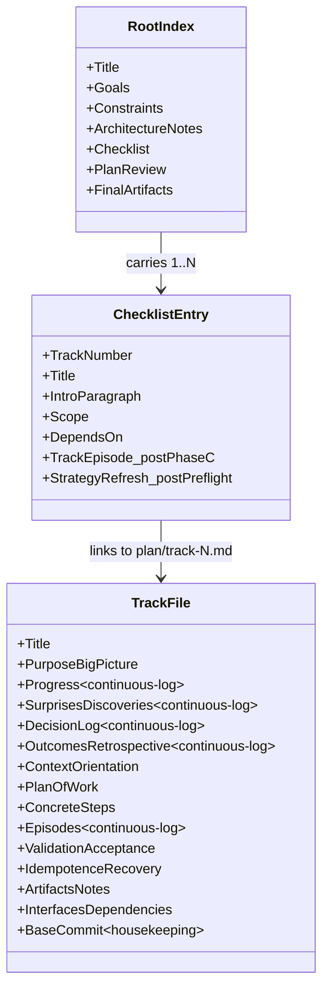
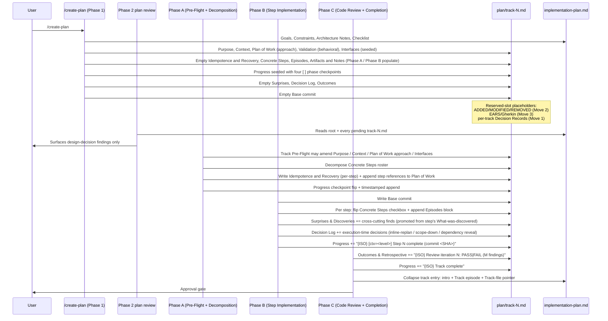

# YTDB-817 — New per-track file format (Move 4) — Final Design

## Overview

**Baseline.** Pre-change, `_workflow/tracks/track-N.md` carried each track's working state in five sections — `## Description`, `## Progress`, `## Reviews completed`, `## Base commit`, `## Steps` — with per-step continuous-log content wedged inside `## Steps` blockquotes. That shape predated the workflow's restart-from-cold requirement: a fresh session could not resume from one track file alone because current state was spread across several sections with no canonical "where am I now" header, and per-step episodes mixed plan-at-start fields with continuous-log fields inside one nested item.

**Change.** Track files now live at `_workflow/plan/track-N.md` under a 14-section ExecPlan template derived from OpenAI's PLANS.md cookbook. Twelve sections come straight from OpenAI verbatim, with the continuous-log group (`## Progress`, `## Surprises & Discoveries`, `## Decision Log`, `## Outcomes & Retrospective`) placed near the top so a resume reader sees current state before static plan. Two workflow-specific sections sit alongside the twelve: `## Episodes` holds per-step episode blocks, and `## Base commit` is retained for Phase B/C housekeeping.

**Enabling primitives.** Three structural shifts make the new shape work. Per-step episodes moved out of `## Steps` blockquotes into a dedicated `## Episodes` section with one block per completed step, separating the plan-at-start roster (`## Concrete Steps`) from the continuous-log episode record. The prose term "step file" became "track file" and the directory `_workflow/tracks/` became `_workflow/plan/`, aligning vocabulary with the new file shape. Sibling Moves 1, 2, 3 received pre-allocated reserved slots so Move 4 did not pre-empt their content.

**Restructured to fit.** The root `implementation-plan.md` remained a thin index, not a thirteenth ExecPlan — its readers are cross-track planners, not single-track resumers. Phase B/C dimensional review (`review-agent-selection.md`) gained a workflow-machinery triage so workflow-only diffs dispatch six workflow-review agents instead of the Java-focused baseline. Every sub-agent prompt that reads track files by section heading learned the new names. Plan-at-start sections split into a Phase 1 track-level tier (Purpose, Context, Plan of Work approach, Validation behavioral criteria, Interfaces) and a Phase A step-aware tier (Concrete Steps, Idempotence and Recovery, per-step refinements) — Phase 1 cannot write step-aware content because steps do not exist until Phase A decomposition.

**Audience and prerequisites.** This design assumes familiarity with the four-phase execution workflow defined in `.claude/workflow/workflow.md` (Phase 1 plan creation via `/create-plan`, Phase A pre-flight + decomposition, Phase B step implementation, Phase C track-level code review + completion) and with the sibling Moves under epic YTDB-813 (YTDB-814 inline decisions, YTDB-815 BLUF + ADDED/MODIFIED/REMOVED triad, YTDB-816 EARS/Gherkin acceptance criteria). Decision Record IDs (`D1` … `D13`) referenced in per-section footers are restated with full text in `adr.md`.

**Document structure.** The sections below cover the canonical per-track template and root-index shape (§"New per-track file shape", §"Root index — `implementation-plan.md`"), the section mapping from old to new (§"Section mapping — old shape to new"), the continuous-log and step-episode storage disciplines (§"Continuous-log discipline", §"Step episode storage"), slot reservation and rename mechanics (§"Slot reservation for Moves 1, 2, 3", §"Directory and terminology rename mechanics"), the lifecycle table mapping phase to writer (§"Lifecycle table"), the sub-agent prompt and dimensional-review changes that wire the new shape into existing workflow machinery (§"Sub-agent prompt updates", §"Phase B/C dimensional review triage update"), and the self-modification protocol that landed this branch's own working files atomically with the spec change (§"Self-modification handling").

## Core Concepts

- **ExecPlan section** — one of the twelve sections OpenAI's PLANS.md template defines. Section names are adopted verbatim.
- **Continuous-log section** — Progress, Surprises & Discoveries, Decision Log, Outcomes & Retrospective, **Episodes**. Updated as work proceeds; append-only with ISO 8601 timestamps, never edited in place. The first four sit at the top of the file so resume readers see current state first; Episodes sits adjacent to its plan-at-start partner (Concrete Steps) so roster + result are physically close.
- **Phase 1 track-level section** — Purpose / Big Picture, Context and Orientation, Plan of Work (approach prose only), Validation and Acceptance (behavioral criteria), Interfaces and Dependencies. Written by `/create-plan` at Phase 1 from track-level understanding; refined in Phase A Pre-Flight if scope or approach shifts during decomposition.
- **Phase A step-aware section** — Concrete Steps, Idempotence and Recovery, the step-referencing parts of Plan of Work, the per-step EARS/Gherkin lines in Validation and Acceptance (Move 3). Cannot be written at Phase 1 because they name or reference individual steps that do not exist until Phase A decomposition. Empty (placeholder comment) until Phase A.
- **Episodes section** — `## Episodes`. Workflow-specific section (not part of OpenAI's twelve) holding per-step episode blocks, one block per completed step, identified by step number plus commit SHA. Written by the Phase B orchestrator at sub-step 7 after the step's commit lands. Empty at Phase 1 and Phase A; populated by Phase B as work proceeds.
- **Housekeeping section** — `## Base commit`. Workflow-specific section (not part of OpenAI's twelve); read surgically (Phase B writes; Phase C reads). One line per session, not a continuous log.
- **Root index** — the umbrella file `implementation-plan.md` at the parent directory of `plan/`. Carries Goals, Constraints, Architecture Notes, and a thin per-track checklist. Distinct from per-track ExecPlans.
- **Reserved slot** — a section heading with an HTML-comment placeholder, present in the `/create-plan` template, awaiting content from a sibling Move (Move 1 / Move 2 / Move 3). The structural review treats `<!-- Reserved for Move N ... -->` as a non-defect.

## Class Design



The twelve ExecPlan sections in the TrackFile appear in OpenAI's order (continuous-log first, plan-at-start second). Two workflow-specific sections sit alongside: `Episodes` between `ConcreteSteps` and `ValidationAcceptance` (so roster + result are physically adjacent); `BaseCommit` last by convention. The `ChecklistEntry` in the root index gains `TrackEpisode` and `StrategyRefresh` after Phase C completion / next Track Pre-Flight respectively.

## Workflow

Phase-by-phase, who writes which section of the per-track file:



The Progress section is the primary signal a resume reader uses to determine current state. `/create-plan` seeds it with four pending `- [ ]` phase checkpoints (Review + decomposition / Step implementation / Track-level code review / Track completion); each phase flips its checkpoint and appends a timestamped entry. Phase B appends one entry per step; Phase C appends one entry per review iteration plus one on completion. Every entry carries an ISO 8601 timestamp and the mandatory `[ctx=<level>]` field reflecting the orchestrator's context-window state at write time.

Plan-at-start sections split between Phase 1 (track-level: Purpose, Context, Plan-of-Work approach, Validation behavioral criteria, Interfaces) and Phase A (step-aware: Concrete Steps roster, Idempotence and Recovery, per-step refinements to Plan of Work and Validation). Phase 1 cannot write step-aware sections because steps do not exist until Phase A decomposition. Episodes is purely Phase B's territory — empty until the first step commit lands.

## New per-track file shape

**TL;DR.** The verbatim Markdown template `/create-plan` writes at Phase 1 — heading list, reserved-slot placeholders, and inline annotations identifying which sections Phase A and Phase B populate. Defines the canonical shape every reader and writer expects.

The full template `/create-plan` writes at Phase 1:

````markdown
# Track N: <title>

## Purpose / Big Picture
<One-line BLUF stating the user-visible behavior gained after this track lands.>

<!-- Reserved for Move 2 — ADDED/MODIFIED/REMOVED triad. Empty until Move 2 lands. -->

<Intro paragraph from the plan checklist entry, restated here so the file
is self-sufficient — Phase B/C sub-agents that don't read the root plan
see it.>

## Progress
- [ ] Review + decomposition
- [ ] Step implementation
- [ ] Track-level code review
- [ ] Track completion

## Surprises & Discoveries
<!-- Continuous-log. Promoted by the orchestrator from per-step "What was
discovered" when the finding affects future steps or other tracks. Empty
at Phase 1. -->

## Decision Log
<!-- Continuous-log. Execution-time decisions: inline-replan choices,
scope-downs, dependency reveals, gate-override reasons. Move 1 (YTDB-814)
will also land per-track Decision Records here. -->

<!-- Reserved for Move 1 — per-track inlined Decision Records. -->

## Outcomes & Retrospective
<!-- Continuous-log. Review iteration outcomes (folds in the legacy
`## Reviews completed`) and the track-completion summary at Phase C. -->

## Context and Orientation
<What state the codebase is in at the start of this track. Files,
modules, non-obvious terminology. Folds in the "What" subsection from
the legacy `## Description`.>

## Plan of Work
<Prose sequence of edits and additions. Folds in the "How" subsection
from the legacy `## Description`. Ordering constraints, invariants to
preserve. References to the Concrete Steps section below. Phase 1
writes the approach prose; Phase A appends a per-step sequencing
summary that references the Concrete Steps roster.>

## Concrete Steps
<Decomposed step roster, written by Phase A — one numbered item per
step. Each item carries the step description, the `risk:` tag, and a
status checkbox (`[ ]` pending / `[x]` complete / `[!]` failed) that
Phase B flips after the step's commit lands. Per-step episodes do
NOT live here — they live in `## Episodes` below. The roster is
immutable after Phase A decomposition completes, except for the
status checkbox flip and the optional `commit:` annotation that
Phase B appends.>

1. <Step description> — `risk: low | medium | high`
2. <Step description> — `risk: high`
3. <Step description> — `risk: low`

## Episodes
<Per-step episode blocks — one block per completed step, identified by
step number + commit SHA. Written by the Phase B orchestrator at
sub-step 7 after the step's commit lands. Empty at Phase 1; Phase A
does not populate this section.>

### Step 1 — commit abc1234, 2026-05-15T15:10Z [ctx=safe]
**What was done:** ...

**What was discovered:** ... *(when applicable; if cross-cutting, also
promoted to `## Surprises & Discoveries` above with a back-reference
to this block)*

**What changed from the plan:** ... *(when applicable; names affected
future steps)*

**Key files:**
- `path/to/file.java` (modified)
- `path/to/new-file.java` (new)

**Critical context:** ... *(rare)*

### Step 2 — commit def5678, 2026-05-15T15:45Z [ctx=safe]
**What was done:** ...

## Validation and Acceptance
<Behavioral acceptance criteria.>

<!-- Reserved for Move 3 — EARS or Gherkin acceptance lines used verbatim
as test method names. Empty until Move 3 lands. -->

## Idempotence and Recovery
<!-- Populated at Phase A — names per-step idempotence and recovery paths once steps are decomposed. -->

## Artifacts and Notes
<Focused transcripts, snippets, and cross-step artifact references that
don't belong to one specific step. Per-step episode content lives in
`## Episodes` above. Typical contents: review-iteration logs that span
multiple steps, captured terminal output from cross-cutting debug
sessions, links to external dashboards or PR threads. Often empty.>

## Interfaces and Dependencies
<Library / function signatures relevant to this track. Folds in the
"Constraints" and "Interactions" subsections from the legacy
`## Description`: in-scope/out-of-scope file boundaries, inter-track
dependencies (which other tracks supply prerequisites; which downstream
tracks consume this one's output).>

## Base commit
<Workflow housekeeping — not part of the twelve-section template. Written
by Phase B at session start; read by Phase C for the cumulative track
diff.>
````

### Edge cases / Gotchas

- The `## Progress` section is seeded by `/create-plan` with four `- [ ]` phase checkpoints, not left empty. Inline-replanning (case 1, new-track replan) reproduces the same shape so the State C resume protocol can rely on the checkpoints regardless of which writer minted the file.
- The `## Episodes` block header carries `[ctx=<level>]` even for back-filled migrated episodes; the `unknown` fallback applies when the recorded level at original write time is unrecoverable.

### References
- Decisions: D1 (one file per track), D3 (section order verbatim for OpenAI's twelve), D4 (section names + workflow-specific additions), D5 (continuous-log first), D6 (reserved slots), D9 (per-step blocks), D10 (Phase 1 vs Phase A tier split), D11 (Episodes is a separate section).
- Related sections: §"Section mapping — old shape to new", §"Slot reservation for Moves 1, 2, 3", §"Continuous-log discipline", §"Step episode storage".

## Root index — `implementation-plan.md`

**TL;DR.** The umbrella `implementation-plan.md` keeps its overall shape but rewrites the per-track checklist entries to point at `plan/track-N.md` files and to host the post-Phase-C track episode. The root itself does not adopt the twelve-section ExecPlan shape — its readers are cross-track planners, not single-track resumers.

Section structure is unchanged from before the rename; only the per-track checklist entries change. New shape per pending entry:

```markdown
- [ ] Track N: <title>
  > <intro paragraph — 1-3 sentences>
  >
  > **Scope:** ~N steps covering X, Y, Z
  > **Depends on:** Track M (when applicable)
```

After collapse at Phase C completion, the entry becomes:

```markdown
- [x] Track N: <title>
  > <intro paragraph>
  >
  > **Track episode:**
  > <strategic summary>
  >
  > **Track file:** `plan/track-N.md` (M steps, P failed)
  > **Strategy refresh:** <CONTINUE | ADJUST — added by next Track Pre-Flight>
```

The collapse rules and Always-keep / Always-drop lists from `track-code-review.md` apply unchanged — only the **Track file:** label changes (was **Step file:**) and its path changes from `tracks/` to `plan/`. Both edits rode the same rename pass — see §"Directory and terminology rename mechanics". Move 2 will later add a one-line BLUF + ADDED/MODIFIED/REMOVED triad to the pending-entry intro; Move 4 left that slot for Move 2's writer changes.

### Distinct from per-track ExecPlan

The two files serve different readers:

- **Root index** answers "what is this whole plan about, which tracks exist, what depends on what?" Loaded at every `/execute-tracks` startup. Strategic, scannable, ~150–400 lines for most plans.
- **Per-track ExecPlan** answers "what is this one track doing, where is it now, what comes next?" Loaded only when a track enters Phase A, when Phase 2 reviews a pending track, or when an inline replan touches it. Self-contained for restart-from-cold.

Stacking N per-track ExecPlans under a root index is a small extension of OpenAI's "one PLANS.md per feature" model. The root index does not itself need the twelve-section ExecPlan shape, because its readers are not single-track-resumers — they are cross-track planners (the user, the autonomous plan review, Track Pre-Flight). The Architecture Notes / Component Map / Decision Records the root carries already serve that audience.

### References
- Decisions: D2 (root stays a thin index, not a thirteenth ExecPlan), D4 (section name fidelity), D7 (path + terminology rename — Track file label).
- Related sections: §"Directory and terminology rename mechanics", §"New per-track file shape".

## Section mapping — old shape to new

**TL;DR.** Per-section migration table from the old five-section track-file shape to the new twelve-section ExecPlan plus two workflow-specific siblings (`## Episodes`, `## Base commit`). One row per old subsection, naming the new section(s) that absorbed its content and the rationale where the split is non-trivial. Kept here as durable reference for readers of pre-migration branches or future Moves that revisit this territory.

| Old section (`tracks/track-N.md`) | New section (`plan/track-N.md`) | Notes |
|---|---|---|
| `## Description` intro paragraph | `## Purpose / Big Picture` | Direct mapping. Move 2 will add the ADDED/MODIFIED/REMOVED triad above the intro paragraph. |
| `## Description` `**What**:` subsection | `## Context and Orientation` (current state) + `## Plan of Work` (changes) | "What" split into "what is there today" versus "what we will change". |
| `## Description` `**How**:` subsection | `## Plan of Work` | Direct mapping. |
| `## Description` `**Constraints**:` subsection | `## Interfaces and Dependencies` (file-scope and contract boundaries) + `## Idempotence and Recovery` (rollback constraints) | Split between two new sections by content. |
| `## Description` `**Interactions**:` subsection | `## Interfaces and Dependencies` (inter-track dependencies) | Direct mapping. |
| `## Description` track-level Mermaid diagram | `## Context and Orientation` | Writer convention pins the diagram next to the codebase-state framing it accompanies. |
| `## Description` `### Clarifications` subsection | `## Context and Orientation` | Pre-Flight clarifications are user-supplied current-state notes; the C&O-as-current-state idiom established during the reader sweep keeps them with the rest of the current-state framing. |
| `## Progress` (three fixed lines) | `## Progress` (timestamped entries) | Fixed-shape → ISO-timestamped log with mandatory `[ctx=<level>]`. |
| `## Reviews completed` | `## Outcomes & Retrospective` | Each review iteration becomes one timestamped entry. |
| `## Steps` item line (description + status checkbox) | `## Concrete Steps` numbered roster (description + `risk:` tag + status checkbox) | Roster line keeps description + checkbox shape; nested blockquote removed (episode content lives in `## Episodes` per D9 + D11). |
| `## Steps` item blockquote — `What was done` / `Key files` / `Critical context` | `## Episodes ### Step N` block | Per D9 + D11. One block per completed step, identified by step number + commit SHA. |
| `## Steps` item blockquote — `What was discovered` | `## Episodes ### Step N` block + promoted to `## Surprises & Discoveries` when cross-cutting | Orchestrator writes both at sub-step 7. |
| `## Steps` item blockquote — `What changed from the plan` | `## Episodes ### Step N` block + promoted to `## Decision Log` (when the change names a new decision) | Orchestrator writes both at sub-step 7 when the change is decision-worthy. |
| `## Steps` item — `- [x] Context: <level>` sub-bullet | `## Episodes ### Step N` block — header includes `[ctx=<level>]` | Context check stays with the step's episode, relocates with it under D12's mandatory field. |
| `## Base commit` | `## Base commit` (unchanged name and shape) | Housekeeping; not part of ExecPlan template. |

### References
- Decisions: D4 (section names verbatim for OpenAI's twelve), D5 (continuous-log first), D9 (per-step blocks), D11 (Episodes is a separate section).
- Related sections: §"New per-track file shape" (destination shape), §"Step episode storage" (D11 detail for the Steps blockquote rows).

## Continuous-log discipline

**TL;DR.** Append-only, ISO 8601 timestamps, never edit prior entries. Five sections — Progress, Surprises & Discoveries, Decision Log, Outcomes & Retrospective, Episodes — share this rule. The first four are placed at the top of the file so a resume reader sees current state before static plan; Episodes sits adjacent to its plan-at-start partner (Concrete Steps). Every Progress entry and Episodes block header also carries a mandatory `[ctx=<level>]` field reflecting the orchestrator's context-window state at write time.

The five continuous-log sections share one rule: **append-only, ISO 8601 timestamp on every entry, never edit a prior entry**. If a prior entry turns out wrong, append a correction.

- **Progress** is the primary phase-state signal. `/create-plan` seeds four `- [ ]` phase checkpoints; Phase A flips the first checkpoint and appends one entry on completion of decomposition; Phase B writes one entry per step; Phase C writes one entry per review iteration and one on track completion. Resume readers determine current phase from the most recent Progress entry.
- **Surprises & Discoveries** is the cross-cutting findings log. The orchestrator promotes a step's `What was discovered` field into this section when the finding affects future steps or other tracks. The per-step episode in `## Episodes` remains the authoritative copy for that step's local context; the Surprises entry is the high-level summary that survives a resume.
- **Decision Log** captures execution-time decisions: inline-replan choices, scope-downs, dependency reveals, gate-override reasons. Move 1 will later land per-track Decision Records here; until then, this section also holds execution-time decisions.
- **Outcomes & Retrospective** captures review iteration outcomes (folds in the legacy `## Reviews completed`) and the track-completion summary at Phase C. Multi-iteration reviews leave a trace here.
- **Episodes** holds per-step blocks (one block per completed step, identified by step number + commit SHA). Workflow-specific addition alongside `## Base commit` per D11. Appended by Phase B at sub-step 7; never re-edited.

Timestamp format: `YYYY-MM-DDTHH:MMZ` (UTC, Z suffix). Date alone (`YYYY-MM-DD`) is acceptable for low-cadence entries; minute precision is the norm for execution-time entries.

### Why continuous-log sections come first

OpenAI's ordering puts continuous-log sections (#2 Progress, #3 Surprises, #4 Decision Log, #5 Outcomes) right after #1 Purpose, before the plan-at-start sections (Context, Plan of Work, etc.). The motivation: a resume reader scans the top of the file to find current state, then drops into the static plan only when needed.

The new shape adopts this ordering verbatim — even though the legacy shape (Description / Progress / Reviews / Base commit / Steps) put static plan first. The structural review catches a writer that reorders these sections (e.g., putting Concrete Steps near the top to "make it more familiar"). The `/create-plan` template enforces the order.

Episodes is the one continuous-log section that deviates from the top-first placement: it sits immediately after `## Concrete Steps` (between the roster and Validation and Acceptance) to keep roster + per-step result physically adjacent. A resume reader who wants a quick overview reads Progress at the top; a resume reader who wants per-step detail reads the roster and the adjacent Episodes section in one downward scan.

### Mandatory `[ctx=<level>]` field

Every entry in `## Progress` and every block header in `## Episodes` carries a mandatory `[ctx=<level>]` field. The level is one of `safe` / `info` / `warning` / `critical` (matching `CLAUDE.md` § Context Window Monitor) or `unknown` when the statusline file is missing.

- **Where it reflects from**: the orchestrator reads `/tmp/claude-code-context-usage-$PPID.txt` at the moment of writing and inlines the parsed `level=` value. The field reflects the orchestrator's window, not the implementer sub-agent's — the orchestrator is the long-lived session that runs every phase.
- **Why mandatory**: the rule is a forcing function. Writing the field requires reading the statusline file, which means a transition from `safe` to `warning` is observed at the very next continuous-log write rather than at the next explicit gate. The existing inline gates in `workflow.md` § Context Consumption Check, `step-implementation.md` Phase B inline gate, `track-review.md` and `track-code-review.md` Phase A/C inline gates, and `implementation-review.md` State 0 inline gate all consume this signal.
- **What `ctx=warning` and `ctx=critical` trigger**: not merely an audit entry — the existing mid-phase-handoff protocol (`mid-phase-handoff.md` § When this protocol fires) and the inline gate behavior already specified across the workflow. Writing the field is the trigger; the existing handoff and gate code is the action.
- **Enforcement**: write-time only. The canonical sub-step 7 order in `step-implementation.md` reads the statusline file before the Progress and Episodes writes; the same order applies to every other Progress writer (Phase A decomposition-complete, Phase C iteration writes, Phase C track-completion, the failed-step `[!]` path). Post-factum audit was rejected during planning: back-filling the field after a missed write would be fiction (the actual `ctx` at write time is unrecoverable), and the forcing-function failure would have already paid its cost by the time the audit fired.

Examples:

```
## Progress
- [x] 2026-05-15T12:30Z [ctx=safe] Step 3 complete (commit abc123)
- [x] 2026-05-15T12:45Z [ctx=info] Step 4 complete (commit def456)
- [x] 2026-05-15T13:10Z [ctx=warning] Step 5 complete (commit ghi789) — handoff drafted

## Episodes

### Step 3 — commit abc123, 2026-05-15T12:30Z [ctx=safe]
**What was done:** ...
```

### References
- Decisions: D3 (section order verbatim for OpenAI's twelve), D5 (continuous-log first), D11 (Episodes is co-located with Concrete Steps), D12 (mandatory `[ctx=<level>]` field on Progress and Episodes writes).
- Related sections: §"Step episode storage" (Episodes write triggers + Surprises / Decision Log promotion from Phase B sub-step 7), §"Lifecycle table" (per-section append cadence by phase).

## Step episode storage

**TL;DR.** Per-step episodes moved out of `## Steps` blockquotes into one block per step under a dedicated `## Episodes` section. Concrete Steps holds only the plan roster (immutable after Phase A); Episodes is continuous-log (one block per Phase B commit). Cross-cutting facts and execution-time decisions still promote to Surprises / Decision Log. Sub-step 7 begins with a statusline read so every Progress entry and Episodes block header inlines `[ctx=<level>]`.

In the legacy shape, the per-step episode lived inside the Concrete-Steps item as a blockquote — the same item carried the step plan, the risk tag, the context-check sub-bullet, and the post-commit episode fields. The new shape separates these: Concrete Steps holds only the plan roster; per-step episodes live in `## Episodes` as one block per step. `## Artifacts and Notes` (kept in OpenAI's verbatim position) is reserved for cross-step content only — focused transcripts, snippets, and artifact references that don't belong to a single step.

### Why separate

The Concrete Steps roster is **plan-at-start** — Phase A decomposition produces it, then it is immutable except for the status checkbox flip. Episodes are **continuous-log** — Phase B writes one per commit, never rewrites. Mixing them inside a single item forced every writer and reader to parse a nested blockquote that combined static plan fields with appended episode fields.

Separating gives one section per semantic:

| Section | Lifecycle | Writer | Reader |
|---|---|---|---|
| `## Concrete Steps` | plan-at-start | Phase A decomposition (initial); Phase B (checkbox flip + optional `commit:` annotation) | Phase A reviews; Phase B sub-step 4 (risk tag); Phase C track review |
| `## Progress` | continuous-log | Phase A on decomposition complete; Phase B per step; Phase C per review iteration + completion | resume-readers (most-recent entry = current phase); Phase 4 aggregation |
| `## Episodes` | continuous-log | Phase B sub-step 7 (per-step block) | Phase A Pre-Flight Panel 1 strategy assessment; Phase C track-completion compile-episode; Phase 4 aggregation |
| `## Artifacts and Notes` | continuous-log (rare) | Phase B (when a cross-step artifact appears); Phase C (review-iteration logs that span multiple steps) | Phase C track review; Phase 4 aggregation |
| `## Surprises & Discoveries` | continuous-log | Phase B sub-step 7 (when cross-cutting); Phase C iteration finds | Phase A Pre-Flight Panel 1; Phase 4 aggregation |
| `## Decision Log` | continuous-log | Phase B sub-step 7 (when a decision was made); Phase A Pre-Flight clarifications (when decision-worthy) | Phase A reviews; Phase 4 aggregation |

### Episode-write at Phase B sub-step 7

The orchestrator's sub-step 7 (episode write, post-commit) follows a deterministic checklist — one statusline read followed by up to four section writes (two always-run, two conditional):

0. **First:** read `/tmp/claude-code-context-usage-$PPID.txt` and parse the `level=` value. Fallback to `unknown` if the file is missing. The parsed `<level>` is inlined into the Episodes block header and the Progress entry.
1. **Always:** append a `### Step N — commit <SHA>, <ISO> [ctx=<level>]` block to `## Episodes` with the implementer's drafted fields (What was done / What was discovered / What changed from the plan / Key files / Critical context). Mark the Concrete Steps roster item `[x]` and append `commit: <SHA>` to its line.
2. **Always:** append a Progress entry — `- [x] <ISO> [ctx=<level>] Step N complete (commit <SHA>)`.
3. **If cross-cutting:** append a one-line entry to `## Surprises & Discoveries` summarising the finding and pointing back at the Episodes block (`See Episodes §Step N`). The orchestrator decides cross-cutting via the same heuristic discussed in §"Continuous-log discipline" (mentions a track number other than current; mentions a class/file outside the track's in-scope list).
4. **If decision-worthy:** append a one-line entry to `## Decision Log` (`(inline-replan)` / `(scope-down)` / `(dependency reveal)` etc.) pointing back at the Episodes block.

Sub-step 0 always runs (the read is the forcing function for D12). Sub-steps 3 and 4 are conditional; sub-steps 1 and 2 always run. The Surprises and Decision Log entries are summaries with back-references; the Episodes block is authoritative for the full episode content.

### Failed steps

A failed step (`[!]`) follows the same pattern, with field set `What was attempted / Why it failed / Impact on remaining steps / Key files`:

```markdown
### Step 3 — FAILED, 2026-05-15T16:20Z [ctx=<level>]
**What was attempted:** ...
**Why it failed:** ...
**Impact on remaining steps:** ...
**Key files:** ...
```

Concrete Steps item flips to `[!]`. Progress logs `- [!] <ISO> [ctx=<level>] Step 3 failed — see Episodes §Step 3`. The `[ctx=<level>]` field on both the block header and the Progress line is mandatory per D12 — the failed-step path runs the same sub-step 0 statusline read. Surprises / Decision Log promotion follows the same heuristic.

### Section-join pattern for readers

Every reader that previously grepped a step item's inline blockquote — for the risk tag, for "What was discovered", for "Key files" — now performs a section-join: read the Concrete Steps roster line for plan fields (risk tag, description), read `## Episodes ### Step N` for episode fields. **Join key is step number primary, commit SHA disambiguates.** Step numbers stay unique within a track file (retries get monotonically-increasing numbers, e.g. step 1 `[!]` followed by step 2 retry), so step-number matching suffices in steady state; when the roster line carries `commit: <SHA>`, readers cross-check the Episodes block header SHA as a tiebreaker against any future reshape where step-number-primary alone is insufficient.

Reader cost: an extra section read per query. Mitigated by the fact that most readers want either plan OR episode, not both; the join fires only for the small subset that wants combined data (e.g., Phase C track-completion compile-episode).

### Drift mitigation

The episode now lands in up to four sections per step. Drift risks:

- A Surprises promotion that should fire but doesn't → Episodes has the full discovery; resume-readers who only scan Surprises miss it until Phase C compile-episode scans Episodes. Mitigation: the heuristic for "cross-cutting" runs at sub-step 7 with full episode context; one decision point.
- A Decision Log entry that lacks its Episodes back-reference → the reverse link from Episodes to Decision Log still works (the Episodes block names "decision recorded in Decision Log at <ISO>"). Mitigation: episode template enforces both directions.
- A Progress entry that lands without an Episodes block → impossible by construction; sub-step 7 writes Episodes before Progress, with a single commit.

Authoritative copies on drift:
- Per-step episode content → `## Episodes` is canonical.
- Cross-cutting facts → `## Surprises & Discoveries` is canonical; Episodes holds the originating step's local context.
- Phase state → `## Progress` is canonical; Episodes entries provide the per-step detail.
- Cross-step artifacts (rare) → `## Artifacts and Notes` is canonical; not joined to any per-step block.

### References
- Decisions: D5 (continuous-log first), D9 (per-step blocks live in a dedicated section, not in Concrete Steps), D11 (Episodes is a separate section; Artifacts and Notes is cross-step only), D12 (mandatory `[ctx=<level>]` field on Progress and Episodes writes; canonical statusline-read-then-write order).
- Related sections: §"Continuous-log discipline", §"Section mapping — old shape to new", §"Sub-agent prompt updates".

## Slot reservation for Moves 1, 2, 3

**TL;DR.** Move 4 pre-allocated three slots for sibling Moves 1, 2, 3 — empty HTML-comment placeholders that the structural review treats as non-defects. Each sibling Move can land as a pure content addition with no structural rewire of the new format.

Move 4 left three slots empty for the sibling Moves:

| Slot | Section in the new shape | Filled by | Placeholder content |
|---|---|---|---|
| ADDED / MODIFIED / REMOVED triad | `## Purpose / Big Picture` (under the BLUF) | YTDB-815 (Move 2) | `<!-- Reserved for Move 2 — ADDED/MODIFIED/REMOVED triad. -->` |
| Per-track Decision Records (inlined) | `## Decision Log` | YTDB-814 (Move 1) | `<!-- Reserved for Move 1 — per-track inlined Decision Records. -->` |
| EARS / Gherkin acceptance criteria | `## Validation and Acceptance` | YTDB-816 (Move 3) | `<!-- Reserved for Move 3 — EARS or Gherkin acceptance lines. -->` |

The structural review treats a heading followed by a placeholder comment (with no other content) as a non-defect. This exemption shares its shape with the Phase A placeholder exemption (`<!-- Populated at Phase A ... -->`) on `## Idempotence and Recovery` and `## Concrete Steps`, so a Phase-1-written track file may carry two placeholder kinds simultaneously without tripping the structural-review bloat check.

### References
- Decisions: D6 (slot reservation for siblings), D10 (Phase A placeholders share the same exemption shape).
- Related sections: §"New per-track file shape", §"Sub-agent prompt updates".

## Directory and terminology rename mechanics

**TL;DR.** Two parallel renames in the directory-and-terminology pass — directory `_workflow/tracks/` → `_workflow/plan/` and prose term "step file" → "track file" — landed as adjacent commits with separate grep verifications. Splitting kept each diff focused; mixed-vocabulary drift was the failure mode the term-rename grep catches.

The two renames landed together:

1. **Directory rename:** `_workflow/tracks/` → `_workflow/plan/` — mechanical search-replace across `.claude/workflow/`, `.claude/skills/`, `.claude/agents/`, and `.claude/scripts/`. 115 line edits across 34 files in one commit.
2. **Terminology rename:** the prose term "step file" → "track file" across the same trees, 348 line edits across 44 files in a following commit. Touched the glossary entry in `conventions.md`, the §2.1 subsection heading "Step file content" in `conventions-execution.md` (became "Track file content"), the heading "Updating plan and step files" in `inline-replanning.md` (became "Updating plan and track files"), every prose mention in workflow docs, sub-agent prompts, agent prompts, and skill files, and the `SUBSECTION_KEYWORDS` literal token in `render-slim-plan.py` (the renderer matches this token at runtime when collapsing completed tracks).

Sequence:

1. **Directory rename commit:** applied search-replace for `_workflow/tracks/` → `_workflow/plan/`, `tracks/track-` → `plan/track-`, and the `tracks_dir` variable name in `design-mechanical-checks.py` (with the matching `--tracks-dir` argparse flag renamed to `--plan-dir`). End-of-step grep `grep -rnE '_workflow/tracks/|tracks/track-N\.md|--tracks-dir|tracks_dir' .claude/...` returned zero matches.
2. **Terminology rename commit:** applied search-replace for the prose term, case-aware (`step file` → `track file`, `step-file` → `track-file`, `Step file` → `Track file`, `Step-file` → `Track-file`, plurals). End-of-step grep `grep -rnE '\b[Ss]tep[ -][Ff]iles?\b' .claude/...` returned zero matches outside intentional retroactive-rename-explanation prose.
3. A small follow-up commit (`03afffa669`) swept five placeholder-variant references the literal-token regex missed (`tracks/track-<index>.md`, `<N>`, `<M>` in `review-mode.md` and `track-code-review.md`).

Splitting the two renames into adjacent commits kept each diff focused: reviewing the path rename was mechanical; reviewing the term rename caught prose drift (mixed-vocabulary sentences, missed glossary anchors) that a combined diff would have buried under the path-change noise.

**Rationale for the term rename.** The term "step file" dated from when each step's inline blockquote carried most of the per-track content. With the new fourteen-section shape, steps are roster entries inside `## Concrete Steps` — they are not files. The file basename (`track-N.md`), the design class name (`TrackFile`), and the new directory name (`plan/`) all point one direction; "step file" was the relic. Aligning the glossary with the file shape removed a recurring source of confusion (where readers expected one file per step but found one file per track).

Existing `docs/adr/<old-branch>/_workflow/tracks/track-N.md` paths in in-flight branches' working trees are not touched. Those branches keep operating under their own snapshot of the workflow docs, which still name `tracks/` and use "step file" in prose.

### References
- Decisions: D7 (paired rename).
- Related sections: §"New per-track file shape", §"Root index — `implementation-plan.md`", §"Sub-agent prompt updates".

## Lifecycle table

**TL;DR.** Per-section authoring phase — which writer (Phase 1 `/create-plan` / Phase A / Phase B / Phase C / Inline replan) produces each section's content. Read as a contract for who writes what, when.

Which writer phase produces each section's content:

| Section | Phase 1 (/create-plan) | Phase A | Phase B | Phase C | Inline replan |
|---|---|---|---|---|---|
| Purpose / Big Picture | seed | refine (Pre-Flight) | — | — | refine if intro changes |
| Progress | seed four `[ ]` phase checkpoints | flip + append `Review + decomposition done` | flip + append per step | flip + append per iteration + `Track complete` | append revision entry |
| Surprises & Discoveries | empty | (rare — Pre-Flight clarification surfaces a cross-cutting fact) | append per cross-cutting find | append review-driven finds | append per discovery |
| Decision Log | empty (Move 1 reserved-slot placeholder present) | append clarifications-as-decisions | append inline-replan / scope-down choices | append review-driven decisions | append per decision |
| Outcomes & Retrospective | empty | append Phase A review iteration entries | (occasional — dimensional review iteration entries) | append per review iteration + completion | — |
| Context and Orientation | seed | refine (Pre-Flight); folds Pre-Flight clarifications | — | — | refine if scope changes |
| Plan of Work | seed (approach) | append step references (after decomposition) | — | — | refine if approach changes |
| Concrete Steps | Phase A placeholder | decompose into roster (description + `risk:` tag + `[ ]` checkbox per step) | flip checkbox `[ ]` → `[x]` / `[!]` per step; append `commit: <SHA>` (optional) | — | re-decompose if needed |
| Episodes | empty | — | append `### Step N — commit <SHA>, <ISO> [ctx=<level>]` block per completed step (full episode) | — | append per re-executed step |
| Validation and Acceptance | seed (behavioral) + Move 3 placeholder | append per-step EARS/Gherkin (Move 3 will populate) | — | — | refine if criteria change |
| Idempotence and Recovery | Phase A placeholder | write per-step idempotence + recovery | — | — | refine |
| Artifacts and Notes | empty | (rare) | append cross-step artifacts (rare) | append review-iteration logs that span multiple steps | append per cross-step artifact |
| Interfaces and Dependencies | seed | refine (Pre-Flight) | — | — | refine |
| Base commit | empty | — | write once at session start | read | — |

### References
- Decisions: D5 (continuous-log first), D9 (per-step blocks), D10 (Phase 1 vs Phase A tier split), D11 (Episodes is a separate section).
- Related sections: §"New per-track file shape", §"Continuous-log discipline".

## Sub-agent prompt updates

**TL;DR.** Every sub-agent prompt that reads track files by section heading learned the new section names. The reader pass touched the four Phase 1 track-level sections (`## Purpose / Big Picture` + `## Context and Orientation` + `## Plan of Work` + `## Interfaces and Dependencies`) and the section-join pattern for per-step content (roster line for plan fields, `## Episodes ### Step N` block for episode fields). One coordinated atomic edit touched all eleven sub-agent prompts so every reviewer converges on the same section-name guidance.

Every sub-agent prompt that reads track files (`consistency-review.md`, `structural-review.md`, `technical-review.md`, `risk-review.md`, `adversarial-review.md`, `design-review.md`, `create-final-design.md`, the gate-verification prompts under `prompts/`) needed the new section names. The reader pass landed them in one coordinated `steroid_apply_patch` call. The key changes:

- **`consistency-review.md`**: reads per-track code references from the four Phase 1 track-level sections (was `## Description`'s W/H/C/I subsections). Carries the C&O-as-current-state carve-out so a `[ ]` track's intent-axis pre-screen treats `## Context and Orientation` as the current-state framing, not part of the intent / target-state set.
- **`structural-review.md`**: checks every track file has all twelve ExecPlan sections plus the two workflow-specific sections (`## Episodes`, `## Base commit`) in the correct order; carries the reserved-slot exemption (placeholder-only sections are not defects) covering both sibling-Move slots and Phase A placeholders.
- **`technical-review.md` / `risk-review.md` / `adversarial-review.md`**: prompt templates read `## Concrete Steps` instead of `## Steps`; per-step episode content is read from `## Episodes` blocks using the step-number-primary + commit-SHA-disambiguating join.
- **`create-final-design.md`** (Phase 4): aggregates content from `plan/track-N.md` instead of `tracks/track-N.md`; aggregation pulls from multiple sections (Purpose / Concrete Steps / Episodes / Outcomes) instead of one `## Description`.

A smoke chain at the end of the reader pass (`/create-plan` against a sentinel directory, then section-presence audit of the resulting per-track files against every Phase 2 prompt's expected section list) caught three load-bearing prose mentions outside the prompt template blocks that per-step sweeps had missed (`skills/execute-tracks/SKILL.md`, `workflow/workflow.md`, `prompts/create-final-design.md`) and a coordinated touch-up commit cleared them.

### References
- Decisions: D4 (section names for OpenAI's twelve), D6 (reserved-slot exemption), D9 (section-join pattern), D10 (Phase A placeholder exemption), D11 (Episodes is a separate section).
- Related sections: §"Section mapping — old shape to new", §"Phase B/C dimensional review triage update".

## Phase B/C dimensional review triage update

**TL;DR.** `review-agent-selection.md` learned a workflow-machinery triage: dispatch the six workflow-review agents on workflow-only diffs and skip the four Java-focused baseline agents. Without this, Phase C of every workflow-only track would have produced vacuous findings on this branch.

Before the triage update, `.claude/workflow/review-agent-selection.md` — used by Phase B (`risk: high` step-level) and Phase C (track-level) dimensional reviews — selected only Java-focused agents:

- **Baseline (always)**: `review-code-quality`, `review-bugs-concurrency`, `review-test-behavior`, `review-test-completeness`.
- **Conditional**: `review-crash-safety` / `review-test-crash-safety` (durability), `review-security` (public API), `review-performance` / `review-test-concurrency` (perf-sensitive), `review-test-structure` (test fixtures).

For a workflow-only diff (markdown / shell / JSON), the baseline agents produce vacuous findings — there is no Java code to evaluate, no tests to assess. The `/code-review` standalone skill already handled this by triaging workflow-machinery files to six dedicated workflow-review agents and skipping the Java-focused baseline. Phase B/C had to agree.

The triage update imported the `/code-review` triage logic into `review-agent-selection.md`:

- A new **Workflow-review agents** group with six entries and finding-prefix mappings (`WC`, `WP`, `WI`, `WH`, `WB`, `WS`).
- Per-agent file-pattern triggers — `review-workflow-consistency` fires on any workflow-machinery file; `review-workflow-hook-safety` fires on `.claude/hooks/*.sh` / `.claude/scripts/**` / `.claude/settings*.json`; `review-workflow-writing-style` fires on `.claude/**/*.md` / root `CLAUDE.md` / `docs/adr/**/*.md`; and so on, mirroring the `/code-review` SKILL Step 5b.
- A **baseline-skip override**: when `git diff {base}..HEAD --name-only` produces only workflow-machinery files (under `.claude/`, root `CLAUDE.md`, or any `docs/adr/<dir>/_workflow/` path), skip the four baseline code/test agents.

The override is the load-bearing part — without it, every Phase C run of a workflow-only track would have dispatched four Java agents on markdown changes and filled the review log with non-findings. Adding the new group without the override would have dispatched ten agents instead of four; correct but noisy. Adding the override without the new group would have dispatched zero agents on workflow-only diffs; under-reviewed.

A side-by-side sync check between `review-agent-selection.md` and `.claude/skills/code-review/SKILL.md` minted a durable audit anchor at the bottom of `review-agent-selection.md` so future drift sweeps can update the date and surface as a single-line `git blame`. The anchor is load-bearing: any future edit that changes either file's Step 5a / 5b / 5d / 6 content must update both files together and bump the anchor date.

Backward compatibility: edits are additive. The baseline + conditional logic is unchanged. In-flight branches' Phase C reviews on Java-bearing diffs (i.e., diffs that include at least one non-workflow file) keep dispatching the same agents in the same way.

The triage update lands first in the track sequence so subsequent tracks each have workflow-only diffs. Their Phase C reviews depend on the new triage to dispatch meaningful agents. The triage's correctness is exercised empirically by every Phase C run on this branch — all four tracks' Phase C cycles dispatched the workflow-review agents via case 1 (workflow-only) of the override.

### References
- Decisions: D8 (workflow-machinery triage).
- Related sections: §"Sub-agent prompt updates".

## Self-modification handling

**TL;DR.** This plan modified the very workflow tooling that executed it — `.claude/workflow/` and `.claude/skills/` are both the spec and the runtime. Every commit on the branch had to leave the tooling consistent with the on-disk per-track shape; otherwise the next session would read contradictory rules. One step — the atomic shape switch — collapsed three changes (writer rewire, on-disk directory rename, per-track shape migration) into one commit and ended the orchestrator session immediately after, so the next phase resumed against a fully self-consistent disk + tooling state.

YTDB-817 is workflow-as-code: the orchestrator running `/execute-tracks` reads its rules from `.claude/workflow/`, and the per-track files it writes live at `_workflow/plan/`. Both moved under this plan. Every commit therefore satisfies a self-consistency invariant — the workflow-doc spec under `.claude/workflow/` matches the on-disk shape under `_workflow/` at every boundary the orchestrator might re-enter.

Splitting the path / shape / writer changes across separate commits would have left at least one intermediate commit where the workflow tooling and the on-disk shape were inconsistent: Phase C of any just-completed track, or Phase A of any subsequent track, would have failed to find the section names it expected. Dual-shape tooling during a transition window would have added reader fallbacks for both shapes and violated the plan's "no transitional mechanism" stance. Freezing the snapshot for the whole branch would have deferred every spec change to one terminal commit at the end of the last track, losing the per-track review boundaries Phase C provides. The atomic-switch step was the pragmatic resolution.

One commit rolled all four changes:

1. **Writer rewire**: `step-implementation.md` sub-step 7 follows the deterministic four-section checklist — append to `## Episodes`, append to `## Progress`, conditionally promote to `## Surprises & Discoveries`, conditionally promote to `## Decision Log` — with the D12 sub-step 0 statusline read prepended. `episode-format-reference.md` and every other Progress writer (Phase A decomposition-complete in `track-review.md`, Phase C iteration writes and Phase C track-completion in `track-code-review.md`, the failed-step `[!]` path in `step-implementation-recovery.md`) picked up the same canonical order.
2. **On-disk directory rename for this branch only**: `git mv docs/adr/ytdb-817-new-track-format/_workflow/tracks docs/adr/ytdb-817-new-track-format/_workflow/plan`. Other in-flight branches were not touched — they keep operating under their own snapshot of the workflow docs, which still name `tracks/`.
3. **Per-track shape migration** of the four track files under the new `plan/` directory: split `## Description` into the four Phase 1 sections (Purpose / Big Picture, Context and Orientation, Plan of Work, Interfaces and Dependencies); rename `## Reviews completed` → `## Outcomes & Retrospective`; rename `## Steps` → `## Concrete Steps` and convert each blockquote into a thin numbered roster line; relocate every step's episode content to a new `## Episodes` section as one `### Step N — commit <SHA>, <ISO> [ctx=unknown]` block (the `[ctx=unknown]` fallback per D12 applied because the recorded levels at the original write time are unrecoverable); add placeholder sections for Surprises & Discoveries, Decision Log, Validation and Acceptance, Idempotence and Recovery, and Artifacts and Notes.
4. **Path-reference cleanup in `implementation-plan.md`**: update any per-track checklist entry, Component Map label, or Architecture-Notes prose that names `tracks/track-N.md` to `plan/track-N.md`.

**Episode-write contingency.** The atomic step could not use the orchestrator's standard Phase B sub-step 7 episode-write logic — that logic targeted `## Steps` blockquotes in the old shape, a section structure and path that no longer existed after the commit. The orchestrator wrote the step's episode in the new shape directly: read `/tmp/claude-code-context-usage-$PPID.txt`, append a `### Step N — commit <SHA>, <ISO> [ctx=<level>]` block to the new `## Episodes` section of the just-renamed track file, and append `- [x] <ISO> [ctx=<level>] Step N complete (commit <SHA>)` to `## Progress`. Then the session ended, and the next phase started a fresh session that re-read the new workflow docs and the new on-disk shape; the self-consistency invariant held at every session boundary.

**Observed outcome.** The atomic switch landed in commit `9ed9ae421a` with a follow-up `Review fix:` commit `6fdc2f6dc3` applying eleven dimensional-review findings (five blockers + six should-fixes) before the step closed. The risk-tag assignment (`high`) correctly triggered the full Phase B dimensional review that caught the eleven findings before the step's episode-write contingency could ship a still-inconsistent commit. Both commits' post-commit guards passed: `test -d _workflow/tracks` returned empty, and each migrated track file carried exactly fourteen `## ` headings.

**Fix-iteration pattern.** A recurring shape emerged across cross-file rename + section-split work: a primary commit landed the in-scope rename, then a small follow-up commit absorbed the cross-file drift surfaced by end-of-step verification. Four commits share this shape — the directory + terminology rename pass with its placeholder-variant follow-up `03afffa669`, the `conventions-execution.md` §2.1 rewrite with its `conventions.md` §1.2 reconciliation `86970accd3`, the atomic shape switch with its dimensional-review fix `6fdc2f6dc3`, and the reader-pass sub-agent-prompt sweep with its review-fix commit `ba37514f86`.

### References
- Decisions: D13 (atomic shape switch for this branch's self-modification).
- Related sections: §"Directory and terminology rename mechanics", §"Step episode storage", §"Continuous-log discipline" subsection *Mandatory `[ctx=<level>]` field*.

## External references

**TL;DR.** External resources cited across the design: the OpenAI ExecPlan cookbook article and PLANS.md template that motivated the new shape; the YouTrack issues for this Move and its siblings; and the workflow docs that landed the changes.

### References

- [OpenAI ExecPlan cookbook article](https://cookbook.openai.com/articles/codex_exec_plans) — the template source.
- [OpenAI PLANS.md](https://github.com/openai/openai-agents-python/blob/main/PLANS.md) — the verbatim twelve-section list.
- [YTDB-813 epic](https://youtrack.jetbrains.com/issue/YTDB-813) — parent issue (refactor for human + agent dual readability).
- [YTDB-817](https://youtrack.jetbrains.com/issue/YTDB-817) — this Move.
- [YTDB-814](https://youtrack.jetbrains.com/issue/YTDB-814) (Move 1) — inline decisions per track. Blocked on Move 4.
- [YTDB-815](https://youtrack.jetbrains.com/issue/YTDB-815) (Move 2) — BLUF + ADDED/MODIFIED/REMOVED triad. Blocked on Move 4.
- [YTDB-816](https://youtrack.jetbrains.com/issue/YTDB-816) (Move 3) — EARS/Gherkin acceptance criteria as test names. Blocked on Move 4.
- `.claude/workflow/conventions.md` §1.2 — canonical directory layout and per-track-file structure.
- `.claude/workflow/conventions-execution.md` §2.1 — canonical fourteen-section per-track template, lifecycle table, and per-section examples.
- `.claude/workflow/planning.md` — track-description rules under the new shape.
- `.claude/workflow/review-agent-selection.md` — workflow-review tier + workflow-only baseline-skip override (Phase B/C dimensional review triage).
- `.claude/workflow/step-implementation.md` sub-step 7 — canonical episode-write checklist.
- `.claude/workflow/episode-format-reference.md` — episode block templates (completed + failed).
