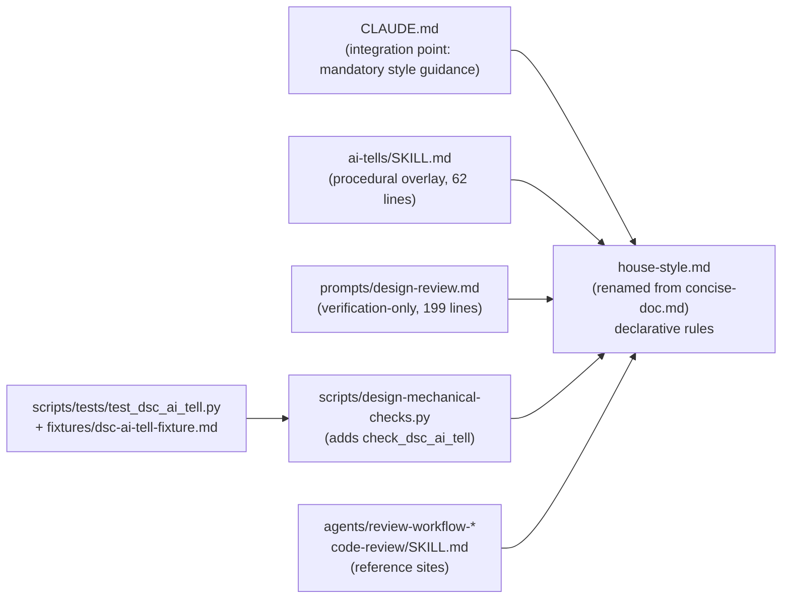

# House Style — Architecture Decision Record

## Summary

Consolidates the project's declarative writing-style rules from four overlapping files into a single renamed source (`.claude/output-styles/house-style.md`) and converts the three other files into thin overlays that cross-reference it by section name. Adds a new `check_dsc_ai_tell` mechanical check that automates the regex-detectable subset of `house-style.md` patterns (Tier-1 vocabulary scan, negative parallelism, em-dash density, Title Case headings on H2+, signposting openers, copula avoidance, persuasive authority tropes, hyphenated word-pair comma clusters, fragmented headers). 14 string references to the old `concise-doc` / `Concise Doc` name were swept across 5 files; the acceptance gate `grep -rnE "concise-doc|Concise Doc" .claude/ docs/ CLAUDE.md --exclude-dir=_workflow` returns zero matches on the live tree.

## Goals

- **Single source of declarative writing rules.** Replace overlapping vocabulary / sentence-pattern / structural-rule duplication across `concise-doc.md`, `ai-tells/SKILL.md`, `design-review.md`, and `design-mechanical-checks.py` with one renamed source (`house-style.md`) and three thin readers. Every rule change should touch one file, not three.
- **Mechanical-check coverage for AI tells.** Extend `design-mechanical-checks.py` with a `dsc-ai-tell` rule so the existing structural-check pipeline catches the regex-detectable subset of writing-style violations. `auto_applicable: false` — rewrites need human judgment.
- **Empirical false-positive calibration.** Hold a zero-false-positive contract on three known-good ADRs (`persist-visible-count`, `index-gc`, `non-durable-wow`) that ship merged on `develop` and were written in the target style. A Python runner enforces the contract.
- **Bounded scope.** Update existing references only. Adding new pointers into files that did not previously reference the rules is the scope of follow-up issues, as are activation hooks on disk writes and YouTrack write tools.

All goals landed as planned. The implementation came in below the original 400-500-line estimate for `house-style.md` (366 lines) with the same content density, and the trimmed readers came in well under their length caps (`ai-tells/SKILL.md` 62 ≤ 80; `design-review.md` 199 ≤ 200).

## Constraints

- **Backward compatibility — none required.** The four target files are project-internal `.claude/` infrastructure. The `/output-style` slash command reads frontmatter `name:`, so the file rename plus frontmatter update keeps invocation working (the new canonical invocation is `/output-style house-style`).
- **Acceptance gate — zero grep matches.** After the rename and sweep, `grep -rnE "concise-doc|Concise Doc" .claude/ docs/ CLAUDE.md --exclude-dir=_workflow` returns zero results. `--exclude-dir=_workflow` skips the planning artifacts that legitimately document the old name; that directory is removed by the cleanup commit before merge.
- **Zero-false-positive calibration baseline.** `check_dsc_ai_tell` produces zero findings on the three calibration ADRs at the time the rule lands. Snapshot semantics apply: `house-style.md § Tier 1-4` is subject to quarterly review, and any PR that adds words to the tiered vocabulary lists must re-run the validator in the same PR.
- **Length budgets per the issue acceptance criteria.** `ai-tells/SKILL.md` ≤ 80 lines, `design-review.md` ≤ 200 lines. As built: 62 and 199.
- **File rename uses `git mv`** to preserve history. The diff shows a 95% similarity index because only the frontmatter changed in the rename commit.
- **No scope creep.** Updating *existing* `concise-doc` / `Concise Doc` references is in scope; *adding new* `house-style.md` pointers into files that don't currently reference the rules (other workflow prompts, agents, implementer/orchestrator files, `conventions.md`) is out of scope and deferred to a follow-up issue.

## Architecture Notes

### Component Map

- **`house-style.md`** — renamed from `concise-doc.md` via `git mv` and rewritten to absorb the consolidated rule set (Tier-3 vocab and several extra rules from `ai-tells`, the Human-reader cold-read additions and Structural findings from `design-review.md`, and 12 humanizer-gap patterns with inline before/after examples). Ten H2 sections; 366 lines.
- **`ai-tells/SKILL.md`** — trimmed from 156 to 62 lines (18 lines of headroom under the 80-line cap). Keeps the audit/rewrite mode toggle, the collapse-without-opener diagnostic, the 4-pass workflow, and the 3-block output format; replaces the static catalogue with a `## Catalogue lookups` H2 carrying five cross-references into `house-style.md`.
- **`prompts/design-review.md`** — trimmed from 346 to 199 lines (1 line of margin under the 200-line cap). Strips declarative rule statements; each verification entry references the rule by name. Keeps the Q1-Q7 comprehension questions, the `phase4-creation` plan-deviation surfacing, the mutation-kind-specific instructions, and the output format markdown block byte-identical except for one documented example-label carve-out.
- **`design-mechanical-checks.py`** — gains the `check_dsc_ai_tell` function (nine patterns), the `iter_paragraphs` helper (bullet-aware paragraph segmentation), five regex constants, a 29-word Tier-1 vocabulary list, a `STOP_WORDS` frozenset, and the `main()` wire-up. Each finding cites `house-style.md § <Section>` in its description.
- **Test fixture and runner** — new directory `.claude/scripts/tests/` carrying `fixtures/dsc-ai-tell-fixture.md` (111 lines, 9 positive cases + 3 negative cases) and `test_dsc_ai_tell.py` (248 lines, Python runner enforcing positive coverage, negative coverage, and the zero-finding calibration contract).

### Decision Records

#### D1: Full rename to `house-style.md` (vs minimal rename or sibling file)

- **Alternatives considered**: (a) keep `concise-doc.md`, broaden the frontmatter description; (b) add `house-style.md` as a sibling file pointing back to `concise-doc.md` for the legacy rules; (c) full rename + find-and-replace across the repo (chosen).
- **Rationale**: (a) leaves a misleading filename ("only documents", "only conciseness") that mismatches the actual scope (vocabulary, tone, structure, document shape across every authored surface). (b) doubles the lookup surface and creates two sources of truth, which is the failure mode the refactor exists to fix. (c) gives one authoritative file name that matches the editorial term writers already use ("the house style"). The rename surface is bounded — 14 string references across 5 internal `.claude/` files.
- **Outcome**: Implemented as planned. `git mv` preserved history (95% similarity index). The acceptance gate (`grep -rnE "concise-doc|Concise Doc" .claude/ docs/ CLAUDE.md --exclude-dir=_workflow` → zero matches) holds. The new slash-command invocation `/output-style house-style` works because the slash command reads frontmatter `name:`, not the filename.

#### D2: Consolidate declarative rules into `house-style.md`

- **Alternatives considered**: (a) leave the rules duplicated across four files (status quo); (b) consolidate rules into the existing `ai-tells` skill; (c) consolidate into a new `house-style.md` and convert the other three into thin overlays (chosen).
- **Rationale**: (a) every rule change touches three files, with measurable drift between sources (the cold-read prompt at 346 lines mostly restated rules already in concise-doc and ai-tells). (b) `ai-tells` is a skill invoked deliberately by the user; a writer drafting an ADR should not have to invoke a skill to know what the rules are. (c) gives one authoritative declarative source that every other artifact (skill, cold-read prompt, mechanical script, agents) references by section name. The `ai-tells` skill becomes the procedural audit/rewrite tool that *applies* the rules; the rules themselves live in the style file.
- **Outcome**: Implemented as planned. The post-refactor topology has one writer (`house-style.md`) and three readers (`ai-tells/SKILL.md`, `design-review.md`, `check_dsc_ai_tell`). The eight `house-style.md § <heading>` cross-references in `design-review.md` and the five in `ai-tells/SKILL.md` all resolve verbatim to on-disk H3 headings. The H2 section name `Document-shape rules (design / ADR-specific)` carries a trailing parenthetical that downstream readers citing the full heading must include verbatim; the readers as built all cite shorter H3 names under that H2.

#### D3: `check_dsc_ai_tell` calibration approach

- **Alternatives considered**: (a) ship the regex list from the original issue verbatim; (b) apply four calibration refinements informed by probing the three known-good ADRs (chosen); (c) ship only the regexes with proven zero false positives (Tier-1 vocab, negative parallelism, signposting, copula, authority) and defer the rest.
- **Rationale**: (a) the literal Title Case regex would false-positive on legitimate Title-Case H1 ADR titles; the literal hyphenated-pair density rule would false-positive on `non-durable-wow.md` (23.3 pairs per 500 words of legitimate technical compounds). (c) drops useful checks that *would* work with refinement. (b) calibrates each rule against real data: Title Case → H2+ only; hyphenated-pair → adjectival cluster; em-dash density → paragraph detection using the existing fence-aware parser; fragmented-header → content-word overlap with the heading lemma.
- **Outcome**: Implemented with two further narrowings discovered at code-write time. The hyphenated-pair rule tightened to a comma-cluster-only form (regex `\b[a-z]+-[a-z]+(?:,\s+[a-z]+-[a-z]+){2,}\b` plus distinct-pair deduplication) to let legitimate technical compounds adjacent to nouns pass. The em-dash density rule tightened to fire on 3+ em dashes per paragraph or on 2 em dashes with a sentence terminator in the middle segment, exempting balanced parenthetical asides `A — clause — B`. The Title-Case rule additionally requires three or more Title-Case words (calibrated against the project's 2-word ADR-scaffold headings: `Architecture Notes`, `Decision Records`, `Integration Points`, `Non-Goals`, `Key Discoveries`, `Component Map`). The fragmented-header rule uses content-word overlap with stop-word stripping and hyphen-preserving tokenisation (the threshold constant was renamed from `_LEMMA_OVERLAP_` accordingly). One implementation detail not in the original plan: `iter_paragraphs` splits paragraphs on top-level bullet starters (`- `, `* `, `+ `, `N. `) in addition to blank lines, so a tightly-packed bullet list with one em dash per bullet is not treated as one paragraph and does not over-fire the em-dash density rule on legitimate ADR prose.

#### D4: Test fixture and verification approach

- **Alternatives considered**: (a) inline test cases in the script's docstring; (b) Python unit-test file; (c) seeded markdown fixture + shell runner that invokes the script (originally chosen during planning).
- **Rationale**: (c) keeps the test infrastructure aligned with how the script is invoked in real use and produces a JSON output that a runner can grep for the expected `dsc-ai-tell` rule hits. The fixture lives at `.claude/scripts/tests/fixtures/dsc-ai-tell-fixture.md` and contains one paragraph per banned pattern plus three negative-case paragraphs; the runner invokes the script against (i) the fixture and (ii) the three known-good ADRs.
- **Outcome**: Shipped as a **Python runner** at `.claude/scripts/tests/test_dsc_ai_tell.py`, not a shell runner. The Python form makes per-pattern expectations cleaner (a `PATTERN_SIGNATURES` table keyed on description prefixes asserts each pattern fired at least once) and gives explicit `timeout=60` protection against regex infinite-loop pathologies. The runner is invocation-on-demand only; no `.github/workflows/*.yml` invokes it today. CI wiring is a deferred follow-up. The runner module docstring carries a manifest of the baseline 12 `dsc-ai-tell` findings across the seven non-calibration ADRs as a regression-detection floor: if a future change drives any of those to zero unintentionally, the rule has been weakened.

#### D5: Fold the mechanical-check rule into the same PR as the consolidation

- **Alternatives considered**: (a) ship the consolidation (file rename, content rewrite, reader trims, FRR sweep) as one PR and the mechanical-check rule as a separate standalone PR (the original issue's literal suggestion); (b) fold both into the same PR (chosen).
- **Rationale**: the mechanical-check rule is *functionally* independent of the file rename. But its finding descriptions cite `house-style.md § <Section>` by name; landing the rule first would either require placeholder citations (to be updated after the rename lands) or commit messages that don't compile against current state. Landing as one PR keeps every commit self-consistent and matches user direction during research.
- **Outcome**: Both groups of changes land in this single squashed PR. The execution still ran the two streams in parallel during the branch's lifetime — the rule-writing work proceeded independently of the rename sweep — but the merge boundary is unified.

### Invariants & Contracts

- **Invariant 1 — Zero grep matches.** `grep -rnE "concise-doc|Concise Doc" .claude/ docs/ CLAUDE.md --exclude-dir=_workflow` returns zero results on the live tree. The `--exclude-dir=_workflow` flag scopes the gate to live in-scope files; the planning artifacts under `_workflow/` legitimately reference the old name and are removed by the cleanup commit before merge, so the post-merge tree has zero matches by the same gate without the flag.
- **Invariant 2 — Single declarative source.** `house-style.md` is the only declarative source. `ai-tells/SKILL.md` and `prompts/design-review.md` cross-reference by section name; neither restates rules. The mechanical form is `grep -nE "^#+\s+(Banned vocabulary|Em-dash discipline|Title Case headings forbidden)" .claude/skills/ai-tells/SKILL.md .claude/workflow/prompts/design-review.md` returning zero matches. As shipped, the two reader files carry zero free-standing headings of declarative-rule names.
- **Invariant 3 — Zero false positives on three known-good ADRs.** `check_dsc_ai_tell` produces zero findings on `docs/adr/persist-visible-count/adr.md`, `docs/adr/index-gc/adr.md`, `docs/adr/non-durable-wow/adr.md`. The Python validator at `.claude/scripts/tests/test_dsc_ai_tell.py` enforces this contract. Snapshot semantics: the zero-FP property holds at the time the rule lands; `house-style.md § Tier 1-4` is subject to quarterly review (see `house-style.md` line 90), and a future vocabulary addition could legitimately appear in one of the calibration ADRs as a citation or technical name. Any PR that adds words to the tiered vocabulary lists must re-run the validator in the same PR.
- **Invariant 4 — Length caps.** `.claude/skills/ai-tells/SKILL.md` ≤ 80 lines (62 as shipped, 18 lines of headroom). `.claude/workflow/prompts/design-review.md` ≤ 200 lines (199 as shipped, 1 line of margin).

### Integration Points

- **`CLAUDE.md § Writing Style for Design Docs and Issues`** — references `house-style.md` by the new name; the surface list (ADR / issue body / PR description / YouTrack issue body) is preserved. The slash-command suggestion is now `/output-style house-style`.
- **`/output-style` slash command** — reads frontmatter `name:`; the rename from `Concise Doc` to `House Style` keeps invocation working. New canonical form: `/output-style house-style`.
- **`edit-design` skill mutation pipeline** — invokes `design-mechanical-checks.py` already; the new `dsc-ai-tell` findings flow through the existing pipeline (review log, iteration loop) without changes to the skill. The cold-read prompt at `design-review.md` was trimmed in parallel and is invoked by the same skill.

### Non-Goals

- **Activation hook on disk writes** (PreToolUse on `docs/adr/**`, `_workflow/**`, `issue-*.md`, source files) — covered by a follow-up issue.
- **Activation hook on YouTrack MCP write tools** — covered by a follow-up issue.
- **Expanding `house-style.md` pointers into new files** (`.claude/workflow/conventions.md`, additional workflow prompts, review agents beyond the two named above, implementer / orchestrator files) — covered by a follow-up issue.
- **New severity tier, new reviewer agent, new file-kind taxonomy** — out of scope; the existing `severity: should-fix` and the existing reviewer agents handle the new rules.
- **Retroactive rewrite of merged design docs** — out of scope; the mutation discipline states "every mutation lands without introducing or worsening findings", not "every existing file passes today."
- **Always-on session `outputStyle: house-style`** in `.claude/settings.json` — out of scope; selective activation via the deferred follow-up issues plus cognitive pointers in prompts is the chosen mechanism.
- **CI wiring of the Python validator** — out of scope for the initial landing; the runner is invocation-on-demand only. No `.github/workflows/*.yml` invokes `design-mechanical-checks.py` today. A follow-up can wire `.github/workflows/design-checks.yml` to run the validator on every PR that touches `.claude/scripts/`, `.claude/output-styles/house-style.md`, or `docs/adr/**`.

## Key Discoveries

- **The H2 section name `Document-shape rules (design / ADR-specific)` carries a trailing parenthetical** that is part of the canonical heading name. Downstream readers citing the full H2 verbatim must include the parenthetical; the readers shipped here all cite shorter H3 names under that H2, so the parenthetical does not affect them. Future cross-reference additions need to follow the verbatim rule.
- **Raw `grep -c '^## ' house-style.md` returns 12, not 10.** Two extra matches are `## WAL replay` lines inside a fragmented-headers example's fenced code block under `## Structural rules`. The ten real H2 sections are intact; the grep needs fence-awareness to be accurate. This affected mechanical-check authoring (`iter_paragraphs` and the per-line scans in `check_dsc_ai_tell` all do fence-aware tracking via the existing `parse_code_fence` / `fence_closes` helpers).
- **The Tier-1 vocabulary list contains 29 base words**, three of which (`navigate`, `unlock`, `underscore`) carry parenthetical qualifications in the style file ("metaphorical", "as a verb meaning 'shows'") that a flat alternation regex cannot enforce. The rule fires on all 29 unconditionally. Empirical false-positive rate on the three calibration ADRs is zero; the documented fallback is to demote the rule to `suggestion` severity if real usage shows the qualifications matter.
- **`iter_paragraphs` needed bullet-aware segmentation** to avoid over-firing the em-dash density rule on legitimate ADR prose. Without splitting on `- `, `* `, `+ `, `N. ` line starters, a tightly-packed bullet list with one em dash per bullet would be treated as one paragraph and trip the rule. This implementation detail was not in the original plan; it surfaced when the rule over-fired on `persist-visible-count/adr.md` during step-level validation.
- **The em-dash density rule needed a balanced-parenthetical-aside exemption.** The shape `A — clause — B` (no sentence terminator in `clause`) is one legitimate parenthetical aside, not a cadence. The rule fires on 3+ em dashes per paragraph or on 2 em dashes with a sentence terminator in the middle segment. This carve-out resolved a residual false positive on `index-gc/adr.md` without weakening the rule on the 12 baseline findings across seven non-calibration ADRs.
- **The hyphenated-pair rule needed a tighter shape than originally planned.** The plan called for "3+ distinct adjectival pairs in same paragraph in adjectival position", but `non-durable-wow/adr.md`'s legitimate technical compounds adjacent to nouns (`cache-backed data structures … double-write log protection … per-file non-durability support`) would over-fire under that wording. The as-built regex matches three or more distinct lowercase hyphenated pairs in one comma-separated cluster only, which captures the canonical AI-tell shape (`fast-paced, well-crafted, next-generation`) without flagging legitimate compound nouns.
- **The fragmented-header rule needed hyphen-preserving tokenisation.** Splitting on `[^a-zA-Z0-9-]+` keeps hyphenated compounds as one token (`non-durable` is one token, not `non` + `durable`). Without this, `## Non-Goals` would collide with body tokens of `non-durable` and false-fire on legitimate documentation.
- **The fixture's Title Case demo required three multi-letter words.** An early fixture draft used `### A Title Case Demo Heading` and failed to fire the rule because `[A-Z][a-z]+` rejects a 1-letter word like `A`. The final fixture uses `### Title Case Demo Heading` (three multi-letter Title-Case words). The H1 case `# Some Title Cased Adr` correctly does not fire because the rule limits itself to `^#{2,6}` (skipping H1).
- **The fixture intentionally trips two non-`dsc-ai-tell` findings** (`per-section-shape:tldr` and `per-section-shape:references-footer` on `## Banned patterns`). The Python validator asserts against `rule == "dsc-ai-tell"` only, so the unrelated findings are tolerated. Future test authors authoring fixtures for other `dsc-*` rules must be aware of this filtering convention.
- **The `Document-shape rules (design / ADR-specific)` rules apply only to design / ADR surfaces.** They are not enforced on issue bodies, PR descriptions, or status prose, which use the BLUF rule alone. This narrower scope was clarified during the consolidation rewrite because the previous `concise-doc.md` was ambiguous on whether the structural shape rules applied to short-form prose.
- **mcp-steroid was reachable on the host during the rename sweep, but the working tree was not among the IDE's open projects.** `steroid_apply_patch` was therefore unavailable for an IDE-routed multi-file sweep; the implementation fell back to native `Edit` calls. This was safe for the rename — every edit was a single-occurrence literal-text replacement on markdown files with no PSI / symbol-resolution implications. A future Java refactor on this branch would need the user to open the project in IntelliJ first.
- **The `ai-tells` skill `description:` frontmatter is 856 characters long.** It contains literal trigger phrases ("humanize this", "does this sound like ChatGPT", etc.) so the harness's skill router can match user intent. The length is load-bearing for skill activation and was deliberately left intact during the trim.
- **The Python validator deliberately uses `subprocess.run(..., timeout=60)`** and `sys.executable` rather than a string-shell invocation. The timeout protects against regex infinite-loop pathologies in `check_dsc_ai_tell`; `sys.executable` ensures the validator uses the same Python interpreter regardless of the caller's shell `PATH`.
- **Cold-read sub-agents must not load `house-style.md` whole.** The prompt's reading rules require fetching only the cited `§ <heading>` section via grep + targeted Read with offset/limit. This caps the per-finding instant-axis context cost at one section rather than the whole 366-line file — an instant-axis budget consideration the trim of `design-review.md` made deliberate.
