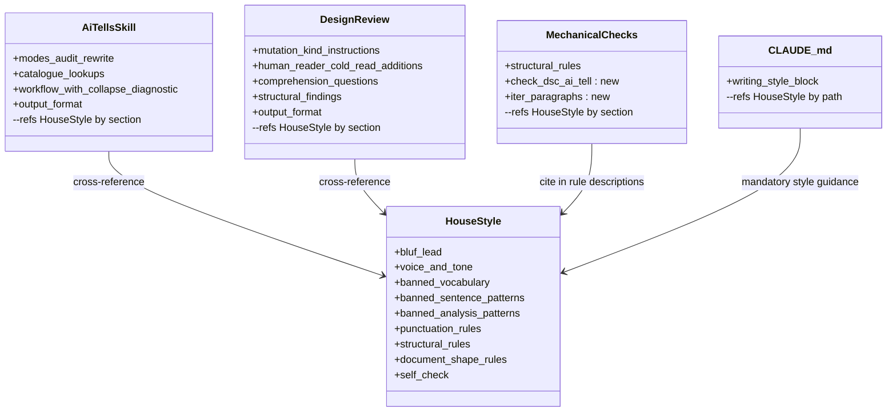
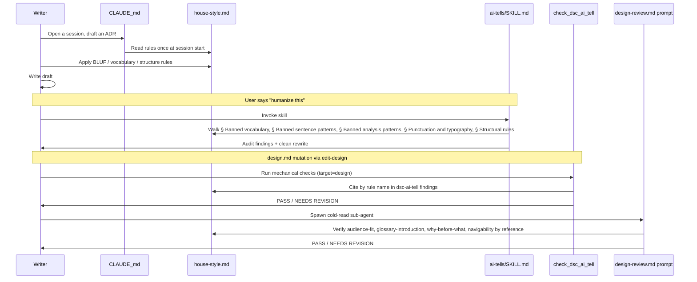

# House Style — Design

## Overview

This is the post-implementation design for contributors who maintain or read the project's writing-style infrastructure under `.claude/`, plus anyone whose drafting workflow runs against the consolidated style file. It assumes familiarity with the BLUF prose convention, the ADR shape used under `docs/adr/`, and the YTDB issue scope split: this issue (the consolidation), with two follow-ups deferred (the pointer-expansion sweep, and the activation hooks on disk writes and YouTrack write tools).

Before the consolidation, four files carried overlapping declarative rules: `.claude/output-styles/concise-doc.md` (BLUF + Tier 1-2 vocab + em-dash discipline), `.claude/skills/ai-tells/SKILL.md` (~70% catalogue overlap plus audit/rewrite workflow), `.claude/workflow/prompts/design-review.md` (declarative rules mixed with comprehension verification), and `.claude/scripts/design-mechanical-checks.py` (structural regex rules, no AI-tell scan). Every rule change touched three files; the cold-read prompt had grown to 346 lines repeating shapes that other files already stated.

The implementation consolidates every declarative writing rule into a single renamed file, `.claude/output-styles/house-style.md`, and converts the three other files into thin overlays that cross-reference it by section name. The mechanical script gained a new `check_dsc_ai_tell` function that automates the regex-detectable subset of `house-style.md` patterns; the cold-read prompt shrank to verification-only mode.

Four artifacts changed as a group: `house-style.md` (renamed from `concise-doc.md` and broadened from 92 to 366 lines, absorbing rules from three other files plus 12 humanizer-gap patterns with inline before/after examples); `ai-tells/SKILL.md` (trimmed from 156 to 62 lines, procedural overlay); `design-review.md` (trimmed from 346 to 199 lines, verification-only); and `design-mechanical-checks.py` (gained `check_dsc_ai_tell`, `iter_paragraphs`, 5 regex constants, the Tier-1 word list, and a `STOP_WORDS` set). 14 string references to the old `concise-doc` / `Concise Doc` name were updated across `CLAUDE.md`, `.claude/skills/code-review/SKILL.md`, `.claude/agents/review-workflow-consistency.md`, and `.claude/agents/review-workflow-writing-style.md`. The acceptance gate `grep -rnE "concise-doc|Concise Doc" .claude/ docs/ CLAUDE.md --exclude-dir=_workflow` returns zero matches on the live tree (`--exclude-dir=_workflow` skips planning artifacts removed by the cleanup commit before merge).

The `check_dsc_ai_tell` regex was calibrated against three known-good ADRs (`persist-visible-count`, `index-gc`, `non-durable-wow`); a Python runner at `.claude/scripts/tests/test_dsc_ai_tell.py` enforces the zero-finding contract against those three ADRs alongside positive-case coverage for every pattern.

Document roadmap: § Core Concepts defines the three new terms used below. § Class Design shows the post-refactor topology. § Workflow shows the rule-lookup path. § Internal layout of `house-style.md` documents the consolidated file's section structure as it landed. § dsc-ai-tell calibration documents the implementation including four narrowings versus the canonical prose rules. § Rename surface summarises the find-and-replace pass. This design fits inside one file; no `design-mechanics-final.md` companion was created because the prose is well under the 2,000-line split trigger. The `D<N>` decision records and `Invariant <N>` definitions referenced in the per-section References footers live in the sibling `adr.md`.

**Plan deviations to call out.** Three of the four `check_dsc_ai_tell` narrowings (Title Case 3-word minimum, hyphenated-pair comma-cluster-only, em-dash balanced-aside exemption) tightened during implementation beyond what the original plan's calibration refinements described; the fourth (fragmented-header content-word overlap with hyphen-preserving tokenisation) is what the plan called for. The `iter_paragraphs` bullet-segmentation rule was emergent during implementation. The validation harness shipped as a Python runner rather than the originally-considered shell runner. See § dsc-ai-tell calibration for the as-built rules.

## Core Concepts

**House style.** The renamed `.claude/output-styles/house-style.md` (formerly `concise-doc.md`). Single source of declarative writing rules for the project — vocabulary, sentence patterns, analysis patterns, punctuation, structural rules, and document-shape rules. Referenced by name from every other writing-style surface (the `ai-tells` skill, the cold-read prompt, the mechanical script, and the workflow agents). → § Internal layout of `house-style.md`.

**dsc-ai-tell.** The new mechanical-check function in `design-mechanical-checks.py`. Implements nine `house-style.md` patterns detectable by regex without judgment: Tier-1 vocabulary scan, negative parallelism, em-dash density, Title Case headings on H2+, signposting openers, copula avoidance, persuasive authority tropes, hyphenated word-pair comma clusters, and fragmented headers. Findings are `auto_applicable: false` — rewrites need human judgment. → § dsc-ai-tell calibration.

**Humanizer gap patterns.** Twelve AI-writing patterns drawn from a gap analysis against the [blader/humanizer](https://github.com/blader/humanizer) catalogue that were missing from `concise-doc.md` and `ai-tells/SKILL.md`: superficial -ing analyses, copula avoidance, passive voice / subjectless fragments, filler phrases, excessive hedging, generic positive conclusions, persuasive authority tropes, signposting, fragmented headers, hyphenated word-pair overuse, elegant variation, and false ranges. Ten landed in `house-style.md § Banned analysis patterns`; hyphenated word-pair overuse landed in `§ Punctuation and typography`; fragmented headers landed in `§ Structural rules`. Each pattern ships with an inline before/after example block in its assigned section. → § Internal layout of `house-style.md`.

## Class Design

**TL;DR.** After the refactor, one writer (`house-style.md`) and three readers (`ai-tells/SKILL.md`, `design-review.md`, the `check_dsc_ai_tell` function), plus `CLAUDE.md` as the integration point that declares the file mandatory for the listed surfaces. Every declarative rule change now touches one file.



Before the consolidation the same five boxes existed, but the arrows were duplicated and reversed: `concise-doc.md`, `ai-tells/SKILL.md`, and `design-review.md` each carried their own copy of the vocabulary / sentence-pattern / structural rules. The mechanical script had no AI-tell scan and no rule-citation edges to any prose source. The post-refactor topology eliminates the duplication and points every reader at the writer by section name.

### Edge cases / Gotchas

- The H2 section name `Document-shape rules (design / ADR-specific)` in `house-style.md` carries a trailing parenthetical. Any reader citing the full heading verbatim (mechanical checks, cold-read prompt, ai-tells skill catalogue) must include the parenthetical. The downstream readers all cite shorter H3 names under that H2, so this caveat affects only future writers who want to cite the H2 directly.
- The `ai-tells` skill frontmatter `description:` is 856 characters long. It contains literal trigger phrases (e.g., "humanize this", "does this sound like ChatGPT") so the harness's skill router can match user intent. The length is load-bearing for skill activation and was deliberately left intact during the trim.

### References

- D1: Rename approach.
- D2: Consolidate declarative rules into `house-style.md`.
- Invariant 1: Zero grep matches for the old name across the live tree.
- Invariant 2: `house-style.md` is the only declarative source; readers cross-reference by section name.

## Workflow

**TL;DR.** Writer, cold-read sub-agent, and mechanical script all look up rules in `house-style.md` by section name. The behavioral change is that no actor duplicates a rule.

Before the consolidation, a writer drafting an ADR who needed a specific rule had to know which of four files held it: vocabulary lived in `concise-doc.md`, audit workflow in `ai-tells/SKILL.md`, structural rules in `design-review.md`, and regex enforcement in `design-mechanical-checks.py`. Drift between the four sources meant the writer could follow the rule in one file and still trip the check in another. After the consolidation, every actor reads the same file by the same section names.



`house-style.md` is read by every actor: directly by the writer through `CLAUDE.md`'s mandatory directive, structurally by the cold-read prompt (which names rules and asks "does this section satisfy `house-style.md § <Section>`?" rather than restating the rule), and semantically by the mechanical script (which cites the section name in every finding description).

### Edge cases / Gotchas

- Cold-read sub-agents do not load `house-style.md` whole; the prompt's reading rules require fetching the cited `§ <Heading>` section only when a finding is forming, via grep + targeted Read with offset/limit. This caps the per-finding instant-axis cost at one section rather than the whole 366-line file.

### References

- D2: Consolidate declarative rules into `house-style.md`.

## Internal layout of `house-style.md`

**TL;DR.** The consolidated file organizes rules into ten top-level sections that progress
from affirmative anchors (BLUF, voice) through narrowest-to-broadest banned patterns
(vocabulary → sentence → analysis → punctuation → structural) to document-shape rules (the
design-doc-specific subset) and close with a self-check.

The ten H2 sections as they landed:

```
## What this style governs
## BLUF lead
## Voice and tone
## Banned vocabulary
    ### Tier 1 — hard ban                  (29 base words)
    ### Tier 2 — strongly avoid
    ### Tier 3 — promotional language
    ### Tier 4 — era-specific (current as of May 2026)
## Banned sentence patterns
    ### Negative parallelism
    ### Sycophantic openers
    ### Throat-clearing
    ### Closing phrases
    ### Trailing hedges
    ### Prompt-restating
    ### Knowledge-cutoff disclaimers
## Banned analysis patterns                 (ten humanizer-gap patterns + Vague attribution + Hedge stacking + Filler hedges)
    ### Superficial -ing analysis
    ### Copula avoidance
    ### Passive voice and subjectless fragments
    ### Hedge stacking
    ### Filler hedges and filler phrases
    ### Vague attribution
    ### Generic positive conclusions
    ### Persuasive authority tropes
    ### Signposting
    ### Elegant variation
    ### False ranges
## Punctuation and typography
    ### Em-dash discipline
    ### Hyphenated word-pair overuse        (humanizer-gap pattern)
    ### Curly quotes
    ### Excessive boldface
## Structural rules
    ### Inline-header lists
    ### Title Case headings forbidden
    ### Heading hierarchy
    ### Fragmented headers                   (humanizer-gap pattern)
## Document-shape rules (design / ADR-specific)
    ### Overview concept-first
    ### Audience-fit
    ### Glossary-introduction
    ### Why-before-what
    ### Navigability
    ### Edge cases sub-section required
    ### References footer shape
    ### Same-shape sibling consolidation
## Self-check
```

**Length as built: 366 lines** (under the original 400-500-line estimate; the gap is room saved by tight writing per the file's own "bias toward less text" rule, not missing content). Well under the 2,000-line `design-mechanics.md` split trigger.

**Frontmatter:**

```yaml
---
name: House Style
description: BLUF-first project house style: vocabulary, tone, structure, and document-shape rules for design / plan / track / issue / PR / commit-body / comment / status prose. Strips AI-tell vocabulary, hedging, faux-symmetric structure.
---
```

The frontmatter `name: House Style` lets the `/output-style` slash command pick the file up unchanged. The canonical invocation is `/output-style house-style` (kebab-case normalisation of `House Style`).

### Edge cases / Gotchas

- A raw `grep -c '^## '` on the file returns 12, not 10. Two extra matches are `## WAL replay` lines inside the fragmented-headers example's fenced code block under `## Structural rules`; the ten real H2 sections are intact.
- `## What this style governs` enumerates eight authored prose surfaces (design docs under `docs/adr/**`, plans / tracks / step files / review reports, GitHub issue and PR bodies, YouTrack issue bodies, commit-message bodies, inline code comments and Javadoc when describing rationale, and chat / status updates the user will paste into durable artifacts). The list is load-bearing for activation hooks shipped by the deferred follow-up issues.

### References

- D2: Consolidate declarative rules into `house-style.md`.
- Invariant 2: `house-style.md` is the only declarative source.
- Invariant 4: Length caps on `ai-tells/SKILL.md` (≤80 lines) and `design-review.md` (≤200 lines).

## dsc-ai-tell calibration

**TL;DR.** Nine regex patterns live inside `check_dsc_ai_tell` in `design-mechanical-checks.py`.
Four of the canonical `house-style.md` rules are implemented in narrower form than the prose
states; the narrower form holds the zero-false-positive contract on three calibration ADRs
and keeps a legitimate-AI-tell baseline on seven non-calibration ADRs. A Python runner at
`.claude/scripts/tests/test_dsc_ai_tell.py` enforces the contract.

The function lives at `.claude/scripts/design-mechanical-checks.py:1449`; the paragraph-walking helper `iter_paragraphs` lives at line 1301; constants live at lines 95-195. The signature matches the bounded-aware sibling `check_dsc_parenthetical_asides`, so `--scope=bounded --changed-section=<name>` restricts findings to one section.

The nine patterns and the rule sections they cite:

| Pattern | `house-style.md` section cited | Detection shape |
|---|---|---|
| Tier-1 vocabulary | `§ Tier 1 — hard ban` | Word-boundary alternation over 29 base words, case-insensitive |
| Negative parallelism | `§ Banned sentence patterns` | `\bit'?s not\b.*\bit'?s\b` against the joined paragraph text |
| Em-dash density | `§ Em-dash discipline` | Per-paragraph count via `iter_paragraphs` |
| Title Case heading | `§ Title Case headings forbidden` | `^#{2,6} ([A-Z][a-z]+ ){2,}[A-Z][a-z]+$` on H2-H6 only |
| Signposting opener | `§ Signposting` | Word-boundary alternation: `let'?s dive`, `let'?s break`, `here'?s what you need` |
| Copula avoidance | `§ Copula avoidance` | Word-boundary alternation: `serves as`, `stands as` |
| Persuasive authority trope | `§ Persuasive authority tropes` | Word-boundary alternation: `at its core`, `fundamentally`, `the real question` |
| Hyphenated-pair comma cluster | `§ Hyphenated word-pair overuse` | Regex `\b[a-z]+-[a-z]+(?:,\s+[a-z]+-[a-z]+){2,}\b` plus distinct-pair deduplication |
| Fragmented header | `§ Fragmented headers` | Heading content words intersected with the next one-line paragraph's content words, ≥50% overlap |

Every finding is `auto_applicable: false` — rewrites need human judgment. References-block lines (`### References`, `**References.**` through the next heading), table rows (lines starting with `|`), and fenced code blocks are excluded for every pattern; findings inside legitimate citations or example blocks would otherwise be noise.

### Narrower than canonical: four documented carve-outs

The implementation accepts a narrower decision boundary than the canonical `house-style.md`
prose in four places, in every case to hold the zero-false-positive contract on the calibration
ADRs without weakening the rule on legitimate AI-tell signals. The carve-outs are documented;
future revisions of `house-style.md` may either tighten the canonical wording to match the
implementation or accept the drift.

- **Title Case heading: 3-word minimum.** The regex `^#{2,6} ([A-Z][a-z]+ ){2,}[A-Z][a-z]+$` requires three or more Title-Case words after the heading marker. Two-word Title-Case headings (`## Architecture Notes`, `## Decision Records`, `## Integration Points`, `## Non-Goals`, `## Key Discoveries`, `## Component Map`) pass silently because every calibration ADR uses them as scaffold headings. The canonical rule at `house-style.md § Title Case headings forbidden` does not carve out a word-count exemption.
- **Em-dash density: balanced-aside exemption.** The rule fires on 3+ em dashes per paragraph, or on 2 em dashes whose middle segment contains a sentence terminator (`. ! ?`). A balanced parenthetical aside passes; the canonical AI-tell cadence and unbalanced two-em-dash forms still fire. Examples:

  ```text
  exempt:   A — clause — B          (no sentence terminator in the middle)
  fires:    X — Y — Z — W            (three em dashes, classic cadence)
  fires:    X. — Y — Z               (two em dashes; period in middle segment)
  ```

  The canonical rule states "max one em dash per paragraph".
- **Hyphenated-pair overuse: comma-cluster only.** The regex matches three or more distinct lowercase hyphenated pairs in one comma-separated cluster. The canonical rule fires on "three or more *distinct* hyphenated pairs in the same paragraph, in adjectival position"; the implementation is narrower to let `non-durable-wow/adr.md`'s legitimate technical compounds in adjectival position pass. Example cluster the regex catches:

  ```text
  a fast-paced, well-crafted, next-generation storage layer
  ```
- **Fragmented header: content-word overlap with hyphen preservation.** Tokenisation splits on `[^a-zA-Z0-9-]+` so hyphenated compounds stay as one token. The check is content-word overlap with stop-word stripping, not morphological lemmatisation; the threshold constant was renamed accordingly. The canonical rule states "≥50% lemma overlap".

### Tier-1 vocabulary scope

The Tier-1 list contains 29 base words drawn verbatim from `house-style.md § Tier 1 — hard ban`.
Three entries carry parenthetical qualifications in the style file that a flat alternation
regex cannot enforce:

```text
navigate    (metaphorical)
unlock      (metaphorical)
underscore  (as a verb meaning "shows")
```

The rule fires on all 29 base words unconditionally; literal-meaning usages may false-fire.
Empirical false-positive rate on the three calibration ADRs is zero. The documented fallback,
if real usage shows the qualifications matter, is to demote the rule to `suggestion` severity
per the calibration decision below.

### Bullet-aware paragraph segmentation

`iter_paragraphs` segments blank-line-bounded paragraphs with fence / References-block /
table-row exclusion. One implementation detail not anticipated by the original plan: each
top-level bullet starter (`- `, `* `, `+ `, `N. `) opens a new paragraph even without a
preceding blank line. Without this split, a tightly-packed bullet list with one em dash per
bullet would be treated as one paragraph and trip the em-dash density rule on legitimate
prose. The helper is reusable by future paragraph-scoped checks.

### Validation harness

The seeded markdown at `.claude/scripts/tests/fixtures/dsc-ai-tell-fixture.md` (111 lines)
contains nine positive-case paragraphs (one per banned pattern) plus three negative cases
(hyphenated technical compounds, a single em-dash paragraph, and an H1 Title Case heading the
rule must skip). The Python validator at `.claude/scripts/tests/test_dsc_ai_tell.py` (248 lines)
shells out to `design-mechanical-checks.py`, parses JSON, filters to `dsc-ai-tell` findings
only, and asserts:

- Positive coverage: a 9-entry `PATTERN_SIGNATURES` table keyed on description prefixes confirms each pattern fired at least once.
- Negative coverage: zero findings whose location line equals the H1 line or falls inside either negative-case range.
- Calibration: zero findings on each of `docs/adr/persist-visible-count/adr.md`, `docs/adr/index-gc/adr.md`, `docs/adr/non-durable-wow/adr.md`.

A runner-module docstring carries a manifest of the baseline 12 `dsc-ai-tell` findings across the seven non-calibration ADRs (`thin-workflow`: 6, `unit-test-coverage`: 1, `ytdb-817-new-track-format`: 5). If a future change drives any of those to zero unintentionally, the rule has been weakened.

### Edge cases / Gotchas

- The runner is invocation-on-demand only. No `.github/workflows/*.yml` invokes `design-mechanical-checks.py` today. CI wiring is a deferred follow-up. Manual invocation: `python3 .claude/scripts/tests/test_dsc_ai_tell.py` from repo root.
- Invariant 3 (zero false positives on the three calibration ADRs) is a snapshot at the time the rule landed. `house-style.md § Tier 1-4` is subject to quarterly review (see `house-style.md` line 90); a future vocabulary addition could legitimately appear in one of the calibration ADRs as a citation or technical name. Any PR that adds words to the tiered vocabulary lists must re-run the runner in the same PR.
- The Title-Case pattern's 3-word minimum interacts with fixture authoring: an early fixture draft used `### A Title Case Demo Heading` and failed to fire because `[A-Z][a-z]+` rejects the 1-letter word `A`. The final fixture uses `### Title Case Demo Heading` (three multi-letter Title-Case words).
- The fragmented-header rule's tokenisation splits on `[^a-zA-Z0-9-]+`, keeping hyphenated compounds intact. This avoids a false-positive case where `## Non-Goals` would otherwise collide with body tokens of `non-durable`.

### References

- D3: `dsc-ai-tell` calibration approach.
- D4: Test fixture and verification approach.
- D5: Fold the mechanical-check rule into the same PR as the consolidation.
- Invariant 3: Zero false positives on `persist-visible-count`, `index-gc`, `non-durable-wow`.

## Rename surface

**TL;DR.** 14 string references to `concise-doc` / `Concise Doc` were swept across 5 files: `CLAUDE.md` (2 references), `.claude/skills/code-review/SKILL.md` (1), `.claude/agents/review-workflow-consistency.md` (1), `.claude/agents/review-workflow-writing-style.md` (9, heavily threaded), and the renamed source file's own frontmatter `name:` line (1). The `git mv` from `concise-doc.md` to `house-style.md` preserved history (95% similarity index in the diff because frontmatter was the only delta in that first commit). The acceptance gate `grep -rnE "concise-doc|Concise Doc" .claude/ docs/ CLAUDE.md --exclude-dir=_workflow` returns zero matches on the live tree.

The `--exclude-dir=_workflow` flag scopes the gate to in-scope files; the planning artifacts under `docs/adr/ytdb-836-house-style/_workflow/` legitimately document the old name and are removed by the cleanup commit before merge. The post-merge tree has zero matches by the same gate without the flag.

### Pointer expansion deferred to a follow-up issue

The implementation only updated *existing* references. Adding new `house-style.md` pointers
into files that did not previously reference the rules is the scope of a deferred follow-up
issue: `.claude/workflow/conventions.md`, additional workflow prompts, the implementer and
orchestrator files, and review agents other than the two named above. The activation hooks
(PreToolUse on disk writes under `docs/adr/**`, `_workflow/**`, `issue-*.md`, source files,
and on YouTrack MCP write tools) are similarly deferred to follow-up issues.

### Edge cases / Gotchas

- `.claude/agents/review-workflow-writing-style.md` carried 9 of the 14 references, including string-emphasised forms (`**concise-doc**`), backtick-wrapped paths, and the agent's `## Project context` H2 heading. Markdown emphasis was preserved on every replacement.
- `mcp-steroid` was reachable on the host during the sweep, but the working tree was not among the IDE's open projects. `steroid_apply_patch` was therefore unavailable for a multi-file IDE-routed sweep, so the implementation fell back to native `Edit` calls. This was safe for the rename: every edit was a single-occurrence literal-text replacement on markdown files with no PSI / symbol-resolution implications. A future Java refactor on this branch would need the user to open the project in IntelliJ first.

### References

- D1: Rename approach (full rename + find-and-replace vs minimal rename or sibling file).
- Invariant 1: Zero grep matches for the old name across the live tree.
