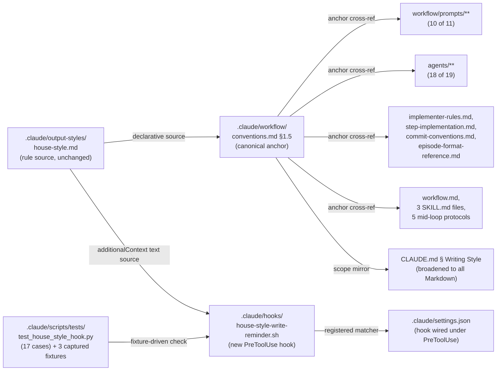

# Activate house style across the workflow — Architecture Decision Record

## Summary

A consolidated writing-style rule file existed at `.claude/output-styles/house-style.md` but no workflow surface activated it at write time. Workflow prompts, review agents, implementer files, and orchestrator files carried zero cross-references, and reminder text never landed in front of an agent generating prose. This work activates the rule set with two complementary mechanisms: a PreToolUse hook that fires once per session per tier on every `Write` / `Edit` / `mcp__<server>__steroid_apply_patch` invocation, and one-line in-prompt citations in 41 workflow files (the canonical anchor in `.claude/workflow/conventions.md §1.5`, plus 10 of 11 workflow prompts, 18 of 19 prose-producing review agents, four implementer files, and nine orchestrator files). The project `CLAUDE.md § Writing Style` block broadened from four named bullets to "all Markdown files in the repo" so the project-level guidance mirrors the hook's Tier-A glob.

## Goals

- Activate `.claude/output-styles/house-style.md` mechanically on every Markdown and Java/Kotlin write so the rules reach the writing agent at the moment of writing, not after.
- Cross-reference the rule file from every prose-producing workflow surface so an agent reading any prompt or agent file sees the citation in its loaded context.
- Keep the rule file (`house-style.md`) and the mechanical AI-tell regex enforcer (`scripts/design-mechanical-checks.py`) unchanged — those are the authoritative sources from a prior consolidation, and this work adds activation surfaces only.
- Degrade silently on every failure mode (jq missing, malformed input, unwritable `TMPDIR`, flock contention). The hook must never block the underlying tool invocation.

All four goals were met as planned.

## Constraints

- **5-second `PreToolUse` timeout** (matches the existing `PreToolUse` timeout convention in `.claude/settings.json`). The implementation runs offline of every external service and degrades gracefully when `jq` is unavailable.
- **No `deny` decisions, no stderr noise, exit 0 on every path.** The hook's only output channel is `hookSpecificOutput.additionalContext` on stdout.
- **No always-on output style.** The `outputStyle: house-style` global setting stays out of scope (chat replies and ad-hoc work stay outside the hook).
- **Per-session state file** keyed by `session_id` from the hook input JSON, distinct from the pattern source `mcp-steroid-grep-reminder.sh` (which keys by Claude pid because its 5-minute time-window throttling does not need to track logical session boundaries).

A new constraint surfaced during execution: the literal substring `conventions.md §1.5 Writing style for Markdown and prose artifacts` must stay un-wrapped on one source line wherever the Markdown-link form is used, because the line-oriented acceptance grep splits across wrapped lines. The constraint applies to four implementer-file citation sites and the nine orchestrator-file sites.

## Architecture Notes

### Component Map

- **`.claude/output-styles/house-style.md`** — Existing rule file, unchanged. The four banned-section heading slugs cited by every Tier-B citation (`## Banned vocabulary`, `## Banned sentence patterns`, `## Banned analysis patterns`, `### Em-dash discipline`) are stable post-consolidation.
- **`.claude/workflow/conventions.md §1.5`** — New canonical anchor section. Loaded at every `/execute-tracks` startup. Names `house-style.md` as the rule source and carries the tier-mapping table (Markdown → full house-style; Java/Kotlin → AI-tell subset; other → silent).
- **`.claude/hooks/house-style-write-reminder.sh`** — New PreToolUse hook (351 lines). Mirrors the `mcp-steroid-grep-reminder.sh` shape (jq-or-printf JSON emission, fail-silent on every error mode) but keys by `session_id` extracted from the hook input JSON, with `flock`-wrapped critical section.
- **`.claude/settings.json`** — New `PreToolUse` matcher `Write|Edit|mcp__.+__steroid_apply_patch` (regex on the server-name segment) wired to the hook. Sibling to the existing `Grep` matcher entry.
- **`.claude/scripts/tests/test_house_style_hook.py`** — Stand-alone Python validation runner (17 cases, ~0.7 s end-to-end). Matches the existing `test_dsc_ai_tell.py` invocation pattern.
- **`.claude/scripts/tests/fixtures/house-style-smoke-{write,edit,apply-patch}.json`** — Three captured hook-input fixtures replayed by the test runner.
- **Workflow prompts** — `adversarial-review.md`, `consistency-gate-verification.md`, `consistency-review.md`, `create-final-design.md`, `dimensional-review-gate-check.md`, `review-gate-verification.md`, `risk-review.md`, `structural-gate-verification.md`, `structural-review.md`, `technical-review.md` carry the citation. `design-review.md` was intentionally skipped.
- **Review agents** — All 18 prose-producing agents under `.claude/agents/` except `review-workflow-writing-style.md` (intentionally skipped because it already named house-style by name).
- **Implementer files** — `implementer-rules.md`, `step-implementation.md`, `commit-conventions.md`, `episode-format-reference.md`.
- **Orchestrator files** — `workflow.md`, three `SKILL.md` files (`create-plan`, `execute-tracks`, `review-plan`), five mid-loop protocols (`mid-phase-handoff.md`, `inline-replanning.md`, `review-mode.md`, `review-iteration.md`, `design-decision-escalation.md`).

### Decision Records

#### D1: Extension-based tier matching, all `*.md` → Tier A

- **Alternatives considered**: (a) Literal globs from the original issue description (`docs/adr/**`, `_workflow/**`, `issue-*.md`) — risks missing project READMEs, module docs, `CLAUDE.md`, and `.claude/**/*.md`. (b) Path-prefix matching by role (workflow vs docs vs root) — fragile, breaks on file moves. (c) Extension-based (chosen) — one stable rule.
- **Rationale**: The user broadened scope mid-research: *"we use \*.md files for project documentation in wide patterns so we should apply to all \*.md files."* Markdown is the project's documentation prose register; the cost of one extra reminder on an unusual README edit is paid once per session via the rate-limit.
- **Risks / Caveats**: Hook fires on edits to `house-style.md` itself unless explicitly excluded. D6 covers the blacklist.
- **Implemented in**: `.claude/hooks/house-style-write-reminder.sh` Stage 6 (tier classification).

#### D2: Per-session per-tier rate-limit keyed by `session_id`

- **Alternatives considered**: (a) No rate-limit — fires every Write, noisy. (b) Time-window rate-limit (every N minutes, the pattern from `mcp-steroid-grep-reminder.sh`) — over-engineering for a once-per-session reminder, and `/clear` would silently inherit the prior window. (c) Per-Claude-pid keying — survives across `/clear` because the Claude process and pid persist, so a post-`/clear` session reads the prior state and stays silent (broken semantics for this reminder). (d) Per-`session_id` keying (chosen) — `session_id` is part of every PreToolUse hook input JSON, changes on `/clear` and on every fresh conversation, so the rate-limit naturally resets at the logical session boundary.
- **Rationale**: The reminder surfaces rules early in a writing burst. `/clear` is a logical session boundary, so the reminder should fire again post-`/clear`. The `session_id` key makes the reset automatic with no explicit cleanup logic.
- **Risks / Caveats**: State files accumulate in `/tmp` over time (same as pid-keyed; no automated cleanup, relies on reboot). The hook diverges from the `mcp-steroid-grep-reminder.sh` precedent that uses pid-tree walk; the two hooks have different keying because they encode different semantics (time-window vs per-logical-session).
- **Implemented in**: `.claude/hooks/house-style-write-reminder.sh` Stages 2 and 7.

#### D3: Reference Tier-B subset sections by name in each citation

- **Alternatives considered**: (a) Add a dedicated `Tier-B subset` anchor in `house-style.md` listing the four source sections — single lookup target, but doubles maintenance burden when the subset evolves. (b) Restate subset rules inline in each citation — too much duplication across 30+ files. (c) Reference the four source sections by name in each Tier-B citation (chosen) — explicit enough to navigate, no duplicate rule text.
- **Rationale**: Keeps `house-style.md` as the sole declarative source and citations stay short.
- **Risks / Caveats**: If `house-style.md` is restructured, every citation needs updating. Mitigation: the four section names are stable headings, and the `test_16_section_name_guard` case in `test_house_style_hook.py` reads `house-style.md` and fails when any of the four heading lines disappears.
- **Implemented in**: every Tier-A and Tier-B citation across the 41 in-scope files.

#### D4: MCP-server-agnostic regex matcher for `steroid_apply_patch`

- **Alternatives considered**: (a) `Write|Edit` only — misses multi-file patches that the implementer routes through MCP Steroid per `.claude/workflow/conventions.md §1.4 *Tooling discipline*`. (b) Hardcode the literal tool name `mcp__localhost-6315__steroid_apply_patch` — works for the current `~/.claude.json` registry but silently stops firing when the server is registered under a different name (`mcp-steroid`, `intellij`, etc.). (c) Regex match `mcp__.+__steroid_apply_patch` (chosen) — covers every registry-name choice, anchored on the stable tool-name suffix. (d) Add `steroid_execute_code` too — too broad; that tool accepts arbitrary Kotlin code and target paths are not extractable.
- **Rationale**: The `mcp__<server>__<tool>` naming convention puts the user-global registry key in the middle segment, and that key varies across teammates and installs. The tool-name suffix `steroid_apply_patch` is stable.
- **Risks / Caveats**: The hook's jq pipeline mirrors the regex form via `test("^mcp__.+__steroid_apply_patch$")` to keep settings.json and the script in agreement. The apply-patch input shape is `tool_input.hunks` — an array of `{file_path, old_string, new_string}` objects, not a single `file_path` or unified-diff string; the hook enumerates `hunks[].file_path` via `[.tool_input.hunks[].file_path] | unique`.
- **Implemented in**: `.claude/settings.json` PreToolUse matcher entry and `.claude/hooks/house-style-write-reminder.sh` Stage 3.

#### D5: Acceptance via stand-alone Python runner plus captured smoke fixtures

- **Alternatives considered**: (a) Tests only — misses the live-session sanity check the original issue named explicitly. (b) Manual only — no regression coverage when the hook changes. (c) Both (chosen).
- **Rationale**: The hook is small; tests are cheap; the manual smoke note matches the issue's acceptance language verbatim. Pattern is established by the existing `.claude/scripts/tests/test_dsc_ai_tell.py` stand-alone runner.
- **Risks / Caveats**: The Python test suite under `.claude/scripts/tests/` runs as a stand-alone runner (`python3 .claude/scripts/tests/test_house_style_hook.py`), not pytest-collected. The three captured fixtures (`fixtures/house-style-smoke-{write,edit,apply-patch}.json`) are real hook input shapes from a live session and survive Phase 4 cleanup (they live outside `_workflow/`).
- **Implemented in**: `.claude/scripts/tests/test_house_style_hook.py` and three fixture files under `.claude/scripts/tests/fixtures/`.

#### D6: Hardcoded path blacklist for rule-source self-edits

- **Alternatives considered**: (a) No blacklist — minor self-reference noise when editing the rule file itself. (b) Env-var-controlled blacklist — adds config surface. (c) Hardcoded blacklist (chosen).
- **Rationale**: Two files explicitly carry house-style rule text (`house-style.md`, `ai-tells/SKILL.md`) and one script enforces them mechanically (`design-mechanical-checks.py`); the regex test fixtures (`test_dsc_ai_tell.py`) contain literal AI-tell phrases. Reminders are pointless on edits to these.
- **Risks / Caveats**: If new files join the rule-source set, the blacklist needs an update. Mitigation: blacklist is one `case` block in the hook script, trivial to extend.
- **Implemented in**: `.claude/hooks/house-style-write-reminder.sh` Stage 5.

### Invariants & Contracts

#### I1: Hook latency under 5 seconds

The PreToolUse hook completes within the 5-second timeout configured in `.claude/settings.json`. Each Python test case wraps the hook subprocess in `time.perf_counter()` and asserts elapsed ≤ 3 seconds (2 s headroom against the production timeout). Live latency on the host where this work was developed lands at 14-27 ms.

#### I2: Each tier reminder fires at most once per Claude session

Under one `session_id`, Tier A fires at most once and Tier B fires at most once regardless of how many tool invocations match. `/clear` or a fresh conversation issues a new `session_id` and the throttle resets. The flock-wrapped critical section in the hook ensures concurrent same-session same-tier invocations cannot both observe an empty state and both emit.

#### I3: Rule-source files never trigger their own reminder

The four blacklisted paths (`.claude/output-styles/house-style.md`, `.claude/skills/ai-tells/SKILL.md`, `.claude/scripts/design-mechanical-checks.py`, `.claude/scripts/tests/test_dsc_ai_tell.py`) stay silent regardless of extension or tier, and do not burn the rate-limit window for the matching tier.

### Non-Goals

- Always-on `outputStyle: house-style` session setting.
- Commit-msg git hook for vocabulary enforcement.
- Retroactive rewrite of historical commits or merged docs.
- Rule changes to `house-style.md` itself.
- Hook coverage for `steroid_execute_code` invocations that write files via `VfsUtil.saveText`. The tool input is arbitrary Kotlin code; target paths are not extractable in 5 seconds.
- A new `Tier-B subset` section in `house-style.md` (D3 chose to reference the four source sections by name instead).

## Key Discoveries

### MCP Steroid apply-patch input shape

The MCP Steroid `apply-patch` tool input is `tool_input.hunks`, an array of `{file_path, old_string, new_string}` objects — not a single `file_path` and not a unified-diff text in `tool_input.patch`. The hook extracts target paths via `[.tool_input.hunks[]?.file_path // empty] | unique`. An empty `hunks: []` array yields an empty path list and the hook stays silent rather than synthesising a fabricated reminder. The shape was confirmed against `mcp-steroid://skill/apply-patch-tool-description` via `steroid_fetch_resource` during plan review.

### MCP Steroid tool surface is not exposed to implementer sub-agents

`steroid_apply_patch` and the other MCP Steroid tools are not available in implementer sub-agent spawns. Pure-Markdown insertions with unique per-file anchors fall back to native `Edit` calls; the observable result is identical to a multi-hunk `steroid_apply_patch` for that case. This affected every pointer-insertion step across the 41 in-scope files.

### `.githooks/prepare-commit-msg` skips the prefix when the YTDB id appears in the body

The repository's `.githooks/prepare-commit-msg` hook treats any case-insensitive `YTDB-NNN` match anywhere in the message body as a "prefix already present" signal and skips prepending the subject prefix. Commits whose body cites the branch-derived id literally land with an unprefixed subject. The hook does not distinguish "this id is the subject prefix" from "this id is incidental body prose". A future addition to `CLAUDE.md § Git Conventions § Commit Messages` should warn implementers off citing the branch id in the body.

### Single-line layout constraint for Markdown-link-form citations

The Markdown-link form `[conventions.md §1.5 Writing style for Markdown and prose artifacts](conventions.md)` carries a literal substring that downstream audit greps and the `test_16_section_name_guard` drift check enumerate. The substring must stay un-wrapped on one source line; wrapping at the surrounding paragraph's column splits the substring across two physical lines and breaks the line-oriented acceptance grep without obvious failure feedback. The bare-backticked form used in the 28 workflow-prompt and review-agent citations is naturally single-line; the four implementer-file and nine orchestrator-file citations using the link form must enforce single-line layout explicitly.

### Line-bounded grep audits over rule-doc paragraphs are brittle

`grep -B<N> -A<M>` window-bounded audits over rule-doc paragraphs silently return 0 when the cited string sits outside the window. Per-paragraph (blank-line-split) audits would be more durable for any rule-doc check that asserts "feature X is cited in paragraph Y". The technique applies to any future audit that asserts a cross-reference appears in a specific section's body.

### Insertion-anchor pre-scan: avoid the colon-terminated-lead-in trap

A pointer paragraph that lands between a colon-terminated lead-in (e.g., "the four artifacts below:") and the enumerated list the colon introduces interrupts the lead-in→list flow and reads as a meta-aside the reader hits before the list the colon promises. Insertion anchors must skip past such patterns. The trap was first surfaced by `consistency-review.md` during workflow-machinery review; subsequent pointer landings pre-scan ±5 lines around the chosen anchor before patching.

### Em-dash and AI-tell discipline in commit and episode prose

The `dsc-ai-tell` mechanical regex enforcer fires on every Markdown that crosses its detection thresholds. During execution, em-dash density violations surfaced repeatedly in episode prose, commit message bodies, and review-finding descriptions. The pattern is to substitute colons, semicolons, or sentence breaks for em dashes whenever a paragraph carries three or more. The check applies whether or not the in-prompt hook reminder has fired for the session.

### Workflow-machinery review identified a form-drift hazard

Pointer paragraphs landed across orchestrator files split between blockquote form (`> **House style…**`) and plain-bold form. The drift was caught only by the dimensional review fan-out (three reviewers converged on the asymmetry), not by the original substring acceptance grep. The fix tightened the validation grep from substring match to a `^> \*\*House style for chat-scale prose\.` anchor so future drift fails the check rather than silently passing.

### Phase 4 cleanup interacts with the `_workflow/` ephemeral surface

Working-file identifiers (track numbers, step numbers, review-finding ids) and plan-file Decision Record ids that are NOT restated in this `adr.md` become dangling references once the Phase 4 cleanup commit removes `_workflow/`. `design-final.md` and this `adr.md` are the only artifacts that survive the cleanup; both apply the ephemeral-identifier rule and rewrite any forbidden reference to a file path, class name, commit SHA, or prose description. The pre-commit `dsc-ai-tell` gate catches the most common leak patterns before they land on durable surfaces.
