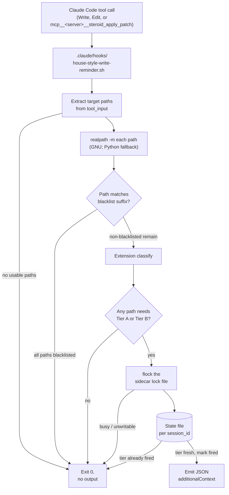

# Activate house style across the workflow — Final Design

## Overview

YouTrackDB's workflow consolidated its writing-style rules into one declarative file at `.claude/output-styles/house-style.md`. That file held the rules but no surface activated them at write time: prompts, review agents, implementer files, and orchestrator files carried zero cross-references, and reminder text never landed in front of an agent generating prose. Contributors who add or modify files under `.claude/` are the primary readers of this document; it explains which surfaces now activate house-style at write time and how the hook and in-prompt citations compose.

Four file-role groups appear repeatedly below: **workflow prompts** drive phases, **review agents** audit prose, **implementer files** compile track work into commits, and **orchestrator files** compose loops. Each role carried zero house-style cross-references before this change. Decision Records (`D1`–`D6`) and Invariants (`I1`–`I3`) cited in section References footers are catalogued in the companion `adr.md` Architecture Decision Record.

This design activates the rules across the workflow with two complementary mechanisms:

- A **PreToolUse hook** fires on every `Write`, `Edit`, and `mcp__<server>__steroid_apply_patch` invocation whose target paths classify as Markdown (**Tier A**: the full house-style rule set) or Java/Kotlin (**Tier B**: the AI-tell subset of banned vocabulary, banned sentence patterns, banned analysis patterns, and em-dash discipline). The hook emits `hookSpecificOutput.additionalContext` once per session per tier so a writing burst hears the rules early and stays quiet thereafter.
- **One-line in-prompt citations** in `.claude/workflow/conventions.md §1.5` (the canonical anchor), 10 of 11 workflow prompts, 18 of 19 prose-producing review agents, four implementer files, and nine orchestrator files. Each citation names the rule source by path and (where applicable) the four banned-section heading slugs verbatim. Two prose-producing files (`prompts/design-review.md`, `agents/review-workflow-writing-style.md`) already name house-style by name and are intentionally skipped.

The enabling primitive is the existing PreToolUse hook pattern in `.claude/hooks/mcp-steroid-grep-reminder.sh`: JSON-via-stdout `hookSpecificOutput.additionalContext` emission, jq-or-printf fallback, fail-silent exit-0 envelope. The new `house-style-write-reminder.sh` reuses this skeleton with a different matcher, an extension-based tier model, a `session_id`-keyed state file, and a `flock`-wrapped critical section so concurrent same-session invocations cannot both fire.

Subsystems that change to fit: `.claude/settings.json` picks up a new `PreToolUse` entry; `CLAUDE.md § Writing Style` broadens from four named bullets to "all Markdown files in the repo"; and every prose-producing workflow file gains one citation paragraph.

The rest of this document covers, in order: the hook's runtime decision pipeline (Workflow); the per-tier mapping to specific sections of `house-style.md` (Tier mapping); how the hook extracts target paths from each tool's input shape (Hook input parsing); the per-session per-tier reminder cadence (Rate-limit semantics); the blacklist that keeps the hook silent when editing the rule source itself (Path blacklist); and the in-prompt pointer surface that complements the hook (In-prompt pointer surface).

## Workflow



The hook reads its input JSON from stdin, extracts every target path (`tool_input.file_path` for `Write` or `Edit`; each `tool_input.hunks[].file_path` for the apply-patch variant), normalises with `realpath -m`, checks the blacklist, classifies by file extension, and (under `flock`) updates the per-session state file before emitting. Both tiers can fire from one invocation when an apply-patch input mixes Markdown and source files; the two reminder bodies concatenate into one `additionalContext` string because Claude Code accepts one hook output per call.

The hook never blocks the underlying tool call. Exit code stays at 0 on every code path, no `deny` decision is ever emitted, and stderr stays empty in every failure mode (jq absent, malformed input, missing `session_id`, unwritable `TMPDIR`, flock contention, flock binary missing, `realpath -m` absent). Hook latency lands at 14-27 ms on the project's host, three orders of magnitude under the 5-second `PreToolUse` timeout in `.claude/settings.json`.

### Edge cases / Gotchas

- A path with no recognised extension (`Dockerfile`, `Makefile`, `LICENSE`) falls into the silent branch. Comment prose in these files is rare and the project carries few.
- An apply-patch input with an empty `hunks` array yields an empty path list. The hook stays silent rather than synthesising a fabricated reminder.
- A non-writable `${TMPDIR:-/tmp}` is detected via `test -w "$state_dir"` before any `flock` redirection. Bash prints the redirection error to stderr before any `2>/dev/null` on `exec` itself can suppress it, so the explicit pre-check is the only way to keep the silent-failure contract intact in restricted sandboxes (read-only `TMPDIR`, custom override pointing at a missing directory).

### References

- D-records: D1, D2, D4, D6
- Invariants: I1 (hook latency under 5 seconds)

## Tier mapping to house-style.md sections

**TL;DR.** Markdown gets the full rule set; Java and Kotlin source get the AI-tell subset that applies at code-comment scale. The hook's reminder bodies cite the rule file by repo-relative path and name each applicable section so a future restructure can be caught by `grep -L` rather than silent breakage.

| Tier | Triggered by | Surfaces | Sections cited |
|---|---|---|---|
| A | `*.md` paths | Full house-style: BLUF lead, voice and tone, banned vocabulary, banned sentence patterns, banned analysis patterns, punctuation and typography, structural rules, document-shape rules | All H2 sections of `house-style.md` |
| B | `*.java`, `*.kt` paths | AI-tell subset (no structural rules, no document-shape rules) | `§ Banned vocabulary`, `§ Banned sentence patterns`, `§ Banned analysis patterns`, `§ Em-dash discipline` (H3 nested under `§ Punctuation and typography`) |
| Silent | Every other extension | Nothing | n/a |

The four Tier-B sections are the rule fragments that apply equally at code-comment scale. Document-shape rules (Overview concept-first, References footers) apply only to whole documents. Structural rules (BLUF lead, ≤200-word section cap) are document-scoped. Title-case heading checks fire on H2+ inside documents, not on prose lines inside a Java file. The four cited Tier-B headings live at different depths in `house-style.md` (three H2s plus one H3 under `Punctuation and typography`); pointers anchor on the stable heading-text substring so the H2/H3 mix does not break grep-based audits.

The hook reminder bodies cite the four section names verbatim. A future rename in `house-style.md` requires updating every pointer in the same commit. The `test_16_section_name_guard` case in `.claude/scripts/tests/test_house_style_hook.py` reads `house-style.md` and confirms each of the four headings still exists, failing the runner with a clear message naming the missing slug if a rename slips through.

### Edge cases / Gotchas

- A Markdown file under `.claude/output-styles/` matches Tier A by extension, but the path blacklist suppresses the reminder. See `## Path blacklist for rule-source self-edits`.
- A Java file with no comments still triggers the Tier-B reminder if it is the first Java edit of the session. The hook is path-triggered, not content-triggered.

### References

- D-records: D1, D3, D6
- Invariants: I3 (rule-source files never trigger their own reminder)

## Hook input parsing across three tool shapes

**TL;DR.** `Write` and `Edit` pass the target path directly. The MCP Steroid apply-patch variant is matched at the dispatch site by the regex `mcp__.+__steroid_apply_patch` (the `<server>` segment depends on how the MCP server is keyed in `~/.claude.json`). It passes a `hunks` array where each element is a `{file_path, old_string, new_string}` object. A single jq pipeline normalises both invocation styles into a list of paths.

The jq pipeline:

```jq
.tool_name as $t
| if $t == "Write" or $t == "Edit" then [.tool_input.file_path]
  elif ($t | test("^mcp__.+__steroid_apply_patch$")) then
    [.tool_input.hunks[]?.file_path // empty] | unique
  else [] end
```

The settings.json matcher mirrors the regex shape (`"matcher": "Write|Edit|mcp__.+__steroid_apply_patch"`), so the dispatch-site regex and the hook-internal anchored regex agree. The greedy `.+` covers server-name segments that contain double-underscores. The anchored form `^mcp__.+__steroid_apply_patch$` in the hook's bash check rejects hypothetical look-alikes such as `Write_to_mcp__foo__steroid_apply_patch_log`.

When `jq` is unavailable, every field extraction falls through to a Python one-liner that reads stdin, parses JSON via the standard library, walks `tool_input.hunks` (or returns `tool_input.file_path` for `Write` / `Edit`), and emits the same shape. The fallback never escalates to a non-zero exit code.

Every resulting path is normalised via `realpath -m` (GNU coreutils, resolves without requiring the path to exist) before any further processing. On BSD coreutils where `-m` is unavailable, a portable Python one-liner (`os.path.realpath`) does the same job. Normalisation runs **before** the blacklist check so suffix matching works regardless of whether the caller passed an absolute path, a basename, or a repo-relative path.

The apply-patch input shape was confirmed against `mcp-steroid://skill/apply-patch-tool-description` during plan review. The `tool_input.hunks` field is an array of objects, each carrying `file_path`, `old_string`, `new_string` (all strings). There is no `tool_input.patch` field and no unified-diff text; target paths come from the hunk array.

### Edge cases / Gotchas

- An apply-patch input with an empty `hunks` array (no-op patch, or input rejected upstream before the hook sees it) yields an empty path list. The hook stays silent rather than emitting a fabricated reminder.
- An apply-patch input with mixed Tier-A and Tier-B target paths fires both reminders in one invocation. The decision flow handles this by emitting one JSON output whose `additionalContext` string concatenates both reminder bodies separated by a blank line.

### References

- D-records: D4
- Invariants: I1 (hook latency under 5 seconds)

## Rate-limit semantics

**TL;DR.** The hook fires each tier reminder at most once per logical Claude session. State lives at `${TMPDIR:-/tmp}/house-style-reminder-${session_id}.txt`, a text file with one line per fired tier (`A` or `B`). The `session_id` is the top-level field of every PreToolUse hook input JSON; it changes on `/clear` and on every fresh conversation, so the throttle window resets at exactly the boundary the reminder cares about. Concurrent sessions in different worktrees keep separate state because each has its own `session_id`.

State file lifecycle:

1. A new conversation starts (or `/clear` runs): Claude Code generates a fresh `session_id`. The state file for that id does not yet exist.
2. First tool call matching a tier glob: the hook acquires the sidecar `flock`, reads (or creates) the state file at `${TMPDIR:-/tmp}/house-style-reminder-${session_id}.txt`, checks for the tier letter, emits the reminder when the letter is absent, appends the letter, releases the lock, returns.
3. Subsequent calls in the same tier under the same `session_id`: state file contains the letter, hook stays silent.
4. First call in a different tier: reminder fires for the new tier, state file gains a second line.
5. `/clear` or a fresh conversation: Claude Code issues a new `session_id`; the state-file path changes; reminders re-fire under the new id.
6. The Claude process exits: no automated cleanup. Stale state files persist in `/tmp` until reboot or manual cleanup. Stale files from past sessions never interfere because the filename embeds the id.

The keying choice (`session_id` rather than Claude pid) is the load-bearing difference from `mcp-steroid-grep-reminder.sh`. That hook keys by Claude pid walked from the process tree because its 5-minute time-window throttling does not need to track logical session boundaries; the writing reminder does. Pid keying would survive across `/clear` (the Claude process persists), which would silently suppress reminders the user expects to see after a context reset. The `session_id` key makes the reset automatic with no explicit cleanup logic.

The read-decide-write critical section is wrapped in a `flock` on a sidecar lock file at `${TMPDIR:-/tmp}/house-style-reminder-${session_id}.lock`. On `flock -n` failure (concurrent invocation already holds the lock), the hook exits 0 silently. The holder will fire the reminder, and a second concurrent body would be duplicative noise. Systems without `flock` (rare) fall through and accept the race; the failure mode is at most one duplicate reminder, never blocking the underlying tool call.

### Edge cases / Gotchas

- If `${TMPDIR:-/tmp}` is unwritable, the hook detects the condition via `test -w "$state_dir"` before the `exec 9>"$lock_file"` redirection and exits 0 silently. Bash would otherwise emit a redirection error to stderr that no `2>/dev/null` on `exec` itself can intercept.
- If two hook invocations fire concurrently under the same `session_id` (one Tier-A and one Tier-B in flight at the same instant, possible when an apply-patch input mixes extensions), `flock` serialises them. The first acquirer fires both reminders for its invocation; the second acquirer sees both tier letters already present and emits nothing.
- `/clear` does reset the reminder cadence by design. Claude Code emits a fresh `session_id` after the clear, the state-file path changes, and the next Markdown or Java edit refires the appropriate tier reminder.

### References

- D-records: D2
- Invariants: I2 (each tier reminder fires at most once per Claude session)

## Path blacklist for rule-source self-edits

**TL;DR.** The hook stays silent when any target path matches one of four hardcoded suffixes: `.claude/output-styles/house-style.md`, `.claude/skills/ai-tells/SKILL.md`, `.claude/scripts/design-mechanical-checks.py`, or `.claude/scripts/tests/test_dsc_ai_tell.py`. Editing the rule file, its companion skill, the mechanical-enforcement script, or its regex test fixtures should not surface the rule reminder itself.

The list is hardcoded in the hook script as a `case` block. The check runs the four entries against every target path that the parsing pipeline yields; matches succeed against the full suffix or against `<anything>/<entry>` so an absolute path containing the suffix matches the same way the bare suffix does.

The function returns 0 (path is blacklisted, skip tier classification) on a match, 1 (no blacklist hit) otherwise. A multi-file apply-patch where any path is blacklisted suppresses tier accumulation for that path only; non-blacklisted paths in the same input still contribute their tier to the final reminder.

The blacklist runs after `realpath -m` normalisation so absolute, basename-only, and repo-relative path forms all match the same suffix patterns. It also runs **before** the rate-limit check, so a session that edits only blacklisted files never burns the rate-limit window for either tier.

### Edge cases / Gotchas

- A path like `.claude/output-styles/house-style.md.bak` does not match. The `case` patterns are exact suffixes after normalisation.
- A new file joining the rule-source set (a future `.claude/output-styles/code-comment-style.md`, for example) needs an explicit addition to the blacklist. The hook does not auto-discover related rule files. The maintenance cost is one `case` line per addition.
- The fixture file `.claude/scripts/tests/test_dsc_ai_tell.py` is included because its test inputs contain literal AI-tell phrases that would otherwise trip the reminder when the test file is edited.

### References

- D-records: D6
- Invariants: I3 (rule-source files never trigger their own reminder)

## In-prompt pointer surface

**TL;DR.** Forty-one prose-producing workflow files now carry a one-line cross-reference to `.claude/output-styles/house-style.md` via the `conventions.md §1.5` canonical anchor. Citation wording is byte-identical across 28 review-prose sites and uses Markdown-link form on the four implementer plus nine orchestrator citation sites. Two files (`prompts/design-review.md`, `agents/review-workflow-writing-style.md`) already name house-style by name and are intentionally skipped; the audit grep counts 28 hits across the prompt and agent files.

The pointers fall into three role-shaped groups:

- **Workflow prompts and review agents (28 files: 10 prompts + 18 agents).** Single-line paragraph inserted below the file's opening orientation paragraph (prompts) or below the closing `---` of the YAML frontmatter (agents). Cites `.claude/output-styles/house-style.md` plus the `conventions.md §1.5` anchor and names the four banned-section heading slugs verbatim.
- **Implementer files (4 files: `implementer-rules.md`, `step-implementation.md`, `commit-conventions.md`, `episode-format-reference.md`).** Markdown-link form citation. `implementer-rules.md` carries both Tier-A (commit message bodies, episode-draft and fix-notes prose, `CROSS_TRACK_HINTS`) and Tier-B (code comments, Javadoc bodies, test method names) scope language in one bullet under `## Tooling discipline`. The other three carry Tier-A only.
- **Orchestrator files (9 files: `workflow.md`, three `SKILL.md` files, five mid-loop protocols).** Blockquote callout form (`> **House style for chat-scale prose.** …`) so the pointer renders visually consistent with the surrounding `> **Manual override.**`-style callouts. Each pointer explicitly exempts the three structural-rule sections (`§ BLUF lead`, `§ Structural rules` for the ≤200-word section cap, `§ Document-shape rules (design / ADR-specific)`) from chat-scale prose.

Every pointer naming the four banned-section slugs uses the verbatim Markdown-heading form (`## Banned vocabulary`, `## Banned sentence patterns`, `## Banned analysis patterns`, `### Em-dash discipline`) so the §1.5 locator grep enumerates pointer sites by literal slug strings. The same four slugs anchor the `test_16_section_name_guard` drift check in the hook test runner. A single rename in `house-style.md` fails the runner before pointer sites silently rot.

The canonical pointer paragraph for the orchestrator group:

> **House style for chat-scale prose.** User-facing prose produced from this file (status updates, escalation prompts, replanning summaries, review-mode loop turns, handoff notes, whichever apply) follows the AI-tell subset of `.claude/output-styles/house-style.md`: `## Banned vocabulary`, `## Banned sentence patterns`, `## Banned analysis patterns`, and `### Em-dash discipline`. Structural rules (`§ BLUF lead`, `§ Structural rules` for the ≤200-word section cap, `§ Document-shape rules (design / ADR-specific)`) do not apply to chat-scale prose. See [conventions.md §1.5 Writing style for Markdown and prose artifacts](conventions.md) for the workflow-level anchor and tier mapping.

### Edge cases / Gotchas

- For Markdown-link-form citations, the literal substring `conventions.md §1.5 Writing style for Markdown and prose artifacts` must stay un-wrapped on one line. Wrapping at the surrounding paragraph's column splits the substring across two physical lines and breaks the line-oriented acceptance grep.
- The `.githooks/prepare-commit-msg` hook treats any case-insensitive `YTDB-NNN` match in the commit body as a "prefix already present" signal and skips prepending the subject prefix. Commits whose body cites the branch-derived id literally land with an unprefixed subject.
- Insertion anchors must not fall between a colon-terminated lead-in and the enumerated list the colon introduces. A pointer paragraph landing in that slot interrupts the lead-in→list flow and reads as a meta-aside the reader hits before the list the colon promises.

### References

- D-records: D1, D3
- Invariants: none (the in-prompt pointer surface is documentation-only; rate-limiting is a hook concern)
