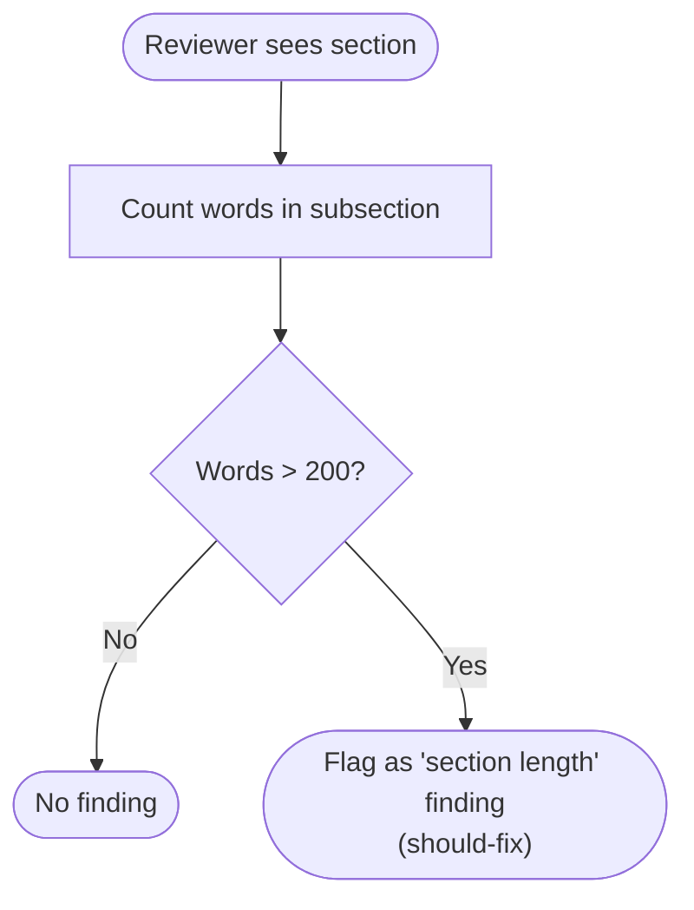
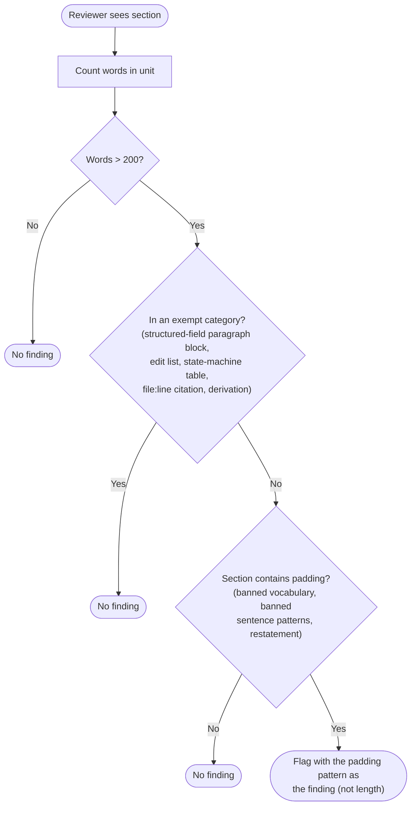

# Carve ExecPlan structured-field episodes out of the section length cap — Final Design

## Overview

The `house-style.md § Structural rules` "Section length cap" rule said every `###` subsection was ≤ 200 words, and the Phase C `review-workflow-writing-style` agent applied it indiscriminately. ExecPlan episode blocks under `## Episodes` use the labeled-bold-paragraph template defined in `conventions-execution.md §2.2` (`**What was done:**`, `**What was discovered:**`, `**What changed from the plan:**`, `**Key files:**`, `**Critical context:**`, plus three failed-step labels) and are sized to cross-track impact per `episode-format-reference.md § Episode length rule` ("no hard line limit"). On every track with substantive cross-track impact the episodes crossed 200 words, the reviewer flagged them, and the orchestrator DROPped the finding because the suggested remediation (split into H4 subsections) broke the template. That was the YTDB-899 symptom.

The implemented design replaces the hard cap with a soft cap plus a categorical exemption list. Five shapes of template-bound content are exempt from the cap regardless of length: ExecPlan structured-field paragraph blocks under `## Episodes`, edit-list subsections, full state-machine tables, file:line citation blocks, and multi-step derivations under `design-mechanics.md`. For non-exempt prose, the reviewer applies a padding-based judgment: a >200-word section is a finding only when it also contains banned vocabulary, banned sentence patterns, or restatement. Length alone is not a finding.

The canonical clause lives at `.claude/output-styles/house-style.md § Structural rules` as two bullets: "Section length cap exception" and "Padding-based finding criterion". The same wording propagated to every other declarative restatement of the rule across the codebase: the self-check entry in `house-style.md § Self-check` step 7; four sites in `.claude/agents/review-workflow-writing-style.md` (frontmatter `description:`, key rules list, review criteria block, output-format template); `CLAUDE.md` line 102 (always-loaded house-style activation paragraph, compressed during Phase C to a brief pointer at the canonical clause); `.claude/skills/code-review/SKILL.md` line 313 (the `/code-review` agent-dispatch list, compressed during Phase C to sibling shape).

Two back-references in `.claude/workflow/episode-format-reference.md § Episode length rule` and `.claude/workflow/conventions-execution.md §2.2` land near the template's home so a reader approaching from the template side finds the exemption. Four Tier-A pointer sites in `.claude/workflow/commit-conventions.md`, `.claude/workflow/step-implementation.md`, `.claude/workflow/implementer-rules.md`, and `.claude/workflow/episode-format-reference.md` carried verbatim "≤200-word section cap" text and were rewritten during Phase C to "soft section length cap with template-bound exemptions" — they label the rule by reference, not by restatement.

The rest of this document covers the reviewer's decision flow before and after the change (Workflow), the exemption category list with its unit-of-evaluation tie-breaker (Exemption categories), and the padding-based finding criterion for free-form prose (Padding-based finding criterion).

## Workflow

### Before: hard cap, indiscriminate enforcement

The reviewer counted words on every subsection and flagged any over the threshold. The orchestrator handling the finding had to decide whether the suggested remediation ("split or trim") was feasible. For template-bound content the remediation broke the template, so the orchestrator DROPped and the cycle repeated on the next track.

### After: soft cap with exemption and padding-based judgment

The reviewer first asks a structural question: is this unit template-bound? When the answer is yes, the cap does not apply. When the answer is no, the reviewer asks a quality question: is this section padded? The finding, when one fires, points at the padding pattern, not the length. Length is reframed as a heuristic trigger for closer review, not the metric being enforced. The "unit" framing — added during Phase C as a tie-breaker — replaces the original "section" framing so the reviewer scores each labeled block independently inside a mixed-content parent (see Exemption categories below for the rule).

## Exemption categories

**TL;DR.** Five shapes of template-bound content where every paragraph is load-bearing and the structure itself enforces compression are exempt from the length cap regardless of length: ExecPlan structured-field paragraph blocks under `## Episodes`, edit-list subsections, full state-machine tables, file:line citation blocks, and multi-step derivations under `design-mechanics.md`. The unit of evaluation is the smallest labeled block containing the prose, so a mixed-content parent contributes one unit per labeled block.

The exemption list names content shapes where every paragraph is load-bearing and the structure itself enforces compression:

1. **ExecPlan structured-field paragraph blocks under `## Episodes`** — the labeled-bold-paragraph template from `conventions-execution.md §2.2` / `episode-format-reference.md`. Covers all template labels: `**What was done:**`, `**What was discovered:**`, `**What changed from the plan:**`, `**Key files:**`, `**Critical context:**` (completed-step variant); plus `**What was attempted:**`, `**Why it failed:**`, `**Impact on remaining steps:**` (failed-step variant; `**Key files:**` is shared). Length is sized to cross-track impact per the episode-format rule.
2. **Edit-list subsections.** `design-mechanics.md` content where every line names a file, method, or call site to touch. Every bullet earns its place.
3. **Full state-machine tables.** Content in `design.md` or `design-mechanics.md` where every row is a state transition. Compression would lose rows.
4. **File:line citation blocks.** `design-mechanics.md` content where the load-bearing content is the citation set. Compression would lose pointers.
5. **Multi-step derivations under `design-mechanics.md`.** Long-form rationale that the `design.md` tier compressed to a TL;DR + mechanism overview. The mechanics tier is where derivations have room.

The list is non-exhaustive but covers the templates the workflow defines today. Future template additions land by matching an existing category name or by explicit addition.

### Unit of evaluation

The reviewer scores the smallest labeled block containing the prose, not the `##` parent. A `## Episodes` parent containing one exempt structured-field block plus one non-exempt free-form block is scored as two units: the structured-field block exempt, the free-form block subject to the soft cap. Without this rule a single non-exempt paragraph nested under an exempt parent would inherit the exemption and bypass the cap entirely. The tie-breaker was added during Phase C track-level review when the gap surfaced on the change itself.

### Edge cases / Gotchas

- A free-form prose section that *looks* template-shaped but is not bound to a template (no labeled-paragraph contract, no edit-list shape) does not fall under category 1. The structural check requires the content to be template-bound, not just label-styled.
- A short episode block (50 words, found nothing unexpected) is also exempt. The rule applies regardless of length; the exemption is structural, not length-conditional.
- Categories 2-5 are conditioned on the file. Edit lists inside a top-level `design.md` section do not get the category 2 exemption; they belong in `design-mechanics.md`. The file boundary is part of the structural check.

### References

- D-records: D1, D2, D3
- Invariants: A Phase C reviewer encountering a >400-word structured-field block produces no length finding. Mixed-content parents are scored block by block, not section by section.

## Padding-based finding criterion

**TL;DR.** When prose outside the exempt list exceeds 200 words, the reviewer flags it only if the section also contains banned vocabulary, banned sentence patterns, or restatement. The trigger is the quality pattern, not the count. A 350-word section whose every sentence carries a distinct claim passes; a 250-word section with hedging or negative-parallelism patterns fires a finding cited against the quality pattern.

The reviewer applies a padding-based judgment for free-form prose. A section exceeding 200 words is a finding only when the section also contains one or more of:

- **Banned vocabulary.** Tier 1-4 lists in `house-style.md § Banned vocabulary`.
- **Banned sentence patterns.** `house-style.md § Banned sentence patterns` (negative parallelism, sycophantic openers, throat-clearing, closing phrases, trailing hedges, prompt-restating, knowledge-cutoff disclaimers).
- **Restatement.** Same content expressed twice in different words (close to `house-style.md § Elegant variation`), or a paragraph that adds no information beyond the previous one (the self-check step 10 check).

The finding's description points at the padding pattern, not the word count. The remediation is to cut the padded content, which naturally brings the section under the cap. The failure mode this guards against is a 350-word section whose every sentence carries a distinct claim being flagged because someone counted words. That outcome is now structurally impossible: without padding, no finding.

### Edge cases / Gotchas

- A section that exceeds 200 words and contains *only* one banned-vocabulary instance still produces a finding, but the suggested remediation is "replace the banned word," not "trim the section." The finding format is preserved; the framing shifts.
- A section that exceeds 200 words with no padding pattern but also no clear cross-track-impact justification is a judgment call. The reviewer defaults to "no finding." False negatives on length-alone-without-padding beat the recurring DROP cycle the hard cap produced.
- The 200-word threshold stays as a heuristic trigger. The reviewer does not check shorter sections for padding under this rule (padding in <200-word sections is caught by the other house-style rules already).

### References

- D-records: D1
- Invariants: Length alone is not a finding for any section.
