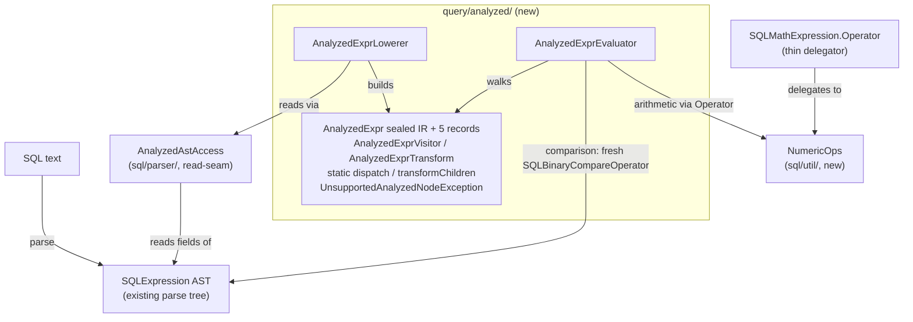

# Analyzed-expression substrate (S0) — Architecture Decision Record

## Summary

YouTrackDB had no analyzed form for SQL expressions: the `SQL*` parse-tree classes under
`core/.../sql/parser/` served at once as the raw AST, the analyzed form, the optimizer surface,
and the runtime evaluator. This slice adds `AnalyzedExpr` — a small Java 21 sealed-interface
intermediate representation (a data-only expression tree) that lives alongside the parse tree —
plus the four pieces that operate over it: a static-dispatch visitor and structural-sharing
transform framework, a lowering pass that converts the covered AST subset to the IR, a runtime
evaluator over the IR, and a shared `NumericOps` promotion engine extracted from the AST so both
evaluators compute arithmetic the same way.

It is slice 0 of the YTDB-901 umbrella. It ships behind no flag with no live executor consumer;
its sole acceptance criterion is round-trip parity — for every covered SQL fragment,
`lower(parse(sql)).evaluate(row, ctx)` equals `parse(sql).execute(row, ctx)` — with no existing
test changed. The first consumer is wired by a later slice (YTDB-916); later slices port the
optimizer rewrites onto the IR.

What was built matches the planned shape. The implementation surfaced a set of as-built
corrections to the original design (the `NumericOps` signature is keyed by the AST operator enum,
the comparison evaluator constructs fresh operator instances rather than reusing the AST's, the
field walk drops a dead field, and a new same-package read-seam was needed to reach the parse
nodes) — all recorded below.

## Goals

- Add an `AnalyzedExpr` IR the optimizer and evaluator can read instead of the parse tree, as the
  substrate every later YTDB-901 slice builds on. **Met.**
- Make arithmetic single-homed so the AST and IR evaluators cannot drift on promotion edge cases.
  **Met** — the whole numeric-promotion engine moved into `NumericOps`; the AST enum became a
  thin delegator.
- Prove the IR path correct against the AST oracle by round-trip parity, with no existing test
  changed. **Met** — the parity suite holds on every matrix row, and the existing math-test suite
  stayed green after the extraction.
- Keep the live AST arithmetic path perf-neutral. **Met for the S0 gate** (existing math tests
  green); runtime measurement is deferred to the first slice with a live consumer (YTDB-916's
  LDBC JMH gate), as planned — S0 has no consumer to measure.

## Constraints

- **No existing test may change.** Held. The `NumericOps` extraction preserved the AST math
  semantics exactly, except for two deliberate edge-case repairs on already-broken paths, each
  pinned by a new test: `Short op BigDecimal` now computes a value (previously threw
  `ClassCastException`), and `Date ± non-numeric` now throws `IllegalArgumentException` instead of
  `NullPointerException`.
- **Greenfield, additive only.** The new package `core/.../query/analyzed/` and the new
  `core/.../sql/util/NumericOps.java` did not exist on the base branch; the lowering pass reads
  many AST classes but modifies none beyond the `NumericOps` delegation and an additive
  same-package read-seam.
- **One-directional package dependency.** The IR layer depends on the parser layer
  (`query.analyzed → sql.parser`), never the reverse. The read-seam that reaches parse-node fields
  was placed in the parser package and takes only parser/`java` types, so it cannot induce a back
  edge.

## Architecture Notes

### Component Map

- **`query/analyzed/` (new package).** The sealed `AnalyzedExpr` with its five nested record
  variants (`Var`, `Const`, `BinaryOp`, `UnaryOp`, `FuncCall`), the `AnalyzedExprVisitor<T>` /
  `AnalyzedExprTransform` framework with centralized static `dispatch` and `transformChildren`,
  the `AnalyzedExprLowerer`, the `AnalyzedExprEvaluator`, and the `UnsupportedAnalyzedNodeException`
  lowering-failure type.
- **`NumericOps` (`sql/util/`, new).** The whole numeric-promotion engine lifted out of
  `SQLMathExpression.Operator`. The AST enum's `apply` family and the new evaluator both route
  arithmetic through it, so promotion is single-homed.
- **`AnalyzedAstAccess` (`sql/parser/`, new).** A same-package, all-static read-seam exposing the
  package-private/protected parse-node fields the lowerer needs but that have no public getter. It
  takes parser types and returns parser/`java` types only, keeping the dependency edge
  one-directional.
- **`SQLMathExpression` (modified).** `Operator.apply(...)` became a thin delegator into
  `NumericOps`; the typed-pair overloads and per-constant entries stayed declared on the enum so
  the existing math-test gate still binds to them.

### Decision Records

Numbering is retained from planning for traceability; only decisions restated here are cited
elsewhere. Each notes its actual outcome.

- **D1 — Sealed-interface IR with five record variants.** Implemented. The five variants ship as
  nested records inside `AnalyzedExpr.java` (following an existing sealed-record idiom in the
  codebase). Correction: this is **not** the codebase's first sealed type — precedents exist
  (`StorageReadResult`, `SqlCommandExecutionResult`) — but it is the first in the SQL/query layer.
- **D2 — Visitor as an interface; one static `switch` dispatch, no `accept` on nodes.**
  Implemented. `AnalyzedExpr.dispatch` holds the one exhaustive `switch` (no `default`); each
  `visitX` call after it is a direct monomorphic call.
- **D3 — Single `evaluate(Result, CommandContext)` overload.** Implemented. An `Identifiable`-only
  caller arriving in a later slice wraps its input via the static
  `wrap(Identifiable, DatabaseSessionEmbedded)` adapter, so it too evaluates through the
  collation-applying path.
- **D4 — `Cast` variant dropped from S0 scope.** Implemented (omitted). The grammar has no
  `CAST(x AS T)` form; type coercion is method-call syntax that lowers through `FuncCall`, so a
  `Cast` variant would have no consumer.
- **D5 — `NumericOps` at a neutral `sql/util/` location both layers can depend on.** Implemented.
  Placing it inside `query/analyzed/` would force a back edge from the parser package; `sql/method/`
  already means typed method dispatch.
- **D5-R — Whole-enum extraction (not the narrow `+ - * /` paths).** Implemented. Correction to the
  inventory: the per-constant `apply(Object, Object)` exists on all twelve enum constants as a
  delegator (not one shared fallback), and the five typed-pair overloads stayed declared on the
  enum — only the implementations moved into `NumericOps`. Moving the overloads off the enum was
  rejected as a gate-weakening edit, since the existing math-test suite binds to them.
- **D6 / D6-R — `Var` carries a `List<String>` name path; S0 lowers single-segment `Var`s only.**
  Implemented. A multi-segment path (`p.name`) is out of subset and throws, deferred to a later
  slice. The `List<String>` shape is kept for the future range-table-resolved reference model.
- **D7 — `UnsupportedAnalyzedNodeException extends CommandExecutionException`.** Implemented. The
  parent has no `(Class)` constructor, so the exception renders the unsupported class name into its
  message; it also carries the copy constructor every `CoreException` subclass provides
  (`CommandExecutionException extends CoreException`) so the framework can re-wrap while preserving
  the concrete type.
- **D8 — `AnalyzedExprTransform` with structural sharing.** Implemented. `transformChildren`
  returns the same instance (reference identity) for an unchanged subtree, rebuilding only the path
  from a change to the root; `FuncCall` lazily allocates its argument list on the first change.
- **D9 — Recurse-into-children defaults on `AnalyzedExprTransform`, none on the base visitor.**
  Implemented. This is the one place the I3 compile-time guarantee does not reach: a new variant
  default-recurses silently through a transform pass, so variant addition carries an explicit audit
  obligation.
- **D10 — Parenthesis: recurse on the grouping payload, throw on subquery / CASE.** Implemented.
  No `Paren` IR variant exists; the IR nesting already encodes grouping.
- **D11 — Comparison evaluator replicates the AST's `SQLBinaryCondition.evaluate` sequence.**
  Implemented, with a mechanism correction: the evaluator does **not** reuse the AST's held operator
  instance (the lowerer discards it; the IR `BinaryOp` carries only the operator enum constant).
  It constructs a fresh `SQLBinaryCompareOperator` of the same concrete class per IR constant
  (`new SQLEqualsOperator(-1)`, `new SQLNeOperator(-1)`, and so on). Parity holds by **class
  identity** — these operators are stateless. The collate transform and the EQ/NE session
  difference are reproduced by running each operator's own `execute` branch.
- **D12 — Structural precedence-climbing fold.** Implemented. The lowerer reproduces the AST's
  precedence-and-associativity nesting structurally; all value semantics come from `NumericOps` at
  evaluate time, never from the fold.
- **D14 — Field-walk is exhaustive-or-throw over the union-style AST.** Implemented, with two
  corrections. The recognized in-subset fields are `isNull`, `booleanValue`, `booleanExpression`,
  and `mathExpression`; `literalValue` is **dropped** from the recognized set because it is dead on
  the SQL parse path (private, written only by other lowering / deserialize / copy paths), so it
  falls to the throw-default. The inherited `SimpleNode.value` field is non-null on the parse path
  but is never a dispatch key (the walk keys on the typed field), so the throw-default covers it
  regardless. Both keep invariant I2 robust to field-set gaps.
- **D15 — The AST `evaluate(Identifiable)` collation skip is a deliberate inconsistency the IR
  unifies.** Implemented. The single `Result` overload applies collation uniformly, so an
  `Identifiable`-only caller wrapped through the adapter gains collation where the AST
  `Identifiable` path skipped it — an observable, deliberate behavior change for later slices.
  Attribution correction: the ~12 production callers are on the polymorphic **base**
  `SQLBooleanExpression.evaluate(Identifiable, ctx)`; the concrete `SQLBinaryCondition` override has
  no direct callers, so the later-slice audit must search the base method. Validated when the
  WHERE/`FilterStep` slice (YTDB-916) and the `SecurityEngine` slice (YTDB-922) wire that path.
- **D16 — "Fast path need not mirror" is scoped to S0.** Implemented. The S0 evaluator targets the
  AST's slow comparison path only, which is correct because S0 has no live consumer. The first
  hot-path slice must reproduce the AST's evaluation fast paths (`tryInPlaceComparison` and `AND`/
  `OR` short-circuit, the latter being correctness, not just performance) or it regresses the most
  common filter shapes.
- **D17 — The extraction touches the live AST arithmetic hot path; perf-neutrality rests on the
  dispatch chain staying intact.** Implemented. Correction: the object-level entry is a **three-hop**
  chain for nine of the twelve constants (not two as originally stated). The lift-and-shift adds
  only monomorphic static calls that inline, introducing no new virtual indirection. Runtime
  measurement is deferred to the first live-consumer slice's LDBC JMH gate.
- **D18 — `levelZero` identifiers are out of subset and throw.** Implemented. A top-level function
  call (including the iteration functions `any()` / `all()`, whose property-iteration semantics the
  IR comparison evaluator does not model), `@this`, and inline collections all hit the
  throw-default; `FuncCall` comes only from a method-call modifier.
- **D19 — Every functional slice under YTDB-901 extends per-functionality JMH benchmark coverage.**
  Carried forward, blanket from the first live-consumer slice on. S0 itself stays on its correctness
  gate, having no live consumer to measure.
- **D20 — `AnalyzedAstAccess` same-package read-seam (new).** Emerged during implementation. The
  parse-node fields the lowerer needs have no public getters, and the generated parser classes are
  off-limits to edit. A `final` all-static accessor class placed in the parser package exposes the
  seven needed fields, taking parser types and returning parser/`java` types only — so the
  `query.analyzed → sql.parser` dependency stays one-directional and no back edge is introduced.

### Invariants & Contracts

- **I1 — Round-trip parity.** For every covered fragment, the lowered-and-evaluated value is
  `Objects.equals` to the AST's `execute` value, including null and type-coercion outcomes. The AST
  is the oracle; a divergence is a real evaluator or `NumericOps` bug.
- **I2 — No silent fallback.** Lowering an unsupported shape throws
  `UnsupportedAnalyzedNodeException`; it never returns a partial tree. A successful `lower` therefore
  means full IR coverage of the input — the contract later consumers rely on.
- **I3 — Exhaustive dispatch.** A new IR variant is a compile-time break for the dispatcher's
  `switch` and every direct `AnalyzedExprVisitor<T>` implementation. The one gap is
  `AnalyzedExprTransform` (D9), whose recurse defaults let a new variant pass through silently —
  covered by the variant-addition audit obligation.
- **Read-only `FuncCall.args()`.** By convention, not record-enforced: a rebuilt argument list is
  unmodifiable, an unchanged one is returned by reference. Consumers must not mutate it.

### Integration Points

- **`NumericOps` ↔ `SQLMathExpression.Operator`.** The AST enum delegates its `apply` family into
  `NumericOps`; the evaluator routes IR arithmetic through the same enum's object-level `apply`
  (mapping the IR `BinaryOperator` to the AST `Operator`), so the two evaluators share one promotion
  engine. The evaluator uses the object-level entry, not the direct widening entry, because the
  object-level path carries the null-propagation, `Date ± Long`, and `String`-concatenation
  semantics the parity rows require.
- **`AnalyzedAstAccess` ↔ the parser.** The lowerer reaches non-public parse-node fields only
  through this seam; later slices that extend lowering read the AST the same way.
- **The `wrap(Identifiable, …)` adapter.** The forward seam for the first hot-path consumer: an
  `Identifiable`-only caller evaluates through the collation-applying `Result` path without the
  evaluator growing a second overload.

### Non-Goals

- No live executor consumer in S0 — the substrate ships unused; the first consumer is a later slice.
- No `Cast` variant, no bind-parameter lowering, no multi-segment `Var`, no `levelZero` top-level
  function calls, no subquery / CASE — all out of the S0 subset and throw.
- No fast-path comparison or boolean short-circuit in the S0 evaluator — slow-path only, deferred to
  the first hot-path slice.

## Key Discoveries

- **Arithmetic must route through the AST enum's object-level `apply`, not the direct widening
  entry.** The direct `apply(Number, Operator, Number)` widening entry throws on a null operand and
  skips `Date ± Long` and `String` concatenation, so routing IR arithmetic through it would turn the
  null-propagation and `Date + Long` parity rows red. The object-level `apply(Object, Object)` is
  the parity-faithful entry.
- **Lifting code out of a JaCoCo-excluded package surfaces latent coverage debt.** The promotion
  arms were never coverage-measured while they lived in the excluded `sql/parser/` package; moving
  them to `sql/util/` (not excluded) measured them for the first time and forced an arm-by-arm test
  suite. Future extractions out of the parser package should expect the same.
- **JJTree parse-node fields are unreachable through public getters, and the generated classes are
  off-limits.** The same-package read-seam is the dependency-preserving way in; it is the pattern
  later slices reuse to read the AST.
- **`SQLExpression.literalValue` is dead on the SQL parse path.** It is written only by other
  lowering / deserialize / copy paths, so a substrate slice can drop it from the field walk;
  exposing it is a concern for the slice that lowers those other paths.
- **The collation unification is an observable behavior change, not a transparent refactor.** Once a
  later consumer evaluates through the unified `Result` path, a case-insensitive-collated comparison
  or security predicate begins matching case-insensitively where the AST `Identifiable` path did
  not. The consumer slice must validate the switch and search the base `evaluate(Identifiable, ctx)`
  method (the override has no callers).
- **The JaCoCo report is not produced by a plain test run.** The report goal must regenerate the XML
  from a fresh execution before the coverage gate reads current numbers.
- **Invariant guards must throw, not assert.** The evaluator's single-segment-`Var` and non-empty-
  `FuncCall`-args invariants are enforced with `IllegalStateException`: a Java `assert` is a no-op
  without `-ea`, so it would let a broken lowering contract produce a wrong value or a late opaque
  crash instead of failing fast.

## Adversarial gate verdicts

The pre-code decision/assumption challenge ran as a gate on the research log at the planning
boundary and cleared before any code landed. It ran four iterations: the first returned NEEDS
REVISION (two blockers, four should-fix), and the remaining three held PASS after the blockers were
resolved (blockers-resolved-then-passed). The final iteration ran as the verdict-producer variant
over the child-issue batch and passed with all prior findings verified.

## Token usage telemetry

Snapshot from this worktree's sessions over its lifetime (N=28 sessions across 221 transcripts).

### Tool mix — share of total session context

| Component             | Share |
|-----------------------|------:|
| `Read` tool results   | 66.5% |
| `Bash` tool results   | 5.6% |
| `Grep` tool results   | 0.3% |
| `Edit` tool results   | 0.3% |
| Other tool results    | 6.1% |
| Prompts and output    | 21.2% |

### Top files by share of `Read` token consumption

| File                                            | Share of Read |
|-------------------------------------------------|--------------:|
| docs/adr/ytdb-915-analyzed-expression/_workflow/design.md | 10.2% |
| <outside-worktree>                              | 8.6% |
| .claude/output-styles/house-style.md            | 8.0% |
| docs/adr/ytdb-915-analyzed-expression/_workflow/plan/track-3.md | 5.2% |
| docs/adr/ytdb-915-analyzed-expression/_workflow/plan/track-4.md | 5.2% |
| .claude/workflow/implementer-rules.md           | 4.7% |
| docs/adr/ytdb-915-analyzed-expression/design-final.md | 4.7% |
| docs/adr/ytdb-915-analyzed-expression/_workflow/plan/track-2.md | 4.6% |
| docs/adr/ytdb-915-analyzed-expression/_workflow/research-log.md | 4.3% |
| docs/adr/ytdb-915-analyzed-expression/_workflow/plan/track-1.md | 4.1% |

Generated by `.claude/scripts/measure-read-share.py` against
`~/.claude/projects/-home-andrii0lomakin-Projects-ytdb-analyzed-expression/`.
