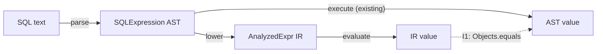
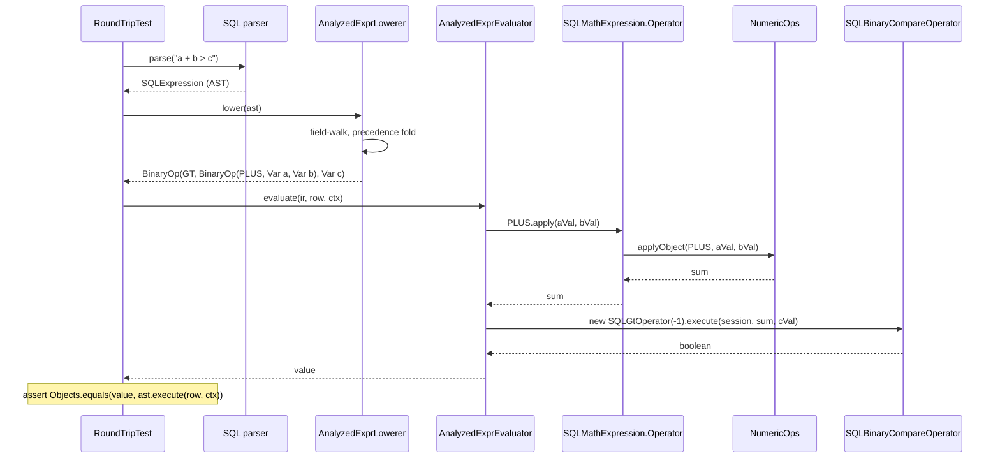

# Analyzed-expression substrate (S0) — Final design

This document records the analyzed-expression substrate (issue YTDB-915) **as built**. It
is for contributors who maintain the SQL layer (`core/.../sql/parser/`) and will read or
extend the analyzed tree in later slices. It assumes familiarity with the `SQL*` parse-node
shapes, `CommandContext` / `Result` evaluation, and Java 21 sealed types and records.

## Overview

YouTrackDB had no analyzed form for SQL expressions. The `SQL*` parse-tree classes under
`core/.../sql/parser/` are the raw AST, the analyzed form, the optimizer surface, and the
runtime evaluator all at once: optimizer rewrites live as methods on parse nodes
(`SQLBooleanExpression.flatten`, `mergeUsingAnd`), and executor steps embed AST fragments
directly. Every later decision routes through the parse tree.

This slice adds `AnalyzedExpr`: a small sealed-interface **intermediate representation** (IR —
a data-only expression tree the optimizer and evaluator read instead of the parse tree) that
lives alongside the AST. It is slice 0 of the YTDB-901 umbrella; it builds the substrate and
ships behind no flag, with no live executor consumer. A later slice wires the first consumer;
later slices still port the optimizer rewrites onto the IR.

The substrate's core is a Java 21 sealed interface with five immutable record variants (`Var`,
`Const`, `BinaryOp`, `UnaryOp`, `FuncCall`). Sealing lets the compiler enforce an exhaustive
`switch` over the variant set, so the nodes need no `accept(visitor)` method; each visitor call
is then a direct (monomorphic) call.

Over that sealed type the slice builds five pieces, in `core/`:

- A visitor / transform framework (`query/analyzed/AnalyzedExprVisitor`,
  `AnalyzedExprTransform`).
- A lowering pass (`query/analyzed/AnalyzedExprLowerer`) that converts the covered AST subset to
  `AnalyzedExpr`, plus a same-package read-seam (`sql/parser/AnalyzedAstAccess`) that reaches the
  parse nodes' non-public fields.
- A runtime evaluator (`query/analyzed/AnalyzedExprEvaluator`) over that IR.
- A `NumericOps` helper (`sql/util/NumericOps`) holding the numeric-promotion engine, so the AST
  evaluator and the new evaluator share one engine.
- A lowering-failure exception (`query/analyzed/UnsupportedAnalyzedNodeException`).

Acceptance is **round-trip parity**: for every covered SQL fragment,
`lower(parse(sql)).evaluate(row, ctx)` equals `parse(sql).execute(row, ctx)`, with no existing
test changed.

The document is structured as: Core Concepts, then Class Design and Workflow diagrams, then four
reader-journey Parts — the substrate, the lowering pass, the evaluator, and verification.

## Core Concepts

This design rests on six load-bearing ideas. Each is named here and used without re-definition
in the Parts that follow.

**Sealed IR with record variants.** `AnalyzedExpr` is a sealed Java interface permitting exactly
five immutable record variants. The variants carry data only — equality, hashing, and accessors
come from record defaults, no behavior. It replaces the abstract-class-plus-subclasses idiom the
AST uses (`SQLBooleanExpression` plus its subclasses), where each node carries its own
`evaluate` / `execute` behavior. → Part 1 §"Sealed IR and exhaustive dispatch".

**Static visitor dispatch.** A visitor is an interface (`AnalyzedExprVisitor<T>`) with one
`visitX` method per variant; a single static `AnalyzedExpr.dispatch(expr, visitor)` carries the
one `switch` over the sealed type and calls the right `visitX`. The nodes have no
`accept(visitor)` method. It replaces the classic Visitor pattern's per-node virtual `accept`
call. → Part 1 §"Sealed IR and exhaustive dispatch".

**Structural sharing.** A rewrite pass (`AnalyzedExprTransform`) that changes one subtree returns
the *same instance* for every unchanged node, rebuilding only the nodes on the path from the
change to the root. "Same" is reference identity (`==`), not value equality. It replaces nothing
in the AST (the AST has no transform framework); it is the shape later optimizer passes will use.
→ Part 1 §"Transform passes and structural sharing".

**`NumericOps`.** A neutral `final` all-static class at `core/.../sql/util/` that owns the
numeric-promotion engine — typed-pair widening, per-operator null handling, `Date + Long`, and
`String` concatenation. The promotion *implementations* are lifted whole out of
`SQLMathExpression.Operator`; the enum keeps its public `apply` signatures as thin delegators
into `NumericOps`, and the new evaluator delegates to the same `NumericOps` through that enum
entry. With one home for promotion, AST/IR drift on edge cases is structurally impossible. →
Part 3 §"NumericOps: one shared promotion engine".

**Structural precedence fold.** The AST stores arithmetic as a flat list of operands and
mixed-precedence operators and resolves precedence at evaluate time. The lowerer reproduces that
precedence-and-associativity nesting *structurally* to build a correctly-nested `BinaryOp` tree;
it reproduces only the *nesting*, never the value arithmetic (that comes from `NumericOps`). It
replaces nothing — the AST keeps its own fold untouched. → Part 2 §"Precedence fold: flat AST
list to nested BinaryOp".

**Round-trip parity.** The acceptance test: lowering then evaluating a covered SQL fragment
yields a value `Objects.equals` to what the AST's own `execute` yields, including null and
type-coercion outcomes. The AST is the reference; a divergence is a real evaluator or
`NumericOps` bug, never a reason to relax the test. → Part 4 §"Round-trip parity and the test
matrix".

## Class Design

```mermaid
classDiagram
    class AnalyzedExpr {
        <<sealed interface>>
        +dispatch(AnalyzedExpr, AnalyzedExprVisitor~T~)$ T
        +transformChildren(AnalyzedExpr, AnalyzedExprTransform)$ AnalyzedExpr
    }
    class Var {
        <<record>>
        +path() List~String~
    }
    class Const {
        <<record>>
        +value() Object
    }
    class BinaryOp {
        <<record>>
        +op() BinaryOperator
        +left() AnalyzedExpr
        +right() AnalyzedExpr
    }
    class UnaryOp {
        <<record>>
        +op() UnaryOperator
        +operand() AnalyzedExpr
    }
    class FuncCall {
        <<record>>
        +name() String
        +args() List~AnalyzedExpr~
    }
    class AnalyzedExprVisitor~T~ {
        <<interface>>
        +visitVar(Var) T
        +visitConst(Const) T
        +visitBinaryOp(BinaryOp) T
        +visitUnaryOp(UnaryOp) T
        +visitFuncCall(FuncCall) T
    }
    class AnalyzedExprTransform {
        <<interface>>
        +visitVar(Var) AnalyzedExpr
        +visitConst(Const) AnalyzedExpr
        +visitBinaryOp(BinaryOp) AnalyzedExpr
        +visitUnaryOp(UnaryOp) AnalyzedExpr
        +visitFuncCall(FuncCall) AnalyzedExpr
    }
    class AnalyzedExprLowerer {
        <<final, all-static>>
        +lower(SQLExpression)$ AnalyzedExpr
        ~lowerBoolean(SQLBooleanExpression)$ AnalyzedExpr
    }
    class AnalyzedAstAccess {
        <<final, all-static>>
        +booleanValue(SQLExpression)$ Boolean
        +isNull(SQLExpression)$ boolean
        +booleanExpression(SQLExpression)$ SQLBooleanExpression
        +number(SQLBaseExpression)$ SQLNumber
        +inputParam(SQLBaseExpression)$ SQLInputParameter
        +parenExpression(SQLParenthesisExpression)$ SQLExpression
        +parenStatement(SQLParenthesisExpression)$ SQLStatement
    }
    class AnalyzedExprEvaluator {
        <<final>>
        +evaluate(AnalyzedExpr, Result, CommandContext)$ Object
        +wrap(Identifiable, DatabaseSessionEmbedded)$ Result
    }
    class NumericOps {
        <<final, all-static>>
        +applyObject(Operator, Object, Object)$ Object
        +apply(Number, Operator, Number)$ Number
    }
    class UnsupportedAnalyzedNodeException {
        +UnsupportedAnalyzedNodeException(Class)
    }

    AnalyzedExpr <|.. Var
    AnalyzedExpr <|.. Const
    AnalyzedExpr <|.. BinaryOp
    AnalyzedExpr <|.. UnaryOp
    AnalyzedExpr <|.. FuncCall
    AnalyzedExprVisitor <|-- AnalyzedExprTransform
    AnalyzedExprEvaluator ..|> AnalyzedExprVisitor
    AnalyzedExprLowerer ..> AnalyzedAstAccess : reads AST fields
    AnalyzedExprEvaluator ..> NumericOps : arithmetic via Operator.apply
    UnsupportedAnalyzedNodeException --|> CommandExecutionException
```



The diagram shows the artifact groups the slice delivers and how they relate. `AnalyzedExpr` is
the sealed root, and the five records are **nested inside `AnalyzedExpr.java`** (not separate
files); the two static helpers on it (`dispatch`, `transformChildren`) carry the dispatch switch
and the recurse-and-rebuild logic once, so individual visitors and passes never re-write them.
`AnalyzedExprVisitor<T>` is the generic visitor interface the evaluator implements directly (so
the evaluator must enumerate every variant — exhaustiveness, Part 1). `AnalyzedExprTransform`
extends it with `AnalyzedExpr` as the return type and carries recurse-into-children defaults.

`AnalyzedExprLowerer` reads the AST through `AnalyzedAstAccess`, a same-package read-seam in
`sql/parser/` (covered below). `NumericOps` sits in a separate package (`sql/util/`) that both
the AST and the evaluator depend on; the evaluator reaches it **through the AST's
`Operator.apply(Object, Object)` entry**, not by calling `NumericOps` directly (Part 3 explains
why). `UnsupportedAnalyzedNodeException` extends the existing `CommandExecutionException` so
lowering failures surface as ordinary SQL execution-time errors. The `BinaryOperator` /
`UnaryOperator` tags carried by `BinaryOp` / `UnaryOp` are the IR's own small enums (`+ - * /`
and the six comparisons for binary; `NOT` for unary); they are not the AST's
`SQLMathExpression.Operator`.

## Workflow



The flowchart shows the two evaluation paths that round-trip parity (invariant I1) compares. The
existing path (`parse → AST.execute`) is the reference. The new path (`parse → lower → evaluate`)
is what the slice adds. For every SQL fragment in the covered subset the two values must be
`Objects.equals`. Lowering either produces a complete IR tree or throws
`UnsupportedAnalyzedNodeException` (invariant I2, no silent fallback); it never returns a partial
tree. The sequence below traces a single covered comparison through the new path.



The sequence shows the load-bearing reuse points. Arithmetic value semantics come from the shared
`NumericOps` (Part 3), reached **through the AST enum's object-level `apply` entry**, not from a
fold the lowerer reimplements. For the comparison, the evaluator constructs a **fresh
`SQLBinaryCompareOperator` of the same concrete class the AST would use** (here `SQLGtOperator`)
and calls its `execute`; because these operators are stateless, the reconstructed instance runs
the AST's exact code, so parity holds by class identity (Part 3). The lowerer's field-walk visits
each recognized field of the AST node and throws on any field outside the covered subset: a
covered fragment lowers fully, an out-of-subset shape throws rather than being mis-read (Part 2).

# Part 1 — The substrate

The substrate is the sealed `AnalyzedExpr` IR plus the visitor / transform framework and the
lowering-failure exception. It is greenfield (new package `core/.../query/analyzed/`) and has no
dependency on the lowering pass, evaluator, or verification work.

## Sealed IR and exhaustive dispatch

**TL;DR.** `AnalyzedExpr` is a sealed interface with five record variants carrying data only. A
visitor is an interface with one `visitX` per variant; a single static
`AnalyzedExpr.dispatch(expr, visitor)` carries the one `switch`. There is no `accept(visitor)` on
the nodes. Sealing makes adding a sixth variant a compile-time break across the dispatcher and
every direct visitor — the exhaustiveness that invariant I3 names.

The AST's incumbent idiom is an abstract base class with concrete subclasses
(`SQLBooleanExpression` plus its subclasses), where each node carries its own behavior and
dispatch is a virtual method call. For an IR that later optimizer passes will walk repeatedly in
a long pipeline, that per-node virtual call is megamorphic — the JVM cannot resolve it to one
target, so it stays an indirect call. Sealing the IR removes that cost: the compiler knows the
closed set of five variants, so a `switch` over the sealed type is exhaustive without a
`default`, and the JIT lowers it to a table jump. After the switch resolves, each
`visitor.visitX(x)` is a direct monomorphic call. Two types already use the
sealed-interface-permitting-record idiom (`StorageReadResult`, `SqlCommandExecutionResult`); this
is the first in the SQL / query layer.

The five variants and the data each carries:

- `Var(List<String> path)` — an unresolved lexical name path. The lowerer produces
  **single-segment** `Var`s (`["name"]`) only; a multi-segment path such as `p.name` is out of
  subset and throws `UnsupportedAnalyzedNodeException`, deferred to a later slice (D6-R). The
  `List<String>` shape is kept for a later slice that will replace `Var` with
  range-table-resolved references (names bound to their `FROM`-clause source) — which is why the
  slice does not bake in a resolution model.
- `Const(Object value)` — a literal value (integer, string, boolean, or a negative number whose
  `sign` flag the parser already folded into the literal at parse time, so it arrives as one
  negated value rather than a unary-minus node).
- `BinaryOp(BinaryOperator op, AnalyzedExpr left, AnalyzedExpr right)` — `+ - * /` and the six
  comparisons `= != < <= > >=`. `BinaryOperator` is the IR's own enum, not the AST's
  `SQLMathExpression.Operator`.
- `UnaryOp(UnaryOperator op, AnalyzedExpr operand)` — boolean `NOT` only. There is no unary-minus
  variant in practice: the grammar has no `-expr` node for non-literals (unary minus is a
  parse-time `sign` flag folded into a numeric literal), so lowering never produces a
  unary-minus node. `UnaryOperator` has the single constant `NOT` (the AST's `SQLNotBlock`).
- `FuncCall(String name, List<AnalyzedExpr> args)` — a function call. Method-call coercion syntax
  (`.asInteger()`) is structurally a function call and lowers here.

The YTDB-915 issue body lists a sixth variant, `Cast`; the slice ships without it. YouTrackDB's
grammar has no `CAST(x AS T)` form (the grammar file `YouTrackDBSql.jjt` has no `CAST`
production), so type coercion is written as method-call syntax — `.asInteger()`, `.asDate()` —
carried on the AST's method-call modifier node (`SQLModifier.methodCall`) and structurally a
function call. Those already lower through
`FuncCall`. A dedicated `Cast` variant would have to carry a target-type tag — the type a `CAST`
would name, e.g. `INTEGER` or `DATE` — that no lowering or evaluator path would read, so it would
be a variant with no consumer. A later slice can add `Cast` if explicit `CAST` grammar or an
optimizer rewrite ever needs it.

Dispatch is centralized. `AnalyzedExpr.dispatch(expr, visitor)` is a static helper holding the
one `switch (expr)`:

```text
switch (expr) {
  case Var v        -> visitor.visitVar(v)
  case Const c      -> visitor.visitConst(c)
  case BinaryOp b   -> visitor.visitBinaryOp(b)
  case UnaryOp u    -> visitor.visitUnaryOp(u)
  case FuncCall f   -> visitor.visitFuncCall(f)
}
```

One `visitX` per variant makes the IR's shape explicit and self-documenting. The base
`AnalyzedExprVisitor<T>` carries **no** default methods, so a direct implementer (the evaluator;
any future pass that returns something other than `AnalyzedExpr`) must enumerate every variant.
Adding a sixth variant then breaks the dispatcher's `switch` and every direct implementer at
compile time — invariant I3.

### Edge cases / Gotchas

- Adding a sixth variant is an intended compile-time break, not a regression. The sealed `switch`
  (no `default`) and the no-default base visitor are what force the audit of every dispatch site.
- The relaxation for transform passes (defaults that recurse into children) is scoped to
  `AnalyzedExprTransform` and never touches the base `AnalyzedExprVisitor<T>` — see the next
  section.

### Decisions & invariants

- D1 (sealed-interface IR with five record variants), D2 (visitor as interface; static `switch`
  dispatch, no `accept`), D4 (`Cast` variant dropped from scope), D6 (`Var` carries a
  `List<String>` name path), D6-R (lowerer produces single-segment `Var`s only; multi-segment
  paths throw, deferred to a later slice).
- Invariants: I3.

## Transform passes and structural sharing

**TL;DR.** `AnalyzedExprTransform extends AnalyzedExprVisitor<AnalyzedExpr>` is the rewrite-pass
shape for later optimizer slices. Its five `visitX` methods carry recurse-into-children defaults;
the base visitor carries none. A static `transformChildren(expr, t)` recurses one level and
returns the *same instance* when no child changed (reference identity), constructing a new parent
record only when a child changed.

Optimizer passes typically rewrite one subtree and leave the rest untouched. Rebuilding the whole
tree on every pass would allocate `O(tree-size)` per pass. Structural sharing avoids that: a fold
that fires at depth 10 of a 50-node tree allocates only the new node plus the parent chain back
to the root; every untouched subtree is returned by reference. Centralizing the
identity-comparison logic in one `transformChildren` helper keeps individual passes from
re-implementing (and subtly mis-implementing) it.

Worked example. A pass folds the constant subexpression in `(1 + 2) * x`, whose IR is
`BinaryOp(STAR, BinaryOp(PLUS, Const 1, Const 2), Var x)`. The pass's `visitBinaryOp` on the
inner `PLUS` node returns a new `Const 3`. `transformChildren` on the outer `STAR` node then sees
one child changed (the left went from the `PLUS` node to `Const 3`) and one child unchanged
(`Var x`), so it allocates one new `BinaryOp(STAR, Const 3, Var x)` and reuses the original
`Var x` instance by reference. Nothing below `Var x` is rebuilt. Had no child changed — say a
pass that matches only `FuncCall` ran over this tree — `transformChildren` would return the
original `STAR` node itself, and the pass would allocate nothing.

`transformChildren`'s per-variant behavior:

- Leaf variants (`Var`, `Const`) return self.
- Compound variants (`BinaryOp`, `UnaryOp`) recurse into each child; if every child returns by
  reference unchanged, return the parent by reference; otherwise build one new parent record.
- `FuncCall` lazily allocates its new argument list on the first changed element, so an unchanged
  argument list is never copied. The accumulator runs in three steps:
  1. It starts `null`, doubling as the "started accumulating?" flag.
  2. The first changed argument copies the unchanged prefix into a fresh list.
  3. At the end a still-`null` accumulator means no argument changed, so the call is returned
     unchanged; otherwise the rebuilt list is wrapped `Collections.unmodifiableList` so the new
     node stays read-only.

The five default `visitX` on `AnalyzedExprTransform` do exactly this: leaf variants return self,
compound variants call `transformChildren`. A pass that rewrites one variant overrides only that
`visitX` and inherits pass-through for the rest. This removes four boilerplate overrides per pass
while leaving the base `AnalyzedExprVisitor<T>` strict, so the evaluator (which implements the
base visitor) still breaks at compile time on a new variant. This is the same shape as Calcite's
`RexShuttle`, Spark's `TreeNode.transform`, and ANTLR's `*BaseVisitor`.

### Edge cases / Gotchas

- Equality is by reference identity, not value. A transform that reconstructs an `equals`-but-
  distinct copy of an unchanged node counts as "changed" and defeats the sharing. The rule for
  transform authors: return the input reference when no change applies; never rebuild an equal
  copy.
- Adding a new IR variant requires an explicit audit of every transform pass. A pass needing
  special handling for the new variant fails *silently* (default-recurses) rather than at compile
  time, because the defaults make every variant pass-through-able. This is the one place the I3
  compile-time guarantee does not reach — make the audit part of the variant-addition checklist.
  (The slice ships no transform pass, so a mechanical reflective backstop is a later-slice
  obligation.)

### Decisions & invariants

- D8 (`AnalyzedExprTransform` with structural sharing), D9 (recurse-into-children defaults on
  `AnalyzedExprTransform`, none on the base visitor).
- Invariants: I3.

## Lowering failures: UnsupportedAnalyzedNodeException

**TL;DR.** `UnsupportedAnalyzedNodeException(astNode.getClass())` is thrown for any AST shape
outside the covered subset; it extends the existing `CommandExecutionException`. Carrying the
unsupported AST class name gives an actionable diagnostic.

Lowering happens in the same logical phase as execution preparation, and
`CommandExecutionException` is the established base for SQL execution-time errors, so an
unsupported-node failure surfaces the same way other execution-time failures do. Extending
`BaseException` would be less specific; extending `ParseException` would put the failure on the
wrong (parser-side) layer. `CommandExecutionException` has no `(Class)` constructor, so the
exception renders the class name into the message and passes it to `super(String)`. It also
carries a copy constructor `(UnsupportedAnalyzedNodeException)` that calls `super(exception)`.
That copy constructor exists because `CommandExecutionException` extends `CoreException` — the
abstract grandparent base of the SQL/core exception hierarchy — and every `CoreException` subclass
carries a copy constructor so the framework can re-wrap an exception while preserving its concrete
type. The type is the mechanism behind invariant I2: a successful `lower(...)` return means full IR
coverage of the input, because the only alternative to a complete tree is a throw.

### Edge cases / Gotchas

- The exception carries the AST node's class, not its rendered text, so the diagnostic names the
  unsupported *shape* (e.g. `SQLJson`) rather than echoing user SQL.

### Decisions & invariants

- D7 (`UnsupportedAnalyzedNodeException extends CommandExecutionException`).
- Invariants: I2.

# Part 2 — The lowering pass

Lowering converts the covered AST subset to `AnalyzedExpr`. It depends on Part 1 (it produces IR
types) and is the heaviest piece because it owns three non-obvious mechanisms:

- an exhaustive-or-throw field walk over a union-style AST (see *Field-walk* below);
- transparent recursion through parenthesis grouping (see *Parenthesis*);
- a structural precedence fold over the AST's flat operator list (see *Precedence fold*).

`AnalyzedExprLowerer` is a `final` all-static class; its public entry is `lower(SQLExpression)`,
with a package-visible `lowerBoolean(SQLBooleanExpression)` for same-package callers (such as the
lowering test) that
have a boolean expression directly.

## The AST read-seam: AnalyzedAstAccess

**TL;DR.** Several of the parse-node fields the lowerer must read are `protected` or
package-private with no public getter. `AnalyzedAstAccess` is a `final` all-static class in
`sql/parser/` that exposes seven read-only accessors for exactly those fields, so the lowerer
reaches them without editing the generated parse-node classes — and the dependency edge stays
`query.analyzed → sql.parser`, never the reverse.

The lowerer lives in `query/analyzed/` and reads the AST to build the IR. Most fields it needs
already have public getters (`SQLExpression.getMathExpression()`,
`SQLBaseExpression.getIdentifier()`, and so on), which it calls directly. But a handful of fields
are not publicly readable: `SQLExpression.isNull`, `.booleanValue`, `.booleanExpression`;
`SQLBaseExpression.number`, `.inputParam`; `SQLParenthesisExpression.expression`, `.statement`.
The JJTree-generated parse nodes expose these only at package or protected visibility with no
getter. Editing the generated classes is off-limits (they are regenerated from the grammar), so a
**same-package** accessor is the only way to read them.

`AnalyzedAstAccess` supplies exactly those seven reads and nothing more. It is deliberately
one-directional: every method takes an `sql.parser` AST node and returns an `sql.parser` or
`java` type, naming no `query.analyzed` type. So the seam does not create a back-edge from the
parser package to the analyzed package — the dependency stays `query.analyzed → sql.parser` (the
lowerer depends on the AST). It is `final`, has a private constructor, and holds no state: it adds
no behavior to the AST, it only reads.

`SQLExpression.literalValue` is deliberately **not** exposed. It is `private` (unreadable even
from this same-package accessor) and is never assigned on the SQL `Expression()` parse path —
only the GQL-lowering, deserialize, and copy paths write it. Since it is dead on the lowerer's
only input, the lowerer never reaches for it; a hypothetically-set `literalValue` falls to the
field-walk's throw-default (below). Exposing it is a concern for the GQL-lowering slice.

### Edge cases / Gotchas

- The seam is read-only by construction: every method is a field read, none mutates the AST.
- Adding a future field read means adding one more accessor here, keeping the cross-package read
  surface enumerable in one place.

### Decisions & invariants

- D14 (the lowerer reaches non-public parse-node fields through a one-directional same-package
  read-seam).
- Invariants: I2.

## Field-walk: exhaustive-or-throw over the union AST

**TL;DR.** `SQLExpression` is union-style — a fixed field set with one field non-null per
instance. The lowerer field-walks the recognized in-subset fields and throws
`UnsupportedAnalyzedNodeException` on anything else, so invariant I2 (a successful `lower` means
full coverage) holds by construction regardless of which fields a future parser change adds.

`SQLExpression` is not a class hierarchy the lowerer can dispatch on; it is one class with a bag
of fields, exactly one non-null per parsed expression. The covered subset is four typed fields,
checked in order in `lower(...)`:

1. `isNull` → `Const(null)`.
2. `booleanValue` (a `TRUE` / `FALSE` literal) → `Const(Boolean)`.
3. `booleanExpression` → `lowerBoolean(...)`.
4. `mathExpression` → `lowerMath(...)`.

Anything else — `rid`, `arrayConcatExpression`, `json`, a set `literalValue`, or any field a
future parser change adds — hits the `default` and throws. The walk does not assume the recognized
fields are the complete set: defaulting to throw-on-unknown is what makes I2 robust to the field
set changing as the parser evolves. The inherited `SimpleNode.value` field is **not** a dispatch
key. The generated parser mirrors the chosen typed field into `value`, but a recognized typed
field is always co-present alongside it. So the walk keys on the typed field, and the
throw-default covers any stray non-null `value` regardless.

`lowerMath` then descends into one of three math-node shapes:

- A `SQLBaseExpression` leaf (number / identifier / string / bind parameter, optionally with a
  modifier) → `lowerBase`.
- A `SQLParenthesisExpression` grouping → `lowerParenthesis` (next section).
- A generic `SQLMathExpression` carrying the flat operand/operator lists → `foldArithmetic` (the
  precedence fold, two sections down). A single-operand node is unwrapped by the parser to its
  sole child, so a generic node reaching here always carries at least two operands and exactly one
  fewer operator; `lowerMath` rejects any other list shape as out of subset.

`lowerBase` resolves the leaf shapes:

- `number` (a `SQLNumber`) → `Const`. A negative literal lowers to a negative `Const` (the `sign`
  flag is folded into the concrete `SQLInteger` / `SQLFloatingPoint` value; the base
  `SQLNumber.getValue()` returns `null`, so the value is read through the polymorphic override).
- `inputParam` (a bind parameter `?` / `:name`) → throw. Bind parameters are not lowered in this
  slice; their IR representation is settled in a later slice and no current consumer depends on
  it.
- `string` / character literal, optionally with a method-call modifier → `Const`, or `FuncCall`
  for the method call.
- `identifier` (a `SQLBaseIdentifier`) → `lowerIdentifier`.

`lowerIdentifier` covers only the single-segment `suffix` column shape. A `SQLBaseIdentifier` has
exactly one of `levelZero` (a `SQLLevelZeroIdentifier`) or `suffix` (a `SQLSuffixIdentifier`)
non-null. A single-segment `suffix` column → `Var(List.of(name))`; a `suffix` carrying a single
method-call modifier → `FuncCall` (the method name is the call name, the base value its first
argument). The `levelZero` form is out of subset and throws: it carries a top-level function call
(including the iteration functions `any()` / `all()`), the `@this` self reference, or an inline
collection (`[..]`) — semantics the IR does not reproduce. `any()` / `all()` in particular carry
property-iteration semantics — `SQLBinaryCondition`'s `evaluateAny` / `evaluateAllFunction`
branches. The IR comparison evaluator reproduces only the element-wise scalar comparison after
applying the column's collation, so it does not model that iteration.
So `FuncCall` comes solely from a method-call modifier (`SQLModifier.methodCall`), never from a
top-level `levelZero` function call. A multi-segment column path (`p.name`) surfaces as a chained
modifier (`modifier.getNext() != null`) and throws, deferred to a later slice (D6-R).

Boolean `NOT` lowers in `lowerBoolean` from `SQLNotBlock` (fields `sub`, `negate`):
`SQLNotBlock(negate=true, sub)` → `UnaryOp(NOT, lower(sub))`; `negate=false` is a transparent
pass-through to `lower(sub)`. A `SQLNotBlock` with a `null` sub throws the contract's typed
failure rather than NPE-ing in the recursion, keeping the boolean entry's "throw, never anything
else" promise total.

### Edge cases / Gotchas

- The throw-default is the safety net for any AST field the recognized set misses
  (`SimpleNode.value` is the known example), so a field-set gap degrades to a throw, never to a
  wrong value.
- Bind parameters throw by design; do not mistake the open future-slice question (dedicated
  `Param` variant vs evaluate-time threading) for a blocking gap.

### Decisions & invariants

- D6 (`Var` name path from the flattened identifier), D6-R (single-segment only; multi-segment
  paths throw, deferred to a later slice), D7 (out-of-subset fields throw
  `UnsupportedAnalyzedNodeException`), D14 (field-walk is exhaustive-or-throw; `value` is not a
  dispatch key), D18 (`levelZero` identifiers — top-level `functionCall` incl. `any()` / `all()`,
  `@this`, inline collections — are out of subset and throw; `FuncCall` comes only from
  method-call modifiers).
- Invariants: I2.

## Parenthesis: recurse on grouping, throw on subquery

**TL;DR.** A parenthesized arithmetic expression like `(a + b) * c` is in the covered subset.
`SQLParenthesisExpression` carries two mutually-exclusive payloads: `expression` (pure grouping)
and `statement` (a subquery). The lowerer lowers the grouping form by recursing —
`lower(expression)` — and throws when `statement != null`. No `Paren` IR variant exists.

Parentheses are the user's precedence-override mechanism, so `(a + b) * c` is one of the most
common precedence inputs; treating every parenthesis as a throw-case would make round-trip parity
(I1) unsatisfiable on it. The grouping wrapper is transparent at evaluate time — the AST's
`expression` form delegates straight to `expression.execute(...)` — so recursing through it
reproduces the AST exactly. The IR tree's nesting already encodes grouping, so a dedicated `Paren`
variant would be redundant and later optimizer passes would only have to strip it. The two
payloads are read (through `AnalyzedAstAccess`) with `statement != null` checked **first**, since
reading them in the wrong order would mis-handle a subquery as grouping; a `statement` (subquery)
throws, and a null inner expression also throws.

### Edge cases / Gotchas

- The two payloads are mutually exclusive; the lowerer checks `statement != null` first and
  throws, otherwise recurses into `expression`.

### Decisions & invariants

- D10 (`SQLParenthesisExpression`: recurse on `expression`, throw on `statement`).
- Invariants: I1, I2.

## Precedence fold: flat AST list to nested BinaryOp

**TL;DR.** `SQLMathExpression` stores arithmetic as a flat list — `childExpressions` plus
`operators` — at one nesting level, and resolves precedence at evaluate time, not parse time. The
lowerer reproduces that precedence-and-associativity nesting *structurally* to build a
correctly-nested `BinaryOp` IR tree. The AST's own fold (`calculateWithOpPriority` /
`iterateOnPriorities`) is left untouched. All *value* semantics come from the shared `NumericOps`
at evaluate time, never from this fold.

The grammar rule `MathExpression()` collects all operators of mixed precedence into one flat list
at one nesting level (`FirstLevelExpression() ( <op> FirstLevelExpression() )*`), then
`unwrapIfNeeded()` collapses a single-child node to its child. Precedence is resolved at execute
time by a precedence-climbing reduction (`calculateWithOpPriority` → `iterateOnPriorities`, using
`Operator.getPriority()` with a lower number binding tighter, and `<=` left-associative
reduction). If the lowerer copied the flat list naively, round-trip parity would break on any
expression mixing precedence levels.

Worked interleaving — why a naive copy breaks parity. Take `a + b * c`. The AST parses this as one
flat node: `childExpressions = [a, b, c]`, `operators = [PLUS, STAR]`. `STAR` has priority 10
(binds tighter), `PLUS` has priority 20. The AST's reduction folds the tightest-binding operator
first, so it computes `b * c` and then `a + (b * c)`. A naive left-to-right lowering would instead
build `BinaryOp(STAR, BinaryOp(PLUS, a, b), c)` — i.e. `(a + b) * c`. For `a=1, b=2, c=3` the AST
yields `1 + 6 = 7` and the naive tree yields `3 * 3 = 9`. The two diverge, and I1 fails. The
lowerer therefore runs the same precedence-climbing reduction the AST runs.

How the fold works (`foldArithmetic` → `climb`). A single `cursor[0]` index walks the
operand/operator pairs left to right. `climb(left, minPriority)` consumes every operator whose
priority is `<= minPriority` (binds at least as tight as the caller's bound), and for each such
operator it builds the right operand by a **nested climb bounded one step tighter**
(`priority - 1`). That one-step-tighter bound is what makes equal-priority operators
left-associative: a following equal-priority operator is rejected by the inner climb (its priority
is not `<= priority - 1`), so it reduces with the current result on its *left*. The outer call
starts at `Integer.MAX_VALUE` so it admits every operator. Two traces:

- `a + b * c` → `PLUS(a, STAR(b, c))`. The outer climb takes `PLUS` (20 ≤ MAX); its right operand
  is an inner climb bounded at `19`, which admits `STAR` (10 ≤ 19) and yields `STAR(b, c)`.
- `a - b - c` → `MINUS(MINUS(a, b), c)`. The outer climb takes the first `MINUS` (20 ≤ MAX); its
  right operand is an inner climb bounded at `19`, which rejects the second `MINUS` (20 > 19) and
  returns just `b`; the outer loop then takes the second `MINUS`, folding `MINUS(a, b)` on its
  left.

Why reimplement the fold structurally rather than share one fold with the AST. Two folds is the
same drift surface the `NumericOps` extraction (Part 3) eliminates for promotion, so the question
is fair. But sharing penalizes the live path. The AST fold is the *hot* math-eval path
(`iterateOnPriorities` drives every AST math evaluation); the IR fold is *cold* (no IR consumer
until a later slice). A generic fold parameterized by a combiner would inject a
functional-interface call into the hot AST eval loop, and that shared fold would be called with
two different combiner lambdas (the AST's `apply`, lowering's `new BinaryOp`) — so the call site
sees two receiver types (bimorphic), which the JIT cannot collapse to one inlinable target. That
conflicts with the codebase's preference for monomorphic call sites the JIT can inline (the same
preference D1/D2's static dispatch follows). The reimplemented fold is *purely structural*: it
determines nesting only. All value semantics — null sentinel, numeric promotion, `Date + Long`,
`String` concat — come from the shared `NumericOps` at evaluate time. So the duplicated logic is a
textbook precedence-climbing reduction — low risk. The genuine drift surface, promotion, stays
single-homed in `NumericOps`.

### Edge cases / Gotchas

- The fold reproduces *only* nesting. If the lowerer ever reached for a value computation here,
  that would be a second promotion engine and a drift bug; arithmetic values are the evaluator's
  job via `NumericOps`.
- Left-associativity must match the AST's reduction: `a - b - c` is `(a - b) - c`, not
  `a - (b - c)`. The two differ in value, so the test matrix pins it (Part 4).
- A co-located `assert` in `foldArithmetic` restates the two-operands / matching-operator-count
  precondition the sole caller already enforces, so the `get(0)` is provably safe even if a future
  caller is added. (Assert lines are excluded from the coverage gate.)

### Decisions & invariants

- D12 (lowerer builds the nested `BinaryOp` tree by a structural precedence-climbing fold; value
  semantics from shared `NumericOps`).
- Invariants: I1.

# Part 3 — The evaluator

`AnalyzedExprEvaluator` is a `final` class implementing `AnalyzedExprVisitor<Object>` directly (so
it must enumerate every variant) and produces a value for a lowered IR tree. It depends on Part 1
(IR types), Part 2 (lowering produces trees to evaluate), and the `NumericOps` extraction below.
It carries per-evaluation state (the row and command context), so an instance is single-use: the
public static `evaluate(expr, row, ctx)` constructs one and discards it. Its two load-bearing
mechanisms are arithmetic through the shared `NumericOps` and a comparison path that replicates
the AST's exact sequence.

The simple variants resolve directly. `visitConst` returns the literal value. `visitVar` resolves
a single-segment name against the `Result` row, mirroring the AST's
`SQLSuffixIdentifier.execute(Result)` lookup: read the property when present, otherwise fall back
to result metadata / temporary properties, otherwise `null`. The lowering pass produces only
single-segment `Var`s, so `path()` has exactly one element here; a multi-segment `Var` is a
lowering-contract violation and `visitVar` **throws `IllegalStateException`** rather than silently
reading `path().get(0)` through (an `assert` would be a no-op without `-ea` and let the broken
invariant produce a wrong result). `visitUnaryOp` evaluates `NOT` by casting the operand to
`Boolean` and negating — a non-`Boolean` operand is a lowering-contract violation, so a
`ClassCastException` is the right failure rather than a truthiness coercion.

## NumericOps: one shared promotion engine

**TL;DR.** The numeric-promotion engine moves out of `SQLMathExpression.Operator` into a neutral
`final class NumericOps` (private constructor, all-static) at `core/.../sql/util/`. The enum keeps
its public `apply` signatures as thin delegators into `NumericOps`; the new evaluator delegates
through the same enum entry. With one home for promotion, AST/IR drift on edge cases is
structurally impossible.

If the AST and IR evaluators each held their own promotion logic, they would drift on edge cases —
integer-vs-double divide, null propagation, `Date + Long`. A single shared helper makes divergence
impossible. `sql/util/` is a fresh neutral location both layers can depend on; placing `NumericOps`
inside `query/analyzed/` would force a backward dependency from the AST package to a sibling, and
`sql/method/` already means typed method dispatch.

The extraction moves the whole enum's promotion logic, not only the `+ - * /` paths. The
implementations moved into `NumericOps`; the *signatures stayed on the enum* as thin delegators.
`SQLMathExpression.Operator` is an inner enum with 12 constants — `STAR`, `SLASH`, `REM`, `PLUS`,
`MINUS`, three shifts, `BIT_AND`, `XOR`, `BIT_OR`, `NULL_COALESCING` (the numeric argument on each
is its precedence priority). The promotion engine all 12 share has these parts, now living in
`NumericOps`:

- Five typed-pair methods `apply(Operator, T, T)` for `T ∈ {Integer, Long, Float, Double,
  BigDecimal}` — each takes the `Operator` constant explicitly (what was the enum's `this` became
  the first parameter).
- The base object-level `applyObject(Operator, Object, Object)`:
    - null operand → return the other operand;
    - two `Number`s → widen;
    - otherwise → `null`.
- Per-operator object helpers where the operator's null / non-numeric handling differs:
  `plusObject` (`Date ± Long`, `String` concat), `minusObject` (`Date - Long`, `null` as additive
  identity), `xorObject`, `bitOrObject`, `nullCoalescingObject`.
- The widening entry `apply(Number, Operator, Number)` — note the **operator sits in the middle** —
  which widens by the right operand's runtime type and routes to the matching typed-pair method,
  throwing `IllegalArgumentException` on a null operand or an unsupported type combination.
- The private static `toLong` helper for `Date` arithmetic.

What stayed on the enum: each constant keeps its five typed `apply` overrides and its
`apply(Object, Object)`, each a one-line delegator into `NumericOps`. They stayed because the
existing AST math-test suite binds to those enum signatures — keeping them is what lets the
extraction be self-verifying (every AST math test stays green after the bodies move). Note there
is **no** `apply(Number, BinaryOperator, Number)` anywhere: the widening entry is keyed by the AST
`SQLMathExpression.Operator`, never by the IR `BinaryOperator`.

The narrow alternative — extracting only the `+ - * /` paths — was rejected: the other eight
operators invoke the same widening, so the shared widening helper would be split across
`NumericOps` and `Operator`, an unclean seam. Whole-enum extraction gives a clean single home and
the self-verifying gate above. The eight operators outside the IR subset (`REM`, shifts, bitwise,
`NULL_COALESCING`) get extracted but have no IR consumer — that is intended; they keep working
through the AST delegator.

The math semantics the AST tests pin, preserved exactly across the split:

- Integer-divide returns the integer type when the remainder is zero, else widens to `Double`.
- Null propagation: `null + x = x`, `null - x = 0 - x`, `null * x = null`, `null / x = null`.
- `Date + Long` and `Long + Date` produce a `Date`; `Date - Long` produces a `Date` (`Date - Date`
  is not handled by the AST and is out of scope).
- `+` does `String` concatenation when either operand is a `String` (the other is `toString()`-ed).

**How the IR evaluator reaches it — and why through the enum, not directly.** `evaluateArithmetic`
maps the IR `BinaryOperator` to its AST `Operator` (`toArithmeticOperator`) and calls the AST
enum's **object-level** `apply(Object, Object)` — the same entry the AST uses. It does *not* call
`NumericOps.apply(Number, Operator, Number)` directly. The direct widening entry throws on a
`null` operand and handles neither `Date ± Long` nor `String` concat; routing through the enum's
`apply(Object, Object)` is what carries null-propagation, `Date` arithmetic, and concat — the
parity-faithful path. Concretely, `PLUS`/`MINUS` delegate to `plusObject` / `minusObject` (the
`Date` and concat handling), while `STAR` / `SLASH` delegate to `applyObject`, which re-dispatches
into the widening entry. A direct call to the widening entry from the evaluator would turn
null/`Date + Long`/concat parity rows red.

### Edge cases / Gotchas

- The extraction touches the **live** AST arithmetic hot path (`Operator.apply` runs on every AST
  math eval via `iterateOnPriorities`). Perf-neutrality rests on preserving the existing dispatch
  shape: for 9 of the 12 constants the object-level entry is a **three-hop** chain from the enum's
  per-constant `apply(Object, Object)` down to a typed-pair method:
  1. `apply(Object, Object)` → `applyObject` (`PLUS` / `MINUS` instead route through
     `plusObject` / `minusObject` for `Date` arithmetic and concat).
  2. → the widening `apply(Number, Operator, Number)`.
  3. → a typed-pair `apply(Operator, T, T)`.

  The lift-and-shift moves these bodies into the all-static `NumericOps` and adds only monomorphic
  static calls that inline — no new virtual indirection. The acceptance gate is the existing
  math-test suite (e.g. `MathExpressionTest`) staying green after delegation; runtime
  perf-neutrality is measured at the first slice with a live consumer (the YTDB-901 umbrella
  JMH-neutrality requirement), not a standalone run for this slice.
- Two behavioral edge cases shifted **deliberately** during the lift, both on already-failing or
  previously-broken paths, both pinned by tests:
  - `Short op BigDecimal`: the pre-lift `new BigDecimal((Integer) a)` threw `ClassCastException`
    for a `Short` left operand; the new `.intValue()` form widens both `Integer` and `Short`, so
    the case now computes a value — benign because it turns a crash on a previously-broken path
    into a correct result.
  - `Date ± non-numeric`: the pre-lift code raised `NullPointerException` on unboxing; the new
    widening entry's null guard raises `IllegalArgumentException` instead — benign because it is a
    cleaner error on an out-of-scope path (normal `Date ± Long` is unaffected).

### Decisions & invariants

- D5 (`NumericOps` at a neutral `sql/util/` location both packages can depend on; rejected:
  duplicate the logic in the IR evaluator — guarantees drift; place it inside `query/analyzed/` —
  backward dependency; place it under `sql/method/` — that package means typed method dispatch),
  D5-R (whole-enum extraction; the typed and `apply(Object, Object)` signatures stay on the enum
  as per-constant delegators, the implementations move to `NumericOps`), D17 (the extraction
  preserves the existing three-hop dispatch for the 9 multi-hop constants; runtime measurement
  deferred to the first slice with a live consumer).
- Invariants: I1.

## Comparison: replicate the AST sequence

**TL;DR.** The IR comparison evaluator reproduces `SQLBinaryCondition.evaluate(Result, ctx)`'s
exact slow-path sequence: resolve the collate — the per-property comparison transform (for example,
a case-insensitive string compare) — for the left operand's column (falling back to the right) by
reaching its schema property through the `Result`, apply `collate.transform(...)` to
both operands when non-null, then delegate to a **freshly constructed** `SQLBinaryCompareOperator`
of the same concrete class the AST would use. Because the operators are stateless, parity holds by
**class identity** — the IR runs the same code the AST runs.

The tempting shortcut — call the bare static comparison routines — drops two AST nuances and
breaks parity on real inputs.

The first nuance is collation. `Collate` is a per-property comparison transform: a
case-insensitive (`ci`) string property compares `'Foo'` and `'foo'` as equal. The AST applies it
before comparing. The confirmed `SQLBinaryCondition.evaluate(Result, ctx)` slow-path sequence is:

1. Evaluate both operands: `leftVal = left.execute(...)`, `rightVal = right.execute(...)`.
2. Fetch the collate: `collate = left.getCollate(currentRecord, ctx)`, and if null,
   `collate = right.getCollate(currentRecord, ctx)`. `getCollate` is not a field read — it uses
   the `Result` to reach the operand's schema property.
3. If `collate != null`, transform both operands: `leftVal = collate.transform(leftVal)`,
   `rightVal = collate.transform(rightVal)`.
4. Delegate: `operator.execute(ctx.getDatabaseSession(), leftVal, rightVal)`.

A raw static `equals` skips steps 2 and 3, so `name = 'Foo'` against a `ci`-collated `name`
returns `true` in the AST but `false` for the raw call.

The second nuance is session threading. `SQLEqualsOperator.execute` calls
`QueryOperatorEquals.equals(session, left, right)` with the real session;
`SQLNeOperator.execute` calls `!QueryOperatorEquals.equals(null, left, right)` with a **`null`**
session (both confirmed in the operator classes). When the two operands are different types,
`equals` runs them through `PropertyTypeInternal.convert` — a cross-type coercion step — before
the actual compare, and that coercion consults the session. A `null` session changes how the
coercion resolves, so the EQ branch (real session) and the NE branch (`null` session) can produce
different compare results on the same mixed-type operands. Calling one shared `equals(session,
...)` for both operators would feed the same session to both and reproduce the AST only on `=`,
drifting on `!=`.

How the IR reproduces both nuances. The IR `BinaryOp` carries only the operator enum constant —
the lowerer discarded the AST's operator instance, and the IR holds a `Var` (a name path), not an
`SQLExpression`, so the evaluator can call neither the parser's `getCollate` nor its operator
instance directly. It re-implements each:

- **Operator (`comparisonOperator`).** It builds a **fresh** `SQLBinaryCompareOperator` of the
  matching concrete class per IR constant: `EQ → new SQLEqualsOperator(-1)`,
  `NE → new SQLNeOperator(-1)`, `LT → new SQLLtOperator(-1)`, `LE → new SQLLeOperator(-1)`,
  `GT → new SQLGtOperator(-1)`, `GE → new SQLGeOperator(-1)`. The operators are **stateless**, so a
  reconstructed instance runs the AST's exact `execute` body — parity is by class identity, not by
  reusing the AST's object. The `(-1)` is the parser-node-id constructor argument, unused at
  evaluate time (`-1` is the conventional "not parser-built" id). Reconstruction is the *uniform*
  construction path because no shared-instance accessor exists across all six classes
  (`SQLNeOperator` / `SQLGeOperator` have no `INSTANCE`). Both `!=` spellings (`!=`, `<>`)
  collapsed to `NE` during lowering, so `NE` reconstructs `SQLNeOperator` for either spelling —
  behaviorally identical since both AST classes share the same `execute` body. Constructing a
  fresh operator per evaluation runs the AST's exact per-operator branch. That reproduces the EQ/NE
  session difference by construction. It also reproduces the ordering operators' comparison rule:
  `doCompare` returns a three-way sign (negative / zero / positive, like `Comparable.compareTo`)
  that the AST then compares to 0 to decide `<`, `<=`, `>`, or `>=`.
- **Collate (`collateFor`).** It re-implements step 2's single-property resolution directly, tried
  left-operand-first then right. The collate applies only to a `Var` operand (a column reference);
  a literal or computed sub-expression has no column to resolve and returns `null`. For a
  single-segment `Var`, the resolution walks one hop per line, each hop a guard that can short out:

  1. `row.isEntity()` — guard; if false, return `null`.
  2. `(EntityImpl) row.asEntity()` — downcast to the concrete entity.
  3. `EntityImpl.getImmutableSchemaClass(session)` — if `null` (a schemaless row), return `null`.
  4. `SchemaClass.getProperty(name)` — if `null` (an absent column), return `null`.
  5. `SchemaProperty.getCollate()` — the resolved `Collate` (or `null`).

  Each hop is guarded so a schemaless row, an absent class, or an absent column returns a `null`
  collate rather than throwing — the guard-free happy path would NPE/CCE where the AST returns `null`,
  breaking parity. The host types are concrete: `getImmutableSchemaClass` is declared on
  `EntityImpl`, not the public `Entity` interface, so the downcast is required.

The AST resolves a *multi-segment* collate by a runtime link traversal — executing the path prefix
link-by-link, then resolving the terminal property on the terminal record's schema — which a
substrate slice need not reproduce. Collation is not syntactic, so the lowerer cannot carve out
collated comparisons by collation. Path length, though, **is** syntactic. So throwing on a
multi-segment `Var` (D6-R) keeps round-trip parity by construction: the IR evaluates only the
operand shapes it faithfully reproduces.

The slow path is the parity reference. `SQLBinaryCondition.evaluate` also has an in-place
comparison fast path (`tryInPlaceComparison`), but it is parity-equivalent — for any case the slow
path's collation handling would change, the fast path returns `FALLBACK` (null) and the code falls
through to the slow path. So the IR evaluator and the parity tests target the slow path; the IR
*structure* need not encode the fast path at all. Slow-path-only is correct **for this slice**
precisely because it ships with no live executor consumer — there is no production path to
regress, and round-trip parity is the only acceptance criterion. That changes at the first hot-path
slice: when the evaluator is wired into `FilterStep`, it must reproduce the AST's evaluation fast
paths:

- The in-place comparison, including its `FALLBACK` fall-through.
- `AND`/`OR` short-circuit. This one is correctness as well as performance, because eager
  evaluation can throw where the AST short-circuits past it.

`AND`/`OR` are out of this slice's IR operator set today (the comparison and arithmetic operators
are the whole `BinaryOperator` enum), so the short-circuit obligation lands when a later slice
extends lowering to `SQLWhereClause`.

### Edge cases / Gotchas

- Collation cannot be excluded at the expression level: it is a per-property attribute, not
  syntactic, so the subset cannot "skip collated columns". The IR must reproduce the collate
  transform.
- The ordering operators (`< <= > >=`) map to `doCompare(l, r)` compared to 0; delegating to the
  reconstructed operator instance subsumes this mapping too — no separate handling.

### Decisions & invariants

- D3 (single `evaluate(Result, CommandContext)` overload), D11 (IR comparison evaluator replicates
  `SQLBinaryCondition.evaluate` — collate transform plus a freshly constructed parser-operator
  instance of the AST's own class, not bare statics), D6-R (collate fetch pinned to single-property
  resolution; multi-segment `Var` throws, deferred to a later slice), D16 ("fast path need not
  mirror" is scoped to this slice; the first hot-path slice must reproduce the AST evaluation fast
  paths).
- Invariants: I1.

## Evaluator interface: single Result overload

**TL;DR.** The evaluator exposes one `evaluate(expr, row, ctx)` overload over `Result` (the
row-like query projection higher-layer callers operate on, from which a column's schema property —
and so its collation — is reachable). An
`Identifiable`-only caller arriving in a later slice wraps its input in a synthetic entity-backed
`Result` via the `wrap(Identifiable, DatabaseSessionEmbedded)` helper, so it too evaluates through
the collation-applying path. A single overload keeps every visitor from implementing two paths.

The AST carries dual `(Result, …)` and `(Identifiable, …)` overloads for historical reasons. As
the comparison section shows, only the `Result` overload applies collation. The `Identifiable`
overload's skip is a deliberate fast-path choice — the inline author comments mark it intentional.
The schema context the `Result` path uses is reachable from an `Identifiable` too; this overload
simply never reads it. An `Identifiable` is a RID, and loading it yields an `EntityImpl`:

```text
EntityImpl.getImmutableSchemaClass → SchemaClass.getProperty → SchemaProperty.getCollate
```

That is exactly the chain the `Result` path consumes — the skip is a choice, not a missing-context
limitation. The analyzed tree is greenfield and serves higher-layer callers (executor steps,
optimizer passes) that already operate on `Result`, so a single `Result` overload keeps the visitor
simple and unifies the AST's split where one overload applies collation and the other skips it.

This unification is an observable, deliberate behavior change for a later slice: a `ci`-collated
comparison (and a `ci`-collated security predicate) begins matching case-insensitively where the
AST `Identifiable` path did not. The polymorphic base method that carries this — the abstract
`SQLBooleanExpression.evaluate(Identifiable, ctx)` — has roughly twelve production callers,
including `SQLWhereClause` and `SecurityEngine`. The count and callers belong to the **base**
method: the concrete `SQLBinaryCondition` override has no direct callers, so any caller audit must
search the base, not the override. This slice's round-trip parity exercises only the `Result`
overload, so it is unaffected; the divergence is a later-slice concern, validated when the
`FilterStep` / WHERE slice and the `SecurityEngine` slice wire the `Identifiable` path. The
adapter's synthetic-`Result` allocation is trivial, and a hot path that later cannot tolerate the
wrap can grow a second path without breaking existing code.

### Edge cases / Gotchas

- Routing an existing `Identifiable`-only caller through `wrap(...)` is a behavior change, not a
  transparent refactor: collation that the AST `Identifiable` path skipped now applies, so a
  `ci`-collated comparison or security predicate that previously matched case-sensitively starts
  matching case-insensitively. The consumer slice that performs the switch must add a test that
  pins the new case-insensitive outcome and treat the change as observable — never land it as a
  drop-in replacement on the assumption that result equality is preserved.

### Decisions & invariants

- D3 (single `evaluate(Result, CommandContext)` overload), D15 (collation applies uniformly through
  this single overload — the synthetic-`Result` wrap applies the collate transform for the base
  `evaluate(Identifiable)` method's ~12 callers incl. WHERE / `SecurityEngine`, validated by later
  slices).

# Part 4 — Verification and delivery

The substrate ships with no live executor consumer, so its only proof is round-trip parity against
the AST. This Part covers the parity invariant, its test matrix, and the as-built test outcomes.

## Round-trip parity and the test matrix

**TL;DR.** For every SQL fragment in the covered subset, `lower(parse(sql)).evaluate(row, ctx)`
must be `Objects.equals` to `parse(sql).execute(row, ctx)`, including null and type-coercion
outcomes. The AST is the reference; a divergence is a real evaluator or `NumericOps` bug, never a
reason to relax the test.

Parity is the acceptance criterion from the YTDB-915 issue, and it is what lets the slice ship a
substrate with no consumer: the AST's `execute` is the oracle, so the IR path is correct exactly
when it matches. Two further invariants back it. Invariant I2 (no silent fallback): lowering an
unsupported shape throws `UnsupportedAnalyzedNodeException` and never returns a partial tree, so a
successful `lower` means full coverage. Invariant I3 (exhaustive dispatch): a new variant is a
compile-time break for every direct `AnalyzedExprVisitor<T>` implementation.

The table below is the minimum mechanism set the suite pins — the non-obvious lowering and
evaluation mechanisms a naive implementation would get wrong. The suite has 36 test methods total;
these rows are the ones each mechanism maps to.

| Fragment | Mechanism it pins |
|---|---|
| `a + b * c` | Precedence fold: `STAR` binds tighter than `PLUS` (Part 2) |
| `a * b + c` | Precedence fold, operators in the other order |
| `a - b - c` | Left-associative reduction `(a - b) - c`, not `a - (b - c)` |
| `a - b + c` | Mixed same-priority left-associativity |
| `a / b / c` | Integer-vs-double divide widening through `NumericOps` |
| `(a + b) * c` | Parenthesis recursion overrides precedence (D10) |
| `a * (b + c)` | Parenthesis recursion, grouping on the right |
| `ci-column = 'Foo'` (mixed case) | Collation transform in comparison (D11) |
| type-coercing `!=` | NE passes a null session to coercion, EQ the live one (D11) |
| `NOT a = b` (unparenthesized) | `NOT`/`UnaryOp` dispatch and the unparenthesized parse shape |
| `name.asInteger()` (method call) | `FuncCall` lowering from a `SQLModifier` method call |
| `longCol != 1` (cross-type) | NE cross-type coercion / null-session path distinct from the `ci`-collation rows |
| `ci`-column `=` on a schemaless row | Collate guard returns `null` when the row has no schema property |

Each row asserts the lowered IR tree evaluates `Objects.equals` to the AST. The arithmetic rows pin
both the structural fold (Part 2) and the shared promotion engine (Part 3); the parenthesis rows
pin D10; the comparison, `NOT`, and `FuncCall` rows pin the collation, session, coercion, and dispatch
mechanisms of D11.

Parity is a correctness oracle, not a performance one, so it is not the whole verification bar for
the YTDB-901 umbrella that parents this slice. Performance is verified separately and per slice.
Under YTDB-901's umbrella JMH-neutrality requirement, every functional slice extends benchmark
coverage for the functionality it adds — a targeted JMH (Java Microbenchmark Harness)
microbenchmark exercising the eval path(s) it touches. That per-slice microbenchmark stacks on top of the existing LDBC SF1 neutrality gate,
which runs the LDBC social-network workload at scale factor 1 and asserts the change does not
regress its end-to-end timings. This slice itself stays on its correctness
gate, having no live consumer to measure; the blanket per-slice benchmark obligation applies from
the first slice with a live consumer onward (D19).

### Edge cases / Gotchas

- The matrix is the minimum required set, not an exhaustive one. Any covered fragment may be
  tested; these rows pin a mechanism a naive implementation would get wrong.
- Null and `Date + Long` outcomes are part of parity (`Objects.equals` over the produced values),
  so null-propagation rows and a `Date + Long` row belong in the suite even though they are not
  listed above as precedence/collation pins.

### As-built test outcomes

The slice ships four test classes plus additions to the AST math suite. All green:

- `AnalyzedExprTest` — 15/15 (the substrate: dispatch, transform structural sharing, exception).
- `NumericOpsTest` — 24 tests; `MathExpressionTest` — +6 (the shared engine and the two pinned
  behavioral shifts: `Short op BigDecimal`, `Date ± non-numeric`). The changed-code coverage gate
  passes (100% line / 93.6% branch on `NumericOps`).
- `AnalyzedExprLowererTest` — 46/46 (the field walk, parenthesis recursion, precedence fold).
- `AnalyzedExprEvaluatorTest` — 36/36 (the evaluator, including two throw-guard tests for the
  `IllegalStateException` invariant guards on `visitVar` and `visitFuncCall`).

A coverage note for maintainers: the JaCoCo XML is not produced by `mvn test` — `jacoco:report`
must regenerate it. Lifting the promotion bodies out of `sql/parser/` (a package excluded from the
JaCoCo report) into `sql/util/` surfaced latent coverage debt, because the promotion arms had never
been measured inside the parser package.

### Decisions & invariants

- D11 (comparison parity via the replicated AST sequence), D12 (precedence fold parity), D17 (the
  `NumericOps` extraction preserves the existing arithmetic dispatch shape; runtime measurement
  deferred to the first slice with a live consumer), D19 (every functional slice extends
  per-functionality JMH benchmark coverage on top of LDBC neutrality, blanket from the first
  live-consumer slice on).
- Invariants: I1, I2, I3.
