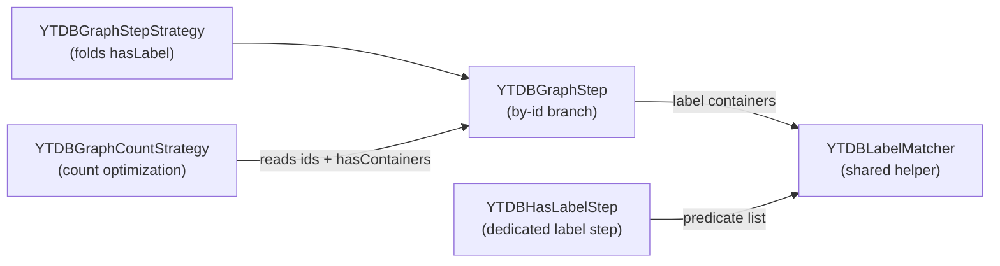

# Polymorphic `hasLabel` on by-id traversals — Architecture Decision Record

## Summary

Gremlin `hasLabel` now honors polymorphism on the by-id traversal path.
`g.V(childId).hasLabel("Parent")` matches a `Child` exactly as the class-scan form
`g.V().hasLabel("Parent")` already did. That was YTDB-1159. The fix covers vertices,
edges, and multi-argument `hasLabel`. A second, independent defect on the same
`V(id).hasLabel(...)` path was fixed alongside it: `g.V(id).hasLabel(X).count()` now
counts only the pinned ids instead of the whole class.

The change adds one shared helper, `YTDBLabelMatcher`, holding the polymorphism-aware
label test, and routes both label-matching call sites through it: the by-id branch of
`YTDBGraphStep.elements()` and `YTDBHasLabelStep.filter()`. The count fix adds a
`getIds().length == 0` guard to `YTDBGraphCountStrategy`'s label-filter rewrite branch.
Both defects were fixed in one commit (`fa590ca9bc`); test coverage on the new by-id
partition logic was extended in a follow-up (`860380ce3a`).

## Goals

- `g.V(childId).hasLabel("Parent")` and `...hasLabel("Grandparent")` return the `Child`;
  the non-polymorphic form returns nothing. Met.
- `g.E(edgeId).hasLabel(superEdge)` returns the edge when polymorphic, nothing when not.
  Met (edges share `elements()` with vertices, so no edge-specific branch was needed).
- `g.V(childId).hasLabel("A","B")` matches when the vertex is a subtype of `A` and the
  query is polymorphic. Met.
- `g.V(id).hasLabel(X).count()` equals `g.V(id).hasLabel(X).toList().size()` on
  multi-vertex data. Met.
- Non-polymorphic queries keep exact label matching. Met (the matcher tests only the
  concrete class when the flag is false).

No goals were descoped.

## Constraints

- The class-scan branch of `YTDBGraphStep` stays unchanged; its polymorphism comes from
  the SQL `FROM <type>` extent, not an in-memory label test.
- Both fixes had to land together, and the count guard could never land before the
  polymorphic matcher. A guard-first order would regress a polymorphic by-id count to 0:
  a skipped count rewrite falls through to the by-id branch, which must already be
  polymorphism-correct. Landing both in one commit satisfied the constraint by
  construction.
- The Gremlin scenario tests run only through the `YTDBProcessTest` suite, which sets up
  the graph provider. A direct `-Dtest` surefire run on the scenario class fails.

## Architecture Notes

### Component Map

- **`YTDBLabelMatcher`** (new) — a stateless static helper. `matchesAny(element,
  predicates, polymorphic)` resolves the schema class once for a `YTDBElementImpl`, tests
  each predicate against the concrete class name, and when polymorphic also against every
  superclass name from `getAllSuperClasses()`; a null schema class returns false;
  non-YouTrackDB elements fall back to `element.label()`. The single owner both label
  paths call.
- **`YTDBGraphStep`** — the by-id branch of `elements()` partitions its `HasContainer`s
  into label (by the `T.label` accessor key) and non-label, routes labels through
  `YTDBLabelMatcher` (AND across containers via `allMatch`), and keeps non-label on
  `HasContainer.testAll`. The class-scan branch is untouched.
- **`YTDBHasLabelStep`** — `filter()` delegates its whole predicate list to
  `YTDBLabelMatcher.matchesAny` instead of inlining the concrete-plus-superclass walk.
- **`YTDBGraphCountStrategy`** — the label-filter branch of `apply()` gained the
  `getIds().length == 0` guard its empty-containers sibling already had, so an id-bearing
  count falls through to normal by-id execution.

### Decision Records

**D1: Shared label-matcher helper instead of duplicating the logic.** Implemented as
planned in `fa590ca9bc`. The root cause was two independent label matchers that drifted:
the by-id branch never gained the polymorphism `YTDBHasLabelStep` already had.
Consolidating the logic in `YTDBLabelMatcher` removes the chance to drift again. The
alternative (inlining the concrete-plus-superclass walk a second time in the by-id
branch) would have reproduced the drift risk. Caveat: any future label-test call site
must route through the helper to stay consistent.

**D2: Helper is a predicate-list static utility, package-neutral.** Implemented as
planned. `matchesAny` takes the predicate **list** (OR semantics) so `YTDBHasLabelStep`
keeps its single superclass walk per element. A standalone utility keeps the by-id step
(under `step.sideeffect`) and the label step (under `step.filter`) from depending on each
other; the matcher lives in `step.filter` and carries no back-reference to either step.
The by-id branch passes each label container's predicate as a one-element list and ANDs
the results across containers. The considered alternatives (a static method on
`YTDBHasLabelStep`, or a per-predicate single-predicate signature) were rejected: the
first creates a cross-step dependency, the second loses the once-per-element superclass
walk. Caveat: per-container calls in the by-id branch walk superclasses once per label
container; multiple `hasLabel` containers on one step are rare, so the cost is bounded.

**D3: Fix the count id-drop with an id guard, not an id-aware count step.** Implemented
as planned in `fa590ca9bc`. With the matcher in place, normal by-id execution already
counts correctly, so skipping the count optimization when ids are present is the minimal
correct change. The alternative (making `YTDBClassCountStep` count an id set) needs new
code; that step counts classes and is already polymorphism-correct through
`countClass(cl, polymorphic)`, confirming the count defect was an id-drop, not a
polymorphism defect. Caveat: an id-bearing count trades a class count for a
fetch-filter-count over the named ids; the id set is bounded by the query.

### Invariants & Contracts

- The by-id branch and `YTDBHasLabelStep` produce identical label-match results for the
  same element, label predicate, and polymorphic flag, for every label predicate shape.
  The key-based partition (discriminating on the `T.label` accessor) guarantees it,
  whereas the class-scan branch's `addCondition`-based classification only recognizes `eq`
  and `within` label predicates.
- Non-polymorphic by-id queries match only the concrete label.
- `g.V(id).hasLabel(X).count()` equals `g.V(id).hasLabel(X).toList().size()` on
  multi-vertex data. The `checkSize` test helper asserts both, so a residual count
  id-drop surfaces as a list-vs-count mismatch.

### Integration Points

- `YTDBGraphStep.elements()` by-id branch calls `YTDBLabelMatcher.matchesAny(...)` for label
  containers.
- `YTDBHasLabelStep.filter()` delegates to `YTDBLabelMatcher.matchesAny(...)`.
- `YTDBGraphCountStrategy.apply()` label-filter branch reads `step.getIds()` and
  `step.getHasContainers()`.

### Non-Goals

- Optimizing non-polymorphic class-scan queries (the existing TODO about propagating a
  non-polymorphic flag to the query engine in `YTDBGraphStep.elements()`).
- Any change to the class-scan branch's behavior.
- Making `YTDBClassCountStep` id-aware.

## Key Discoveries

- The by-id partition keys on the `T.label` accessor, deliberately not the
  `YTDBGraphQueryBuilder.addCondition(...) == LABEL` classification the class-scan branch
  uses. `addCondition` demotes label predicates other than `eq` / `within` (for example
  `has(T.label, neq("Child"))`) to `NOT_CONVERTED`. Keying on the accessor routes every
  label predicate to the matcher, keeping the by-id path consistent with `YTDBHasLabelStep`
  for all predicate shapes.
- `HasContainer.getPredicate()` returns `P<?>`, not `P<? super String>`. The by-id branch
  passes each label container's predicate into the matcher via an unchecked cast wrapped
  in `List.of(...)`, the same cast the fold site in `YTDBGraphStepStrategy` applies. The
  matcher signature was not widened to dodge the warning.
- `YTDBGraphStep.createClassIterator` also reads `~label` containers but discriminates on
  the `YTDBSchemaClass.LABEL` sentinel value, not the key, and serves the schema-class
  meta path. The by-id partition keys on the label accessor and does not interfere with
  it; `createClassIterator` was left unchanged.
- Scoped JaCoCo coverage on the Gremlin scenario tests is not a one-liner. The `coverage`
  profile's `@{jacocoArgLine}` late-binding does not resolve when
  `surefire:test@sequential-tests` runs outside the full lifecycle, and `YTDBProcessTest`
  ignores `-Dgremlin.tests` under the lifecycle `test` / `prepare-package` phases (it runs
  the whole upstream TinkerPop suite). A scoped coverage run must inject the JaCoCo agent
  via `-DargLine` or accept the full-suite cost.

## Token usage telemetry

Snapshot from this worktree's sessions over its lifetime (N=4 sessions across 24 transcripts).

### Tool mix — share of total session context

| Component             | Share |
|-----------------------|------:|
| `Read` tool results   | 60.4% |
| `Bash` tool results   | 10.5% |
| `Grep` tool results   | 0.0% |
| `Edit` tool results   | 0.4% |
| Other tool results    | 2.2% |
| Prompts and output    | 26.5% |

### Top files by share of `Read` token consumption

| File                                            | Share of Read |
|-------------------------------------------------|--------------:|
| <outside-worktree>                              | 11.3% |
| docs/adr/ytdb1159-gremlin-byid-subtype-fix/_workflow/plan/track-1.md | 10.8% |
| core/src/test/java/com/jetbrains/youtrackdb/internal/core/gremlin/gremlintest/scenarios/YTDBHasLabelProcessTest.java | 9.1% |
| .claude/workflow/implementer-rules.md           | 6.5% |
| docs/adr/ytdb1159-gremlin-byid-subtype-fix/_workflow/design.md | 6.3% |
| core/src/main/java/com/jetbrains/youtrackdb/internal/core/gremlin/traversal/step/sideeffect/YTDBGraphStep.java | 4.7% |
| .claude/workflow/track-code-review.md           | 4.2% |
| .claude/workflow/self-improvement-reflection.md | 3.3% |
| core/src/main/java/com/jetbrains/youtrackdb/internal/core/gremlin/traversal/strategy/optimization/YTDBGraphCountStrategy.java | 2.6% |
| docs/adr/ytdb1159-gremlin-byid-subtype-fix/_workflow/implementation-plan.md | 2.5% |

Generated by `.claude/scripts/measure-read-share.py` against
`~/.claude/projects/-workspaces-youtrackdb-ytdb1159-gremlin-byid-subtype-fix/`.
