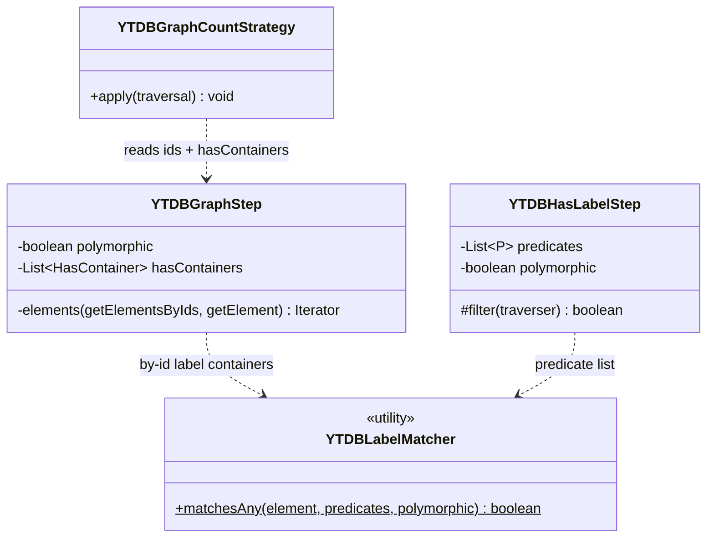
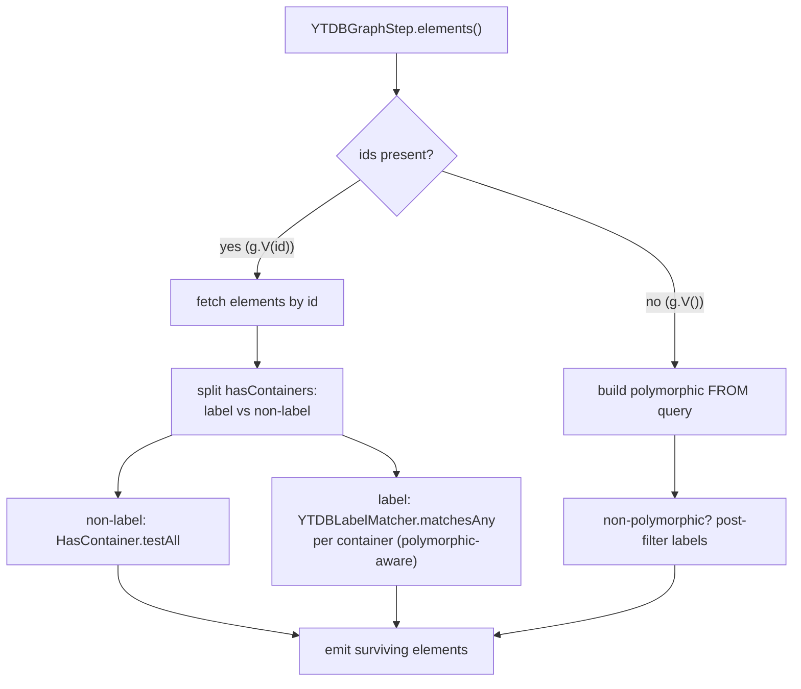

# Polymorphic `hasLabel` on by-id traversals — Design

## Overview

YouTrackDB's Gremlin layer makes a class scan polymorphic: `g.V().hasLabel("Parent")`
returns `Child` vertices because `YTDBGraphStep`'s class-scan branch resolves the
label through a SQL `FROM <type>` extent, which already walks the subtype tree. The
by-id form took a different path. `g.V(childId).hasLabel("Parent")` loads the element
by id and filters it in memory, and that filter used an exact label-string match that
never read the step's `polymorphic` flag, so a `Child` was dropped even though it is a
`Parent`. That was YTDB-1159.

This design makes the by-id branch match labels polymorphically, reusing the same
logic the dedicated `YTDBHasLabelStep` already applies. It also fixes a second,
independent defect on the same `V(id).hasLabel(...)` path: `YTDBGraphCountStrategy`
rewrote `g.V(id).hasLabel(X).count()` into a whole-class count and silently discarded
the id, so the count reflected every `X` in the class instead of the one pinned vertex.

The enabling primitive is a single shared label-matching helper, `YTDBLabelMatcher`,
that both `YTDBHasLabelStep` and the by-id branch call. Two independent label matchers
that drifted apart was the root cause; consolidating them removes the chance to drift
again.

What else changed to fit: the by-id branch separates label containers from the rest
before filtering; `YTDBGraphCountStrategy` gained an id guard that mirrors the guard
its sibling branch already had; `YTDBHasLabelProcessTest` gained edge, multi-argument,
count, property-AND, and chained-`hasLabel` coverage on the by-id path.

The sections below establish the shared concepts and class shape, then walk each of
the two bugs and the test strategy that guards them.

## Core Concepts

This design works with four existing ideas. Each is named and used without
re-definition below; each pairs the idea with the behavior it explains and points
at the section that elaborates it.

**By-id branch.** The path in `YTDBGraphStep.elements()` taken when the step carries
explicit element ids (`g.V(id...)`). It fetches those elements directly and filters
them in memory. This is where the bug lived. → "Bug 1 — by-id `hasLabel` ignores
polymorphism".

**Class-scan branch.** The path taken when the step has no ids (`g.V()`). It builds
a query whose `FROM <type>` extent is polymorphic by default and post-filters only
for non-polymorphic queries, so it already behaves correctly. → "Class Design".

**Polymorphic label match.** Testing a label predicate against an element's concrete
class name and, when the query is polymorphic, every superclass name. `YTDBHasLabelStep.filter()`
did this before the fix; the by-id branch did not. → "Bug 1 — by-id `hasLabel` ignores
polymorphism".

**`hasLabel` folding.** `YTDBGraphStepStrategy` moves a `hasLabel` that directly
follows a GraphStep into that step's `HasContainer` list rather than building a
separate `YTDBHasLabelStep`. This is why the by-id branch, not the dedicated label
step, ends up responsible for matching the label. → "Workflow".

## Class Design

`YTDBLabelMatcher` is the shared helper. Its single static `matchesAny` method answers
one question: does this element satisfy any of these label predicates, given the
polymorphic flag? It holds exactly the logic that lived inline in
`YTDBHasLabelStep.filter()`: for a YouTrackDB element (`YTDBElementImpl`), resolve the
schema class once, test each predicate against the concrete class name, and when the
query is polymorphic also test each predicate against every superclass name returned
by `getAllSuperClasses()`; for any other element type, fall back to a string test
against `element.label()`. The method takes the predicate **list** (OR semantics,
matching `YTDBHasLabelStep`'s `anyMatch`) so the superclass walk runs once per element
regardless of how many labels a single `hasLabel` names. `YTDBHasLabelStep` delegates
its whole predicate list in one call; `YTDBGraphStep`'s by-id branch calls it once per
label container (each container's single predicate wrapped in a one-element list) and
ANDs the results. The helper has no state and no dependency on the step types, so
neither caller pulls the other's package in.

The `element.label()` fallback is never reached on the by-id path — by-id elements
come only from `YTDBVertexImpl` / `YTDBEdgeImpl`, both `YTDBElementImpl` subtypes. It
exists so the helper stays reusable from `YTDBHasLabelStep`, which can receive
non-YouTrackDB traversers mid-traversal.

## Workflow

The diagram shows the fix's shape. The class-scan branch (right) is unchanged: the
`FROM <type>` extent is polymorphic, and the existing `!polymorphic` post-filter
narrows it back for non-polymorphic queries. The by-id branch (left) is what changed.
Before the fix it ran one `HasContainer.testAll` over every container, which applied an
exact string match to label containers regardless of the flag. After the fix it
partitions the containers: non-label containers keep going through
`HasContainer.testAll`, and label containers route through `YTDBLabelMatcher`, which
honors the flag.

The reason the by-id branch carries label containers at all is folding.
`YTDBGraphStepStrategy` walks the traversal and, when a `hasLabel` directly follows
the GraphStep, moves its predicate into the step's `HasContainer` list. This applies
whether or not the step has ids, so `g.V(id).hasLabel("Parent")` arrives at
`elements()` with the label as a container and the ids set, landing in the by-id
branch with the label to match.

## Bug 1 — by-id `hasLabel` ignores polymorphism

**TL;DR.** `g.V(id).hasLabel("Parent")` dropped a `Child` because the by-id branch
matched labels with an exact string test that ignored the polymorphic flag. The fix
splits label containers from the rest and matches labels through the shared
`YTDBLabelMatcher`, which tests the concrete class plus every superclass when
polymorphic. The same branch serves edges and multi-argument `hasLabel`, so the fix
covers `g.E(id).hasLabel(super)` and `g.V(id).hasLabel("A","B")` too.

The by-id branch filtered every loaded element with a single `HasContainer.testAll`
over the whole container list. For a label container that test compares the element's
concrete label string against the predicate, so a `Child` never matched `Parent`. The
class-scan branch avoids this because its polymorphism comes from the SQL extent, not
from an in-memory label test.

The fix partitions the containers once per traversal. The discriminator is the
container **key**: a container is a label container when
`T.label.getAccessor().equals(container.getKey())`, the same test
`YTDBGraphStepStrategy` and `YTDBHasLabelStep` use. This is deliberately not the
`YTDBGraphQueryBuilder.addCondition(...) == LABEL` test the class-scan branch uses
in its own `else`: `addCondition` classifies only `eq` and `within` label predicates
as labels and demotes the rest (for example `has(T.label, neq("Child"))`) to
`NOT_CONVERTED`. Keying on the label accessor instead routes every label predicate to
the matcher, so the by-id path stays consistent with `YTDBHasLabelStep` for all label
predicate shapes, not just the `hasLabel`-generated `eq` / `within` ones.

Non-label containers (property predicates, id predicates) keep their exact
`HasContainer.testAll` semantics. Label containers route through
`YTDBLabelMatcher.matchesAny`, called once per label container per element, combined
with AND across containers (`labelContainers.stream().allMatch(...)`) so
`hasLabel("A").hasLabel("B")` still requires both. An empty label-container list is
vacuously true under `allMatch`, so a by-id traversal carrying only property filters
passes the label gate on those filters alone. Within a single multi-argument
`hasLabel("A","B")`, the predicate is a `within` set, and the matcher tests each
candidate class name (concrete, then superclasses) against that set, so a subtype of
either `A` or `B` matches when polymorphic.

`HasContainer.getPredicate()` returns `P<?>`, so the by-id branch passes each label
container's predicate into the matcher's `List<P<? super String>>` parameter via an
unchecked cast wrapped in a one-element `List.of(...)`, the same cast the fold site in
`YTDBGraphStepStrategy` applies. The matcher signature is not widened to dodge the
warning; the cast is suppressed locally instead.

Edges share the branch: `vertices()` and `edges()` both call `elements()`, so
`g.E(edgeId).hasLabel("SuperEdge")` had the identical defect and got the identical fix.

### Edge cases / Gotchas

- Non-polymorphic by-id queries keep exact matching: the matcher tests only the
  concrete class when the flag is false, so `gn().V(id).hasLabel("Parent")` stays 0
  for a `Child`.
- An element with no schema class returns no match, mirroring `YTDBHasLabelStep`'s
  existing guard.
- A non-YouTrackDB element on the by-id path (defensive, not expected) falls back to
  a string test against `element.label()`, matching `YTDBHasLabelStep`'s else-branch.
- `where(not(hasLabel(...)))` is unaffected: that label test is not folded into the
  GraphStep, so it runs through `YTDBHasLabelStep`, which was already correct.
- `YTDBGraphStep.createClassIterator` also reads `~label` containers, but it
  discriminates on the `YTDBSchemaClass.LABEL` sentinel **value**, not the key, and
  serves the schema-class meta path. The by-id partition keys on the label accessor
  and leaves `createClassIterator` untouched.

### References

- D1: shared `YTDBLabelMatcher` helper instead of duplicated label logic (see `adr.md`)
- D2: helper is a predicate-list static utility, package-neutral (see `adr.md`)
- Invariant 1: the by-id branch and `YTDBHasLabelStep` produce identical label-match
  results for the same element, label predicate, and polymorphic flag, for every label
  predicate shape (the key-based partition guarantees it)

## Bug 2 — count id-drop on `V(id).hasLabel(X).count()`

**TL;DR.** `YTDBGraphCountStrategy` rewrote a single-label-filter GraphStep into a
class count even when the step carried ids, discarding the id filter; the count then
reflected every `X` in the class. The fix requires an empty id set on the label-filter
branch, mirroring the guard its sibling branch already had. With ids present the
optimization is skipped and the traversal counts the by-id elements directly, which
are correct once Bug 1 lands.

The strategy has two branches that produce a class count. The empty-containers
branch (`g.V().count()`) already guarded on `getIds().length == 0`. The label-filter
branch (`g.V().hasLabel(X).count()`) did not, so `g.V(id).hasLabel(X).count()`
matched it, extracted the label, removed every step, and installed a `YTDBClassCountStep`
that counted the whole class. The id was gone.

The fix adds the same `getIds().length == 0` condition to the label-filter branch.
When ids are present the branch no longer fires, no rewrite happens, and the
traversal executes normally: `YTDBGraphStep`'s by-id branch yields the matching
elements (polymorphism-correct after Bug 1) and `CountGlobalStep` counts them. This
is a distinct defect from the polymorphism bug — `YTDBClassCountStep` itself honors
the polymorphic flag through `countClass(cl, polymorphic)`; the defect was that the id
filter was dropped before the count ran.

The defect was masked by single-vertex test data, where the class count and the
single-id count coincide. It reproduces with two `Child` vertices:
`gp().V(childId).hasLabel("Child").count()` returned 2 while `.toList().size()`
returned 1.

**Fix-order constraint.** The fall-through is correct only once Bug 1 is fixed: a
skipped rewrite hands the count to the by-id branch, which must already be
polymorphism-correct. If the Bug 2 guard landed before Bug 1, a polymorphic
`g.V(id).hasLabel("Parent").count()` would fall through to a by-id branch that still
dropped the `Child` and would return 0 — a regression from the accidentally-correct
single-vertex class count. Both fixes therefore landed in the same commit, so the Bug
2 guard never preceded the Bug 1 matcher.

### Edge cases / Gotchas

- `g.V(id).count()` with no `hasLabel` was already correct: empty containers plus
  non-empty ids fails the sibling branch's guard, so no rewrite happens.
- `g.V(id).hasLabel(A).has(prop).count()` was already correct: two containers fail
  the single-container precondition, so the strategy never fires.
- Skipping the optimization for the id case trades a class count for a
  fetch-filter-count over the id set. The id set is bounded by the query, so the
  cost is proportional to the ids the user named, not the class size.

### References

- D3: fix the count id-drop with an id guard, not an id-aware count step (see `adr.md`)
- Invariant 2: an id-bearing count equals the size of its by-id result list on
  multi-vertex data (the count-honors-id test asserts both via `checkSize`)

## Test strategy

**TL;DR.** Extend `YTDBHasLabelProcessTest`. Keep the class-scan, by-id, and has-id
methods that pin the polymorphism matrix. Add a count-honors-id method (the
reproduction kept as a permanent test), an edge by-id method, a multi-argument by-id
method, and the partition-logic methods that guard the label-vs-property split. The
class runs through the `YTDBProcessTest` suite, which sets up the graph provider; a
direct `-Dtest` surefire run on the scenario class fails because the provider is never
initialized.

The matrix methods pin the four corners of the polymorphism matrix: by-id versus
has-id, each polymorphic and non-polymorphic. The additions close the gaps this design
opened:

- **Count honors id** (`testByIdHasLabelCountHonoursId`). Two vertices of the same
  concrete class, one pinned by id; asserts `toList().size()` and `count()` agree at 1,
  for both polymorphic and exact labels. This is the reproduction, kept permanently; it
  failed before the fix on the count assertion and guards Bug 2. It includes the
  polymorphic supertype count case (`gp().V(childId).hasLabel("Parent").count()` with a
  second `Child` present), which would return 0 if the Bug 2 guard ever landed ahead of
  the Bug 1 matcher.
- **Edge by-id** (`testByIdHasLabelEdgePolymorphism`). An edge class hierarchy,
  `g.E(edgeId).hasLabel(superEdge)`, polymorphic returns 1 and non-polymorphic returns
  0. Guards the edge half of Bug 1.
- **Multi-argument by-id** (`testByIdHasLabelMultipleArguments`).
  `g.V(childId).hasLabel("A","B")` where the vertex is a subtype of `A`; polymorphic
  matches, non-polymorphic does not. Guards the `within`-predicate path of Bug 1.
- **Partition-logic methods.** `testByIdHasLabelWithPropertyFilter` (label container
  ANDed with a property container), `testByIdChainedHasLabelIsConjunction`
  (`hasLabel("A").hasLabel("B")` stays an AND, not a union), and
  `testByIdHasLabelSiblingClassDoesNotMatch` (a polymorphic match against a sibling
  class returns nothing) guard the container-partition behavior the by-id branch
  introduced.

### Edge cases / Gotchas

- These scenario tests run only through the suite entry point. A local single-class
  run uses
  `surefire:test@sequential-tests -Dtest=YTDBProcessTest -Dgremlin.tests=<fqcn>`
  after `test-compile`.
- `checkSize` asserts `toList().size()` and `count()` agree, so it doubles as the
  guard that links Bug 1 and Bug 2: once Bug 1 fixes the list path, a remaining
  count id-drop surfaces as a `checkSize` mismatch on multi-vertex data.
- Scoped JaCoCo coverage on these scenario tests is not a one-liner: the `coverage`
  profile's `@{jacocoArgLine}` does not bind under a bare
  `surefire:test@sequential-tests` invocation, and `YTDBProcessTest` ignores
  `-Dgremlin.tests` under the lifecycle `test` / `prepare-package` phases (it runs the
  full upstream TinkerPop suite). A scoped coverage run must inject the JaCoCo agent
  via `-DargLine` or accept the full-suite cost.

### References

- D1: shared `YTDBLabelMatcher` helper instead of duplicated label logic (see `adr.md`)
- D2: helper is a predicate-list static utility, package-neutral (see `adr.md`)
- D3: fix the count id-drop with an id guard, not an id-aware count step (see `adr.md`)
