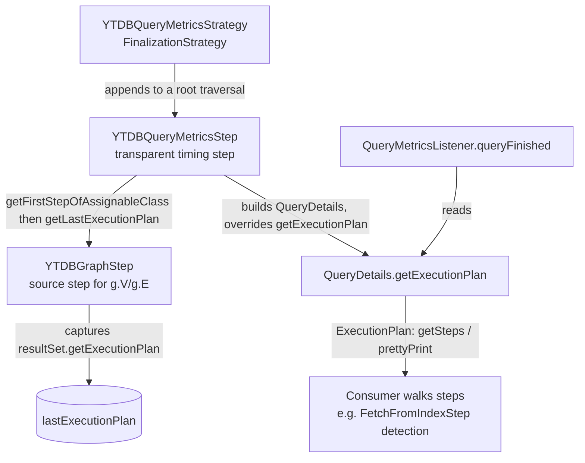

# Query execution plan on the metrics listener — Architecture Decision Record

## Summary

A registered `QueryMetricsListener` can now inspect the execution plan of the Gremlin query it was notified about. The query-monitoring machinery already fires a per-query `queryFinished(QueryDetails, ...)` callback; this change adds `getExecutionPlan()` to `QueryDetails`, so a consumer — DNQ, the JetBrains Kotlin entity-store layer that runs Gremlin against YouTrackDB — can walk the plan's steps and detect an unindexed full scan without issuing a second `EXPLAIN`.

The plan is produced anyway while the query runs. The source step (`YTDBGraphStep`) captures the already-built plan off the result set and holds it; the metrics step reads it back at reporting time and hands it to the listener. No new client-facing API type, no wire serialization, no extra query round-trip.

## Goals

- Give a query-monitoring listener read-only access to the finished query's execution plan. **Met.**
- Add no second `EXPLAIN` round-trip and no per-row overhead on the query path. **Met** — capture is a single field write outside the row-streaming loop.
- Keep the query-execution path ignorant of monitoring. **Met** — `YTDBGraphStep` holds no reference to the monitoring machinery; capture is unconditional and nothing reads the plan unless a listener is registered.

Not a goal (unchanged from planning): a public-API plan view, plan capture from child traversals, or retaining the plan across a transaction-result-cache replay. See D1, D3, D5.

## Constraints

- Embedded-only. The whole `QueryMetricsListener` surface is internal, and invocation never crosses a client wire boundary, so returning an internal `ExecutionPlan` adds no serialization concern.
- The returned plan is valid only synchronously inside the `queryFinished` callback — the source step resolves it lazily and clears it on `reset()`. A listener must not retain it past the callback. This matches the synchronous-validity window the existing lazy `getQuery()` accessor already has.

## Architecture Notes

### Component Map

- `YTDBQueryMetricsStrategy` (a TinkerPop `FinalizationStrategy`) appends the metrics step to a **root** traversal only (`traversal.isRoot()`), when monitoring is enabled and the graph is embedded.
- `YTDBGraphStep` (the YTDB replacement for TinkerPop's source `GraphStep`, produced by `g.V()` / `g.E()`) captures `resultSet.getExecutionPlan()` in the query branch of its `elements()` helper, stores it in a nullable field, exposes it through `getLastExecutionPlan()`, and clears it in an overridden `reset()`.
- `YTDBQueryMetricsStep` resolves the root source step via `TraversalHelper.getFirstStepOfAssignableClass(YTDBGraphStep.class, traversal)` and reads its plan at `close()` time, wiring it into the anonymous `QueryDetails` it builds for `queryFinished`.
- `ExecutionPlan` (`internal.core.query`) is the read surface: `getSteps()` returns `List<ExecutionStep>` and `prettyPrint(int, int)` returns a session-free `String`; `toResult(session)` needs a live session and is out of bounds for a listener.

(Signatures and relationships verified against the code by grep — mcp-steroid was unreachable this session, so polymorphic call sites were not PSI-confirmed.)

### Decision Records

#### D1: Expose the plan through the internal `QueryDetails` listener surface, not a new public-API type
Implemented as planned. `QueryDetails` gained `@Nullable default ExecutionPlan getExecutionPlan()` returning `null`. The default keeps every existing implementer compiling and makes the accessor opt-in. Rationale: the listener, its `QueryDetails` interface, and the `withQueryListener(...)` registration are all internal, so any consumer already depends on internal packages; returning an internal `ExecutionPlan` is a matched, not a new, coupling — the existing `YTDBGraphQuery.usedIndexes()` already walks `ExecutionPlan`/`ExecutionStep`. A public-API wrapper would be over-engineering for an internal-only consumer.

#### D2: Capture the executed query's plan, not a second `EXPLAIN`
Implemented as planned. A normal SELECT returns a result set carrying the fully-built plan at execute time, so `resultSet.getExecutionPlan()` is populated before any row streams, at near-zero cost. This yields the plan that actually ran and avoids the re-planning and extra round-trip of a separate `EXPLAIN` (the path `usedIndexes()` takes).

**Actual-outcome correction:** planning assumed a downstream `limit(0)` short-circuit would leave the plan `null` (source never pulled). Testing during implementation showed the opposite — the source step runs its query eagerly as soon as the traversal is iterated, before the range step can short-circuit, so a `limit(0)` query **does** capture a non-null scan plan. The plan is `null` only when the source step genuinely never runs (a by-id lookup, or a non-`V()`/`E()`-rooted root traversal per D3) or on a cache-hit replay (D5).

#### D3: Capture only the root source step's plan (documented locality contract)
Implemented as planned. Resolution iterates the root traversal's direct steps only, so the feature exposes the primary (root source) query's plan — matching the use case of detecting the main query's full scan. A plan-backed scan inside a child traversal (`where` / `union` / `local`), or a non-`V()`/`E()`-rooted root traversal such as `g.inject(...)`, is not captured: the former surfaces the root source's plan or `null`, the latter `null`. Broadening later can reuse the existing recursive step-walk helper. The `g.inject(...)` → `null` case is pinned by a regression test.

#### D4: Clear the retained plan on `reset()` (calling `super.reset()` first), leave it null on the by-id path
Implemented as planned. The by-id branch runs no query and never assigns the field, so a by-id-only step's plan is correctly `null`. The staleness hazard is re-iteration: a compiled traversal that is `reset()` and re-run would otherwise still hold the earlier run's plan. The `reset()` override calls `super.reset()` **first** (so the base `GraphStep` re-arms its element iterator) and only then clears the field. Acceptance covers re-iteration correctness, not just a post-reset-null check — a bare null assertion would pass even against a broken super-less override.

#### D5: Accept the transaction-result-cache replay limitation (document plus test)
Implemented as planned, with a precondition discovered during implementation. On a cache-hit replay of an identical query within the same transaction, the cached view's plan was nulled when the first (populating) run's stream drained, so the replay surfaces `null`. This is semantically defensible: the first execution of any query shape is always a plan-capturing populating run, and a replay re-serves cached rows rather than re-executing a plan. Retaining the plan across cache close is a deeper cache change with no consumer that needs it.

**Discovered precondition:** the whole replay-`null` path is reachable only when the per-transaction result cache is enabled (`QUERY_TX_RESULT_CACHE_ENABLED`), which is **off by default**. With the cache off, a repeated identical query re-executes and surfaces a fresh non-null plan. The regression test enables the flag on its transaction and restores it afterward.

### Invariants & Contracts

- A registered listener receives a non-null `ExecutionPlan` for a plan-backed root scan or index query, and `null` for a lookup that runs no query.
- `getSteps()` and `prettyPrint()` on the retained plan succeed after the query's result set closes, because closing a `SelectExecutionPlan` propagates `close()` through its steps but does not null the steps list; `toResult(session)` is never called from the listener.
- Plan capture is independent of whether monitoring is enabled — the source step imports nothing from the monitoring machinery, and capture is a single field write outside the row-streaming loop.

### Integration Points

- Consumers register via `YTDBTransaction.withQueryListener(...)` and read the plan inside `queryFinished`. The plan-step vocabulary a scan detector walks (`FetchFromIndexStep` present → index-backed; absent, with `FetchFromClassExecutionStep` present → full scan) mirrors the existing `usedIndexes()` step-walk.

## Key Discoveries

- **The cache-hit-replay-`null` behavior is conditional on the per-transaction result cache being enabled**, which is off by default. Documentation that stated it unconditionally was corrected. A consumer inspecting a repeated identical query under the default configuration sees a fresh plan on every run.
- **A downstream `limit(0)` does not suppress plan capture.** The source step executes its query eagerly on iteration, before the range step can short-circuit, so a non-null scan plan is still captured. This reversed a planning-time assumption; the true behavior is now pinned by a test.
- **Read-only plan inspection survives result-set close.** `getSteps()` and `prettyPrint()` read only the retained step list and are safe after the query closes; only `toResult(session)` needs a live session. This is what makes post-close inspection from a listener sound.
- **Retention is bounded to the traversal lifetime.** Holding the plan on the source step pins the plan's command-context object graph only for the compiled traversal's life; Gremlin traversals are single-use and short-lived, so this is bounded retention rather than a new unbounded leak. The `reset()` clear releases it promptly on any reuse.

## Adversarial gate verdicts

Pre-code adversarial gate: **passed at iteration 2.** Iteration 1 raised 0 blockers, 2 should-fix, and 3 suggestions; the two should-fix findings (the transaction-result-cache replay-`null` limitation and the root-source-only locality contract) were confirmed against the code and accepted as documented limitations with required regression tests, and the suggestions were addressed. Iteration 2 verified all iteration-1 findings and cleared the gate with no blockers and no open should-fix.

## Token usage telemetry

Snapshot from this worktree's sessions over its lifetime (N=11 sessions across 40 transcripts).

### Tool mix — share of total session context

| Component             | Share |
|-----------------------|------:|
| `Read` tool results   | 61.3% |
| `Bash` tool results   | 14.6% |
| `Grep` tool results   | 0.0% |
| `Edit` tool results   | 0.4% |
| Other tool results    | 1.4% |
| Prompts and output    | 22.3% |

### Top files by share of `Read` token consumption

| File                                            | Share of Read |
|-------------------------------------------------|--------------:|
| <outside-worktree>                              | 26.0% |
| docs/adr/ytdb1191-query-plan-in-listener/_workflow/plan/track-1.md | 12.1% |
| core/src/test/java/com/jetbrains/youtrackdb/internal/core/gremlin/gremlintest/scenarios/YTDBQueryMetricsStrategyTest.java | 5.7% |
| core/src/main/java/com/jetbrains/youtrackdb/internal/common/profiler/monitoring/YTDBQueryMetricsStep.java | 5.6% |
| .claude/workflow/prompts/adversarial-review.md  | 5.4% |
| .claude/workflow/implementer-rules.md           | 4.4% |
| core/src/main/java/com/jetbrains/youtrackdb/internal/core/gremlin/traversal/step/sideeffect/YTDBGraphStep.java | 3.8% |
| .claude/workflow/self-improvement-reflection.md | 2.7% |
| .claude/workflow/conventions-execution.md       | 2.6% |
| .claude/workflow/track-review.md                | 2.5% |

Generated by `.claude/scripts/measure-read-share.py` against
`~/.claude/projects/-workspaces-youtrackdb-develop/`.
