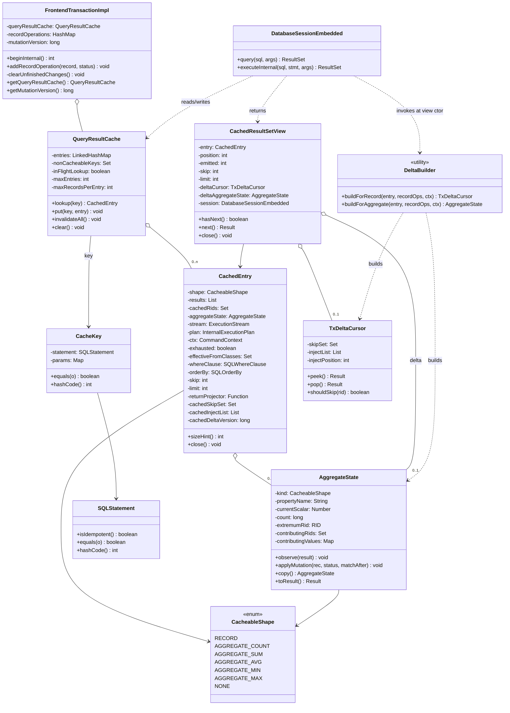
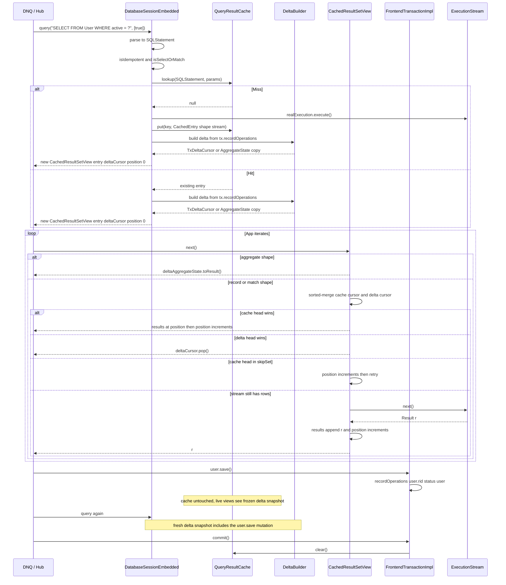

# YTDB-820 Transaction-scoped query result cache — Design

## Overview

YouTrackDB today re-executes every `Database.query()` call against storage, even when the same idempotent query was issued moments earlier in the same transaction. Hub and YouTrack DNQ workloads issue hundreds to thousands of duplicate-shape SELECT/MATCH queries per request — the lost cache (compared to the pre-migration Xodus `EntityIterable` cache) translates to a sustained per-request slowdown.

This design adds an opt-in **transaction-scoped result cache** keyed by parsed query AST + normalized parameters. The cache lives on `FrontendTransactionImpl` and is wiped on every transaction-end path (commit, rollback, close). Cache entries are **immutable** from the moment they are populated — intra-transaction mutations never touch the cached state. Instead, each `query()` call constructs a `CachedResultSetView` over the immutable cached entry plus a **snapshot tx-delta-cursor** built from `FrontendTransactionImpl.recordOperations` at view-construction time. `view.next()` performs a sorted-merge between the cached list and the delta-cursor's skip-set + sorted inject-list. Mutations only ever grow `recordOperations`; the cache itself never mutates.

The enabling primitives all exist already: `SQLStatement.equals()` is structural; `SQLStatement.isIdempotent()` excludes mutating statements; `FrontendTransactionImpl.recordOperations` is the canonical mutation log; `clearUnfinishedChanges()` is the single tx-end sink; `SQLWhereClause.matchesFilters(record, ctx)` evaluates WHERE in memory; `MatchPrefetchStep` + `PREFETCHED_MATCH_ALIAS_PREFIX` enables constrained pattern walks (used by Etap B future work).

Disabled by default behind `youtrackdb.query.txResultCache.enabled`. Two more knobs bound memory (`maxEntries`, `maxRecordsPerEntry`). Non-deterministic queries (sysdate, random, uuid, $now, $current) are detected via a denylist AST walk and bypass the cache; `SQLSelectStatement.noCache` hint extends to opt-out per-query.

### Why lazy merge-on-read

The earlier eager K1 sharp-merge design mutated `entry.results` in place on every `addRecordOperation` and required live `CachedResultSetView`s to fail-fast with `IllegalStateException` when a mutation invalidated the position counter. Lazy merge-on-read eliminates that contract: cached entries are frozen snapshots of storage at populate time, and the tx-delta is reconciled per query at view-construction. The contract is "every view sees a coherent snapshot from query-call moment", matching the existing `OrderByStep` blocking-materializer guarantee — caching no longer introduces a fail-fast path consumers must handle.

**The choice is not perf-driven; it is architecture-driven.** Honest cost accounting: per-mutation work drops to O(0); per-query delta build is O(N) where N is total tx mutations (O(p) with a per-class index, deferred to v2); per-`next()` stays O(1) when the delta is empty for this query's class and O(log p) otherwise. The "delta empty" condition holds only when no tx-mutation has happened on a class in this query's `effectiveFromClasses`. In Hub-shaped workloads (1-3 writes followed by 50-200 reads on the same classes — the DNQ "save then query" pattern), once the first write lands every subsequent same-class read pays the delta-build cost while eager would have amortized that cost over the writes. **For these workloads lazy has measurably higher total work than eager** — estimated 10-20× more raw operations, but in absolute terms sub-millisecond per request, noise-floor against Hub's hundreds-of-milliseconds HTTP response time. We accept this perf hit explicitly as the price of architectural simplification: no K1 dispatch, no `entry.version`, no `expectedEntryVersion`, no fail-fast `IllegalStateException`, and the "transparent cache invisible behind ResultSet API" promise honored. D13 Hub-replay (Track 8) measures the actual cost; if measurements show a >5% request-latency regression, the per-class indexing optimization (deferred to v2) activates as a hardening response rather than v2 work.

### Known v1 limitations

Two correctness-bounded trade-offs accepted for v1; the LIMIT/UPDATED-out short-list limitation is fixed in-design via over-fetch.

- **MATCH multi-alias CREATED (Etap B) deferred to separate ADR.** Track 6 Etap A handles single-alias MATCH CREATED by folding to RECORD shape with a RETURN projector. Multi-alias / cross-join / pattern-with-edges CREATED is classified `NONE` (non-cacheable) — the cache misses on the first such mutation. v2 candidate using `MatchPrefetchStep` + `PREFETCHED_MATCH_ALIAS_PREFIX` for constrained pattern execution; the work belongs in a dedicated ADR (constrained pattern walk + edge-CREATED dispatch is a substantial infrastructure piece, not a localized hardening fix). See § Open questions deferred to execution.
- **MIN/MAX worst-case O(n) recompute** at delta-build time when the cached extremum element leaves (DELETED, transitions out of WHERE, or UPDATED away from the extremum). Bounded by `maxRecordsPerEntry` (default 10000). D14 in `implementation-plan.md` proposes a `TreeMap` sorted-value index (O(log n)) as a v2 candidate — decision gate is D13 Hub-replay measurement of extremum-churn frequency. The implementation cost is ~150 lines of `AggregateState` rewrites + ~3× memory growth per MIN/MAX entry, against a Hub-typical perf gain of ~5 μs per HTTP request (worst case in absolute terms ~100 μs against ~hundreds of ms response time). Cost-benefit does not justify v1 promotion absent the D13 measurement.

The LIMIT-after-DELETE / UPDATED-out-of-WHERE short-list limitation from prior iterations is resolved:

- **LIMIT-after-DELETE short list — RESOLVED via over-fetch.** Per § Lazy merge-on-read → Over-fetch for backfill, the cache populates entries with up to `maxRecordsPerEntry` records by overriding the plan's `SkipStep` and `LimitStep` at cache-miss (when the query has `LIMIT m` with `m <= maxRecordsPerEntry`); the view applies the original SKIP and LIMIT at iteration. A DELETED or UPDATED-out-of-WHERE record now reveals the next-ranked cached record naturally via sorted-merge instead of returning a short list. Queries with `LIMIT > maxRecordsPerEntry` (or `SKIP + LIMIT > maxRecordsPerEntry`) classify as NONE — they cannot be cached and bypass to direct execution.

`AST equals` fragility (D2 risk) and per-call allocation rate are tracked under § Open questions deferred to execution and validated pre-merge by D13.

The rest of the document is structured as: Class Design → Workflow → Cache key composition → Pause/resume mechanics → Lazy merge-on-read → Cache invalidation → Non-determinism handling → Memory bounds → Concurrency and lifecycle → Invariants.

## Class Design



**TL;DR.** Three new classes carry the design: `QueryResultCache` (the LRU bounded map on the transaction), `CachedEntry` (one cache slot — frozen results, paused stream, AST metadata), and `TxDeltaCursor` (the per-view delta snapshot — skip-set + sorted inject-list, built once at view construction). `CachedResultSetView` is the consumer-facing `ResultSet` wrapper that does a sorted-merge between cached and delta. `DeltaBuilder` is a stateless utility that iterates `recordOperations` once at view-construction to populate the cursor (record shape) or to apply mutations against a copy of `entry.aggregateState` (aggregate shape). Everything else is hooks on existing types: `FrontendTransactionImpl` owns the cache and clears it; `DatabaseSessionEmbedded.query()` builds views; `addRecordOperation` is **not** hooked by the cache — recordOperations growth is what tx already records, and views snapshot it on construction.

### References
- Invariants: I1 (cache cleared on every tx-end path), I2 (cache only touched by owning thread), I7 (view's deltaCursor is immutable post-construction)

## Workflow



**TL;DR.** Read path: every `query()` (hit or miss) ends with a delta build from current `recordOperations` snapshot and returns a fresh `CachedResultSetView`. Miss kicks off real execution and populates `entry.results` incrementally via stream pull as the consumer iterates. Hit reuses the existing entry (immutable). Each `view.next()` is a sorted-merge between the cached cursor and the view's frozen delta-cursor (record shape) — or a direct read of `deltaAggregateState.toResult()` (aggregate shape). Mutations land in `tx.recordOperations` without touching the cache; only the **next** `query()`'s view sees them via fresh delta build. Tx end clears the whole cache.

### Edge cases / Gotchas
- A second consumer calling `query()` for the same key before the first finished iterating gets a separate view with its own delta snapshot. If a mutation happened between the two `query()` calls, the second consumer sees the mutation via delta; the first does not.
- If a consumer drops the view without exhausting it, the stream stays live in the cache entry until another consumer pulls it further, until LRU evicts the entry, or until tx end closes everything.
- `next()` that pulls from the live stream and appends MUST do so atomically with respect to the `position++` it does locally — trivial under the per-tx single-threading constraint.

### References
- D-records: D2 (key composition), D4 (pause/resume), D5-lazy (lazy merge architecture), D6 (non-determinism), D15 (snapshot-at-construction)

## Cache key composition

**TL;DR.** Key = `(SQLStatement, normalizedParams)`. `SQLStatement.equals()` is already structural over target/projection/whereClause/groupBy/orderBy/unwind/skip/limit/fetchPlan/letClause/timeout/parallel/noCache (see SQLSelectStatement:380), so the parsed AST hashed against a normalized parameter map gives semantically-equivalent queries the same key automatically. Whitespace, alias renaming, formatting differences all map to the same slot.

The parser is already on the hot path — `SQLEngine.parse()` runs on every `query()` call (DatabaseSessionEmbedded:632), and the result is itself cached by the existing `STATEMENT_CACHE_SIZE` knob. The result cache lookup happens after parsing but before execution-plan creation; the AST is the input we already have.

Parameter normalization: `Object[]` form is converted to a `LinkedHashMap<Integer, Object>` keyed by positional index; the named `Map<String, Object>` form is wrapped read-only. The stored type is `Map<Object, Object>` — the same union the existing `SQLStatement.execute(...)` API carries (`SQLStatement.java:62/66/83/89`), because positional params use `Integer` keys and named params use `String` keys. Equality is `Objects.equals` deep; arrays go through `Arrays.deepEquals`. Records and identifiables compare by RID (their existing equals contract).

### Edge cases / Gotchas
- `SQLStatement.equals()` is the same one that backs `STATEMENT_CACHE_SIZE` AST cache, so the cache-key behavior matches existing precedent.
- Parameters containing mutable objects (e.g., a `List` the caller reuses) are a footgun — if the caller mutates the list after `query()` returns, our key becomes stale. Document and defensive-copy the parameter map at lookup time. Cost is one shallow copy per query call.
- Two parameter maps differing only in iteration order on `HashMap` would collide on equals (good — they're semantically the same parameter set).
- D12 AST identity fast-path: `STATEMENT_CACHE` returns the same `SQLStatement` instance for identical-text queries, so `CacheKey.equals` short-circuits on `stmt == other.stmt` before the deep AST walk.

### References
- D-records: D2, D12

## Pause/resume mechanics

**TL;DR.** A `CachedEntry` keeps a strong reference to the live `ExecutionStream` + `InternalExecutionPlan` + `CommandContext`. While not exhausted, any view that outruns the cached list calls `entry.stream.next()`, appends the result to the shared list, and returns it. When the stream reports `hasNext()==false`, the entry flips `exhausted=true`, closes the stream, nulls the reference. From that point all views are pure list-replays.

This makes `query()` calls within a transaction **idempotent in the consumer's view**: regardless of when a consumer arrives or how much of the prior consumer iterated, they all see the full, ordered, consistent result of the cached query. The first consumer to want a tail row pays its storage cost; everyone else pays nothing.

Critically — unlike the eager design — `entry.results` is only ever appended to (during initial stream pull), never reordered or removed. The deltaCursor on each view is what reconciles mutations; the cached list itself is immutable in content from the moment a row enters it.

### Edge cases / Gotchas
- **WeakValueHashMap interaction.** `DatabaseSessionEmbedded.activeQueries` is weak-valued in embedded mode (DatabaseSessionEmbedded:256). The cache holds its own strong reference to the stream inside `CachedEntry`, which keeps the consumer-facing `LocalResultSet` reachable only if the cache also tracks it — but the cache deliberately does NOT track the original wrapper, only the bare `ExecutionStream`. So the original `LocalResultSet` wrapping the stream may be GC'd, which is fine: we only need the stream itself.
- **`session.closeActiveQueries()` in `clear()`** (`DatabaseSessionEmbedded.java:3431`) iterates `activeQueries.values()` and calls `close()`. Cached streams are NOT in that map. The cache's own `clear()` — called from `clearUnfinishedChanges()` (`FrontendTransactionImpl.java:998`) — is what closes paused streams on tx end.
- **Mid-iteration mutation.** When `addRecordOperation` fires, no cache state changes. The currently-live view's `deltaCursor` was snapshotted at view construction and remains frozen — the new mutation is invisible to it. The next `query()` constructs a fresh view with a fresh delta snapshot that sees the mutation. This matches the `OrderByStep` blocking-materializer contract (uncached `query()` results don't reflect mid-iteration mutations either).
- **Storage cursor lifetime.** YTDB transactions are thread-affine (`assertOnOwningThread`). A paused stream's underlying B-tree cursor stays alive between the originating `next()` and the resuming `next()` — no concurrent mutation can sneak in on another thread.

### References
- D-records: D4, D15
- Invariants: I3 (paused stream lives at most as long as its CachedEntry), I7 (deltaCursor immutable post-construction)

## Lazy merge-on-read

**TL;DR.** Every `CachedResultSetView` is constructed with a frozen snapshot of the tx's mutations relevant to the entry's `effectiveFromClasses`. The snapshot — a `TxDeltaCursor` (for record/match shape) or a copy of `AggregateState` with delta replayed (for aggregate shape) — is built once at view construction by `DeltaBuilder` and never refreshed mid-iteration. The cache itself is immutable from populate time. All "what does this query return given the cache + current tx state" logic lives in the delta-build step. **Cost shape:** the delta-build pays O(N) tx-mutation scan + O(p log p) sort per query; per-`next()` is O(1) when the delta is empty (true only in pure read-only tx segments with no writes on this query's classes) and O(log p) once any same-class write has landed. In Hub workloads this means per-read cost is measurably higher than eager would pay — the trade-off is accepted in exchange for the architectural simplification documented in § Overview → "Why lazy merge-on-read".

### Per-shape classify

A static helper `ShapeClassifier.classify(SQLStatement) → CacheableShape` decides cacheability and merge composition for a parsed statement. Computed once per entry on first cache put. Returns one of `RECORD`, `AGGREGATE_COUNT`, `AGGREGATE_SUM`, `AGGREGATE_AVG`, `AGGREGATE_MIN`, `AGGREGATE_MAX`, or `NONE`.

- **RECORD** — simple SELECT shape (`SELECT [projection] FROM Class [WHERE simple-predicate] [ORDER BY columns | deterministic-modifier-chain] [SKIP n] [LIMIT m]`), no GROUP BY, no aggregates, no LET, no subqueries, no LET-based unionall. `LIMIT` cacheability gate: `LIMIT m` with `m <= maxRecordsPerEntry` (or no LIMIT) is cacheable; `m > maxRecordsPerEntry` → NONE (the cache cannot fit the user's requested rowcount; truncating the plan to the cap would silently shorten the user's result). `SKIP` analogous: `SKIP n LIMIT m` with `n + m <= maxRecordsPerEntry` is cacheable; above the cap → NONE. The over-fetch mechanism (§ Over-fetch for backfill) provides backfill within the cap. Also: single-alias MATCH `MATCH {as:u, class:X WHERE simple-predicate} RETURN <projection of u>` (Etap A) classifies as RECORD with a stored `returnProjector` that constructs single-binding tuples from a record.
- **AGGREGATE_***  — single-aggregate SELECT shape (`SELECT <COUNT(*)|SUM(prop)|AVG(prop)|MIN(prop)|MAX(prop)> FROM Class [WHERE simple-predicate]`), no GROUP BY, no HAVING, no expression in aggregate argument.
- **NONE** — anything else: GROUP BY, HAVING, expression-aggregates, MEDIAN/MODE/PERCENTILE/COUNT DISTINCT, subqueries in WHERE/target, LET clauses, expression-ORDER BY containing non-deterministic functions, `LIMIT > maxRecordsPerEntry`, `SKIP + LIMIT > maxRecordsPerEntry`, multi-alias MATCH (Etap B deferred to separate ADR), MATCH patterns with cross-alias-state WHEREs (`$current`, `$matched`). NONE entries are **non-cacheable** — `cache.put` skips them; the query falls through to direct execution. There is no "wipe on first mutation" path under lazy.

### TxDeltaCursor — record/match shape

`DeltaBuilder.buildForRecord(entry, tx, ctx)` first takes a **snapshot** of the recordOperations entries — `var snapshot = new ArrayList<>(tx.recordOperations.values())` — before iterating. The snapshot is required because `WHERE.matchesFilters` evaluations may invoke user-defined functions which can call `session.save(...)`, causing structural modification of `tx.recordOperations` mid-iteration (Java HashMap throws `ConcurrentModificationException` on detection; even safe modes would yield observably-inconsistent iteration). Records added by UDF-triggered mutations during the build are NOT visible in this delta — they will be visible to the NEXT view constructed after the build returns, when `mutationVersion` has advanced and a fresh delta is built (per § Cross-view delta sharing via mutationVersion). The snapshot is O(p) allocation amortized across all views at the same mutationVersion via Option C sharing. The build iterates the snapshot. For each `RecordOperation`:

1. **Class filter** — if `op.record.getSchemaClass().getName() ∉ entry.effectiveFromClasses`, skip (O(1) hash-set contains; the closure is precomputed at entry construction per D11). Non-`Entity` records and entities with null schema class skip the entry.
2. **WHERE evaluation** — `match_after = entry.whereClause.matchesFilters(op.record, ctx)`. For shapes with no WHERE clause, treat as `true`.
3. **Cache-membership check** — `cached_at_build = entry.cachedRids.contains(op.rid)`. `cachedRids` is a `Set<RID>` populated incrementally as the stream pulls records into `entry.results`; at view-construction time it reflects only the prefix the stream has pulled so far, NOT the full storage result set. The lazy stream-pull semantics from Track 3 mean `cached_at_build=false` does NOT imply "this record is not in the result" — it can mean "this record exists in storage but the stream hasn't reached it yet". See § Stream-pull dispatch unification below for how this gap is closed.
4. **Dispatch on `(op.type, cached_at_build, match_after)`**:

| op.type | cached_at_build | match_after | Action |
|---|---|---|---|
| CREATED | *     | true  | `inject_list.add(op.record)` (CREATED RIDs are temp; cached_at_build is irrelevant) |
| CREATED | *     | false | no-op |
| UPDATED | true  | true  | `skip_set.add(op.rid); inject_list.add(op.record)` (re-position in case ORDER BY key changed) |
| UPDATED | true  | false | `skip_set.add(op.rid)` |
| UPDATED | false | true  | `skip_set.add(op.rid); inject_list.add(op.record)` (skip_set guards against stream pulling pre-update state later — see § Stream-pull dispatch unification) |
| UPDATED | false | false | `skip_set.add(op.rid)` (suppress any later stream-pull of this RID) |
| DELETED | true  | *     | `skip_set.add(op.rid)` |
| DELETED | false | *     | `skip_set.add(op.rid)` (suppress any later stream-pull) |

5. **For MATCH Etap A** (procedural step ordering before sort, per architectural review): wrap each raw record currently in `inject_list` through `entry.returnProjector(rec, ctx)` BEFORE sorting, producing a single-binding tuple `Result` matching the original RETURN-clause shape. After this step, `inject_list` contains projected `Result` tuples (not raw records). This ordering is required because ORDER BY may reference a projected column (`ORDER BY double_age` where `double_age = u.age * 2` is computed by the projector); the comparator cannot resolve such references on a raw record.
6. **Sort `inject_list`** by `entry.orderBy` comparator (O(p log p)). For ORDER BY null, append in iteration order (no sort). For RECORD shape, the list at this point already contains `Result`-wrapped records (the populate path wraps each record in a `ResultInternal` during stream pull). For MATCH Etap A, the list contains projected tuples per step 5.
7. Return `new TxDeltaCursor(skipSet, injectList)`.

### Cross-view delta sharing via mutationVersion

The `(skipSet, injectList)` pair is a pure function of `(entry's frozen metadata, tx.recordOperations content)`. Two views constructed on the same entry at the same recordOperations state have identical deltas. To avoid per-view allocation (Hub pattern: 1-3 mutations followed by many same-class reads → up to 50-200 views built against the same stable recordOperations), the entry caches the latest computed pair and reuses it for any new view whose construction observes the same state.

`recordOperations.size()` is NOT a sufficient key: `FrontendTransactionImpl.addRecordOperation` collapses repeated operations on the same RID in place (UPDATED→DELETED keeps the size constant but changes the dispatch outcome — DELETED suppresses inject_list while UPDATED contributes to it). To capture every change, `FrontendTransactionImpl` exposes `mutationVersion: long`, a monotonic counter incremented on every `addRecordOperation` call (whether a new record or a type-change on an existing one).

`DeltaBuilder.buildForRecord(entry, tx, ctx)` algorithm:

```
v = tx.getMutationVersion()
if entry.cachedDeltaVersion == v && entry.cachedSkipSet != null:
    // Reuse: another view on this entry already built the delta at this exact tx state
    skipSet = entry.cachedSkipSet          // shared immutable ref
    injectList = entry.cachedInjectList    // shared immutable ref
else:
    // Build (single pass over recordOperations)
    skipSet = new HashSet<>()
    injectList = new ArrayList<>()
    iterate(tx.recordOperations) → populate skipSet, injectList per dispatch table
    sort(injectList, entry.orderBy)
    // Promote to entry cache (overwriting any older version's cache) — use unmodifiable wrappers
    entry.cachedSkipSet = Collections.unmodifiableSet(skipSet)
    entry.cachedInjectList = Collections.unmodifiableList(injectList)
    entry.cachedDeltaVersion = v
// Both first-build and reuse paths hand the cursor the unmodifiable wrappers (T3 fix —
// consistent immutability surface across both branches).
return new TxDeltaCursor(entry.cachedSkipSet, entry.cachedInjectList, injectPosition=0)
```

Each `TxDeltaCursor` holds its own `injectPosition` counter (the iteration cursor) — that's per-view mutable state. The underlying skipSet and injectList are immutable; sharing them is safe.

**Garbage collection**: when a new view at a fresher `mutationVersion` triggers rebuild, `entry.cachedSkipSet` and `entry.cachedInjectList` point at the new pair. Older views still hold their TxDeltaCursor references to the OLD pair via their `deltaCursor` field — those older pairs stay live for as long as any view references them, then become unreachable and are GC'd. The entry only ever holds a strong ref to the **latest** pair, so it does not pin older versions.

**Self-healing version mismatch** (T5 invariant): a UDF-triggered `save()` during `WHERE.matchesFilters` can bump `mutationVersion` after the build started but before it promotes its pair to `entry.cachedSkipSet`. The promote then writes a "stale-on-arrival" pair: the entry briefly holds a pair tagged at an older version than `tx.getMutationVersion()`. This is **self-healing**: any subsequent view at the current (higher) version sees the version mismatch and rebuilds, immediately overwriting the stale-on-arrival pair. Wasted memory is bounded by O(p) per such mismatch, freed on the next rebuild. No correctness hazard — view-A returns a correct delta for the snapshot it iterated; view-C rebuilds for the new state.

**Memory footprint**: bounded by `Σᵢ pᵢ` where the sum is over the distinct mutationVersion values currently alive across all live views. For Hub typical (1 view alive at a time, modest p): O(p) per entry. Worst case (V live views at V distinct mutationVersions): O(V × p_max). Each entry's overhead is at most `2 × p × 48B` for the cached pair plus the per-view injectPosition cursor (one int).

### Stream-pull dispatch unification

**The skip_set is consulted twice**, not once: at every cache-cursor advance (the standard merge) AND at every stream-pull-append. The latter closes the gap created by lazy stream-pulling: a tx-mutated RID that lives in storage beyond the cached prefix would otherwise emerge from the stream pull with stale state (or duplicate the delta's inject_list emission). Per the dispatch table above, every tx-mutation regardless of `cached_at_build` value adds the RID to `skip_set` for UPDATED and DELETED cases. CREATED RIDs are temporary and storage never emits them.

The stream-pull-append path becomes:

```
stream_pull_one():
  while !entry.exhausted:
    r = entry.stream.next(entry.ctx)
    rid = r.getRecord().getIdentity()
    if deltaCursor.shouldSkip(rid):
      // stale storage emission of a tx-mutated record; drop it
      continue
    entry.results.add(r); entry.cachedRids.add(rid)
    return r
  return null  // exhausted
```

This unifies the dispatch: any RID in `skip_set` is suppressed from BOTH the cache cursor (already in `entry.results`) and the stream cursor (will be appended). The inject_list is the sole source of truth for the post-tx-mutation state of any mutated record.

**Cost**: one hash-set lookup per stream-pull. Bounded by `entry.results.size()` lookups per full iteration; negligible.

The view's `next()` then performs sorted-merge:

```
view.next():
  while true:
    cache_head = (position < entry.results.size()) ? entry.results[position] : null

    // Suppress cached rows whose RID the delta marks for replacement or deletion.
    if cache_head != null && deltaCursor.shouldSkip(cache_head.rid):
      position++; continue

    // Materialize cache_head from the live stream BEFORE looking at delta_head.
    // The stream is the only source of records that sort between the already-
    // pulled prefix and the storage tail — if we skipped this step and the
    // delta has any inject whose ORDER BY key sorts AFTER some not-yet-pulled
    // storage row, we would return the delta inject ahead of those storage
    // rows, violating the sorted-merge invariant. Pulling here materializes
    // the next storage row (filtered through the skip-set so any post-mutation
    // RID is dropped), appends it to entry.results, and re-enters the loop —
    // the next iteration sees cache_head = that newly-pulled row.
    if cache_head == null && !entry.exhausted:
      r = stream_pull_one()  // skip-set-filtered append; sets entry.exhausted on drain
      if r != null:
        continue  // re-loop; cache_head will be r at position
      // r == null means the stream just exhausted; fall through with cache_head still null

    delta_head = deltaCursor.peek()  // null if delta exhausted

    // Both cursors exhausted — view is done.
    if cache_head == null && delta_head == null:
      throw NoSuchElementException

    // Cache exhausted, delta has rows — drain delta in sort order.
    if cache_head == null:
      return deltaCursor.pop()

    // Delta exhausted, cache has rows — drain cache in sort order.
    if delta_head == null:
      position++; return cache_head

    // Both cursors carry a head — emit the smaller per ORDER BY. Ties favour
    // delta, since the only way a tie can occur is between distinct RIDs (a
    // skip-set hit on cache_head would have been consumed above), so either
    // ordering is correct per SQL-standard tie semantics; choosing delta keeps
    // mutated rows at-or-before equally-ranked cached rows.
    if cmp(delta_head, cache_head, orderBy) <= 0:
      return deltaCursor.pop()
    position++; return cache_head
```

LIMIT clipping is enforced by the consumer-visible count: the view exits after returning LIMIT results regardless of source.

### View output semantics under lazy population (clarifies I7)

The deltaCursor is immutable post-construction. The cache entry's `results` list and `cachedRids` set ARE mutated by stream-pull-append during view iteration (this is how lazy population works). What I7 guarantees is that **the deltaCursor's skipSet and injectList — and therefore the set of records the view emits and their relative order — is fixed at view construction**. Stream-pulled records that are NOT in the skipSet are appended; this affects subsequent views constructed against the same entry, but never the current view's emission set or order. The cached `Result` instances wrap record references; if the underlying record's properties are mutated mid-iteration via `save()`, both the cache-cursor read and any later stream-pull-append observe the post-mutation values — this is the standard YTDB record-reference semantics, not snapshot isolation at the property level.

### Aggregate delta — AGGREGATE_* shapes

For `AGGREGATE_*`, the cached entry carries an immutable `AggregateState` populated at entry-creation by the `AggregateCacheTapStep` side-tap (unchanged from prior design — see § Aggregate side-tap below). At view construction, `DeltaBuilder.buildForAggregate(entry, recordOps, ctx)`:

1. **Copy** — `deltaState = entry.aggregateState.copy()`. The copy is shallow-deep — new mutable containers (`contributingRids`, `contributingValues`) but reuse of underlying RID and Number references.
2. **Replay applyMutation** — iterate `tx.recordOperations.values()`, class filter as above, compute `match_after`, call `deltaState.applyMutation(record, status, match_after)` on the copy. This is the same `applyMutation` code that the eager design called from `invalidateOnMutation` — algorithm unchanged, driver changed.
3. View carries `deltaState` (not a `TxDeltaCursor`); `view.next()` returns `deltaState.toResult()` directly. `hasNext()` is true exactly once (aggregate queries return a single row).

### Aggregate side-tap

Entry-population for `AGGREGATE_*` shapes requires per-RID material to seed `contributingValues` and `contributingRids`. The collapsed `ResultSet` carries only the scalar — no per-RID data to derive from.

`AggregateCacheTapStep extends AbstractExecutionStep` is spliced into the plan chain immediately upstream of `AggregateProjectionCalculationStep` (`AggregateProjectionCalculationStep.java:121-137` shows the blocking aggregation loop: `prev.start(ctx)` → `while lastRs.hasNext: aggregate(lastRs.next, ctx, ...)`). The tap step's `internalStart(ctx)` calls `prev.start(ctx)` (`prev` is the public field on `AbstractExecutionStep:66`) to obtain the upstream `ExecutionStream`, then returns a wrapping `ExecutionStream` whose `next(ctx)` invokes `entry.aggregateState.observe(result)` before forwarding the unchanged `Result` to the consumer. `observe(result)` reads `result.getRecord().getIdentity()` for the RID and the projection-target property via the prebuilt extractor; for `COUNT(*)` it only adds to `contributingRids`. The tap is transparent to the downstream aggregate step.

**Splice point.** Post-construction plan rewrite — `DatabaseSessionEmbedded.query()` miss path builds the plan via `statement.createExecutionPlan(ctx, false)` (instead of `statement.execute(...)`, which immediately wraps the plan in a `LocalResultSet` and loses direct access), downcasts to `SelectExecutionPlan` to walk its `steps` list, finds the `AggregateProjectionCalculationStep`, and rewires its `prev` link to a new `AggregateCacheTapStep` whose own `prev` is the original upstream. The cache then drives the plan via `plan.start(ctx).next(ctx)` — a single call that forces the aggregate step's blocking drain (which in turn drives the tap to observe every upstream record). The captured single-row aggregate Result is held on the entry alongside the now-fully-populated `aggregateState`. Local to cache code; no planner changes.

**Splice failure fallback.** If the planner emits an unexpected shape (no `AggregateProjectionCalculationStep` found after walking `SelectExecutionPlan.steps`, or the cast to `SelectExecutionPlan` fails), the cache code: (1) closes the constructed plan (best-effort), (2) increments `QueryCacheMetrics.spliceFailures`, (3) falls back by calling `statement.execute(session, args)` to obtain a standard `LocalResultSet`, (4) returns that `LocalResultSet` directly to the consumer (no cache entry, no view wrapping). A warning is logged identifying the unexpected step types so the planner-versioning issue is surfaced. Track 5 owns this wiring.

**Eager drive on cache-put — and why this asymmetry is fundamental**. Aggregate cache-miss fully drives the plan before returning the view; RECORD / MATCH-Etap-A cache-miss does not. The asymmetry is not a design inconsistency — the two shapes have different cacheability semantics:

- **RECORD / MATCH-Etap-A**: the cache stores per-row Results. Each row is independent. A consumer who pulls 3 rows and abandons the view has cached 3 valid rows; the entry is partially-populated but every cached row is correct and usable. A subsequent view at the same key picks up where the stream paused. Lazy stream-pull is safe and saves storage I/O.

- **AGGREGATE_***: the cache stores a single scalar (`AggregateState.currentScalar` etc.) derived from observing EVERY contributing record. A consumer who never iterates the view causes the tap to fire zero times; `aggregateState` reflects no observations; the cached scalar is structurally meaningless. A subsequent view reading the entry would return a wrong number (silently). Lazy stream-pull would produce silent corruption.

Eager drive on aggregate cache-put resolves this by FORCING `aggregateState` to full population at cache-put time — the tap observes every record because the aggregate step's blocking drain pulls every record. The cost equals an uncached aggregate execution (the consumer would wait for the aggregate row anyway). The trade-off is: aggregates cannot defer storage I/O to consumer-pace; the I/O happens at `query()` time. For aggregates this is correct semantics, not a perf hit — every aggregate query already exhibits this latency profile uncached.

### MATCH Etap A — RECORD-shape composition

Single-alias MATCH `MATCH {as:u, class:X WHERE simple-predicate} RETURN <projection of u>` classifies as `RECORD` with extra state on the entry:
- `effectiveFromClasses = {X} ∪ subclass closure` (per D11)
- `whereClause = pattern's where: clause for alias u`
- `orderBy = the ORDER BY from the MATCH statement (if any)`
- `returnProjector: Function<RecordAbstract, Result>` — a closure built at entry construction from the MATCH `RETURN` clause that takes a single record and produces a `Result` shaped like the original execution's output (e.g., `RETURN u, u.name` produces `Result{u: rec, name: rec.name}`).

Delta-build for MATCH Etap A is the RECORD path with the `returnProjector` applied to each inject-list entry. Equivalence vs fresh re-execution validated by a Track 6 step-g test that runs the same MATCH twice (cache miss then hit + delta) and asserts result-set equality across CREATED/UPDATED/DELETED scenarios.

### Over-fetch for backfill (SKIP and LIMIT handling)

For queries with `LIMIT m` (and optionally `SKIP n`) where `m <= maxRecordsPerEntry` (and `n + m <= maxRecordsPerEntry`), cached entries do NOT respect the query's original `SKIP` and `LIMIT` at storage-fetch time. Instead, at cache-miss the cache rewrites the constructed plan so the executor produces up to `maxRecordsPerEntry` records — bypassing the plan's `SkipStep` and `LimitStep`. The view then applies the original `SKIP` and `LIMIT` at iteration time, on top of the sorted-merge of cached list + delta cursor.

For queries with `LIMIT m > maxRecordsPerEntry` (or `n + m > maxRecordsPerEntry`), the entry cannot fit the user's requested rowcount within the per-entry cap; `ShapeClassifier` returns NONE and the query bypasses the cache. Truncating the plan to the cap would silently shorten the user-visible result — wrong semantics.

For queries with no LIMIT, no plan rewrite is performed — the executor produces all matching records up to the cap; if storage has more matching records than `maxRecordsPerEntry`, the entry overflows and is removed from the cache atomically with the overflow detection (per § Memory bounds → Edge cases → Backpressure on overflow), with the key added to `nonCacheableKeys`. The consumer of the overflowing query still receives all storage results directly from the live stream (the view stops appending after the cap but continues forwarding to the consumer).

**Why over-fetch is required.** Without it, a `LIMIT m` query whose cached entry then sees a DELETED record from the visible window or an UPDATED record that no longer matches WHERE would return `m - 1` rows — a "short list" — because there is no source beyond the cached prefix to backfill from. A fresh execution at the same moment would have produced `m` rows by promoting a record from beyond the original window. Over-fetch closes this gap: the cached list extends beyond the visible window by enough margin that backfill is always satisfied from the cache itself, bounded by `maxRecordsPerEntry`.

**Mechanism — plan rewrite at cache-miss.** During cache-miss for `RECORD` shape (including MATCH Etap A), when the parsed statement carries a `LIMIT m` with `m <= maxRecordsPerEntry`, `DatabaseSessionEmbedded.query()`:
1. Builds the plan via `statement.createExecutionPlan(ctx, false)` and downcasts to `SelectExecutionPlan`.
2. Walks `plan.steps`: for each `LimitStep`, mutates its limit value to `maxRecordsPerEntry` (or removes the step from the chain if the API requires it); for each `SkipStep`, mutates its skip value to 0 (or removes). The rewrite preserves all other steps (`FilterStep`, `OrderByStep`, `ProjectionStep`, etc.) unchanged.
3. Executes the rewritten plan; the resulting `ExecutionStream` produces up to `maxRecordsPerEntry` records (subject to storage availability and WHERE filter).
4. Stores the original `skip` and `limit` from the parsed statement on `CachedEntry` so the view can apply them at iteration.

For queries with no LIMIT, the rewrite is skipped entirely — the executor's natural stream produces matching records and the cache appends up to the cap. Overflow handling per § Memory bounds.

**View-level SKIP and LIMIT.** `CachedResultSetView` carries `skip: int` and `limit: int` from the entry, and:
1. On `next()`: increments an internal `emitted: int` counter (independent of `position` which is the cache-cursor index). Discards the first `skip` results from the sorted-merge stream; emits the next `limit` results to the consumer; throws `NoSuchElementException` once `emitted == limit` or the merged stream exhausts.
2. SKIP-past-end (e.g., `SKIP 100` against a 10-row result) returns empty — matching fresh-execution semantics.

**Splice failure fallback.** If the plan walk does not find the expected `SkipStep` / `LimitStep` shape (planner emitted something different) for a query whose AST has non-null `skip` or `limit`, the cache: closes the partial plan, increments `QueryCacheMetrics.spliceFailures`, falls back to `statement.execute(...)`, and returns the resulting `LocalResultSet` to the consumer with no caching. Same fallback shape as the aggregate side-tap (§ Aggregate side-tap → Splice failure fallback). Track 4 step 8 owns this wiring.

**Non-Goal — canonical key for (skip, limit).** `CacheKey.equals` still compares `skip` and `limit` (via `SQLStatement.equals`), so distinct (skip, limit) values create distinct entries — paginated UIs scrolling through pages allocate one entry per page. A canonical key that strips skip/limit and shares one entry across pages is a v2 optimization (gated on D13 measurement of paginated-workload frequency). v1 accepts the per-page-entry duplication; memory is bounded by `maxEntries × maxRecordsPerEntry` regardless.

### Edge cases / Gotchas

- **Aggregate over expression** — `SUM(age + bonus)` is NOT cacheable (classify returns NONE). The map would have to cache the result of the expression, not the property value, which mixes evaluation context with cache storage. Not worth the complexity for v1.
- **MIN/MAX recompute cost** — worst case O(n) when the current extremum element leaves at delta-build time (DELETED, transitions out of WHERE, or UPDATED to a non-extremum value). Bounded by `maxRecordsPerEntry`. Amortized O(1) for typical workloads where most mutations don't target the extremum. `AggregateState` for MIN/MAX carries an `extremumRid: @Nullable RID` field; `was_extremum = rid.equals(extremumRid)` (boolean RID identity, never `Number.equals`) sidesteps the cross-`Number`-subtype hazard. D14 in `implementation-plan.md` proposes a `TreeMap` sorted-value index for `O(log n)` consistent performance — deferred to v2 gated on D13 measurement of extremum-churn frequency.
- **WHERE re-evaluation per query** — under lazy, the same Alice gets re-evaluated through `WHERE.matchesFilters` on every `query()` for an entry whose `effectiveFromClasses` includes her class, for the entire tx duration. Eager evaluated her once at mutation time. Per-entry per-RID memoization could amortize this; left as v2 optimization gated on D13 measurement.
- **Aggregate result type** — `COUNT(*)` returns `Long`, `SUM/AVG/MIN/MAX` return whatever the underlying numeric type is. The cached `Result` wrapping needs the same shape on replay as a fresh execution — preserve numeric type fidelity (don't coerce everything to `double`).
- **WHERE references helper variables (`LET`, `$current`)** — these can't be re-evaluated on a single dirty record outside the original execution context. `classify` returns NONE when `LET` is present or when `$current` / `$matched` is referenced anywhere in the WHERE AST.
- **Multi-class FROM (`SELECT FROM [Class1, Class2]`)** — cacheable; `effectiveFromClasses` is the union of subclass closures. The delta-build only considers records whose class is in this union.
- **Polymorphism / inheritance.** `SELECT FROM Person` picks up `Employee` records. D11 specifies the closure step at entry construction. Polymorphism gate at delta-build time is a single O(1) hash-set contains. The closure stays valid for the entry's lifetime because I8 forbids schema mutation mid-tx.
- **Pre-update state of UPDATED records is gone.** `RecordOperation.record` is the post-mutation state; the pre-update value of any property is no longer in memory. For UPDATED with `cached=true && match_after=true`, we always skip+inject (re-position) without trying to detect "ORDER BY key didn't change" — that detection requires the pre-update key, which we don't have.
- **WHERE contains a deterministic function** — e.g., `WHERE lower(name) = ?`. `WHERE.matchesFilters` evaluates the function against the dirty record — works. Non-deterministic functions in WHERE are excluded from caching at entry creation time (per § Non-determinism handling).
- **MATCH pattern WHEREs referencing cross-alias state** (`$current`, `$matched`, `${otherAlias}.field`) — `classify` returns `NONE`. Per-record re-evaluation can't reconstruct the pattern context for a single dirty record.

### References
- D-records: D5-lazy, D8-lazy, D9 (deterministic ORDER BY admission), D10-lazy (over-fetch for backfill), D11 (effectiveFromClasses closure), D14 (MIN/MAX sorted-value index — v2-deferred), D15 (snapshot-at-construction)
- Invariants: I4 (view output equals fresh-execution composed with tx-delta-applied snapshot), I7 (deltaCursor immutable post-construction)

## Cache invalidation

**TL;DR.** Two invalidation paths converge on `QueryResultCache`:

1. **Bulk-only DML invalidation.** `DatabaseSessionEmbedded.executeInternal()` calls `queryResultCache.invalidateAll()` for `SQLTruncateClassStatement`, the only legitimately mid-tx-runnable bulk operation. Schema DDL (`CREATE/DROP/ALTER CLASS|PROPERTY|INDEX`) is **excluded** because invariant I8 makes those statements unreachable mid-tx: `SchemaShared.saveInternal` and `IndexManagerEmbedded` throw before any cache effect would matter. Track 7 wires a `Java assert` after parsing that fires if a schema-DDL statement reaches the cache hook while a tx is active. Regular `INSERT`/`UPDATE`/`DELETE` is **not hooked here** — mutations go through `addRecordOperation` and into `recordOperations`, where each subsequent `query()` picks them up via fresh delta build. Scripts (`computeScript(...)`) are outside this path entirely; the plan declares them a Non-Goal.

2. **Tx-end invalidation.** `clearUnfinishedChanges()` calls `queryResultCache.clear()`. Single hook for commit, rollback, close — see Concurrency and lifecycle below.

**Notable absence**: there is no per-record `invalidateOnMutation` hook on `FrontendTransactionImpl.addRecordOperation`. Under lazy, the cache never reacts to individual mutations — `recordOperations` growth is what the tx already records, and each new `query()` snapshots it. This is the largest single simplification vs eager.

### Edge cases / Gotchas
- Class-level bulk ops (`TRUNCATE CLASS`, `DROP CLASS`) — full wipe; same path as DML.
- Index DDL — full wipe; index changes can change query plan even if data is unchanged. The query that hit the cache may now have a different plan, but the **cached results** are still correct *for this transaction's state* because the cache key is the AST, not the plan. So index DDL doesn't strictly require invalidation; we wipe anyway as a conservative simplification.
- Records mutated via direct API (`session.save(record)`) flow through `addRecordOperation` — same as SQL mutation. The cache is unaffected; the next `query()` sees the mutation via delta.

### References
- D-records: D3

## Non-determinism handling

**TL;DR.** A static predicate `containsNonDeterministicReference(SQLStatement)` walks the AST and returns true if the statement references any of:
- Function names from the denylist: `sysdate`, `date` (zero-arg form), `uuid`, `random`, `eval`, `currentTimeMillis`, `nanoTime`.
- Context variables: `$now`, `$current`, `$thread`, `$parent`, `$depth`.
- Explicit opt-out: `SQLSelectStatement.noCache == TRUE`.

Cache lookup and put are both gated on `!containsNonDeterministicReference(stmt)`. The check runs once per query, on the parsed AST, before lookup; on positive hit, the query is executed normally without touching the cache.

### Why a denylist, not a feature flag in SQLFunction

There's no `isDeterministic()` predicate on `SQLFunction` today (only `aggregateResults()`, `filterResult()`). Adding such a flag everywhere is in-scope creep — the denylist is centralized in one new utility (`NonDeterministicQueryDetector`) and easy to audit. Future work can add the SPI-level flag if Hub starts using more functions that need exemption.

### Deterministic ORDER BY admission

D9 originally framed this as "modifier-chain ORDER BY in K1 RECORD gated on determinism". Under lazy the rationale changes: the ORDER BY comparator runs at **delta-build time** to sort the `inject_list`, not at K1-splice time. So the admission gate isn't "can K1 splice safely use this comparator" — it's "is the comparator deterministic enough to give consistent results across the entry's lifetime". Same gate (`NonDeterministicQueryDetector` reports each ORDER BY item as deterministic or not), different rationale.

### MATCH NOCACHE asymmetry

The grammar at `YouTrackDBSql.jjt:1245` (MATCH production) does not accept `NOCACHE` — the token is parsed only by the two SELECT productions at lines 1206 and 1237. This pre-existing limitation predates the cache work; the `SQLSelectStatement.noCache` field is dead code today (no current YTDB consumer reads it) and the cache becomes its first consumer.

This design preserves the asymmetry deliberately, not as oversight. MATCH's non-determinism surface is structurally narrower than SELECT's:

- No arbitrary projections — RETURN clause is alias-bound expressions only.
- No `LET` clause — `LET`-based unionall and `$variable` references not parseable.
- No `GROUP BY`/`HAVING` — aggregation patterns not in scope.
- Constrained pattern WHEREs — cross-alias-state references (`$current`, `$matched`) already excluded by classify and return NONE.

The remaining MATCH non-determinism surface is **fully covered** by `NonDeterministicQueryDetector`'s built-in denylist (`sysdate`, `random`, `uuid`, `eval`, zero-arg `date()`, `currentTimeMillis`, `nanoTime`, plus context vars `$now`, `$current`, `$thread`, `$parent`, `$depth`). User-defined Java functions in MATCH pattern WHEREs are trusted as deterministic by default — same trust contract as SELECT, but with materially lower exposure given typical MATCH usage patterns are graph traversal over storage-resident state.

SELECT retains `NOCACHE` for its broader use cases the denylist does not cover: free-form projection debug queries (`SELECT sysdate(), random() FROM ...` style), `LET`-based opt-out where the LET expression embeds a custom function, and user-defined-function escape valves where the user knows their UDF is non-deterministic but the detector cannot see it.

Extending `NOCACHE` to MATCH is a v2 candidate. Decision gate is the D13 Hub-replay measurement (Track 8): if the replay surfaces non-trivial custom-function-in-MATCH usage that the denylist cannot cover, v2 adds the token to the MATCH production. The grammar change is small (~one line in `.jjt` plus generated parser regen); the runtime field already wires through `NonDeterministicQueryDetector` once the field exists on `SQLMatchStatement`.

### Edge cases / Gotchas
- **`date(literal)` and `date(field)` are deterministic** — only zero-arg `date()` returns current-time. The denylist entry for `date` checks arity.
- **`$variable` set via `LET`** is deterministic if its expression is deterministic — but classify excludes LET (cacheable shapes have no LET clause anyway).
- **User-defined Java functions.** No way to inspect determinism. Practical choice: trust user-defined functions are deterministic; document that adding non-deterministic UDFs requires the `noCache` hint.
- **`sysdate()` inside `WHERE` clause** — caught by the AST walk. Cache is bypassed.

### References
- D-records: D6, D9

## Memory bounds

**TL;DR.** Two knobs:
- `youtrackdb.query.txResultCache.maxEntries` (default 200) — LRU cap on cache-entry count per transaction. Eviction closes the evicted entry's stream.
- `youtrackdb.query.txResultCache.maxRecordsPerEntry` (default 10000) — per-entry cap on `results.size()`. When the cap is hit while populating, the entry switches to "do-not-cache" mode: the view continues to return live stream results to the consumer but stops appending to `results`. The entry is marked `overflow=true` and is no longer used for replay (next `query()` of the same key gets a miss and starts over).

Total per-tx memory bound is `(maxEntries × maxRecordsPerEntry × Result_ref_size) + (entries_with_live_views × p_max × 2 × 48B)` where the second term is the delta-cache overhead per entry that has at least one live view: a `(skipSet, injectList)` pair sized O(p) at the latest mutationVersion observed by any view on that entry. A `Result` typically holds either a `RecordAbstract` reference (which already lives in `localCache` so no duplicate heap cost) or a small projection map. 200 × 10000 = 2M Result refs → manageable for typical Hub workloads.

The delta-cache pair is **shared across views** on the same entry built at the same `mutationVersion` (per § Cross-view delta sharing via mutationVersion above) — Hub workload with 1-3 mutations + 50-200 reads on the same class typically results in **one** shared delta pair per entry, not one per view. Older mutationVersion pairs become unreachable as soon as their last live view's TxDeltaCursor is released; the entry pins only the latest.

### Edge cases / Gotchas
- **Backpressure on overflow.** When an entry crosses `maxRecordsPerEntry`, the consumer iterates normally — they just don't get cached. The overflow entry is **removed from `entries` atomically** with overflow detection, and the cache key is added to per-tx `nonCacheableKeys: Set<CacheKey>`. Subsequent `lookup(key)` short-circuits via this set, skipping cache entirely. This prevents the LRU-churn pathology where every query() of an oversize-shape repopulates and re-evicts (defeating the cache for that key AND evicting other useful entries via LRU promotion).
- **Re-entrant query() under WHERE evaluation.** A user-defined Java function in a WHERE clause may call `session.query(...)` synchronously (same thread, same tx). To prevent the nested call from corrupting the outer iteration via LRU eviction, `QueryResultCache` tracks an `inFlightLookup` flag; re-entrant lookups short-circuit to "skip cache" mode (no put, no LRU touch). The nested query() returns a fresh uncached `LocalResultSet` to its UDF caller; the outer iteration's paused stream is unaffected.
- **Eviction during iteration.** A view holding an entry that gets LRU-evicted — the view's local cached list is still valid (it's referenced from the view, not the cache), but the entry's stream is closed by eviction. View continues to operate over its frozen list and reports exhaustion when the list runs out. Acceptable: behavior degrades to "I got the prefix that was cached at eviction time" rather than blowing up.
- **Default values are conservative.** Hub may need higher `maxEntries` (DNQ generates ~1000 distinct query shapes per request in pathological cases) — knobs are hot-changeable.

### References
- D-records: D7

## Concurrency and lifecycle

**TL;DR.** All cache **mutation paths** (lookup, put, invalidateAll, begin-clear, LRU-eviction in `removeEldestEntry`) run under `FrontendTransactionImpl.assertOnOwningThread()` — enforced via existing guards at line 165 (`beginInternal`), 224 (`commitInternalImpl`), 250 (`getRecord`), 474 (`deleteRecord`), 511 (`addRecordOperation`), and the `executeInternal` path. The only cross-thread entry is `clear()` itself via tx-end paths (`close()`, `rollbackInternal()`), which are explicitly excluded from `assertOnOwningThread` to allow pool shutdown. Cache inherits the existing tx-shutdown best-effort semantics; no locking is added.

### Single-thread invariant (ENFORCED)

| Operation | Caller | Thread guard |
|---|---|---|
| `cache.lookup`, `cache.put` | `DatabaseSessionEmbedded.query()` / `executeInternal()` | owning thread (assertIfNotActive + tx ops) |
| `DeltaBuilder.buildFor*` | `DatabaseSessionEmbedded.query()` at view ctor | owning thread |
| `cache.invalidateAll` | `executeInternal()` bulk-bypass branch | owning thread |
| `cache.clear()` (begin) | `beginInternal()` line 164 | `assertOnOwningThread()` |
| `view.next()` | consumer of returned `ResultSet` | owning thread (consumer = caller of `query()`) |
| **`cache.clear()` (tx end)** | `close()` / `rollbackInternal()` via `clearUnfinishedChanges()` | **NOT enforced — may run from pool-shutdown thread** |

The last row is the only cross-thread access. Cache inherits this from the existing tx model (same as `localCache.clear()` and `session.closeActiveQueries()`).

### `clear()` is owner-thread-only (T6 invariant)

`QueryResultCache.clear()` runs on the owning thread only — protected by `FrontendTransactionImpl.assertOnOwningThread` which gates every entry to `addRecordOperation`, `beginInternal`, and the public `clear()` path. Any future cross-thread cleanup mechanism MUST NOT call `clear()` directly (it would reset `cacheCodeDepth` to 0 mid-iteration on the owner thread, silently breaking the SO5 re-entrancy guard); it must instead null the `queryResultCache` reference on `FrontendTransactionImpl` and let GC reclaim, leaving no `cacheCodeDepth` state to corrupt.

### Pool-shutdown semantics (inherited)

`DatabaseSessionEmbeddedPooled.realClose` may invoke `close()` from a thread different than the one that started the tx. Comment in `FrontendTransactionImpl.java:122-132` spells this out and lists `close()` and `rollbackInternal()` as exemptions from `assertOnOwningThread`. The downstream `clear() → clearUnfinishedChanges() → queryResultCache.clear()` chain therefore runs cross-thread in this scenario.

YouTrackDB's tx model already accepts this for `localCache.clear()` and `closeActiveQueries()`. Cache inherits the same "best-effort cancel" contract: a consumer caught mid-iteration during pool shutdown may receive an arbitrary exception (typically from a closed-stream read), same as for any other active query at that moment.

### Idempotent close requirement

Because the LocalResultSet wrapper (when still alive in `activeQueries`) and the cache both hold references to the same `ExecutionStream`, `closeActiveQueries()` (`DatabaseSessionEmbedded.java:3431`) and `queryResultCache.clear()` (called from `clearUnfinishedChanges()` at `FrontendTransactionImpl.java:998`) can both invoke `stream.close()` on the same instance. Order is fixed by the existing code (`closeActiveQueries` before `clearUnfinishedChanges`), but it doesn't matter for correctness — the second invocation MUST be a no-op.

The pool-shutdown ordering — `closeActiveQueries()` runs BEFORE `clearUnfinishedChanges()` (which fires `queryResultCache.clear()`) — means that for any cache entry whose paired `LocalResultSet` is still alive in `activeQueries` (not yet GC'd), the underlying `ExecutionStream` would receive **two close calls** under a naive design: one from `LocalResultSet.close()` via `closeActiveQueries()`, one from `entry.close()` via `cache.clear()`. The cache cannot prevent the LocalResultSet from closing the stream (it doesn't own that path), and the `ExecutionStream` interface itself does NOT mandate idempotency.

To make the close path safe regardless of `ExecutionStream` implementation behaviour, the cache wraps every stream it stores in an `IdempotentExecutionStream` wrapper at cache-put time. The wrapper:
1. Holds the underlying `ExecutionStream` and a `closed: boolean` flag (initially false).
2. `hasNext(ctx)` / `next(ctx)` forward unconditionally to the underlying stream.
3. `close(ctx)`: if `!closed`, sets `closed = true` and calls `underlying.close(ctx)`; otherwise no-op.

Both the cache (via `entry.close()`) and the `LocalResultSet` (via `LocalResultSet.close()`) hold references to the SAME wrapper instance, because the cache substitutes the wrapper into the `LocalResultSet`'s stream slot at cache-put time. Whichever caller fires first calls the underlying close once; the second caller hits the no-op branch.

ENFORCED requirements:
- `CachedEntry.close()` is idempotent — null-guards `stream`, `plan`, `ctx` and early-returns on second invocation. First close calls `stream.close(ctx)` then nulls `stream`; second close sees null and returns. The wrapped stream's own idempotency (above) defends against the cross-caller case where `closeActiveQueries()` reaches the same wrapped stream via the `LocalResultSet` after the cache has already closed it.
- `QueryResultCache.clear()` is idempotent — null-safe iteration over snapshot copy, then drops the map. Track 1 adds a test calling `clear` twice and asserting no exception + `size() == 0` both times.
- `IdempotentExecutionStream.close(ctx)` is idempotent by construction. Track 3 adds a test that constructs an entry with a non-idempotent underlying stream impl (e.g., one that throws on second close), then closes via both paths (cache.clear AND LocalResultSet.close) and asserts the underlying close is observed exactly once and no exception bubbles up.

### Lifecycle hooks
- **Creation:** lazy. First call to `getQueryResultCache()` on the transaction allocates the cache (only when `QUERY_TX_RESULT_CACHE_ENABLED` is true).
- **Reset on begin:** `beginInternal()` calls `queryResultCache.clear()` defensively, mirroring the existing `localCache.clear()` at line 182.
- **Reset on tx end:** `clearUnfinishedChanges()` (called from `clear()` which is called from `close()` and from `rollbackInternal()`) calls `queryResultCache.clear()`. Single sink.
- **`queryResultCache.clear()`** iterates entries (snapshot copy first — see LRU note below), closes each entry's non-null stream, drops the entries map.

### LRU and iteration safety

`entries` is a `LinkedHashMap<CacheKey, CachedEntry>` constructed with `accessOrder=true` so successful `lookup(key)` calls promote the entry to the head (LRU touch). The LRU cap is enforced by overriding `removeEldestEntry` — when `size() > maxEntries`, the eldest entry's `close()` is invoked and the map drops it.

Consequence: **read iteration of `entries` can mutate the map's structural state via the `accessOrder` promotion**. Any code that iterates the entries map (`invalidateAll`, `clear`) must first take a snapshot (`new ArrayList<>(entries.values())` or equivalent) before dispatching to per-entry handlers.

### Edge cases / Gotchas
- **Nested transactions (reentrant `beginInternal`).** `txStartCounter > 0` path skips the cache reset (same as `localCache`). The cache is per-outermost-tx, not per-nest-level.
- **Read-only transactions.** Cache is active; reads benefit. No reason to gate on writable.
- **Auto-commit (`FrontendTransactionNoTx`).** Out of scope for v1; this transaction style begins-and-commits per command, so cache would have zero hit rate anyway. The cache field stays null for `FrontendTransactionNoTx`.
- **Exception during cache population.** If `entry.stream.next()` throws mid-iteration, the view propagates the exception to the consumer. The entry's stream is still open at that point — closed by the next tx-end hook. No special recovery: the failed query is unlikely to succeed on retry anyway, and the view's consumer is responsible for rollback semantics.
- **Concurrent close during view.next().** Pool shutdown invokes `cache.clear()` while owning thread is in `view.next()`. View may observe a closed stream (`stream.next()` throws) or a partially-cleared entries map. Result: arbitrary exception bubbles to consumer. Acceptable for shutdown path; no locking added.

### References
- Invariants: I1, I2, I3, I6, I7

## Invariants

**TL;DR.** Eight load-bearing properties the v1 implementation must hold: I1 (clear on every tx-end), I2 (mutation-path thread-affinity), I3 (paused-stream lifetime ≤ entry lifetime), I4 (view output equals fresh-execution composed with tx-delta-applied snapshot), I5 (no caching of non-deterministic or `NOCACHE`-hinted queries), I6 (idempotent tx-end clear under cross-thread invocation), I7 (view's deltaCursor is immutable post-construction; recordOperations growth doesn't affect live views), I8 (schema immutable per tx — enforced upstream). Each invariant carries an explicit test assertion in the track that introduces the relevant primitive.

- **I1 — Cache cleared on every tx-end path.** `clearUnfinishedChanges()` calls `queryResultCache.clear()`. Test: induce commit, rollback, and exception-during-iterate; assert `cache.size()==0` after each.
- **I2 — Cache MUTATION paths accessed only by owning thread.** `lookup`, `put`, `invalidateAll`, and begin-time `clear()` are all reached through call sites protected by `FrontendTransactionImpl.assertOnOwningThread()`. Tx-end `clear()` is the documented exception (see I6). Test: spawn another thread, attempt to invoke a mutation path via the tx (e.g., `executeInternal` of a `TRUNCATE CLASS`), assert AssertionError.
- **I3 — Paused stream lives at most as long as its `CachedEntry`.** When the entry is evicted or the tx ends, the stream is closed. Test: pause a stream, evict the entry via LRU, assert `stream.isClosed()`.
- **I4 — View output equals fresh-execution result composed with tx-delta-applied snapshot.** For each shape (RECORD, AGGREGATE_*, MATCH Etap A), a view constructed at moment T over recordOperations snapshot returns the same result as a fresh uncached execution at moment T against the same storage + tx state — honoring WHERE / ORDER BY / LIMIT. Test: cache a SELECT with various tx-mutation patterns; verify view output matches fresh-execution output across CREATED/UPDATED/DELETED mid-tx scenarios.
- **I5 — Cache only stores results of idempotent, deterministic statements.** Test: query with `sysdate()`, `random()`, and `noCache` hint; assert no entry is created.
- **I6 — Tx-end `clear()` is idempotent and safe under cross-thread invocation.** `QueryResultCache.clear()` and `CachedEntry.close()` are idempotent by local null-out — second invocations are no-ops. The underlying `ExecutionStream.close(ctx)` is not contractually idempotent; the cache wraps every stream in `IdempotentExecutionStream` at cache-put time and threads the wrapper into BOTH `entry.stream` AND the paired `LocalResultSet`'s stream slot, so cross-caller double-close (closeActiveQueries on `DatabaseSessionEmbedded.java:3431` + cache.clear via `FrontendTransactionImpl.java:998`) reaches the same wrapper and closes the underlying exactly once. Tests: call `cache.clear()` twice → no exception + `size()==0` both times. Call `entry.close()` twice on a populated entry → wrapper's underlying observes exactly one close. **Cross-caller test (T3f)**: install a non-idempotent underlying-stream mock that throws on second close; trigger BOTH `closeActiveQueries()` and `cache.clear()` against the same entry; assert underlying observes exactly one close and no exception propagates.
- **I7 — View's `TxDeltaCursor` (or `deltaAggregateState`) is immutable post-construction.** The snapshot is built once at view construction by `DeltaBuilder` from the `recordOperations` state at that moment. Subsequent `recordOperations` growth — appending new mutations on the owning thread mid-iteration — does NOT affect any live view's delta or output. Matches the existing `OrderByStep` blocking-materializer contract. **Scope of "frozen"**: I7 guarantees the deltaCursor's `skipSet` and `injectList` (and `deltaAggregateState` for aggregate shapes) — i.e., the set of records the view emits and their relative order — is fixed at view construction. It does NOT guarantee snapshot isolation at the record-property level: cached `Result` instances wrap record references, and mid-iteration `save()` on a record mutates its properties in place; both the cache-cursor read and any stream-pulled record observe the post-mutation values. This is the standard YTDB record-reference semantics; the L1/L2 stream-pull-skip-set unification ensures the SET and ORDER of emitted records is still correct under this property-level live-binding. Test: cache a SELECT, start iterating the view, mutate a matching record mid-iteration, assert the SET of RIDs returned by the view is unchanged from its pre-mutation construction (does not include the new mutation if it was a CREATE; does not skip if it was a DELETE); then issue a fresh `query()` and assert the new view DOES reflect the mutation in both set and order.
- **I8 — Schema is immutable for the lifetime of a transaction (ENFORCED upstream).** `SchemaShared.saveInternal` throws `SchemaException("Cannot change the schema while a transaction is active...")` at `SchemaShared.java:820-823` for every CREATE/DROP/ALTER CLASS|PROPERTY operation. `IndexManagerEmbedded` throws `IllegalStateException("Cannot create/drop an index inside a transaction")` at lines 307 (create) and 459 (drop). Therefore `effectiveFromClasses` and every other AST-derived metadata on `CachedEntry` is stable from `beginInternal` through the matching tx-end path; no recomputation is needed after entry construction. Test: with an active tx, invoke `CREATE CLASS X EXTENDS Person` via SQL DDL and `schemaClass.setSuperClasses(...)` via the programmatic API; assert both throw, the cache state is unchanged.

### References
- D-records: D5-lazy (view-output contract → I4), D6 (non-determinism → I5), D11 (effectiveFromClasses closure depends on I8), D15 (snapshot-at-construction → I7)
- Tracks: T1 (I1, I2, I6), T3 (I3), T4 (I4, I7 for record/match), T5 (I4, I7 for aggregate), T7 (I5)

## Open questions deferred to execution

**TL;DR.** Two items deferred. One belongs in a separate ADR (MATCH CREATED Etap B — multi-alias incremental tuple discovery); the other is a measurement-gated v2 candidate (D14 MIN/MAX sorted-value index). The earlier SKIP-cap limitation (`skip + limit > maxRecordsPerEntry` forced NONE) is resolved in-design via over-fetch — the cache now stores up to `maxRecordsPerEntry` records and the view applies SKIP and LIMIT at iteration; the cacheability gate becomes `LIMIT <= maxRecordsPerEntry` / `SKIP + LIMIT <= maxRecordsPerEntry`, with queries above the cap classified NONE (cannot fit). D13 (Hub-replay validation gate) remains as the pre-merge measurement step that informs whether the remaining v2 optimizations (D14, per-class index for delta-build, per-RID WHERE memoization, canonical CacheKey for SKIP/LIMIT) become v1.1 hardening or stay v2.

- **MATCH CREATED Etap B (multi-alias)** — separate ADR (not a v1 hardening pass). Approach: pre-populate `ctx[PREFETCHED_MATCH_ALIAS_PREFIX + alias] = [rec]` and re-execute the cached `MatchExecutionPlan` (using `MatchFirstStep`'s prefetch fallback) for each alias that the CREATED record could bind into. Plus edge-CREATED dispatch — a freshly-created vertex only appears in multi-alias tuples once its edges are created, so each edge-CREATED separately triggers re-execution. Scope: new `MATCH_TUPLE_MULTI` shape, per-tuple reverse index, dedicated `DeltaBuilder.buildForMatchMulti`, edge-CREATED hook on `addRecordOperation`. Comparable to the rest of YTDB-820 in implementation effort.
- **D14 MIN/MAX sorted-value index — v2-deferred, measurement-gated.** A `TreeMap<BigDecimal, Set<RID>>` on `AggregateState` would replace the current O(n) extremum-recompute path with O(log n) at the cost of ~3× memory growth per MIN/MAX entry. Cost-benefit analysis against Hub-typical workloads (5-20 MIN/MAX queries × 100-1000 contributors × 1-5 mutations × ~1/n hit rate on extremum): saves ~5 μs per HTTP request against ~hundreds of ms response time — not observable. The promotion is gated on D13 Hub-replay measurement of extremum-churn frequency; if extremum-leaves fires non-trivially across a typical Hub request, v1.1 implements it. Implementation cost when promoted: ~150 lines across `AggregateState.observe` / `applyMutation` / `copy` plus track-5 tests.
- **Per-entry per-RID WHERE memoization.** Under lazy the same `WHERE.matchesFilters(rec, ctx)` evaluation can fire on every `query()` for an entry that touches `rec.class`. Eager evaluated it once at mutation-time. Memoization would cache `(rid → match_after)` per entry; cost is correctness (entries become mutable again — defeating part of lazy's simplification) vs CPU. Measured under D13 Hub replay; implemented only if measurements show hot.

### References
- D-records: D8-lazy (Etap A in scope; Etap B deferred to separate ADR), D10-lazy (over-fetch for backfill — in v1), D13 (Hub-replay), D14 (MIN/MAX sorted-value index — v2-deferred, measurement-gated)
- Tracks: T8 (JMH + metrics), T6 (Etap A delivery)
