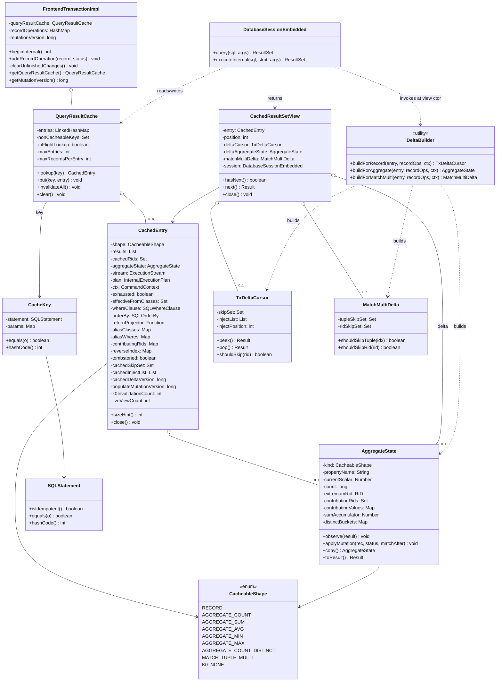
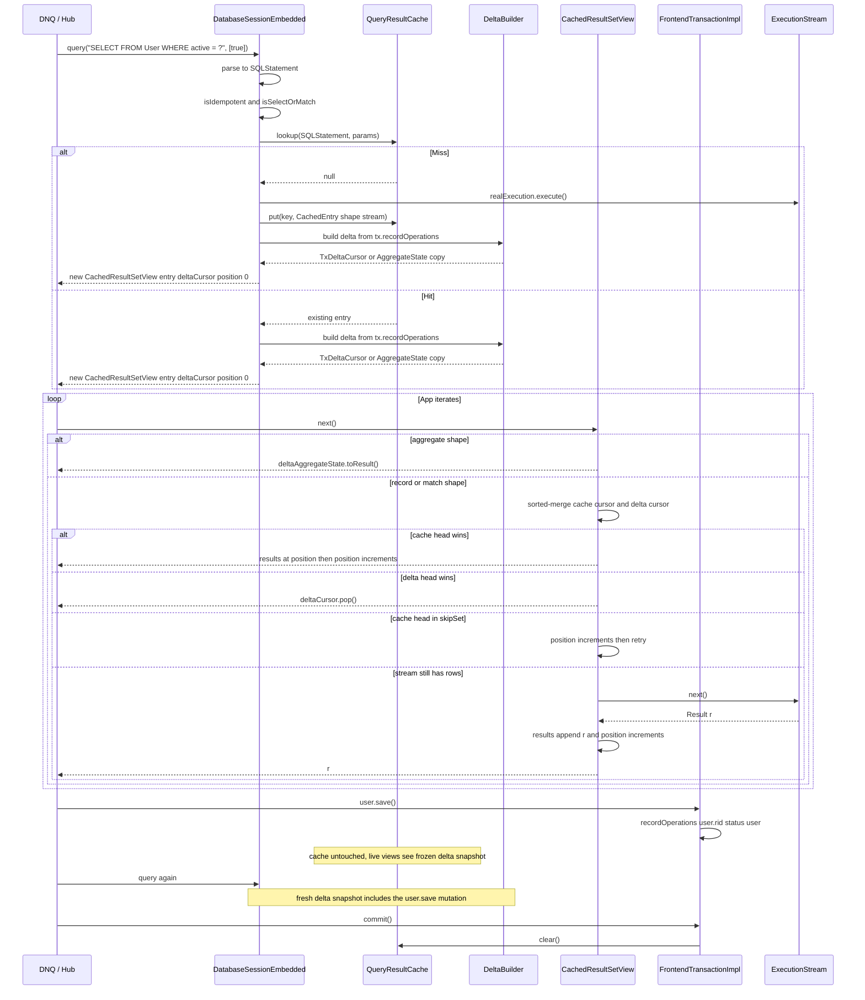

<!-- workflow-sha: 8995acfc3b0c50453595911342427c60742617b4 -->
# YTDB-820 Transaction-scoped query result cache — Design

## Overview

YouTrackDB adds an opt-in **transaction-scoped query result cache** that memoises idempotent `Database.query()` results within a single transaction, gated behind `youtrackdb.query.txResultCache.enabled` and disabled by default.

YouTrackDB today re-executes every `Database.query()` call against storage, even when the same idempotent query was issued moments earlier in the same transaction. Hub and YouTrack DNQ (DSL-based query system used by YouTrack) workloads issue hundreds to thousands of duplicate-shape SELECT/MATCH queries per request — the lost cache (compared to the pre-migration Xodus `EntityIterable` cache) translates to a sustained per-request slowdown.

The cache lives on `FrontendTransactionImpl`, keyed by parsed query AST + normalized parameters, and is wiped on every transaction-end path (commit, rollback, close). Each `query()` call returns a view over the cached storage rows merged with a snapshot of in-transaction mutations relevant to the query's class set; the merge runs at iteration time and the view returns the same sequence a fresh uncached execution would return at the moment of the call. Non-deterministic queries (sysdate, random, uuid, per-row context variables) bypass the cache via a denylist AST walk; the existing `noCache` hint extends the opt-out to per-query granularity. Paginated queries (carrying SKIP or LIMIT) and shapes whose results the merge cannot reconcile incrementally (LET, GROUP BY, expression aggregates) cache under a mutation-version fallback that serves repeated reads while no mutation has happened in the transaction and re-populates on the next call after any tx-write.

The enabling primitives exist already: `SQLStatement.equals()` is structural; `SQLStatement.isIdempotent()` excludes mutating statements; `FrontendTransactionImpl.recordOperations` is the canonical mutation log; `clearUnfinishedChanges()` is the single tx-end sink; `SQLWhereClause.matchesFilters(record, ctx)` evaluates WHERE in memory.

Two knobs bound memory: `maxEntries` (per-tx LRU cap, default 200) and `maxRecordsPerEntry` (per-entry result-count cap, default 10000).

Bounded scope cuts (pagination coverage, multi-alias MATCH CREATED discovery, MIN/MAX recompute cost) are catalogued in § Known limitations.

Companion: `design-mechanics.md` holds long-form pseudocode and exhaustive state-machine tables for the merge-on-read mechanism. Cross-references go one direction, `design.md → design-mechanics.md`.

The rest of the document is structured as: Core Concepts → Class Design → Workflow → Cache key composition → Pause/resume mechanics → Lazy merge-on-read → Cache invalidation → Non-determinism handling → Memory bounds → Concurrency and lifecycle → Invariants → Known limitations → Open questions deferred to execution.

## Core Concepts

Seven load-bearing terms appear throughout the design. Each entry pairs the term with what it replaces or how it relates to the baseline, so the delta from today's executor is visible at a glance, and points at the section that elaborates it.

**Cacheable shape.** The static classification a query receives at first cache put, computed by `ShapeClassifier.classify(SQLStatement)`. Values are `RECORD`, `AGGREGATE_COUNT`, `AGGREGATE_SUM`, `AGGREGATE_AVG`, `AGGREGATE_MIN`, `AGGREGATE_MAX`, `AGGREGATE_COUNT_DISTINCT`, `MATCH_TUPLE_MULTI`, and `K0_NONE`. The shape drives which `DeltaBuilder` path runs and whether the entry replays or invalidates on mutation. No analogue in the baseline executor (today's `Database.query()` has no cache, so no shape classification). → § Lazy merge-on-read §"Per-shape classify".

**`K0_NONE`.** The cacheable shape for queries the delta-builder cannot reconcile incrementally (LET, GROUP BY, SKIP, LIMIT, expression-DISTINCT, cross-alias-state MATCH patterns, and the other cases enumerated in § Lazy merge-on-read). A `K0_NONE` entry caches under D18's mutation-version gate: serves replay while no tx-mutation has happened, and invalidates on the next lookup once `tx.mutationVersion` diverges from the entry's `populateMutationVersion`. → § Cache invalidation §"K0-version-fallback for NONE shapes".

**Etap A (single-alias MATCH CREATED).** Polish for "stage A". Delivered in v1: `MATCH {as:u, class:X WHERE p} RETURN <projection of u>` folds to RECORD shape via a stored `returnProjector` that wraps a record into the same single-binding tuple the executor produces. Cacheable in v1. → § Lazy merge-on-read §"MATCH Etap A — RECORD-shape composition".

**Etap B (multi-alias MATCH CREATED).** Polish for "stage B". The partial delivery in v1: `MATCH_TUPLE_MULTI` reconciles vertex DELETED and pass→fail UPDATED incrementally via the per-RID reverse index, and tombstones the entry on any CREATED, any edge-class DELETED, and any UPDATE that flips a record into a WHERE it did not previously satisfy. Edge classes named by `.out/.in/.both(label)` traversals fold into `effectiveFromClasses` so those edge ops trip the tombstone. Full constrained-pattern-walk CREATED discovery and incremental (non-tombstone) edge-DELETE are deferred to a separate ADR. → § Lazy merge-on-read §"MATCH multi-alias (partial Etap B in v1)".

**`mutationVersion` and `populateMutationVersion`.** Two monotonic `long` counters introduced by D21. `FrontendTransactionImpl.mutationVersion` increments on every `addRecordOperation` call (including collapse-update paths that mutate an existing op in place). Each `CachedEntry` stamps `populateMutationVersion` from `tx.mutationVersion` at the moment the cache miss begins driving the executor. `DeltaBuilder` filters `tx.recordOperations` by `op.version > entry.populateMutationVersion`, which suppresses the double-application that would otherwise occur because the tx-aware executor already reflects every pre-populate mutation in `entry.results`. No analogue in the baseline; the executor's tx-awareness existed but had no version anchor. → § Lazy merge-on-read §"TxDeltaCursor — record/match shape".

**`effectiveFromClasses`.** Per-entry `Set<String>` carrying the full subclass closure of every class the query reads from (FROM target, any MATCH pattern node `class:` annotation, and any edge class named by a `.out/.in/.both(label)` traversal step or bound edge alias). Computed once at entry construction per D11, stable for the entry's lifetime per I8 (schema immutable per tx). `DeltaBuilder` uses it as the O(1) class filter on every `RecordOperation`. → § Class Design.

**`TxDeltaCursor` and `DeltaBuilder`.** New types. `TxDeltaCursor` is a per-view snapshot pair `(skipSet, injectList)` that the view consults at every cache-cursor advance and every stream-pull-append. `DeltaBuilder` is a stateless utility that walks `tx.recordOperations` once at view construction to produce the cursor (record/match shape), an `AggregateState` copy (aggregate shape), or a `MatchMultiDelta` (MATCH_TUPLE_MULTI shape). No analogue in the baseline. → § Class Design and § Lazy merge-on-read.

## Class Design



**TL;DR.** Four delta-related classes carry the design: `QueryResultCache` (the LRU bounded map on the transaction), `CachedEntry` (one cache slot holding frozen results, paused stream, and AST metadata), `TxDeltaCursor` (per-view delta snapshot for RECORD and MATCH-Etap-A shape, composed of a skip-set plus sorted inject-list), and `MatchMultiDelta` (per-view delta snapshot for MATCH_TUPLE_MULTI shape, composed of a tuple-index skip-set plus RID skip-set). `CachedResultSetView` is the consumer-facing `ResultSet` wrapper that does a sorted-merge (RECORD) or per-tuple skip-iteration (MATCH_TUPLE_MULTI). `DeltaBuilder` is a stateless utility that iterates `recordOperations` once at view-construction to produce the appropriate delta shape. Everything else is hooks on existing types: `FrontendTransactionImpl` owns the cache and clears it; `DatabaseSessionEmbedded.query()` builds views; `addRecordOperation` is **not** hooked by the cache. `recordOperations` growth is what tx already records, and views snapshot it on construction.

### References
- **D1 — Cache value type is `List<Result>`, not `List<RecordAbstract>`.** *Alternatives:* literal `List<RecordAbstract>` per the spec wording; `List<Result>` (chosen). *Rationale:* `ResultSet.next()` returns `Result`, and projection queries (`SELECT name, age+1 …`) produce computed-property `Result`s that wrap no record, so caching `RecordAbstract` would exclude every projection query (half of DNQ's emission). `Result` is the type that crosses the API boundary. *Risk:* `Result`s must stay valid for replay; they carry no session state directly, so safe.
- Invariants I1 (clear on every tx-end), I2 (mutation paths owner-thread-only), I7 (view delta immutable post-construction) → § Invariants.

## Workflow

**TL;DR.** Read path: every `query()` (hit or miss) ends with a delta build from current `recordOperations` snapshot and returns a fresh `CachedResultSetView`. Miss kicks off real execution and populates `entry.results` incrementally via stream pull as the consumer iterates. Hit reuses the existing entry (immutable). Each `view.next()` is a sorted-merge between the cached cursor and the view's frozen delta-cursor (record shape) — or a direct read of `deltaAggregateState.toResult()` (aggregate shape). Mutations land in `tx.recordOperations` without touching the cache; only the **next** `query()`'s view sees them via fresh delta build. Tx end clears the whole cache.



The sequence diagram above traces one transaction's lifecycle: a miss populating an entry, a save mid-transaction, a re-query that builds a fresh delta over the post-save state, and commit clearing the cache.

### Edge cases / Gotchas
- A second consumer calling `query()` for the same key before the first finished iterating gets a separate view with its own delta snapshot. If a mutation happened between the two `query()` calls, the second consumer sees the mutation via delta; the first does not.
- If a consumer drops the view without exhausting it, the stream stays live in the cache entry until another consumer pulls it further, until LRU evicts the entry, or until tx end closes everything.
- `next()` that pulls from the live stream and appends MUST do so atomically with respect to the `position++` it does locally — trivial under the per-tx single-threading constraint.

### References
- D2 — cache key composition → § Cache key composition.
- D4 — pause/resume via shared stream → § Pause/resume mechanics.
- D5-lazy — lazy merge-on-read architecture → § Lazy merge-on-read.
- D6 — non-determinism bypass → § Non-determinism handling.
- D15 — snapshot-at-construction → § Pause/resume mechanics.

## Cache key composition

**TL;DR.** `STATEMENT_CACHE` already memoizes `SQLStatement` by query text on the parser hot path, so the AST is the cheapest equality input on hand. A `CacheKey` pairs `(SQLStatement, normalizedParams)` and delegates equality to `SQLStatement.equals()`, which is already structural over target, projection, whereClause, groupBy, orderBy, unwind, skip, limit, fetchPlan, letClause, timeout, parallel, and noCache. Same-text queries from `STATEMENT_CACHE` return the same `SQLStatement` instance, so `CacheKey.equals` short-circuits on instance identity before any deep walk.

The parser is already on the hot path. `SQLEngine.parse()` runs on every `query()` call (DatabaseSessionEmbedded:632), and the result is itself cached by the existing `STATEMENT_CACHE_SIZE` knob. The result cache lookup happens after parsing but before execution-plan creation; the AST is the input we already have.

Parameter normalization: `Object[]` form is converted to a `LinkedHashMap<Integer, Object>` keyed by positional index; the named `Map<String, Object>` form is wrapped read-only. The stored type is `Map<Object, Object>`, the same union the existing `SQLStatement.execute(...)` API carries (`SQLStatement.java:62/66/83/89`), because positional params use `Integer` keys and named params use `String` keys. Equality is `Objects.equals` deep; arrays go through `Arrays.deepEquals`. Records and identifiables compare by RID (their existing equals contract).

**Implementation outline**. `CacheKey.equals(Object o)`:
1. Identity fast-path (D12): if `this.stmt == other.stmt && Objects.equals(params, other.params)`, return true (same parsed instance from STATEMENT_CACHE).
2. Otherwise, deep equals: `this.stmt.equals(other.stmt) && Objects.equals(params, other.params)`.

`hashCode()` delegates to `stmt.hashCode() ^ params.hashCode()`.

**Different SKIP/LIMIT values produce distinct cache entries.** A page-2 query and a page-1 query of the same list are independently cached as K0_NONE entries under D18's mutation-version gate (see § Cache invalidation → K0-version-fallback for NONE shapes). Each page's first lookup misses, populates, and serves subsequent identical lookups while no mutation occurs.

### Edge cases / Gotchas
- `SQLStatement.equals()` is the same one that backs `STATEMENT_CACHE_SIZE` AST cache; `CacheKey.equals` delegates to it directly.
- Parameters containing mutable objects (e.g., a `List` the caller reuses) are a footgun: if the caller mutates the list after `query()` returns, our key becomes stale. Document and defensive-copy the parameter map at lookup time. Cost is one shallow copy per query call.
- Two parameter maps differing only in iteration order on `HashMap` would collide on equals (good — they're semantically the same parameter set).
- D12 AST identity fast-path: `STATEMENT_CACHE` returns the same `SQLStatement` instance for identical-text queries, so `CacheKey.equals` short-circuits on `stmt == other.stmt` before the deep walk. Different SKIP/LIMIT text values yield different `STATEMENT_CACHE` entries and different `SQLStatement` instances; identity fast-path does not fire across them, but the deep equals path correctly classifies them as distinct keys.
- MATCH grammar accepts SKIP at the statement level (after RETURN). `SQLMatchStatement.equals()` covers it natively; no special handling.

### References
- **D2 — Cache key = (parsed `SQLStatement`, normalized parameter map).** *Alternatives:* raw SQL-text hash; AST + params (chosen); AST `toCanonicalString` output. *Rationale:* `SQLStatement.equals()` is structural (`SQLSelectStatement:380`), giving whitespace/alias-invariant keys for free; parsing already runs on the hot path, so no extra parse cost; the param map is `Map<Object, Object>` (positional-Integer + named-String union), defensive-copied at lookup. *Risk:* AST equality is only as good as every node's `equals()` override, and `STATEMENT_CACHE` keys by text rather than AST, so deep-AST equality is new ground. Per-node equality tests plus an optional `verifyHits` re-execute spy guard it.
- **D12 — AST identity fast-path on cache lookup.** *Alternatives:* deep `equals()` on every lookup; identity (`==`) fast-path before deep equals (chosen); pre-canonicalized text key (loses D2's invariance). *Rationale:* `SQLEngine.parse()` is backed by `STATEMENT_CACHE`, so identical text returns the same `SQLStatement` instance and `CacheKey.equals` short-circuits on `==` before the deep walk, collapsing thousands of duplicate-text DNQ lookups to a pointer compare. *Risk:* the identity check must only precede deep equals, never replace it; both paths are tested.
- **D22 — `SQLInputParameter` equals/hashCode audit before the AST key reads it.** *Alternatives:* trust the parser to emit only subclass instances (untested); make `SQLInputParameter` abstract (API break); add concrete `equals`/`hashCode` delegating to subclass-comparable fields (chosen); a cache-side walker that bypasses raw-instance ASTs (cumbersome). *Rationale:* `SQLInputParameter` inherits `Object` identity-equals, so a raw instance reached via `SQLSkip`/`SQLLimit.equals` would compare by identity, causing false cache misses on textually-identical re-parses after `STATEMENT_CACHE` eviction. The failure mode is degraded hit rate, not a wrong hit, but the deep-equals path exists exactly for that re-parse case. *Risk:* a future third subclass with different fields needs the delegation revisited; a regression test forces `STATEMENT_CACHE` eviction plus re-parse to verify the hit.

## Pause/resume mechanics

**TL;DR.** A `CachedEntry` keeps a strong reference to the live `ExecutionStream` + `InternalExecutionPlan` + `CommandContext`. While not exhausted, any view that outruns the cached list calls `entry.stream.next()`, appends the result to the shared list, and returns it. When the stream reports `hasNext()==false`, the entry flips `exhausted=true`, closes the stream, nulls the reference. From that point all views are pure list-replays.

This makes `query()` calls within a transaction **idempotent in the consumer's view**: regardless of when a consumer arrives or how much of the prior consumer iterated, they all see the full, ordered, consistent result of the cached query. The first consumer to want a tail row pays its storage cost; everyone else pays nothing.

Critically — unlike the eager design — `entry.results` is only ever appended to (during initial stream pull), never reordered or removed. The deltaCursor on each view is what reconciles mutations; the cached list itself is immutable in content from the moment a row enters it.

### Edge cases / Gotchas
- **WeakValueHashMap interaction.** `DatabaseSessionEmbedded.activeQueries` is weak-valued in embedded mode (DatabaseSessionEmbedded:256). The cache holds its own strong reference to the stream inside `CachedEntry`, which keeps the consumer-facing `LocalResultSet` reachable only if the cache also tracks it — but the cache deliberately does NOT track the original wrapper, only the bare `ExecutionStream`. So the original `LocalResultSet` wrapping the stream may be GC'd, which is fine: we only need the stream itself.
- **`session.closeActiveQueries()` in `clear()`** (`DatabaseSessionEmbedded.java:3431`) iterates `activeQueries.values()` and calls `close()`. Cached streams are NOT in that map. The cache's own `clear()`, called from `clearUnfinishedChanges()` (`FrontendTransactionImpl.java:998`), is what closes paused streams on tx end.
- **Mid-iteration mutation.** When `addRecordOperation` fires, no cache state changes. The currently-live view's `deltaCursor` was snapshotted at view construction and remains frozen — the new mutation is invisible to it. The next `query()` constructs a fresh view with a fresh delta snapshot that sees the mutation. This matches the `OrderByStep` blocking-materializer contract (uncached `query()` results don't reflect mid-iteration mutations either).
- **Storage cursor lifetime.** YTDB transactions are thread-affine (`assertOnOwningThread`). A paused stream's underlying B-tree cursor stays alive between the originating `next()` and the resuming `next()` — no concurrent mutation can sneak in on another thread.

### References
- **D4 — Pause/resume via a shared `ExecutionStream` + per-view position counters.** *Alternatives:* force-exhaust on first hit (consumer-unfriendly); materialize-on-demand without resume (spec violation); pause/resume with a shared stream (chosen). *Rationale:* the spec requires "continue iterating during the next execution of the same query", which holding the live stream on the entry achieves; per-view counters make concurrent consumers safe within the single-threaded tx; stream pulls append to the shared list, so later consumers see the full ordered result. *Risk:* a longer-lived storage-cursor reference, but no new failure mode beyond normal consumer-paced iteration.
- **D15 — `TxDeltaCursor` snapshot at view construction; not refreshed mid-iteration.** *Alternatives:* rebuild the cursor on every `view.next()` (moving-target semantics, duplicate/missing rows); snapshot at construction (chosen). *Rationale:* matches the `OrderByStep` blocking-materializer contract; the natural refresh boundary is `query()` itself, so code that wants to read its own writes issues a new `query()`, the same mental model as REPEATABLE READ. *Risk:* views started before a mutation do not see it; documented, identical to uncached `OrderByStep`.
- Invariants I3 (paused-stream lifetime ≤ entry lifetime), I7 (view delta immutable post-construction) → § Invariants.

## Lazy merge-on-read

**TL;DR.** Every `CachedResultSetView` is constructed with a frozen snapshot of the tx's mutations relevant to the entry's `effectiveFromClasses`. The snapshot, either a `TxDeltaCursor` (for record/match shape) or a copy of `AggregateState` with delta replayed (for aggregate shape), is built once at view construction by `DeltaBuilder` and never refreshed mid-iteration. The cache itself is immutable from populate time. All "what does this query return given the cache + current tx state" logic lives in the delta-build step. **Cost shape:** the delta-build pays O(N) tx-mutation scan + O(p log p) sort per query; per-`next()` is O(1) when the delta is empty (true only in pure read-only tx segments with no writes on this query's classes) and O(log p) once any same-class write has landed. In Hub workloads this means per-read cost is measurably higher than a per-mutation update-in-place scheme would pay. The trade-off is accepted in exchange for architectural simplification: the cache never reacts to individual mutations, cached entries are frozen storage snapshots, and the view contract matches the existing `OrderByStep` blocking-materializer guarantee (every view sees a coherent snapshot from the moment its enclosing `query()` call returned). Full `view.next()` sorted-merge pseudocode and the sort-correctness derivation live in the companion mechanics document; the References footer at the end of this section carries the exact heading anchor. Subsections below: per-shape classify, the TxDeltaCursor build dispatch, cross-view delta sharing, stream-pull unification, view output semantics, aggregate delta, aggregate side-tap, MATCH Etap A, MATCH multi-alias, and SKIP/LIMIT handling.

### Per-shape classify

A static helper `ShapeClassifier.classify(SQLStatement) → CacheableShape` decides cacheability and merge composition for a parsed statement, computed once per entry on first cache put.
The return is one of `RECORD`, `AGGREGATE_COUNT`, `AGGREGATE_SUM`, `AGGREGATE_AVG`, `AGGREGATE_MIN`, `AGGREGATE_MAX`, `MATCH_TUPLE_MULTI`, or `K0_NONE`. The `K0_NONE` bucket covers queries that the delta-build cannot reconcile but whose result is still deterministically reproducible (LET, GROUP BY, cross-alias-state, subqueries, SKIP, LIMIT). `K0_NONE` entries cache under D18's mutation-version gate: serve from cache while `tx.mutationVersion` matches the populate-time stamp, invalidate at lookup when versions diverge.

**SKIP/LIMIT routes to K0_NONE.** Classify checks `stmt.skip != null || stmt.limit != null` before any shape-specific check. Any query carrying SKIP or LIMIT in the AST classifies as K0_NONE regardless of other features. The cache populates the entry by executing the plan as-is (no plan rewriting, no over-fetch) and stamps `entry.populateMutationVersion`. The view iterates `entry.results` directly; SKIP and LIMIT are already applied by the executor at populate time. Pure-read repeated lookups hit cache; any tx-mutation invalidates the entry on the next lookup and forces re-populate.

- **RECORD** — simple SELECT shape (`SELECT [projection] FROM Class [WHERE simple-predicate] [ORDER BY columns | deterministic-modifier-chain]`), no GROUP BY, no aggregates, no LET, no subqueries, no LET-based unionall, **no SKIP, no LIMIT**. Single-alias MATCH `MATCH {as:u, class:X WHERE simple-predicate} RETURN <projection of u>` (Etap A) classifies as RECORD with a stored `returnProjector` that constructs single-binding tuples from a record.
- **AGGREGATE_*** — single-aggregate SELECT shape (`SELECT <COUNT(*)|SUM(prop)|AVG(prop)|MIN(prop)|MAX(prop)|COUNT(DISTINCT prop)> FROM Class [WHERE simple-predicate]`), no GROUP BY, no HAVING, no expression in aggregate argument, no SKIP / LIMIT. `COUNT(DISTINCT prop)` classifies as `AGGREGATE_COUNT_DISTINCT` (D20, extends cacheability beyond what the eager design achieved); other DISTINCT shapes (`COUNT(DISTINCT a+b)`, `COUNT(DISTINCT someFunction())`) classify as `K0_NONE` since expression-DISTINCT is not delta-reconcilable.
- **MATCH_TUPLE_MULTI** — multi-alias MATCH (more than one pattern node, or any pattern node with edges, or cross-join MATCH with multiple top-level match-expressions). Every pattern node carries a `class:` annotation; no LET / UNWIND in scope; no cross-alias-state references in pattern WHEREs (`$current`, `$matched`, `$parent`, `$depth`, `${otherAlias}.X`); no subqueries in pattern WHEREs; no pattern WHERE that dereferences a link path into a class outside the pattern's read set (`where:(assignee.name = ?)` where `assignee` is a link, not an alias, routes to K0_NONE below); no SKIP / LIMIT (presence routes to K0_NONE). `effectiveFromClasses` folds in the edge classes named by `.out/.in/.both(label)` traversals and bound edge aliases. Cacheable in v1 with partial-Etap-B delta build: vertex DELETED and pass→fail UPDATED reconcile incrementally via reverseIndex; any CREATED, any edge-class DELETED, and any UPDATE that flips a record into a WHERE it did not previously satisfy tombstone the entry (see § MATCH multi-alias (partial Etap B in v1) below). Full constrained-pattern-walk discovery of new tuples on CREATED, and incremental edge-DELETE, are deferred to a separate ADR.
- **K0_NONE** — shapes that delta-build cannot reconcile but whose result is deterministically reproducible from storage + AST: any query carrying SKIP or LIMIT; GROUP BY, HAVING, expression-aggregates, MEDIAN/MODE/PERCENTILE, expression-DISTINCT (`COUNT(DISTINCT a+b)`, `COUNT(DISTINCT someFunction())`), subqueries in WHERE/target, LET clauses, MATCH patterns with cross-alias-state WHEREs (`$current`, `$matched`, `$depth`, `$parent`, `${otherAlias}.X`), MATCH patterns with subqueries in pattern WHEREs, MATCH patterns with LET / UNWIND, MATCH patterns with any pattern node lacking `class:`, MATCH patterns whose node or edge WHERE dereferences a link path into a class outside the pattern's read set (`where:(assignee.name = ?)` with `assignee` a link, not an alias; a mutation on the dereferenced record is class-filtered out of the delta-build, so the pattern is correct only under the K0 version gate). Plain-property `COUNT(DISTINCT prop)` is NOT in this list: it classifies as `AGGREGATE_COUNT_DISTINCT` per D20. Cacheable under D18's K0-version-gate: populate normally, stamp `entry.populateMutationVersion = tx.mutationVersion`, serve cache hits while `tx.mutationVersion == entry.populateMutationVersion`, invalidate the entry at lookup when versions diverge. K0_NONE entries respect `maxRecordsPerEntry` via the L7 overflow path (overflow removes the entry from the map and adds the key to `nonCacheableKeys`). Detail in § Cache invalidation → K0-version-fallback for NONE shapes.

Non-deterministic shapes (sysdate / random / uuid / $now / $current / $currentMatch / $matched / $thread / $parent / $depth / etc.) are intercepted upstream by `NonDeterministicQueryDetector` and never reach classify; they bypass the cache without entering any `CacheableShape` bucket. The walker traverses the full AST: top-level WHERE clauses, ORDER BY items and their modifier chains, RETURN expressions, MATCH per-alias WHEREs, MATCH WHILE conditions, and any nested expression position. A per-row variable buried anywhere in the query forces bypass.

### TxDeltaCursor — record/match shape

**Populate-version filter (D21).** Each `RecordOperation` in `tx.recordOperations` carries a `version: long` stamped from `tx.mutationVersion` at the moment of its `addRecordOperation` call. Each `CachedEntry` carries `populateMutationVersion: long` stamped from `tx.mutationVersion` at the moment the cache miss begins driving the executor. `DeltaBuilder` iterates only those `RecordOperation`s whose `op.version > entry.populateMutationVersion`. Mutations that happened **at or before** populate are already reflected in `entry.results` by the tx-aware executor (`RecordIteratorCollection` emits tx-CREATED records via its `nextTxId` phase; `FrontendTransactionImpl.loadRecord` returns in-memory tx-UPDATED state; tx-DELETED throws `RecordNotFoundException` so the iterator skips). Filtering them out of the delta build prevents double-application against the populate-time snapshot.

`DeltaBuilder.buildForRecord(entry, tx, ctx)` first takes a **snapshot** of the filtered recordOperations entries via `var snapshot = tx.recordOperations.values().stream().filter(op -> op.version > entry.populateMutationVersion).toList()` before iterating. The snapshot is required because `WHERE.matchesFilters` evaluations may invoke user-defined functions which can call `session.save(...)`, causing structural modification of `tx.recordOperations` mid-iteration (Java HashMap throws `ConcurrentModificationException` on detection; even safe modes would yield observably-inconsistent iteration). Records added by UDF-triggered mutations during the build are NOT visible in this delta; they will be visible to the NEXT view constructed after the build returns, when `mutationVersion` has advanced and a fresh delta is built (per § Cross-view delta sharing via mutationVersion). The snapshot is O(p') allocation where p' is the count of post-populate mutations on relevant classes, amortized across all views at the same mutationVersion via Option C sharing. The build iterates the snapshot. For each `RecordOperation`:

1. **Class filter:** if `op.record.getSchemaClass().getName() ∉ entry.effectiveFromClasses`, skip (O(1) hash-set contains; the closure is precomputed at entry construction per D11). Non-`Entity` records and entities with null schema class skip the entry.
2. **WHERE evaluation:** `match_after = entry.whereClause.matchesFilters(op.record, ctx)`. For shapes with no WHERE clause, treat as `true`.
3. **Cache-membership check:** `cached_at_build = entry.cachedRids.contains(op.rid)`. `cachedRids` is a `Set<RID>` populated incrementally as the stream pulls records into `entry.results`; at view-construction time it reflects only the prefix the stream has pulled so far, NOT the full storage result set. The lazy stream-pull (pause/resume) semantics mean `cached_at_build=false` does NOT imply "this record is not in the result"; it can mean "this record exists in storage but the stream hasn't reached it yet". See § Stream-pull dispatch unification below for how this gap is closed.
4. **Dispatch on `(op.type, cached_at_build, match_after)`**:

| op.type | cached_at_build | match_after | Action |
|---|---|---|---|
| CREATED | true  | true  | `skip_set.add(op.rid); inject_list.add(op.record)` (collapse case: pre-populate CREATE that absorbed a post-populate UPDATE in place per `FrontendTransactionImpl.addRecordOperation:604-610`; record is in cache from populate but ORDER BY position may have shifted — re-position via skip+inject) |
| CREATED | true  | false | `skip_set.add(op.rid)` (collapse case: post-populate UPDATE drove WHERE to false; record was in cache from populate, remove it) |
| CREATED | false | true  | `inject_list.add(op.record)` (true post-populate CREATE; never seen by populate, never in cache) |
| CREATED | false | false | no-op (true post-populate CREATE that doesn't match WHERE) |
| UPDATED | true  | true  | `skip_set.add(op.rid); inject_list.add(op.record)` (re-position in case ORDER BY key changed) |
| UPDATED | true  | false | `skip_set.add(op.rid)` (post-mutation no longer matches WHERE; remove from result) |
| UPDATED | false | true  | `skip_set.add(op.rid); inject_list.add(op.record)` (record not yet stream-pulled but tx mutated it; inject the post-mutation state + suppress any later stream-pull of the pre-mutation state) |
| UPDATED | false | false | `skip_set.add(op.rid)` (suppress later stream-pull of the pre-mutation state) |
| DELETED | true  | *     | `skip_set.add(op.rid)` (record in cache, suppress cached-cursor emission) |
| DELETED | false | *     | `skip_set.add(op.rid)` (record not yet stream-pulled, suppress later stream-pull) |

**Why `cached_at_build` is still load-bearing under D21.** The populate-version filter (D21) restricts which ops enter the dispatch, but does NOT collapse the dispatch logic itself. `FrontendTransactionImpl.addRecordOperation` collapses successive saves on the same RID into a single `RecordOperation` whose `type` reflects the FIRST status (CREATE+UPDATE stays CREATED per `FrontendTransactionImpl.java:604-610`) and whose `version` reflects the LATEST mutation timestamp. So a `CREATED` op with `op.version > entry.populateMutationVersion` can be either a true post-populate CREATE (never in cache) or a pre-populate CREATE whose post-populate UPDATEs bumped its version (record in cache via populate). `cached_at_build` is the runtime distinguisher: same op type, different cache state, different dispatch.

5. **For MATCH Etap A** (procedural step ordering before sort, per architectural review): wrap each raw record currently in `inject_list` through `entry.returnProjector(rec, ctx)` BEFORE sorting, producing a single-binding tuple `Result` matching the original RETURN-clause shape. After this step, `inject_list` contains projected `Result` tuples (not raw records). This ordering is required because ORDER BY may reference a projected column (`ORDER BY double_age` where `double_age = u.age * 2` is computed by the projector); the comparator cannot resolve such references on a raw record.
6. **Sort `inject_list`** by `entry.orderBy` comparator (O(p log p)). For ORDER BY null, append in iteration order (no sort). For RECORD shape, the list at this point already contains `Result`-wrapped records (the populate path wraps each record in a `ResultInternal` during stream pull). For MATCH Etap A, the list contains projected tuples per step 5.
7. Return `new TxDeltaCursor(skipSet, injectList)`.

### Cross-view delta sharing via mutationVersion

The `(skipSet, injectList)` pair is a pure function of `(entry's frozen metadata, tx.recordOperations content)`. Two views constructed on the same entry at the same recordOperations state have identical deltas. To avoid per-view allocation (Hub pattern: 1-3 mutations followed by many same-class reads → up to 50-200 views built against the same stable recordOperations), the entry caches the latest computed pair and reuses it for any new view whose construction observes the same state.

`recordOperations.size()` is NOT a sufficient key: `FrontendTransactionImpl.addRecordOperation` collapses repeated operations on the same RID in place (UPDATED→DELETED keeps the size constant but changes the dispatch outcome, since DELETED suppresses inject_list while UPDATED contributes to it). To capture every change, `FrontendTransactionImpl` exposes `mutationVersion: long`, a monotonic counter incremented on every `addRecordOperation` call (whether a new record or a type-change on an existing one). The collapse path **also updates the existing op's `version` field to the new `mutationVersion`**, so `op.version` always reflects the latest mutation timestamp for its RID, which is exactly what D21's `op.version > entry.populateMutationVersion` filter needs to decide whether the latest collapsed state has already been observed by populate.

`DeltaBuilder.buildForRecord(entry, tx, ctx)` algorithm:

```
v = tx.getMutationVersion()
if entry.cachedDeltaVersion == v && entry.cachedSkipSet != null:
    // Reuse: another view on this entry already built the delta at this exact tx state
    skipSet = entry.cachedSkipSet          // shared immutable ref
    injectList = entry.cachedInjectList    // shared immutable ref
else:
    // Build (single pass over D21-filtered recordOperations)
    skipSet = new HashSet<>()
    injectList = new ArrayList<>()
    snapshot = tx.recordOperations.values().stream()
               .filter(op -> op.version > entry.populateMutationVersion)
               .toList()
    iterate(snapshot) → populate skipSet, injectList per dispatch table
    sort(injectList, entry.orderBy)
    // Promote to entry cache (overwriting any older version's cache) — use unmodifiable wrappers
    entry.cachedSkipSet = Collections.unmodifiableSet(skipSet)
    entry.cachedInjectList = Collections.unmodifiableList(injectList)
    entry.cachedDeltaVersion = v
// Both first-build and reuse paths hand the cursor the unmodifiable wrappers (immutability-surface fix —
// consistent immutability surface across both branches).
return new TxDeltaCursor(entry.cachedSkipSet, entry.cachedInjectList, injectPosition=0)
```

Each `TxDeltaCursor` holds its own `injectPosition` counter (the iteration cursor) — that's per-view mutable state. The underlying skipSet and injectList are immutable; sharing them is safe.

**Garbage collection**: when a new view at a fresher `mutationVersion` triggers rebuild, `entry.cachedSkipSet` and `entry.cachedInjectList` point at the new pair. Older views still hold their TxDeltaCursor references to the OLD pair via their `deltaCursor` field — those older pairs stay live for as long as any view references them, then become unreachable and are GC'd. The entry only ever holds a strong ref to the **latest** pair, so it does not pin older versions.

**Self-healing version mismatch.** A UDF-triggered `save()` during `WHERE.matchesFilters` can bump `mutationVersion` after the build started but before it promotes its pair to `entry.cachedSkipSet`. The promote then writes a "stale-on-arrival" pair: the entry briefly holds a pair tagged at an older version than `tx.getMutationVersion()`. This is **self-healing**: any subsequent view at the current (higher) version sees the version mismatch and rebuilds, immediately overwriting the stale-on-arrival pair. Wasted memory is bounded by O(p) per such mismatch, freed on the next rebuild. No correctness hazard — view-A returns a correct delta for the snapshot it iterated; view-C rebuilds for the new state.

**Memory footprint**: bounded by `Σᵢ pᵢ` where the sum is over the distinct mutationVersion values currently alive across all live views. For Hub typical (1 view alive at a time, modest p): O(p) per entry. Worst case (V live views at V distinct mutationVersions): O(V × p_max). Each entry's overhead is at most `2 × p × 48B` for the cached pair plus the per-view injectPosition cursor (one int).

### Stream-pull dispatch unification

**The skip_set is consulted twice**, not once: at every cache-cursor advance (the standard merge) AND at every stream-pull-append. The latter closes the gap created by lazy stream-pulling: a tx-mutated RID that lives in storage beyond the cached prefix would otherwise emerge from the stream pull with stale state (or duplicate the delta's inject_list emission). Per the post-D21 dispatch table above, every post-populate tx-mutation adds the RID to `skip_set` for UPDATED and DELETED cases. CREATED ops add only to inject_list (no skip_set entry needed): post-populate CREATEs by definition have temp RIDs that the executor cannot have already emitted, because their `addRecordOperation` happened after `entry.populateMutationVersion`.

The stream-pull-append path becomes:

```
stream_pull_one():
  while !entry.exhausted:
    r = entry.stream.next(entry.ctx)
    rid = r.getRecord().getIdentity()
    if deltaCursor.shouldSkip(rid):
      // stale storage emission of a tx-mutated record; drop it
      continue
    entry.results.add(r); entry.cachedRids.add(rid)
    return r
  return null  // exhausted
```

This unifies the dispatch: any RID in `skip_set` is suppressed from BOTH the cache cursor (already in `entry.results`) and the stream cursor (will be appended). The inject_list is the sole source of truth for the post-tx-mutation state of any mutated record.

**Cost**: one hash-set lookup per stream-pull. Bounded by `entry.results.size()` lookups per full iteration; negligible.

The view's `next()` then performs a sorted-merge between the positional cache cursor (advancing through `entry.results`) and the delta cursor (advancing through the immutable `injectList` built at view construction). Each loop iteration first drops any cache-head whose RID is in the delta's skip-set, then materializes the next storage row via `stream_pull_one()` when the cache is exhausted but the stream is not (this step is load-bearing for sort correctness: a delta inject whose ORDER BY key sorts after some not-yet-pulled storage row would otherwise emerge before that row). With both cursors carrying a head, the loop emits whichever sorts smaller per ORDER BY; ties favour the delta cursor so mutated rows land at-or-before equally-ranked cached rows. Full pseudocode lives in `design-mechanics.md §"Lazy merge-on-read"` under the "View iteration" subsection.

### View output semantics under lazy population (clarifies I7)

A `deltaCursor` is immutable post-construction.
The cache entry's `results` list and `cachedRids` set ARE mutated by stream-pull-append during iteration (this is how the lazy path operates). What I7 guarantees is that **the deltaCursor's skipSet and injectList, and therefore the set of records the view emits and their relative order, is fixed at view construction**. Stream-pulled records that are NOT in the skipSet are appended; this affects subsequent views constructed against the same entry, but never the current view's emission set or order. The cached `Result` instances wrap record references; if the underlying record's properties are mutated mid-iteration via `save()`, both the cache-cursor read and any later stream-pull-append observe the post-mutation values. That matches the standard YTDB record-reference semantics, not snapshot isolation at the property level.

### Aggregate delta — AGGREGATE_* shapes

For `AGGREGATE_*`, the cached entry carries an immutable `AggregateState` populated at entry-creation by the `AggregateCacheTapStep` side-tap (a new execution-plan step spliced upstream of `AggregateProjectionCalculationStep` that observes every contributing record before aggregation collapses them into a scalar row; see § Aggregate side-tap below for the splice mechanism). At view construction, `DeltaBuilder.buildForAggregate(entry, recordOps, ctx)`:

1. **Copy:** `deltaState = entry.aggregateState.copy()`. The copy is shallow-deep, with new mutable containers (`contributingRids`, `contributingValues`, and for COUNT_DISTINCT the `distinctBuckets` map plus per-bucket Sets) but reuse of underlying RID, Number, and bucket-key references.
2. **Replay applyMutation:** iterate the populate-version-filtered subset `tx.recordOperations.values().stream().filter(op -> op.version > entry.populateMutationVersion)` (D21), class filter as above, compute `match_after`, call `deltaState.applyMutation(record, status, match_after)` on the copy. The filter prevents double-application: pre-populate mutations were already observed by `AggregateCacheTapStep` at populate time and are baked into `entry.aggregateState`. The algorithm and `applyMutation` body are the same the eager design called from `invalidateOnMutation`; only the driver and the filter changed.
3. View carries `deltaState` (not a `TxDeltaCursor`); `view.next()` returns `deltaState.toResult()` directly. `hasNext()` is true exactly once (aggregate queries return a single row).

**Storage-parity for SUM/AVG (D19).** AggregateState for SUM/AVG carries `sumAccumulator: Number` whose type evolves through `PropertyTypeInternal.increment(current, value)`, the same call storage's `SQLFunctionSum.sum` and `SQLFunctionAverage.sum` make on every observed value. `observe()` calls `increment` on each new value, identical to storage; `applyMutation()` re-folds `contributingValues.values()` through `increment` from null for T→T / T→F / F→T transitions (PropertyTypeInternal exposes no symmetric `subtract`, so storage-parity dictates the full re-fold). Cache result type and value match fresh execution bit-for-bit across Long+Integer, Long+Double, Integer+Float, BigDecimal+Long mixed-input scenarios, including Long-overflow wrap at `Long.MAX_VALUE+1` and Long→Double precision loss at `2^53+1` (both paths produce the same lossy result by construction). The earlier BigDecimal internal accumulator + pinned-return-type design was abandoned because it diverged from storage on the Double-promotion case: pinned-Long replay would coerce a BigDecimal sum back to Long, while fresh execution returned Double after the Double-input promoted the running total.

**AGGREGATE_COUNT_DISTINCT (D20).** For `COUNT(DISTINCT prop)`, the cached entry carries `distinctBuckets: Map<Object, Set<RID>>`. Each distinct value maps to the set of RIDs currently contributing it; the scalar is `distinctBuckets.size()` (recomputed at `toResult()`, not maintained as a separate counter). The reverse lookup uses the existing `contributingValues: Map<RID, Object>` (storing the raw value per RID, needed for transition dispatch on UPDATED). Bucket keys use raw `Object.equals`/`hashCode`, mirroring `SQLFunctionDistinct.getResult`'s `LinkedHashSet<Object>` semantics, so `Long(5)` and `Integer(5)` ARE distinct buckets (matching storage); non-numeric values (strings, RIDs) follow the same rule trivially. The earlier "BigDecimal coercion collapses cross-subtype duplicates" design was abandoned together with D19's BigDecimal accumulator because it diverged from storage's `LinkedHashSet`-Object semantics.

`applyMutation` transitions for AGGREGATE_COUNT_DISTINCT:
- **F→F** — no-op.
- **F→T (CREATED with `matchAfter=true`, or UPDATED entering WHERE)** — compute `newKey` from the post-state, add `rid` to `distinctBuckets.computeIfAbsent(newKey, k -> new HashSet<>())`, store `contributingValues.put(rid, newKey)`. The scalar grows by 1 if the bucket was empty before, else stays.
- **T→F (DELETED, or UPDATED leaving WHERE)** — look up `oldKey = contributingValues.get(rid)`, remove `rid` from `distinctBuckets.get(oldKey)`, if the resulting set is empty remove the bucket key from the map, then `contributingValues.remove(rid)`. Scalar shrinks by 1 if the bucket emptied.
- **T→T with same key** — value unchanged in DISTINCT terms, no-op.
- **T→T with key change** — remove `rid` from `distinctBuckets.get(oldKey)` (cleanup empty bucket), add to `distinctBuckets.computeIfAbsent(newKey, ...)`, update `contributingValues.put(rid, newKey)`. Scalar reflects the net bucket count change.

Coverage delta vs eager: eager classified `COUNT(DISTINCT)` as K0 (wipe on first mutation, alongside MEDIAN / MODE / PERCENTILE). D20 promotes plain-property `COUNT(DISTINCT prop)` to a delta-reconcilable shape; expression-DISTINCT (`COUNT(DISTINCT a+b)`, `COUNT(DISTINCT someFunction())`) stays K0_NONE under D18's version gate. Memory profile matches existing AGGREGATE_* entries: the bucket map is the same shape and order-of-magnitude as `contributingValues`.

**Why MIN/MAX recompute is amortized O(1) without the D14 sorted-value index.** `applyMutation` for MIN/MAX dispatches on `was_extremum = rid.equals(entry.extremumRid)` (RID identity, not `Number.equals`, to sidestep the cross-`Number`-subtype hazard). Of the eleven dispatch cases below, only three trigger the O(n) scan over `contributingValues`; the remaining eight are O(1) bookkeeping. For workloads where the extremum is stable (which dominates the Hub aggregate profile — "max(salary) across 1000 employees, the extremum holder changes rarely"), per-mutation cost amortizes to O(1).

| Case | Action | Cost |
|---|---|---|
| CREATED + match_after=true + new value beats current scalar | `currentScalar = newValue; extremumRid = newRid; contributingValues.put(rid, newValue)` | O(1) |
| CREATED + match_after=true + new value does not beat | `contributingValues.put(rid, newValue)` (scalar unchanged) | O(1) |
| CREATED + match_after=false | no-op | O(1) |
| DELETED + `was_extremum=false` | `contributingValues.remove(rid)` (scalar unchanged) | O(1) |
| DELETED + `was_extremum=true` | `contributingValues.remove(rid)` + scan remaining values for new extremum | **O(n)** |
| UPDATED + match_after=false + `was_extremum=false` | `contributingValues.remove(rid)` (scalar unchanged) | O(1) |
| UPDATED + match_after=false + `was_extremum=true` | `contributingValues.remove(rid)` + scan for new extremum | **O(n)** |
| UPDATED + match_after=true + `was_extremum=false` + new value beats scalar | `currentScalar = newValue; extremumRid = rid; contributingValues.put(rid, newValue)` | O(1) |
| UPDATED + match_after=true + `was_extremum=false` + new value does not beat | `contributingValues.put(rid, newValue)` (scalar unchanged) | O(1) |
| UPDATED + match_after=true + `was_extremum=true` + new value stays in extremum direction (for MAX, `new ≥ old`; for MIN, `new ≤ old`) | `currentScalar = newValue; contributingValues.put(rid, newValue)` (`extremumRid` unchanged — the holder kept the slot) | O(1) |
| UPDATED + match_after=true + `was_extremum=true` + new value lost extremum direction | `contributingValues.put(rid, newValue)` + scan for new extremum | **O(n)** |

The three O(n) cases share one structural property: the previous extremum holder either left or dropped below extremum direction, so the new extremum is unknown without scanning the remaining values. Every other mutation has enough information from `was_extremum` plus a single comparison against `currentScalar` to update in O(1).

**Memory-budget asymmetry.** `contributingValues: Map<RID, Object>` is a **blocking dependency** for any aggregate delta: SUM needs old values to subtract on UPDATED, AVG needs them to recompute the running mean, MIN/MAX needs them for the O(n) recompute scan, COUNT_DISTINCT uses them as the reverse-lookup for bucket transition dispatch. Therefore every AGGREGATE_* entry carries `contributingValues` unconditionally; its O(n) memory cost is the price of incremental delta-build at all. The D14 `TreeMap<BigDecimal, Set<RID>>` sorted-value index is, in contrast, an **optional optimization on top** that would replace the O(n) extremum recompute with O(log n) at the cost of ~3× memory growth per MIN/MAX entry. Cost-benefit analysis on the D14 sorted-value index: Hub-typical workloads (5-20 MIN/MAX queries × 100-1000 contributors × ~1/n hit rate on the extremum-touching cases above) save ~5 μs per HTTP request, not observable against ~hundreds of ms response time. The decision to keep `contributingValues` and defer the TreeMap is therefore: the base cost buys correctness, the extra cost would buy worst-case latency floor that nobody is measuring. D13 Hub-replay measures extremum-churn frequency; if non-trivial, v1.1 promotes D14 as hardening.

### Aggregate side-tap

Entry-population for `AGGREGATE_*` shapes requires per-RID material to seed `contributingValues` and `contributingRids`.
The collapsed `ResultSet` carries only the scalar, with no per-RID data to derive from. The mechanism below recovers that material by observing every contributing record before the aggregate step collapses them into a scalar row.

`AggregateCacheTapStep extends AbstractExecutionStep` is spliced into the plan chain immediately upstream of `AggregateProjectionCalculationStep` (`AggregateProjectionCalculationStep.java:121-137` shows the blocking aggregation loop: `prev.start(ctx)` → `while lastRs.hasNext: aggregate(lastRs.next, ctx, ...)`). The tap step's `internalStart(ctx)` calls `prev.start(ctx)` (`prev` is the public field on `AbstractExecutionStep:66`) to obtain the upstream `ExecutionStream`, then returns a wrapping `ExecutionStream` whose `next(ctx)` invokes `entry.aggregateState.observe(result)` before forwarding the unchanged `Result` to the consumer. `observe(result)` reads `result.getRecord().getIdentity()` for the RID and the projection-target property via the prebuilt extractor; for `COUNT(*)` it only adds to `contributingRids`. The tap is transparent to the downstream aggregate step.

**Splice point.** Post-construction plan rewrite: `DatabaseSessionEmbedded.query()` miss path builds the plan via `statement.createExecutionPlan(ctx, false)` (instead of `statement.execute(...)`, which immediately wraps the plan in a `LocalResultSet` and loses direct access), downcasts to `SelectExecutionPlan` to walk its `steps` list, finds the `AggregateProjectionCalculationStep`, and rewires its `prev` link to a new `AggregateCacheTapStep` whose own `prev` is the original upstream. The cache then drives the plan via `plan.start(ctx).next(ctx)`, a single call that forces the aggregate step's blocking drain (which in turn drives the tap to observe every upstream record). The captured single-row aggregate Result is held on the entry alongside the now-fully-populated `aggregateState`. Local to cache code; no planner changes.

**Splice failure fallback.** If the planner emits an unexpected shape (no `AggregateProjectionCalculationStep` found after walking `SelectExecutionPlan.steps`, or the cast to `SelectExecutionPlan` fails), the cache code: (1) closes the constructed plan (best-effort), (2) increments `QueryCacheMetrics.spliceFailures`, (3) falls back by calling `statement.execute(session, args)` to obtain a standard `LocalResultSet`, (4) returns that `LocalResultSet` directly to the consumer (no cache entry, no view wrapping). A warning is logged identifying the unexpected step types so the planner-versioning issue is surfaced.

**Eager drive on cache-put, and why this asymmetry is necessary.** Aggregate cache-miss fully drives the plan before returning the view; RECORD / MATCH-Etap-A cache-miss does not. The asymmetry is not a design inconsistency. The two shapes have different cacheability semantics:

- **RECORD / MATCH-Etap-A**: the cache stores per-row Results. Each row is independent. A consumer who pulls 3 rows and abandons the view has cached 3 valid rows; the entry is partially-populated but every cached row is correct and usable. A subsequent view at the same key picks up where the stream paused. Lazy stream-pull is safe and saves storage I/O.

- **AGGREGATE_***: the cache stores a single scalar (`AggregateState.currentScalar` etc.) derived from observing EVERY contributing record. A consumer who never iterates the view causes the tap to fire zero times; `aggregateState` reflects no observations; the cached scalar is structurally meaningless. A subsequent view reading the entry would return a wrong number (silently). Lazy stream-pull would produce silent corruption.

Eager drive on aggregate cache-put resolves this by FORCING `aggregateState` to full population at cache-put time: the tap observes every record because the aggregate step's blocking drain pulls every record. The cost equals an uncached aggregate execution (the consumer would wait for the aggregate row anyway). The trade-off is: aggregates cannot defer storage I/O to consumer-pace; the I/O happens at `query()` time. For aggregates this is correct semantics, not a perf hit, since every aggregate query already exhibits this latency profile uncached.

### MATCH Etap A — RECORD-shape composition

Single-alias MATCH `MATCH {as:u, class:X WHERE simple-predicate} RETURN <projection of u>` classifies as `RECORD` with extra state on the entry:
- `effectiveFromClasses = {X} ∪ subclass closure` (closure step described under D11 in the References footer)
- `whereClause = pattern's where: clause for alias u`
- `orderBy = the ORDER BY from the MATCH statement (if any)`
- `returnProjector: Function<RecordAbstract, Result>` — a closure built at entry construction from the MATCH `RETURN` clause that takes a single record and produces a `Result` shaped like the original execution's output (e.g., `RETURN u, u.name` produces `Result{u: rec, name: rec.name}`).

Delta-build for MATCH Etap A is the RECORD path with the `returnProjector` applied to each inject-list entry. Equivalence vs fresh re-execution is validated by an equivalence test that runs the same MATCH twice (cache miss then hit + delta) and asserts result-set equality across CREATED/UPDATED/DELETED scenarios.

### MATCH multi-alias (partial Etap B in v1)

Multi-alias MATCH (more than one pattern node, or any pattern node with edges, or cross-join with multiple top-level match-expressions) classifies as `MATCH_TUPLE_MULTI` when the classify gates hold (every node has `class:`, no LET/UNWIND, no cross-alias-state references in pattern WHEREs, no subqueries in pattern WHEREs, `n + m <= maxRecordsPerEntry`). Entries carry per-tuple bookkeeping that mirrors the eager design's `MATCH_TUPLE` but is consumed by a lazy DeltaBuilder rather than per-mutation invalidation:

- `effectiveFromClasses = ⋃ aliasClasses.values() ∪ traversalEdgeClasses` (union of every alias's subclass closure plus the subclass closure of every edge class named by a `.out/.in/.both(label)` traversal step). Folding edge classes in is what lets an edge `RecordOperation` pass the class filter instead of being skipped.
- `aliasClasses: Map<String, Set<String>>` — per-alias class set with subclass closure via `SchemaClass.getAllSubclasses()` (D11 symmetry). Bound edge aliases are alias entries like any other.
- `traversalEdgeClasses: Set<String>` — subclass closure of every edge class named by a `.out/.in/.both(label)` step that binds no alias. Used to widen `effectiveFromClasses` and the tombstone trigger; unbound traversal edges carry no per-tuple RID in the floor.
- `aliasWheres: Map<String, SQLWhereClause>` — per-alias pattern WHERE clause, for vertex aliases and bound edge aliases alike
- `contributingRids: Map<Integer, Set<RID>>` — per-tuple-index, the set of RIDs across all alias bindings in that tuple. Populated during stream-pull as each `Result` is appended to `entry.results`.
- `reverseIndex: Map<RID, Set<Integer>>` — inverse lookup; for each RID, the set of tuple-indices that reference it. Populated incrementally alongside `contributingRids`. Which alias a RID fills within a given tuple (`rid-binds-alias` in the pseudocode) is read from the cached tuple `Result` at `entry.results[i]` via `getProperty(alias)`.
- `tombstoned: boolean` — set true at delta-build when the pre-scan or UPDATED branch hits an un-injectable case: any CREATE of a class in `effectiveFromClasses`, any edge-class DELETE, or an UPDATE that flips a record into an alias WHERE it did not previously bind (update-into-match). A tombstoned entry is removed from the cache at lookup time and forces re-execution.

**Population**. `CachedResultSetView` pulls each `Result` from `entry.stream` and appends to `entry.results`. For each alias `a` in `aliasClasses.keySet()`, the view reads `r.getProperty(a)` (the alias-bound record), extracts its RID, and updates `contributingRids[currentTupleIndex].add(rid)` plus `reverseIndex.computeIfAbsent(rid, _ -> new HashSet<>()).add(currentTupleIndex)`. Adds ~one HashSet lookup per alias per tuple to stream-pull cost; bounded by entry size × alias count.

**DeltaBuilder.buildForMatchMulti(entry, tx, ctx)**. Two-pass algorithm with tombstone short-circuit. The populate-version filter (D21) applies symmetrically: only post-populate mutations enter the build. Pre-populate mutations were already observed at populate time — the executor walked the multi-alias pattern over a tx-aware view that included them, so they are already represented in `entry.results` and in `contributingRids` / `reverseIndex`.

Full two-pass pseudocode (the tombstone pre-scan, then the per-tuple `tupleSkipSet` + per-RID `ridSkipSet` build with the update-into-match and pass→fail branches) lives in the mechanics companion: `design-mechanics.md §"MATCH multi-alias (partial Etap B in v1)"`. The shape: a tombstone short-circuit (CREATE of any class in `effectiveFromClasses`, edge-class DELETE, or UPDATE-into-match returns TOMBSTONE), else a per-tuple / per-RID skip-set build that drops vertex-DELETE tuples and pass→fail-UPDATE tuples.

**View iteration**. View carries the immutable `MatchMultiDelta`. `view.next()`:
- Skip cached tuples whose index is in `tupleSkipSet`.
- Materialize from stream when cache is exhausted; for each pulled `Result`, before appending: for each alias's bound RID, check `ridSkipSet`. If ANY alias's binding is in `ridSkipSet`, drop the tuple (don't append, pull next). Otherwise append, populate `reverseIndex` and `contributingRids` for the new tuple index, return.

**Tombstone handling**. At cache lookup time, `cache.lookup(key)`:
- Find entry. If shape is `MATCH_TUPLE_MULTI`, invoke `DeltaBuilder.buildForMatchMulti`.
- If builder returns TOMBSTONE: `entries.remove(key)`, return null (miss). Caller falls through to `statement.execute(...)`. Next subsequent lookup re-populates the entry from scratch.
- Else: cache the `MatchMultiDelta` on the entry (Option C sharing via `mutationVersion`) and return the entry.

Tombstone is single-shot per mutationVersion increment. A second CREATED in the same mutationVersion-window is idempotent (entry already tombstoned). Once the entry is removed and re-populated, the next CREATED triggers a new tombstone on the new entry.

**What this covers** (`MATCH {as:i, class:Issue}.out('project'){as:p, class:Project} RETURN i, p`):
- `tx.save(updated_issue)` — UPDATED, vertex still in tuples. Re-eval the `i` alias WHERE; the tuple stays if it still matches, drops otherwise.
- `tx.delete(some_issue)` — vertex DELETED. All tuples holding that issue's RID drop via reverseIndex.
- `tx.delete(project_edge)` on the traversed `project` edge — edge-class DELETED. Tombstones the entry: the edge class is in `effectiveFromClasses`, but the unbound edge RID is not tracked, so the floor cannot drop just the affected tuple. Next query re-executes fresh.
- `tx.save(new_edge)` between an existing issue and project — edge-class CREATED. Tombstones the entry; a skip-only delta cannot inject the new tuple.
- `tx.save(issue)` that flips a non-participating issue into matching the `i` WHERE — UPDATE-into-match. Tombstones the entry; the issue may now form new tuples through its existing edges.
- Bound edge alias (`.outE(){as:e, class:WorksOn, where:(weight>5)}.inV()`) UPDATE that flips `e` out of its WHERE — pass→fail drop via reverseIndex (the bound edge RID is tracked from population).

**What this does NOT cover** (deferred to a separate ADR, both correctness-neutral because the floor tombstones the cases):
- Constrained-pattern-walk CREATE discovery — injecting the new tuples a vertex CREATE, an edge CREATE, or an UPDATE-into-match should produce. Discovery needs net-new infrastructure (`MatchPrefetchStep` plus an edge-CREATED dispatch hook).
- Incremental edge-DELETE — dropping only the affected tuple on an unbound-traversal-edge DELETE instead of tombstoning the whole entry. The incremental path (endpoint-content reverse index) is a D13-gated optimization, detailed in § Open questions deferred to execution.

**Why this floor is the right v1 scope**. Correctness rests entirely on the delta-build, because `MATCH_TUPLE_MULTI` carries no mutation-version backstop (only K0_NONE does). The floor makes the delta-build provably complete for everything `classify` admits: every mutation that can change the result touches a class in `effectiveFromClasses`, and each is either reconciled incrementally (vertex DELETE, pass→fail UPDATE) or tombstoned (any CREATE, edge DELETE, UPDATE-into-match). The two remaining refinements (constrained-walk CREATE discovery, incremental edge-DELETE) are optimizations, not correctness gaps, and both gate on D13 measurement.

### SKIP and LIMIT handling

For RECORD / AGGREGATE / MATCH_TUPLE_MULTI shapes (which by definition carry no pagination), the executor produces all matching records up to `maxRecordsPerEntry`. If storage has more matching records than the cap, the entry overflows and is removed from the cache atomically with the overflow detection (per § Memory bounds → Edge cases → Backpressure on overflow), and the key joins `nonCacheableKeys` so subsequent identical lookups skip the plan-build round-trip. The consumer of the overflowing query still receives all storage results directly from the live stream (the view stops appending after the cap but continues forwarding to the consumer).

For queries that carry SKIP or LIMIT in the AST, classification returns `K0_NONE` and the populate path runs the plan as-is. The cache appends the executor's natural output to `entry.results` until the executor exhausts; SKIP and LIMIT are honoured by the executor itself with no cache-side rewriting. The K0_NONE branch in `CachedResultSetView.next()` iterates `entry.results` directly; no delta is built. D18's mutation-version gate handles correctness; see § Cache invalidation → K0-version-fallback for NONE shapes.

### Edge cases / Gotchas

- **Aggregate over expression** — `SUM(age + bonus)` is not delta-reconcilable as an aggregate (the map would have to cache the result of the expression, not the property value, which mixes evaluation context with cache storage; not worth the AGGREGATE_SUM-shape complexity for v1). Classify returns `K0_NONE`, so the result is still cached under D18's version gate and served on repeat queries until the next mutation invalidates.
- **MIN/MAX recompute cost** — worst case O(n) when the current extremum element leaves at delta-build time (DELETED, transitions out of WHERE, or UPDATED to a non-extremum value). Bounded by `maxRecordsPerEntry`. Amortized O(1) for typical workloads where most mutations don't target the extremum. `AggregateState` for MIN/MAX carries an `extremumRid: @Nullable RID` field; `was_extremum = rid.equals(extremumRid)` (boolean RID identity, never `Number.equals`) sidesteps the cross-`Number`-subtype hazard. § Open questions deferred to execution catalogues a `TreeMap` sorted-value index (D14) for `O(log n)` consistent performance, deferred to v2 gated on D13 measurement of extremum-churn frequency.
- **WHERE re-evaluation per query** — under lazy, the same Alice gets re-evaluated through `WHERE.matchesFilters` on every `query()` for an entry whose `effectiveFromClasses` includes her class, for the entire tx duration. Eager evaluated her once at mutation time. Per-entry per-RID memoization could amortize this; left as v2 optimization gated on D13 measurement.
- **Aggregate result type** — `COUNT(*)` and `COUNT(DISTINCT prop)` return `Long`. `SUM/AVG/MIN/MAX` return whatever the storage aggregate function returns; type evolves through `PropertyTypeInternal.increment` per D19, so cache replay matches fresh execution by construction. No pinned-return-type field; the accumulator type IS the result type, and evolves naturally with input promotion (Long+Integer→Long, Long+Double→Double, BigDecimal+anything→BigDecimal). The cached `Result` wrapping uses the same shape as fresh execution because both paths run the same arithmetic primitive.
- **WHERE references helper variables (`LET`, `$current`)** — these can't be re-evaluated on a single dirty record outside the original execution context. `classify` returns `K0_NONE` when `LET` is present or when `$current` / `$matched` is referenced anywhere in the WHERE AST; D18's version gate caches the result for pure-read repetition; mutations invalidate.
- **Multi-class FROM (`SELECT FROM [Class1, Class2]`)** — cacheable; `effectiveFromClasses` is the union of subclass closures. The delta-build only considers records whose class is in this union.
- **Polymorphism / inheritance.** `SELECT FROM Person` picks up `Employee` records. D11 specifies the closure step at entry construction. Polymorphism gate at delta-build time is a single O(1) hash-set contains. The closure stays valid for the entry's lifetime because I8 forbids schema mutation mid-tx.
- **Pre-update state of UPDATED records is gone.** `RecordOperation.record` is the post-mutation state; the pre-update value of any property is no longer in memory. For UPDATED with `cached=true && match_after=true`, we always skip+inject (re-position) without trying to detect "ORDER BY key didn't change" because that detection requires the pre-update key, which we don't have.
- **WHERE contains a deterministic function** — e.g., `WHERE lower(name) = ?`. `WHERE.matchesFilters` evaluates the function against the dirty record (works). Non-deterministic functions in WHERE are excluded from caching at entry creation time (per § Non-determinism handling).
- **MATCH pattern WHEREs referencing cross-alias state** (`$current`, `$matched`, `${otherAlias}.field`) — `classify` returns `K0_NONE`. Per-record re-evaluation can't reconstruct the pattern context for a single dirty record, so the delta-build path is unreachable; D18's version gate handles cache hits on pure-read repetition.

### References
- **D5-lazy — Lazy merge-on-read via a snapshot `TxDeltaCursor` at view construction.** *Alternatives:* K0 wipe-on-mutation (kills the cache after the first save); eager K1 sharp-merge (mutates `entry.results` in place per mutation, with fail-fast `IllegalStateException` on live views); lazy merge-on-read (chosen). *Rationale:* architecture-driven, not perf-driven. The entry is immutable from populate, the per-view delta cursor is built from a `recordOperations` snapshot, and `view.next()` is a sorted-merge; this eliminates `entry.version`, `expectedEntryVersion`, the fail-fast path, and K1 dispatch, and matches the `OrderByStep` blocking-materializer contract. *Risk:* ~10-20× more raw ops than eager in read-mostly tx with writes (sub-ms absolute, noise-floor against HTTP latency); per-query WHERE re-eval; a >5% D13 regression promotes the v2 per-class index.
- **D8-lazy — MATCH Etap A as RECORD-shape composition; partial Etap B in v1; CREATE-discovery and incremental edge-DELETE deferred.** *Alternatives:* K0 for all MATCH; eager K1 per-tuple; Etap A as RECORD composition (chosen, single-alias); partial Etap B as `MATCH_TUPLE_MULTI` (chosen — vertex DELETED + pass→fail UPDATED via `reverseIndex`, with any CREATE, edge-class DELETE, and UPDATE-into-match tombstoning); full Etap B constrained-pattern-walk + incremental edge-DELETE (deferred to a separate ADR). *Rationale:* single-alias MATCH is `SELECT … FROM X` with a tuple RETURN, folding into `buildForRecord` via a stored `returnProjector`; partial Etap B restores incremental DELETED + UPDATED coverage at modest cost and folds traversal-edge classes into `effectiveFromClasses` so edge mutations are reconciled (coarsely, via tombstone) rather than missed; CREATE-discovery and incremental edge-DELETE need net-new infrastructure or per-tuple edge provenance. *Risk:* `returnProjector` must match the original projection (covered by a cache-vs-fresh equivalence test); tombstone latency follows the I7 frozen-view contract; `reverseIndex` memory is bounded by entry size × alias count; correctness depends on `classify` routing cross-class-dereference WHEREs to K0_NONE.
- **D11 — Pre-expand `fromClasses` to its subclass closure at entry construction (`effectiveFromClasses`).** *Alternatives:* a per-mutation `isSubClassOf` loop over raw `fromClasses`; a pre-expanded closure (chosen, justified by I8); cached `SchemaClass` refs (no benefit). *Rationale:* I8 freezes schema per tx, so the `getAllSubclasses()` closure is stable for the entry's life and the polymorphism gate is one O(1) `Set<String>.contains`. *Risk:* `getAllSubclasses()` cost once per entry (acceptable); the schema-DDL assert is the canary if I8 is relaxed.
- **D19 — SUM/AVG running total uses `PropertyTypeInternal.increment`, matching storage exactly.** *Alternatives:* raw `Number` widening; a BigDecimal accumulator with type-pinned replay (diverges from storage on Double promotion); direct delegation to `PropertyTypeInternal.increment` (chosen); fail to K0_NONE on first cross-subtype mutation. *Rationale:* cache replay must return the exact `Number` (subtype and value) fresh execution returns; storage SUM/AVG both call `increment`, so delegating gives bit-for-bit parity including overflow wrap, `2^53+1` precision loss, and BigDecimal exactness. *Risk:* the cache inherits storage's cross-subtype quirks (not a bug — it matches no-cache); `increment` is non-commutative for promotion, so replay always calls `increment(runningSum, newValue)`.
- **D20 — `AGGREGATE_COUNT_DISTINCT` cacheable via per-value RID buckets.** *Alternatives:* K0_NONE under the D18 gate (invalidates on any write); per-value RID buckets on `AggregateState` (chosen); pre-sorted `TreeMap` buckets (overkill). *Rationale:* `distinctBuckets: Map<Object, Set<RID>>` maps each distinct value to its contributing RIDs (the scalar is `distinctBuckets.size()`), reusing `contributingValues` for transition dispatch and extending coverage beyond eager (which K0'd `COUNT(DISTINCT)`). *Risk:* high-cardinality DISTINCT grows linearly, bounded by `maxRecordsPerEntry`; bucket keys use raw `Object.equals` mirroring `SQLFunctionDistinct`'s `LinkedHashSet<Object>`, so `Long(5)` and `Integer(5)` are distinct buckets (matching storage); `COUNT(DISTINCT expr)` routes to K0_NONE.
- **D21 — Populate-version stamping eliminates miss-path double-application.** *Alternatives:* per-RID dedupe via `cachedRids` on CREATED alone (fails on `RecordIteratorCollection.nextTxId`); a pre-tx-state execution mode (invasive to the core executor); populate-version stamping with an `op.version > populateMutationVersion` filter (chosen). *Rationale:* the tx-aware executor already bakes pre-populate mutations into `entry.results`, so an unfiltered delta double-applies them; stamping `entry.populateMutationVersion` before the first `plan.start(ctx)` and filtering `op.version >` it confines the delta to post-populate mutations. Each `RecordOperation` gains a `version: long` re-stamped on collapse, so it tracks the latest mutation. *Risk:* the dispatch table's `cached_at_build` column stays load-bearing for the CREATE+UPDATE collapse case; the stamp must be captured before `plan.start`, and the stamp/increment pair rides the existing `addRecordOperation` rollback try.
- D9 — deterministic ORDER BY admission → § Non-determinism handling.
- D14 — MIN/MAX sorted-value index (v2-deferred) → § Open questions deferred to execution.
- D15 — snapshot-at-construction → § Pause/resume mechanics.
- Invariants I4 (view output ≡ fresh execution composed with the tx-delta snapshot), I7 (view delta immutable post-construction) → § Invariants.
- Mechanics: `design-mechanics.md §"Lazy merge-on-read"` — full `view.next()` sorted-merge pseudocode and the sort-correctness derivation.

## Cache invalidation

**TL;DR.** Three drop paths converge on `QueryResultCache`:

1. **Bulk-only DML drop.** `DatabaseSessionEmbedded.executeInternal()` calls `queryResultCache.invalidateAll()` for `SQLTruncateClassStatement`, the only legitimately mid-tx-runnable bulk operation. Schema DDL (`CREATE/DROP/ALTER CLASS|PROPERTY|INDEX`) is **excluded** because invariant I8 makes those statements unreachable mid-tx: `SchemaShared.saveInternal` and `IndexManagerEmbedded` throw before any cache effect would matter. A `Java assert` after parsing fires if a schema-DDL statement reaches the cache hook while a tx is active. Regular `INSERT`/`UPDATE`/`DELETE` is **not hooked here**; mutations go through `addRecordOperation` and into `recordOperations`, where each subsequent `query()` picks them up via fresh delta build. Scripts (`computeScript(...)`) are outside this path entirely — a Non-Goal for v1, since a script begins-and-commits its own sub-statements, so a tx-scoped cache would observe no repeat shapes.

2. **K0-version drop for K0_NONE entries.** Per-entry version gate at lookup time, described in § K0-version-fallback for NONE shapes below.

3. **Tx-end drop.** `clearUnfinishedChanges()` calls `queryResultCache.clear()`. Single hook for commit, rollback, close; see Concurrency and lifecycle below.

**Notable absence**: there is no per-record `invalidateOnMutation` hook on `FrontendTransactionImpl.addRecordOperation`. For cacheable shapes (RECORD, AGGREGATE_*, MATCH_TUPLE_MULTI) the cache never reacts to individual mutations; `recordOperations` growth is what the tx already records, and each new `query()` snapshots it via the delta-build. For K0_NONE shapes the lookup-time version check (path 2 above) is the reaction mechanism. This is the largest single simplification vs eager.

### K0-version-fallback for NONE shapes

**TL;DR.** Queries that the delta-builder cannot reconcile (LET, GROUP BY, $matched, subqueries; see § Per-shape classify K0_NONE bullet) remain cacheable for the duration of a pure-read fragment of the transaction. The mechanism: stamp `entry.populateMutationVersion = tx.mutationVersion` at populate time. At lookup, compare against the current `tx.mutationVersion`: equal → cache hit (pure replay); diverged → any mutation has occurred since populate, so the cached result may no longer match a fresh execution, and the entry is dropped. The next call repopulates with a fresh execute + fresh stamp.

**Why this works.** For K0_NONE entries the cache cannot reason about which mutations would affect the result (delta-build limitations are exactly what makes them K0_NONE). The safe fallback is "any mutation invalidates". For pure-read tx (LDBC analytical queries, Hub page-render fragments) `tx.mutationVersion` stays constant from `beginInternal` to commit, so every repeated `query()` after the first is a cache hit. For read-mostly tx (Hub typical: a few writes amid many reads) K0_NONE entries hit until the first write lands, then re-populate on next call. For write-heavy tx K0_NONE entries flip to `nonCacheableKeys` after a per-tx invalidation threshold to prevent churn.

**Invalidation count threshold.** `CachedEntry.k0InvalidationCount` increments each time a K0_NONE lookup observes `tx.mutationVersion > entry.populateMutationVersion`. After the third such hit the cache key joins `nonCacheableKeys` — subsequent lookups short-circuit, the query bypasses the cache for the remainder of the tx. Default 3, hot-tunable via `youtrackdb.query.txResultCache.k0NoneInvalidationThreshold`. Bounds memory churn for write-heavy fragments without preventing the benefit for pure-read or read-mostly fragments.

**Cacheable shapes are not affected.** RECORD, AGGREGATE_*, MATCH_TUPLE_MULTI continue to use the lazy delta-build mechanism (TxDeltaCursor / replayed AggregateState / MatchMultiDelta). Their entries' `populateMutationVersion` is unused. The K0-version gate fires only for K0_NONE entries.

**Lookup pseudocode:**

```
entry = entries.get(key)
if entry == null:
    return MISS

if entry.shape == K0_NONE:
    if tx.mutationVersion == entry.populateMutationVersion:
        return HIT  // pure replay
    else:
        entry.k0InvalidationCount += 1
        entries.remove(key)
        entry.close()
        if entry.k0InvalidationCount >= k0NoneInvalidationThreshold:
            nonCacheableKeys.add(key)
        return MISS

// cacheable shapes (RECORD / AGGREGATE_* / MATCH_TUPLE_MULTI) — delta-build path unchanged
return HIT  // delta is built by caller after lookup returns
```

**Populate pseudocode (K0_NONE):**

```
entry = new CachedEntry(shape=K0_NONE, ...)
entry.populateMutationVersion = tx.getMutationVersion()
entry.stream = plan.start(ctx)  // lazy stream-pull, same as RECORD shape but no delta logic
entries.put(key, entry)
// view-time iteration: pull from entry.stream, append to entry.results
//   - no delta cursor, no skip-set, no sorted-merge
//   - view returns rows in stream order
```

### Edge cases / Gotchas — K0-version-fallback

- **Mutation on unrelated class still invalidates K0_NONE.** Coarse — `tx.mutationVersion` increments on every mutation regardless of class. A SELECT GROUP BY on `Person` is invalidated when a `Comment` save happens. Class-scoped K0 invalidation (extract `effectiveFromClasses` for K0_NONE entries from inner FROM / MATCH classes, compare to mutation class) is a v2 candidate. Trade-off: extraction is non-trivial for shapes like `SELECT … FROM (MATCH …) GROUP BY` where FROM is a subquery; v1 accepts coarse invalidation.
- **The K0-churn guard counts strikes per `(statement, params)`, not per statement.** `k0InvalidationCount` lives on the `CachedEntry`, and entries key on the full `CacheKey`, so the 3-strike short-circuit only fires for a key re-issued ≥3 times amid writes. A parameterized K0_NONE statement re-issued with rotating param values (`… WHERE project = :p GROUP BY status` over many `:p`) hands each combo a fresh strike budget, so the short-circuit rarely triggers and every combo pays the full populate-then-invalidate cost. The guard caps the repeated-same-key pathology ("save then re-read the same list"), not the rotating-param one. D13 measures the K0_NONE invalidation rate under typical write patterns; per-statement strike tracking is the v2 lever (§ Open questions deferred to execution).
- **Population fails mid-stream.** Same as RECORD shape — exception bubbles to consumer; entry's stream is closed by next tx-end hook. The entry's `populateMutationVersion` was set before the stream started, so a subsequent lookup at the same mutationVersion would attempt to replay a partially-populated list. Mitigation: K0_NONE populate is wrapped in try / cache.put-on-success-only, mirroring the SO4 fix for AGGREGATE eager-drive. On exception, the entry never enters `entries`.
- **Aggregate-shape K0 inside K0_NONE outer.** A `SELECT COUNT(*) FROM Person GROUP BY age` is K0_NONE because GROUP BY is the disqualifier; the inner COUNT(*) is structurally an AGGREGATE_COUNT but classify sees the outer GROUP BY first and returns K0_NONE. K0_NONE handling caches the whole thing — sound, but loses the AGGREGATE_COUNT delta-build benefit for that outer call. v2 candidate (compositional classify) noted under Open questions.
- **Re-entrant query() under WHERE evaluation** (existing concern from SO5 / `cacheCodeDepth`) — K0_NONE lookups must respect `cacheCodeDepth > 0` bypass same as cacheable shapes. The nested query gets a fresh uncached `LocalResultSet`; outer K0_NONE entry is not affected by the nested call's mutationVersion observation (because `cacheCodeDepth > 0` short-circuits the nested cache.lookup).

### Edge cases / Gotchas
- Class-level bulk ops (`TRUNCATE CLASS`, `DROP CLASS`) — full wipe; same path as DML.
- Index DDL — full wipe; index changes can change query plan even if data is unchanged. The query that hit the cache may now have a different plan, but the **cached results** are still correct *for this transaction's state* because the cache key is the AST, not the plan. So index DDL doesn't strictly require invalidation; we wipe anyway as a conservative simplification.
- Records mutated via direct API (`session.save(record)`) flow through `addRecordOperation` — same as SQL mutation. The cache is unaffected; the next `query()` sees the mutation via delta.

### References
- **D3 — Cache lookup gated on `instanceof SQLSelectStatement || SQLMatchStatement`; bulk-bypass types invalidate.** *Alternatives:* cache all statements (DML is non-deterministic); gate on `isIdempotent()` (too wide — PROFILE/EXPLAIN/IF also qualify); a narrow type check (chosen). *Rationale:* PROFILE/EXPLAIN return per-call plan/timing metadata, so a direct `instanceof` against the two cacheable types keeps the gate obvious. DML invalidation uses an explicit list (`SQLTruncateClassStatement` only); regular INSERT/UPDATE/DELETE flow through `addRecordOperation` and are picked up by the next query's delta build; schema DDL is excluded because I8 makes it unreachable mid-tx. *Risk:* new idempotent statement types need explicit opt-in; the schema-DDL assert is the canary if I8 is relaxed.
- **D18 — K0-version-fallback for NONE shapes: cache complex queries while no mutation occurs.** *Alternatives:* never cache NONE (loses the cache for complex queries even in pure-read tx — 19/20 LDBC SNB queries); eager K0 (invalidate all on any mutation, too aggressive); a K0-version-gate scoped to NONE entries only (chosen); class-scoped K0 invalidation (better precision, deferred to v2). *Rationale:* "cannot reconcile" is not "cannot cache" — reconciliation is unnecessary when no mutation has happened. Stamp `entry.populateMutationVersion` at populate; at lookup, an equal `tx.mutationVersion` is a hit (pure replay) and a diverged one invalidates plus re-populates. Pre-D18 LDBC warm-tx coverage 5% becomes 100% post-D18. *Risk:* coarse — any mutation invalidates every K0_NONE entry regardless of class; the `nonCacheableKeys` route after 3 invalidations bounds churn; class-scoped invalidation is the v2 hardening.

## Non-determinism handling

**TL;DR.** A static predicate `containsNonDeterministicReference(SQLStatement)` walks the AST and returns true if the statement references any of:
- Function names from the denylist: `sysdate`, `date` (zero-arg form), `uuid`, `random`, `eval`, `currentTimeMillis`, `nanoTime`.
- Context variables: `$now`, `$current`, `$currentMatch`, `$matched`, `$thread`, `$parent`, `$depth`. The list covers every per-row / per-MATCH-candidate context binding in `CommandContext` (`VAR_CURRENT`, `VAR_CURRENT_MATCH`, `VAR_MATCHED`, `VAR_DEPTH`) plus the time-bound (`$now`), thread-bound (`$thread`), and parent-context (`$parent`) bindings. Rationale: per-row variables require the standard executor's upstream-step ctx setup (`ctx.setSystemVariable(VAR_CURRENT, record)` per row in `FetchFromIndexStep` / `ProjectionCalculationStep` / etc.); `DeltaBuilder` does not replicate that setup chain in v1, so any cacheable shape whose WHERE / ORDER BY / RETURN references a per-row variable is bypassed conservatively rather than risk wrong delta-build results.
- Explicit opt-out: `SQLSelectStatement.noCache == TRUE`.

Cache lookup and put are both gated on `!containsNonDeterministicReference(stmt)`. The check runs once per query, on the parsed AST, before lookup; on positive hit, the query is executed normally without touching the cache.

### Why a denylist, not a feature flag in SQLFunction

There is no `isDeterministic()` predicate on `SQLFunction` today (only `aggregateResults()`, `filterResult()`).
Adding such a flag everywhere is in-scope creep; the denylist sits in one new utility (`NonDeterministicQueryDetector`) and is easy to audit. Future work can add the SPI-level flag if Hub starts using more functions that need exemption.

### Deterministic ORDER BY admission

D9 originally framed this as "modifier-chain ORDER BY in K1 RECORD gated on determinism".
Under the lazy model the rationale changes: the ORDER BY comparator runs at **delta-build time** to sort the `inject_list`, not at K1-splice time. So the admission gate is not "can K1 splice safely use this comparator"; it is "does the comparator give consistent results across the entry's lifetime". Same gate (`NonDeterministicQueryDetector` reports each ORDER BY item as deterministic or not), different rationale.

### MATCH NOCACHE asymmetry

The grammar at `YouTrackDBSql.jjt:1245` (MATCH production) does not accept the `NOCACHE` token; it is parsed only by the two SELECT productions at lines 1206 and 1237.
This pre-existing limitation predates the cache work; the `SQLSelectStatement.noCache` field is dead code today (no current YTDB consumer reads it) and the cache becomes its first consumer.

This design preserves the asymmetry deliberately, not as oversight. MATCH's non-determinism surface is structurally narrower than SELECT's:

- No arbitrary projections — RETURN clause is alias-bound expressions only.
- No `LET` clause — `LET`-based unionall and `$variable` references not parseable.
- No `GROUP BY`/`HAVING` — aggregation patterns not in scope.
- Constrained pattern WHEREs — cross-alias-state references (`$current`, `$matched`) already excluded by the cacheable-shape gates of classify and routed to `K0_NONE` (cacheable under D18's version gate; not reachable by delta-build).

The remaining MATCH non-determinism surface is **fully covered** by `NonDeterministicQueryDetector`'s built-in denylist (`sysdate`, `random`, `uuid`, `eval`, zero-arg `date()`, `currentTimeMillis`, `nanoTime`, plus context vars `$now`, `$current`, `$currentMatch`, `$matched`, `$thread`, `$parent`, `$depth`). User-defined Java functions in MATCH pattern WHEREs are trusted as deterministic by default — same trust contract as SELECT, but with materially lower exposure given typical MATCH usage patterns are graph traversal over storage-resident state.

SELECT retains `NOCACHE` for its broader use cases the denylist does not cover: free-form projection debug queries (`SELECT sysdate(), random() FROM ...` style), `LET`-based opt-out where the LET expression embeds a custom function, and user-defined-function escape valves where the user knows their UDF is non-deterministic but the detector cannot see it.

Extending `NOCACHE` to MATCH is a v2 candidate. Decision gate is the D13 Hub-replay measurement: if the replay surfaces non-trivial custom-function-in-MATCH usage that the denylist cannot cover, v2 adds the token to the MATCH production. The grammar change is small (~one line in `.jjt` plus generated parser regen); the runtime field already wires through `NonDeterministicQueryDetector` once the field exists on `SQLMatchStatement`.

### Edge cases / Gotchas
- **`date(literal)` and `date(field)` are deterministic** — only zero-arg `date()` returns current-time. The denylist entry for `date` checks arity.
- **`$variable` set via `LET`** is deterministic if its expression is deterministic — but classify excludes LET (cacheable shapes have no LET clause anyway).
- **User-defined Java functions.** No way to inspect determinism. Practical choice: trust user-defined functions are deterministic; document that adding non-deterministic UDFs requires the `noCache` hint.
- **`sysdate()` inside `WHERE` clause** — caught by the AST walk. Cache is bypassed.

### References
- **D6 — Non-determinism via a denylist AST walk plus the reused `noCache` hint.** *Alternatives:* a `SQLFunction.isDeterministic()` SPI (adds API surface); denylist plus opt-out (chosen); ignore the problem. *Rationale:* the non-deterministic primitive set is small and stable, so one `NonDeterministicQueryDetector.contains(stmt)` walker handles it, and `SQLSelectStatement.noCache` already parses, so its semantics extend to "skip result cache". *Risk:* user-defined Java functions cannot be inspected — the documented escape valve is the `NOCACHE` hint; new stdlib non-deterministic functions need a denylist entry; per-row context variables (`$current`, `$matched`, and the rest) are bypassed conservatively rather than reconciled, because `DeltaBuilder` does not replicate the executor's per-row `ctx.setSystemVariable` chain.
- **D9 — Deterministic ORDER BY admission (modifier chains supported).** *Alternatives:* plain-identifier-only ORDER BY (loses `ORDER BY lower(name)`); any ORDER BY expression (needs a grammar change); deterministic modifier-chain ORDER BY (chosen). *Rationale:* `SQLOrderByItem` carries an alias plus an optional `SQLModifier` chain, so reusing `NonDeterministicQueryDetector` on each item's modifier is a clean gate, and the comparator must rank consistently across the entry's life since it runs both at delta-build and at first-execution sort. *Risk:* per-comparator `modifier.execute(...)` adds CPU versus a field lookup, bounded by inject-list size × log size — acceptable for the hits saved.

## Memory bounds

**TL;DR.** Two knobs:
- `youtrackdb.query.txResultCache.maxEntries` (default 200) — **soft** LRU cap on cache-entry count per transaction. Eviction closes the evicted entry's stream. Pinned entries (live `CachedResultSetView` open against them) are exempt from eviction (I9); the cap can transiently exceed `maxEntries` under view-pinning pressure.
- `youtrackdb.query.txResultCache.maxRecordsPerEntry` (default 10000) — per-entry cap on `results.size()`. When the cap is hit while populating, the entry switches to "do-not-cache" mode: the view continues to return live stream results to the consumer but stops appending to `results`. The entry is marked `overflow=true` and is no longer used for replay (next `query()` of the same key gets a miss and starts over).

Total per-tx memory bound under typical (no pinning) conditions is `(maxEntries × maxRecordsPerEntry × Result_ref_size) + (entries_with_live_views × p_max × 2 × 48B)` where the second term is the delta-cache overhead per entry that has at least one live view: a `(skipSet, injectList)` pair sized O(p) at the latest mutationVersion observed by any view on that entry. Under sustained view-pinning the first term becomes `((maxEntries + pinned_excess) × maxRecordsPerEntry × Result_ref_size)` where `pinned_excess` is bounded by the count of concurrently-alive `ResultSet` objects in the tx. A `Result` typically holds either a `RecordAbstract` reference (which already lives in `localCache` so no duplicate heap cost) or a small projection map. Worst-case nominal footprint: 200 × 10000 = 2M Result refs. Typical Hub mix sits well below the worst case. This bound covers the `entries` map and the delta-cache pairs; it excludes `nonCacheableKeys`, an uncapped per-tx `Set<CacheKey>` (cleared only at tx-end) that gains one permanent key per distinct overflowing (per § Edge cases → Backpressure on overflow) or thrice-churned (D18) `(statement, params)` combo and retains each key's copied param map plus a strong reference to its `SQLStatement` AST. Negligible for short request-scoped tx; for long-lived tx with high param cardinality it is unbounded and can exceed the formula above. Capping it is a v2 option (§ Open questions deferred to execution).

The delta-cache pair is **shared across views** on the same entry built at the same `mutationVersion` (per § Cross-view delta sharing via mutationVersion above) — Hub workload with 1-3 mutations + 50-200 reads on the same class typically results in **one** shared delta pair per entry, not one per view. Older mutationVersion pairs become unreachable as soon as their last live view's TxDeltaCursor is released; the entry pins only the latest.

### Edge cases / Gotchas
- **Backpressure on overflow.** When an entry crosses `maxRecordsPerEntry`, the consumer iterates normally — they just don't get cached. The overflow entry is **removed from `entries` atomically** with overflow detection, and the cache key is added to per-tx `nonCacheableKeys: Set<CacheKey>`. Subsequent `lookup(key)` short-circuits via this set, skipping cache entirely. This prevents the LRU-churn pathology where every query() of an oversize-shape repopulates and re-evicts (defeating the cache for that key AND evicting other useful entries via LRU promotion).
- **Re-entrant query() under WHERE evaluation.** A user-defined Java function in a WHERE clause may call `session.query(...)` synchronously (same thread, same tx). To prevent the nested call from corrupting the outer iteration via LRU eviction, `QueryResultCache` tracks an `inFlightLookup` flag; re-entrant lookups short-circuit to "skip cache" mode (no put, no LRU touch). The nested query() returns a fresh uncached `LocalResultSet` to its UDF caller; the outer iteration's paused stream is unaffected.
- **Eviction during iteration.** Cannot happen: live views pin their entry via `liveViewCount > 0` and `removeEldestEntry` skips pinned entries (see § LRU and iteration safety). The view continues to read from `entry.results` and to lazy-pull from `entry.stream` for its full lifetime, returning exactly the rows an uncached fresh execution would return (invariant I9). The `maxEntries` cap therefore behaves as a soft bound on unpinned entries; transient overflow is acceptable because tx end clears everything and the worst-case pinned count is bounded by the user's concurrently-alive ResultSet count.
- **Default values are conservative.** Hub may need higher `maxEntries` (DNQ generates ~1000 distinct query shapes per request in pathological cases) — knobs are hot-changeable.
- **K0_NONE entries share the same cap as cacheable shapes.** A K0_NONE entry's `entry.results` grows under `maxRecordsPerEntry`. The `k0NoneInvalidationThreshold` (default 3) is a separate gate against tx-write-heavy churn, not a memory cap.

### References
- **D7 — Per-tx memory bound: LRU at `maxEntries` plus per-entry `maxRecordsPerEntry`.** *Alternatives:* unbounded (OOM); time-based eviction (meaningless per-tx); LRU plus per-entry cap (chosen). *Rationale:* a two-dimensional bound, with LRU eviction standard for working-set workloads; the defaults (200 × 10000 = 2M refs) are pessimistic-but-safe for Hub. *Risk:* knob tuning is workload-dependent, hot-changeable via `GlobalConfiguration`.
- Invariant I9 (view cardinality matches the uncached path under LRU pressure, via live-view pinning) → § Invariants.

## Concurrency and lifecycle

**TL;DR.** All cache **mutation paths** (lookup, put, invalidateAll, begin-clear, LRU-eviction in `removeEldestEntry`) run under `FrontendTransactionImpl.assertOnOwningThread()` — enforced via existing guards at line 165 (`beginInternal`), 224 (`commitInternalImpl`), 250 (`getRecord`), 474 (`deleteRecord`), 511 (`addRecordOperation`), and the `executeInternal` path. The only cross-thread entry is `clear()` itself via tx-end paths (`close()`, `rollbackInternal()`), which are explicitly excluded from `assertOnOwningThread` to allow pool shutdown. Cache inherits the existing tx-shutdown best-effort semantics; no locking is added.

### Single-thread invariant (ENFORCED)

| Operation | Caller | Thread guard |
|---|---|---|
| `cache.lookup`, `cache.put` | `DatabaseSessionEmbedded.query()` / `executeInternal()` | owning thread (assertIfNotActive + tx ops) |
| `DeltaBuilder.buildFor*` | `DatabaseSessionEmbedded.query()` at view ctor | owning thread |
| `cache.invalidateAll` | `executeInternal()` bulk-bypass branch | owning thread |
| `cache.clear()` (begin) | `beginInternal()` line 164 | `assertOnOwningThread()` |
| `view.next()` | consumer of returned `ResultSet` | owning thread (consumer = caller of `query()`) |
| **`cache.clear()` (tx end)** | `close()` / `rollbackInternal()` via `clearUnfinishedChanges()` | **NOT enforced — may run from pool-shutdown thread** |

The last row is the only cross-thread access. Cache inherits this from the existing tx model (same as `localCache.clear()` and `session.closeActiveQueries()`).

### `clear()` is owner-thread-only

Cross-thread invokers are forbidden because the SO5 re-entrancy guard relies on `cacheCodeDepth` staying intact across the owning thread's call stack. A foreign-thread call would reset that counter to 0 mid-iteration and silently corrupt the guard.

`FrontendTransactionImpl.assertOnOwningThread` enforces the gate at every entry to `addRecordOperation`, `beginInternal`, and the public clear path. Future cross-thread cleanup mechanisms must instead null the `queryResultCache` reference on `FrontendTransactionImpl` and let GC reclaim, leaving no `cacheCodeDepth` state to corrupt.

### Pool-shutdown semantics (inherited)

`DatabaseSessionEmbeddedPooled.realClose` may invoke `close()` from a thread different than the one that started the tx. Comment in `FrontendTransactionImpl.java:122-132` spells this out and lists `close()` and `rollbackInternal()` as exemptions from `assertOnOwningThread`. The downstream `clear() → clearUnfinishedChanges() → queryResultCache.clear()` chain therefore runs cross-thread in this scenario.

YouTrackDB's tx model already accepts this for `localCache.clear()` and `closeActiveQueries()`. Cache inherits the same "best-effort cancel" contract: a consumer caught mid-iteration during pool shutdown may receive an arbitrary exception (typically from a closed-stream read), same as for any other active query at that moment.

### Idempotent close requirement

Because the LocalResultSet wrapper (when still alive in `activeQueries`) and the cache both hold references to the same `ExecutionStream`, `closeActiveQueries()` (`DatabaseSessionEmbedded.java:3431`) and `queryResultCache.clear()` (called from `clearUnfinishedChanges()` at `FrontendTransactionImpl.java:998`) can both invoke `stream.close()` on the same instance. Order is fixed by the existing code (`closeActiveQueries` before `clearUnfinishedChanges`), but it doesn't matter for correctness — the second invocation MUST be a no-op.

The pool-shutdown ordering puts `closeActiveQueries()` BEFORE `clearUnfinishedChanges()` (which fires `queryResultCache.clear()`). That means for any cache entry whose paired `LocalResultSet` is still alive in `activeQueries` (not yet GC'd), the underlying `ExecutionStream` would receive **two close calls** under a naive design: one from `LocalResultSet.close()` via `closeActiveQueries()`, one from `entry.close()` via `cache.clear()`. The cache cannot prevent the LocalResultSet from closing the stream (it doesn't own that path), and the `ExecutionStream` interface itself does NOT mandate idempotency.

To make the close path safe regardless of `ExecutionStream` implementation behaviour, the cache wraps every stream it stores in an `IdempotentExecutionStream` wrapper at cache-put time. The wrapper:
1. Holds the underlying `ExecutionStream` and a `closed: boolean` flag (initially false).
2. `hasNext(ctx)` / `next(ctx)` forward unconditionally to the underlying stream.
3. `close(ctx)`: if `!closed`, sets `closed = true` and calls `underlying.close(ctx)`; otherwise no-op.

Both the cache (via `entry.close()`) and the `LocalResultSet` (via `LocalResultSet.close()`) hold references to the SAME wrapper instance, because the cache substitutes the wrapper into the `LocalResultSet`'s stream slot at cache-put time. Whichever caller fires first calls the underlying close once; the second caller hits the no-op branch.

ENFORCED requirements:
- `CachedEntry.close()` is idempotent — null-guards `stream`, `plan`, `ctx` and early-returns on second invocation. First close calls `stream.close(ctx)` then nulls `stream`; second close sees null and returns. The wrapped stream's own idempotency (above) defends against the cross-caller case where `closeActiveQueries()` reaches the same wrapped stream via the `LocalResultSet` after the cache has already closed it.
- `QueryResultCache.clear()` is idempotent — null-safe iteration over snapshot copy, then drops the map. A test calls `clear` twice and asserts no exception + `size() == 0` both times.
- `IdempotentExecutionStream.close(ctx)` is idempotent by construction. A test constructs an entry with a non-idempotent underlying stream impl (e.g., one that throws on second close), then closes via both paths (cache.clear AND LocalResultSet.close) and asserts the underlying close is observed exactly once and no exception bubbles up.

### Lifecycle hooks
- **Creation:** lazy. First call to `getQueryResultCache()` on the transaction allocates the cache (only when `QUERY_TX_RESULT_CACHE_ENABLED` is true).
- **Reset on begin:** `beginInternal()` calls `queryResultCache.clear()` defensively, mirroring the existing `localCache.clear()` at line 182.
- **Reset on tx end:** `clearUnfinishedChanges()` (called from `clear()` which is called from `close()` and from `rollbackInternal()`) calls `queryResultCache.clear()`. Single sink.
- **`queryResultCache.clear()`** iterates entries (snapshot copy first — see LRU note below), closes each entry's non-null stream, drops the entries map.

### LRU and iteration safety

`entries` is a `LinkedHashMap<CacheKey, CachedEntry>` constructed with `accessOrder=true` so successful `lookup(key)` calls promote the entry to the head (LRU touch). The LRU cap is enforced by overriding `removeEldestEntry`: when `size() > maxEntries`, the eldest entry is evicted only if its `liveViewCount == 0`; pinned entries skip eviction and the map size grows transiently until pinning releases. The evicted entry's `close()` is invoked and the map drops it.

**View pinning rationale**. A view holds strong references to its entry's `results` list, `cachedRids` set, and (for in-flight stream-pull) the `stream`. Evicting an entry whose view is still iterating would close the stream and force the view to report exhaustion at whatever prefix happened to be cached, returning a strict subset of the rows an uncached fresh execution would return. That is a silent correctness regression vs the uncached `ResultSet` contract: opting into the cache flag must change performance, not result cardinality. Pinning prevents the regression at the cost of a soft `maxEntries` cap bounded by the number of concurrently-alive `ResultSet` objects in the tx (which is naturally bounded by how user code manages ResultSet lifecycles plus tx duration).

`CachedResultSetView` increments `entry.liveViewCount` in its constructor and decrements it in `close()` and on natural exhaustion (`hasNext()` returns false after delta + stream are drained). The decrement path is idempotent: a view that exhausts then is explicitly closed decrements at most once.

Consequence: **read iteration of `entries` can mutate the map's structural state via the `accessOrder` promotion**. Any code that iterates the entries map (`invalidateAll`, `clear`) must first take a snapshot (`new ArrayList<>(entries.values())` or equivalent) before dispatching to per-entry handlers.

### Edge cases / Gotchas
- **Nested transactions (reentrant `beginInternal`).** `txStartCounter > 0` path skips the cache reset (same as `localCache`). The cache is per-outermost-tx, not per-nest-level.
- **Read-only transactions.** Cache is active; reads benefit. No reason to gate on writable.
- **Auto-commit (`FrontendTransactionNoTx`).** Out of scope for v1; this transaction style begins-and-commits per command, so cache would have zero hit rate anyway. The cache field stays null for `FrontendTransactionNoTx`.
- **Exception during cache population.** If `entry.stream.next()` throws mid-iteration, the view propagates the exception to the consumer. The entry's stream is still open at that point — closed by the next tx-end hook. No special recovery: the failed query is unlikely to succeed on retry anyway, and the view's consumer is responsible for rollback semantics.
- **Concurrent close during view.next().** Pool shutdown invokes `cache.clear()` while owning thread is in `view.next()`. View may observe a closed stream (`stream.next()` throws) or a partially-cleared entries map. Result: arbitrary exception bubbles to consumer. Acceptable for shutdown path; no locking added.

### References
- Invariants I1 (clear on every tx-end), I2 (mutation paths owner-thread-only), I3 (paused-stream lifetime ≤ entry), I6 (idempotent tx-end clear under cross-thread invocation), I7 (view delta immutable post-construction) → § Invariants.

## Invariants

**TL;DR.** Ten load-bearing properties the v1 implementation must hold, enumerated below. Each invariant carries an explicit test assertion in the track that introduces the relevant primitive.

- **I1 — Cache cleared on every tx-end path.** `clearUnfinishedChanges()` calls `queryResultCache.clear()`. Test: induce commit, rollback, and exception-during-iterate; assert `cache.size()==0` after each.
- **I2 — Cache MUTATION paths accessed only by owning thread.** `lookup`, `put`, `invalidateAll`, and begin-time `clear()` are all reached through call sites protected by `FrontendTransactionImpl.assertOnOwningThread()`. Tx-end `clear()` is the documented exception (see I6). Test: spawn another thread, attempt to invoke a mutation path via the tx (e.g., `executeInternal` of a `TRUNCATE CLASS`), assert AssertionError.
- **I3 — Paused stream lives at most as long as its `CachedEntry`.** When the entry is evicted or the tx ends, the stream is closed. Test: pause a stream, evict the entry via LRU, assert `stream.isClosed()`.
- **I4 — View output equals fresh-execution result composed with tx-delta-applied snapshot.** For every cacheable shape (RECORD, AGGREGATE_COUNT, AGGREGATE_SUM, AGGREGATE_AVG, AGGREGATE_MIN, AGGREGATE_MAX, AGGREGATE_COUNT_DISTINCT, MATCH Etap A, and MATCH_TUPLE_MULTI), a view constructed at moment T over the recordOperations snapshot returns the same sequence of `Result`s a fresh uncached execution at moment T would return against the same storage + tx state, honoring WHERE, ORDER BY, LIMIT, projection, and RETURN. For K0_NONE shapes, equivalence holds via D18's lookup-time version-mismatch invalidation: cache hits serve pure replay of an entry whose populate-time `tx.mutationVersion` matches the current value (so storage + tx state has not changed since populate); cache misses re-execute from scratch through the standard executor and produce identical output to an uncached call. Composition with D21's populate-version filter eliminates the populate-time double-application that would otherwise break this equivalence for cacheable shapes when populate happens after pre-existing tx mutations on the queried classes. Test (per shape): cache a query with all four mid-tx mutation patterns (no mutation, pre-populate mutation only, post-populate mutation only, both pre- and post-populate mutations on the same RID through addRecordOperation collapse), assert view output matches a parallel uncached `db.query(...)` issued at the same moment, across CREATED/UPDATED/DELETED scenarios. For MATCH_TUPLE_MULTI the scenario matrix must additionally include edge CREATE, edge DELETE, and edge-property UPDATE on a `.out/.in/.both(label)` traversal, an UPDATE that flips a non-participating record into a node WHERE (update-into-match), and a cross-class-dereference WHERE (`where:(assignee.name = ?)`) mutated on the dereferenced record. These are the cases a vertex-only matrix misses, and the gap the original edge-mutation bug slipped through.
- **I5 — Cache only stores results of idempotent, deterministic statements.** Test: query with `sysdate()`, `random()`, and `noCache` hint; assert no entry is created.
- **I6 — Tx-end `clear()` is idempotent and safe under cross-thread invocation.** `QueryResultCache.clear()` and `CachedEntry.close()` are idempotent by local null-out, so second invocations are no-ops. The underlying `ExecutionStream.close(ctx)` is not contractually idempotent; the cache wraps every stream in `IdempotentExecutionStream` at cache-put time and threads the wrapper into BOTH `entry.stream` AND the paired `LocalResultSet`'s stream slot, so cross-caller double-close (closeActiveQueries on `DatabaseSessionEmbedded.java:3431` + cache.clear via `FrontendTransactionImpl.java:998`) reaches the same wrapper and closes the underlying exactly once. Tests: call `cache.clear()` twice → no exception + `size()==0` both times. Call `entry.close()` twice on a populated entry → wrapper's underlying observes exactly one close. **Cross-caller test**: install a non-idempotent underlying-stream mock that throws on second close; trigger BOTH `closeActiveQueries()` and `cache.clear()` against the same entry; assert underlying observes exactly one close and no exception propagates.
- **I7 — View's `TxDeltaCursor` (or `deltaAggregateState`) is immutable post-construction.** The snapshot is built once at view construction by `DeltaBuilder` from the `recordOperations` state at that moment. Subsequent `recordOperations` growth (appending new mutations on the owning thread mid-iteration) does NOT affect any live view's delta or output. Matches the existing `OrderByStep` blocking-materializer contract. **Scope of "frozen"**: I7 guarantees the deltaCursor's `skipSet` and `injectList` (and `deltaAggregateState` for aggregate shapes), i.e., the set of records the view emits and their relative order, is fixed at view construction. It does NOT guarantee snapshot isolation at the record-property level: cached `Result` instances wrap record references, and mid-iteration `save()` on a record mutates its properties in place; both the cache-cursor read and any stream-pulled record observe the post-mutation values. That matches the standard YTDB record-reference semantics; the L1/L2 stream-pull-skip-set unification ensures the SET and ORDER of emitted records is still correct under this property-level live-binding. Test: cache a SELECT, start iterating the view, mutate a matching record mid-iteration, assert the SET of RIDs returned by the view is unchanged from its pre-mutation construction (does not include the new mutation if it was a CREATE; does not skip if it was a DELETE); then issue a fresh `query()` and assert the new view DOES reflect the mutation in both set and order.
- **I8 — Schema is immutable for the lifetime of a transaction (ENFORCED upstream).** `SchemaShared.saveInternal` throws `SchemaException("Cannot change the schema while a transaction is active...")` at `SchemaShared.java:820-823` for every CREATE/DROP/ALTER CLASS|PROPERTY operation. `IndexManagerEmbedded` throws `IllegalStateException("Cannot create/drop an index inside a transaction")` at lines 307 (create) and 459 (drop). Therefore `effectiveFromClasses` and every other AST-derived metadata on `CachedEntry` is stable from `beginInternal` through the matching tx-end path; no recomputation is needed after entry construction. Test: with an active tx, invoke `CREATE CLASS X EXTENDS Person` via SQL DDL and `schemaClass.setSuperClasses(...)` via the programmatic API; assert both throw, the cache state is unchanged.

- **I9 — View output cardinality matches uncached path under LRU pressure.** Any view obtained from `db.query(...)` materializes exactly the rows an uncached fresh execution would, modulo (a) post-construction tx mutations visible only to subsequent `query()` calls per I7, (b) record-property mutations observable per standard YTDB reference semantics. Enforced by `liveViewCount` refcount on `CachedEntry`: `CachedResultSetView` ctor increments, `close()` and natural exhaustion decrement; `removeEldestEntry` skips entries with `liveViewCount > 0`. The cache flag becoming a behavioral toggle on result cardinality is the failure mode I9 prevents. Test: open a view over `SELECT FROM PersonClass` returning N rows, issue ≥`maxEntries` distinct cache keys before exhausting the view, assert the view returns the same RID sequence as a parallel uncached `query()` on the same statement.

- **I10 — Cache is transparent to the user.** With `youtrackdb.query.txResultCache.enabled=true`, every `db.query(sql, params)` call returns a `ResultSet` whose iteration produces the exact sequence of `Result`s that a parallel uncached `db.query(sql, params)` call against the same tx + storage state at the same call moment would produce. Cache is a performance hint, not a semantic toggle. The contract holds for every cacheable shape (RECORD, AGGREGATE_*, MATCH Etap A, MATCH_TUPLE_MULTI) via I4 + I7 + I9 + D21, for K0_NONE shapes via D18's invalidate-on-mutation + re-execute semantics, and for non-deterministic shapes (sysdate, random, uuid, $now, $current, NOCACHE-hinted) via I5's pre-cache bypass that routes the call to the standard uncached path. The contract explicitly excludes (a) wall-clock latency, (b) memory consumption profile, (c) the stricter "frozen view" semantics for mid-iteration mutations. See I7 and the discussion at § Workflow → Edge cases / Gotchas, which clarifies that cache views match the uncached `OrderByStep` blocking-materializer contract exactly and never expose iterator-state-dependent visibility quirks. Test: run a representative subset of the project test corpus twice in the same JVM session, once with the cache enabled and once disabled, assert each test's pass/fail outcome is identical and any test that inspects ResultSet content sees the same RID sequence in both runs.

### Edge cases / Gotchas

N/A — this is a pure contract list. Failure modes live alongside the primitive each invariant guards.

### References
- D5-lazy — view-output contract underpins I4 → § Lazy merge-on-read.
- D6 — non-determinism bypass underpins I5 → § Non-determinism handling.
- D11 — `effectiveFromClasses` closure depends on I8 → § Lazy merge-on-read.
- D15 — snapshot-at-construction underpins I7 → § Pause/resume mechanics.
- D21 — populate-version filter underpins I4 → § Lazy merge-on-read.

## Known limitations

**TL;DR.** Three correctness-bounded scope cuts. Pagination falls back to a coarser caching mode that invalidates on any tx-write. Multi-alias MATCH CREATE discovery and incremental edge-DELETE are deferred to a separate ADR; the v1 floor tombstones those cases. MIN/MAX recompute is O(n) at delta-build time when the cached extremum element leaves.

**Pagination falls back to mutation-version gating.** Queries with `SKIP` or `LIMIT` in the AST classify as `K0_NONE` and cache under D18's mutation-version gate. The entry serves cache hits while no mutation has happened in the transaction; any mutation invalidates the entry and forces re-populate on the next lookup. Coverage for the typical "scroll a list with no intervening writes" pattern is preserved; coverage for "save then re-read the list" is lost (first read after save misses, repopulates, subsequent reads hit until the next save).

**Multi-alias MATCH CREATE discovery and incremental edge-DELETE deferred to separate ADR.** Single-alias MATCH CREATE folds to RECORD shape with a RETURN projector (Etap A). Multi-alias / cross-join / pattern-with-edges classifies as `MATCH_TUPLE_MULTI`: vertex DELETED and pass→fail UPDATED reconcile incrementally via the per-RID reverse index; any CREATE, any edge-class DELETE, and any UPDATE-into-match tombstone the entry (partial Etap B in v1). Two refinements are separate-ADR candidates, both correctness-neutral because the floor already tombstones the cases: constrained-pattern-walk discovery of new tuples on CREATE (`MatchPrefetchStep` + `PREFETCHED_MATCH_ALIAS_PREFIX` + an edge-CREATED dispatch hook), and incremental edge-DELETE (drop only the affected tuple instead of tombstoning, via the endpoint-content reverse index in § Open questions deferred to execution). Both are substantial enough to warrant a dedicated ADR rather than a localized hardening fix.

**MIN/MAX worst-case O(n) recompute** at delta-build time when the cached extremum element leaves (DELETED, transitions out of WHERE, or UPDATED away from the extremum). Bounded by `maxRecordsPerEntry` (default 10000). A `TreeMap` sorted-value index (O(log n)) is catalogued as a v2 candidate in § Open questions deferred to execution; promotion is gated on D13 Hub-replay measurement of extremum-churn frequency. See § Lazy merge-on-read → § Aggregate delta → "Memory-budget asymmetry" for the cost-benefit derivation.

`AST equals` fragility and per-call allocation rate are tracked under § Open questions deferred to execution and validated pre-merge by D13 Hub-replay.

### Edge cases / Gotchas

N/A — each limitation above is itself a bounded scope cut; no second-order surprises live below them.

### References
- D13 — Hub-replay validation gate → § Open questions deferred to execution.
- D14 — MIN/MAX sorted-value index (v2-deferred) → § Open questions deferred to execution.
- D18 — K0-version-fallback for NONE shapes → § Cache invalidation.

## Open questions deferred to execution

**TL;DR.** Seven items deferred — five in v1 scope as measurement-gated promotion candidates, two as separate ADRs. Measurement-gated v2 candidates: D14 MIN/MAX sorted-value index; per-entry per-RID WHERE memoization; class-scoped K0_NONE invalidation (D18 v2 hardening); bound `nonCacheableKeys` / per-statement K0-churn tracking (D7 + D18 v2 hardening); weight-aware LRU eviction. Separate ADRs: MATCH Etap B (multi-alias incremental tuple discovery on CREATE + incremental edge-DELETE); sub-statement caching family (LET sub-expression cache + $matched binding cache). D13 (Hub-replay validation gate) remains the pre-merge measurement step that informs whether any of the v2 candidates promote to v1.1 hardening.

- **MATCH Etap B (multi-alias) — separate ADR (not a v1 hardening pass).** Two correctness-neutral refinements the v1 floor handles by tombstoning. (1) **CREATE discovery**: pre-populate `ctx[PREFETCHED_MATCH_ALIAS_PREFIX + alias] = [rec]` and re-execute the cached `SelectExecutionPlan` (using `MatchFirstStep`'s prefetch fallback) for each alias the CREATED record could bind into, plus an edge-CREATED dispatch (a fresh vertex enters multi-alias tuples only once its edges exist, so each edge-CREATED separately triggers discovery). Scope: constrained pattern walk on CREATE, per-tuple reverse-index extension, a dedicated `buildForMatchMulti` CREATE path, an edge-CREATED hook on `addRecordOperation`. (2) **Incremental edge-DELETE**: drop only the affected tuple on an unbound-traversal-edge DELETE instead of tombstoning, via an endpoint-content index built at population, `Map<(edgeRole, srcVertexRID, dstVertexRID), Deque<tupleIndex>>` keyed by the bound vertex endpoints already in each tuple; at delta-build a DELETED edge op reads the deleted edge's out/in + class, maps to the role, and pops one `tupleIndex` into `tupleSkipSet`. Multigraph-correct because parallel unbound edges yield projection-identical tuples, so the deque tracks multiplicity. Needs no executor change, unlike the rejected full-provenance alternative (surface `RidPair.primaryRid` through the hot MATCH traversal into `reverseIndex`: uniform with vertices but a hot-path change costing O(edge-hops × tuples) memory for marginal gain, since edge CREATE tombstones regardless, so incremental edge-DELETE only pays off in delete/update-only tx segments). Dependency to verify first: the DELETED edge `RecordOperation` (holds a `final RecordAbstract`) must expose readable out/in at delta-build despite the `isDeletedInTx → getRecord null` contract, and `EdgeEntityImpl.deleteLinks` must not clear those fields before the op is processed. Both refinements gate on D13 measurement and are comparable to the rest of YTDB-820 in effort.
- **D14 MIN/MAX sorted-value index — v2-deferred, measurement-gated.** A `TreeMap<BigDecimal, Set<RID>>` on `AggregateState` would replace the current O(n) extremum-recompute path with O(log n) at modest memory cost. See § Lazy merge-on-read → § Aggregate delta → "Memory-budget asymmetry" for the cost-benefit derivation. Promotion gated on D13 Hub-replay measurement of extremum-churn frequency; if extremum-leaves fires non-trivially across a typical Hub request, v1.1 implements it. Implementation cost when promoted: ~150 lines across `AggregateState.observe` / `applyMutation` / `copy` plus aggregate-shape tests.
- **Per-entry per-RID WHERE memoization.** Under lazy the same `WHERE.matchesFilters(rec, ctx)` evaluation can fire on every `query()` for an entry that touches `rec.class`. Eager evaluated it once at mutation-time. Memoization would cache `(rid → match_after)` per entry; cost is correctness (entries become mutable again — defeating part of lazy's simplification) vs CPU. Measured under D13 Hub replay; implemented only if measurements show hot.
- **Class-scoped K0_NONE invalidation — v2 hardening of D18.** v1 D18 uses coarse `tx.mutationVersion` comparison: any mutation invalidates every K0_NONE entry, even mutations on unrelated classes. Extracting an `effectiveFromClasses` set for K0_NONE entries (walking inner FROM / MATCH / subquery structure to enumerate touched classes) and comparing against the last-mutation's record class would invalidate only relevant entries. Trade-off: extraction is non-trivial for nested subqueries and LET-based-unionall shapes; v1's coarse invalidation is correct, just over-pessimistic for tx that mix unrelated mutations and complex queries. D13 measures the cross-class invalidation rate to inform v1.1 vs v2 timing.
- **Bound `nonCacheableKeys` / per-statement K0-churn tracking — v2 hardening of D7 + D18.** `nonCacheableKeys` is uncapped per-tx and the K0-churn counter is per `(statement, params)`, so a high-param-cardinality workload (a) never trips the 3-strike short-circuit (each rotating param is a fresh counter, so each combo pays full populate-then-invalidate) and (b) grows the set past the § Memory bounds formula via the overflow path (one permanent key per distinct oversized combo). Two levers, decidable after D13: (1) an LRU/size cap on `nonCacheableKeys`, which bounds memory but lets an evicted key re-overflow / re-churn, so size it to hold the common offending set; (2) track K0-churn strikes per statement (or per `effectiveFromClasses`) rather than per `(statement, params)`, so all param combos of a churning statement short-circuit together (coarser, but it is a bypass heuristic). Neither is needed for v1 correctness; both target the "predictable per-tx memory" constraint under pathological param cardinality.
- **Weight-aware LRU eviction.** Current LRU is access-order on `LinkedHashMap`; every entry is equally evictable on overflow. An AGGREGATE_MIN entry over 10k contributors costs O(N) to repopulate via the eager-drive of the full aggregate; a single-row RECORD entry costs O(stream-pull) and amortizes lazily. Weight-aware eviction (entry weight = estimated populate cost) would prefer keeping expensive entries against churning cheap ones. Implementation is ~20 lines as a `LinkedHashMap` subclass overriding `removeEldestEntry`. Decision gated on D13 measurement of eviction frequency × evicted-entry-shape distribution: most Hub tx never approach `maxEntries=200`, so simple LRU is sufficient unless measurement shows aggregate-vs-RECORD eviction asymmetry causes observable cache-miss patterns.
- **Sub-statement caching (LET sub-expression + $matched binding caches)** — separate ADR. Two complementary mechanisms operating below the statement boundary that v1's statement-level cache cannot reach:
   - **LET sub-expression cache.** For shapes like `SELECT … FROM (…) LET $X = (SELECT … WHERE @rid = $parent.$current.someRid)`, each outer row resolves `$parent.$current.someRid` to a concrete RID; the LET subquery becomes a well-formed standalone SELECT that classifies as RECORD. Cache key: `(synthesized SQLStatement after binding substitution, outer params)`. Repeated execution of the outer query (or reuse of the same binding RIDs across outer rows) yields LET-subquery cache hits even when the outer is K0_NONE. Integration is at executor-step level, not at `DatabaseSessionEmbedded.query()`, so requires `LetExpressionStep` (or equivalent) to consult the cache after binding substitution. Real benefit for LDBC-style queries with per-friend correlated subqueries (IC1, IC10) under warm-tx.
   - **$matched binding cache.** For sub-patterns referencing `$matched.<alias>.<field>`, the executor substitutes the concrete binding value at iteration time. Synthesizing the post-substitution sub-pattern as a cache key gives per-binding memoization. Cost-aware admission required: cache.lookup overhead must be lower than sub-execution cost for net benefit. Cheap edge checks (IS7-style optional traversal) are probably net-negative; expensive sub-patterns with aggregation or recursion are net-positive. Same integration layer as LET sub-expression cache; they share the synthesis-after-binding mechanism and would land in the same ADR.

   The combined sub-statement family extends cache coverage substantially for LDBC analytical queries and any Hub workload that uses LET / $matched extensively. The catch is scope: the integration layer hooks executor steps rather than `DatabaseSessionEmbedded.query()`, so the ADR is comparable in scope to YTDB-820 itself. D13 measurement informs priority. If Hub-emitted queries are predominantly statement-level (RECORD / AGGREGATE / MATCH-Etap-A with occasional K0_NONE), the sub-statement ADR stays low priority. If Hub leans on DNQ-generated LET / $matched shapes, the ADR becomes load-bearing.

### Edge cases / Gotchas

N/A — each bullet above is itself a deferred concern; no second-order surprises live below them.

### References
- **D13 — Hub-replay validation gate (pre-merge).** *Alternatives:* ship on synthetic JMH alone; ship after a Hub-workload replay validates lazy coverage (chosen, justified by the lazy K1→NONE coverage shift). *Rationale:* under lazy plus D18 the coverage metric is "fraction of queries cacheable", so before Hub deployment replay an anonymized ~1000-query DNQ sample and require ≥70% repeat-shape cacheable AND view-output parity across the recorded mutation sites. The replay also measures delta-build cost, WHERE-re-eval hot RIDs, MIN/MAX extremum churn, Etap B coverage, and paginated K0_NONE invalidation rate, each informing a v2 promotion. *Risk:* needs a staging DNQ-query-log capture (coordinate with Hub); sub-70% coverage raises classify-relaxation priority.
- **D14 — MIN/MAX sorted-value index — v2-deferred, gated on D13.** *Alternatives:* O(n) extremum recompute when the extremum leaves at delta-build (chosen for v1; `was_extremum` via RID identity keeps non-extremum mutations off the scan); a `TreeMap<BigDecimal, Set<RID>>` sorted index for O(log n) (v2). *Rationale:* only 3 of 11 `applyMutation` cases hit the O(n) scan, and the cost-benefit is ~5 μs saved per HTTP request against hundreds of ms (not observable); `contributingValues`, the blocking dependency every AGGREGATE_* entry already carries, buys correctness, while the TreeMap would buy only an unmeasured latency floor at ~3× memory. *Risk (when promoted):* cross-subtype `Number` keys need BigDecimal string-coercion; ~3× memory growth per MIN/MAX entry; `copy()` becomes O(n log n). Gate: promote to v1.1 if D13 shows recompute >5% of delta-build cost or a churning-extremum workload.
- D8-lazy — MATCH Etap A in scope; full Etap B CREATED-discovery deferred to a separate ADR → § Lazy merge-on-read.
- D18 — K0-version-fallback covers SKIP/LIMIT in v1 → § Cache invalidation.
